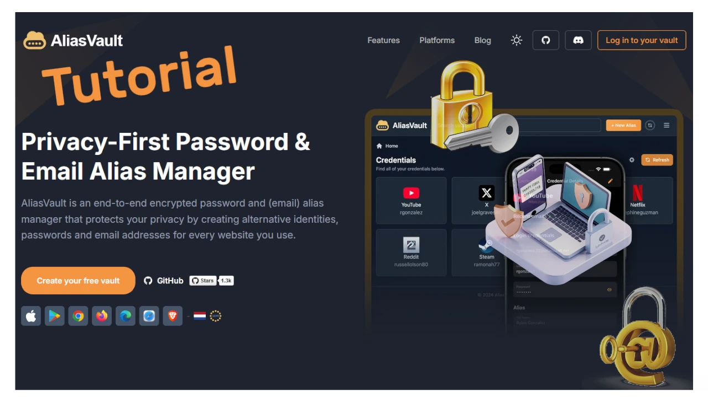


Ochrana soukromí a zabezpečení online je téma, kterému by měl každý, bez ohledu na to, v jaké oblasti podniká, věnovat velkou pozornost.


Tyto problémy jsou navíc součástí světa, který je v neustálém chaosu: do tématu se zapojuje stále více vývojářů, kteří přinášejí implementace do zavedených řešení i nových produktů.


To je případ **Leenderta de Borsta** a jeho `Alias Vault`, revolučního nástroje (prvního svého druhu), který umožňuje spravovat a ukládat hesla, používat záznamy hesel pro ověřování k webovým službám, spravovat dvoufaktorové ověřování, ale hlavně generate skutečné _aliasy_, a to vše v jediném Interface.


**Ale Alias Vault tím nekončí**.


## Klíčové vlastnosti


Alias Vault funguje v cloudu na serverech vývojáře nebo jako samostatný hosting ve vlastní infrastruktuře, což je možnost, pro kterou jsou k dispozici soubory Docker a obraz k instalaci pomocí scipt. Kromě webového Interface jsou k dispozici rozšíření pro všechny populární prohlížeče a také mobilní aplikace pro iOS a Android; ty lze stáhnout také z F-Droid, čímž se obejde oficiální obchod Google.


V jednom trezoru Interface Alias Vault je:


- Zdarma a s otevřeným zdrojovým kódem**
- Správce hesel**, do kterého se ukládají všechna složitá hesla. Pomocí rozšíření prohlížeče správce hesel dokončí přihlášení k webovým stránkám
- 2FA**, podpora dvoufaktorového ověřování
- Správce aliasů s vestavěným e-mailovým serverem**: Alias Vault nevytváří aliasy, které přeposílají e-maily do schránky uživatele, ale vytváří skutečné alter-egy, doplněné o jméno, příjmení, pohlaví, uživatelské jméno, heslo a narozeniny (pokud jsou tyto informace vyžadovány).


Součástí balíčku je rozsáhlá a důkladná dokumentace, která bude nováčky provázet při objevování tohoto výkonného nástroje.


## Žádné osobní údaje!


Začíná jako vždy na webové stránce [aliasvault.net](aliasvault.net). Jak již bylo zmíněno, Alias Vault lze používat na vlastním serveru nebo z vývojářského cloudu, abyste se s ním seznámili, než přejdete na samohostitelné řešení.


Stránky mají opravdu poutavou a dobře udržovanou grafiku, ale to nejlepší přijde, až když se vám dostanou do rukou: **založte si účet**.


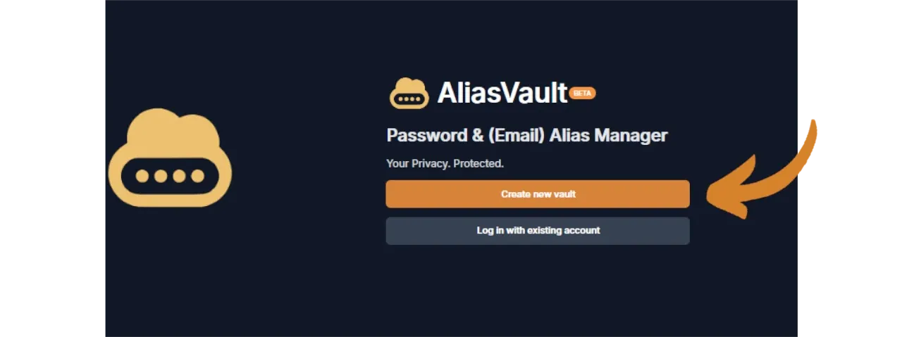


K vašemu obrovskému překvapení zjistíte, že Alias Vault nežádá žádné osobní údaje: k vytvoření účtu vám stačí jakákoli přezdívka, slovo, které je vám známé, pokud je k dispozici. Souhlasíte s podmínkami služby, vyberete slovo a pokračujete.


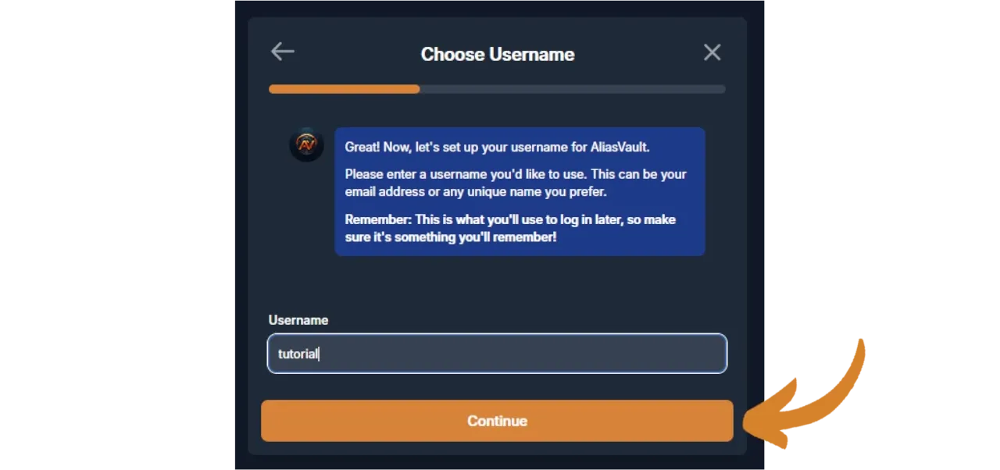


Nyní nastavte **`hlavní heslo**, které je nejdůležitějším údajem v celém novém systému. S tímto jediným heslem budete vlastně jediní, kdo bude mít k účtu přístup/bude ho moci obnovit, protože bude udržovat váš `sklad` zašifrovaný na serveru, který bude hostit vaše informace.


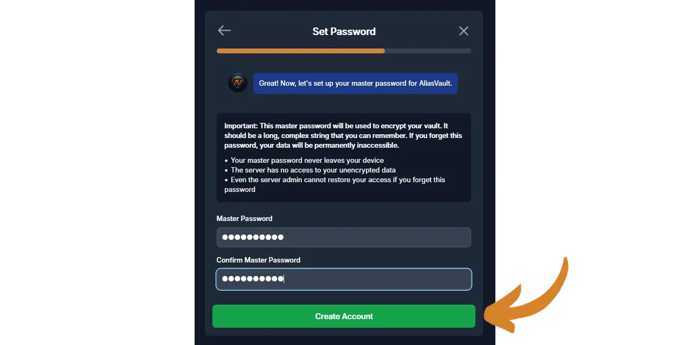


Skutečnost: Vytvořili jste si vlastní správce hesel a aliasů, ale bez uvedení vlastního funkčního soukromého e-mailu Address.


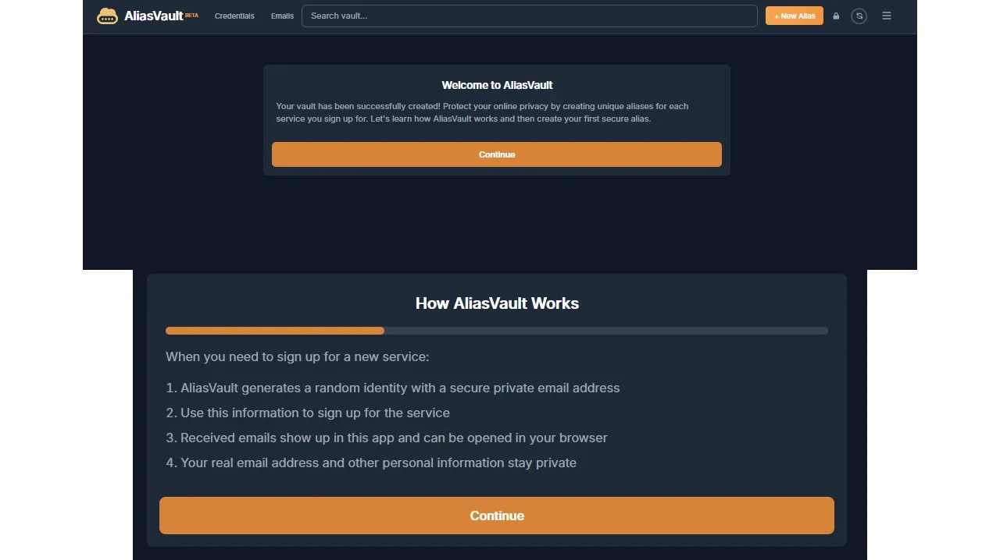


Alias Vault vás vítá v bezpečném, novém, osobním, ale také prázdném prostoru. A nyní jej začínáme trochu zaplňovat.


Pokud již máte správce hesel, můžete importovat soubor z toho, který používáte, a vyhodnotit rozdíly s jiným poskytovatelem, nebo třeba odstranit správce aliasů, abyste mohli spravovat vše v jedné aplikaci.


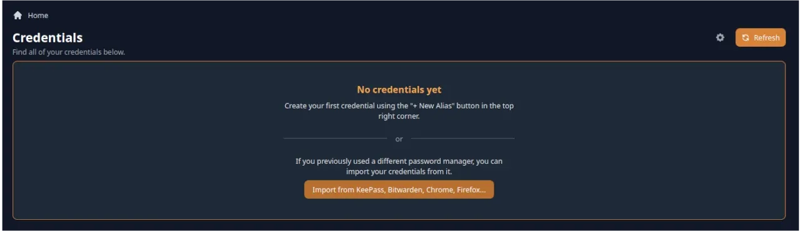


Alias Vault je velmi jednoduchý: máte jednu hlavní stránku, kterou je `Home`, se dvěma nabídkami:


- `Credentials`: umožňuje vytvářet a následně spravovat identity a aliasy
- `Email`: schránka, kde můžete kontrolovat příchozí zprávy pro vytvořené aliasy.


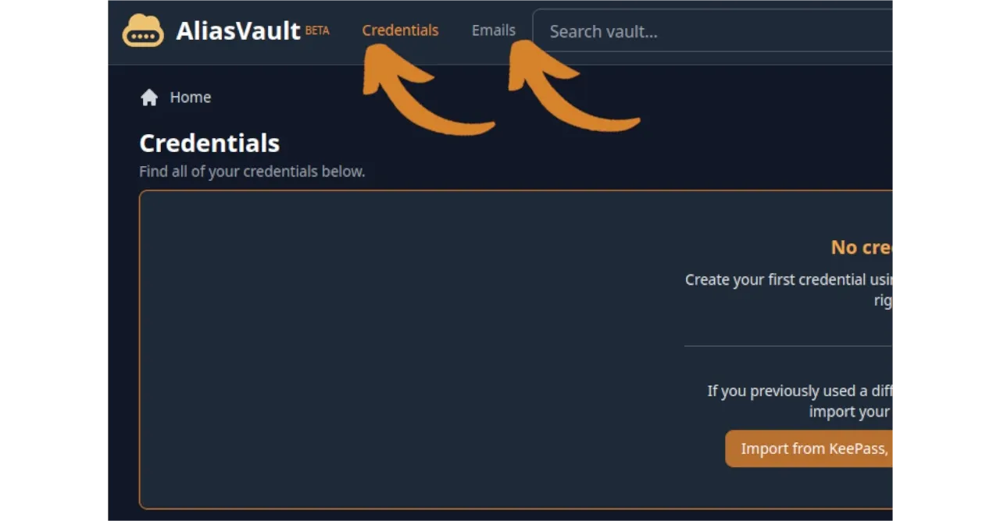


Nás zajímá vytvoření prvního `aliasu`, proto přejděte do pravého horního rohu stránky a klikněte na _+Nový alias_.


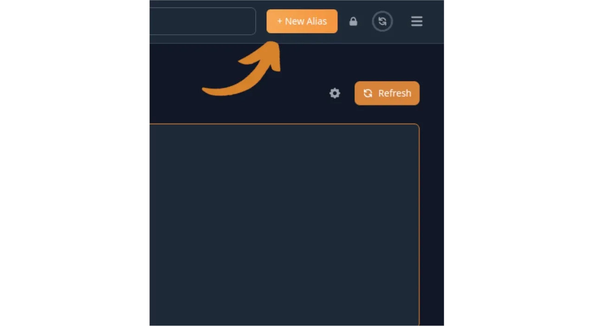


Zpočátku vypadá nabídka v souladu s filozofií Alias Vault minimálně. Chcete-li zjistit vlastnosti této funkce, klikněte na možnost _Create via advanced mode_.


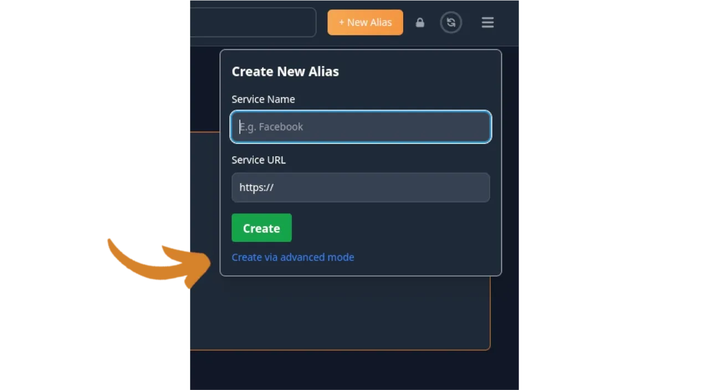


V horní části první obrazovky můžete importovat hesla, která již používáte pro služby, které máte předplacené, nebo která nejčastěji používáte online.


Pokud jste u některé z výše uvedených služeb (nebo u všech) povolili dvoufaktorové ověřování, můžete pomocí služby Alias Vault spravovat také toto dodatečné zabezpečení Layer importem klíče `secret key`. Alias Vault vytvoří `TOTP` potřebný pro přístup.


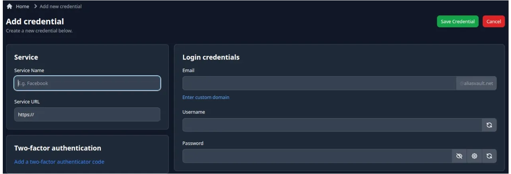


**Upozornění**: Chcete-li použít správnou doménu Address, se kterou jste dříve vytvořili účty, klikněte na _Enter custom domain_, abyste mohli za `@` nastavit správnou doménu.


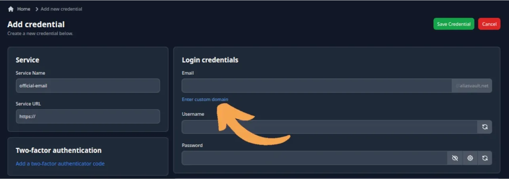


Nejzábavnější je spodní část této obrazovky. Klikněte na _Generate Random Alias_ a Alias Vault vám vytvoří samostatné identity pro různé potřeby, každou s vlastní poštovní schránkou, hesly velmi robustní úrovně, doplněnými o další údaje, jako je pohlaví, datum narození a vhodná přezdívka.


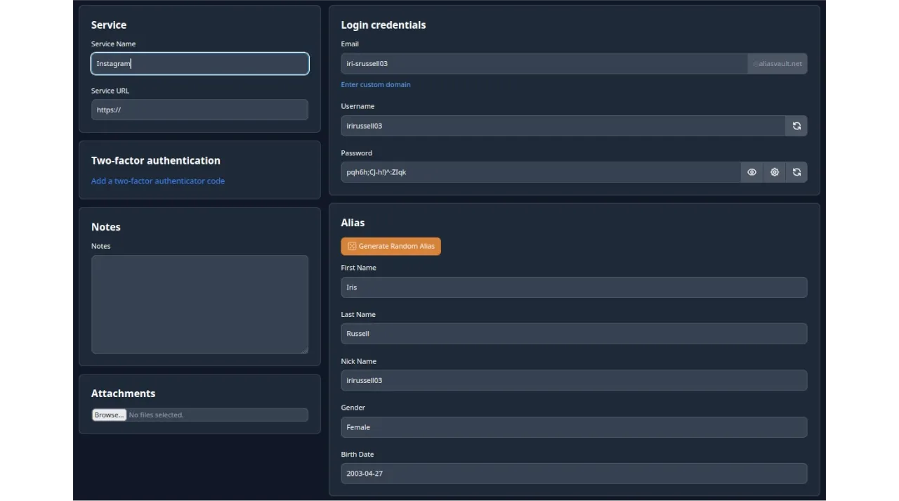


V příslušné nabídce můžete změnit nastavení, která ovlivňují generování hesla, například zvolit pouze malá písmena a odstranit znaky, které mohou být nejednoznačné.


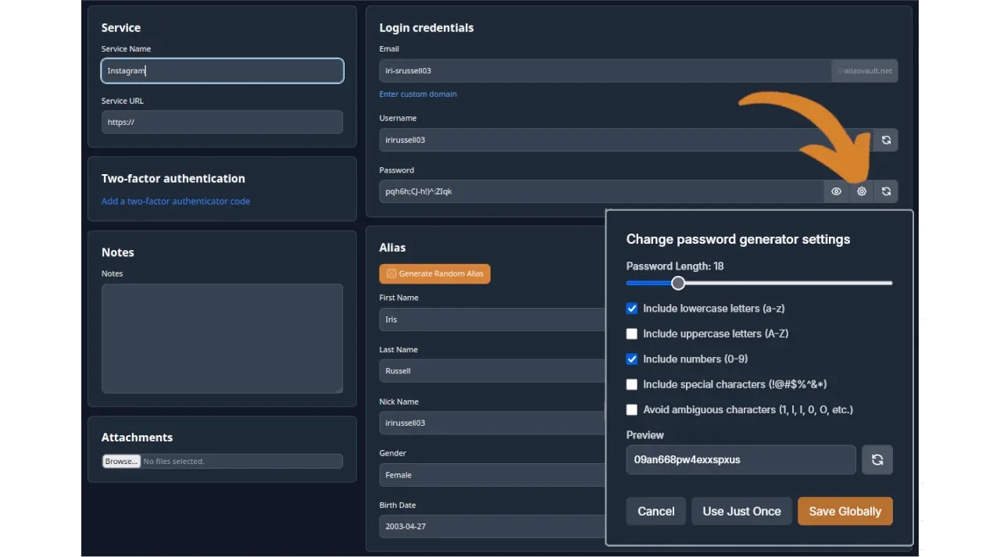


Můžete použít alias e-mailu navržený Alias Vault nebo změnit domény, pokud kliknete na příslušnou rozevírací nabídku.


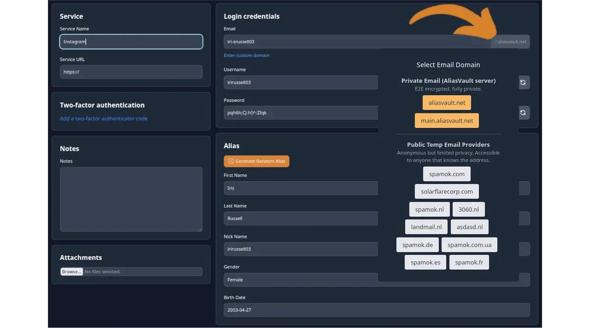


Před použitím této e-mailové schránky pro přihlašovací službu můžete otestovat její funkčnost odesláním zprávy z vlastní schránky Address do nově vytvořené schránky.


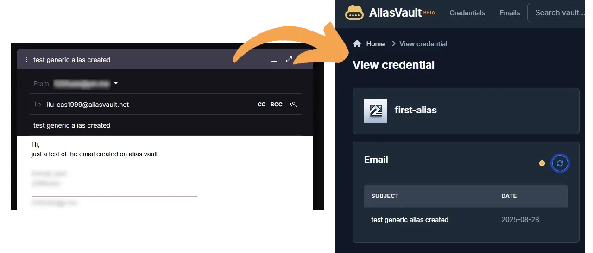


**⚠️ VAROVÁNÍ**: Příjem e-mailů je možný díky vestavěnému serveru Alias Vault, který však umožňuje pouze přijímat e-maily, nikoliv na ně odpovídat nebo používat e-mailovou schránku s "běžnými" funkcemi služby `alias`. Tím se výrazně liší od platforem Simple Login, Addy a dalších, které jsou určeny výhradně pro tento typ služeb. Příklad Simple Login si můžete prohlédnout ve specializovaném tutoriálu:


https://planb.network/tutorials/computer-security/communication/simple-login-c17a10d6-8f84-4f97-8d50-7a83428d0f41

Chcete-li odstranit alias, který jste vytvořili jako test, stačí se přihlásit do složky `Home`, poté do složky `Credentials` a kliknout na identitu, kterou chcete odstranit. V pravém horním rohu se zobrazí příkaz _Delete_, který můžete použít.


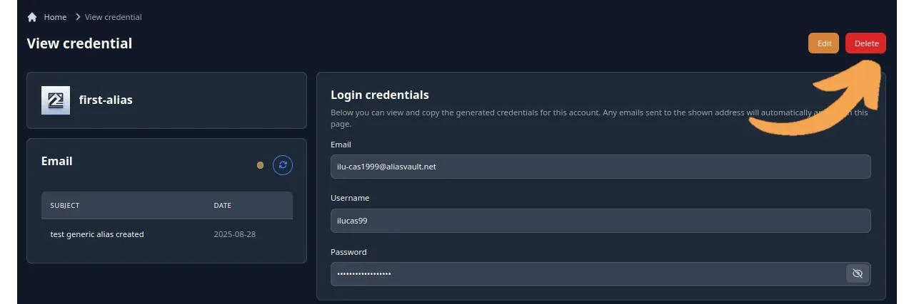


## Rozšíření prohlížeče


Podle toho, jaké jsou vaše potřeby, můžete použít rozšíření prohlížeče, které lze nalézt v nejrozšířenějších prohlížečích.


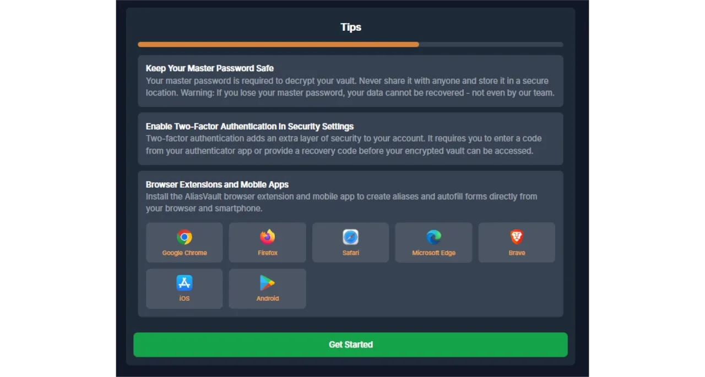


Instaluje se stejně jako všechna ostatní rozšíření, takže se tímto detailem nebudu zabývat.


Rozšíření prohlížeče slouží k usnadnění přihlašování k online službám nebo k vytváření nových aliasů podle potřeby: pokud je služba uložena mezi záznamy v Alias Vaultu, automatické vyplňování provede, co je třeba.


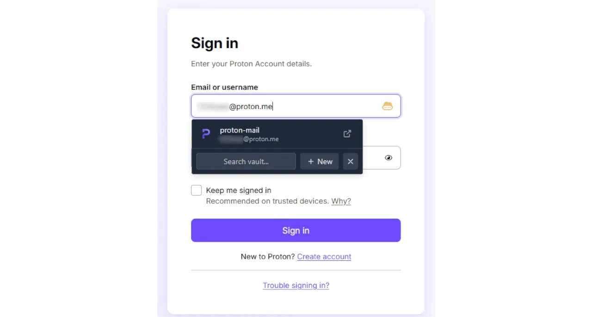


Jediným upozorněním je ověřit, zda je Alias Vault aktivní. Aplikace má totiž výchozí nastavení, podle kterého se po určité době nečinnosti pozastaví. To je velmi užitečná funkce, **pokud se například musíte vzdálit od počítače a zabránit tak přístupu k vašim účtům někomu jinému**. Zjednodušený postup vám umožní znovu se přihlásit zadáním `hlavního hesla`, pokud je předchozí relace stále v mezipaměti. Doba odhlášení je jedním z parametrů, které si můžete přizpůsobit a zkrátit nebo prodloužit podle svých preferencí.


## Mobilní aplikace


Stejně jako všechny podobné aplikace má i Alias Vault verzi pro mobilní zařízení, a to jak pro Android, tak pro iOS. V případě systému Android si aplikaci můžete stáhnout ze stránky [F-Droid](https://f-droid.org/packages/net.aliasvault.app/).


V době psaní tohoto článku (koncem srpna 2025) byla v mobilní aplikaci funkce `automatické vyplňování` považována za experimentální a nefungovala až na několik málo webů. Dokud nebude plně implementována, vyžaduje používání Alias Vault v mobilu kopírování/vkládání dat.


Po stažení aplikace z obchodu se jednoduše přihlásíte zadáním uživatele a hesla `master` vytvořeného ve webové aplikaci.


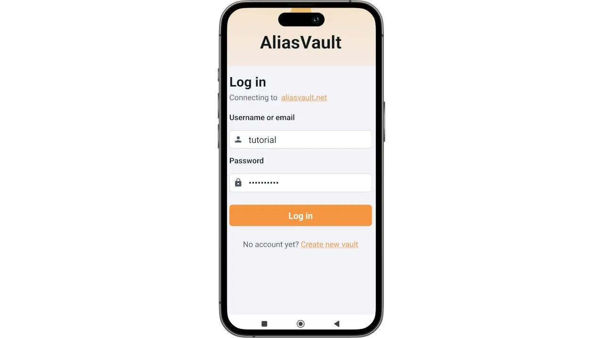


Při otevírání trezoru budete dotázáni, zda chcete povolit biometricky řízený přístup, což je další bezpečnostní prvek Layer, který zabrání přístupu k vašim heslům někomu jinému, kdo má náhodou v ruce váš telefon.


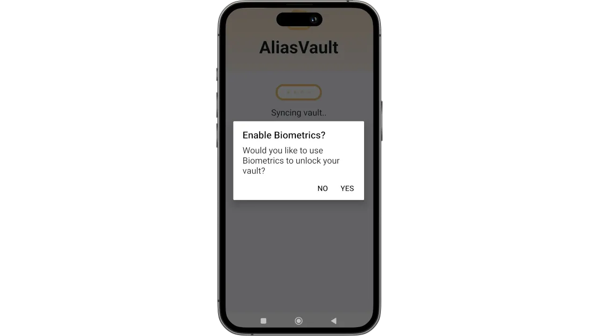


Pokud se rozhodnete nastavit biometrickou kontrolu, pusťte se do toho. Pokud tento krok přeskočíte a rozmyslíte si to, můžete jej nastavit i později v nabídce _Nastavení_.


Po dokončení přihlášení se znovu synchronizují již vytvořená data.


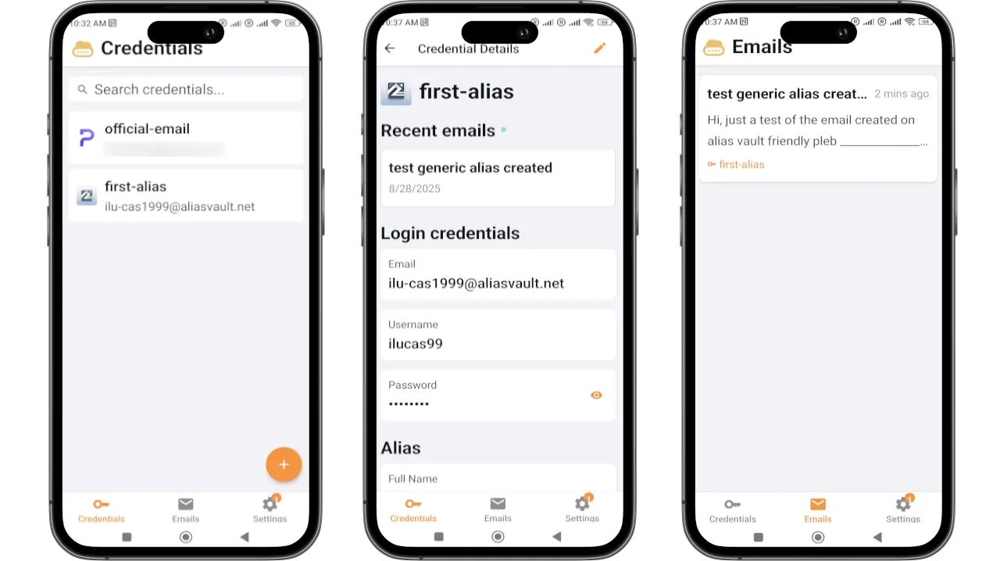


Mobilní aplikace může být přesměrována na odkaz na `vault` umístěný na vlastním serveru.


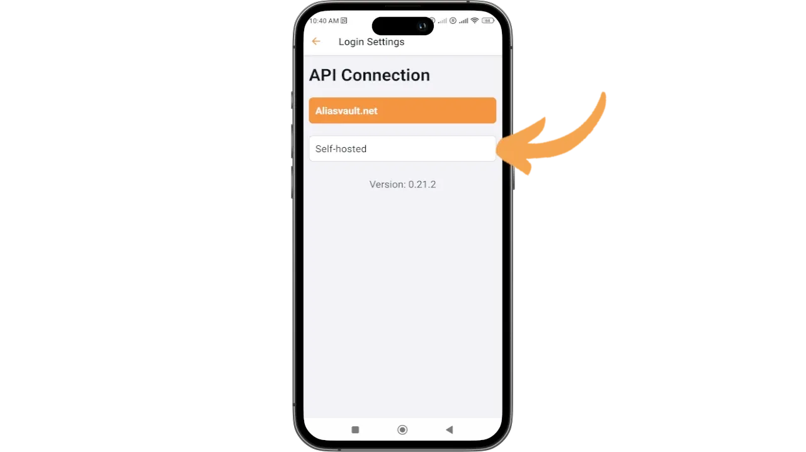


A právě tuto verzi, která je určena pro vlastní potřebu, budeme v následující části stručně popisovat.


## Self-Hosting: plná kontrola nad daty


Alias Vault, abychom byli spravedliví, není první `správce hesel`, který umožňuje nasazení služby na vaší infrastruktuře. Existují i jiné, ale některé z nich mají buď omezení, nebo jsou částečně uzavřené.


Tato příležitost je jedinečná: **Ukončete závislost na externích poskytovatelích služeb nebo cloudech, ale používejte vlastní lokální server k ochraně a správě hesel, aliasů a mimořádně citlivých informací s tím spojených**. Díky službě Alias Vault můžete také nechat e-mailovou službu odkázat na vlastní e-mailový server, což zvýší důvěrnost.


Je čas obrátit se na [dokumentaci](https://docs.aliasvault.net/installation/) a zjistit, jak postupovat při vlastním hostování Alias Vault.


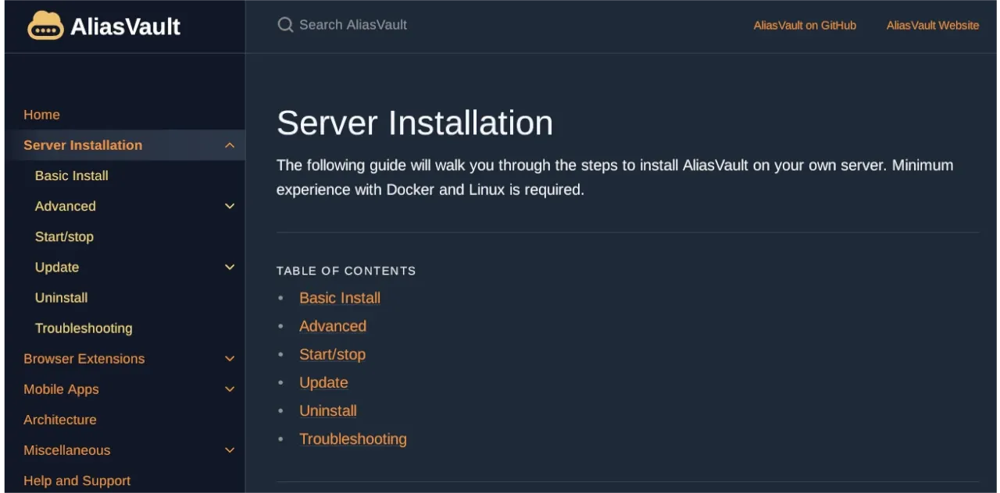


Alias Vault běží na platformě Docker Compose, takže jsou vyžadovány minimální zkušenosti s Linuxem a Dockerem. Můžete začít se základní instalací a poté ji doplnit o pokročilejší řešení.


Váš server musí běžet na 64bitovém počítači s distribucí Linuxu, 1 GB paměti RAM a alespoň 16 GB úložiště; verze Docker (CE) musí být alespoň 20.10 nebo vyšší, zatímco Docker Compose vyžaduje verzi od 2.0 výše.


Rozhodl jsem se vyzkoušet Alias Vault na tenkém klientovi, na kterém je nainstalován DietPi jako distribuce, základ Debian Bookworm, optimalizovaný na nejnutnější a již spuštěný `Docker` a `Docker Compose`.


Nejprve si pro pořádek vytvořte adresář ve svém domovském adresáři, otevřete `terminál` a vložte příkaz pro spuštění instalačního skriptu.


```bash
curl -L -o install.sh https://github.com/lanedirt/AliasVault/releases/latest/download/install.sh
```


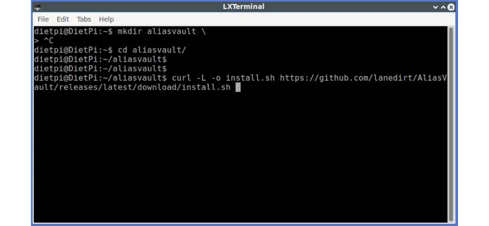


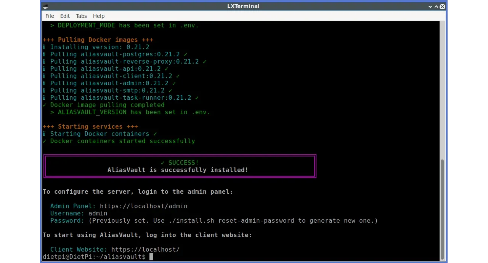


Po dokončení instalace najdete přihlašovací údaje pro přístup:


```
Admin Panel: https://localhost/admin
Username: admin
Password: yyy0xyx1yxy2zxx4
```


Po instalaci zkontrolujte obsah adresáře.


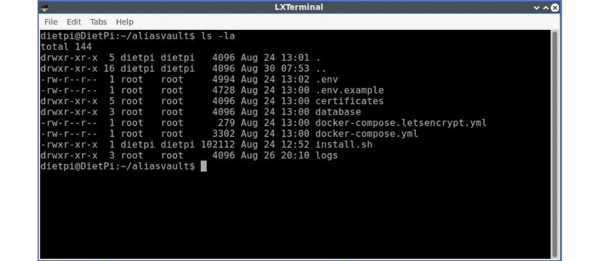


Chcete-li spustit Alias Vault, použijte příkaz:


``` Launch-Alias-Vault


./install.sh start


```

Alias Vault adesso gira sul tuo server personale.

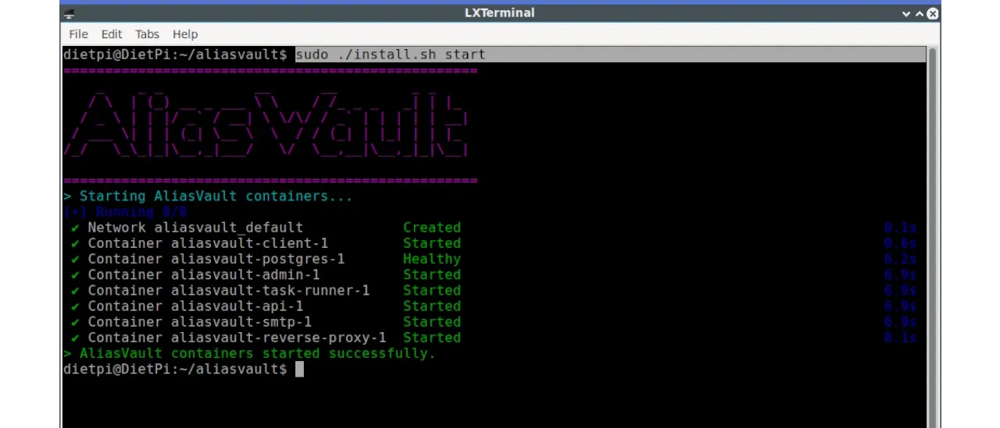

Apri un browser e digita l'url: ti comparirà la pagina per fare login come `Admin` di Alias Vault.

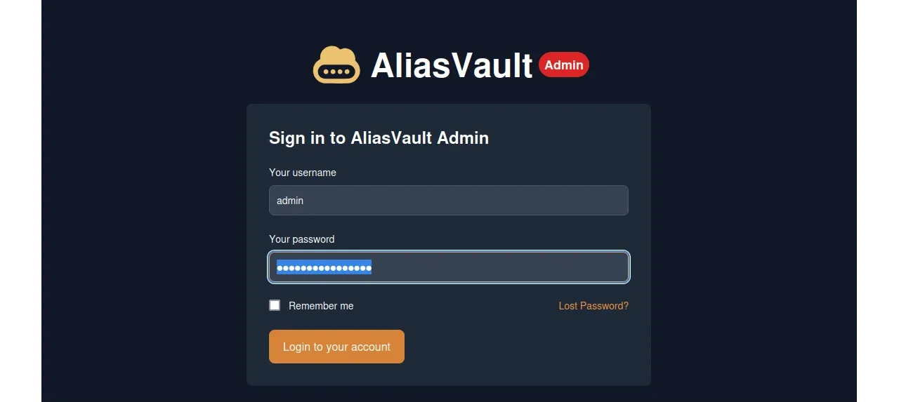

Il più è fatto! Hai davanti a te il pannello per amministrare Alias Vault in maniera personalizzata.

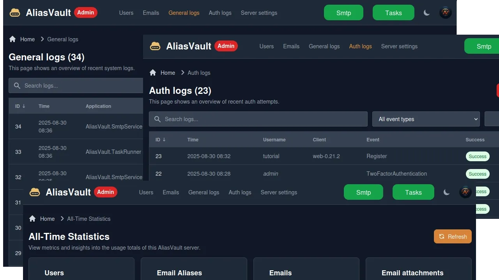

Da questa interfaccia, potrai controllare quanti e quali utenti stanno utilizzando il servizio, limitarne l'uso, cancellare gli utenti (azione irreversibile) e soprattutto controllare tutti i `log`.

Se si tratta di una nuova installazione, non avrai altri utenti oltre ad `admin`; per crearne di nuovi, apri un'altra `tab` del browser e digita:

```


localhost/user/start


```

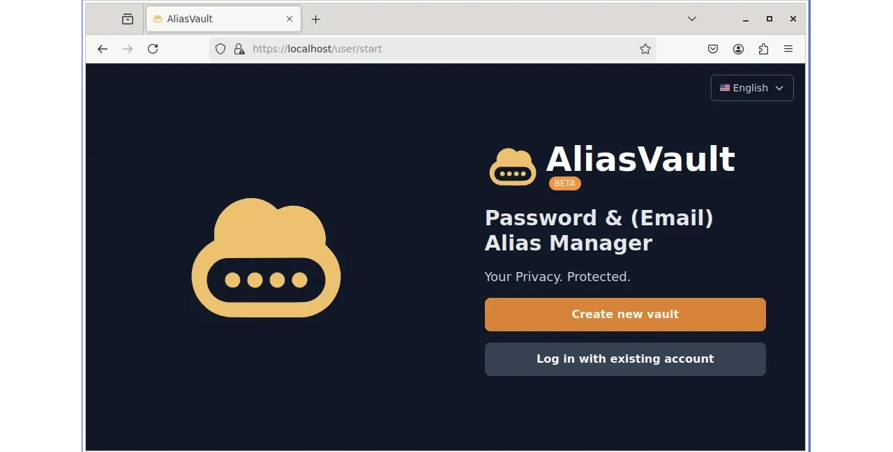

Da qui in poi, tutto procede come abbiamo visto in precedenza nella guida, con la differenza che adesso stai usando Alias Vault sul tuo server. Se la tua macchina è adeguatamente configurata e protetta, questo è un modo elegante e sicuro di gestire un tuo password e alias manager, senza servizi di terze parti.

Per fermare Alias Vault, torna al terminale e digita:

``` Stop-Alias-Vault
./install.sh stop

```


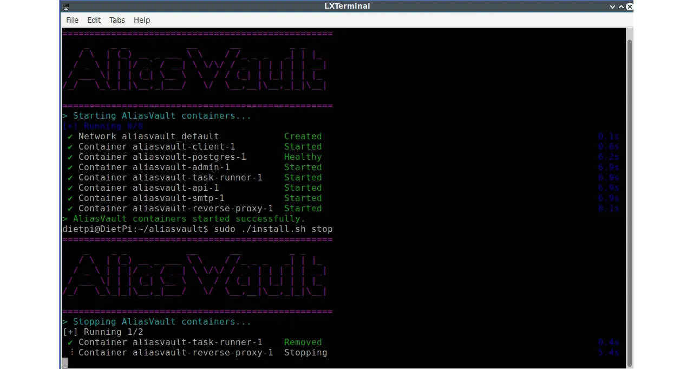


## Úvahy o šifrování a zabezpečení


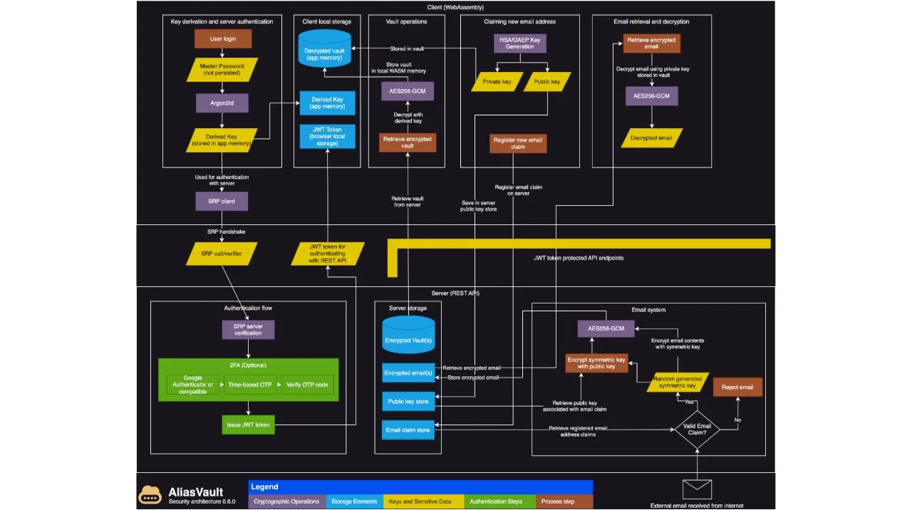


Podle toho, co Lanedirt uvádí na webu, v dokumentaci a na Githubu, **všechny informace (komponenty), které umístíte na Alias Vault, zůstanou pevně svázány se zařízením, zašifrovány a nepřístupné pro každého, kdo nezná `hlavní heslo`**.


Hlavní heslo je tedy základním prvkem celého trezoru. Po jeho zadání je zpracováno algoritmem `Argon2id`, což je funkce pro odvození klíče z paměti Hard, aby se zabránilo tomu, že tajemství opustí zařízení.


Vše zůstává skryto i před správcem cloudu nebo hostingových služeb. Z panelu správce se totiž k údajům o uživateli nedostanete, můžete se pouze dozvědět, zda si vytvořil aliasy, přijal e-maily, a jen máloco dalšího.


Veškerý uložený obsah je šifrován a dešifrován pomocí kryptografických klíčů odvozených od `hlavního hesla`. **Na serveru jsou uložena pouze zašifrovaná data, nic se nezobrazuje jako prostý text**. Pokud uživatel zapomene nebo ztratí své `hlavní heslo`, účet s ním spojený je nenávratně ztracen, protože server nemá přístup k obsahu v prostém textu.


Pro samostatně hostovanou verzi je k dispozici skript pro resetování `hlavního hesla`, který však nezabrání ztrátě dat.


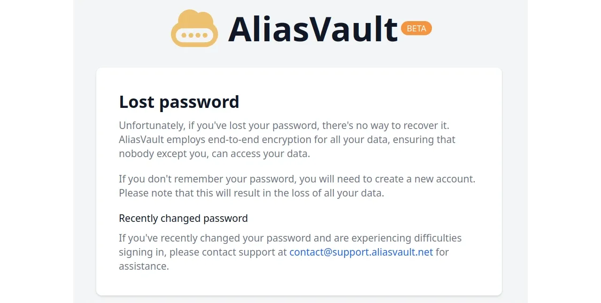


Vzhledem k tomu, že Alias Vault je ve fázi _Beta_, může být přístup k němu obtížný, pokud změníte/aktualizujete hlavní heslo. Doporučuji, abyste ho od začátku zvolili robustní a složité, abyste mohli se službou experimentovat a případně se rozhodnout, zda ji budete používat. Pokud budete mít po aktualizaci hesla potíže s přístupem do cloudu, obraťte se na podporu služby Alias Vault.


Pro úplné pochopení architektury a zabezpečení Alias Vault vám důrazně doporučuji prostudovat si [tuto stránku](https://docs.aliasvault.net/architecture/), která obsahuje podrobnosti o kryptografii, jež je základem jeho fungování.


## Silniční mapa


Záměrem vývojářů je, aby byl Alias Vault do konce roku 2025 zralý a stabilní a aby bylo možné definovat jeho budoucí vlastnosti.


Alias Vault je a vždy zůstane open source a zdarma, ale pravděpodobně ne neomezeně jako v beta verzi. Některé placené funkce jsou v procesu implementace, jak již bylo oznámeno.


K dispozici jsou týmové/rodinné plány a podpora hardwarových klíčů, které slouží k ověřování pomocí FIDO2 nebo WebAuth.


## Kdo potřebuje Alias Vault


**Tento nástroj je ideální pro každého, komu záleží na soukromí online**.


Vaše identita je s velkou pravděpodobností základem podnikání, které provozujete online, a je třeba ji všemi prostředky chránit, aby se **tyto** údaje nedostaly do rukou služeb, společností a zprostředkovatelů, kteří jsou ochotni udělat cokoli, aby se dostali k vašemu chování online.


Alias Vault vám vrací úplnou kontrolu nad vašimi přihlašovacími údaji, čímž zmírňuje nebo zcela odstraňuje nutnost spoléhat se na třetí strany při ochraně a šifrování vašich nejcitlivějších dat.


Architektura a kryptografické vybavení Alias Vault jsou ideální pro suverénní jednotlivce, malé a střední podniky, vývojové týmy a všechny nadšence do **open source** aplikací. Pokud patříte do některé z těchto kategorií: užijte si objevování Alias Vault.