___

*Iyi nyigisho ishingiye ku bintu vy’umwimerere vya Florian BURNEL vyasohowe kuri [IT-Connect](https://www.it-connect.fr/). Uruhusha [CC KURI-NC 4.0](ku rubuga rwacu/uruhusha/ku-NC/4.0/). Birashoboka ko hari ivyo bahinduye mu canditswe c’intango.*

___

## I. Ugushikiriza

Ni gute ushobora gucapura urubuga rwa Windows kugira ngo ubone amashini ahuye mu buryo bwihuse kandi bworoshe? Inyishu ni Scanner IP y’ishavu. Uyu mugambi w'inkomoko yuguruye ushobora kugufasha gucapura urubuga mu buryo bworoshe, ukoresheje igishushanyo coroshe gukoresha Interface.

Ico gikoresho gishobora gukoreshwa n’abantu ku giti cabo kugira ngo **basuzume urubuga rwabo rwo mu karere**, ariko kandi n’abahinga mu vy’ubuhinga bwa none ku ntumbero imwe. Ikimenyamenya c'uko **iki gikoresho gikora cane**, caramaze gukoreshwa n'**imigwi imwe imwe y'abagizi ba nabi bo kuri internet** mu gucapura imihora y'amashirahamwe (mu buryo bumwe na Nmap). Akarorero keza ni [umugwi w’abacunguzi RansomHub](https://www.it-connect.fr/deja-210-abakozweko-ncungu-mu-mugwi-w’abacunguzi-mu-kubera-mu-2024/). Ni porogarama nziza, ariko nk’uko biri ku bindi bikoresho vy’urubuga n’umutekano, gukoresha nabi birashobora gukoreshwa nabi.

Aha, tuzoba turiko turayikoresha kuri **Windows 11**, ariko birashoboka cane ko tuyikoresha ku zindi verisiyo za **Windows**, no kuri **Linux** na **macOS**.

**Angry IP** Scanner ntaco ikora nk'iya Nmap, iracari iryoshe kubera isesengura ryihuse, ry'ishimikiro ry'urubuga, ariko kandi kubera ko iri mu vyo umuntu wese ashobora kuyironka. Izo **menya abashitsi bahuye n'urubuga** kandi imenye **amazina y'abashitsi** na **ifunguro ry'ivyambu**.

Niba ushaka kuja kure, raba inyigisho iri kuri Nmap:

https://planb.network/tutorials/computer-security/communication/nmap-862300d7-6dfb-4660-970d-f56a9f58f60d

## II. Gutangura n'Igikoresho co Gupima IP c'Ishavu

### A. Gukuraho no gushiramwo igikoresho co gupima IP c'ishavu

Ushobora gukuraho verisiyo nshasha ya Angry IP Scanner ku rubuga rwemewe rw’iyi porogarama canke kuri GitHub. Tuzokoresha uburyo bwa nyuma. Fyonda kuri iyi nzira iri musi maze ubone verisiyo ya EXE: "**ipscan-3.9.1-setup.exe**".

- [Igikoresho co gupima IP gishavuye GitHub](ibara ry'agahama/ipscan/ibisohoka/ivya nyuma)

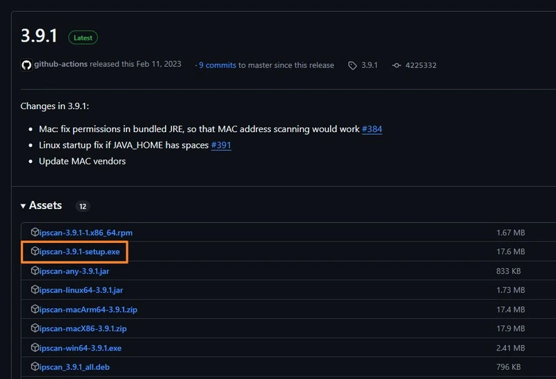

Gukoresha executable kugira ngo ukomeze gushiramwo. Nta kintu kidasanzwe umuntu yokora mu gihe co gushiramwo.

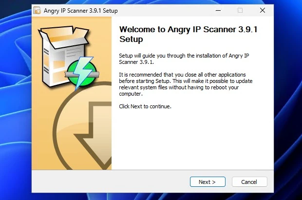

### B. Gukoresha urubuga rwa mbere

Ku gutangura kwa mbere, fata umwanya wo gusoma amabwirizwa ari mw'idirisha rya "**Gutangura**" kugira ngo umenye vyinshi ku buryo igikoresho gikora. Ariko rero, hariho amajambo menshi yo kwiyumvira:

- Feeder**: module ishinzwe gutanga urutonde rw’amaderesi ya IP azosuzumwa, kuva ku rutonde rwa IP rudasanzwe canke dosiye ifise urutonde rw’amaderesi ya IP.
- Fetcher**: umugwi w'ibice vyo kuronka amakuru yerekeye abashitsi ku rubuga. Hariho nk’akarorero, ama fetchers yo kumenya amaderesi ya MAC, gucapura ivyuho, kumenya amazina y’abashitsi canke kohereza ibisabwa vya HTTP.

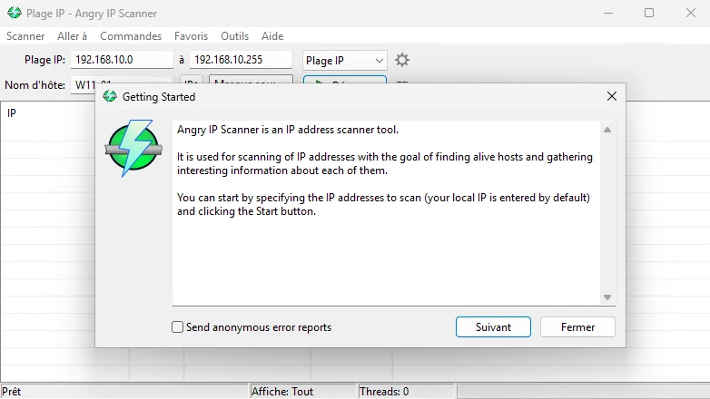

Kugira ngo ukore scanner y'urubuga rwa IP, ushobora gusa kwinjiza **IP Address** y'intango na **IP Address** y'iherezo mu kibanza ca "**IP range**" (ahandi ho, hindura ubwoko buri iburyo). Hanyuma ukande kuri buto ya "**Start**".

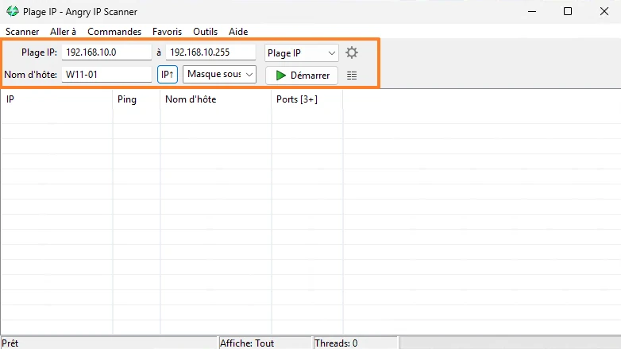

Haciye amasegonda mirongo mikeyi, igisubizo kizoboneka muri Interface ya porogarama. **Ku IP Address yose iri mu rutonde rwasuzumwe, uzobona nimba Angry IP Scanner yabonye umushitsi canke atarivyo.** Incamake izoboneka kandi ku rubuga, yerekana umubare w’abashitsi bakora (muri iki gihe 6) n’umubare w’abashitsi bafise ivyuho vyuguruye.

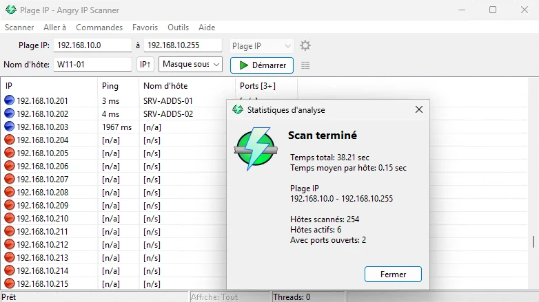

Aha, turashobora kubona ukubaho kw'umushitsi yitwa "**OPNsense.local.domain**", afitaniye isano n'IP Address "**192.168.10.1**" kandi ashobora gushikwako ku **ibibanza 80** na **443** (HTTP na HTTPS). Gukanda iburyo kuri host bitanga uburenganzira bwo kuronka amabwirizwa y'inyongera, nk'ugukora ping, gukurikirana inzira no gufungura umucukumbuzi biciye kuri iyi IP Address.

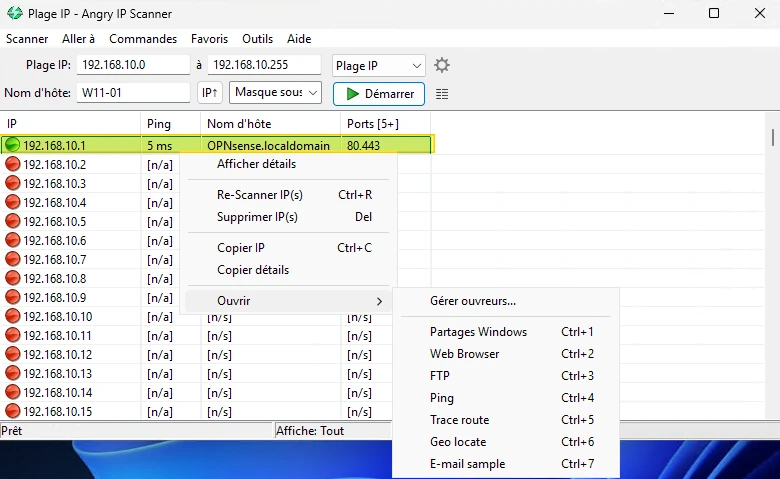

### C. Wongereko ivyuho vyo gupima

Ku mburabuzi, **Igikoresho co gupima IP gishavuye** kizopima ivyuho 3: **80** (HTTP), **443** (HTTPS) na **8080**. Ushobora kwongerako ibindi bibanza vyo gupima bivuye ku vyo ukunda vy'ikoreshwa. Fyonda ku rutonde rwa "**Ibikoresho**", hanyuma ku rutonde rwa "**Ivyuma**".

Aha, ushobora guhindura urutonde rw'ivyambu biciye ku mahitamwo ya "**Ihitamwo ry'ivyambu**". Ushobora **kwerekana inomero z'ivyambu zitandukanye zitandukanijwe n'agacamuzingi, canke ibice vy'ivyambu**. Akarorero kari aha hepfo bongerako ivyuho bibiri: **445** (SMB) na **389** (LDAP). Kugira ngo ushiremwo ivyicaro kuva kuri 1 gushika kuri 1000, shiramwo "**1-1000**". Ntibisobanuwe nimba port scans zikorwa muri TCP, UDP canke zompi.

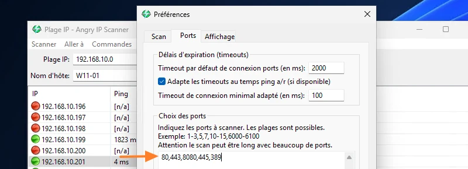

Niwasubira gukoresha iyo scanner, birashoboka ko uronka amakuru mashasha. Mu karorero kari musi, Angry IP Scanner imbwira ko ivyuho 389 na 445 vyuguruye ku bashitsi "**SRV-ADDS-01**" na "**SRV-ADDS-02**", bivuye ku ntunganyo nshasha y'ivyuho bizocapurwa.

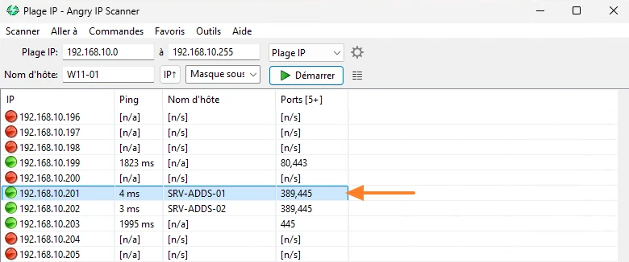

**Iciyumviro**: kuva ku rutonde rwa "**Scanner**", ushobora kwohereza hanze ibisubizo vya scan muri dosiye y'inyandiko.

Niba wifuza gutera imbere, kanda kuri "**Ibikoresho**", hanyuma ukande kuri "**Abarondera**". Ivyo vyongera "ubushobozi" ku vyo gupima. Hitamwo gusa fetcher maze uyishire ibubamfu kugira ngo uyikoreshe. Ivyo bizokwongerako iyindi nkingi ku gisubizo co gupima.

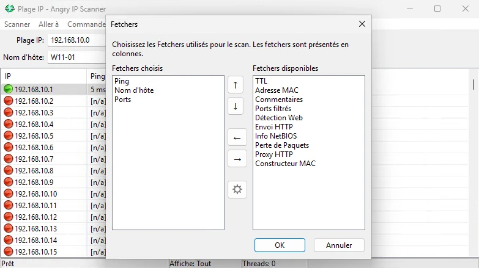

Akarorero kari musi kerekana ibikorwa vya "**amakuru ya NetBIOS**" na "**Gutahura urubuga**". Irya mbere ritanga amakuru y’inyongera nka MAC Address y’imashini n’izina ry’urubuga, mu gihe irya kabiri ryerekana umutwe w’urubuga (ivyo bishobora gutanga ikimenyetso c’ubwoko bw’umurongo w’urubuga canke porogarama).

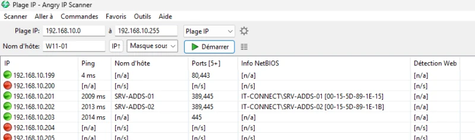

Ubwa nyuma, uhereye ku vyo ukunda, urashobora kandi guhindura uburyo bukoreshwa kuri "**ping**", ni ukuvuga ko wihweza nimba umushitsi akora canke atari. Kubera ko hari abashitsi badasubiza ama ping, ivyo bigufasha kugerageza ubundi buryo (pakete ya UDP, itohoza ry’icuma ca TCP, ARP, ihuriro rya UDP + TCP, n’ibindi).

## III. Iciyumviro

Biroroshe kandi birakora neza: Angry IP Scanner imenya abashitsi bahuye n’urubuga, kandi ikagufasha gutunganya ivy’ugucapura ivyuho. Ku bijanye n’amahitamwo, ntabwo ari uguhinduka nka Nmap, kandi ntija kure, ariko ni intango nziza yo gucapura vyihuse.

Niba ushaka gukoresha **Nmap** n'igishushanyo Interface, ushobora gukoresha **ikoreshwa rya Zenmap** (raba incamake iri musi).

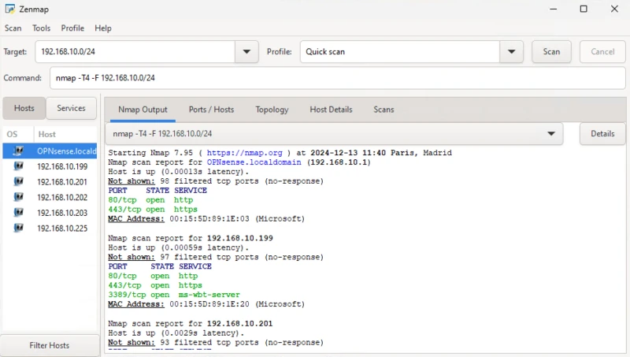

https://planb.network/tutorials/computer-security/communication/nmap-862300d7-6dfb-4660-970d-f56a9f58f60d