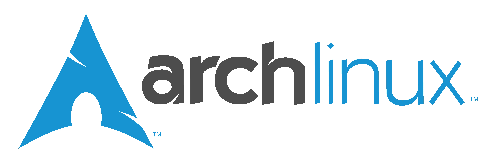


Arch Linux is a distribution renowned for its robustness, performance and adaptability, particularly for development purposes. It offers excellent stability and an environment conducive to customization, supported by an extremely fast and reliable package manager. Its philosophy is based on the **KISS** (*Keep It Simple, Stupid*) principle: to offer a light, simple, fast and uncluttered distribution, while leaving a great deal of freedom to the user.


## Why choose Arch Linux?


- Free and open source**: Like most Linux distributions, Arch Linux is totally free. There are no license fees, making it an excellent choice for students, freelancers or enthusiasts.
- KISS** philosophy: Arch is designed to be simple, light and efficient. It provides only the essentials, allowing you to build your environment à la carte.
- Pacman** package manager: Pacman is a fast, reliable and well-designed package manager. It enables efficient installation and updating of software, and manages dependencies with precision.
- Comprehensive documentation and an active community**: the [Arch Wiki](https://wiki.archlinux.org) is probably one of the best technical documentations in the Linux world. It's a gold mine for understanding what you're doing. The community, mostly made up of experienced profiles, is very active and can help you if you get stuck, provided you've done a bit of research beforehand.


## Installation and configuration


### Prerequisites


Materials required:


- A USB key of at least **8 GB**
- 2 GB** RAM minimum
- A computer with at least 20 GB of free disk space


### Download


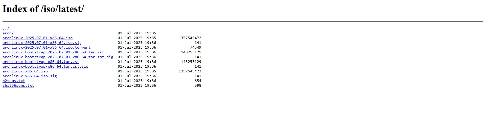


Since 2017, Arch Linux no longer supports 32-bit architectures. Only 64-bit versions are available.


- Visit [the official website](https://mir.archlinux.fr/iso/latest/) to download the latest official version of the ISO image.


### Create a bootable key


To create a bootable USB flash drive, you can use a tool like **Balena Etcher**:


- Download Balena Etcher from the [official website](https://etcher.balena.io).
- Launch the software, select the Arch Linux ISO image.
- Choose your USB key as target device.
- Click on **Flash** to start creating the bootable key.


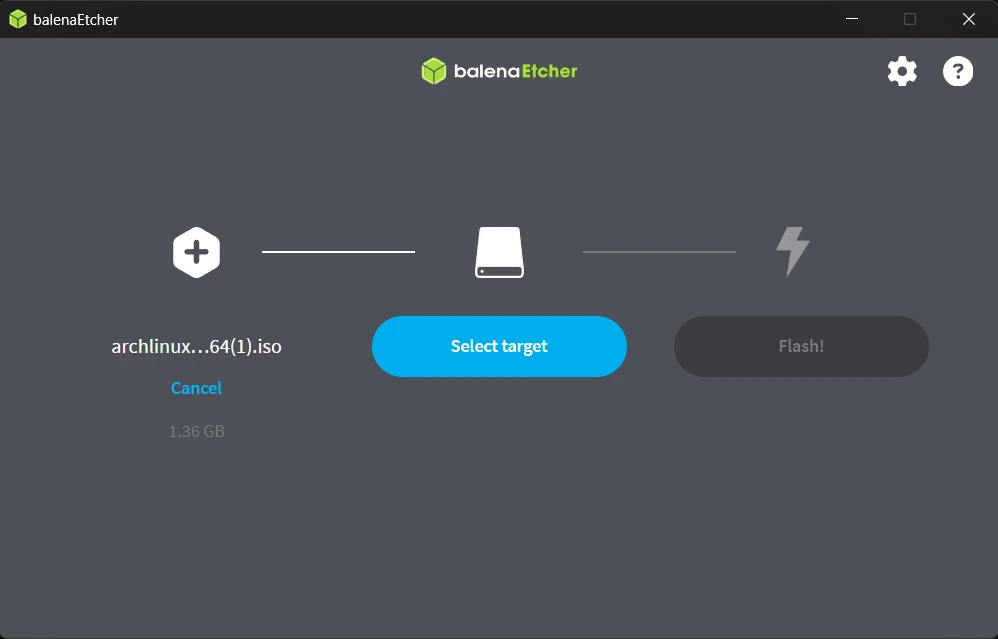


## Installing Arch Linux


## Booting on USB key


- Switch off your computer completely
- Plug in the bootable USB key
- Reboot and enter BIOS/UEFI by pressing **F1**, **Escape**, **F9**, etc. (depending on your model)
- In the boot menu, choose the USB key as the boot device. If everything is set up correctly, you'll be taken to the Arch Linux Interface boot screen.


## Launching the installation


On the boot screen, choose the first option to launch the installation. Note that Arch Linux does not offer a graphical installer. Once launched, you'll be taken to a terminal in root mode.


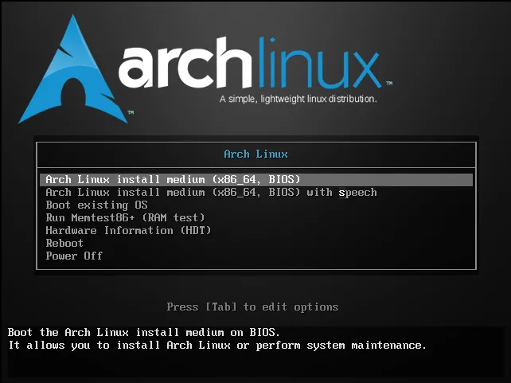


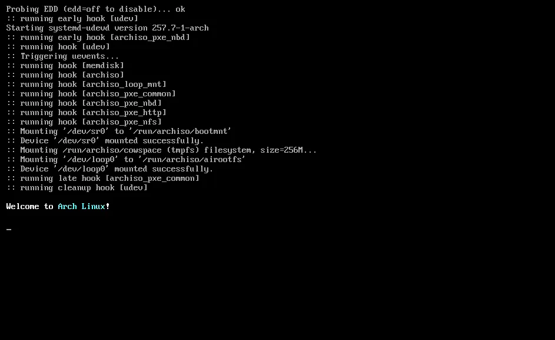


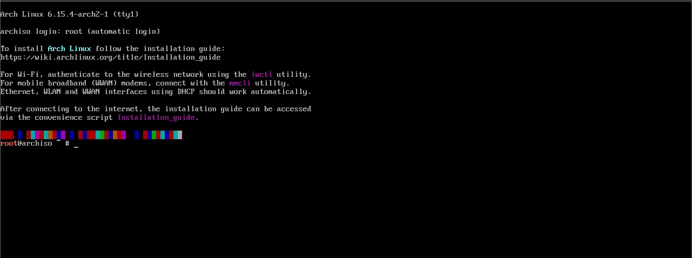


### Keyboard configuration


You can display the available layouts with:


```shell
localectl list-keymaps
```


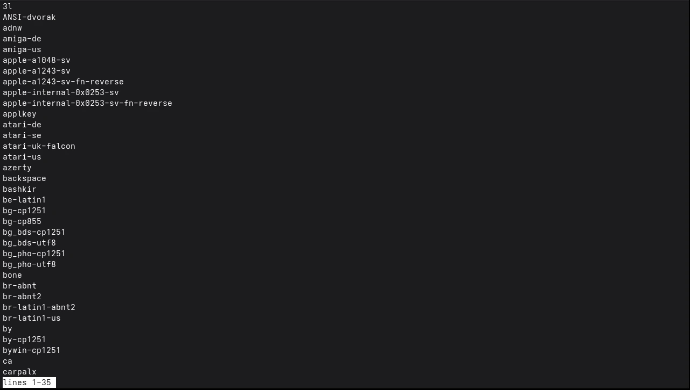


Then load a layout with:


```shell
loadkeys nom-disposition
```


By default, the keyboard is in English (qwerty), but you can switch to `azerty` with `loadkeys fr`.


### Setting date and time


Arch Linux uses the `timedatectl` tool to manage the system clock.


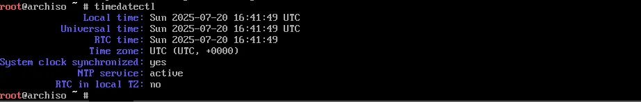


- Set your time zone with:

```shell
timedatectl set-timezone Europe/Paris
```


- Check that automatic synchronization is enabled with:

```shell
timedatectl status
```


- Activate it if necessary:

```shell
timedatectl set-ntp true
```


This activates NTP, the protocol for automatic synchronization with time servers. This step is important to avoid date errors when installing packages or configuring SSL certificates later on.


### Disk partitioning


- Check if your system boots in **UEFI** or **BIOS** with:


```shell
ls /sys/firmware/efi
```


If the file exists, you are in **UEFI**. Otherwise, you are in **BIOS (Legacy)**.


- List the available disks:

```shell
lsblk
```


- Start Partition Manager:


```shell
cfdisk /dev/nom-du-disque
```


Choose **GPT** if you are in UEFI, **DOS** if you are in BIOS.


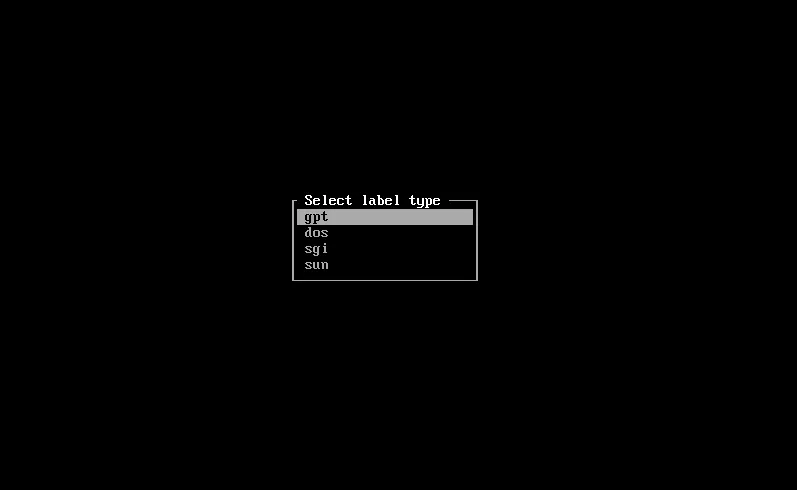


#### Scores to create


- In UEFI** mode


| Point de montage sur le système installé | Partition                 | Type de partition       | Taille suggérée |
| ---------------------------------------- | ------------------------- | ----------------------- | --------------- |
| /boot1                                   | /dev/efi_system_partition | Partition système EFI   | 1 Go            |
| [SWAP]                                   | /dev/swap_partition       | Espace d’échange (swap) | Au moins 4 Go   |
| /                                        | /dev/root_partition       | Racine Linux x86-64 (/) | Reste du disque |

- In BIOS


| Point de montage sur le système installé | Partition           | Type de partition       | Taille suggérée |
| ---------------------------------------- | ------------------- | ----------------------- | --------------- |
| [SWAP]                                   | /dev/swap_partition | Espace d’échange (swap) | Au moins 4 Go   |
| /                                        | /dev/root_partition | Linux                   | Reste du disque |

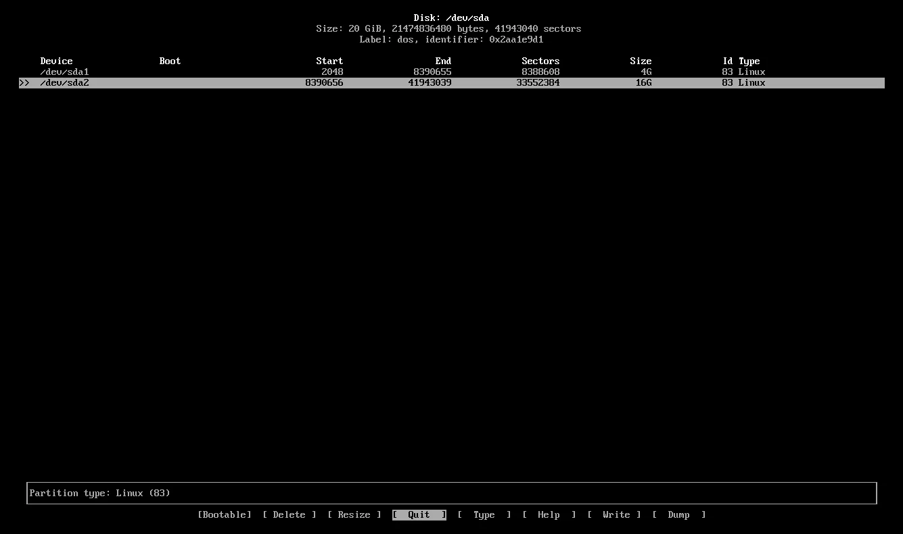


Select **Write**, type **yes**, then **Quit**.


### Formatting partitions


- UEFI**:


```shell
mkfs.fat -F32 /dev/sda1
mkswap /dev/sda2
swapon /dev/sda2
mkfs.ext4 /dev/sda3
```


- BIOS**:


```shell
mkswap /dev/sda1
swapon /dev/sda1
mkfs.ext4 /dev/sda2
```


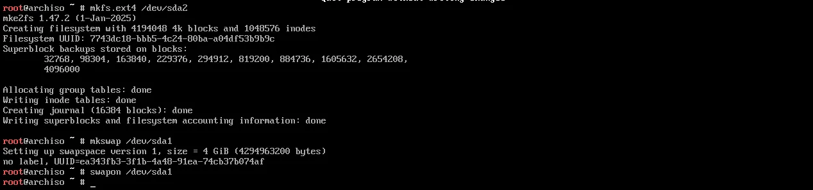


### Basic system installation


Mount the **root** partition:


- On the BIOS:

```shell
mount /dev/sda2 /mnt
```


- on UEFI:

```shell
mount /dev/sda3 /mnt
```


Then install the essential packages:


```shell
pacstrap -K /mnt base linux linux-firmware
```


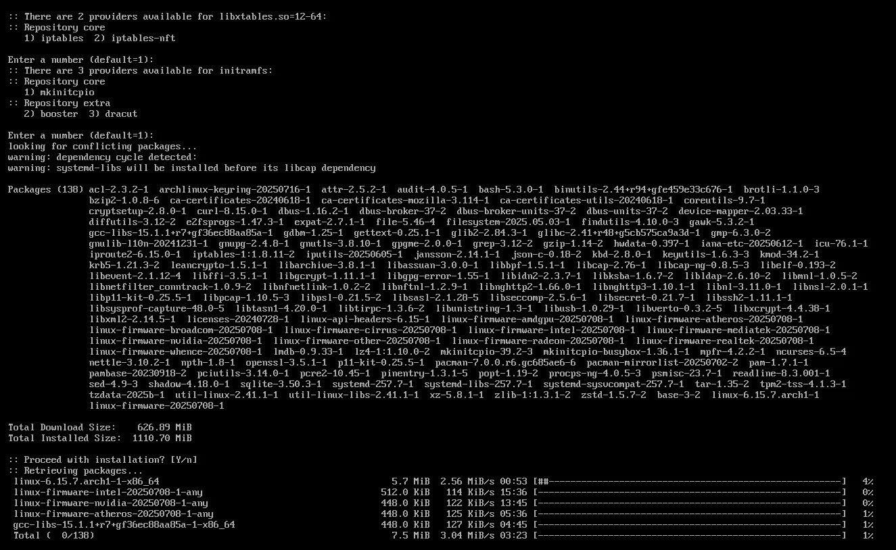


Generate the **fstab** file, which enables the operating system to automatically manage partition mounting at each boot, without manual intervention:


```shell
genfstab -U /mnt >> /mnt/etc/fstab
```


Enter the **Chroot** environment:


```shell
arch-chroot /mnt
```


### System configuration


- Install a text editor to edit:


```shell
pacman -S vim
```


- Set the language:

Edit `/etc/locale.gen` then uncomment the line `en_US.UTF-8 UTF-8`


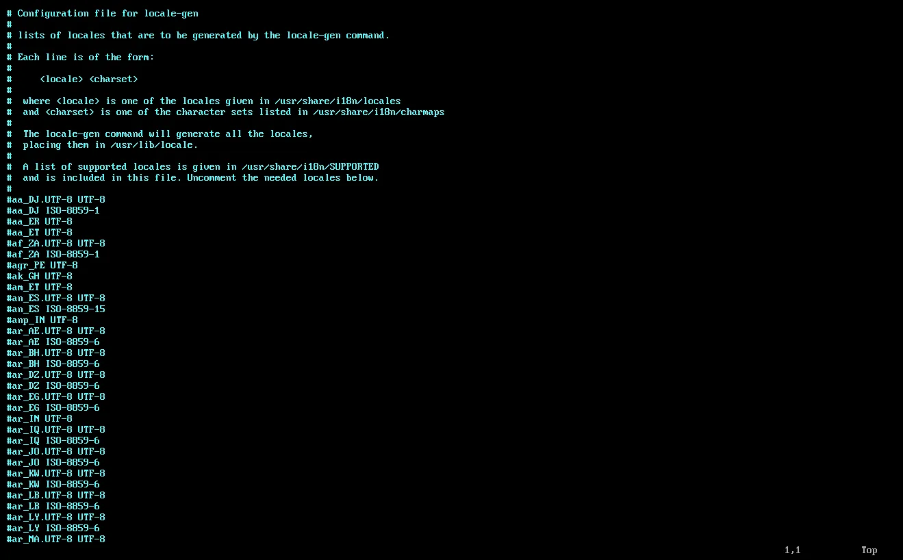


- Set the machine name:


```shell
echo nom_machine > /etc/hostname
```


- Set root password:


```shell
passwd
```


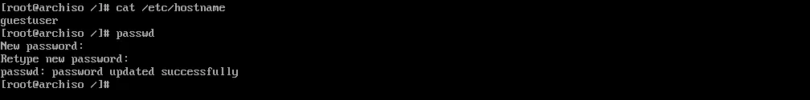


### Installing GRUB


Install the:


```shell
pacman -S grub
```


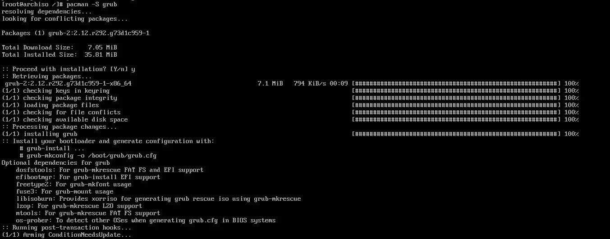


Once downloaded, you need to install it according to the disk partition format.


- For **BIOS**:


```shell
grub-install --target=i386-pc /dev/sda
grub-mkconfig -o /boot/grub/grub.cfg
```


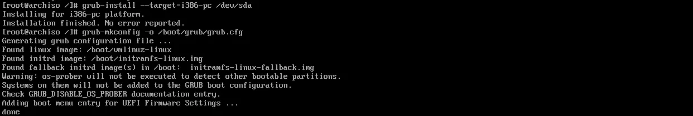


- For **UEFI**:


```shell
pacman -S efibootmgr
mkdir /boot/efi
mount /dev/sda1 /boot/efi
grub-install --target=x86_64-efi --efi-directory=/boot/efi --bootloader-id=GRUB
grub-mkconfig -o /boot/grub/grub.cfg
```


### Finalization


- Exit the chroot environment:

```shell
exit
```


- Remove the partitions:

```shell
umount -R /mnt
```


- Restart:

```shell
reboot
```


On startup, log in with your **root** login and password.


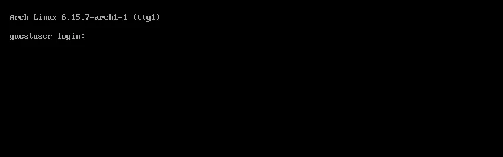

## Network connection after reboot


It may happen that no network connection is active on reboot. You can list the interfaces with:


```shell
ip link
```


Then configure the Interface network by entering the following text in the terminal


```shell
cat <<EOF > /etc/systemd/network/20-wired.network
[Match]
Name=nom_de_l_interface

[Network]
DHCP=yes
EOF
```


## Interface graphics (GNOME)


By default, **Arch Linux** contains no graphical Interface. To add one:


Update the system:


```shell
pacman -Syu
```


Install **Xorg** with the following command and press enter each time to keep the default choices:


```shell
pacman -S xorg
```


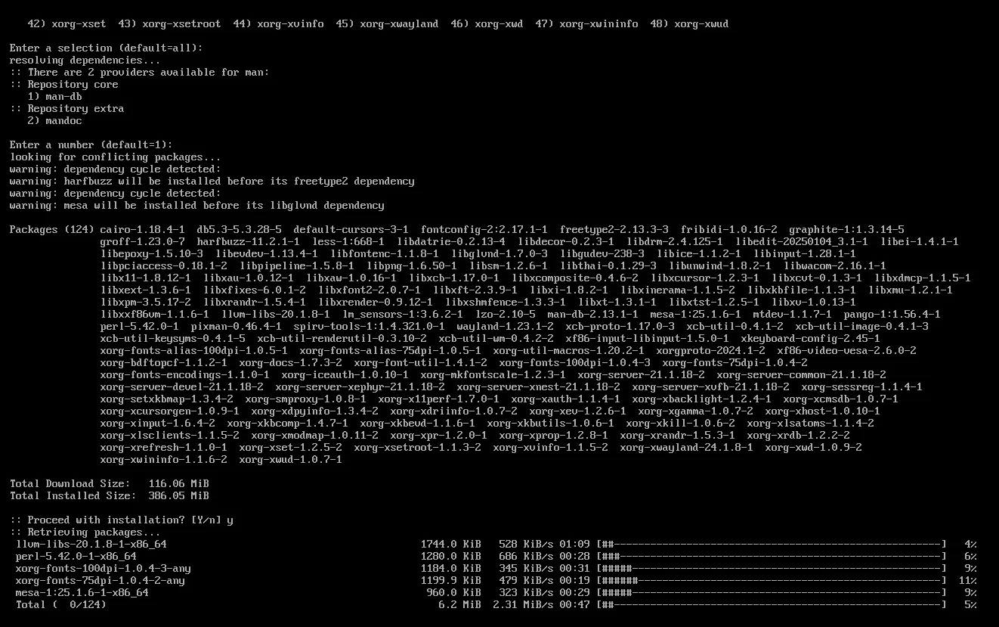


Install **GNOME** with the following command and enter each time to keep the default choices:


```shell
pacman -S gnome gnome-extra
```


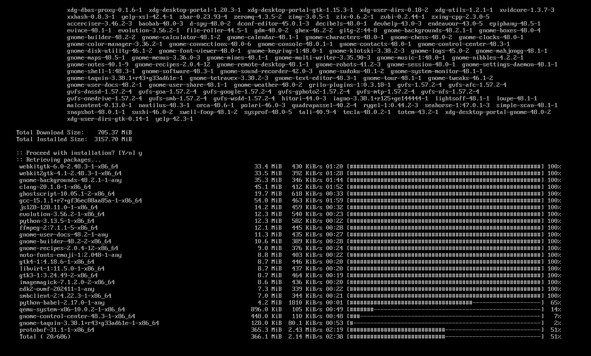


Activate the **session manager**:


```shell
systemctl enable gdm
systemctl start gdm
```


The system reboots automatically and you get the Interface graphical login. Log in with the root user name and password.


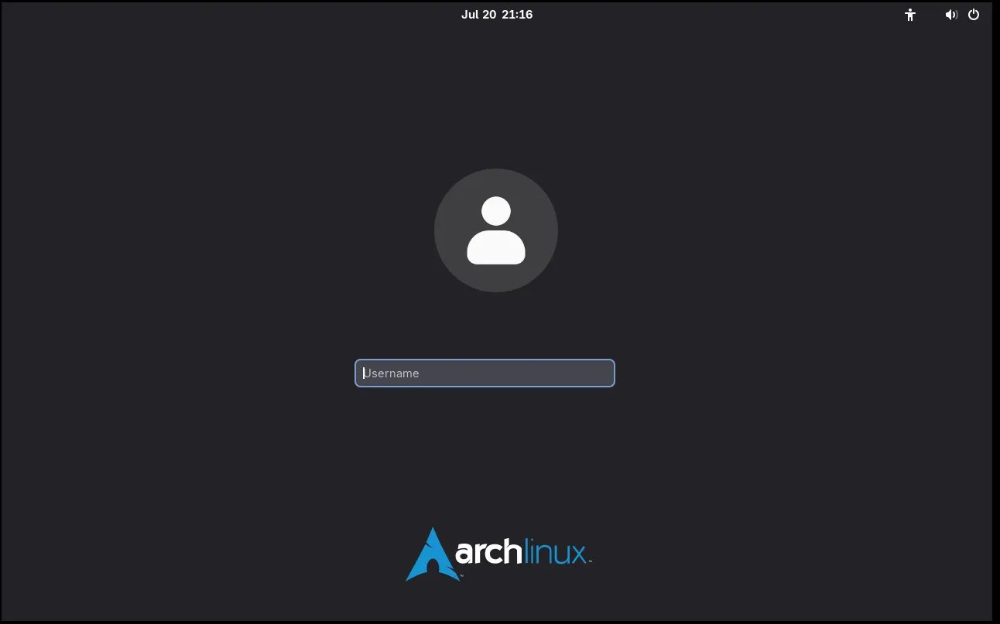


## Creating a user


Once in **Interface GNOME**, you'll need to create a new user for greater security and safer, risk-free use. Enter applications and choose the "console" option to launch the terminal.


- Add a user:


```shell
useradd -m -G wheel -s /bin/bash nom_utilisateur
passwd nom_utilisateur
```


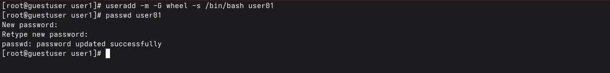


- Install **sudo**:

```shell
pacman -S sudo
```


- Activate **sudo** rights:


```shell
EDITOR=nano visudo
```


- Then uncomment the line:


```shell
%wheel ALL=(ALL:ALL) ALL
```


- Restart the system and log in with your user name.


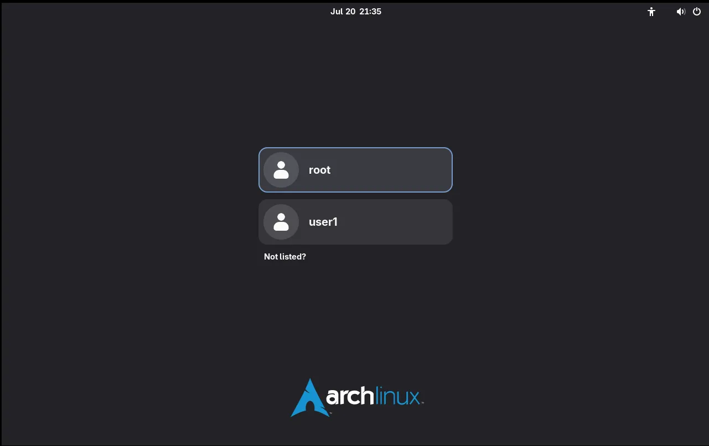


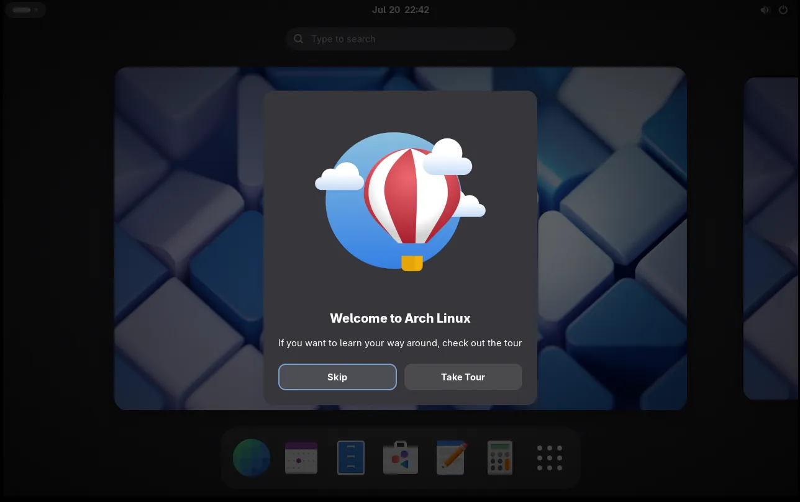


## Installing software


Since Arch Linux is minimalist, a lot of software is not installed by default. To add what you need, type the following command:


```shell
pacman -S nom_du_paquet_a_installe
```


For example, to install the **nano** text editor, you can type:


```shell
pacman -S nano
```


To install a lightweight web browser such as `firefox`, use:


```shell
pacman -S firefox
```


Finally, if you want to add essential network tools such as `net-tools`, the command would be:


```shell
pacman -S net-tools
```


Don't forget that you can install several packages in a single command by listing them separately:


```shell
pacman -S vim firefox net-tools
```


Arch Linux stands out for its remarkable stability, minimalist philosophy and robustness, making it an ideal choice for development environments. By providing only the essentials, it offers a lightweight, high-performance foundation that's easy to customize to your specific needs. This minimalist approach also favors greater control over the system, reinforcing security by limiting the attack surface. Thanks to its active community and exhaustive documentation, Arch Linux can help you create a secure, flexible environment optimized for professional development.


If you've enjoyed getting started with Arch Linux, you'll love our tutorial on **Fedora OS**, a modular, secure and robust operating system that adapts to your needs and uses.


https://planb.network/tutorials/computer-security/operating-system/fedora-8c17b6ca-5acb-4825-a069-4474375534b0

https://planb.network/courses/4ba0e3de-e67f-4ea1-a514-f111206810d1