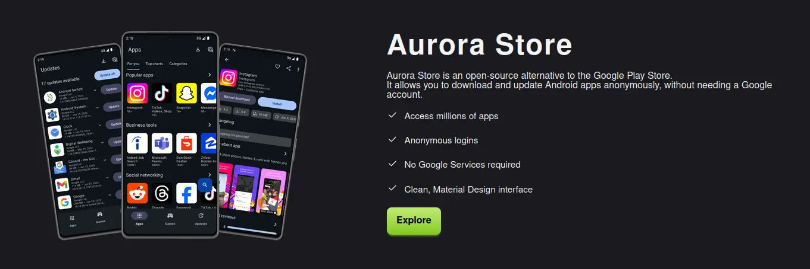
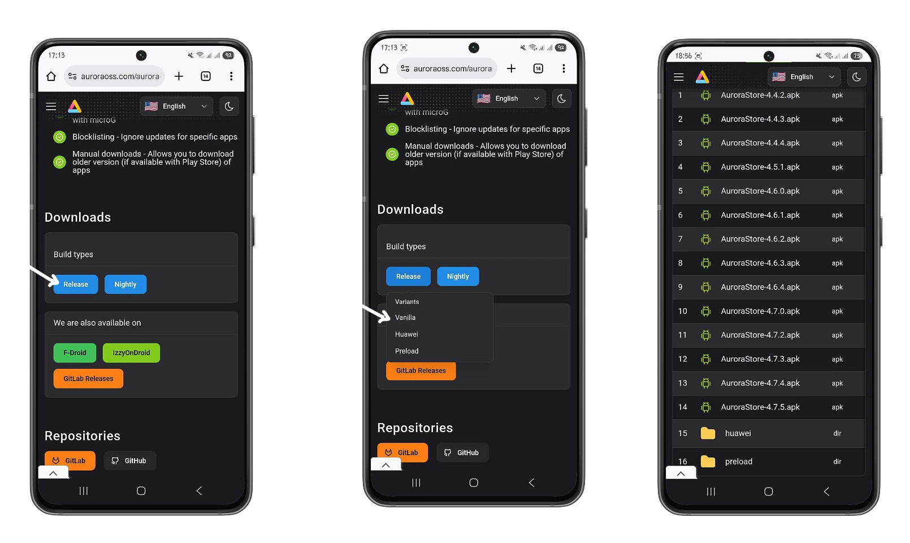
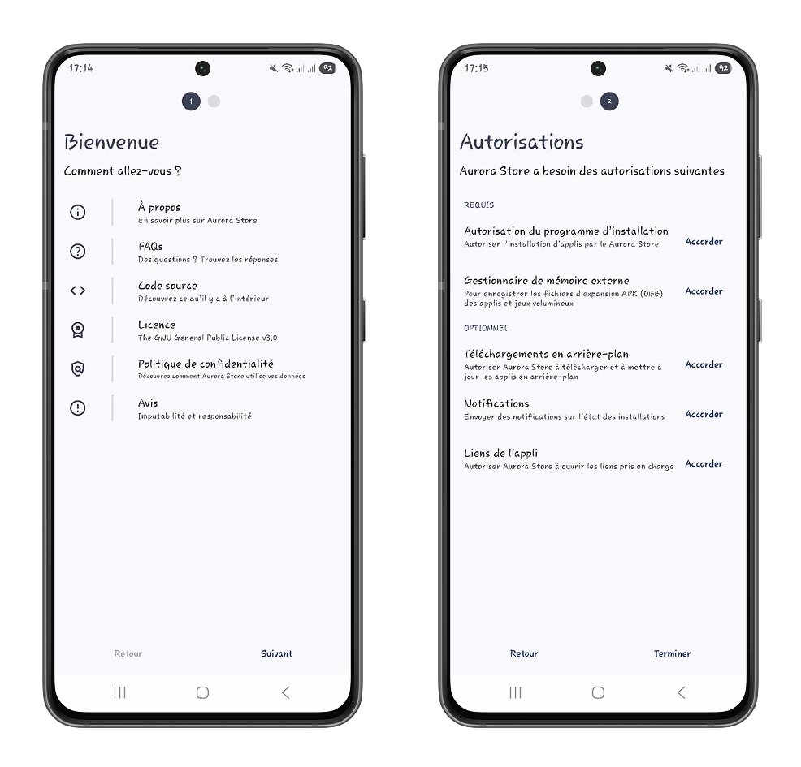
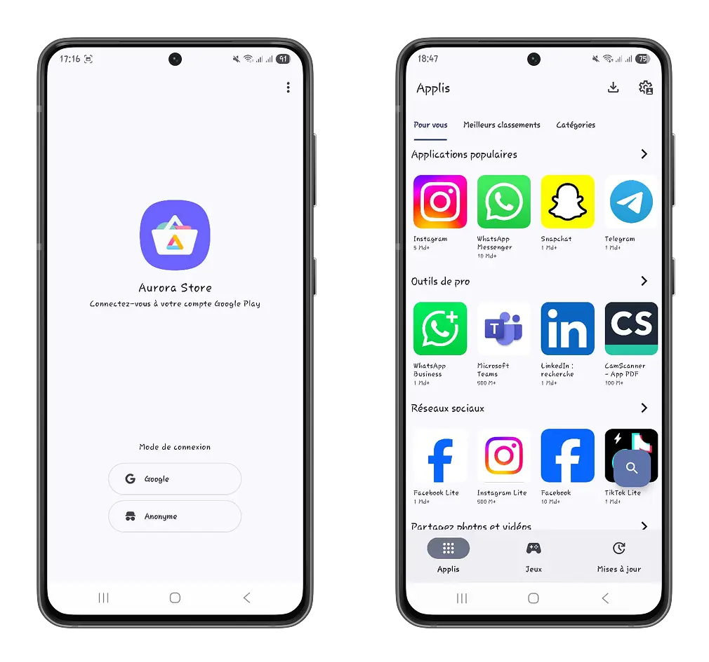
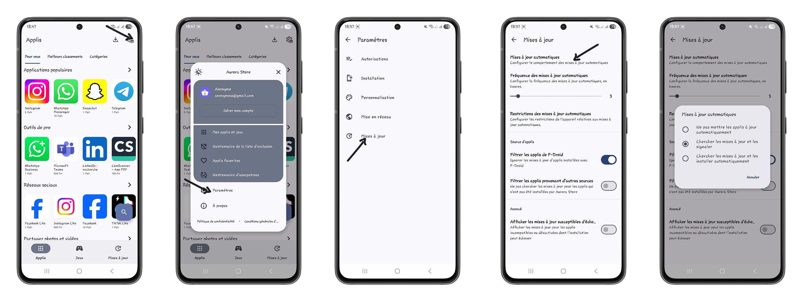
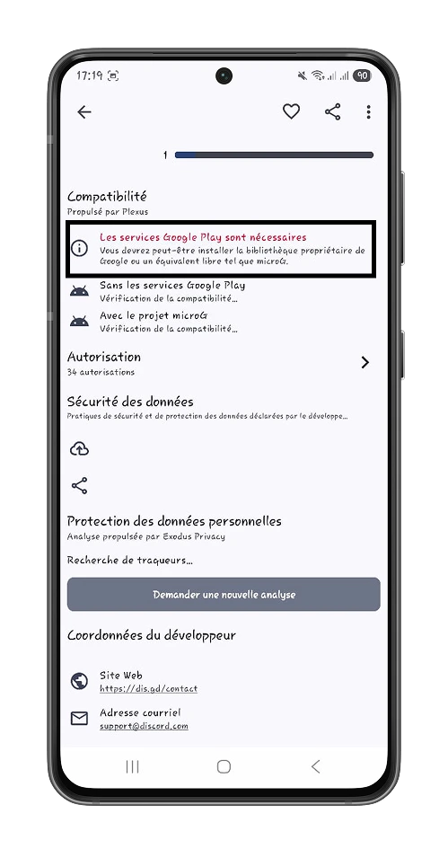
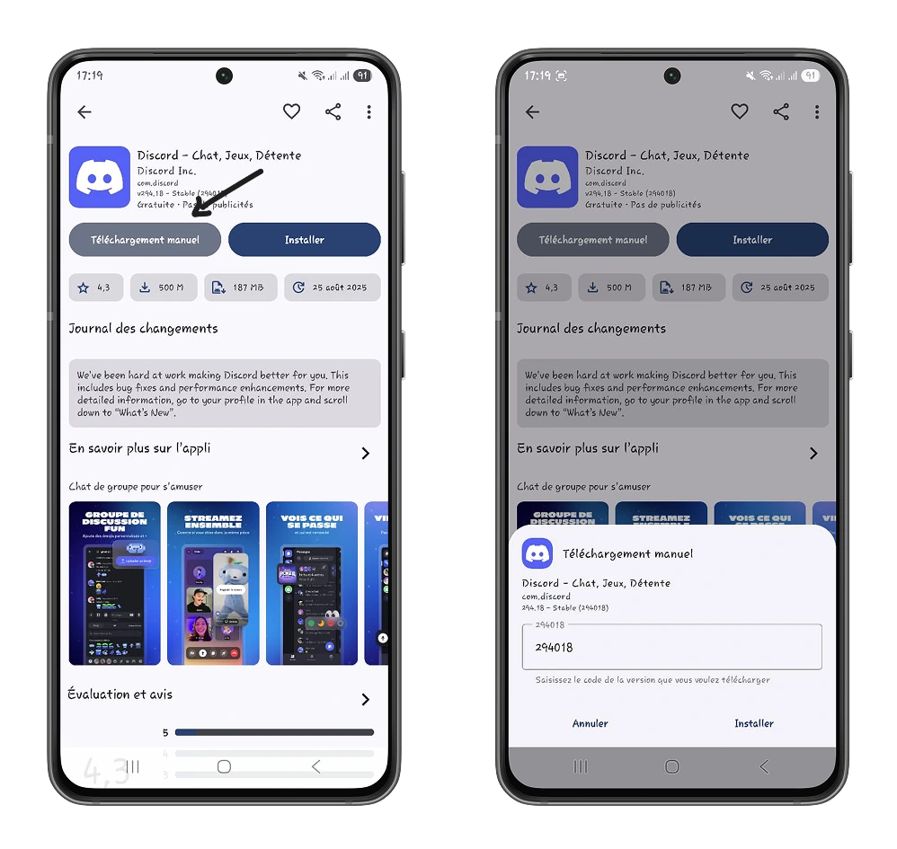
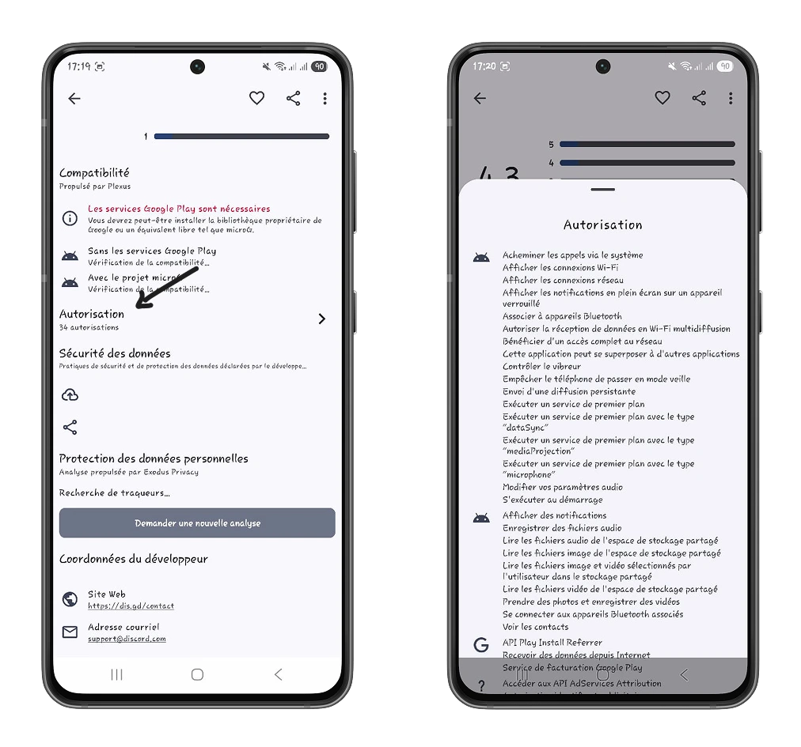
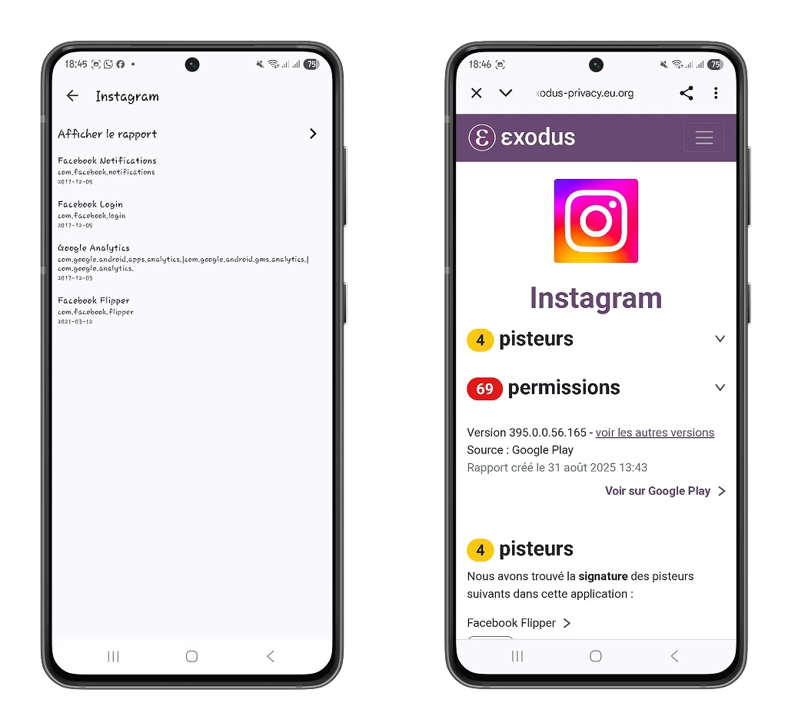

Rakenduspoodidel on keskne roll teie seadme ressursside kasutamisel ning sõltuvalt teie geograafilisest tsoonist kohaldatakse nende suhtes regulaarselt tsentraliseerimist ja tsensuuri. Androidi telefonides on Google Play Store'i monopoolne seisund nüüdseks möödas ning me oleme tunnistajaks mitme rakenduspoe kooselule, mis võimaldavad teil kaitsta oma andmeid ja digitaalset elu - ja seda kõike tasuta.

Selles õpetuses avastame Aurora Store'i, mis on lihtne, avatud lähtekoodiga ja turvaline alternatiiv Google Play Store'ile.

# Alustamine Aurora Store'iga

Aurora Store on *Aurora Open Source Software*, arendajate ja eraelu puutumatuse entusiastide kollektiivi toode, mis on keskendunud vabade, avatud lähtekoodiga tööriistade loomisele, mis austavad teie digitaalset elu ja vabadust.

Aurora Store on üks populaarsemaid alternatiivseid rakenduste poode Google Play Store'ile Androidi platvormil järgmistel põhjustel:

- Voolujooneline Interface**: Interface ei paista sulle kuidagi silma, seega on lihtne orienteeruda.
- Juurdepääs miljonitele rakendustele**: Aurora Store toimib portaalina paljudele mobiilirakendustele. Kui otsitav rakendus on Google Play Store'is, leiate selle ka Aurora Store'ist.
- Google Play teenust ei ole vaja**: Tänu MicroG-tehnoloogiale saavad Android-rakendused teie telefonis töötada ilma Google Play teenuseta.

Saate Aurora Store'i alla laadida [ametlikust saidist](https://auroraoss.com/aurora-store), klõpsates build-tüüpide juures nupule "Release". Valige Vanilla valik, kui kasutate muud telefonimarki kui Huawei. Hiljutistel Huawei telefonimudelitel on oma versioon Aurora Store'ist, kuna USA sanktsioonide tõttu on neil piirangud Google'i teenustele.

Saate Aurora Store'i alla laadida ka teistest rakenduspoodidest, nagu F-Droid või IzzyOnDroid.

https://planb.network/tutorials/computer-security/data/f-droid-2cd1aae5-7028-4c04-8fbe-95aeaf278ef4

Soovitame siiski laadida APK-faili alla otse ametlikust veebisaidist, et tagada Aurora Store'i autentsus ja terviklikkus.

https://planb.network/tutorials/computer-security/data/integrity-authenticity-21d0420a-be02-4663-94a3-8d487f23becc

APK (Android Package Kit) fail on paketivorming, mida Android operatsioonisüsteem kasutab rakenduste levitamiseks ja paigaldamiseks. See on samaväärne **.exe** failidega Windowsis või **.dmg** failidega macOSis.

Kui rakendus on alla laaditud, installige see käsitsi ja andke Aurora Store'i rakenduste paigaldusõigused.

Kuna see ei nõua Google Play teenuseid, saate anonüümselt ühendada Aurora Store Interface ja nautida kõiki Google Play Store'is saadaval olevaid rakendusi. Aurora Store on portaal, mis peegeldab Google Play Store'i funktsionaalsust. See ei oma, litsentseeri ega turusta ühtegi rakendust.

Anonüümselt ühendudes loob Aurora Store ajutise e-posti Address, mis muutub iga 24 tunni järel. Isikuandmeid ei salvestata ja iga kord, kui ühendute, luuakse anonüümne seanss.

Rakenduse seadetes saate määrata uuenduste sageduse ja soovitud uuendamisrežiimi (automaatne või käsitsi).

Aurora poest saate juurdepääsu Google Play poes saadaval olevate rakenduste kataloogile, lugeda nende kirjeldusi, saada kasutajate tagasisidet ja paigaldada neid oma telefoni. See ei tähenda siiski, et kõik rakendused on tasuta. Kui rakenduse eest tuleb Play Store'is maksta, peate esmalt tasuma kas Play Store'i rakenduse abil või Play Store'i ametlikul veebisaidil.

## Omadused

Aurora Store ei peegelda mitte ainult Google Play Store'i, vaid sisaldab ka funktsioone, mis annavad teile kogu vajaliku teabe rakenduste kohta, mida soovite paigaldada. Nende funktsioonidega annab Aurora Store teile kontrolli oma andmete ja digitaalse elu üle.

- Sõltumatus Google'ist:**

Kui otsustate oma andmete kaitsmiseks Google Play teenused keelata või kasutate telefoni, mis ei toeta enam Google'i teenuseid, võimaldab Aurora Store tänu avatud lähtekoodiga projektile MicroG paigaldada ja kasutada Google Play Store'is olevaid mobiilirakendusi. See funktsioon on eriti kasulik, kui asute USA sanktsioonide alla kuuluvas riigis.

- Kontrolli allalaadimine:**

Aurora Store võimaldab teil käsitsi alla laadida mobiilirakendusi, määrates soovitud versiooni koodi. Allalaadimise kontroll on eelis, kui teie rakenduse uuendused nõuavad rohkem andmeid kui vaja: teil on kontroll oma andmete üle.

- Load:**

Hankige paigaldatava rakenduse kirjelduses täielik loetelu volitustest, mida annate sellele rakendusele pärast paigaldamist.

- Andmekaitse analüüs:**

Aurora Store integreerib Exodus'i, lahenduse, mis analüüsib ja tuvastab teie Android-rakendustes kasutatavad jälgimisseadmed. Tracker on väike tarkvara, mis kogub andmeid sinu või sinu tegevuse kohta. Näitades Exoduse analüüsiandmeid, võimaldab Aurora Store teil tõesti teada, milliseid andmeid kogub rakendus, mida soovite paigaldada.

Aurora Store on rohkem kui lihtsalt rakenduste pood, see on avatud lähtekoodiga lahendus, mis võimaldab teil kontrollida, kuidas teie andmeid kasutatakse. See annab teile kasulikku teavet teie rakenduste kohta ja võimaldab teil kaitsta oma digitaalset elu kuritarvitusliku kogumise eest. Oma konfidentsiaalsuse tugevdamiseks avastage meie digitaalsete andmete turvalisuse kursus: seadistage isiklik, turvaline ja usaldusväärne digitaalne keskkond.

https://planb.network/courses/4ba0e3de-e67f-4ea1-a514-f111206810d1
