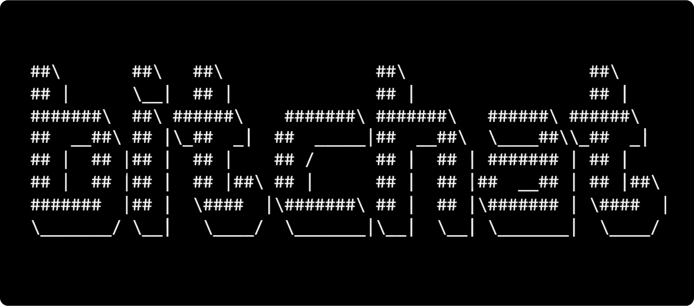

*Denna videohandledning från BTC Sessions går igenom processen för att konfigurera och använda Bitchat!*

Bitchat växte fram ur ett snabbt prototyparbete där [@jack](https://primal.net/jack) utvecklade det ursprungliga konceptet under en helgs kodningssession. [@calle](https://primal.net/calle) anslöt sig till projektet kort därefter för att vara med och utveckla Android-implementeringen. Jack leder för närvarande utvecklingen av iOS-versionen, medan Calle övervakar Android-versionen med stöd av många andra bidragsgivare.

## Introduktion: Chatta fritt, utan nätet

Tänk dig att skicka meddelanden när internet går ner, under en naturkatastrof eller på platser där kommunikationen är begränsad. Bitchat gör detta möjligt. Det är en decentraliserad app för peer-to-peer-meddelanden som hoppar över centrala servrar och låter enheter prata direkt med varandra, helt offline med hjälp av Bluetooth och mesh-nätverk. Bitchat är utformad med integritet och motståndskraft i åtanke och är idealisk för användning i områden där traditionell anslutning är opålitlig eller otillgänglig - till exempel under katastrofscenarier, på avlägsna platser eller för dem som vill undvika övervakning. I grunden använder Bitchat kryptografi för att säkerställa att varje meddelande är krypterat, verifierat och manipuleringssäkert från början till slut.

I den här handledningen visar vi hur Bitchat fungerar och hur du kan använda det för verkligt privat, offline-klar kommunikation.

## 🚀 Viktiga funktioner

Bitchat möjliggör offline-meddelanden genom dessa [funktioner](https://github.com/permissionlesstech/bitchat-android?tab=readme-ov-file#features):

- Kompatibel över flera plattformar**: Full protokollkompatibilitet mellan iOS och Android.
- Decentraliserat mesh-nätverk**: Automatisk peer discovery och multi-hop meddelandeförmedling via Bluetooth Low Energy (BLE)
- End-to-End-kryptering**: X25519 nyckelutbyte + AES-256-GCM för privata meddelanden
- Kanalbaserade chattar**: Ämnesbaserade gruppmeddelanden med valfritt lösenordsskydd
- Lagra och vidarebefordra**: Meddelanden cachas för offline-peers och levereras när de återansluter
- Integritet först**: Inga konton, inga telefonnummer, inga permanenta identifierare
- Kommandon i IRC-stil: Välkänt gränssnitt i stil med `/join, /msg, /who`.
- Bevarande av meddelanden**: Valfri kanalövergripande lagring av meddelanden som kontrolleras av kanalägare
- Nödtorkning**: Tryck tre gånger på logotypen för att omedelbart radera all data
- Modernt Android-gränssnitt**: Jetpack Compose med Material Design 3
- Mörka/ljusa teman**: Terminalinspirerad estetik som matchar iOS-versionen
- Batterioptimering**: Adaptiv skanning och energihantering

## 1️⃣ Hur Bitchat fungerar - helt enkelt

Med Bitchat kan du skicka meddelanden till närliggande telefoner direkt via Bluetooth (`BLE` enligt nedan), utan behov av internet eller mobilsignal. När du startar en chatt utför telefonerna en säker handskakning för att skapa en unik, tillfällig krypteringsnyckel för er konversation. Varje meddelande skyddas med end-to-end-kryptering och en ny nyckel används för varje meddelande för att säkerställa att tidigare meddelanden förblir säkra även om din telefon äventyras senare. Slutligen delar appen upp meddelanden i små bitar och blandar dem med slumpmässiga dummy-data för att dölja din meddelandeaktivitet. För direkta chattar mellan enheter fungerar det bara inom ett intervall på upp till ~ 100 meter. Det är som att skicka krypterade anteckningar i ett trångt rum - enheterna viskar direkt till varandra och strimlar nycklarna efter varje meddelande.

Med Bitchat kan du också gå med i platsbaserade chattrum med hjälp av Nostr-protokollet och `#geohashes`. En geohash är en kort kod, som `#u33d`, som representerar ett specifikt geografiskt område, från ett enda grannskap, upp till en hel stad eller region. Du kan `teleportera` in i vilket geohash-chattrum som helst runt om i världen genom att helt enkelt ange dess tagg. Dina meddelanden skickas genom ett decentraliserat nätverk av reläer, vilket skyddar din exakta plats. Varje gång du går med i ett geohash-rum får du dessutom en ny, tillfällig identitet, vilket ger ett extra lager av integritet till dina platsbaserade konversationer.

För mer exakta tekniska detaljer hänvisas till [officiell vitbok](https://github.com/permissionlesstech/bitchat/blob/main/WHITEPAPER.md).

## 2️⃣ Installation och konfigurering

### Var får man tag på Bitchat

Du kan installera Bitchat genom:

- [Apple App Store](https://apps.apple.com/us/app/bitchat-mesh/id6748219622) (för iOS-enheter)
- [Google Play Store](https://play.google.com/store/apps/details?id=com.bitchat.droid) (för Android-enheter)

Android-användare har också alternativa möjligheter:

- Ladda ner APK direkt från sidan [GitHub Releases](https://github.com/permissionlesstech/bitchat-android/releases) eller
- Installera via den Nostr-kompatibla [Zapstore](https://zapstore.dev/apps/naddr1qvzqqqr7pvpzq7xwd748yfjrsu5yuerm56fcn9tntmyv04w95etn0e23xrczvvraqqgkxmmd9e3xjarrdpshgtnywfhkjeqxtfkcr)

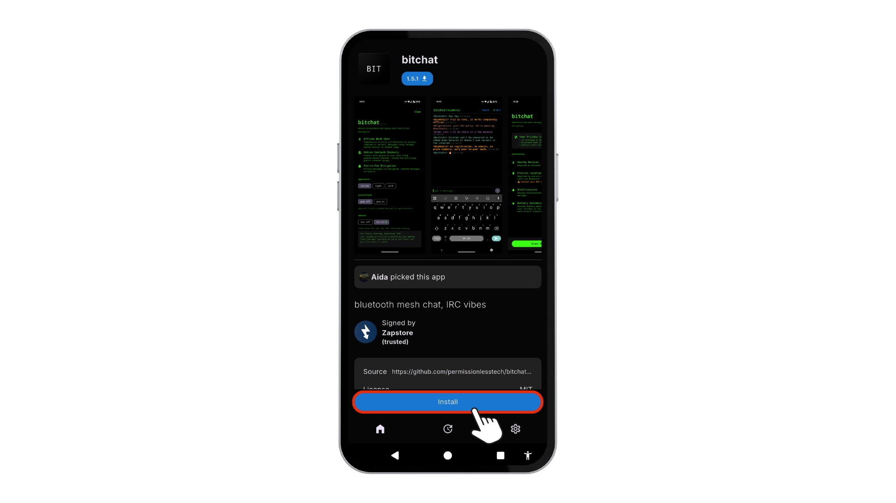

**Notera**: _Den här handledningen fokuserar främst på Android-implementeringen. IOS-versionen kan skilja sig åt._

### Installationsprocess

Efter installationen öppnar du Bitchat för att se den här första behörighetsskärmen. Här är vad du behöver göra:

1. **Ge dessa nödvändiga behörigheter:**

   - Bluetooth-åtkomst** (för att upptäcka Bitchat-användare i närheten)
   - Exakt position** (Android kräver detta för Bluetooth-funktionalitet)
   - Notifieringar** (för att få aviseringar om privata meddelanden)

2. **Avaktivera batterioptimering**:

   - Detta gör att Bitchat kan köras i bakgrunden
   - Upprätthåller kontinuerligt anslutningar till mesh-nätverk

Tryck på `Grant Permissions` , följ `prompts` och `Disable Battery Optimization` för att gå till nästa skärm.

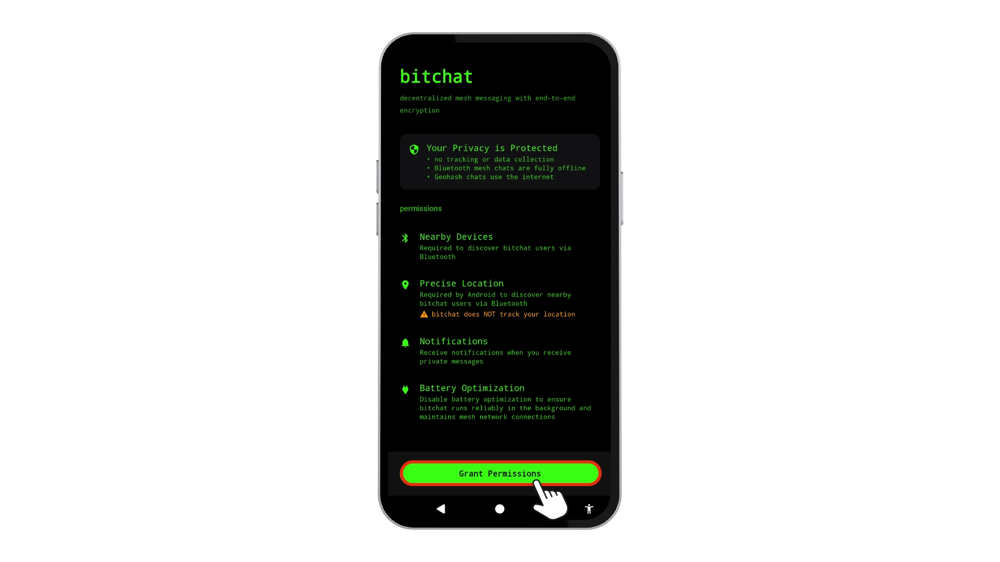

Välkommen till Bitchats huvudskärm. Låt oss orientera oss:

### Inställningar

Först och främst. Inställningsmenyn kan öppnas genom att trycka på `Bitchat-logotypen`.  Följande alternativ finns tillgängliga:

- Ställ in "utseendet" (system/ljus/mörker).
- aktivera `Proof of work` till geohash för spamavskräckning (valfritt)
- Slå på `Tor` för att öka integriteten.

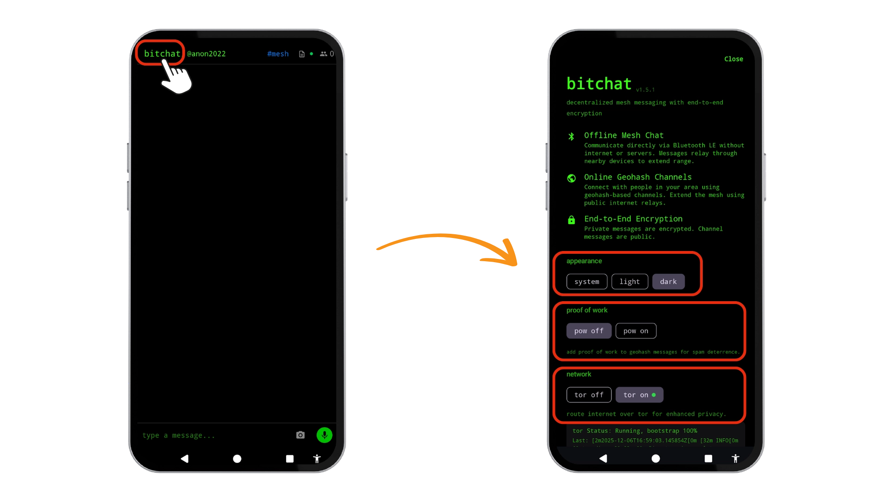

### Ange din identitet

Tryck på fältet `bitchat/anonXXXX` högst upp för att välja ditt användarnamn. Det är så andra kommer att se dig i både Bluetooth- och internetläget. Du kan till exempel ändra "anon2022" till ett användarnamn som du själv väljer.

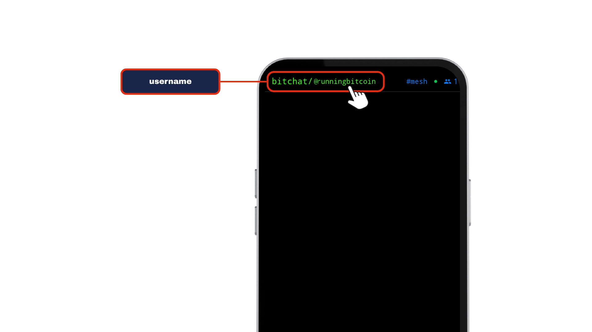

### Välj nätverkskanaler

Använd menyn `#location channels` (till höger om användarnamnet) för att växla mellan olika anslutningstyper:

- BLE Mesh***: Standard Bluetooth-läge (inget internet, 10-50 meters räckvidd)
- #geohashes**: Internetanslutna geografiska samhällen med hjälp av [Nostr-protokollet](https://nostr.com/)

När du väljer `#geohashes`-läget integrerar Bitchat med Nostr-protokollet för att möjliggöra geografiska samhällen. Dina meddelanden publiceras till `decentraliserade Nostr-reläer` snarare än Bitchats peer-to-peer-nätverk, vilket möjliggör bredare men platsfiltrerade konversationer. Avgörande är att dina Bitchat-identitetsnycklar kryptografiskt signerar alla Nostr-händelser för att upprätthålla autentisering, medan geohash-taggar (som `#u4pruyd` för ett grannskap) filtrerar meddelanden till din valda precisionsnivå. Detta innebär att du kan delta i lokala diskussioner utan att avslöja exakta koordinater, men internetåtkomst krävs.

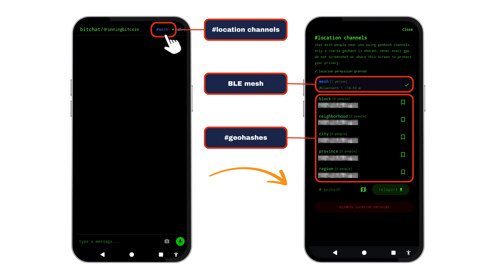

### Övervaka kollegor

licens: CC-BY-SA-V4

Peer-räknaren visar användare:

- I närheten (BLE Mesh) eller
- I din geohash-zon (#geohashes)

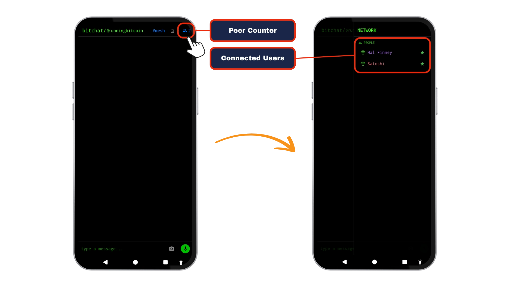

## 3️⃣ Global chatt och privata meddelanden

Bitchat erbjuder två olika kommunikationslägen för att passa olika behov:

- Offentliga kanaler:** För öppna konversationer med andra. Du kan ansluta antingen via det lokala BLE-meshnätverket för användare i närheten eller via en global #geohash för internetaktiverade, platsbaserade samhällen.
- Privata meddelanden:** För säkra konversationer på tu man hand. Dessa upprättar en direkt, krypterad anslutning för att hålla dina utbyten konfidentiella.

Att förstå båda lägena hjälper dig att navigera i dina konversationer.

### Offentliga kanaler: Gemenskapens nav

Menyn `#lokaliseringskanaler` (uppe till höger) styr din synlighet för allmänheten. Om du väljer `mesh` ansluts du till alla användare i närheten via BLE mesh, vanligtvis enheter inom 10-50 meter. Detta skapar ett öppet forum där meddelanden sänds till alla inom räckhåll, perfekt för evenemangsmeddelanden eller lokala varningar.

För bredare geografisk räckvidd, välj valfri `#geohash`-tagg för att gå med i internetdrivna samhällen filtrerade efter plats. Dessa kanaler använder Nostr-protokollreläer, vilket möjliggör kommunikation över städer eller regioner samtidigt som den platsbaserade relevansen bibehålls. Dina meddelanden visas live för andra i samma kanal, och nya deltagare ser automatiskt den senaste meddelandehistoriken när de ansluter sig.

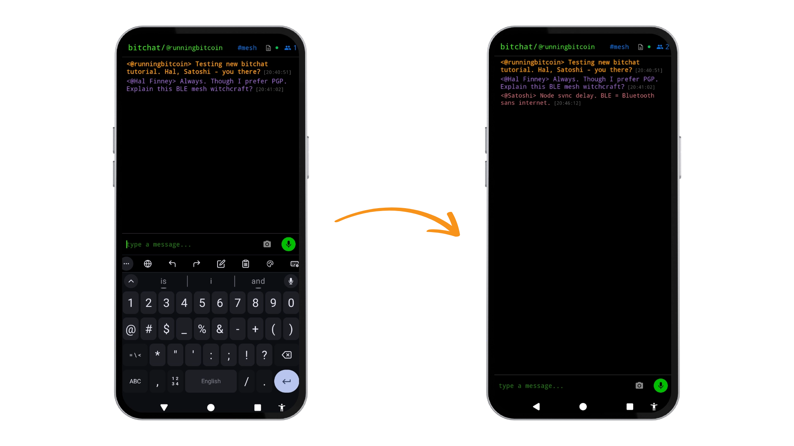

### Privata konversationer: Säkert och krypterat

Om du vill starta en privat konversation trycker du direkt på ett användarnamn som visas i översikten över kontakter. Du kan också trycka på stjärnikonen för att markera användaren som en favorit, vilket gör att användaren syns i din kontaktlista även när han eller hon är offline.

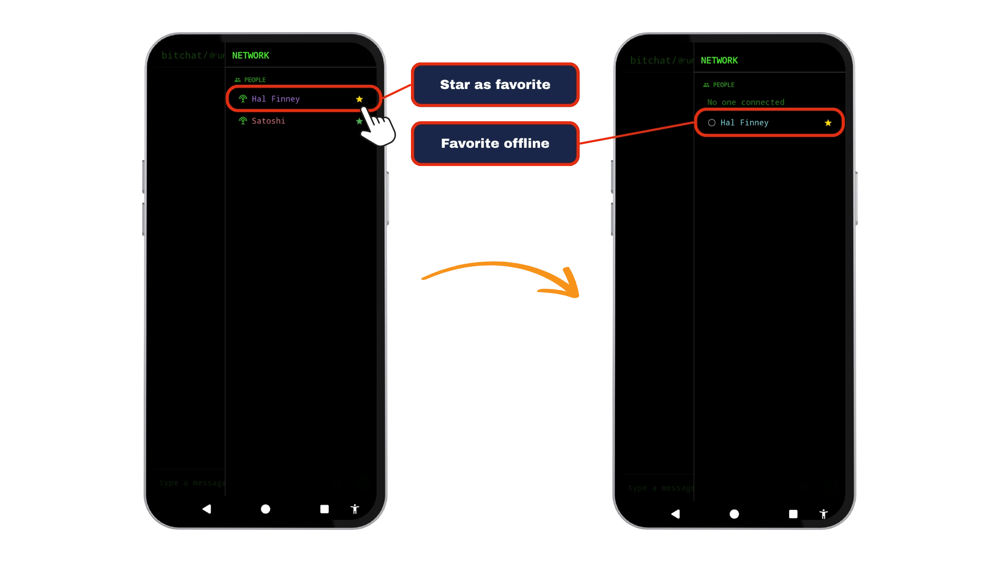

Bitchat initierar automatiskt sin "säkerhetshandskakning" när du startar en privat chatt. Enheter utbyter efemära nycklar för att skapa en krypterad tunnel specifikt för din konversation. Denna process säkerställer att alla dina meddelanden och delade filer förblir konfidentiella tack vare kontinuerlig end-to-end-kryptering. Privata meddelanden stöder text- och fildelning.

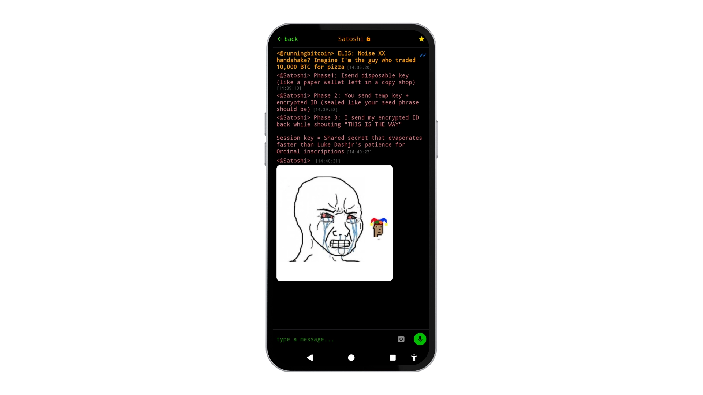

## 4️⃣ Ytterligare funktioner

Du kan komma åt åtgärdspanelen direkt genom att skriva `/` var som helst i Bitchat. Detta avslöjar en kommandomeny för snabba åtgärder.

- Hantera anslutningar**: `Blockera användare` eller `Avblockera peers`
- Kanalkontroller**: "Visa kanaler" eller "Ansluta/skapa kanal
- Sociala interaktioner**: `Sända varm kram` eller `slå med öring` 🎣
- Underhåll av chatt**: `Rensa chattmeddelanden`
- Verktyg för integritet**: "Se vem som är online" eller "Skicka privat meddelande

Kommandon verkställs omedelbart - som `/block Satoshi` för att tysta kritiker eller `/hug Hal` för att sprida positivitet 🫂.

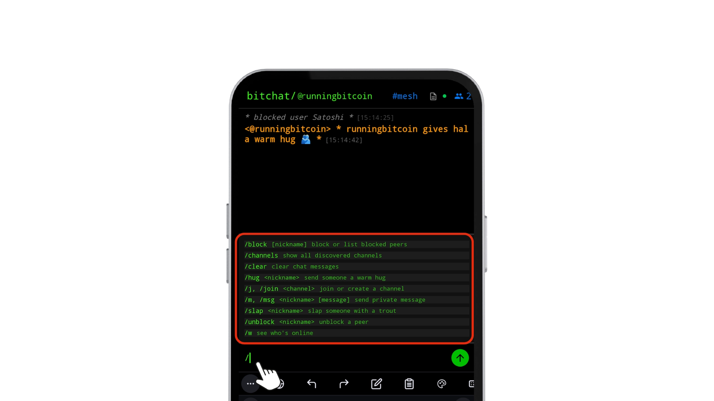

## 5️⃣ Skapa en kanal

Kanaler i Bitchat möjliggör organiserad kommunikation kring ämnen, platser eller grupper. Följ detta arbetsflöde för att skapa din egen:

### Steg 1: Skapa en kanal

Du skapar en kanal genom att skriva `/j` eller `/join` följt av `kanalens namn` i en chatt (t.ex. `/j <kanalnamn>`). Efter skapandet visas en ny "ikon" som indikerar den nya kanalen. Andra användare kan ansluta sig genom att skriva samma kommando (t.ex. `/j bitchat_tutorial`).

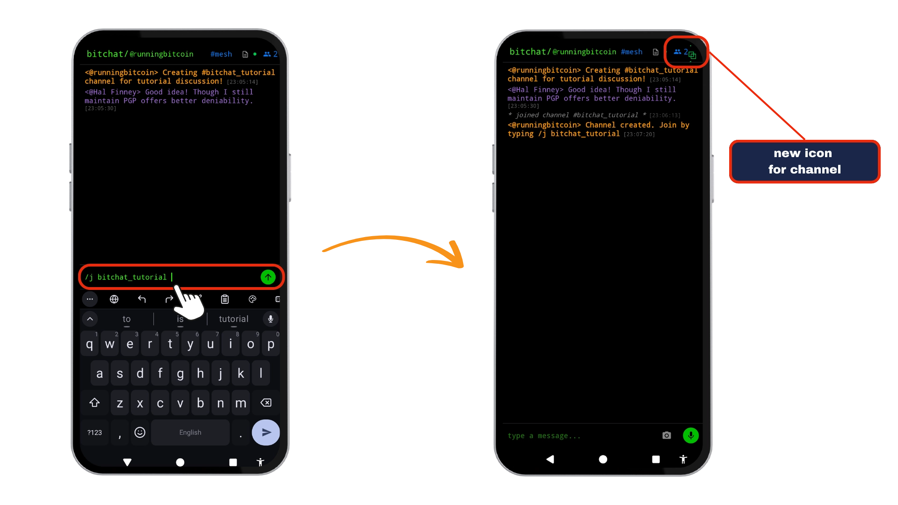

### Steg 2: Konfigurera inställningar

Förutom standardkommandona finns följande inställningar tillgängliga inom en kanal:

- `/save` för att spara meddelanden lokalt
- `/transfer` för att överföra kanalägande och
- `/pass` för att ändra kanalens lösenord.

För privata grupper aktiverar det här kommandot lösenordsskydd, vilket innebär att godkända medlemmar måste ange ett anpassat lösenord innan de kan gå med.

## 6️⃣ Panikläge

Låt oss nu prata om "panikläget": genom att trycka tre gånger på "Bitchat-logotypen" initieras en fullständig radering av alla lokala meddelanden och data i appen. Det här är ditt ultimata integritetsskydd, perfekt för situationer som kräver omedelbar diskretion.

**Viktig påminnelse:** _Panikläget är permanent. När det har aktiverats kan data inte återställas. Använd med försiktighet._

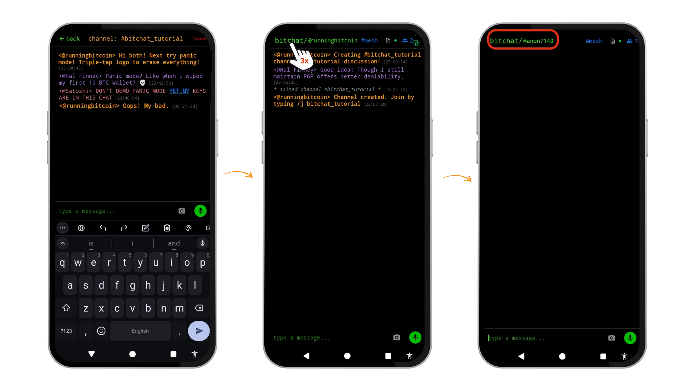

## 7️⃣ Geohashes

Geohash-kanaler möjliggör riktade konversationer baserade på "geografiska platser" snarare än traditionella nätverksanslutningar. Denna funktion förvandlar bitchat till ett platsmedvetet kommunikationsverktyg som är idealiskt för lokal samordning, samhällsbyggande och platsspecifika diskussioner.

### Hur fungerar `#geohashes`?

Systemet delar in världen i rutnät med hjälp av [Geohash-systemet](https://en.wikipedia.org/wiki/Geohash), där varje tecken i hashen representerar större precision:

- Nivå 4** (t.ex. `u33d`): Täcker cirka 25 km × 25 km - perfekt för diskussioner som omfattar hela staden
- Nivå 6** (t.ex. `u33d8z`): Täcker ca 1,2 km × 1,2 km - precision i grannskapet
- Nivå 8** (t.ex. `u33d8z1k`): Täcker ungefär 150 m × 150 m - noggrannhet för gatusegment

Precisionsval balanserar integritet med nytta: högre nivåer skapar mer exklusiva zoner men avslöjar din position mer exakt.

### Ansluta sig till `#geohash`-kanaler

1. Öppna menyn `#lokalkanaler`.

2. Välj önskad precisionsnivå och ange `#geohash` (t.ex. #u33d)

3. Tryck på `Teleport`-knappen för att gå med i `#location channel`.

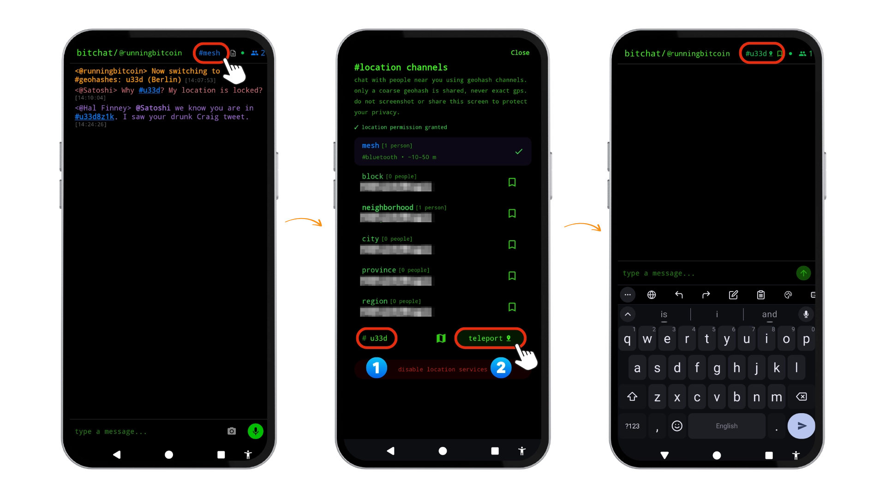

Alternativt kan du trycka på "kartikonen" för att använda kartvyn för att bestämma precisionsnivån och trycka på "välj" för att gå med i "platskanalen".

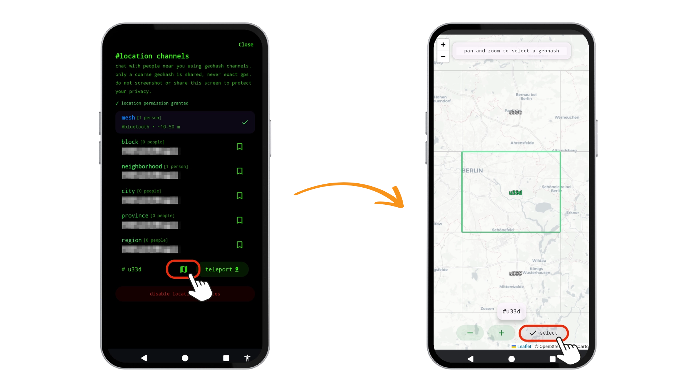

**Viktig påminnelse**: _#geohash-funktionalitet kräver en aktiv internetanslutning - till skillnad från BLE mesh som fungerar offline via Bluetooth._

## 8️⃣ Värmekartor

Värmekartor är ett coolt sätt att upptäcka Bitchat-evenemang och -kanaler runt om i världen. [Bitmap](https://bitmap.lat/) visualiserar och spårar anonyma, platsbaserade meddelanden över Nostr-nätverket och visar kortvariga Nostr-evenemang. Ta en titt och gå med i platsspecifika kanaler och chattar.

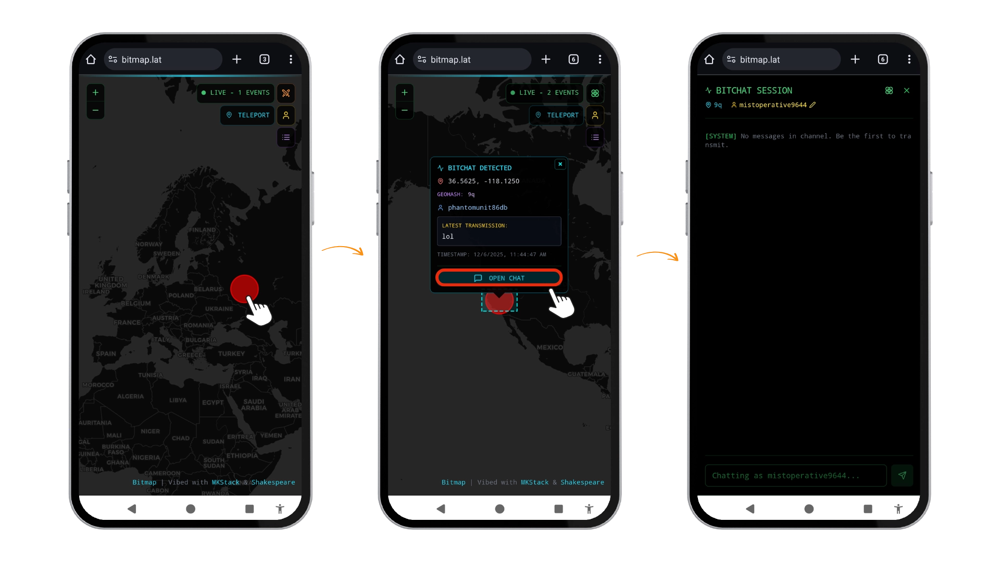

## 🎯 Slutsats

Bitchat möjliggör säker, decentraliserad kommunikation för scenarier där traditionella meddelanden inte fungerar. Den fungerar utan internetinfrastruktur med hjälp av BLE mesh-nätverk, vilket gör den lämplig för protester, katastrofzoner och avlägsna områden där anslutningsmöjligheterna är begränsade eller censurerade. Appen säkerställer integritet genom kryptering med efemära nycklar, geohash-baserade platskanaler och radering av data i panikläge.

Appen befinner sig fortfarande i ett tidigt utvecklingsskede, men den är redan lovande. Användare bör förvänta sig enstaka buggar och rapportera problem via [GitHub](https://github.com/permissionlesstech/bitchat-android/issues). Förbättringar är planerade, inklusive `ecash`-integration för privata transaktioner i appen med Cashu-protokollet.

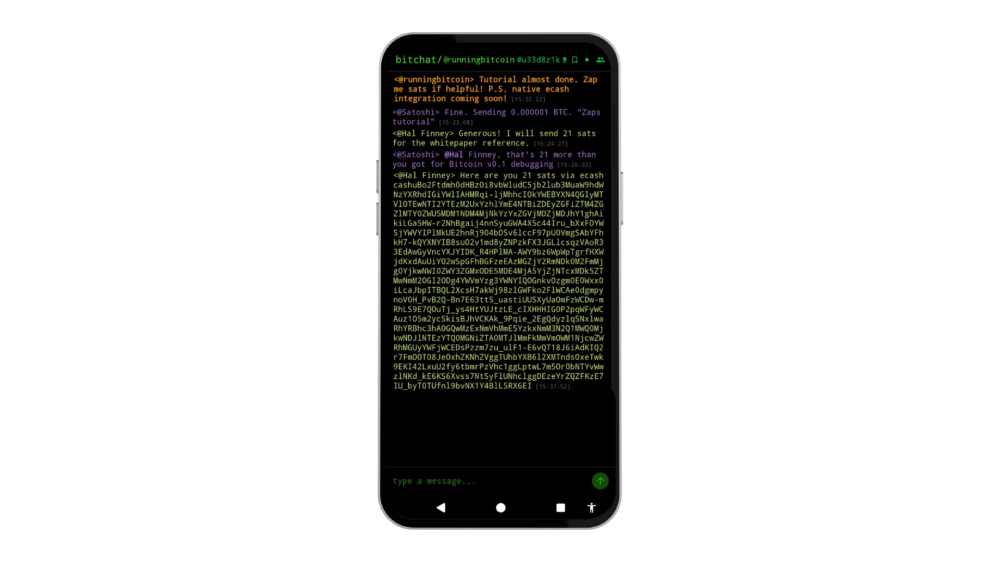

## 📚 Bitchat-resurser

[Github](https://github.com/permissionlesstech) | [Webbplats](https://bitchat.free/)| [Whitepaper](https://github.com/permissionlesstech/bitchat/blob/main/WHITEPAPER.md)