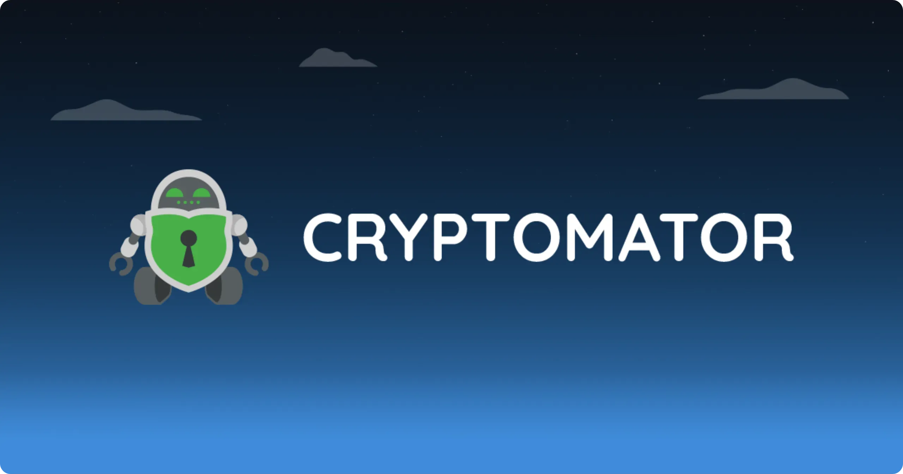

___

*Bu eğitim Florian BURNEL tarafından [IT-Connect](https://www.it-connect.fr/) adresinde yayınlanan orijinal içeriğe dayanmaktadır. Lisans [CC BY-NC 4.0](https://creativecommons.org/licenses/by-nc/4.0/). Orijinal metinde değişiklikler yapılmış olabilir.*

___

## I. Sunum

Bu eğitimde, Microsoft OneDrive, Google Drive, Dropbox, Box ve hatta iCloud'da olsun, Bulutta depolanan verileri şifrelemek için Cryptomator uygulamasını kullanacağız.

Drive gibi çevrimiçi depolama çözümlerinde sakladığınız verileri şifrelemek, dosyalarınızı ve gizliliğinizi korumanın en iyi yoludur. Şifreleme sayesinde, verileriniz ABD'deki veya dünyanın başka bir ülkesindeki bir sunucuda depolanıyor olsa bile şifrelerini çözüp okuyabilecek tek kişi sizsiniz.

Bu gösterimde, OneDrive yüklü bir Windows 11 22H2 makinesi kullanılacaktır, ancak prosedür diğer Windows sürümlerinde ve diğer depolama hizmetlerinde de aynıdır. Tek yapmanız gereken senkronizasyon istemcisini yüklemek ve hesabınızı eklemektir. Bu, Cryptomator'ın verilerini kasada saklamasını sağlayacaktır.

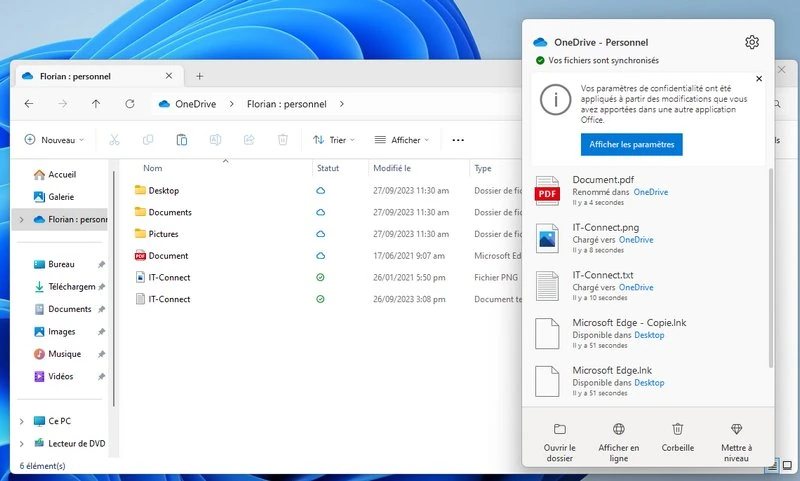

Cryptomator, özellikle başka bir makalede sunulan Picocrypt gibi farklı görünen ancak kullanımı aynı derecede basit olan diğer uygulamalara bir alternatiftir. Cryptomator ayrıca **açık kaynak**, RGPD uyumludur ve **verileri AES-256 bit şifreleme algoritması** ile şifreler. Buna karşılık, Picocrypt daha hızlı XChaCha20 algoritmasına (ayrıca 256 bit) dayanır.

https://planb.network/tutorials/computer-security/data/picocrypt-98c213bd-9ace-425b-b012-bea71ce6b38f

Cryptomator uygulaması **Windows** (exe / msi), **Linux**, **macOS,** ve ayrıca **Android** ve **iOS** üzerinde mevcuttur. Bu arada, ödemeniz gereken Android uygulaması hariç (14.99 Euro) tüm uygulamalar ücretsizdir.

Makinenizde, **Cryptomator içinde bir kasa oluşturacağı bir klasör oluşturacaktır**. OneDrive, Google Drive ya da benzeri bir depolama alanında saklanabilecek olan bu kasa içerisinde verileriniz şifrelenecektir. Dolayısıyla, tüm verilerinizi Drive depolama alanınızda barındırılan kasada saklarsanız, korunacaktır (çünkü şifrelenmiştir).

**Not**: Bu makalede örnek olarak çevrimiçi depolama hizmetleri kullanılmıştır, ancak Cryptomator yerel bir disk, harici bir disk veya hatta bir NAS üzerindeki verileri şifrelemek için kullanılabilir. Aslında herhangi bir kısıtlama yoktur.

## II. Cryptomator'ın Kurulumu

Başlamak için **Cryptomator** programını **indirmeniz** ve **kurmanız** gerekir. İndirme işlemi tamamlandıktan sonra, kurulumu tamamlamak için birkaç tıklama yeterlidir. Rclone](https://www.it-connect.fr/rclone-un-outil-gratuit-pour-synchroniser-vos-donnees-dans-le-cloud/) gibi, Cryptomator da **Windows makinenize sanal bir sürücü bağlamak** için WinFsp'ye güvenecektir.

- [Cryptomator'ı resmi web sitesinden indirin](https://cryptomator.org/downloads/)

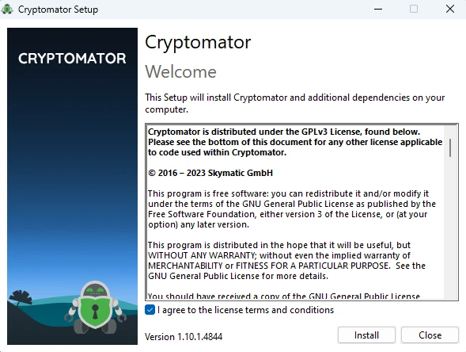

## III. Windows'ta Cryptomator Kullanımı

### A. Yeni bir kasa oluşturun

Yeni bir kasa oluşturmak için "**Ekle**" düğmesine tıklayın ve "**Yeni kasa...**" seçeneğini seçin. Bu makinedeki mevcut ve bilinen kasalarınız daha sonra Interface'da solda görünecektir. **A makinesinde oluşturulan bir kasa, Cryptomator ile donatılmış olması (ve şifreleme anahtarının bilinmesi) koşuluyla B** makinesinde açılabilir ve değiştirilebilir.

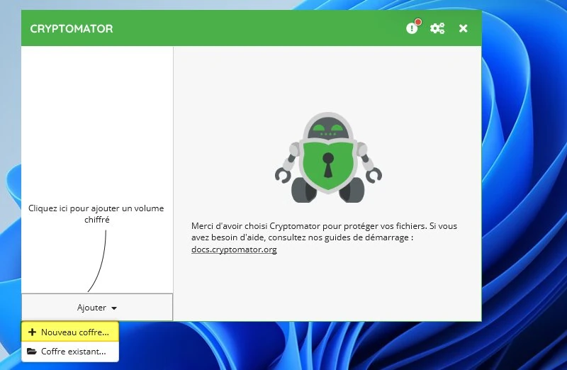

Kasaya bir ad vererek başlayın, örneğin "**IT-Connect**". Bu, OneDrive'ımda "**IT-Connect**" adlı bir dizin oluşturacaktır.

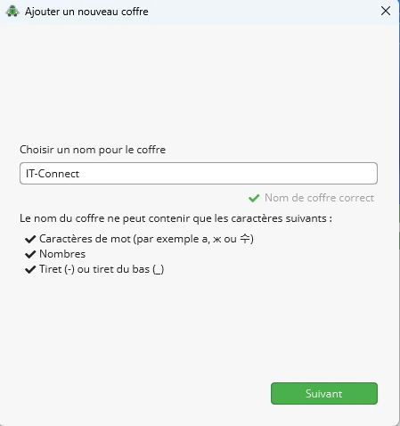

Bir sonraki adımda, Cryptomator muhtemelen makinenizde bulunan "Sürücü "yü ** tespit edecektir: Google Drive, OneDrive, Dropbox, vb.... Doğrudan sağlayıcıyı seçmenizi sağlamak için. Bunu birkaç Sürücüye sahip iki farklı Windows 11 makinesinde denedim ve algılanmadı. Sorun değil, sadece bir "**Özel konum**" tanımlayın ve depolama alanınızın kökünü seçin. Örneğin: **C:\Users\<Kullanıcı adı>\OneDrive**.

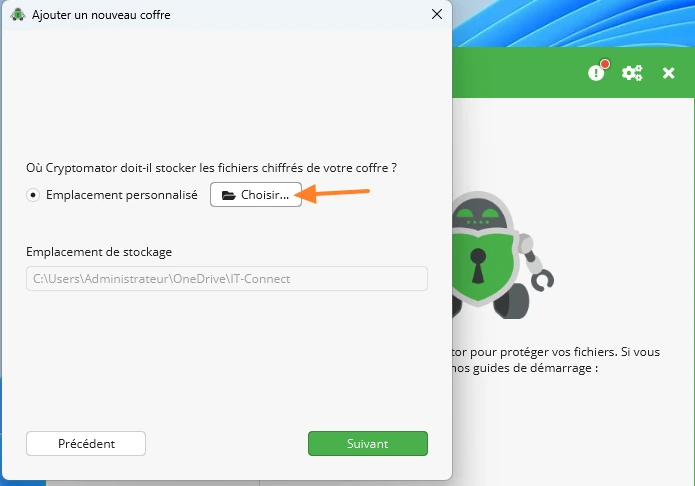

Ardından, uzman ayarları altında bir seçeneği ayarlayabilirsiniz.

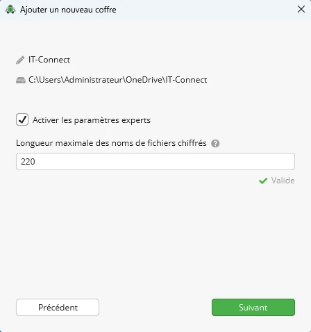

Daha sonra, **şifreleme anahtarına karşılık gelen bir şifre** tanımlamanız gerekir. Bu şifre **Cryptomator kasanızın kilidini açmanızı** ve verilerine erişmenizi sağlayacaktır. **Şifreyi kaybederseniz, verilerinize erişiminizi de kaybedersiniz**. Son olarak, [BitLocker] kurtarma anahtarıyla (https://www.it-connect.fr/comment-activer-bitlocker-sur-windows-11-pour-chiffrer-son-disque/) aynı ruha sahip olan "**Evet, üzgün olmaktansa güvende olmak daha iyidir**" seçeneğini işaretleyerek **yedek anahtar** oluşturma seçeneğiniz vardır. Bu tavsiye edilir, ancak bu yedek anahtarı OneDrive'ınızın kök dizininde saklamayın!

"**Kasa oluştur**" üzerine tıklayın.

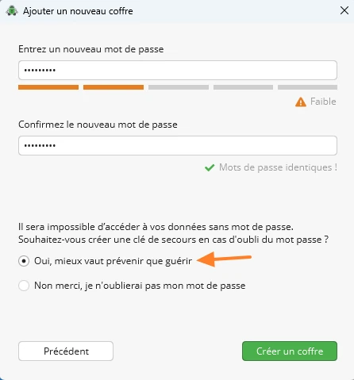

Kurtarma anahtarını kopyalayın ve favori şifre yöneticinizde saklayın. "**Sonraki**" üzerine tıklayın.

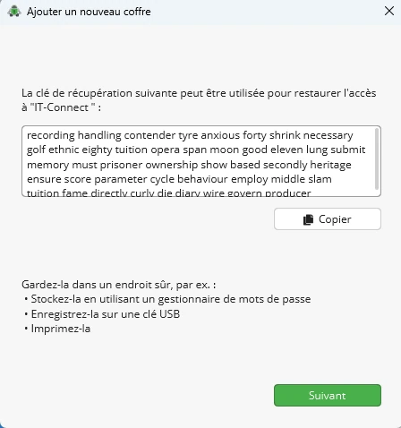

İşte bu kadar, yeni bagajınız oluşturuldu ve kullanıma hazır!

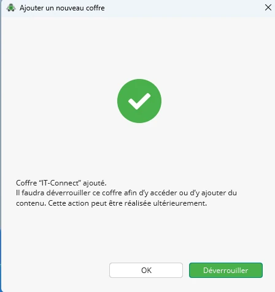

### B. Erişim rakamları

Bir kasaya ve verilerine erişmek için, ya **mevcut verileri okumak ya da yeni veriler eklemek** için, **kilidini açmanız** gerekir. Cryptomator bilinen kasaları listeler: IT-Connect kasası görünür, bu yüzden onu seçin ve "**Kilidini aç**" seçeneğine tıklayın.

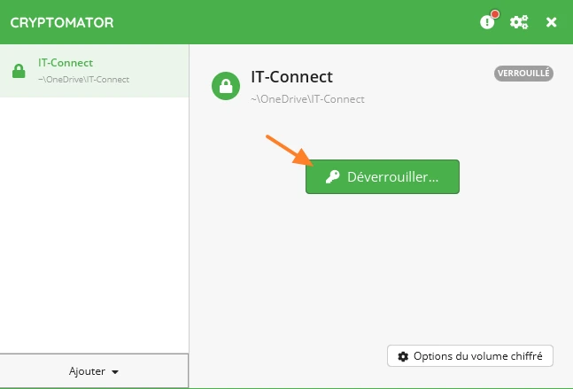

Kasanın kilidini açmak için şifrenizi girmelisiniz. Ardından "**Sürücüyü serbest bırak**" seçeneğine tıklayın.

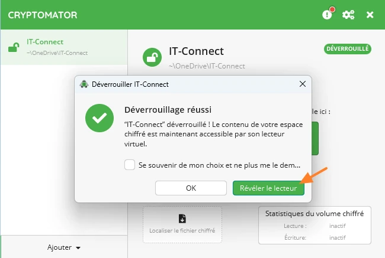

**Kasanız Windows makinesine sanal bir sürücü olarak bağlanır.** Burada E harfini alan bu sürücü, verilerinize erişmenizi sağlar (kasanın kilidi açık olduğu için düz metin olarak).

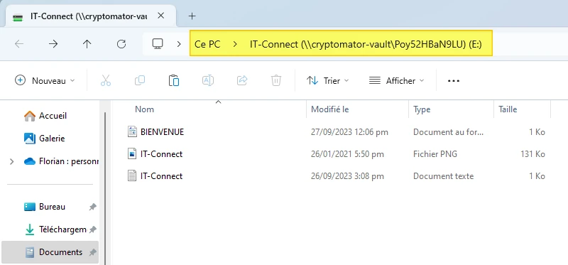

OneDrive tarafında, Cryptomator kasasına doğrudan göz atamayız. Verileri göremeyiz (ne dosya adlarını ne de içeriklerini). Bu, normal OneDrive kısayolu aracılığıyla Cryptomator kasanıza veri eklemenize gerek olmadığı anlamına gelir. **Verilerinizi Cryptomator'ın sanal sürücüsünü kullanarak eklemelisiniz

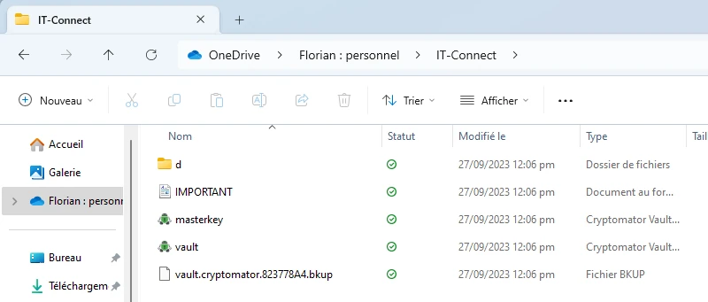

### C. Trunk seçenekleri

Kasanın ayarlarına "**Şifreli birim seçenekleri**" düğmesi (kilitli olduğunda) aracılığıyla erişilir ve tıpkı parola kasanızda yapabileceğiniz gibi, hareketsizlik durumunda otomatik kilitlemeyi etkinleştirir. "**Başlangıçta şifreli birimin kilidini aç**" seçeneği, adından da anlaşılacağı gibi, sizin herhangi bir müdahaleniz olmadan sürücünün kilidini açar ve sanal sürücüyü bağlar. Güvenlik nedeniyle, bu seçeneği etkinleştirmekten kaçınmak en iyisidir.

"**Mounting**" sekmesi aracılığıyla salt okunur olarak bağlamaya veya belirli bir harf atamaya da karar verebilirsiniz.

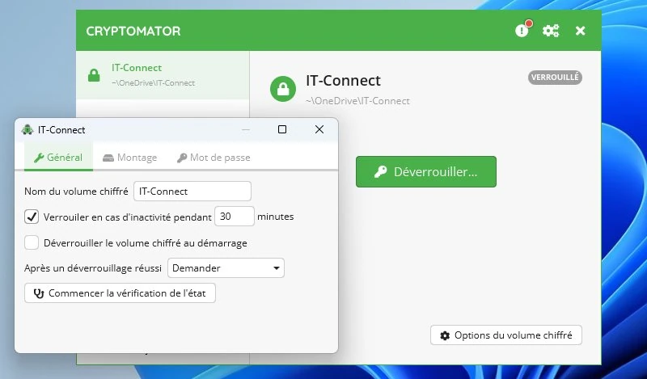

Ek olarak, Cryptomator ayarlarında **otomatik uygulama başlangıcını etkinleştirebilirsiniz**.

## IV. Sonuç

Cryptomator** ile OneDrive'da saklamak istediğiniz verileri korumak için sadece birkaç dakika içinde **şifreli bir kasa** oluşturabilirsiniz. Bir Drive ile "eşleştirme" söz konusu olduğunda kullanımı çok kolaydır: bu amaçla Picocrypt'e göre tercihimdir.