Debian is a free GNU/Linux distribution, renowned for its robustness and reliability. Its Linux kernel and all its packages are rigorously tested to ensure rock-solid stability and a high level of security. Suitable for both servers and workstations, Debian offers an easy-to-use experience and a vast catalog of software. Whether you're looking for a secure system for everyday use or a production environment, Debian is the right choice.


## Why choose Debian?


- Free and open**: Debian is entirely open source, guaranteeing transparency and no license fees.
- Stability and security**: every release goes through a thorough testing process, making Debian one of the most reliable and secure distributions on the market.
- Active community**: a vast community and extensive documentation are available to support you whenever you need it.
- Lightweight and scalable**: you can install Debian on machines with modest resources while maintaining good performance.
- Extensive software catalog**: over 50,000 official packages are available via the repositories.


## Choose a Interface graphic


Debian offers several desktop environments to suit your needs:


- GNOME**: modern, intuitive Interface, ideal for beginners. It offers a fluid, easy-to-use graphical menu for accessing applications.
- XFCE**: light and fast, perfect for less powerful machines.
- KDE Plasma**: highly customizable, with a Windows-like appearance.
- Cinnamon**: simple, elegant Interface, inspired by Windows.
- LXDE / LXQt**: ultra-light, suitable for older computers.
- MATE**: simple and classic, close to the old GNOME.


💡 For a comfortable, easy-to-grip experience, **GNOME is highly recommended**.


## Installing and configuring Debian

### Hardware requirements


Before starting the installation, please ensure that you have the following equipment:


- USB key**: 8 GB minimum to hold the bootable ISO image.
- Random Access Memory (RAM)**: 4 GB for smooth installation and operation.
- Disk space**: at least 15 GB of free space for the system and updates.


### Download


The choice of Debian image depends on your processor architecture:


- AMD64**: download the "live hybrid" edition from the [download] list (https://debian.obspm.fr/debian-cd/12.11.0-live/amd64/iso-hybrid/).
- ARM64**: get the DVD image from the official [Debian] website (https://debian.obspm.fr/debian-cd/12.11.0/arm64/iso-dvd/).
- Other architectures**: find the ISO corresponding to your architecture [here](https://debian.obspm.fr/debian-cd/12.11.0/).


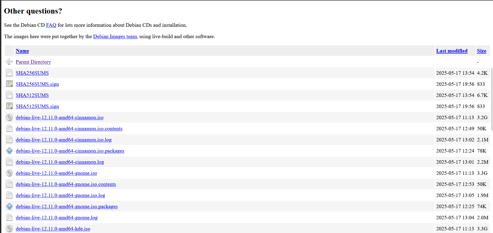


### Creating a bootable USB key


Once you have downloaded the appropriate ISO image, proceed to create your installation media:


- Download Balena Etcher** from the [official website](https://etcher.balena.io/), then get the binary for your system and install it.


- Launch Etcher**: open the software and select the previously downloaded Debian ISO image.
- Choose the USB key**: specify your key (8 GB+) as the target.
- Start flash**: click on **Flash!** and wait until the process is complete.


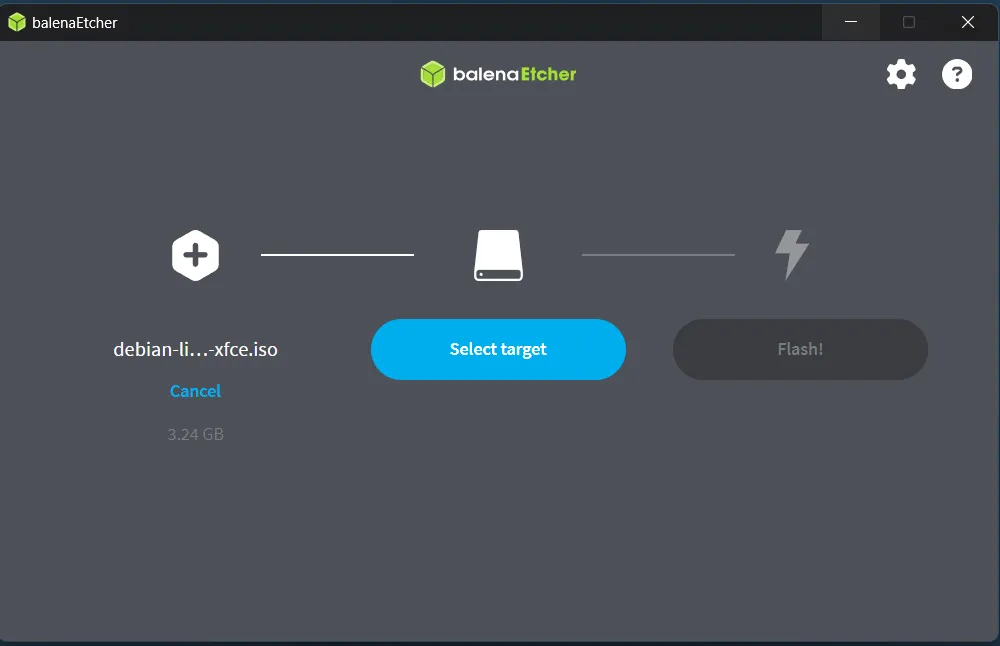


Your USB key is now ready to start installing Debian.


## Installing Debian on your system


### Booting from USB key


To launch the installation from your USB key:


- Switch off** the computer completely.
- Reboot** then access BIOS/UEFI by immediately pressing `ESC`, `F2`, `F11` (or the dedicated key depending on your brand).
- In the boot menu, **select your USB key** as the boot device.
- Confirm** with the Enter key to start on the Debian image: this will take you to the installer's welcome screen.


### Launching the installation


Start screen:


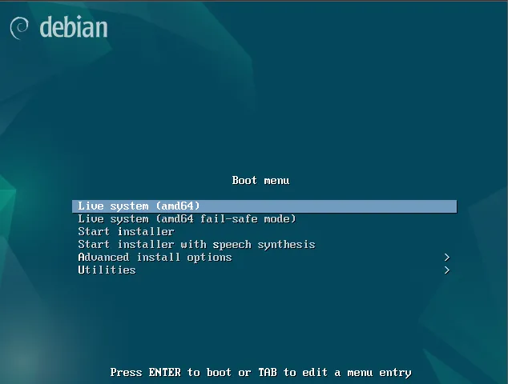


When booting from the USB stick, the Debian welcome screen offers several options:


- Live System**: launches Debian without installing it, ideal for testing the environment.
- Start Installer**: starts installation directly on the hard disk.
- Advanced Install Options**: gives you access to customized installation modes.


To explore Debian in live mode, select **Live System** and confirm with **Enter**. You can then launch the installation by clicking on **Install Debian** in the live environment.


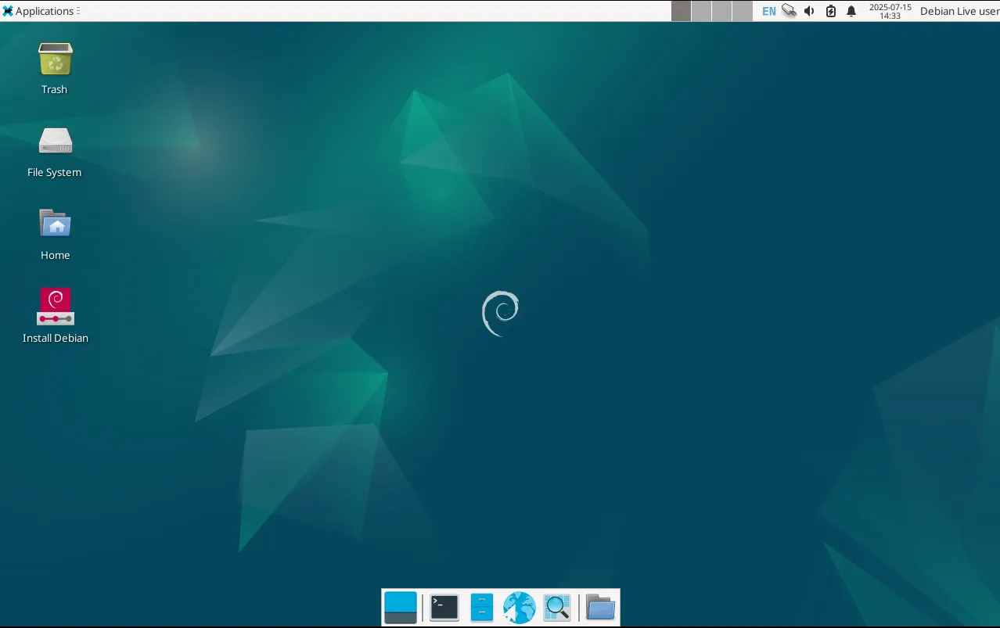


- Language selection** (optional)


Select the main language of your Debian system from the list, then click OK.


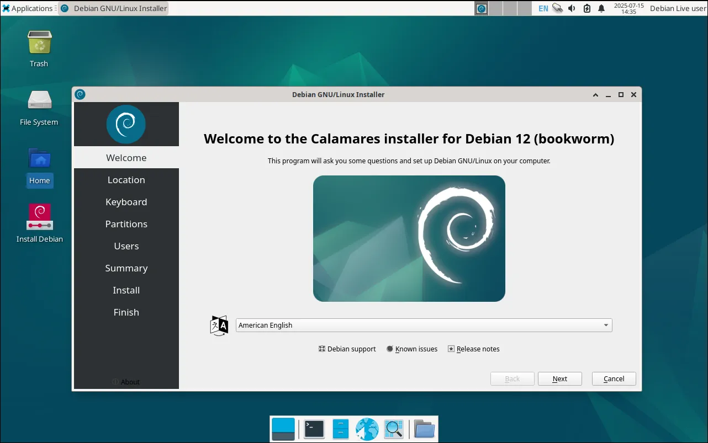


- Time zone** (GMT)


Choose your geographic zone to automatically set the date and time.


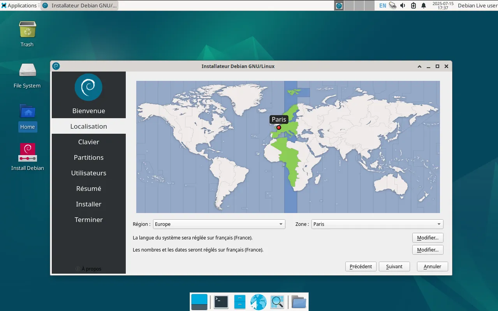


- Keyboard layout


Select your keyboard language and layout. Use the built-in test field to check that each key produces the expected character.


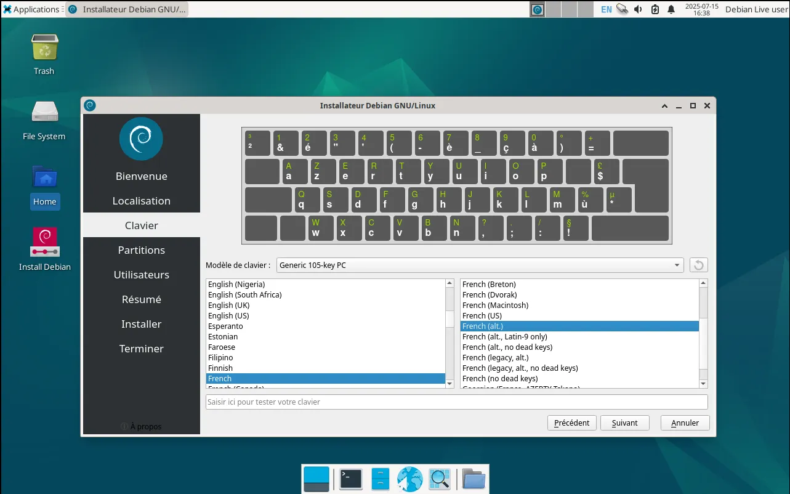


### Disk partitioning


- Erase disk**: if you have a dedicated partition, this option will delete all its contents.
- Manual partitioning**: choose this option to create, resize or delete partitions as required.


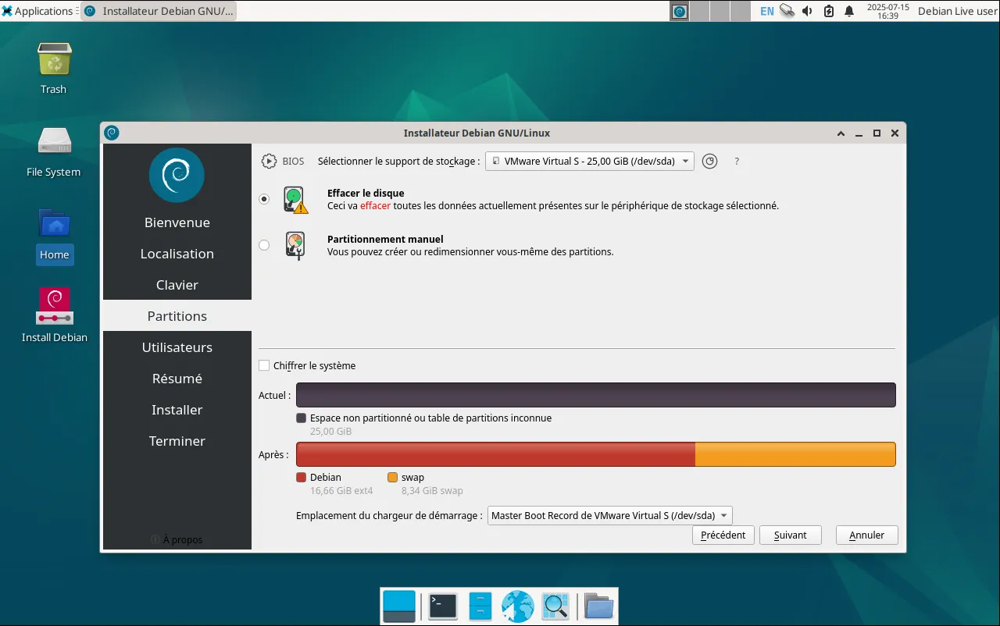


- Creating a user account


Enter your full name, account name and a strong password to ensure your session is secure.


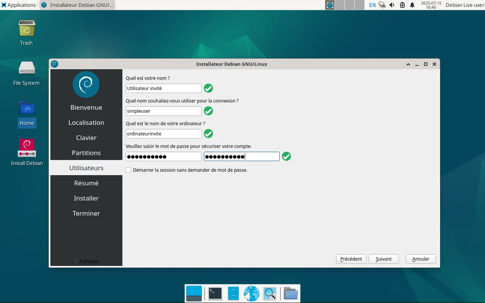


- Parameter summary**


A summary of your choices is displayed: check each item and go back to modify if necessary.


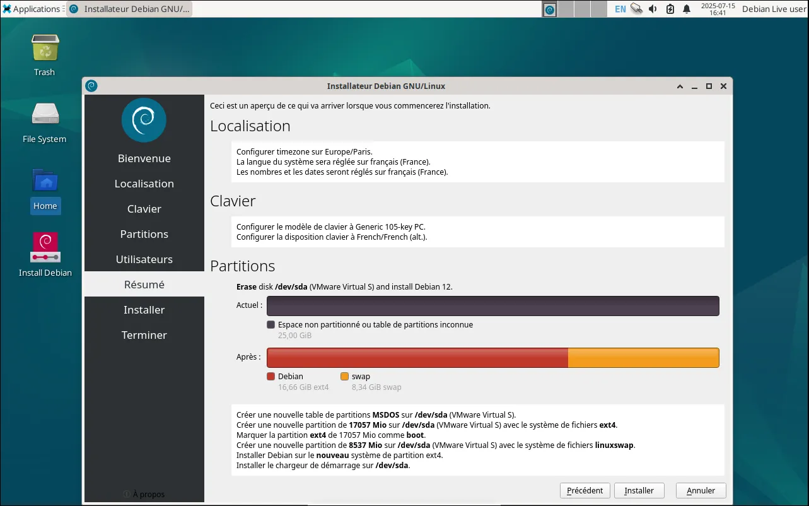


- Launching the installation


Click on **Install** to start copying files and configuring the system, then wait until the process is complete.


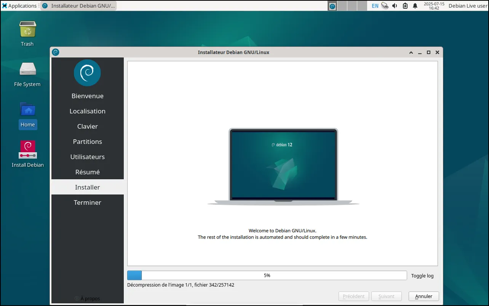


- Restart**


Once installation is complete, reboot the computer to apply all configurations and access your new Debian system.


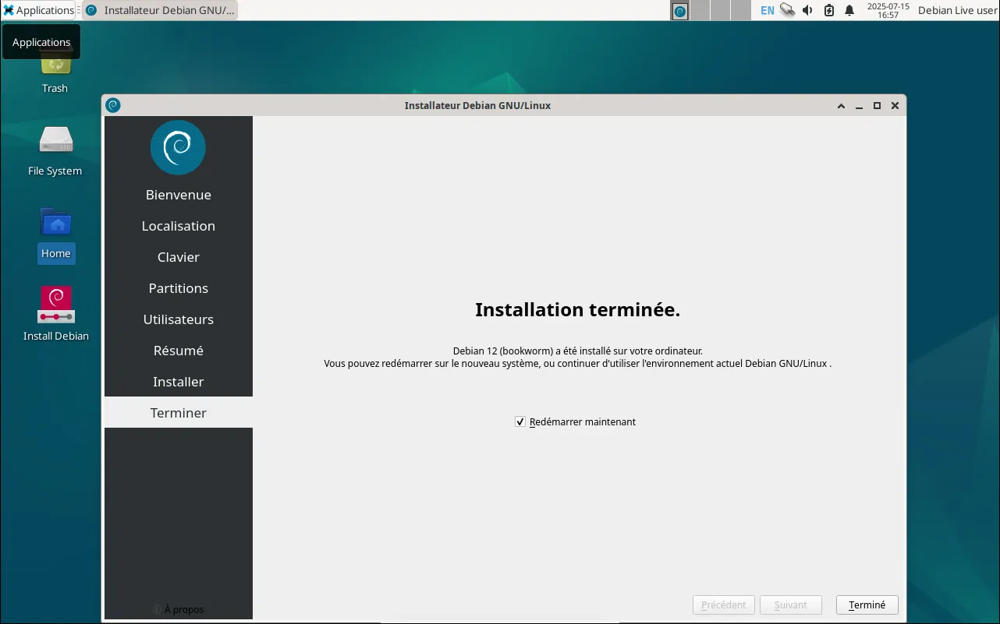


At startup, enter the user name and password to access the system.


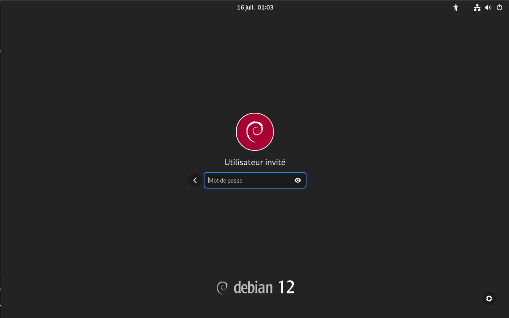


## System update


Before you start using your system, it's essential to update it. This allows you to benefit from the latest software patches, up-to-date repositories, and in some cases, security patches for the operating system itself.


### Option 1: Update via graphical Interface (GNOME)


If you have installed Debian with the GNOME desktop environment, you can perform updates graphically. To do this, open the **Software** application, then go to the **Updates** tab. Then click on **Restart and update** to start the process.


### Option 2: Update via terminal (recommended)


This method offers more complete control. It allows you to update repositories, software packages and, if necessary, the kernel.


- Open the terminal using the shortcut `Ctrl + Alt + T`.
- Update the list of available packages with the following command:


```shell
sudo apt update
```


Enter your password when prompted (note that no characters will be displayed as you type - this is normal).


- To install available updates:


```shell
sudo apt full-upgrade
```


## Discover the basic tasks


### Browsing the Internet


The default web browser on Debian is **Firefox**. If you prefer another browser, you can install another, provided it is available in the Debian repositories (such as Chromium, Brave...).


### Word processing


The **LibreOffice** suite is installed by default on Debian.


- To write documents, use **LibreOffice Writer**, the equivalent of Microsoft Word.
- For spreadsheets, **LibreOffice Calc** acts as an alternative to Excel.
- Finally, **LibreOffice Impress** lets you create presentations, just like PowerPoint.


## Installing applications


There are two ways to install applications on Debian:


### Graphical method:


You can use the **software manager** (accessible via the graphical Interface) to easily search for and install applications.


### Command-line method:


If the application you're looking for doesn't appear in the graphical Interface, or if you prefer the terminal, use the following command:


```shell
sudo apt install <name>
```


Replace `<name>` with the package name. For example, to install `curl`:


```shell
sudo apt install curl
```


### Installing a manually downloaded package:


If you have downloaded a `.deb` file (Debian package), you can install it with the following command:


```shell
sudo apt install ./name.deb
```


https://planb.network/tutorials/computer-security/operating-system/lynis-1cf865b3-a352-4dd2-94d2-f17fa65547af

Your Debian system is now installed and ready to use for your daily tasks.

Thanks to the **GNOME** desktop environment, you can access a wide range of applications via a user-friendly graphical Interface, ideal for beginners and advanced users alike.


It's also possible to change your desktop environment (e.g. to XFCE, KDE, etc.) without having to reinstall Debian. To do this, simply use the terminal and install the new environment of your choice.


To learn more about Debian, and more generally about GNU/Linux distributions, I recommend that you consult this course:


https://planb.network/courses/4ba0e3de-e67f-4ea1-a514-f111206810d1