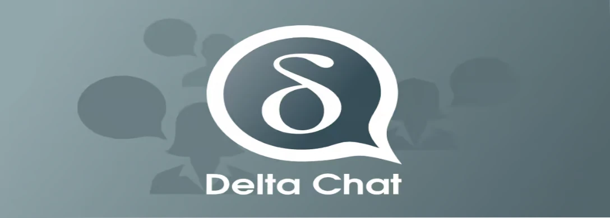
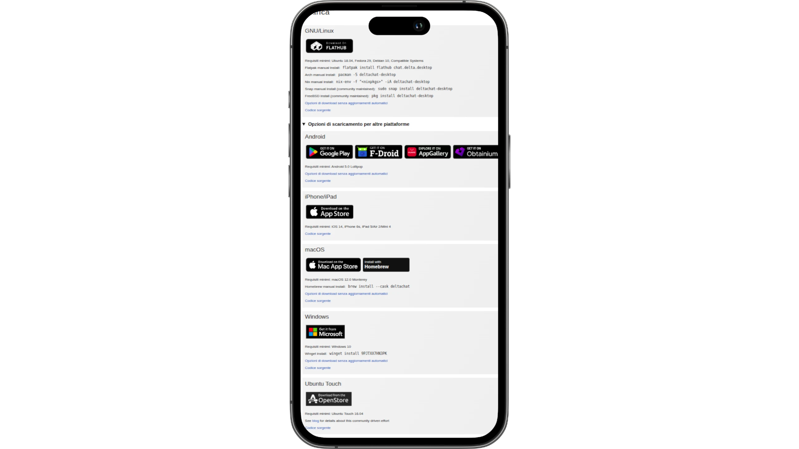
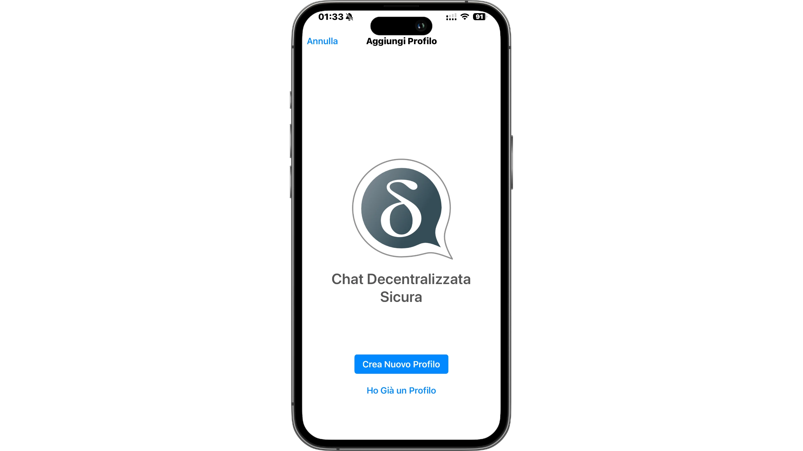
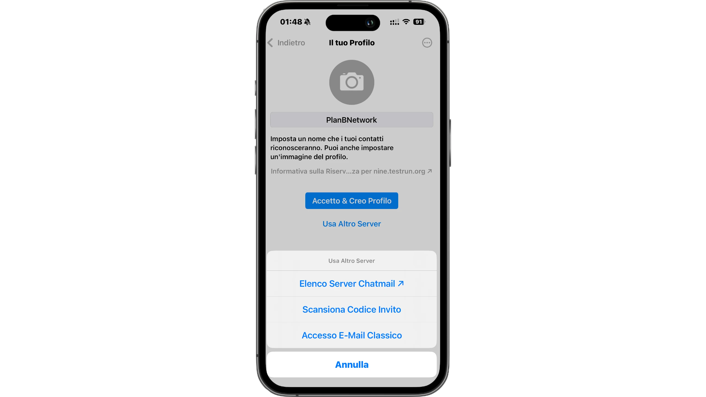
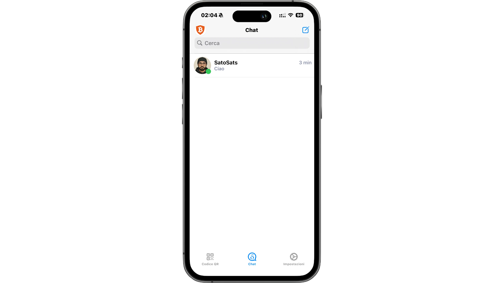
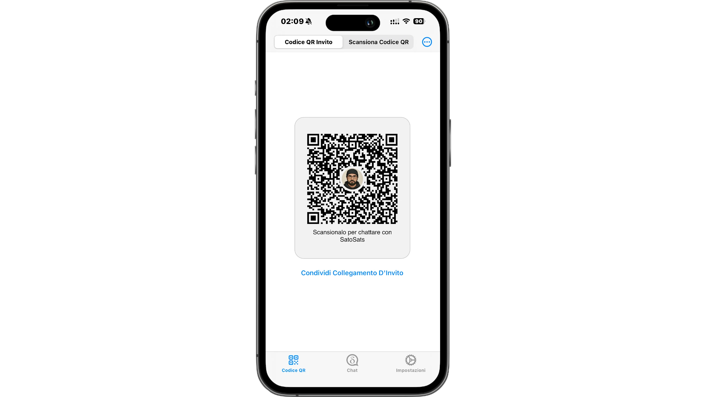
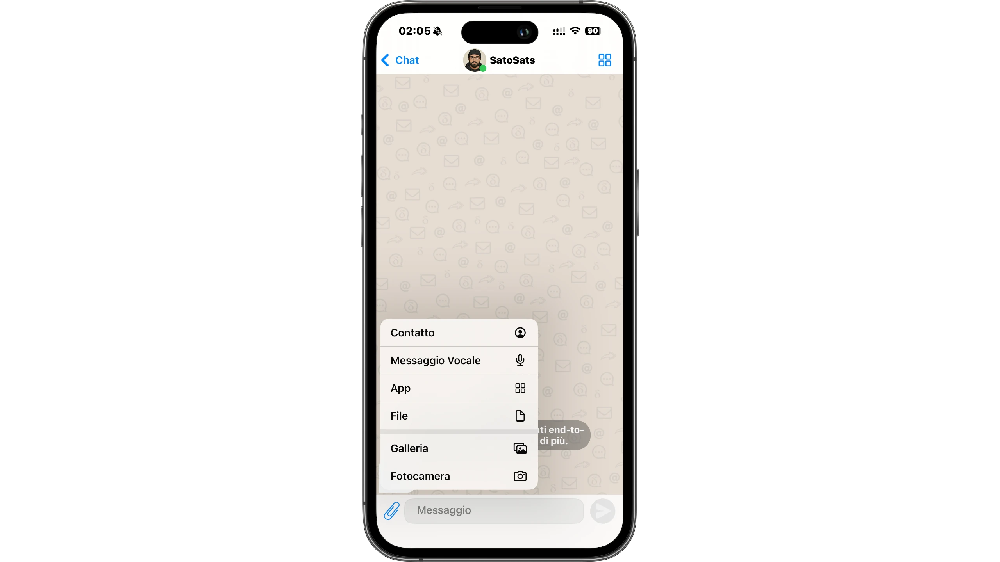
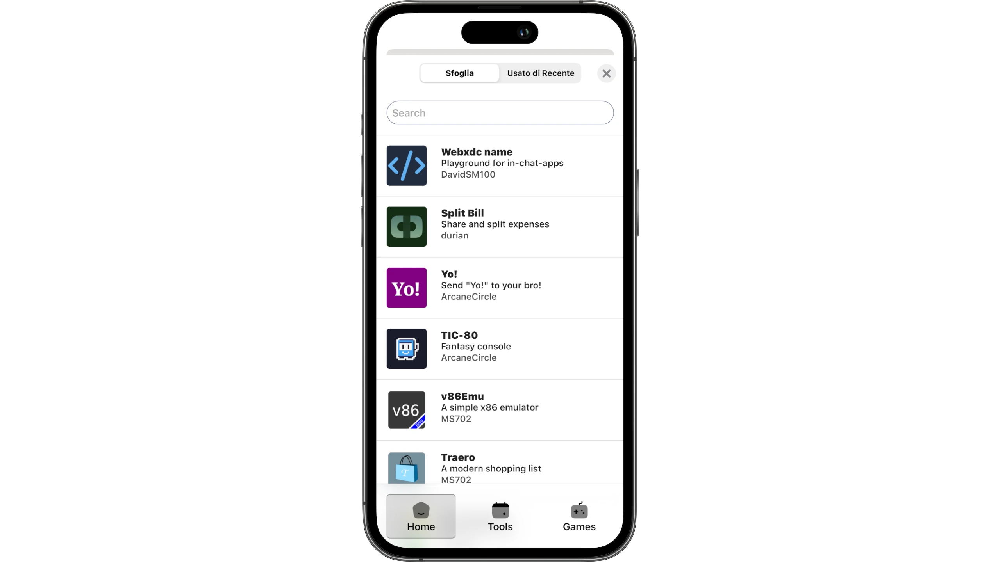
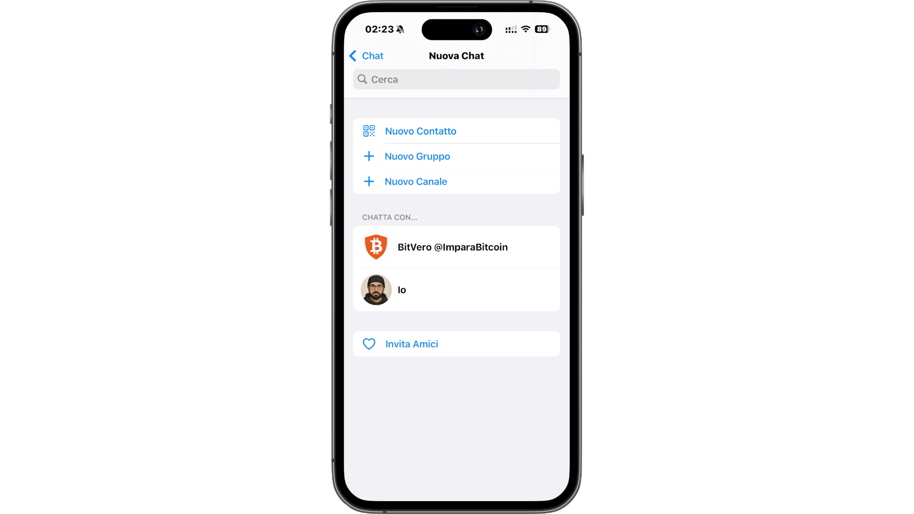
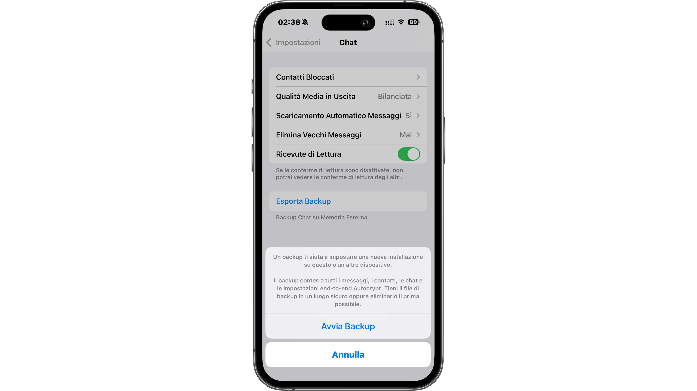

## Introduktion - Chattkontroll och integritet

Under de senaste åren har det talats allt mer om Chat Control, ett lagförslag som syftar till att införa automatisk skanning av privata meddelanden på stora kommunikationsplattformar. Det uttalade målet är att bekämpa olagligt innehåll, men problemet är att denna mekanism i själva verket skulle innebära massövervakning, vilket skulle undergräva end-to-end-kryptering och därmed integriteten för alla användare, inte bara brottslingar.

Den verkliga risken är att chattar blir kontrollerade miljöer, där varje meddelande, bild eller bilaga kan granskas innan det ens når mottagaren. Och det är här en möjlig lösning kommer in i bilden: bort från centraliserade plattformar och över till decentraliserade meddelandesystem, som inte är beroende av en enda leverantör och som inte så lätt kan utsättas för den här typen av granskning.

En sådan lösning kommer att presenteras i denna handledning: Delta Chat. Ett moget och redan användbart verktyg.

## Varför Delta Chat och hur det fungerar

Delta Chat är en redan mycket bra meddelandelösning för daglig användning: mycket användbar för att prata med vänner, familj och andra människor, precis som en riktig motsvarighet till WhatsApp.

Det är ett decentraliserat meddelandesystem som är helt baserat på e-post. Det utnyttjar i princip infrastrukturen för traditionell e-post, men bygger ett modernt instant messenger-gränssnitt och en upplevelse ovanpå det. Vid första anblicken kan detta verka lite improviserat, men det fungerar faktiskt mycket bra och är förvånansvärt robust. Du kan använda dedikerade e-postservrar som heter ChatMail, men det kan också fungera sömlöst med vanliga e-postservrar. Det innebär att du kan logga in med ett befintligt konto om du vill, utan att behöva skapa något nytt.

En annan höjdpunkt är stödet för WebXDCs, som är små webbapplikationer som kan användas direkt i chattar, på samma sätt som mini-apparna i Telegram. Den viktiga skillnaden är att dessa appar inte har tillgång till Internet, så de kan inte spåra användaren eller skicka data externt.

Ur ett säkerhetsperspektiv använder Delta Chat verifierad end-to-end-kryptering, baserad på PGP men med moderna tillägg som gör det jämförbart i skyddsnivå med Signal. Den enda nuvarande bristen är Perfect Forward Secrecy, men det är en aspekt under utveckling.

Delta Chat är enbart baserat på e-post och undviker det helt och hållet:

- obligatoriska telefonnummer
- Centraliserade ID:n
- registreringar kopplade till en enda tjänst

Och det är det som gör det här verktyget mycket motståndskraftigt mot invasiva regleringar som Chat Control.

## Installation

Från den officiella webbplatsen för [Delta Chat] (https://delta.chat/download) kan du gå till avsnittet Ladda ner. På Linux är det bekvämt tillgängligt via Flathub, men det finns också paket för Arch, NixOS, Snap och fristående versioner.

Den är också tillgänglig för:

- [F-Droid] (https://f-droid.org/app/com.b44t.messenger)
- [Play Store] (https://play.google.com/store/apps/details?id=chat.delta)
- [iOS] (https://apps.apple.com/it/app/delta-chat/id1459523234)
- [Windows] (https://apps.microsoft.com/detail/9pjtxx7hn3pk)
- [macOS] (https://apps.apple.com/it/app/delta-chat-desktop/id1462750497)
- [Ubuntu Touch] (https://open-store.io/app/deltatouch.lotharketterer)
- och andra butiker...

Om du letar efter en guide för att installera F-Droid kan den här handledningen hjälpa dig:

https://planb.academy/tutorials/computer-security/data/f-droid-2cd1aae5-7028-4c04-8fbe-95aeaf278ef4

En mycket viktig sak: skrivbordsversioner kräver inte en telefon. Till skillnad från WhatsApp eller SimpleX Chat behöver du inte registrera dig från mobilen först. Du kan skapa din profil direkt på datorn eller överföra den från en annan enhet.

## Skapande av profil

När appen är öppen frågar Delta Chat om du vill skapa en ny profil eller använda en befintlig.

Genom att skapa en ny profil kan du ange:

- ett namn
- en bild (valfritt)

En ChatMail-server är föreslagen som standard, men det är möjligt:

- välja en annan ChatMail-server
- använda ett klassiskt e-postkonto
- konfigurera IMAP och SMTP manuellt
- registrera dig med hjälp av en annan användares inbjudningskod

Efter några sekunder är profilen klar och du kan börja använda appen.

## Interface och chatt

Gränssnittet är mycket enkelt och okomplicerat:

- Enhetsmeddelanden, som är lokal kommunikation
- Sparade meddelanden, liknande de i Telegram och synkroniserbara mellan enheter

Lägg till en kontakt helt enkelt:

- Visa din QR-kod
- Skanna den andra personens
- Bjud in via länk (dela inbjudningslänk).

När anslutningen har upprättats konfigureras end-to-end-kryptering automatiskt. Användargränssnittet för chatten är mycket likt det för WhatsApp:

- text- och röstmeddelanden
- foton, videor och filer
- svar på meddelanden
- reaktioner
- popup-meddelanden
- anpassningsbara meddelanden.

## WebXDC: appar i chattar:

Delta Chat tillåter användning av WebXDC, dvs. små applikationer inbäddade i konversationer. Här är en kort lista över de mest användbara som identifierats:

- undersökningar
- ritbrädor
- tillfälliga privata chattar
- spel med delade chattresultat

Mer komplexa spel kan också startas, vilket visar hur flexibelt detta verktyg är.

## Grupper, kanaler och avancerade funktioner

Du kan skapa grupper, använda klistermärken (särskilt på skrivbordsdatorer) och, genom att aktivera de experimentella alternativen, även kanaler, liknande dem i Telegram.

I de avancerade inställningarna kan du slå på:

- röstsamtal (fortfarande experimentellt)
- avancerad hantering av e-postprofiler
- fullständiga säkerhetskopior.

## Flera enheter och säkerhetskopiering

Delta Chat stöder fullt ut flera enheter:

- du kan lägga till en andra enhet via QR-kod
- kan du utföra en fullständig överföring via backup.

På några sekunder hittar du dina chattar, grupper och hela historiken igen, utan att vara beroende av en central server.

## Slutsats

I en tid när det talas alltmer om att kontrollera privat kommunikation representerar Delta Chat ett konkret svar: decentraliserad, krypterad meddelandehantering som verkligen är användbar varje dag.

Det är den lösning som, av alla de jag har provat, har övertygat mig mest för enkelhet, integritet och frihet. Om du vill kan du också kontakta mig på Delta Chat via följande [inbjudningslänk](https://i.delta.chat/#38824F04DD40600D5D4F079C1F5E0EBA875A6D7E&i=GStGfNW5LMIXhwQMiuQWj3QU&s=cVi5izRJ9NsbIcPlU8yC_SeB&a=9l4la5imj%40nine.testrun.org&n=SatoSats)

Om du gillade den här guiden kan du stödja mig genom att donera och lämna en tumme upp. Och kom ihåg: det är bara genom att använda och utforska Delta Chat från både mobil och dator som du verkligen kommer att upptäcka dess fulla funktionalitet.

Tills nästa gång.