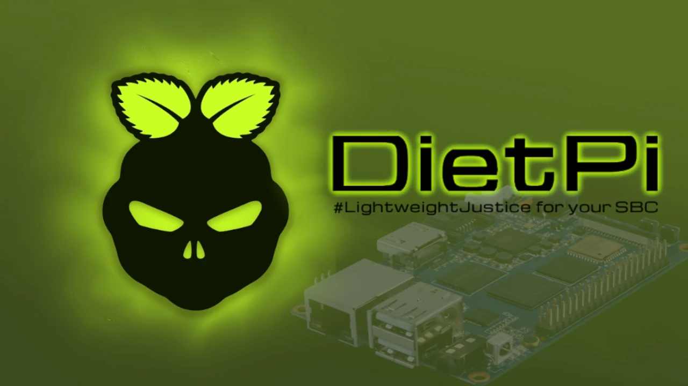


V netechnických kruzích jsou značky jako `Odroid`, `Raspberry Pi`, `Orange Pi` nebo `Radxa` málo známé. Stačí se však podívat do technických kruhů, abychom zjistili, že počítače **SBC** - postavené na jediné základní desce, často mikroskopických rozměrů ve srovnání s běžně používanými počítači - se staly nepostradatelnými jako podpora pro jakýkoli osobní projekt.


Jedná se o počítače vyráběné v široké škále modelů. Přednostně se na nich používají distribuce Linuxu, které jsou často přizpůsobeny pro bezproblémový běh na těchto málo výkonných strojích.


**DietPi není výjimkou**: jedná se o operační systém založený na Debianu, který je optimalizován tak, aby byl co nejlehčí a i ten nejméně výkonný `SBC` byl velmi rychlý. Přešel z Debianu12 Bookworm na Debian13 Trixie právě v době psaní tohoto návodu a nyní podporuje také open source SBC s procesory `RISC-V`. DietPi je příjemný objev, který si zaslouží další studium.


## Silné stránky


Nejedná se o "obvyklý duplikát" Debianu pro malé desky typu Raspberry. DietPi je:


- Optimalizováno pro rychlost a lehkost**: [srovnání s ostatními distribucemi Debianu pro SBC](https://dietpi.com/blog/?p=888), DietPi je ve všem lehčí. Obraz ISO DietPi váží méně než 1 GB, což je zdaleka nejméně mezi těmi, které jsou určeny pro starší modely Raspberry nebo Orange PI (například). Nároky na prostředky RAM a CPU jsou velmi nízké, takže z desek, i těch starších, vždy dostane to nejlepší.
- Vestavěné automatizace a instalátory**: Sada specializovaných příkazů pomáhá uživatelům sledovat systémové prostředky a automatizovat úlohy instalace a spouštění programů, aktualizace verzí, zálohování a kontroly všech protokolů.
- Silná komunita zaměřená na experimenty**: [návody](https://dietpi.com/forum/c/community-tutorials/8) a projekty komunity DietPi jsou ideální pro získání inspirace softwarem, který si díky DietPi můžete nainstalovat jedním kliknutím.


**Vyždímat z vašeho SBC každý kousek nebylo nikdy jednodušší**.


## Automatizace pro selfhosting


Chcete experimentovat s vlastním serverem a provozovat pokročilá síťová řešení nebo nástroje pro rozvoj svých znalostí Bitcoin? DietPi může být řešením, které hledáte. Přestože mnoho lidí umí spravovat vlastní infrastrukturu a provozovat dokonale nakonfigurované a chráněné servery, DietPi je vhodným krokem pro ty, kteří chtějí začít od nuly.


Namísto ručního provádění všech složitých úkonů, které takový úkol vyžaduje, umožňuje DietPi jejich sestavení pomocí `průvodce` a vlastního příkazového řádku. Zde můžete experimentovat s vlastním osobním cloudem, správou zařízení _chytré domácnosti_, automatickým zálohováním a crontabem, stejně jako s pokročilejšími řešeními.


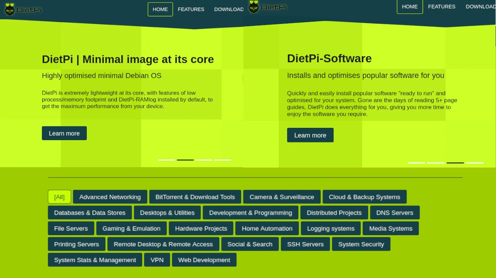


## Instalace


### Stáhnout


DietPi nabízí nespočet sad obrazů ISO, které umožňují vypálit operační systém na mnoho různých zařízení. Některé jsou zatím jen podporované: například ISO pro Raspberry PI5 je zatím ve fázi testování, ale určitě najdete ten, který je vhodný pro vaši desku.


V tomto průvodci jsem se rozhodl nainstalovat jej na tenkého klienta, takže jsem zvolil možnost _PC/VM_ a poté _Nativní PC_. Pro tato zařízení existují dva obrazy ISO, které se liší generováním zavaděče. Stroj použitý v návodu je poměrně starý, takže volba padla na verzi _BIOS/CSM_. Pokud máte novější stroj, správnou verzí může být `UEFI`.


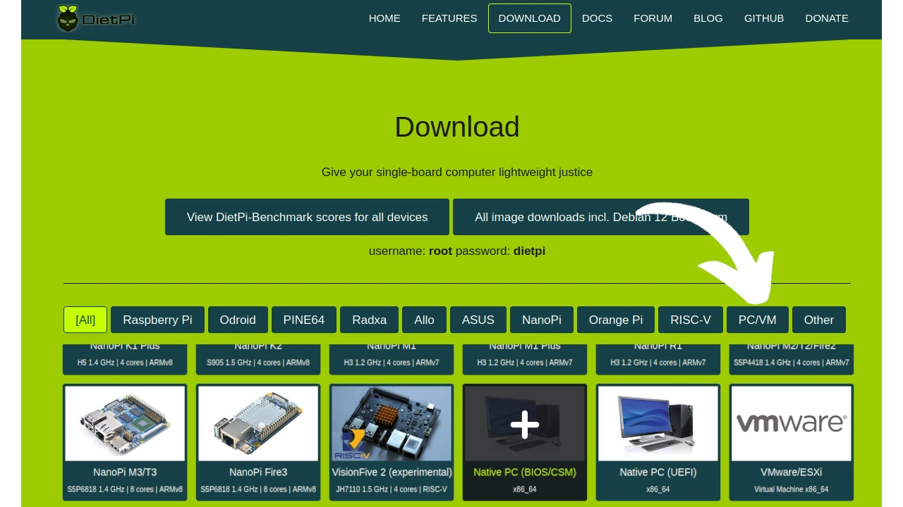


Dostanete se na stránku, která obsahuje `obraz instalačního programu`, `sha256` a `podpisy`.


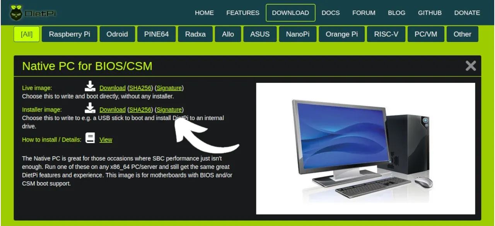


Připravte si adresář v `home` svého počítače, abyste mohli stáhnout potřebné soubory pomocí `wget`.


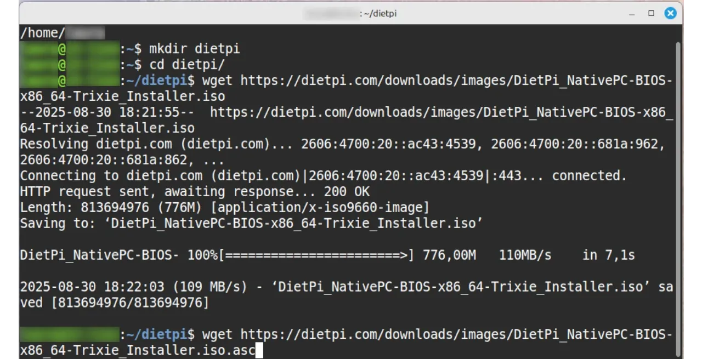


Veřejný klíč vývojáře vyžadoval minimální zkoumání, ale můžete jej najít na tomto odkazu: https://github.com/MichaIng.gpg.


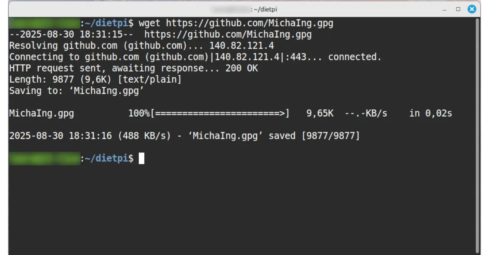


Zkontrolujte obsah adresáře pomocí `ls -la` a importujte klíč MichaIng do svého svazku klíčů pomocí `gpg --import`.


### Ověřování a blesk


A konečně část, kterou doporučuji nejvíce: ujistěte se o pravosti operačního systému, který jste si stáhli a který se chystáte nainstalovat na svůj SBC.


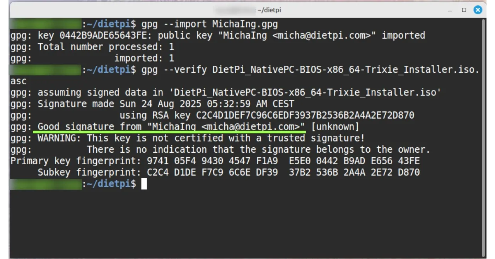


Pokud jste také získali výsledek `Dobrý podpis` a stejnou kontrolu Hash pomocí příkazu sha256sum, můžete pokračovat ve flashování ISO na USB flash disk. Použijte k tomu aplikace jako Whale Etcher.


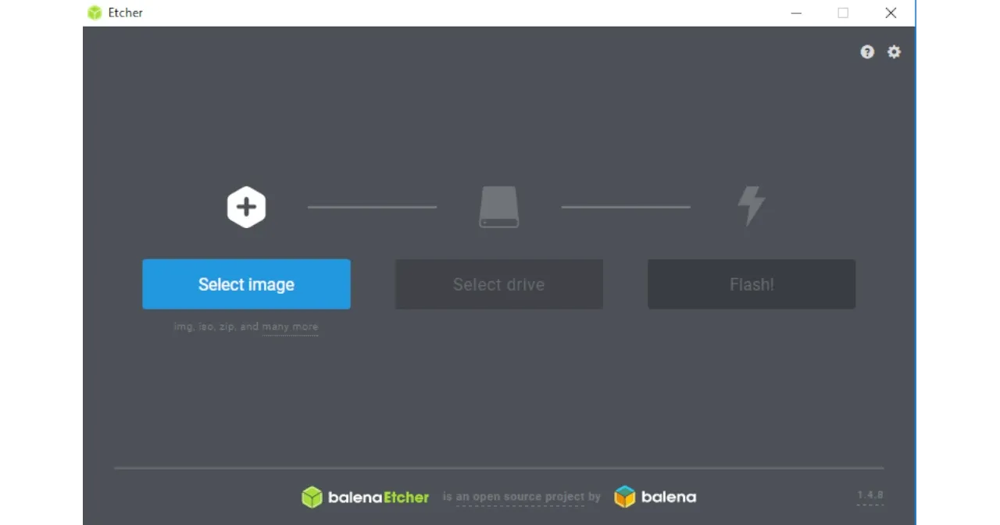


## Instalace systému DietPi


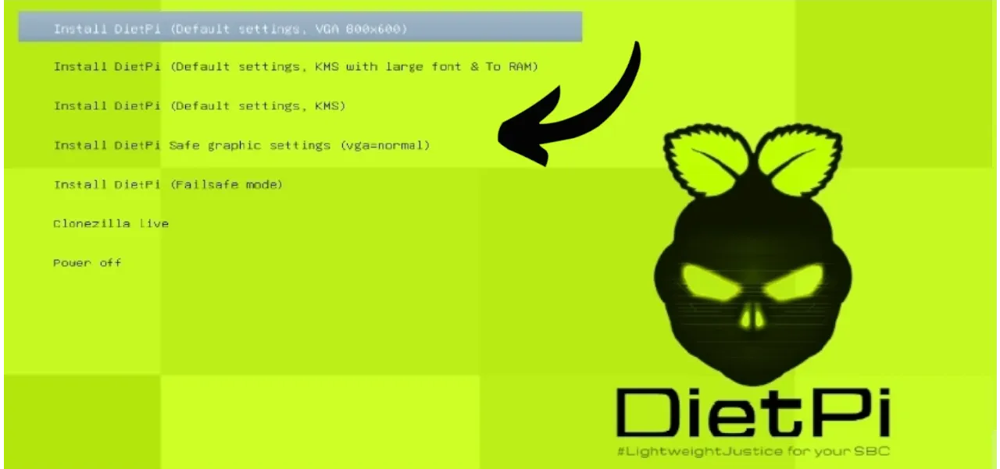


Přeneste flash disk do zařízení, které bude hostitelem DietPi, a začněte instalovat operační systém lime Green. V tomto cvičení používáme tenkého klienta s 16 GB paměti RAM, 128 GB SSD pro operační systém a druhý datový disk o kapacitě 1 TB. Instalace trvala méně než 30 minut, ale pokud budete používat například Raspberry, může být prostředků méně a trvat déle. Během instalace se vám zobrazí průběh.


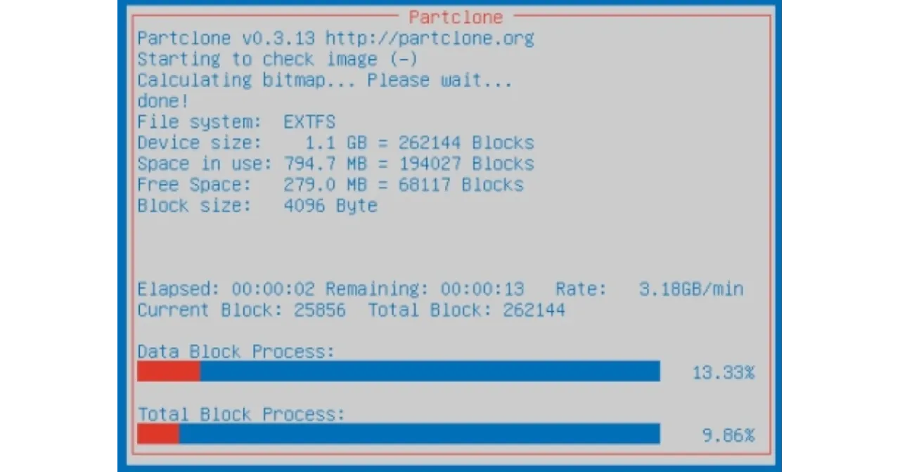


Vzhledem k tomu, že je DietPi určen pro Raspberry a podobné zařízení, je jeho pravou podstatou takzvaná instalace bez grafického prostředí a s nativním přístupem `shsh'. V příručce místo toho uvidíte grafické prostředí, přesněji řečeno LXDE.


V tomto kroku budete také vyzváni k rozhodnutí, který webový prohlížeč chcete používat jako výchozí, a to mezi Chromem a Firefoxem. Oba fungují dobře; pro žádný z nich neexistují žádné zvláštní kontraindikace kromě vašich osobních preferencí.


Ke konci se vás instalátor může zeptat, zda již chcete nainstalovat nějaké programy, ale zde **doporučuji nic předem nenahrávat**. Měli byste vědět, že po tomto kroku budete z bezpečnostních důvodů vyzváni ke změně výchozích hesel obou uživatelů. Především budete vyzváni k **nastavení `Globálního softwarového hesla (GSP)`**, které zajistí kontrolovaný přístup k různým programům. **Pokud během instalace operačního systému stáhnete jakýkoli software, bez nastaveného `GSP` zůstane prakticky nepřístupný**. Po nastavení `Global Software Password` je budete muset odinstalovat a znovu nainstalovat: proto **nedávejte nic, abyste se vyhnuli dvojí práci**. (Nepříjemnost je pravděpodobná, nikoliv stoprocentně jistá).


Instalace končí žádostí o aktivaci služby DietPi-Survey, která slouží k automatickému sběru dat a podporuje vývoj operačního systému. Podle webových stránek se sběr dat aktivuje při stažení libovolného softwaru z automatizace poskytované společností DietPi nebo při aktualizaci na další verzi. Každý má možnost se zapojit (_Opt IN_) nebo odhlásit (_Opt OUT_).


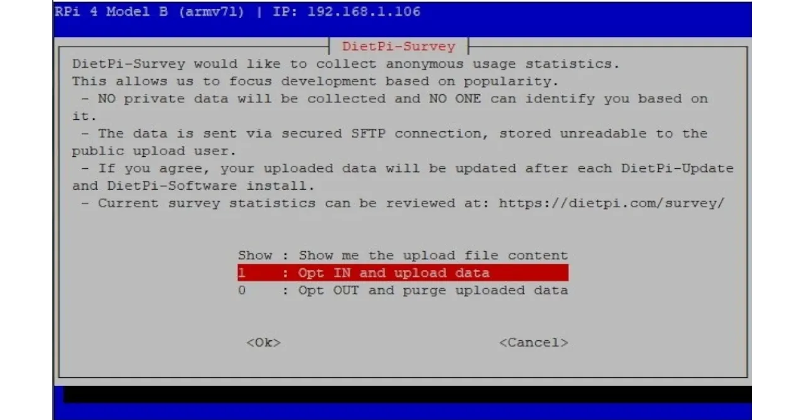


Po dokončení instalace a následném restartu se na obrazovce zobrazí DietPi, jak jste jej nastavili. Pro výukový program jsem, jak již bylo zmíněno, zvolil grafické prostředí `LXDE`. Na ploše jsem našel zástupce pro spuštění `htop` a otevřený terminál.


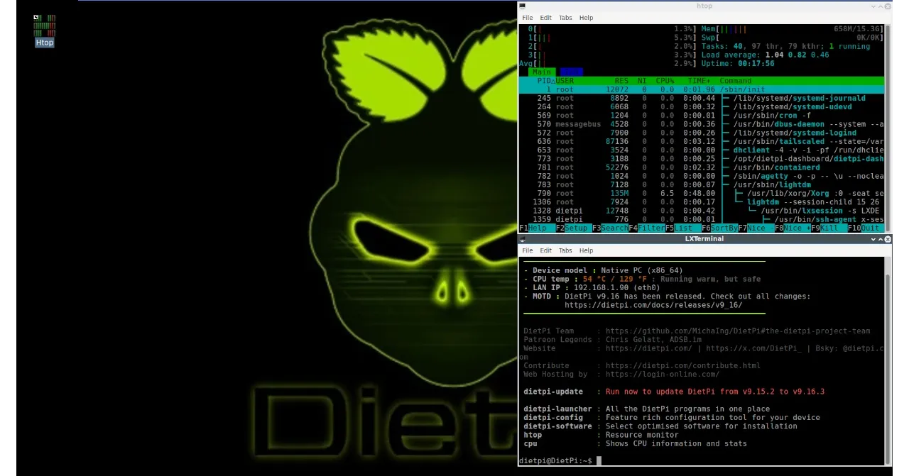


### "Nástroje" z operačního systému


Zapomeňte na většinu programů, které používáte ve své distribuci Linuxu - DietPi je tak optimalizovaný, že jste jich dost vynechali. V podstatě byste museli spoustu příkazů instalovat ručně, ale pokud to teprve zkoušíte, odolejte pokušení a zkuste automatizaci DietPi otestovat.


Je to rozhodně terminál, který je prvním užitečným nástrojem pro začátek práce s novým operačním systémem a otevírá se automaticky při každém zapnutí.


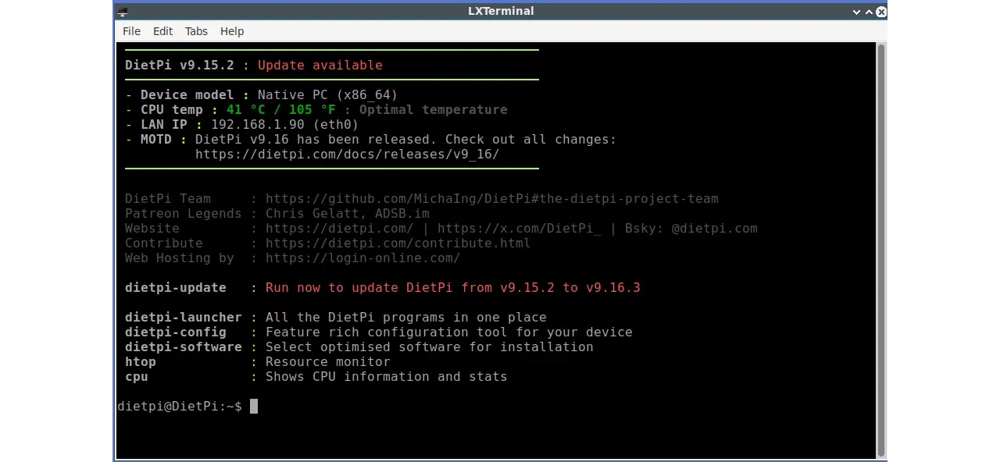


Na obrazovce terminálu najdete řadu příkazů, před kterými je napsáno `dietpi-` a které představují [nástroje](https://dietpi.com/docs/dietpi_tools/) tohoto operačního systému:


- `dietpi-launcher`: pro přístup k operačnímu systému, správci souborů atd
- `dietpi-Software`: představuje nástroj, pomocí kterého můžete nainstalovat veškerý software, který je již v sadě k dispozici
- `dietpi-config`: pro přístup k systémovým konfiguracím, a to i těm nejpokročilejším.


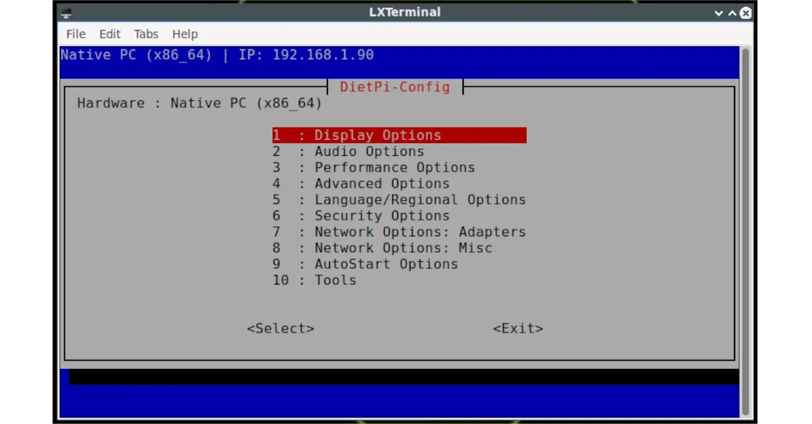


### Záloha


Zálohování serveru je rutina, se kterou by měl správce systému počítat od prvního spuštění.


V DietPi je k dispozici příkaz `dietpi-Backup`, který doporučuji prozkoumat a najít ideální řešení: umožňuje nastavit pravidelné zálohování, přírůstkové nebo nepřírůstkové v závislosti na používaných aplikacích, a všechny možnosti přizpůsobení rutiny.


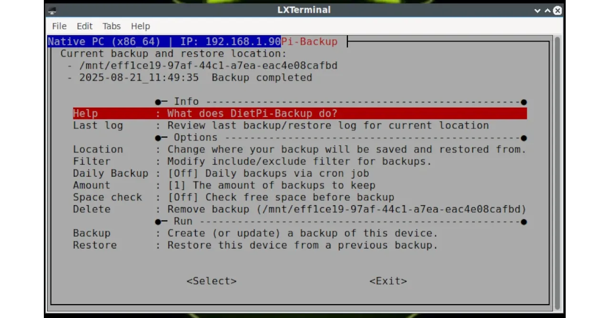


Zvolte cíl zálohy, například jiný disk, spuštěním `dietpi-Drive_Manager`, abyste připojili cílovou jednotku a použili ji pro tuto funkci.


## Konfigurace


Self-hosting je vhodná zkušenost pro každého, ať už je zvědavý, nebo jen nadšený. Vytvoření a konfigurace serveru však s sebou nese nemalé technologické problémy. Zde přichází na řadu **jednoduchost DietPi**, která vám umožní nakonfigurovat systém na míru vašim potřebám v několika jednoduchých krocích.


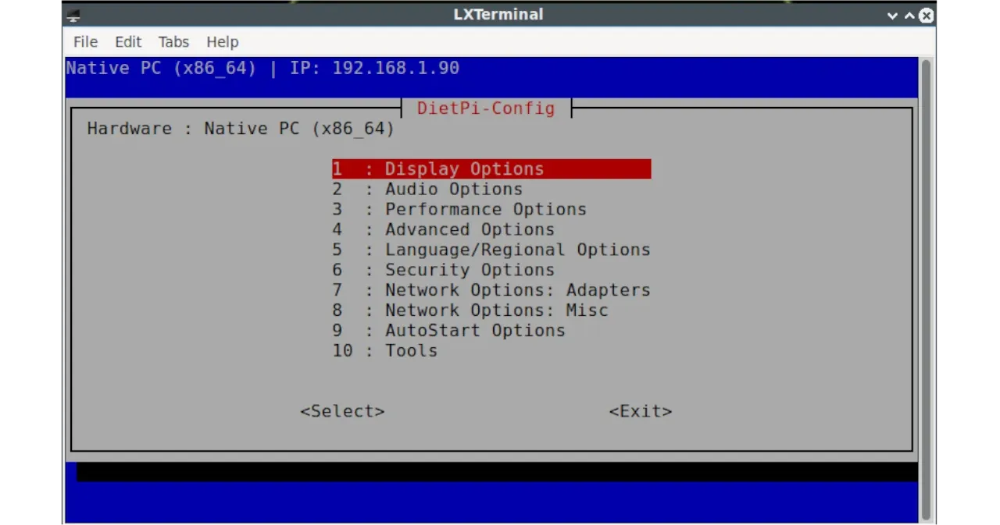


Základní a pokročilá nastavení, vše na dosah ruky v jednom příkazu Interface:


```dietpi-config


sudo dietpi-config


```

Che cosa si può fare ora? Automatizzare i processi da avviare all'accensione del server, configurare il `Locale` e tutte le impostazioni correlate alla Time Zone, impostare le schede di rete, le password e le periferiche audio/video, ad esempio.

## I Pacchetti Software

Tra le caratteristiche di semplicità di DietPi, vi è anche la dettagliata pagina dei Software che - oltre all'elenco delle applicazioni - mostra i primi passi da compiere per installarli e interagire con loro. Prendiamo ad esempio il caso di **Docker**:

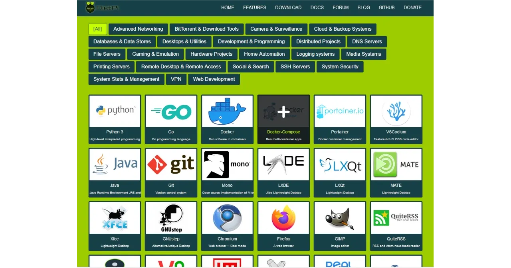

Cliccando sulla sua "icona" compare in alto una finestra, dove è possibile cliccare i link che portano a una spiegazione di massima. La finestra mostra dove si trovano i file più importanti, come accedere all'interfaccia web e tanti altri suggerimenti per un'installazione fluida.

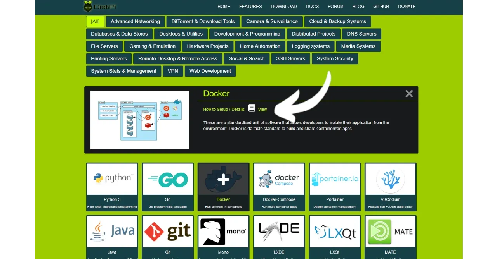

Le applicazioni che prevedono l'interazione dell'utente hanno un'interfaccia web pensata per questo scopo, accessibile all'indirizzo IP che va sempre sotto la sintassi `indirizzo-IP-localhost:porta`. Anche l'URL dell'interfaccia web la trovi se hai cliccato _View_.

Tutti [i software disponibili con DietPi](https://dietpi.com/dietpi-software.html), si installano da terminale, digitando:

```


sudo dietpi-software


```