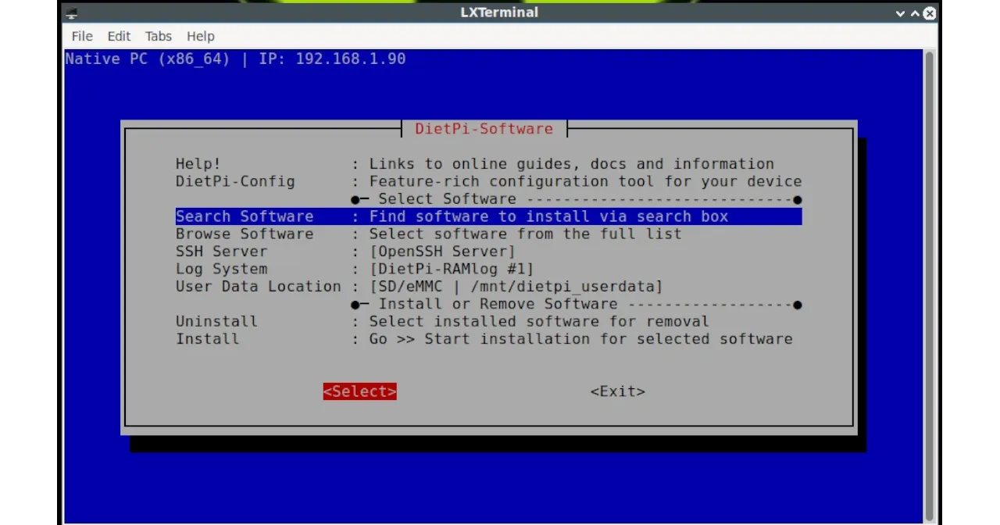
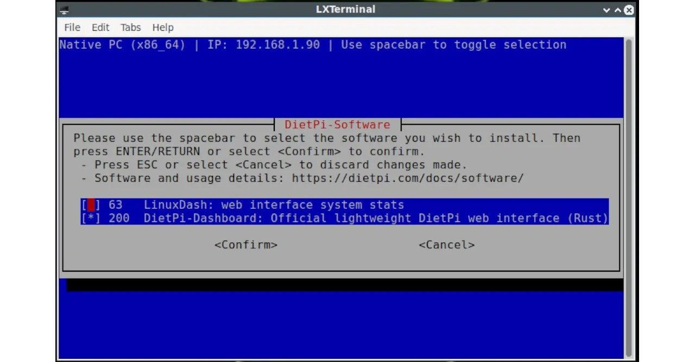
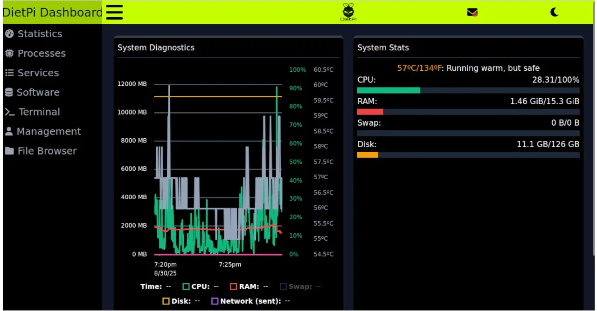
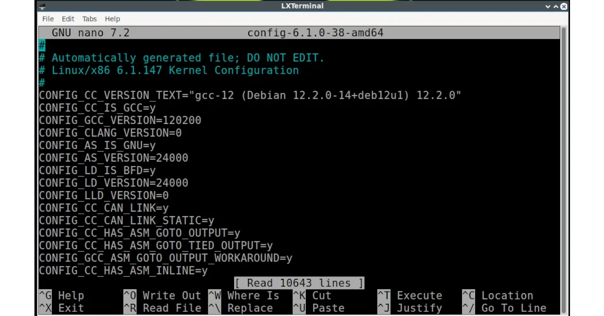
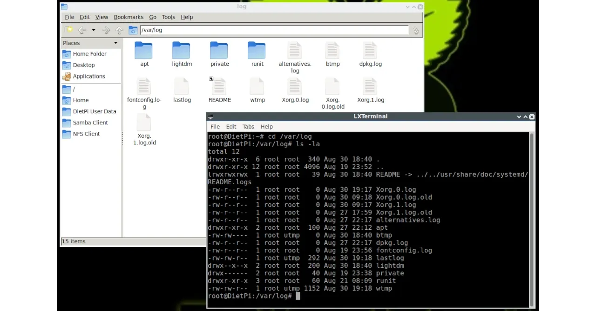
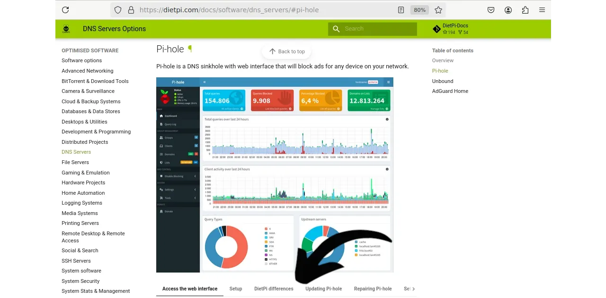
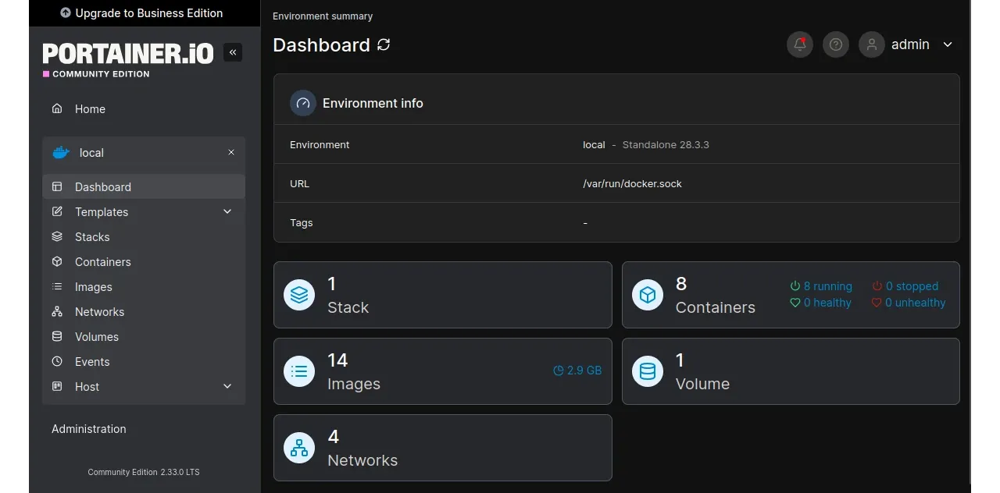

Negli ambienti non tecnici, brand come `Odroid`, `Raspberry Pi`, `Orange Pi` o `Radxa`, sono poco conosciuti. Ma basta affacciarsi in ambito tecnologico, per scoprire che i computer **SBC** - costruiti su una singola scheda madre, spesso di dimensioni microscopiche rispetto ai computer di uso comune - diventano indispensabili, come supporto a ogni progetto personale.

Si tratta di computer prodotti in una grande varietà di modelli. Ospitano preferibilmente distribuzioni Linux, spesso adattate per poter girare senza problemi su queste macchine poco potenti.

**DietPi non fa eccezione**: si tratta di un sistema operativo a base Debian, ottimizzato per essere il più leggero possibile e rendere velocissime anche le `SBC` meno performanti. Passato da Debian12 Bookworm a Debian13 Trixie proprio durante la stesura di questo tutorial, supporta ora anche SBC con processore open source `RISC-V`. DietPi è una piacevole scoperta che merita un approfondimento.

## Punti di forza

Non si tratta del "solito doppione" di Debian per le piccole schede tipo Raspberry. DietPi è:
- **Ottimizzato per velocità e leggerezza**: a [confronto con altre distribuzioni Debian per SBC](https://dietpi.com/blog/?p=888), DietPi è più leggero in tutto. L'immagine ISO di DietPi pesa meno di 1 GB, di gran lunga la più contenuta tra quelle dedicate ai modelli meno recenti di Raspberry o Orange PI (ad esempio). La richiesta di risorse RAM e CPU è ridottissima, così da riuscire a tirare sempre fuori il meglio dalle schede, anche quelle più datate.
- **Automazioni e installer incorporati**: una suite di comandi dedicati aiuta l'utente a monitorare le risorse di sistema, nonché ad automatizzare le operazioni per installare e lanciare programmi, aggiornare le versioni, fare backup e controllare tutti i log.
- **Una community forte e orientata alla sperimentazione**: [tutorial](https://dietpi.com/forum/c/community-tutorials/8) e progetti della community DietPi, sono ideali per lasciarsi ispirare dai software che puoi installare con un click, grazie a DietPi.

**Spremere ogni bit dalla tua SBC non è mai stato così semplice**.

## Automazioni per self-hosting
Vuoi sperimentare con un tuo server per far girare soluzioni avanzate di networking, oppure strumenti per far evolvere la tua esperienza in ambito Bitcoin? DietPi potrebbe essere la soluzione che stavi cercando. Anche se molti sanno gestire la propria infrastruttura ed eseguono server perfettamente configurati e protetti, DietPi è uno step adatto a chi desidera iniziare da zero.

Anziché eseguire manualmente tutti i compiti complessi che un task del genere richiede, DietPi ti permette di costruirli con un `wizard` e la sua riga di comando. Ecco che puoi sperimentare il tuo cloud personale, la gestione dei dispositivi _smart home_, backup e crontab automatizzati, ma anche soluzioni più avanzate.


## Installazione

### Download

DietPi propone una serie innumerevole di immagini ISO, per masterizzare il sistema operativo su molti dispositivi diversi. Alcuni sono solo supportati: l'ISO per Raspberry PI5 è ancora in test, ad esempio, ma puoi sicuramente trovare quella adatta alla tua scheda.

Per questa guida ho scelto di installarlo su un thin client, pertanto la scelta è andata su _PC/VM_ e poi su _Native PC_. Per questi dispositivi esistono due immagini ISO, che si differenziano per la generazione del bootloader. La macchina usata nell'esercitazione è piuttosto datata, pertanto la scelta è caduta  sulla versione _BIOS/CSM_. Se hai una macchina più recente, la versione corretta potrebbe essere la `UEFI`.


Atterrerai sulla pagina che contiene l'`immagine dell'installer`, lo `sha256` e le `Signature`. 


Prepara una directory nella `home` del tuo computer quotidiano, così da scaricare i file necessari, con `wget`.


La chiave pubblica dello sviluppatore ha richiesto un minimo di ricerca, ma puoi trovarla a questo link: https://github.com/MichaIng.gpg.


Controlla il contenuto della directory con `ls -la` e importa la chiave di MichaIng nel tuo keyring, con `gpg --import`.

### Verifica e flash

Infine la parte che più ti raccomando: accerta l'autenticità del sistema operativo che hai scaricato e ti appresti ad installare sulla tua SBC. 


Se anche tu hai ottenuto il risultato `Good signature` e lo stesso hash di controllo col comando sha256sum, puoi procedere a flashare l'ISO su una chiavetta USB. Per farlo usa app come Balena Etcher.


## Installazione DietPi


Trasferisci la chiavetta sul dispositivo che ospiterà DietPi e inizia l'installazione del sistema operativo verde lime. In questa esercitazione stiamo usando un thin client con 16 GB di RAM, un SSD da 128 GB per il sistema operativo e un secondo disco dati da 1 TB. L'installazione ha richiesto meno di 30 minuti, ma se userai una Raspberry, ad esempio, le risorse potrebbero essere inferiori e richiedere un tempo maggiore. Durante l'installazione ti verranno mostrati i progressi.


Essendo pensato per le Raspberry e simili, la vera natura di DietPi è l'installazione cosiddetta `headless`, senza ambiente grafico e con l'accesso in 'ssh' nativo. Nella guida invece vedrai un ambiente grafico, LXDE per la precisione.

Durante questa fase ti verrà chiesto anche di decidere quale browser web vuoi usare di default, tra Chromium e Firefox. Entrambi funzionano bene, non ci sono controindicazioni particolari su nessuno dei due, a parte la tua personale preferenza.

Verso la fine, l'installer potrebbe chiederti se vuoi già installare qualche programma, ma qui **ti consiglio di non pre-caricare nulla**. Devi sapere che, dopo questa fase, ti verrà richiesto di cambiare le password di default dei due utenti, per motivi di sicurezza. Soprattutto ti verrà richiesto di **impostare la `Global Software Password (GSP)`**, che assicurerà l'accesso ai vari software in maniera controllata. **Se scarichi qualche software durante l'installazione del SO, senza la `GSP` impostata, questi rimarranno praticamente inaccessibili**. Dovrai disinstallarli e re-installarli di nuovo dopo aver impostato la `Global Software Password`: pertanto, **non mettere nulla, così da evitare il doppio lavoro**. (L'inconveniente è probabile, non sicuro al 100%).

L'installazione termina con la richiesta di attivare il DietPi-Survey, un servizio di raccolta dati automatico, che serve per supportare lo sviluppo del sistema operativo. Secondo quanto riportato dal sito, la raccolta dati si attiva quando scarichi uno dei software dall'automazione prevista da DietPi, oppure quando aggiorni alla release successiva. Ognuno ha la facoltà di aderire (_Opt IN_) o declinare (_Opt OUT_).


Al termine dell'installazione e successivo reboot, DietPi si presenta a video per come lo hai predisposto. Per l'esercitazione, come detto, ho scelto l'ambiente grafico `LXDE`. Sul desktop ho trovato il collegamento per far partire `htop` e il terminale aperto.


### "Attrezzi" da sistema operativo

Dimentica la maggior parte dei programmi che usi sulla tua distribuzione Linux: DietPi è talmente ottimizzato, da averne tralasciati parecchi. In pratica dovresti installarti tanti comandi manualmente ma, se stai solo provando, resisti alla tentazione e prova a mettere sotto test le automazioni di DietPi.

È sicuramente il terminale il primo strumento utile per iniziare a conoscere il tuo nuovo sistema operativo, e si apre in automatico ad ogni accensione.


Sulla schermata del terminale, troverai elencati una serie di comandi preceduti da `dietpi-` che rappresentano i [tool](https://dietpi.com/docs/dietpi_tools/) di questo sistema operativo:
- `dietpi-launcher`: per accedere al sistema operativo, al file manager eccetera
- `dietpi-Software`: che rappresenta il tool con cui puoi installare tutti i software già disponibili nella suite
- `dietpi-config`: per accedere alle configurazioni di sistema, anche le più avanzate.


### Backup

Il backup di un server è una routine che l'amministratore del sistema deve prevedere fin dalla prima accensione.

Con DietPi esiste il comando `dietpi-Backup`, che ti consiglio di esplorare per trovare la soluzione ideale: ti permette di impostare un backup regolare, incrementale o meno a seconda delle applicazioni usate e tutte le opzioni per personalizzare la routine.


Seleziona la destinazione del backup, per esempio un altro disco, avviando `dietpi-Drive_Manager` per montare il drive di destinazione e usarlo per questa funzione.

## Configurazione

Il self-hosting è un'esperienza consigliabile a tutti, curiosi o semplici appassionati. Tuttavia, tirar su e configurare un server implica delle sfide tecnologiche non indifferenti. È qui che **entra in gioco la semplicità di DietPi**, che permette di configurare un sistema su misura alle tue esigenze, con pochi e semplici passi.


Impostazioni base ed avanzate, tutte a portata di mano nell'unica interfaccia disponibile con il comando:

```dietpi-config
sudo dietpi-config
```

Che cosa si può fare ora? Automatizzare i processi da avviare all'accensione del server, configurare il `Locale` e tutte le impostazioni correlate alla Time Zone, impostare le schede di rete, le password e le periferiche audio/video, ad esempio.

## I Pacchetti Software

Tra le caratteristiche di semplicità di DietPi, vi è anche la dettagliata pagina dei Software che - oltre all'elenco delle applicazioni - mostra i primi passi da compiere per installarli e interagire con loro. Prendiamo ad esempio il caso di **Docker**:


Cliccando sulla sua "icona" compare in alto una finestra, dove è possibile cliccare i link che portano a una spiegazione di massima. La finestra mostra dove si trovano i file più importanti, come accedere all'interfaccia web e tanti altri suggerimenti per un'installazione fluida.


Le applicazioni che prevedono l'interazione dell'utente hanno un'interfaccia web pensata per questo scopo, accessibile all'indirizzo IP che va sempre sotto la sintassi `indirizzo-IP-localhost:porta`. Anche l'URL dell'interfaccia web la trovi se hai cliccato _View_.

Tutti [i software disponibili con DietPi](https://dietpi.com/dietpi-software.html), si installano da terminale, digitando:

```
sudo dietpi-software
```



Puoi trovarli cercando all'interno dell'elenco completo (_Browse Software_), oppure digitando il nome in una casella di ricerca, dopo aver selezionato _Search Software_.



## DietPi Dashboard

Uno dei software da installare è la dashboard che permette di monitorare DietPi nel suo complesso. Disponibile all'URL `http://192.168.1.xxx:5252`, ti permette di controllare le statistiche, la temperatura, i processi avviati, i software (installati e da installare), tutto in un'unica pagina.



Per l'amministrazione del server in generale, invece, troverai più comodo l'uso del terminale. **Ricorda**: per effettuare le configurazioni devi sempre avere i permessi di `root`. 

Trova il file `config.txt` per le impostazioni generali del sistema operativo:



Puoi consultarlo tutto, con `cat` o `nano` e renderti conto delle opzioni a disposizione.

Tutti i `log` li trovi in `/var/log`:



## Suggerimenti

Se non è il tuo primo server, non hai bisogno di alcun suggerimento: hai sicuramente già trovato la parte che più ti interessa di questo piccolo universo.

Se sei alla tua prima esperienza con il self-hosting, invece, potresti iniziare a far pratica con qualcuno dei seguenti suggerimenti:

**Server DNS**: con DietPi avrai a disposizione una manciata di server DNS. Potresti iniziare da **Pi Hole**, un sistema che blocca gli annunci pubblicitari su qualunque dispositivo collegato in rete con il tuo server. 



Nella parte inferiore della pagina di introduzione, troverai tutte le istruzioni per la configurazione, la manutenzione e l'aggiornamento. **Una volta installato, potresti stupirti di quanta di pubblicità è in grado di bloccare Pi Hole**.

Per iniziare a usare Pi-Hole, puoi trovare la guida nella sezione tutorial di Plan ₿ Network: 

https://planb.network/tutorials/computer-security/communication/pi-hole-46a735c5-8af3-4cc3-a2c2-1d4f6a7dc428

In seguito potresti esercitarti con VPN avanzate, come Tailscale o Wireguard:

https://planb.network/tutorials/computer-security/communication/tailscale-9acbd7de-04d9-40f6-ab80-35f0dfedb632

https://planb.network/tutorials/computer-security/communication/wireguard-81fdd0db-b2bd-4a6c-a082-2de269e26779


**Docker**: alcuni dei tool che possono far crescere la tua esperienza con Bitcoin, come ad esempio un personale `Blind Oracle per Jade`, girano su **Docker**. Se non hai alcuna esperienza con questa piattaforma, puoi iniziare a usarla tramite DietPi, per guadagnare sicurezza e avanzare poi verso l'installazione "a manina". Installa:
- Docker
- Docker Compose
- Portainer, interfaccia che ti permette di controllare graficamente gli stack, le immagini e i file Docker che stai usando.



L'interfaccia web di Portainer è disponibile all'URL `localhost:9000` ed è uno di quei software che ti chiederà una password dedicata per l'accesso, diversa dalla `Global Software Password` di DietPi.

La gamma di software che puoi self-hostare con dietPi è molto ampia, sia per quantità che per qualità. Una volta appresi i meccanismi, potresti volere dedicare una SBC per il controllo degli apparati smart della tua casa, ospitare media server per l'intrattenimento, oppure installare un cloud privato.

Oppure puoi considerarlo un primo step per addentrarti questo ambito, "senza sforzi" iniziali. Poi scoprire nuove tecniche più avanzate, adeguando hardware e difficoltà ai tuoi progressi. 