एलिमेंट्री ओएस एक उबंटू-आधारित ऑपरेटिंग सिस्टम है, जिसे रोज़मर्रा के कई इस्तेमालों के लिए सरल, तेज़ और स्थिर बनाया गया है। यह मैकओएस और विंडोज़ का एक संतुलित लिनक्स विकल्प है। इसका सहज, सहज और सुव्यवस्थित ग्राफ़िकल Interface इसे शुरुआती लोगों के लिए भी सीखना आसान बनाता है। यह एर्गोनॉमिक्स, सुरक्षा और प्रदर्शन पर भी ध्यान केंद्रित करता है।


https://planb.network/tutorials/computer-security/operating-system/ubuntu-78a3be56-5d51-4ec3-8629-0dd27c352ab5

## एलिमेंट्री ओएस क्यों चुनें?


- **सरलता और उपयोग में आसानी**: एलिमेंट्री ओएस का ग्राफ़िकल Interface, MacOS और Windows के बीच का है। यह परिचितता इसे अनुभवहीन उपयोगकर्ताओं के लिए भी अपनाना आसान बनाती है।


- **सुरक्षा**: अधिकांश लिनक्स वितरणों की तरह, एलिमेंट्री ओएस भी उच्च स्तर की सुरक्षा से लाभान्वित होता है। नियमित अपडेट, अधिकार प्रबंधन और सामान्य वायरस की अनुपस्थिति इसे एक विश्वसनीय सिस्टम बनाती है।


- **गति**: एलीमेंट्री ओएस एक हल्का वितरण है। इसे कम संसाधनों की आवश्यकता होती है, जिससे यह तेज़ और मामूली कॉन्फ़िगरेशन वाले कंप्यूटरों के लिए उपयुक्त है।


- **मुफ़्त**: यह सिस्टम पूरी तरह से मुफ़्त है। हालाँकि, इसे डाउनलोड करने के बाद, आप डेवलपर्स के समर्थन में दान कर सकते हैं।


- **सक्रिय समुदाय**: एलिमेंट्री ओएस का समुदाय विविध और प्रतिक्रियाशील है। अगर आपको कोई समस्या आती है, तो आप फ़ोरम या सोशल नेटवर्क पर आसानी से मदद पा सकते हैं।


## स्थापना और कॉन्फ़िगरेशन


### हार्डवेयर पूर्वापेक्षाएँ


स्थापना शुरू करने से पहले, कृपया सुनिश्चित करें कि आपके पास निम्नलिखित उपकरण हैं:


- कम से कम 12 जीबी की एक **यूएसबी कुंजी**
- कम से कम **4 जीबी रैम** मेमोरी
- आरामदायक उपयोग के लिए 20 GB या अधिक की **Hard डिस्क**


## ISO छवि डाउनलोड करें


आधिकारिक ऑपरेटिंग सिस्टम वेबसाइट [elementary](https://elementary.io/) पर जाएँ और प्रोजेक्ट के लिए आवश्यक राशि चुनें। यह चरण वैकल्पिक है।


यदि आप ISO छवि निःशुल्क डाउनलोड करना चाहते हैं, तो **"अन्य"** फ़ील्ड में 0 दर्ज करें और सिस्टम ISO छवि डाउनलोड करना शुरू करें।


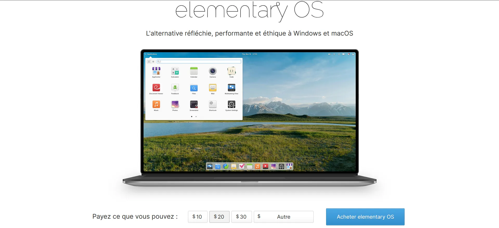


## बूट करने योग्य USB कुंजी बनाना


एक बार जब आप ISO छवि डाउनलोड कर लेते हैं, तो आपको स्थापना के लिए आगे बढ़ने हेतु इसे USB कुंजी पर बूट करने योग्य बनाना होगा।


[Balena Etcher](https://etcher.balena.io/) या इसी तरह के किसी टूल जैसे सॉफ़्टवेयर को डाउनलोड करें, फिर सॉफ़्टवेयर लॉन्च करें।


पहले से डाउनलोड की गई **एलिमेंटरी ओएस** आईएसओ छवि का चयन करें और अपनी यूएसबी कुंजी को लक्ष्य के रूप में सेट करें।


प्रक्रिया शुरू करने के लिए फ़्लैश बटन पर क्लिक करें, और USB कुंजी हटाने से पहले प्रक्रिया पूरी होने तक प्रतीक्षा करें।


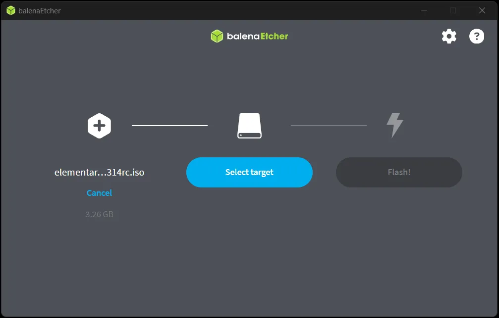


## कुंजी बूटिंग और BIOS एक्सेस


जिस कंप्यूटर पर आप एलीमेंट्री ओएस स्थापित करना चाहते हैं उसे बंद कर दें, फिर यूएसबी कुंजी लगा दें।


जब आपका कंप्यूटर चालू हो जाए, तो BIOS (ब्रांड के आधार पर `ESC`, `F9` या `F11`) पर पहुंचें और बूट डिवाइस के रूप में USB कुंजी का चयन करें, फिर बूट प्रक्रिया शुरू करने के लिए `Enter` दबाएं।


## एलिमेंट्री ओएस स्थापित करना


यदि USB कुंजी सही ढंग से कॉन्फ़िगर की गई है तो इंस्टॉलेशन स्वचालित रूप से शुरू हो जाता है।


### भाषा चयन


वह भाषा चुनें जिसमें आप सिस्टम इंस्टॉल करना चाहते हैं। आप क्षेत्रीय संस्करण भी चुन सकते हैं।


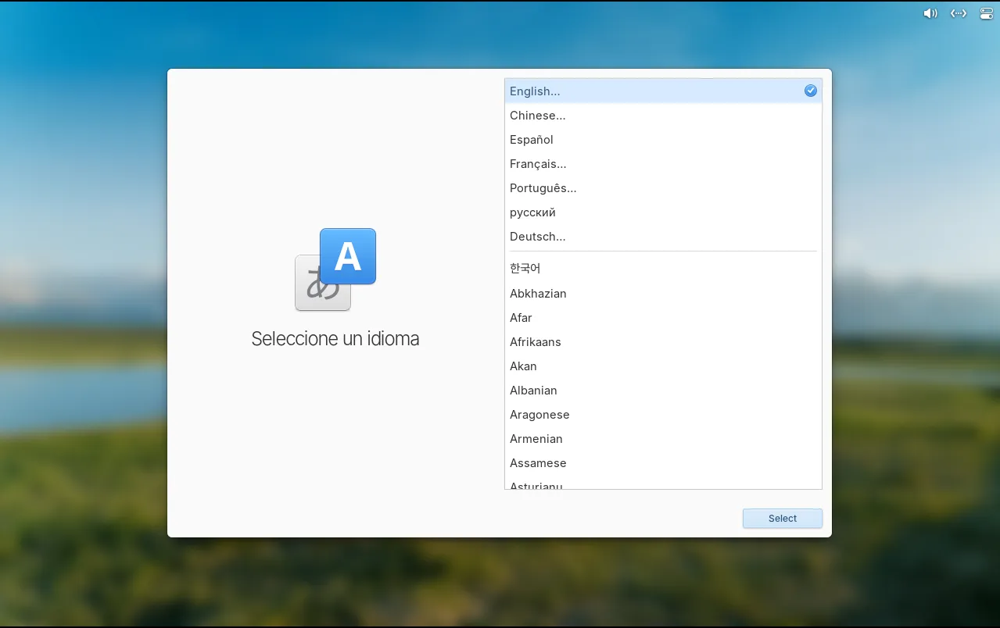


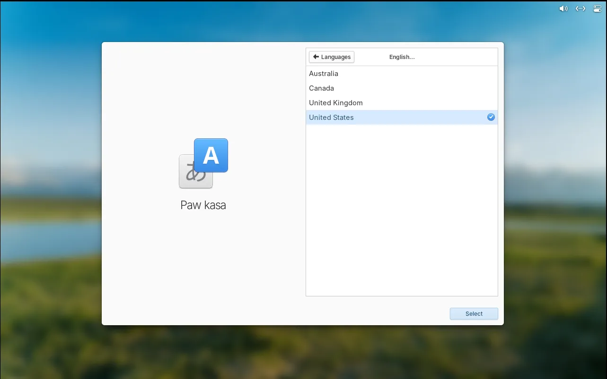


### कीबोर्ड विन्यास


अपने कीबोर्ड के अनुरूप लेआउट चुनें। यह जाँचने के लिए एक फ़ील्ड दिया गया है कि कुंजियाँ सही अक्षर उत्पन्न करती हैं या नहीं।


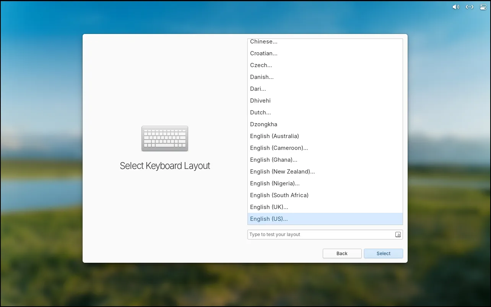


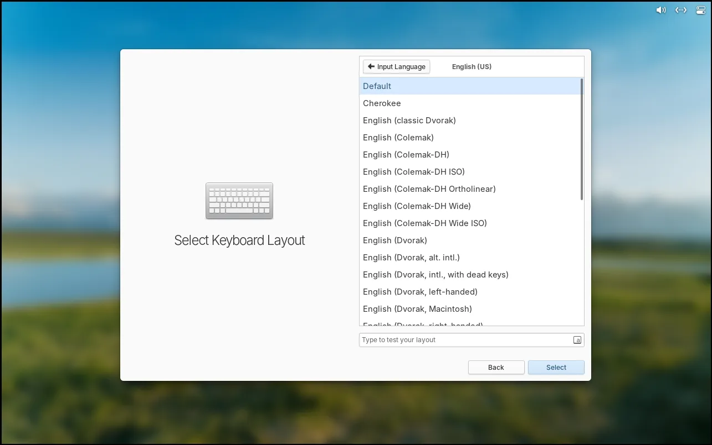


### परीक्षण मोड


एलिमेंट्री ओएस आपको सिस्टम इंस्टॉल करने से पहले उसका परीक्षण करने की सुविधा देता है। यह मोड आपको अपने Hard डिस्क पर कुछ भी बदले बिना Interface का अनुभव करने की सुविधा देता है।


### स्थापना का शुभारंभ


- संपूर्ण डिस्क पर सीधे इंस्टॉल करने के लिए **"डिस्क मिटाएं और इंस्टॉल करें"** पर क्लिक करें।
- यदि आप विभाजनों को मैन्युअल रूप से प्रबंधित करना चाहते हैं तो **"कस्टम इंस्टॉल"** पर क्लिक करें।


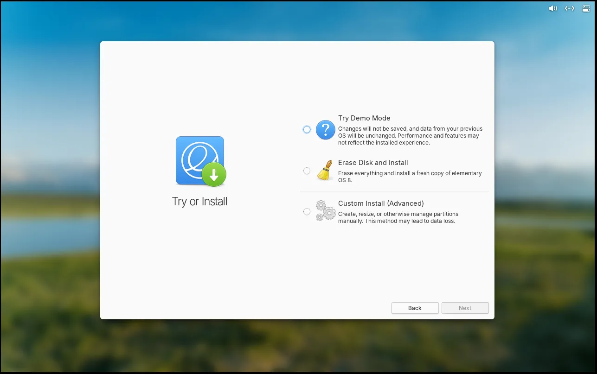


### डिस्क चयन


उस डिस्क का चयन करें जिस पर एलिमेंट्री ओएस स्थापित करना है, फिर जारी रखें बटन पर क्लिक करें।


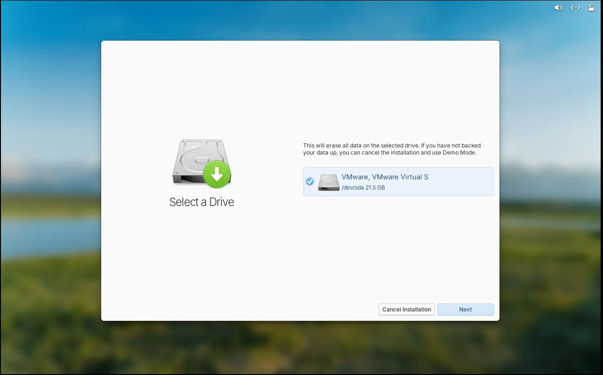


### डिस्क एन्क्रिप्शन


एक विकल्प आपको अपने डेटा को सुरक्षित रखने के लिए डिस्क को एन्क्रिप्ट करने की सुविधा देता है। इस सुरक्षा को सक्रिय करने के लिए आपको एक मज़बूत पासवर्ड सेट करना होगा। हालाँकि, यह वैकल्पिक है।


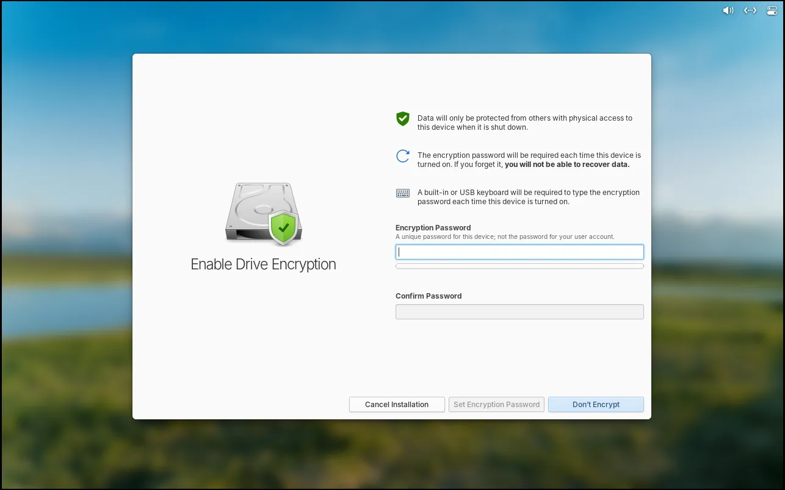


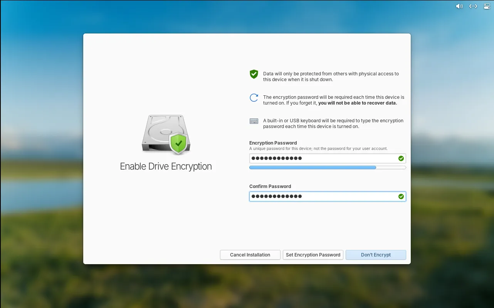


### स्थापना प्रारंभ करना


स्थापना शुरू करने से पहले, आप अपनी मशीन की अनुकूलता के आधार पर अतिरिक्त हार्डवेयर ड्राइवरों की स्वचालित स्थापना को अधिकृत कर सकते हैं।


- स्थापना शुरू करने के लिए "मिटाएँ और स्थापित करें" पर क्लिक करें।
- प्रक्रिया पूरी होने तक प्रतीक्षा करें।


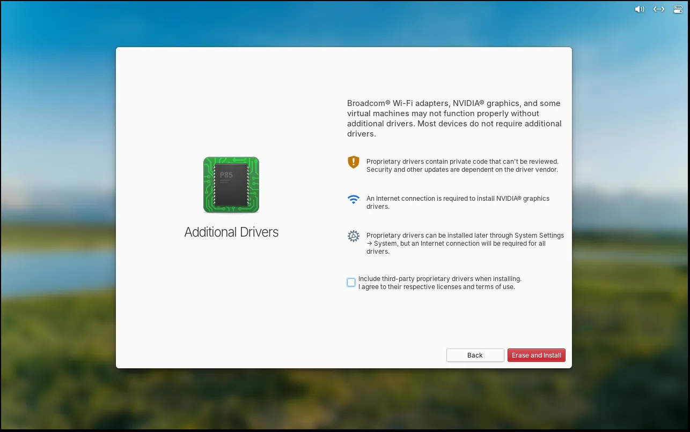


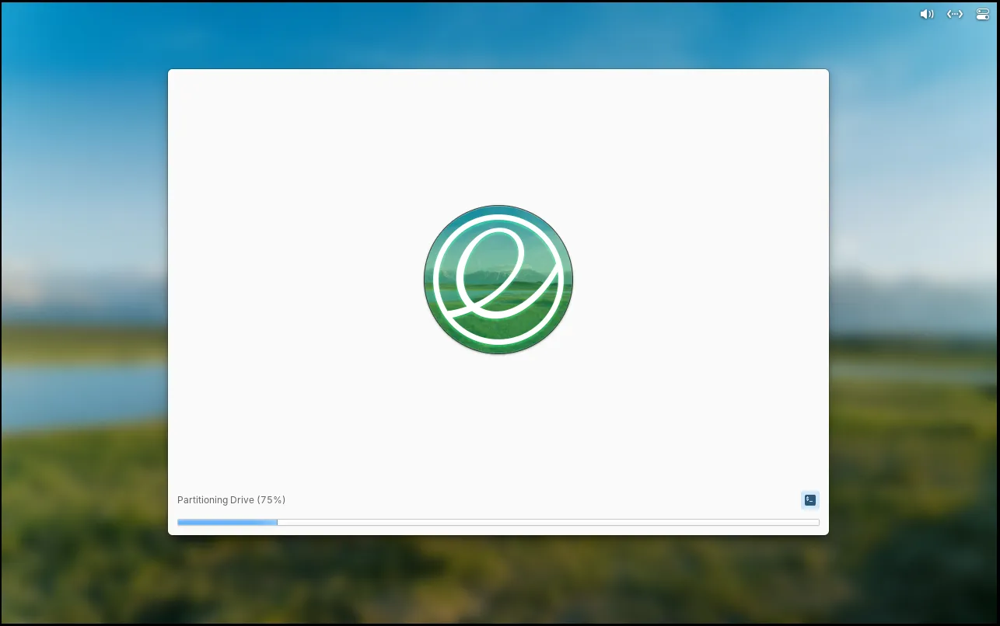


### पुनः आरंभ करें


एक बार समाप्त होने पर, पुनः आरंभ करने के लिए **एंटर** बटन पर क्लिक करें, फिर स्थापना को पुनः आरंभ करने से बचने के लिए उचित समय पर यूएसबी कुंजी को हटा दें।


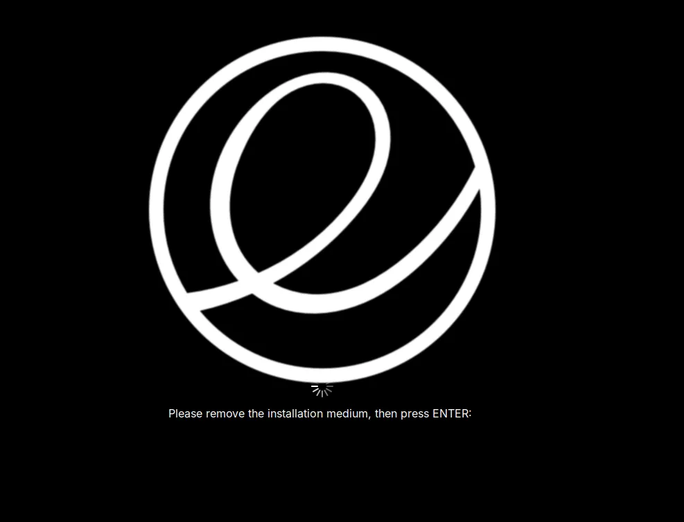


## स्थापना के बाद कॉन्फ़िगरेशन


रीबूट के बाद, कुछ अतिरिक्त कदम उठाने की आवश्यकता होती है।


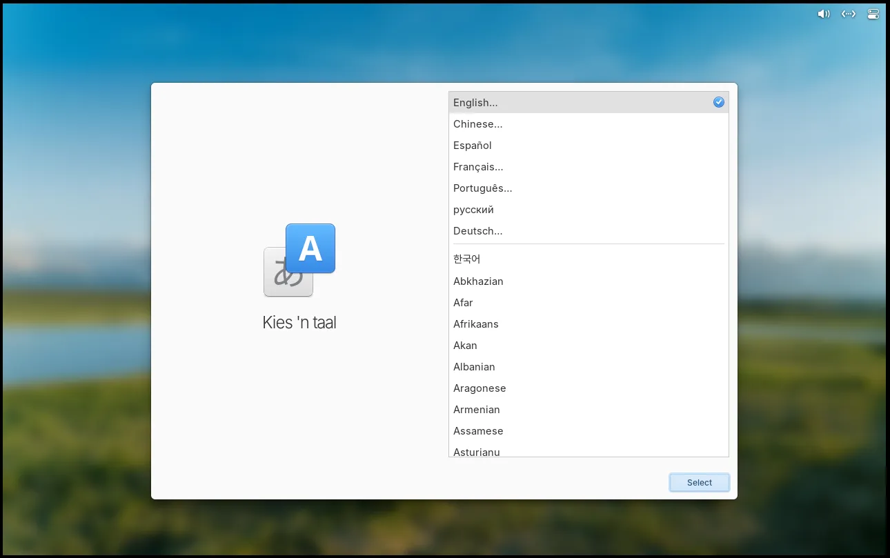


### भाषा चयन


लॉगइन करते समय सिस्टम भाषा की पुष्टि करें या उसे बदलें।


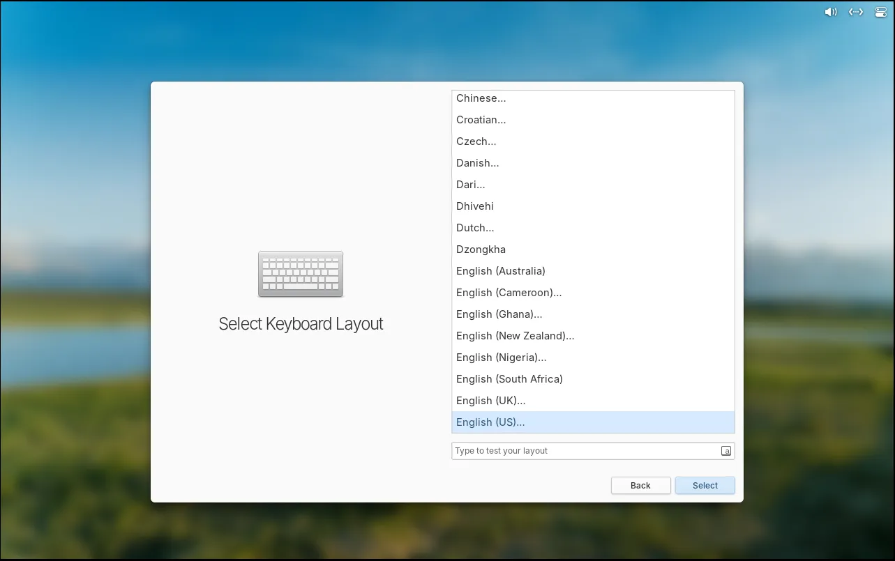


### कीबोर्ड विन्यास


सुनिश्चित करें कि कीबोर्ड लेआउट वही है जो आप चाहते हैं।


### उपयोगकर्ता खाता बनाना


एक उपयोगकर्ता नाम निर्धारित करके अपने ऑपरेटिंग सिस्टम के साथ एक उपयोगकर्ता खाता संबद्ध करें और फिर कम से कम 20 अक्षरों और प्रतीकों के अल्फ़ान्यूमेरिक पासवर्ड के साथ अपने डेटा तक पहुंच सुरक्षित करें।


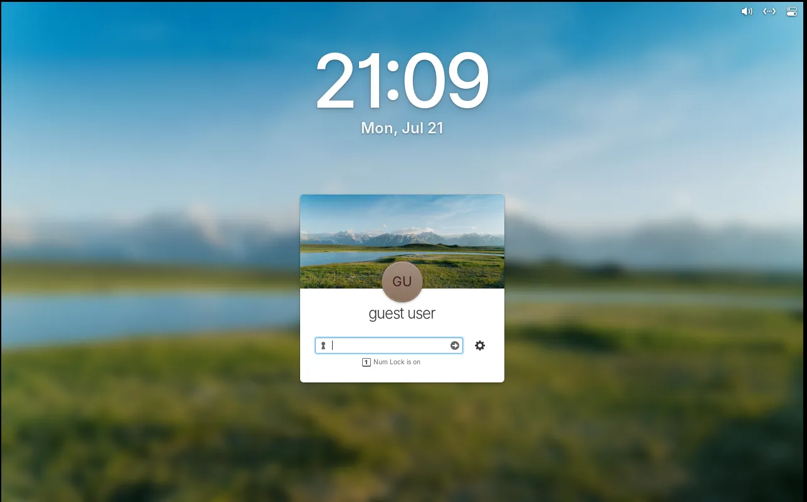


### पहला कनेक्शन


जब आप पहली बार लॉग ऑन करते हैं, तो एलिमेंट्री ओएस आपको कुछ बुनियादी सेटिंग्स के साथ अपने वातावरण को निजीकृत करने की सुविधा देता है।


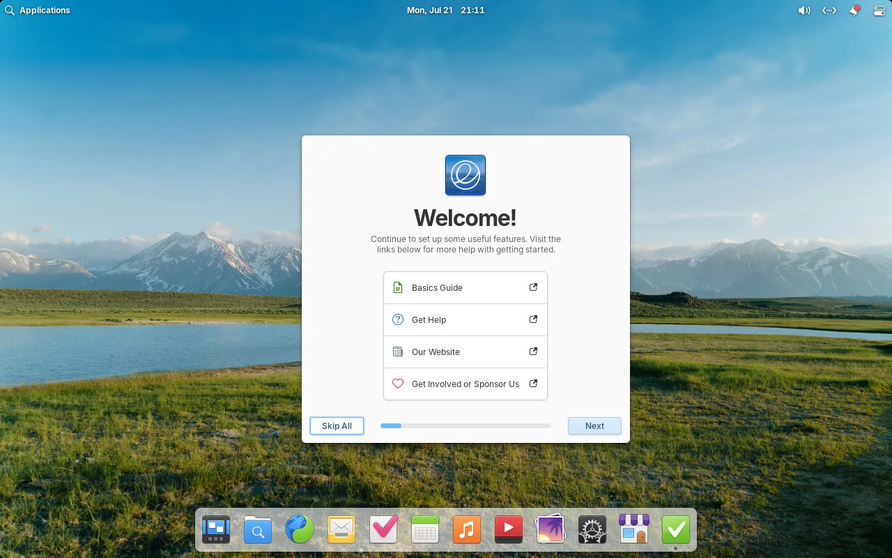


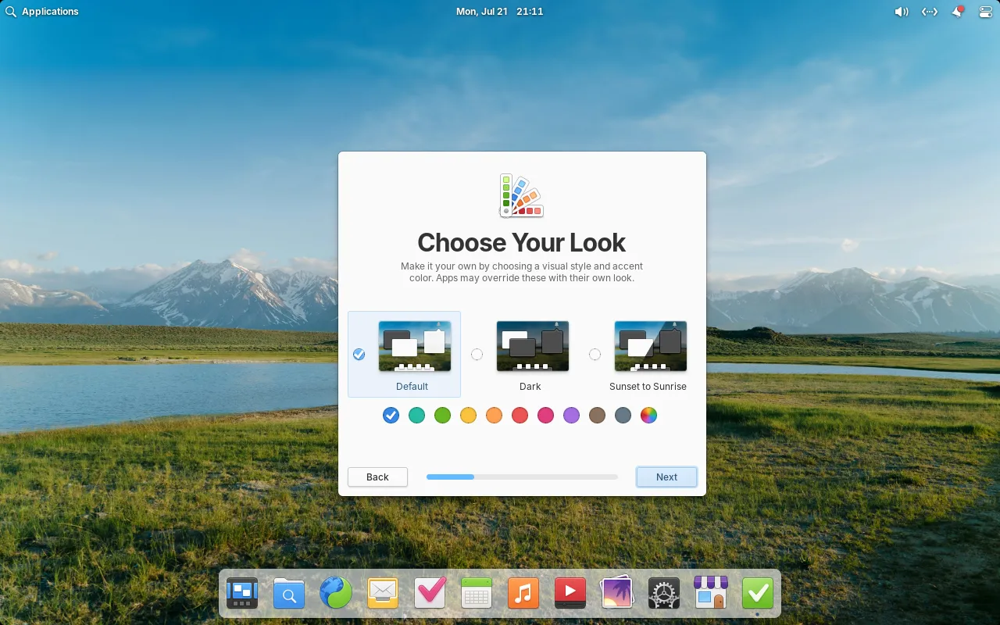


## सिस्टम का आधुनिकीकरण


लंबे समय तक उपयोग करने से पहले, सिस्टम को नवीनतम पैच के साथ अपडेट करना महत्वपूर्ण है।


### विकल्प 1: Interface ग्राफ़िक्स के माध्यम से अपडेट करें


**AppCenter** में प्रवेश करें और ऊपरी दाएँ कोने में अपडेट आइकन पर क्लिक करें। अपडेट सूचीबद्ध होने तक प्रतीक्षा करें, फिर इंस्टॉलेशन शुरू करने के लिए **"सभी अपडेट करें"** पर क्लिक करें।


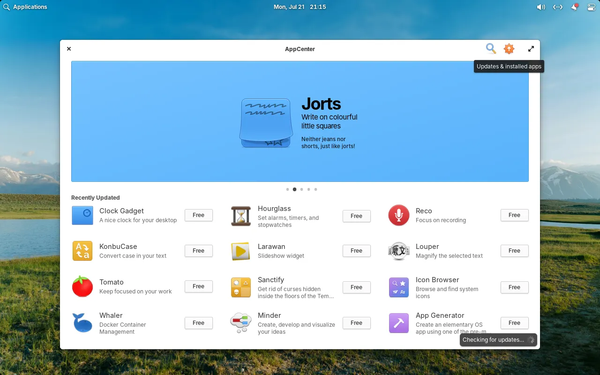


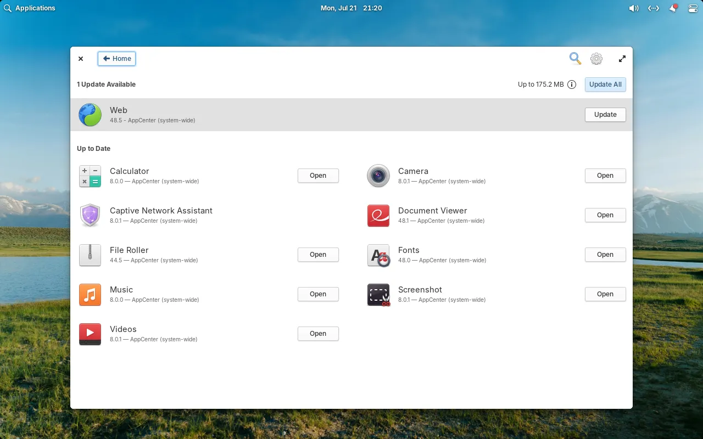


### विकल्प 2: टर्मिनल के माध्यम से अपडेट करें


आप अपने टर्मिनल के माध्यम से कमांड लाइन से भी अपडेट कर सकते हैं: इसकी सटीकता के लिए यह एक अनुशंसित विकल्प है।


```shell
sudo apt update
```


```shell
sudo apt full-upgrade
```


आपके पहले अपडेट के लिए, ऑपरेटिंग सिस्टम को सॉफ्टवेयर पैकेजों को अपडेट करने के लिए आपके उपयोगकर्ता पासवर्ड और पुष्टिकरण की आवश्यकता होती है, यहां तक कि एलिमेंट्री कर्नेल में भी।


## कार्य वातावरण विन्यास


एलिमेंट्री ओएस में केवल ज़रूरी टूल शामिल हैं। अपने परिवेश को अपनी ज़रूरतों के अनुसार ढालने के लिए, खासकर अगर आप डेवलपर हैं, तो हम अतिरिक्त टूल इंस्टॉल करने की सलाह देते हैं।


- आप निम्नलिखित कमांड के साथ उपयोगी निर्भरताएं जोड़ सकते हैं (अपनी आवश्यकताओं के अनुरूप):


```shell
sudo apt update && sudo apt install -y git python3 python3-pip build-essential wget curl zsh make snapd && sudo snap install code --classic
```


यह कमांड एक बुनियादी विकास वातावरण तैयार करने के लिए **Git**, **Python 3**, **pip**, **compiler tools**, **wget**, **curl**, **zsh**, **make**, **snapd** और **vscode** को स्थापित करता है।


एलिमेंट्री ओएस अब आपके कंप्यूटर पर चल रहा है। इसकी सरलता, हल्कापन और सुंदरता इसे व्यक्तिगत और व्यावसायिक उपयोग, दोनों के लिए एक बेहतरीन विकल्प बनाती है। आपको एक स्थिर, सहज और सुव्यवस्थित सिस्टम मिलता है, जिसे आपकी पसंद के अनुसार अनुकूलित किया जा सकता है। चाहे विकास के लिए हो, कार्यालय उपयोग के लिए हो या रोज़मर्रा की ब्राउज़िंग के लिए, एक कुशल, सहज और सुखद कार्य वातावरण बनाने के लिए सब कुछ तैयार है। फेडोरा पर हमारा ट्यूटोरियल भी देखें, जो एक समान रूप से सरल, मज़बूत और मॉड्यूलर लिनक्स वितरण है।


https://planb.network/tutorials/computer-security/operating-system/fedora-8c17b6ca-5acb-4825-a069-4474375534b0