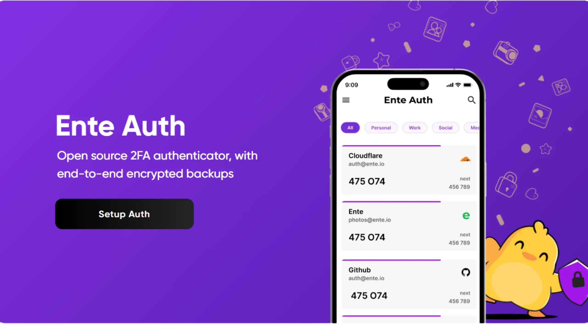

La autenticación de dos factores (2FA) se ha vuelto indispensable para proteger nuestras cuentas en línea. Además de su contraseña habitual, requiere un código temporal, generalmente generado por una aplicación dedicada. Este mecanismo, conocido como TOTP (Time-Based One-Time Password), garantiza que aunque su contraseña se vea comprometida, un atacante no podrá acceder a su cuenta sin poseer este segundo factor, renovado cada 30 segundos.

Sin embargo, elegir la aplicación de autenticación adecuada no es trivial. Google Authenticator, aunque popular, tiene grandes limitaciones: código propietario imposible de auditar, sincronización sin cifrado de extremo a extremo y riesgo de pérdida total de los códigos en caso de problema con el teléfono. Otras soluciones, como Authy, requieren un número de teléfono y no garantizan la total confidencialidad.

**Ente Auth** destaca como una alternativa moderna y segura. Esta aplicación gratuita, de código abierto y multiplataforma, desarrollada por el equipo detrás de [Ente Photos](https://ente.io), ofrece copias de seguridad cifradas de extremo a extremo en la nube y una sincronización perfecta entre todos tus dispositivos. A diferencia de las soluciones propietarias, Ente Auth te da control total sobre tus códigos de autenticación sin comprometer tu privacidad.

En este tutorial, le mostraremos paso a paso cómo instalar y utilizar Ente Auth, y por qué esta solución difiere de los autenticadores tradicionales.

## Presentación de Ente Auth

Ente Auth fue desarrollado por el equipo detrás de Ente Photos, un servicio de almacenamiento de fotos cifrado de extremo a extremo y respetuoso con la privacidad. Fiel a la filosofía Ente ("Ente" significa "mío" en malayo, simbolizando el control sobre tus datos), Ente Auth se diseñó para devolver a los usuarios el control total sobre sus códigos de autenticación de dos factores.

### Características principales

**Códigos TOTP estándar**: Ente Auth genera códigos temporales compatibles con la mayoría de servicios (GitHub, Google, Binance, ProtonMail, etc.). Puedes añadir tantas cuentas 2FA como necesites, y la aplicación calcula los códigos basándose en los secretos proporcionados.

**Copia de seguridad cifrada de extremo a extremo en la nube**: Tus códigos se almacenan en línea de forma segura. Sólo tú puedes descifrarlos: la clave de cifrado se deriva de tu contraseña y sólo tú la conoces. Ente (el servidor) no tiene conocimiento de sus secretos, ni siquiera de los títulos de sus cuentas, ya que todo se cifra en el lado del cliente utilizando una arquitectura de conocimiento cero.

**Sincronización multidispositivo**: Puedes instalar Ente Auth en varios dispositivos (smartphone, tablet, ordenador) y acceder a tus códigos en todos ellos. Cualquier cambio se propaga automática e instantáneamente a tus otros dispositivos a través de la nube encriptada, lo que te ofrece una gran flexibilidad en tu trabajo diario.

**Interface minimalista e intuitivo**: La aplicación ofrece un Interface simplificado, fácil de aprender incluso para usuarios sin conocimientos técnicos. las cuentas 2FA se muestran con el nombre del servicio, su login y el código de 6 dígitos, actualizado en tiempo real. Ente Auth también muestra el siguiente código con unos segundos de antelación para evitar que le pille desprevenido la caducidad.

**Código abierto y auditado**: El código fuente de Ente Auth es [público en GitHub](https://github.com/ente-io/auth) bajo la licencia AGPL v3.0. Cualquier desarrollador puede auditarlo para comprobar fallos o comportamientos no deseados. La criptografía implementada ha sido objeto de una [auditoría externa independiente](https://ente.io/blog/cryptography-audit/), garantía de la seriedad de la seguridad de la aplicación.

### Ventajas y limitaciones

**Beneficios:**

- Privacidad por diseño con cifrado de extremo a extremo
- Sincronización segura entre todos tus dispositivos
- Código abierto auditable
- Interface Usuario claro e intuitivo Interface
- Copia de seguridad automática para evitar la pérdida de códigos
- Disponible en todas las plataformas (móvil y escritorio)

**Límites:**

- Conexión a Internet necesaria para la sincronización
- Los usuarios avanzados pueden preferir soluciones 100% offline como Aegis (sólo Android)
- Relativamente reciente en comparación con las soluciones establecidas

## Instalación

Ente Auth está disponible en las plataformas más populares. Puede descargar la aplicación desde [el sitio web oficial](https://ente.io/auth) o desde las tiendas oficiales.

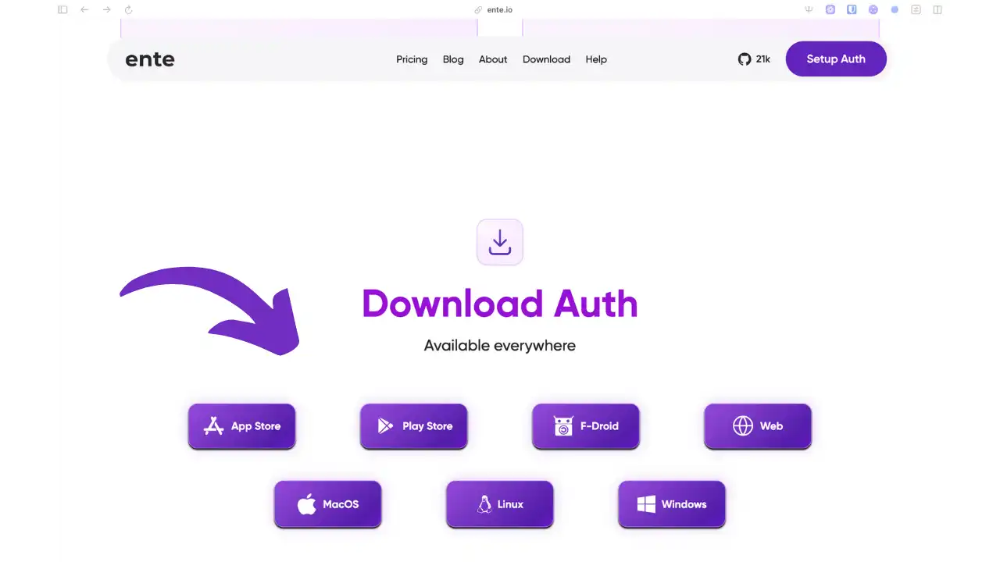

*Página de descarga de Ente Auth con todas las plataformas disponibles*

### Android

Tienes varias opciones:

- **Google Play Store**: Busque "Ente Auth" para la instalación clásica
- **F-Droid**: Disponible en el catálogo de aplicaciones de código abierto de Android, con garantía de construcción verificada y sin contenido propietario
- **Instalación manual**: Los archivos APK pueden descargarse de la [página GitHub del proyecto](https://github.com/ente-io/auth/releases) con notificación integrada de nuevas versiones

### iOS (iPhone/iPad)

Instale Ente Auth directamente desde la App Store de Apple buscando el nombre de la aplicación. La app para iOS también puede ejecutarse en Mac equipados con chips Apple Silicon (M1/M2) a través de la Mac App Store.

### Ordenadores (Windows, macOS, Linux)

Ente Auth ofrece aplicaciones de escritorio nativas. Visite [ente.io/download](https://ente.io/download) o la [sección Releases de GitHub](https://github.com/ente-io/auth/releases) :

- **Windows**: Se suministra un instalador EXE
- **macOS**: Arrastrar y soltar imagen de disco DMG en Aplicaciones
- **Linux**: Varios formatos disponibles (AppImage portable, .deb para Debian/Ubuntu, .rpm para Fedora/Red Hat)

**Nota:** Este tutorial está basado en Ente Auth v4.4.4 y posteriores. Las versiones anteriores pueden tener pequeñas diferencias Interface.

### Interface Web

Sin instalación, puede acceder a sus códigos a través de [auth.ente.io](https://auth.ente.io) desde cualquier navegador. Interface web se limita a ver los códigos (útil para solucionar problemas), ya que para añadir cuentas se necesita la aplicación móvil o de escritorio por motivos de seguridad.

## Primera configuración

### Creación de una cuenta

Al iniciar Ente Auth por primera vez, tiene dos opciones:

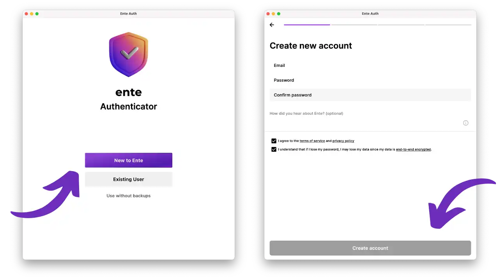

*Pantalla de inicio de Ente Auth con opciones de creación de cuenta*

**Con cuenta (recomendado)**: Elige "Crear cuenta" e introduce tu e-mail Address y una contraseña. **Importante**: esta contraseña sirve como contraseña maestra para encriptar sus datos. Elija una contraseña fuerte y única, ya que no existe un procedimiento convencional de restablecimiento sin pérdida de datos. Si la pierdes, tus datos encriptados serán irrecuperables.

**Modo sin conexión**: Selecciona "Usar sin copias de seguridad" para utilizar la aplicación localmente sin nube. En este modo, tus códigos permanecen en el dispositivo, pero tendrás que exportarlos manualmente para no perderlos.

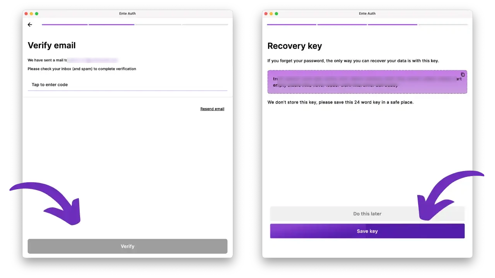

*Proceso de verificación por correo electrónico y generación de una clave de recuperación de 24 palabras*

Es posible que se solicite una verificación por correo electrónico para validar la creación de la cuenta y permitir la recuperación en un nuevo dispositivo. Ente Auth también le proporcionará una clave de recuperación de 24 palabras (basada en el método BIP39). **Es imprescindible que guarde esta clave** en un lugar seguro: es su único medio de recuperar sus datos si olvida su contraseña.

### Seguridad local

Recomiendo encarecidamente habilitar la protección local por código o biométrica. Vaya a **Configuración → Seguridad → Pantalla de bloqueo** y configure :

- **Desbloqueo biométrico**: Face ID, huella dactilar en función de las capacidades de tu dispositivo
- **PIN/contraseña específicos de la aplicación**
- **Retardo del bloqueo automático**: por ejemplo, "Inmediatamente" o tras 30 segundos de inactividad

Esta protección impide el acceso no autorizado a tus códigos si alguien consigue acceder a tu teléfono desbloqueado. Ten en cuenta que este bloqueo es una barrera adicional: tus datos siguen encriptados de extremo a extremo incluso sin esta protección.

## Añadir cuentas 2FA

### Procedimiento estándar

Para añadir una nueva cuenta 2FA, tomemos el ejemplo concreto de activar 2FA en Bull Bitcoin :

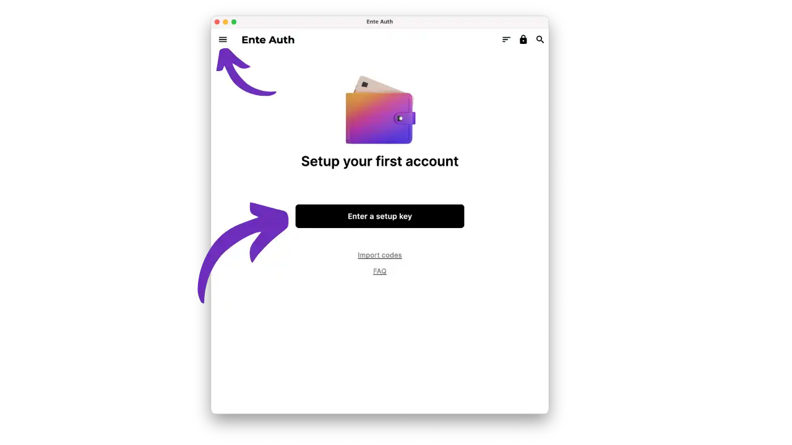

*Interface principal de Ente Auth listo para añadir la primera cuenta 2FA*

**Lado de servicio (Bull Bitcoin)**: Inicie sesión en su cuenta de Bull Bitcoin, vaya a la configuración de seguridad y active la autenticación de dos factores.

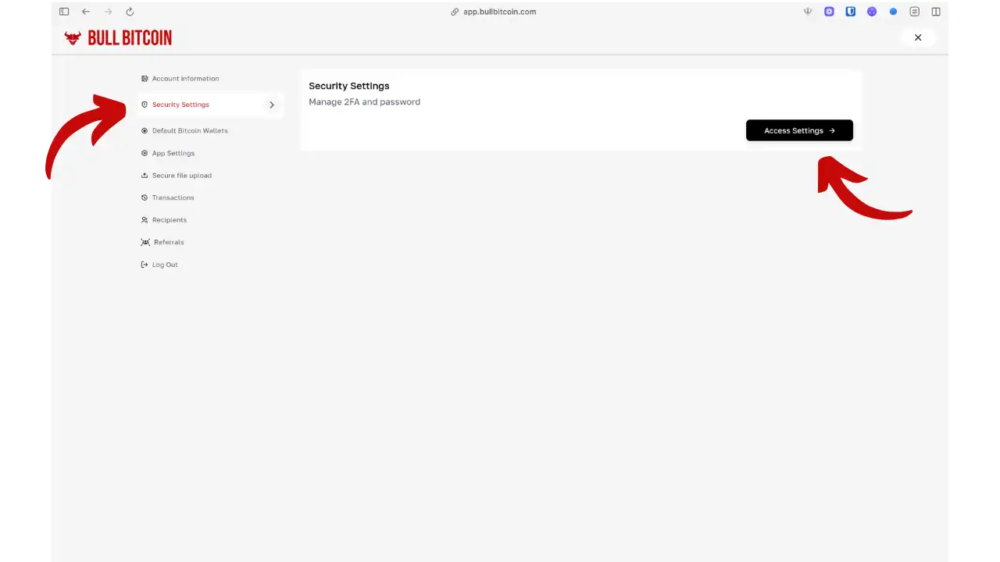

*Interface Bull Bitcoin* menú de configuración de seguridad

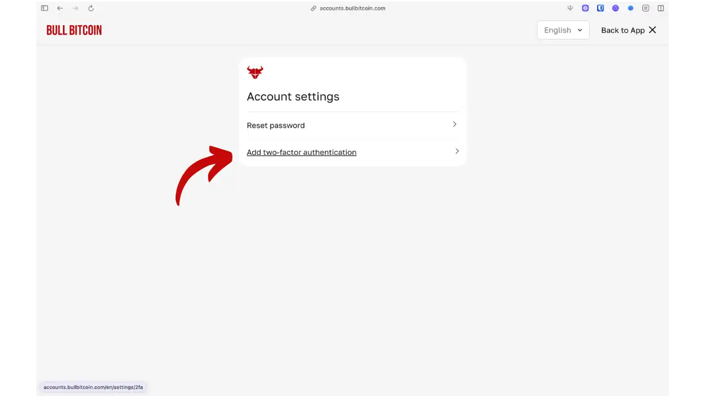

*Opción para activar la autenticación de dos factores en Bull Bitcoin*

El servicio mostrará entonces un código QR para que lo escanees con tu aplicación de autenticación:

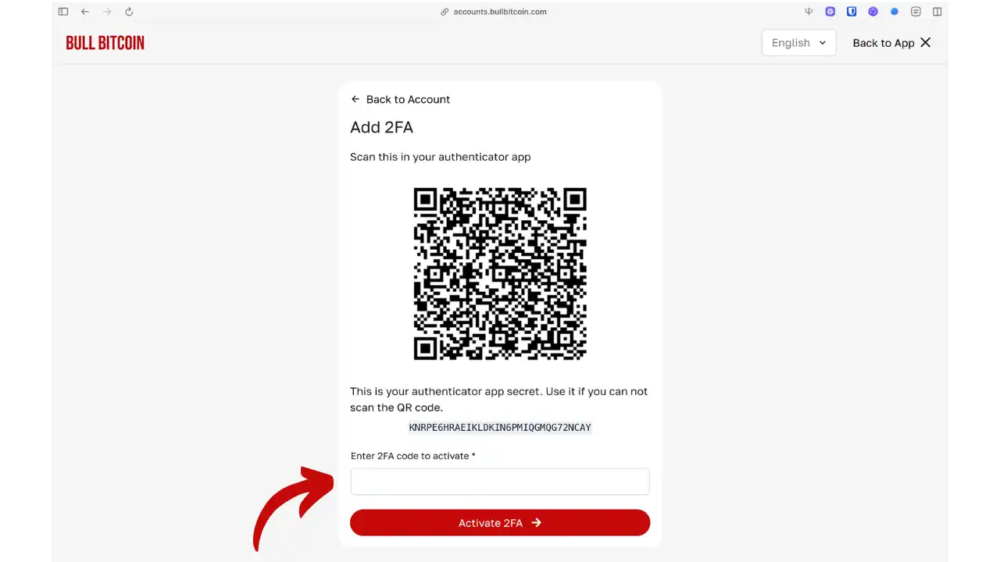

*Código QR generado por Bull Bitcoin para escanear con tu autenticador*

**En Ente Auth**: Haga clic en "Introducir una clave de configuración" y, a continuación, escanee el código QR mostrado por Bull Bitcoin. Ente Auth reconocerá automáticamente la cuenta y rellenará los campos.

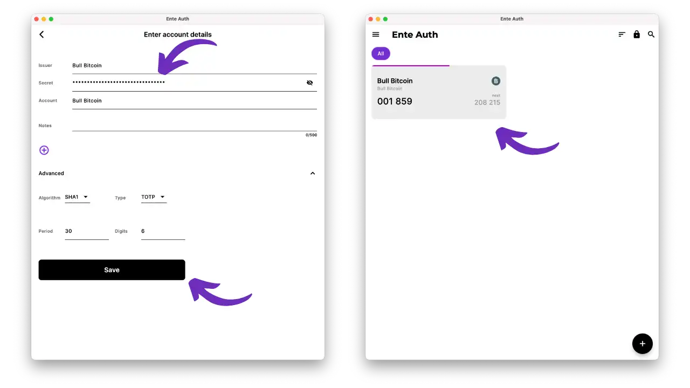

*Configuración de los detalles de la cuenta de Bull Bitcoin en Ente Auth*

Puede personalizar el nombre del servicio y su login para que sea más fácil de encontrar. Los ajustes avanzados (algoritmo SHA1, periodo de 30s, 6 dígitos) suelen ser correctos por defecto.

**Validación por parte del servicio**: Vuelva a Bull Bitcoin e introduzca el código de 6 dígitos generado por Ente Auth para finalizar la activación.

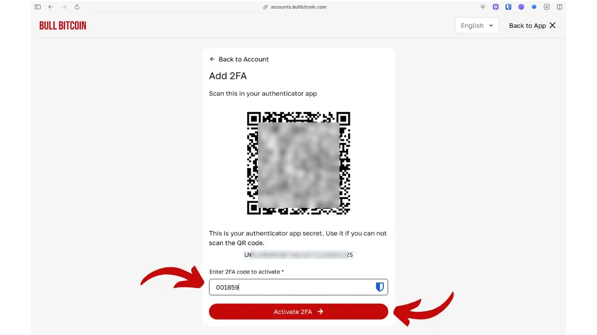

*Introduzca el código generado por Ente Auth para validar la activación 2FA*

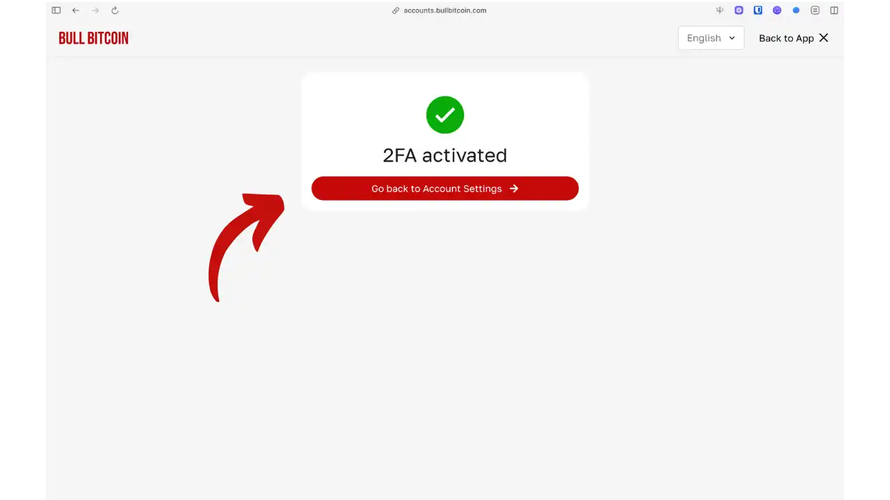

*Confirmación del éxito de la activación 2FA en Bull Bitcoin*

**Códigos de recuperación**: Bull Bitcoin le proporcionará códigos de recuperación. **Guárdalos en un lugar seguro, separados de tu autenticador.**

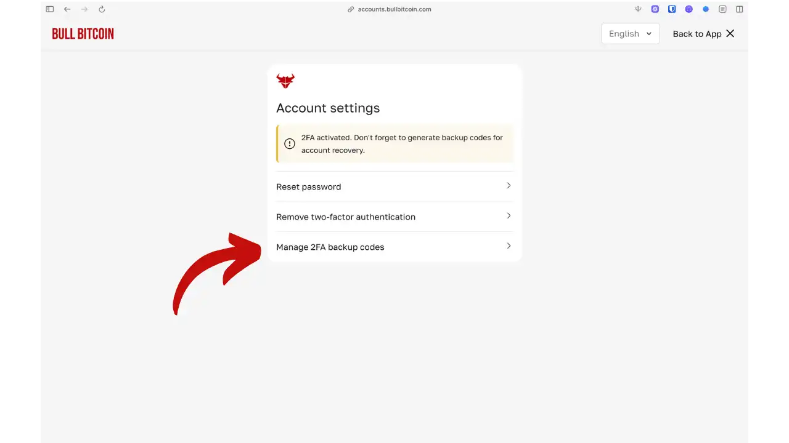

*Opción a generate códigos de emergencia de copia de seguridad en Bull Bitcoin *

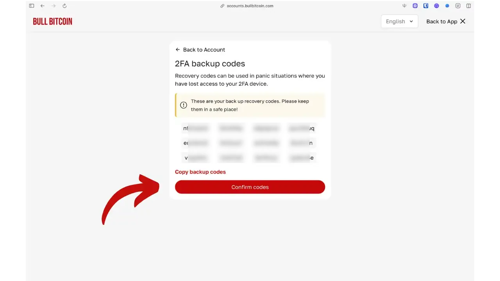

*Lista de códigos de recuperación para guardar en lugar seguro*

### Organización y gestión

Ente Auth ofrece varias funciones prácticas:

**Copia rápida**: Pulse el código para copiarlo automáticamente en el portapapeles.

**Acciones sensibles al contexto**: Mantén pulsado (o haz clic con el botón derecho en el escritorio) para editar, eliminar, compartir o anclar una entrada.

**Etiquetas y búsqueda**: Organiza tus cuentas con etiquetas (personal/profesional, por categoría de servicio) y utiliza la barra de búsqueda para filtrar rápidamente.

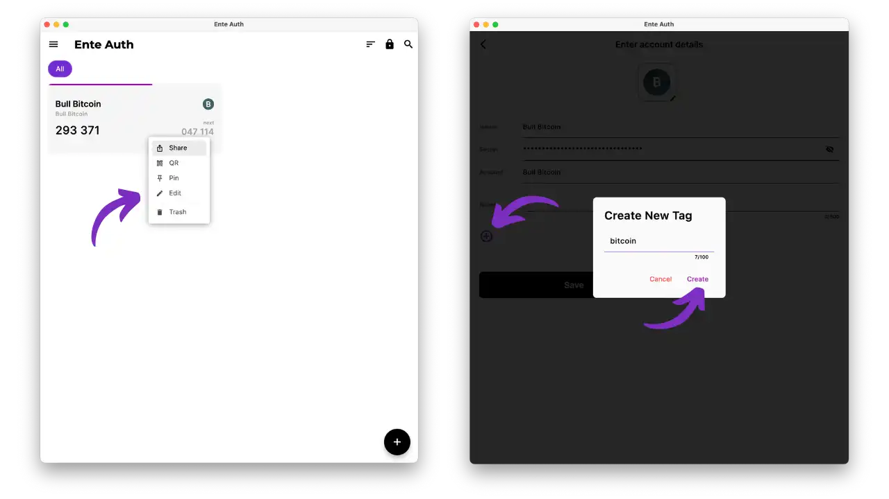

*Proceso de creación de etiquetas: menú contextual y diálogo de creación*

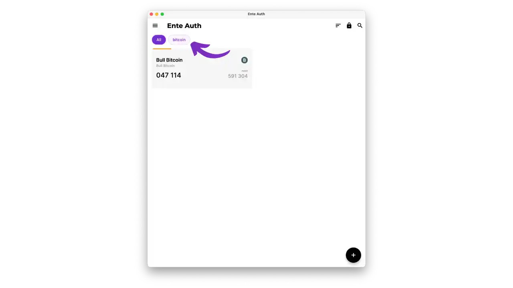

*Etiqueta "Bitcoin" aplicada correctamente en la cuenta Bull Bitcoin*

**Iconos automáticos**: Cada entrada puede ilustrarse con el logotipo del servicio, gracias a la integración del paquete de iconos [Simple Icons] (https://simpleicons.org/).

**Compartición segura temporal**: Una función exclusiva de Ente Auth, el uso compartido seguro le permite transmitir un código 2FA a un colega sin revelar el secreto subyacente. generate un enlace cifrado válido durante 2, 5 o 10 minutos como máximo: el destinatario ve el código en tiempo real, pero no puede exportarlo ni acceder a los datos de la cuenta. Este método es ideal para la asistencia técnica o la colaboración temporal, ya que ofrece un nivel de seguridad que no es posible con una simple captura de pantalla o un mensaje de texto.

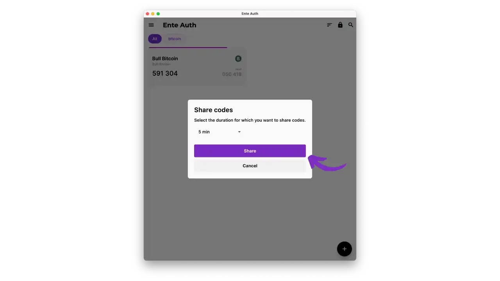

*Compartición temporal segura Interface: elija la duración (5 min)*

**Exportación/importación seguras**: Ente Auth le permite exportar sus códigos a otras aplicaciones, o importarlos desde Google Authenticator y otras soluciones. La exportación se realiza a través de un archivo cifrado o un código QR, lo que garantiza la portabilidad de sus datos sin comprometer la seguridad.

**Clave de recuperación BIP39**: La aplicación genera automáticamente una frase de recuperación de 24 palabras según el estándar BIP39 (Bitcoin Improvement Proposal), idéntico al de los monederos de criptomonedas. Esta frase es su clave de recuperación definitiva, que le permite restaurar todos sus códigos incluso si olvida su contraseña maestra.

## Configuración y ajustes

Ente Auth ofrece numerosas opciones de personalización accesibles a través de la configuración de la aplicación:

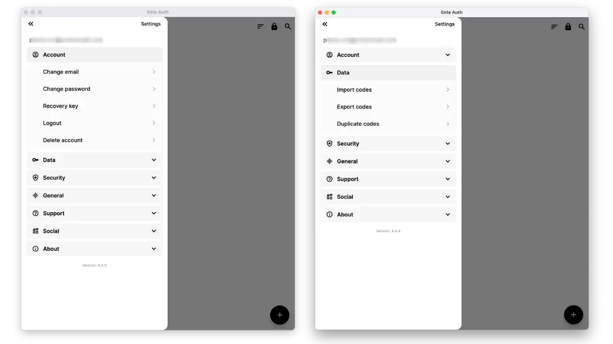

*Resumen de parámetros disponibles en Ente Auth*

### Gestión de cuentas y datos

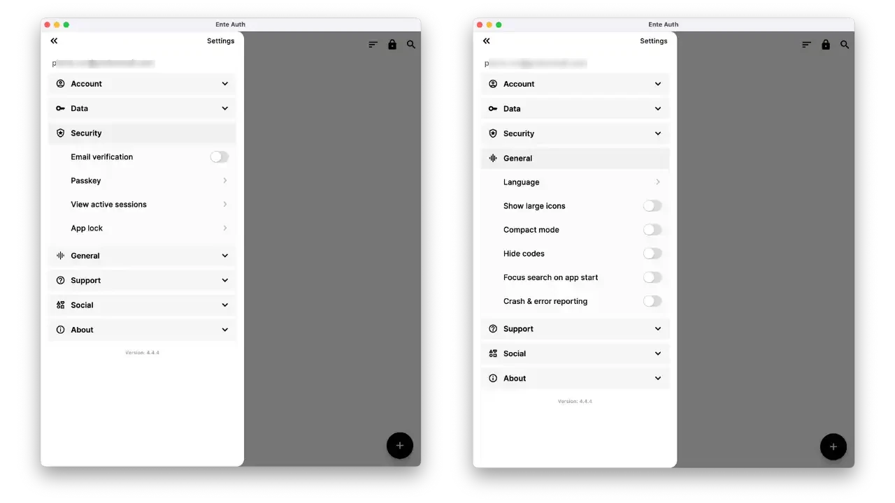

*Opciones de seguridad avanzadas: verificación por correo electrónico, código PIN, sesiones activas*

La configuración de seguridad te permite :

- Activar la verificación del correo electrónico para las nuevas conexiones
- Activar Passkey
- Ver las sesiones activas en los distintos dispositivos
- Establecer un código PIN o datos biométricos

### Interface y opciones de uso

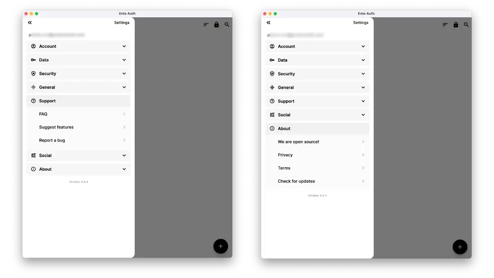

*Parámetros Interface y personalización de la aplicación*

Los ajustes generales incluyen :

- **Idioma**: Interface multilingüe
- **Pantalla**: Iconos grandes, modo compacto
- **Privacidad**: Ocultar códigos, búsqueda rápida
- **Telemetría**: Notificación de errores (puede desactivarse)

## Copia de seguridad y sincronización

### Cómo funciona el cifrado

Cuando añades una cuenta con una cuenta Ente conectada, la aplicación encripta inmediatamente estos datos sensibles de forma local utilizando tu clave maestra (derivada de tu contraseña). A continuación, los datos cifrados se envían al servidor de Ente para su almacenamiento.

Gracias a este mecanismo, siempre dispondrá de una copia de seguridad cifrada de extremo a extremo de sus códigos en la nube. Si pierde su dispositivo, solo tiene que reinstalar Ente Auth y volver a conectarse: la aplicación descargará y descifrará automáticamente todos sus códigos.

### Sincronización multidispositivo

Si utilizas Ente Auth tanto en el smartphone como en el ordenador, cualquier adición o cambio en un dispositivo aparecerá en cuestión de segundos en el otro. Esta sincronización pasa por la nube de Ente, pero como los datos están cifrados de extremo a extremo, el servidor solo ve el contenido cifrado ilegible.

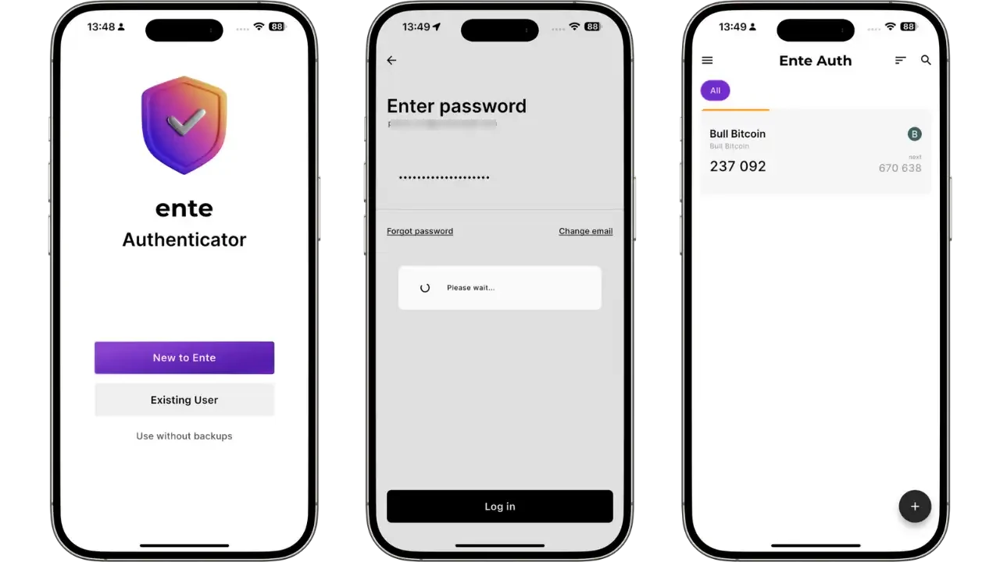

*Demostración de sincronización: la misma cuenta Bull Bitcoin accesible desde el móvil y el ordenador*

La sincronización es perfecta: instale Ente Auth en su smartphone, inicie sesión con sus credenciales y todos sus códigos 2FA (aquí Bull Bitcoin) aparecerán automáticamente. El ejemplo anterior muestra una sincronización perfecta entre el ordenador de sobremesa y el móvil: el mismo código Bull Bitcoin es accesible en ambos dispositivos.

En términos de confidencialidad, ni Ente ni ningún tercero tiene acceso a tus secretos 2FA. Incluso los metadatos (etiquetas, notas, nombres de servicios) se cifran antes de ser enviados. Esta arquitectura de conocimiento cero garantiza que sólo tú puedas descifrar tus códigos.

### Uso offline

La sincronización requiere Internet, pero Ente Auth funciona perfectamente sin conexión en todos los dispositivos, ya que todos los datos se almacenan localmente. Los cambios sin conexión se ponen en cola y se sincronizan en cuanto se restablece la conexión.

## Seguridad y privacidad

### Garantías criptográficas

Ente Auth se basa en una sólida encriptación de extremo a extremo con arquitectura de conocimiento cero. Sus códigos se cifran con una clave que solo usted posee, derivada de su contraseña maestra mediante funciones avanzadas de derivación de claves.

**Arquitectura de conocimiento cero:** Ente no puede acceder físicamente a sus datos. Incluso los metadatos (nombres de servicios, etiquetas, notas) se cifran en el lado del cliente antes de su transmisión. Este enfoque garantiza que, en caso de ataque a sus servidores o de solicitud gubernamental, Ente sólo pueda revelar datos cifrados que no puedan leerse sin su contraseña.

**Encriptación local**: El proceso de cifrado tiene lugar íntegramente en tu dispositivo antes de ser enviado a la nube. Los servidores de Ente solo reciben y almacenan datos cifrados, lo que hace imposible el acceso no autorizado, incluso para los administradores del servicio.

### Transparencia y auditorías

Como el código es [fuente abierta](https://github.com/ente-io/auth), la comunidad puede verificar la ausencia de puertas traseras. Ente se ha sometido a [múltiples auditorías externas](https://ente.io/blog/cryptography-audit/) para validar la seguridad de su implementación:

- **Cure53** (Alemania): Auditoría de seguridad criptográfica y de las aplicaciones
- **Symbolic Software** (Francia): Conocimientos criptográficos especializados
- **Fallible** (India): Pruebas de penetración y análisis de vulnerabilidades

Estas auditorías independientes, realizadas por firmas reconocidas, garantizan que la implementación criptográfica de Ente Auth cumple con las mejores prácticas de seguridad y no presenta fallos críticos.

### Política de privacidad

Ente Auth aplica una [política de privacidad ejemplar](https://ente.io/privacy/) basada en una recogida mínima de datos. Sólo se conserva la información estrictamente necesaria para el funcionamiento del servicio: su correo electrónico Address para la autenticación y la recuperación de la cuenta.

**Sin seguimiento ni telemetría**: A diferencia de la mayoría de las aplicaciones, Ente Auth no recoge métricas de uso, ni datos identificativos de colisiones, ni información de comportamiento. La aplicación funciona sin publicidad intrusiva ni rastreadores analíticos.

**Cumplimiento del RGPD**: Ente cumple plenamente con el Reglamento General de Protección de Datos europeo. Tiene derecho a acceder a sus datos, corregirlos o eliminarlos en cualquier momento. La exportación de datos](https://ente.io/take-control/) está a un solo clic, y la eliminación permanente de su cuenta borra todos sus datos de los servidores.

**Almacenamiento descentralizado y seguro**: Tus datos encriptados se replican en 3 proveedores diferentes, en 3 países distintos, lo que garantiza una disponibilidad óptima a la vez que evita la dependencia de un único proveedor en la nube.

El modelo de negocio de Ente se basa en el servicio de pago Ente Photos, lo que nos permite ofrecer Ente Auth **gratis y sin limitaciones** sin comprometer tu privacidad monetizando tus datos. Este enfoque garantiza la sostenibilidad del servicio sin depender de la publicidad ni de la reventa de datos personales.

## Comparación con otras soluciones

| Application              | Open Source | Sauvegarde Cloud | E2EE | Sync multi-devices | Plateformes                                        |
| ------------------------ | ----------- | ---------------- | ---- | ------------------ | -------------------------------------------------- |
| **Ente Auth**            | ✅           | ✅                | ✅    | ✅                  | Android, iOS, Linux, macOS, Windows                |
| **Google Authenticator** | ❌           | ✅ (sans E2EE)    | ❌    | ✅                  | Android, iOS                                       |
| **Aegis**                | ✅           | ❌                | ✅    | ❌                  | Android                                            |
| **Authy**                | ❌           | ✅                | ❌    | ✅                  | Android, iOS *(apps desktop supprimées août 2024)* |
| **Proton Auth**          | ✅           | ✅                | ✅    | ✅                  | Android, iOS *(récent, moins établi)*              |

Ente Auth destaca por ser una de las pocas soluciones que combina todas las ventajas: transparencia del código fuente, copia de seguridad cifrada en la nube y sincronización entre plataformas.

## Casos de uso recomendados

### Usuarios particulares

Ente Auth es ideal para las personas preocupadas por la seguridad que activan sistemáticamente la 2FA. Ya no tendrás que preocuparte de perder tus códigos al cambiar de teléfono, ni de tener que elegir entre comodidad y seguridad.

### Uso familiar y multidispositivo

La aplicación resulta muy útil si utilizas varios dispositivos. Puedes guardar tus códigos en smartphones y tablets, o compartir ciertos códigos familiares (Netflix, nube familiar) de forma sincronizada y segura.

### Uso profesional

Para los equipos que gestionan cuentas sensibles, Ente Auth facilita la colaboración preservando la seguridad, gracias a sus funciones avanzadas de uso compartido integradas en la sección "Organización y gestión".

## Buenas prácticas

- **Guarda tus códigos de emergencia**: Guarda los códigos de recuperación proporcionados por cada servicio lejos de tu teléfono.

- Utilice una contraseña maestra segura: Su contraseña maestra de Ente Auth debe ser única y robusta, ya que protege todos sus códigos.

- **Activar la protección local**: Configura el PIN o la biometría para impedir el acceso físico no autorizado.

- **No personalizar en exceso**: Evita modificaciones avanzadas que puedan comprometer la sincronización.

- **Mantenga la aplicación actualizada**: Las actualizaciones corrigen fallos de seguridad y mejoran la funcionalidad.

- **Prueba de restauración**: Comprueba de vez en cuando que puedes restaurar tus códigos en otro dispositivo.

## Conclusión

Ente Auth representa una solución moderna y completa para la autenticación de dos factores. Al combinar seguridad, transparencia y facilidad de uso, esta aplicación de código abierto satisface las necesidades de los usuarios más exigentes sin renunciar a la comodidad.

A diferencia de las soluciones propietarias que le encierran en un ecosistema opaco, Ente Auth le devuelve el control de sus datos de autenticación al tiempo que le protege contra pérdidas accidentales gracias a sus copias de seguridad cifradas.

Tanto si es usted un particular que desea proteger sus cuentas personales como si es un equipo que gestiona el acceso de su empresa, Ente Auth es una opción inteligente para modernizar su enfoque de la seguridad digital sin comprometer la privacidad.

## Recursos y apoyo

### Documentación oficial

- **Página web oficial**: [ente.io/auth](https://ente.io/auth)
- **Centro de ayuda**: [help.ente.io/auth](https://help.ente.io/auth)
- **Blog técnico**: [ente.io/blog](https://ente.io/blog)

### Código fuente y transparencia

- **GitHub**: [github.com/ente-io/auth](https://github.com/ente-io/auth)
- **Auditoría criptográfica**: [ente.io/blog/cryptography-audit](https://ente.io/blog/cryptography-audit)

### Comunidad

- **Discord**: [discord.gg/z2YVKkycX3](https://discord.gg/z2YVKkycX3)
- **Reddit**: [r/enteio](https://reddit.com/r/enteio)