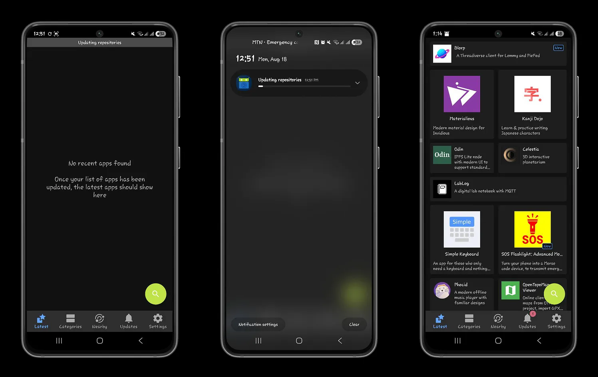
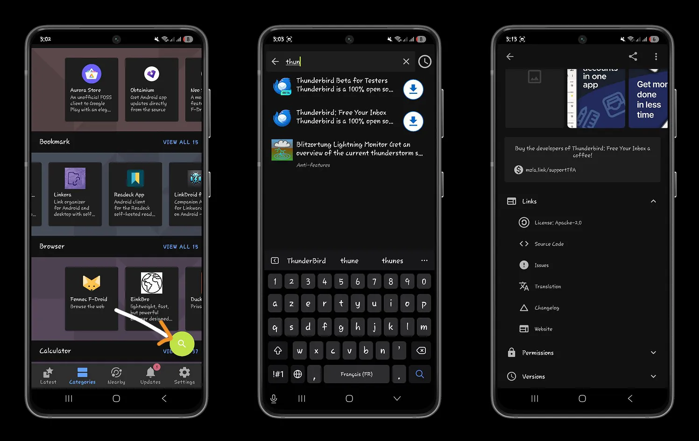
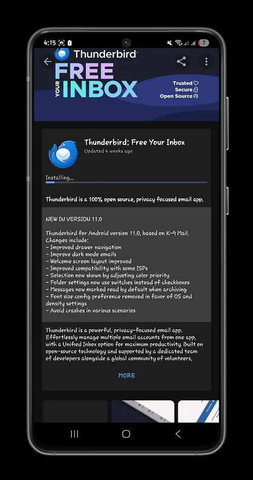
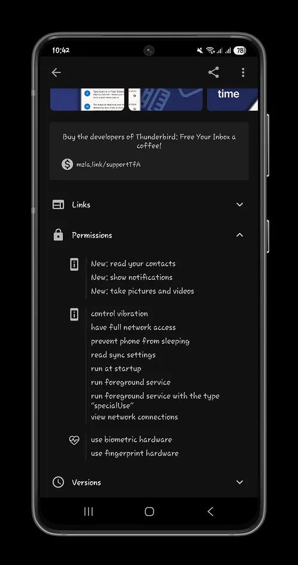
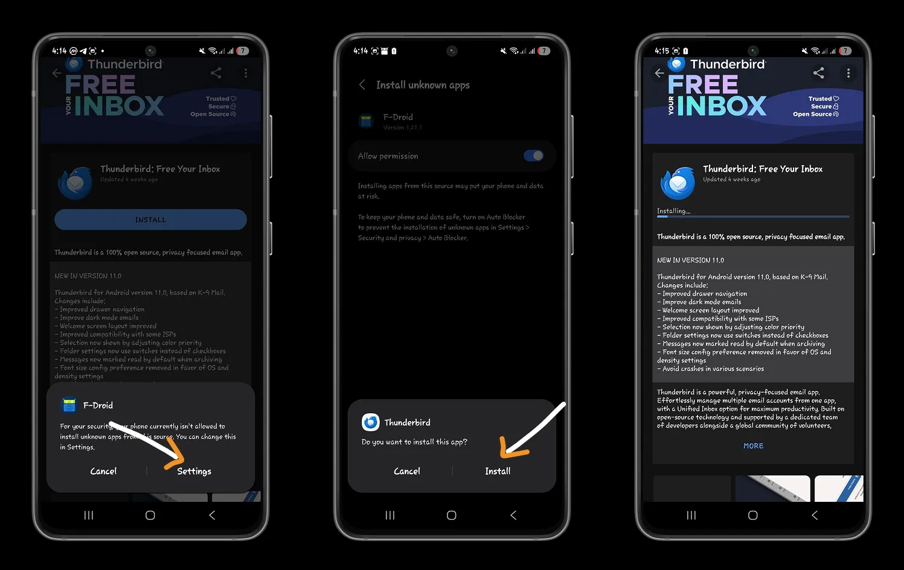
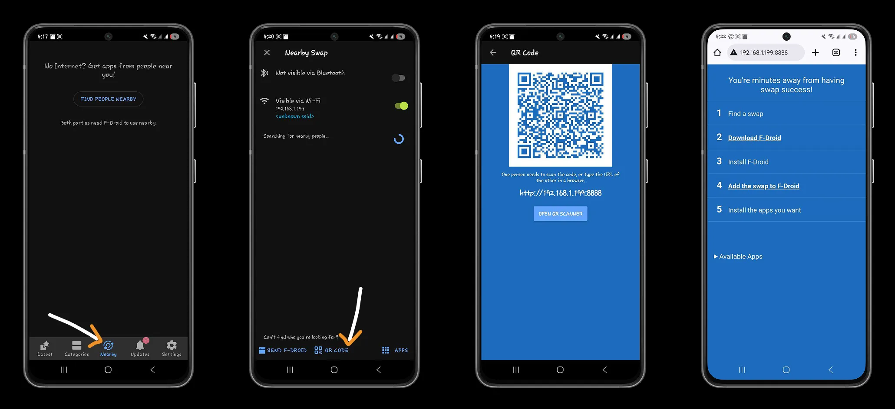
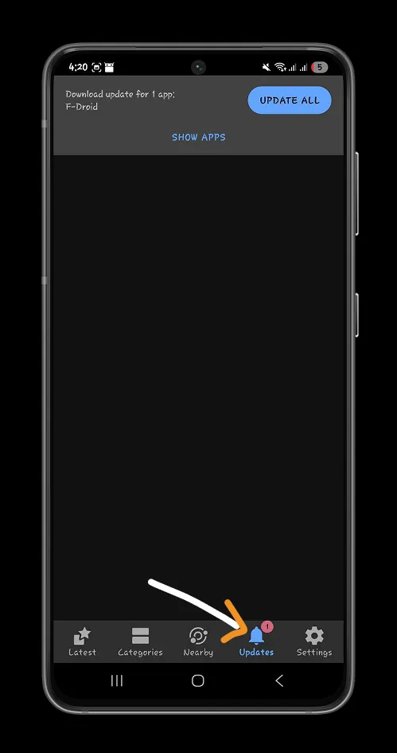

Mu gihe c’ubuhinga bwa none, amashirahamwe maninimanini be n’inzego ziriko zirakora kugira ngo Internet ibe ahantu hamwe, zishire ububasha bwayo mu minwe yabo, gutyo zigatuma abayikoresha bose badashobora kwidegemvya. Ivyo si utopia, biramaze kuba. Nk’umunya bitcoiner, kwegereza ubutegetsi abaturage, kwubahiriza ubuzima bwite n’umwidegemvyo w’umuntu ku giti ciwe ni ingingo ngenderwako ukunda cane cane mu bikoresho ukoresha ku musi ku musi. Android, itandukanye na iOS, imaze imyaka yemerera amaduka menshi y’amaporogarama kubana mu bidukikije vyayo, bikaguha umwidegemvyo wo kurondera no gushiramwo amaporogarama avuye mu bibanza ukunda.

Muri iyi nyigisho, tuzoba turiko turaraba F-droid, ububiko bw’ibikoresho buserukira ubundi buryo bwo gukoresha amaduka y’ibikoresho nka Google Play Store na Microsoft Store.

## Gutangura na F-Droid

F-Droid ni ububiko bw’ibikoresho n’ibikoresho bigufasha gushiramwo porogarama z’ubuntu, zifunguye ku rubuga rwa Android. F-droid ubwayo ni umugambi w’inkomoko yuguruye watangujwe mu 2010 na Ciaran Gultnieks n’abandi benshi bafashije. Intumbero ihambaye y’uwo mugambi ni ugutuma amaporogarama y’inkomoko yuguruye ashobora gukoreshwa, no gutuma abatanguje imigambi y’inkomoko yuguruye bashobora kuronka urubuga aho bashobora gusohora ibikoresho vyabo batabwirizwa gukoresha Google Play Store.

Ikibabaje ni uko F-Droid atari porogaramu iboneka kuri iOS, kandi irimwo ibikoresho vyinshi vyagenewe gukoresha ubuhinga bwa Android.

Ushobora gukura F-droid kuri [urubuga rwemewe](https://f-droid.org/) mu buryo bwa APK maze ukayishiramwo n’amaboko kuri telefone yawe Android.

Kuri Android, urabe neza ko uha uruhusha rwo gushiramwo umucukumbuzi wavuyemwo F-Droid.

Igihe gushiramwo, F-Droid izotanguza guhindura ububiko bw’ibikoresho vya Open Source kugira ngo itunganye ibikoresho biri mu bubiko.

Ubu ushobora gushiramwo porogarama kuri telefone yawe utaciye muri Google Play Store.

## Iduka ry'ibitabu rya F-Droid

Mu Bubiko bw’Ibikoresho, uzosangamwo ivyiciro vyinshi vy’ibikoresho bihuye n’ivyo ukeneye. Mu **Categories** tab, uzosangamwo ubwoko burenga 20 bw'ibikorwa, kuva ku bikoresho vy'ugucukura gushika ku bikoresho vy'uguhindura inyandiko ku buntu, kandi vyose bisaba amakuru makeyi cane ku ruhande rwawe.

Woba wipfuza gushiramwo porogarama yihariye? Fyonda kuri buto ya **Search**, hanyuma wandike izina ry'iporogarama uriko urarondera.

F-Droid itanga amakuru yuzuye ku bijanye n’iporogarama yose wipfuza gushiramwo.

Niwafyonda kuri iyo porogarama, uzosanga, mu bindi:

- Ibirango n'amahinduka yongerewe muri verisiyo nshasha iboneka
- Insobanuro y’ido n’ido y’ikoreshwa, ibiranga, impamvu zituma rikoreshwa, n’umuryango w’Isoko Yuguruye uri inyuma y’uwo mugambi.

- Uruhusha rukoreshwa n'umugambi, ruhuza kode y'inkomoko n'ingorane zihura iyo ukoresheje porogaramu
- Uruhusha rusabwa n'ivyo usaba

Ibindi ubimenye mu nyigisho yacu ya Thunderbird:

https://planb.network/tutorials/computer-security/communication/thunderbird-91d02325-0361-4641-b152-8975890284a8

F-Droid iraguha amakuru yose ukeneye kugira ngo ufate ingingo nimba gukoresha porogarama birinda amakuru yawe kandi bikongera ubuzima bwite bwawe. Scan porogaramu zose ushaka gukoresha, hanyuma ukande kuri buto ya **Install** kugira ngo ushiremwo porogaramu yawe.

Gutanga uburenganzira bwo gushiramwo F-Droid mu gukoresha uburyo bwo guhitamwo mu mitunganyirize yawe.

## Exchange ibisabwa vyawe

F-Droid iremesha umugenzo wo gukoresha inkomoko yuguruye n'ugutanga umusanzu w'abanyagihugu, cane cane biciye ku mahitamwo yayo **Near By** Exchange. Huza n'abakoresha bagukikije biciye kuri:

- Gutahura kuri Burutu;
- Iryo shirahamwe nyene rya Wi-Fi;
- Kode ya QR canke IP:PORT Address kugira ngo winjire mu mucukumbuzi wawe.

Ukoresheje iyo nzira, urashobora gusangira no kwakira porogarama zishizwe kuri telefone yawe ya Android n’abagenzi n’imiryango mu ntambwe nkeyi gusa.

## Ivyavuguruwe

Mu **Ivugurura**, raba urutonde rw'ibintu bivuguruwe biriho, kandi urabe ko usoma n'amakuru yerekeye verisiyo nshasha za porogarama imwe imwe kugira ngo umenye amahinduka akomeye yose yo muri verisiyo uriko urakoresha.

Ushobora kandi guhindura urutonde rw’ibikoresho biriho mu gusubiramwo urupapuro (genda hasi).

## Yongerako ibisabwa vyawe bwite

F-Droid ni umugambi w’Isoko Yuguruye uremesha intererano ku bikorwa bishira imbere ubuzima bwite bw’abakoresha. Ushobora kwongerako porogarama yawe bwite ya Android ku bubiko biciye ku ntererano ku kode y’inkomoko ya F-Droid GitLab.

Porogaramu yawe itegerezwa kuba inkomoko yuguruye, kode y'inkomoko iboneka ku mugaragaro kuri GitHub canke GitLab, nk'akarorero.

Utegerezwa rero gutegura dosiye ya YAML (amakuru y’imbere) adondora igikorwa cawe, harimwo amakuru yose n’uburenganzira bisabwa kugira ngo ukoreshe, ukurikije [ikigereranyo c’amakuru y’inyuma](https://f-droid.org/docs/Build_Metadata_Reference/) yashikirijwe na F-Droid.

Mu gice ca **Abahinguzi** c'[inyandiko](https://f-droid.org/ru/docs/), uzosangamwo ibikoresho vyose ukeneye kugira ngo usohore no kubungabunga porogaramu zawe kuri F-Droid.

### Ubunyankamugayo n'umutekano

Gushiramwo porogaramu mu nzira yuguruye akenshi bihuye no kwongerera umutekano, ariko kandi bifise ingorane nyinshi. Womenya gute ko ata mpinduka mbi ziri muri source code y’iporogarama iri kuri F-Droid?

F-Droid ikoranya porogarama ku ma server yabo bwite, ishingiye kuri kode y’inkomoko yemewe n’amabwirizwa yo gukoranya. Igikoresho cose gisohotse kirasubirwamwo kandi kigasuzumwa kugira ngo kimenye neza ko kitagira ico gihinduye. Ivyo bituma APK itangwa iba idahemuka ku nkuru y’inkomoko yasohowe n’abayikoze. Ikindi, porogarama yose ishizwemwo biciye kuri F-Droid irashirwako umukono mu buryo bwa digitale, hanyuma urutoke rw’umukono rukagereranywa n’urwo rwamenyeshejwe n’abakoze iyo porogarama ku rubuga rwemewe canke ku bubiko bwa Git.

Niba warakunze iyi nyigisho, menya vyinshi ku nyigisho zacu z’umutekano w’ubuhinga bwa none n’ugucungera amakuru:

https://planb.network/courses/4ba0e3de-e67f-4ea1-a514-f111206810d1