फेडोरा एक मुफ़्त, ओपन-सोर्स लिनक्स-आधारित ऑपरेटिंग सिस्टम है जिसे 2003 में लॉन्च किया गया था। इसे **फेडोरा प्रोजेक्ट** समुदाय द्वारा विकसित किया गया है और **रेड हैट लिनक्स** द्वारा समर्थित है। यह अपनी स्थिरता, बेहतरीन प्रदर्शन और उपयोग में आसानी के लिए प्रसिद्ध है, जो इसे शुरुआती और उन्नत उपयोगकर्ताओं, दोनों के लिए एक बेहतरीन विकल्प बनाता है। यह सिस्टम अधिकांश आधुनिक प्रोसेसर आर्किटेक्चर पर चलता है, जिससे इसे लगभग किसी भी कंप्यूटर पर इंस्टॉल करना आसान हो जाता है। फेडोरा कई पूर्व-कॉन्फ़िगर संस्करणों में भी उपलब्ध है, जिन्हें "फेडोरा स्पिन्स" या "फेडोरा एडिशन" कहा जाता है, और जिन्हें विशिष्ट आवश्यकताओं (वीडियो गेम, खगोल विज्ञान, विकास...) के लिए डिज़ाइन किया गया है।


## फेडोरा लिनक्स आर्किटेक्चर


जैसा कि आपने पहले पढ़ा, फेडोरा लिनक्स कर्नेल पर आधारित एक मुफ़्त ऑपरेटिंग सिस्टम है। लिनक्स कर्नेल ऑपरेटिंग सिस्टम का वह हिस्सा है जो कंप्यूटर हार्डवेयर के साथ संचार करता है और मेमोरी और प्रोसेसिंग पावर जैसे सिस्टम संसाधनों का प्रबंधन करता है।


फेडोरा लिनक्स में कई तरह के सॉफ्टवेयर टूल्स और एप्लिकेशन शामिल हैं जो लिनक्स कर्नेल के ऊपर ऑपरेटिंग सिस्टम को चलाने के लिए ज़रूरी हैं। फेडोरा के मॉड्यूलर आर्किटेक्चर का मतलब है कि इसमें मुख्य रूप से अलग-अलग घटकों का एक संग्रह होता है जिन्हें ज़रूरत पड़ने पर आसानी से जोड़ा, हटाया या बदला जा सकता है। इससे आप केवल ज़रूरी संसाधनों का इस्तेमाल करके ऑपरेटिंग सिस्टम को आकार दे सकते हैं।


फेडोरा में एक डेस्कटॉप वातावरण भी शामिल है, जिसे Interface कहा जाता है, जिसके माध्यम से उपयोगकर्ता कार्य करते हैं और एप्लिकेशन तक पहुँच प्राप्त करते हैं। फेडोरा का डिफ़ॉल्ट डेस्कटॉप वातावरण GNOME है, जो एक उपयोगकर्ता-अनुकूल, उपयोग में आसान और अत्यधिक अनुकूलन योग्य डेस्कटॉप वातावरण है।


## फेडोरा क्यों चुनें?


उपलब्ध लिनक्स वितरणों की भीड़ में, फेडोरा विशेष रूप से इसके लिए खड़ा है:


- मॉड्यूलरिटी**: विभिन्न प्रोसेसर आर्किटेक्चर के साथ संगत, फेडोरा को अधिकांश कंप्यूटरों पर, यहां तक कि कम-शक्ति वाले कंप्यूटरों पर भी, आपकी आवश्यकताओं के अनुरूप पूरी तरह से स्थापित किया जा सकता है।


- एक सरल, सहज Interface**: फेडोरा एक आधुनिक ग्राफिकल Interface को एक शक्तिशाली कमांड-लाइन Interface के साथ जोड़ता है, जिससे इसे सभी प्रोफाइलों के लिए उपयोग करना आसान हो जाता है।


- कर्नेल स्थिरता**: रेड हैट पर आधारित, फेडोरा अपने अपडेट की विश्वसनीयता के लिए प्रसिद्ध है, विशेष रूप से कर्नेल अपडेट, जो एक बड़े समुदाय से प्राप्त निःशुल्क योगदान के कारण बड़ी बगों के बिना किए जाते हैं।


- तेज़, आसान स्थापना**: केवल 3 जीबी के छवि आकार के साथ, स्थापना त्वरित और आसान है, यहां तक कि सीमित संसाधनों वाली मशीनों पर भी।


## फेडोरा संस्करण


आपकी प्रोफ़ाइल और उपयोग के आधार पर, Fedora आपकी ज़रूरतों के अनुसार संस्करण प्रदान करता है। आपको मुख्य रूप से ये मिलेंगे:


- फेडोरा वर्कस्टेशन**: आपके कंप्यूटर पर व्यक्तिगत और/या व्यावसायिक उपयोग के लिए आदर्श, यह संस्करण सामान्य उपयोगिताओं जैसे ब्राउज़र, एक ऑफिस सूट (टेक्स्ट एडिटर) और मीडिया प्लेबैक सॉफ्टवेयर के साथ स्थापित है।


- फेडोरा सर्वर**: यह संस्करण सर्वर प्रबंधन के लिए समर्पित है। फेडोरा सर्वर में कई तरह के टूल शामिल हैं जो आपको अपने पैमाने पर सर्वर तैनात और प्रबंधित करने में मदद करते हैं।


- Fedora CoreOS**: क्या आप क्लाउड एप्लिकेशन को आसानी से चलाना और तैनात करना चाहते हैं? Fedora CoreOS एक ऐसा संस्करण है जो आपको Docker और Kubernets के साथ इमेज बनाने और प्रबंधित करने के लिए टूल देता है।


इस ट्यूटोरियल में, हम फेडोरा वर्कस्टेशन संस्करण पर काम करेंगे। हालाँकि, नीचे दी गई प्रक्रियाएँ अन्य संस्करणों के लिए समान हैं।


## फेडोरा वर्कस्टेशन को स्थापित और कॉन्फ़िगर करना


फेडोरा वर्कस्टेशन को स्थापित करने के लिए निम्नलिखित हार्डवेयर कॉन्फ़िगरेशन की आवश्यकता होती है:


- ऑपरेटिंग सिस्टम को बूट करने के लिए कम से कम **8 जीबी** की यूएसबी कुंजी।
- आपके कंप्यूटर की Hard डिस्क पर कम से कम **40 GB खाली स्थान** होना चाहिए।
- सहज अनुभव के लिए 4 जीबी रैम**।


### फेडोरा वर्कस्टेशन डाउनलोड करें


आप आधिकारिक फेडोरा प्रोजेक्ट वेबसाइट से [फेडोरा वर्कस्टेशन] संस्करण (https://fedoraproject.org/fr/workstation/download) डाउनलोड कर सकते हैं। फिर अपने प्रोसेसर आर्किटेक्चर (32-बिट - 64-बिट) के अनुरूप संस्करण चुनें और **डाउनलोड** आइकन पर क्लिक करें।


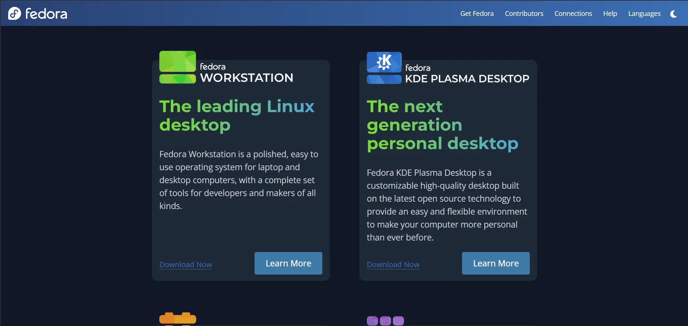


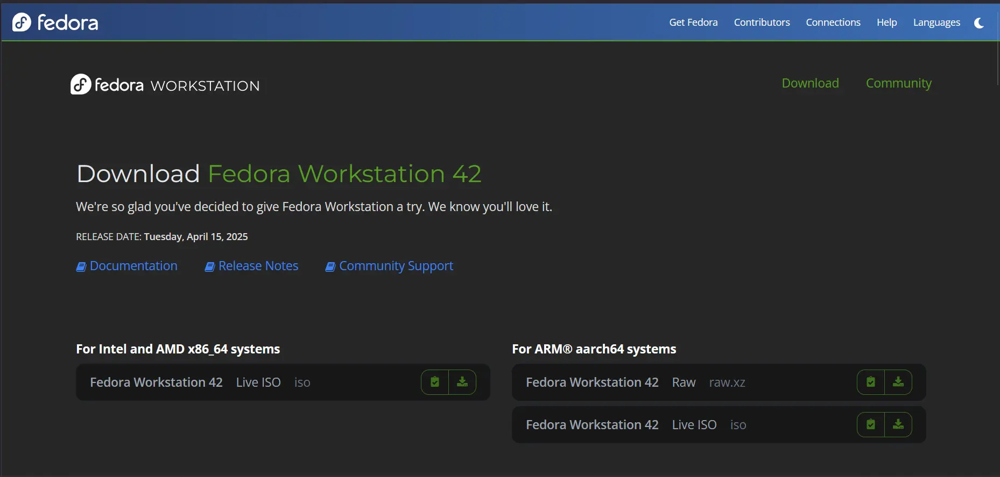


### बूट करने योग्य USB कुंजी बनाएँ


फेडोरा को स्थापित करने के लिए, आपको [Balena Etcher](https://etcher.balena.io/) जैसे सॉफ़्टवेयर का उपयोग करके बूट करने योग्य USB कुंजी बनाने की आवश्यकता है।


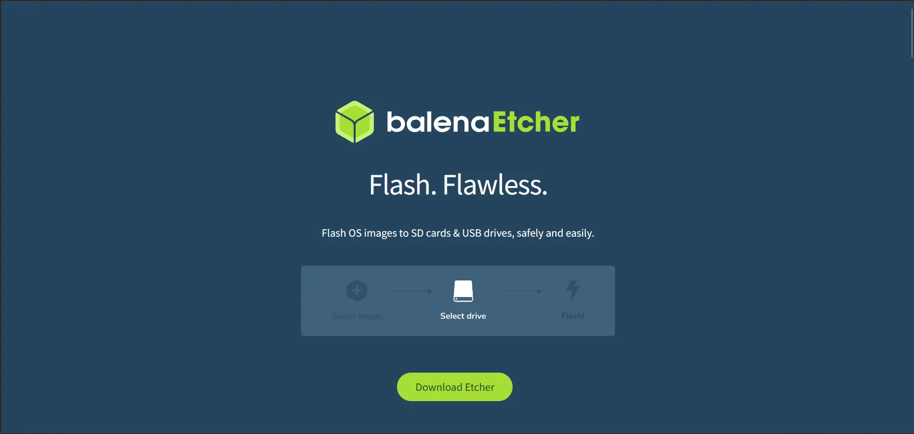


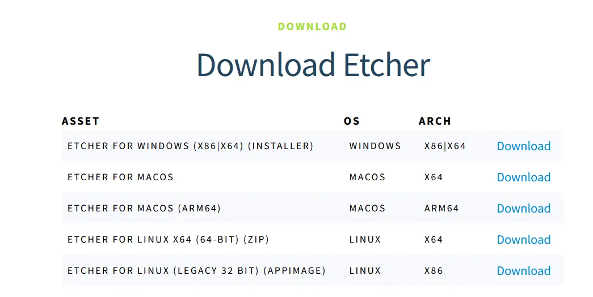


Balena Etcher इंस्टॉल करने के बाद, एप्लिकेशन खोलें और डाउनलोड की गई Fedora Workspace ISO इमेज चुनें। अपनी USB कुंजी को गंतव्य मीडिया के रूप में चुनें और बूट करने योग्य कुंजी बनाना शुरू करने के लिए **फ़्लैश** बटन पर क्लिक करें।


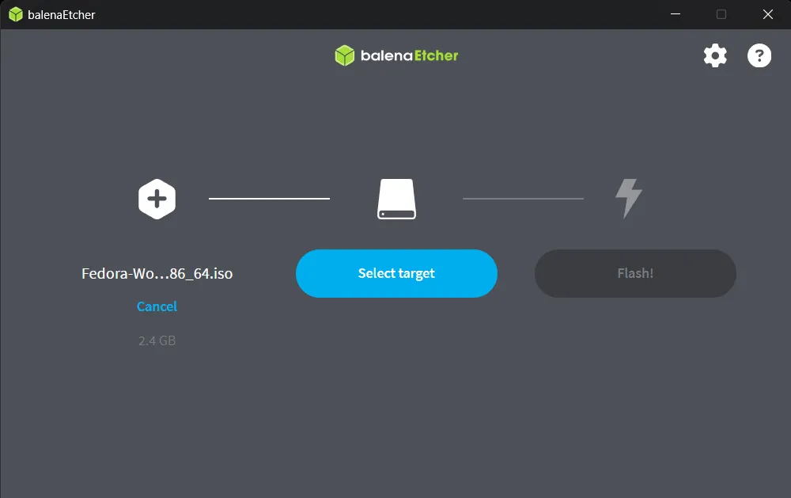


### फेडोरा स्थापित करना


जब आप अपनी USB कुंजी को बूट करना समाप्त कर लें, तो अपना कंप्यूटर बंद कर दें।


अपने कंप्यूटर को चालू करें, फिर अपने कंप्यूटर के आधार पर `F2`, `F12` या `ESC` कुंजी दबाकर स्टार्टअप के दौरान BIOS तक पहुंचें।


बूट विकल्पों में, अपनी USB कुंजी को प्राथमिक बूट डिवाइस के रूप में चुनें। इस विकल्प की पुष्टि करने पर, आपका कंप्यूटर पुनः प्रारंभ हो जाएगा और USB कुंजी पर मौजूद Fedora इंस्टॉलर** स्वचालित रूप से लॉन्च हो जाएगा।


एक बार जब आपका कंप्यूटर USB स्टिक से बूट हो जाता है, तो **GRUB स्क्रीन** दिखाई देती है।


इस स्तर पर, आपके पास निम्नलिखित विकल्प हैं:


- मीडिया परीक्षण**: यह विकल्प आपको USB स्टिक की अखंडता की जाँच करने और यह सुनिश्चित करने की अनुमति देता है कि सही इंस्टॉलेशन के लिए आवश्यक सभी निर्भरताएँ मौजूद हैं। यह एक वैकल्पिक चरण है, लेकिन अगर आपको USB स्टिक के बारे में कोई संदेह है, तो इसकी अनुशंसा की जाती है।


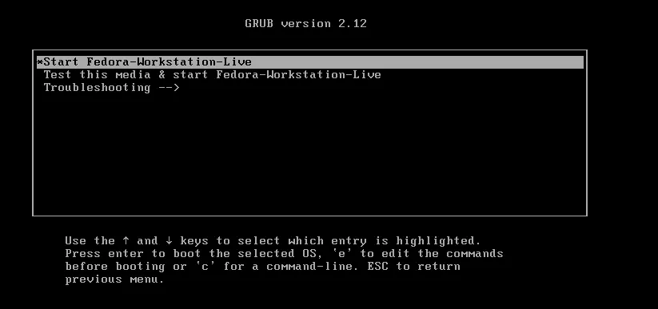


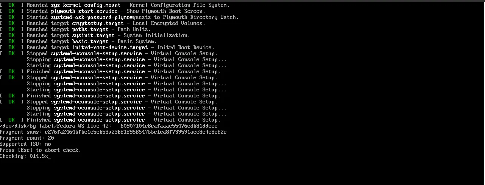


- फेडोरा प्रारंभ करें**: यह फेडोरा को बिना इंस्टॉलेशन के "लाइव" मोड में लॉन्च करता है।


फेडोरा डेस्कटॉप (लाइव मोड) पर, इंस्टॉलेशन प्रक्रिया शुरू करने के लिए **फेडोरा इंस्टॉल करें** (या Hard डिस्क पर इंस्टॉल करें) पर क्लिक करें। आप बाद में इंस्टॉल करना चुन सकते हैं और फेडोरा को इंस्टॉल किए बिना उसका परीक्षण कर सकते हैं।


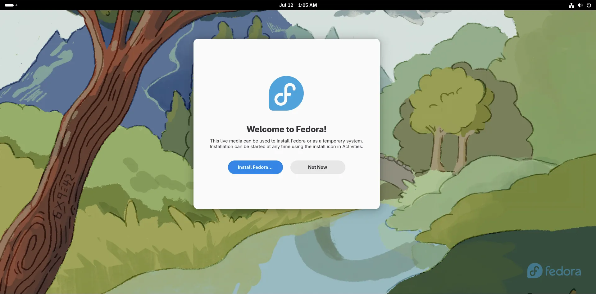


पहला चरण फेडोरा की **स्थापना भाषा** और **कीबोर्ड लेआउट** का चयन करना है


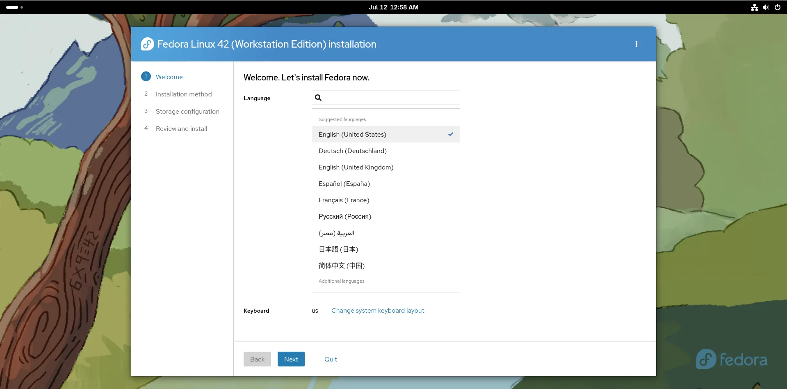


- स्थापना डिस्क का चयन करना:


वह Hard डिस्क चुनें जिस पर आप Fedora स्थापित करना चाहते हैं।


यदि डिस्क खाली है, तो फेडोरा स्वचालित रूप से सभी उपलब्ध स्थान का उपयोग कर लेगा। अन्यथा, आप विभाजन को अनुकूलित कर सकते हैं (मैन्युअल या स्वचालित)।


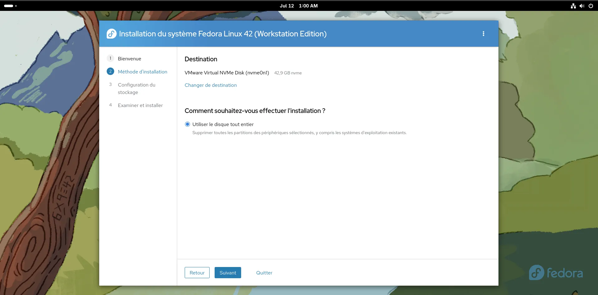


- कूटलेखन:


इस स्तर पर, फेडोरा अतिरिक्त Layer सुरक्षा जोड़ने के लिए आपकी डिस्क को एन्क्रिप्ट करने का सुझाव देता है। इससे यह सुनिश्चित होता है कि आपका डेटा केवल आपका फेडोरा सिस्टम ही पढ़ सकता है।


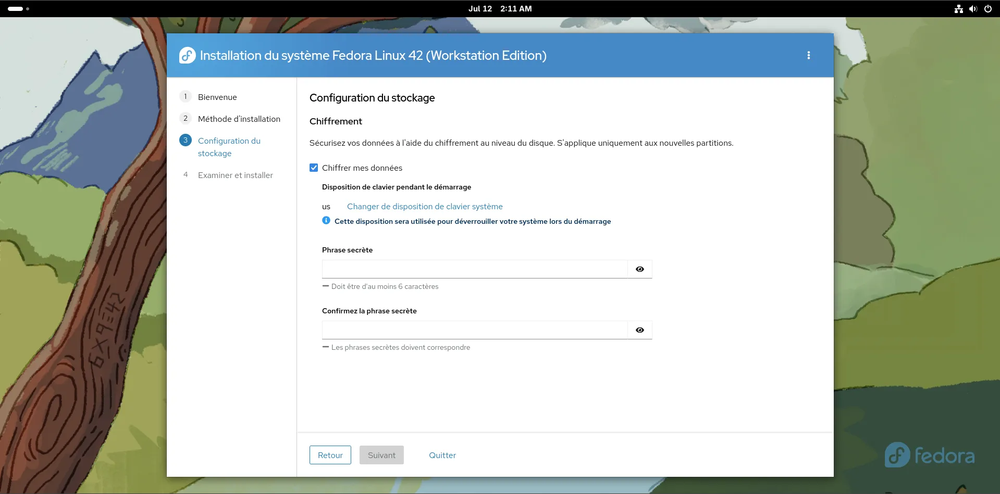


इंस्टॉलेशन शुरू करने से पहले, Fedora आपके विकल्पों का सारांश प्रदर्शित करता है। पुष्टि करें और Fedora इंस्टॉलेशन शुरू करने के लिए इंस्टॉल बटन पर क्लिक करें।


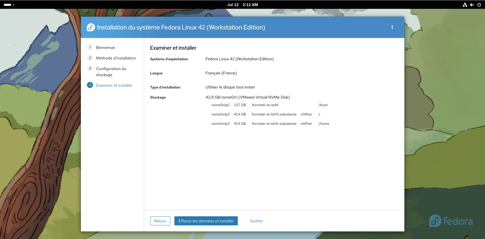


स्थापना के दौरान, फेडोरा फ़ाइलों की प्रतिलिपि बनाता है और सिस्टम को कॉन्फ़िगर करता है। स्थापना पूरी होने पर, कंप्यूटर स्वचालित रूप से रीबूट हो जाता है।


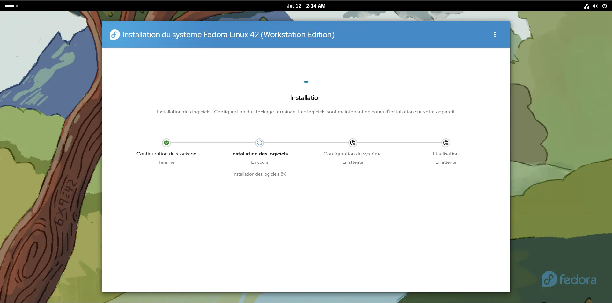


### मूल विन्यास


पहली बार उपयोग करने पर, आपको कुछ सेटिंग्स को अंतिम रूप देना होगा:


- यदि आवश्यक हो तो सिस्टम भाषा बदलें.


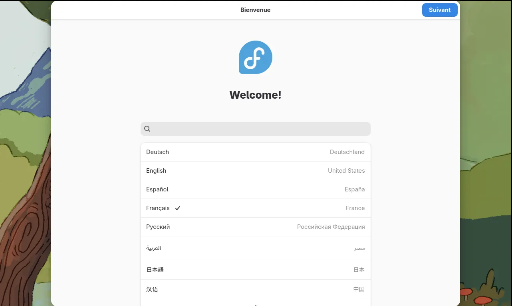


- अपनी पसंद के अनुसार कीबोर्ड लेआउट चुनें।


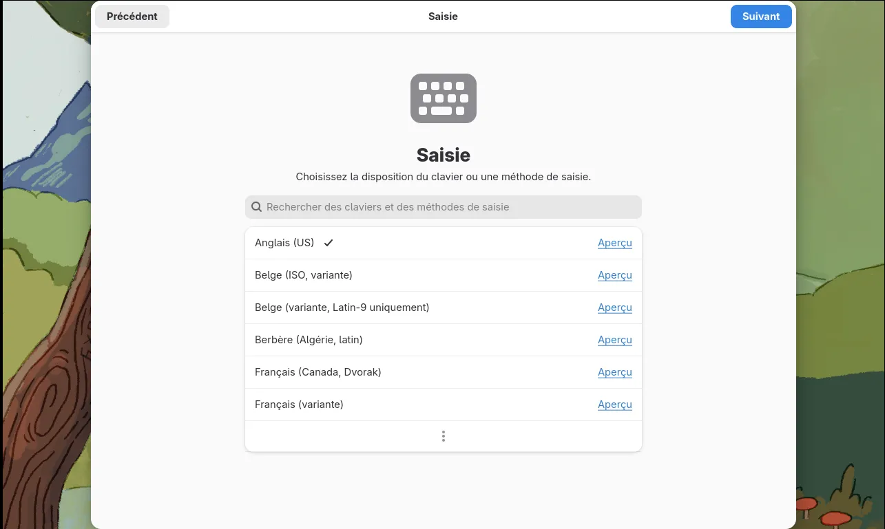


- खोज बार में अपने शहर का नाम लिखकर अपना समय क्षेत्र चुनें, फिर संबंधित सुझाव पर क्लिक करें।


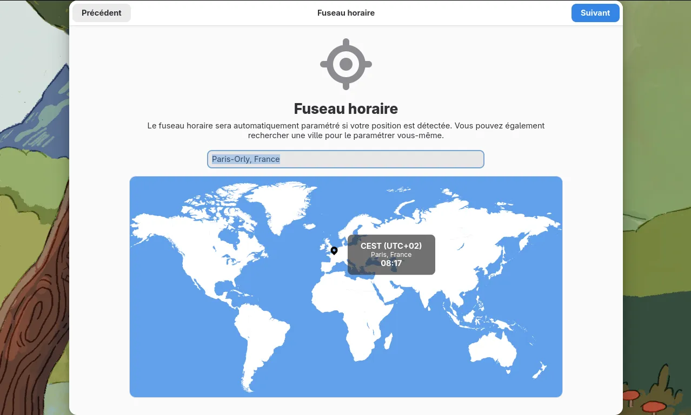


 - जिन अनुप्रयोगों को इसकी आवश्यकता है, उनके लिए अपनी स्थिति तक पहुंच को सक्षम या अक्षम करें, साथ ही बग रिपोर्ट को स्वचालित रूप से भेजें।


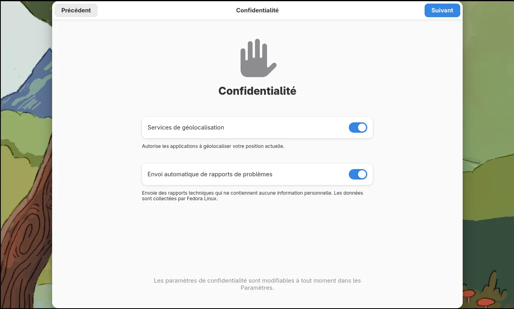


- तय करें कि क्या आप तृतीय-पक्ष सॉफ़्टवेयर रिपॉजिटरी को सक्षम करना चाहते हैं।


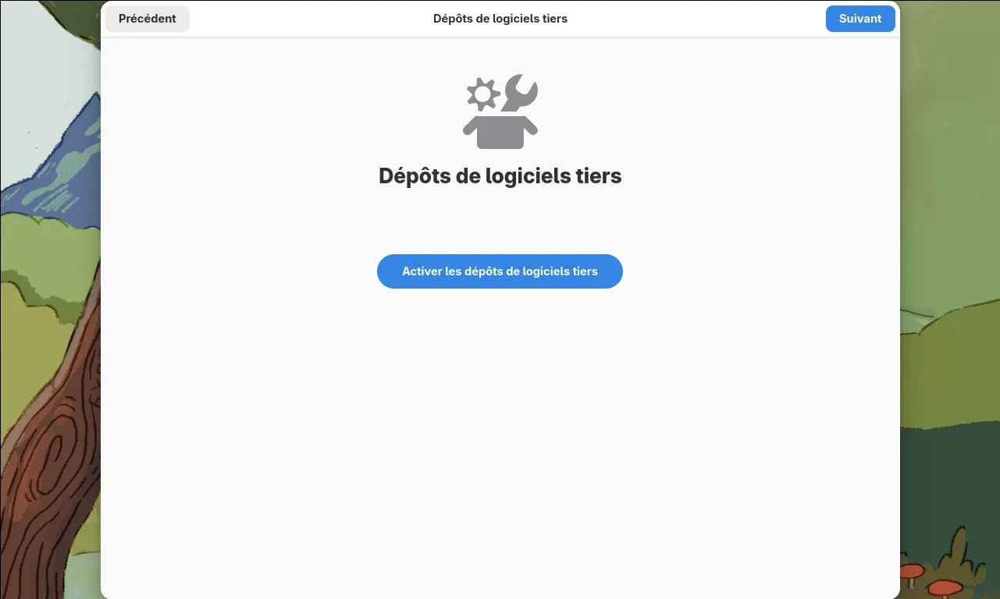


- अपना पूरा नाम दर्ज करें और अपने खाते के लिए उपयोगकर्ता नाम निर्धारित करें।


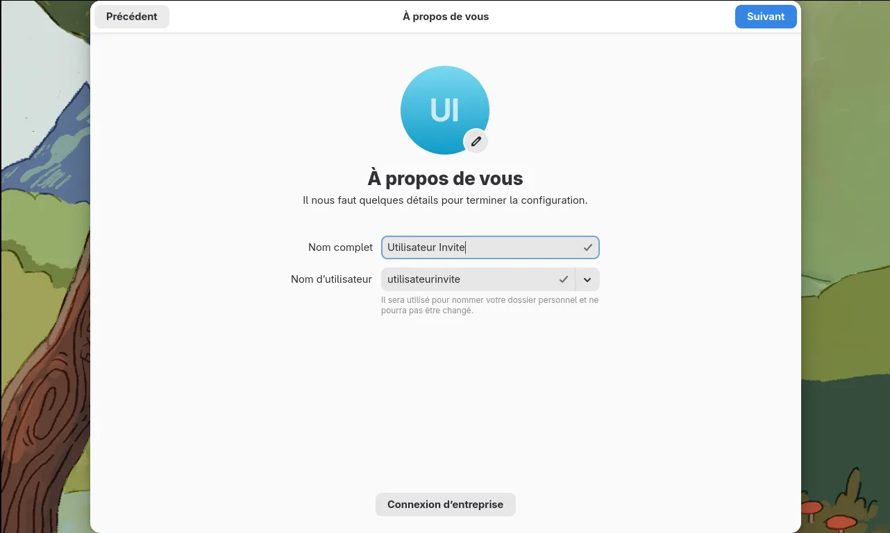


- अपने सत्र के लिए एक सुरक्षित पासवर्ड बनाएँ: जितना हो सके लंबा (कम से कम 20 अक्षर), जितना हो सके बेतरतीब और विविध अक्षरों (छोटे, बड़े, अंक और प्रतीक) वाला। अपना पासवर्ड सेव करना न भूलें।


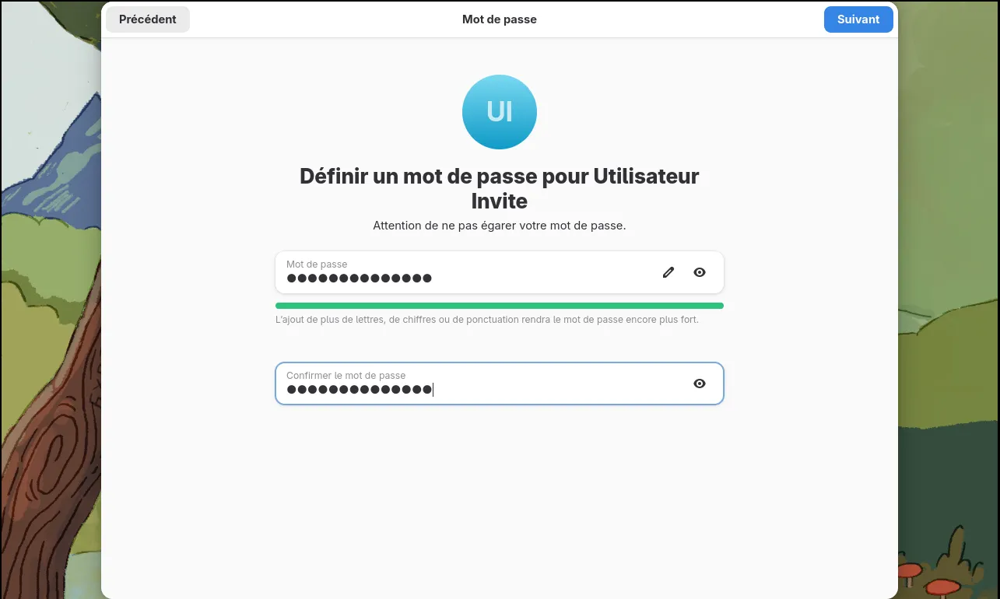


एक बार ये सभी चरण पूरे हो जाने पर, फेडोरा को लॉन्च करें और बिना किसी रीबूट के तुरंत इसका उपयोग शुरू करें।


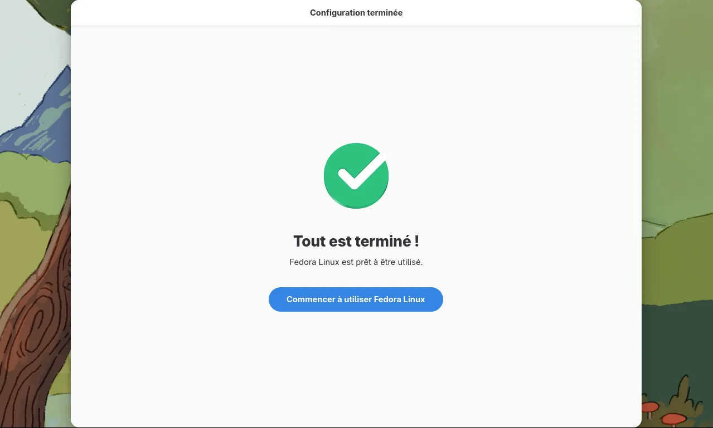


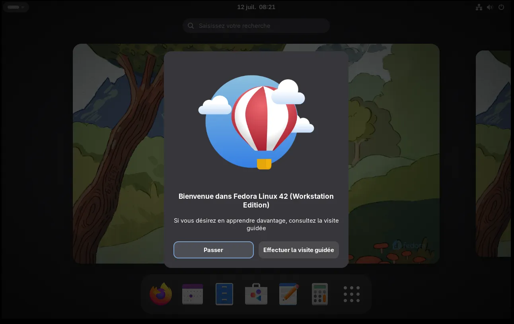


एक बार आपकी स्थापना पूरी हो जाने पर, आप अपने Interface घर में कुछ पूर्व-स्थापित उपयोगिताओं के बारे में परामर्श कर सकते हैं।


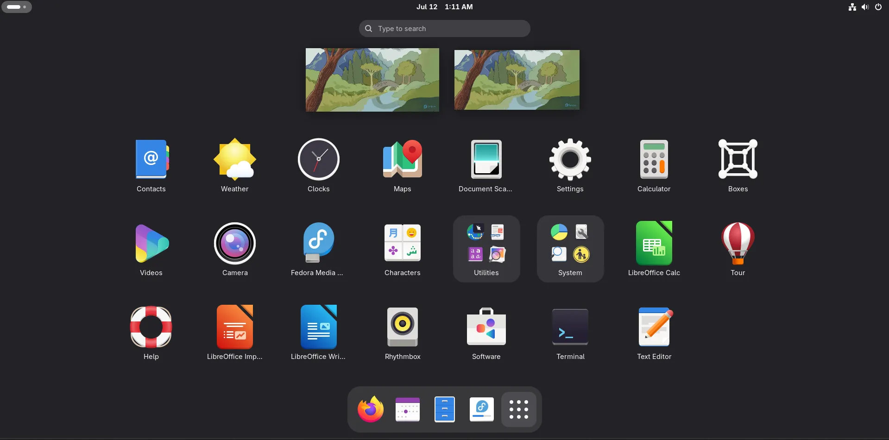


## बुनियादी कार्यों की खोज करें


### इंटरनेट ब्राउज़िंग


फेडोरा का डिफ़ॉल्ट ब्राउज़र फ़ायरफ़ॉक्स है। यह इस्तेमाल में आसान है और ज़्यादातर ज़रूरतों के लिए उपयुक्त है।


यदि आप कोई अन्य ब्राउज़र पसंद करते हैं, तो आप इसे **सॉफ्टवेयर मैनेजर** या **टर्मिनल** के माध्यम से इंस्टॉल कर सकते हैं।


### शब्द संसाधन


फेडोरा में डिफ़ॉल्ट रूप से **लिब्रे ऑफिस** ऑफिस सुइट शामिल है, जो कई उपयोगी उपकरण प्रदान करता है:


- वर्ड प्रोसेसिंग के लिए राइटर**.
- स्प्रेडशीट के लिए कैल्क**.
- प्रस्तुतियाँ बनाने के लिए Impress** का उपयोग करें।


## एप्लिकेशन इंस्टॉल करना


नए एप्लिकेशन इंस्टॉल करने के लिए, आप फेडोरा के **सॉफ्टवेयर मैनेजर** (जिसे _सॉफ्टवेयर_ कहा जाता है) का इस्तेमाल कर सकते हैं, जिससे इंस्टॉलेशन आसान और विज़ुअल हो जाता है। हालाँकि, **टर्मिनल** का इस्तेमाल अक्सर तेज़ और ज़्यादा सटीक होता है।


किसी भी सॉफ्टवेयर को स्थापित करने से पहले, हमेशा रिपॉजिटरी को अपडेट करना याद रखें ताकि यह सुनिश्चित हो सके कि आपके पास नवीनतम उपलब्ध संस्करणों तक पहुंच है।


फिर वांछित एप्लिकेशन की स्थापना शुरू करने के लिए निम्नलिखित कमांड का उपयोग करें:


sudo dnf install software_name`


## अपने ऑपरेटिंग सिस्टम को अपडेट करना


स्थापना के बाद, नवीनतम सुरक्षा पैच और सॉफ़्टवेयर अद्यतनों का लाभ उठाने के लिए फेडोरा को अद्यतन करना महत्वपूर्ण है।


### विकल्प 1: Interface ग्राफ़िक के माध्यम से


- फेडोरा **सेटिंग्स** खोलें, फिर **सिस्टम** अनुभाग पर जाएं।
- **सॉफ्टवेयर अपडेट** पर क्लिक करें।
- अपडेट डाउनलोड करना शुरू करें और प्रक्रिया पूरी होने तक प्रतीक्षा करें।


अद्यतन स्थापित हो जाने के बाद पुनः आरंभ करने की आवश्यकता हो सकती है।


### विकल्प 2: टर्मिनल के माध्यम से


- टर्मिनल खोलें और **रिपॉजिटरीज़** को अपडेट करके यह सुनिश्चित करें कि आपके पास निम्नलिखित का नवीनतम संस्करण है:


```shell
sudo dnf check-update
```


- इसके बाद, निम्न आदेश के साथ सभी स्थापित सॉफ़्टवेयर को अपडेट करें:


```shell
sudo dnf upgrade
```


अब आपका फेडोरा सिस्टम अपडेट हो गया है और आपके सभी रोज़मर्रा के कामों के लिए तैयार है। लिनक्स मिंट, एक अन्य लिनक्स वितरण, और अपने Bitcoin लेनदेन के लिए एक स्वस्थ और सुरक्षित वातावरण कैसे सेट करें, इस पर हमारा ट्यूटोरियल देखें।


https://planb.network/tutorials/computer-security/operating-system/linux-mint-da44852e-513f-4004-949a-8fde60c1bca5