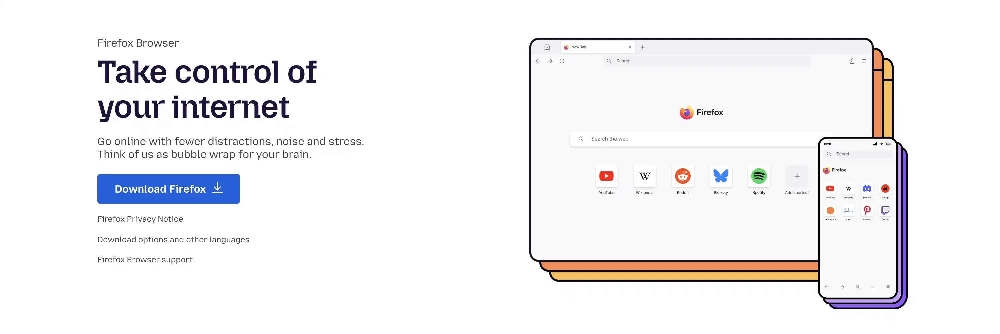


## Johdanto


Me kaikki vietämme tuntikausia verkossa, usein tietämättä, mitä selaimemme paljastaa meistä. Jokainen klikkaus, jokainen haku ja jokainen sivusto, jolla vierailemme, ruokkii massiivista henkilötietojen keräämistä.


*Web-selaimen markkinaosuus: Chrome hallitsee 65 prosentin markkinaosuudella, ja sen jälkeen tulevat Safari ja Edge. Lähde: Tilastokeskus: [gs.statcounter.com](https://gs.statcounter.com/browser-market-share)*


Kuten tämä kaavio osoittaa, Google Chrome hallitsee valtavasti, sillä sen osuus maailmanlaajuisesta käytöstä on yli 65 prosenttia. Tämä hegemonia tarkoittaa, että suurin osa Internetin käyttäjistä antaa selaustietonsa Googlen käyttöön, yrityksen, jonka liiketoimintamalli perustuu kohdennettuun mainontaan. Firefox, jonka markkinaosuus on vain 3 prosenttia, edustaa vaihtoehtoa, jonka on kehittänyt Mozilla, voittoa tavoittelematon organisaatio, jolla ei ole mitään kaupallista intressiä hyödyntää käyttäjän tietoja.


Firefoxin valitseminen on kuitenkin vasta ensimmäinen askel. Oletusarvoisesti jopa Firefox vaatii säätöjä, jotta voit maksimoida suojauksesi. Tässä oppaassa opastetaan sinua askel askeleelta yksinkertaisimmasta edistyneimpään, jotta voit muuttaa Firefoxin todelliseksi kilveksi jäljittämistä vastaan säilyttäen samalla miellyttävän selauskokemuksen.


### Miksi Firefox?


- Vapaa ja avoin lähdekoodi** (Gecko-moottori): tarkastettava, läpinäkyvä koodi
- Voittoa tavoittelematon organisaatio**: Mozilla Foundation, yleishyödyllinen tehtävä
- Sisäänrakennettu natiivisuojaus**: Enhanced Tracking Protection (ETP), Total Cookie Protection (TCP), State Partitioning, HTTPS-only mode, DNS over HTTPS (DoH)
- Kehittynyt mukauttaminen**: Toisin kuin Chrome, Firefox antaa sinun muokata käyttäytymistään perusteellisesti


### Tärkeitä periaatteita ennen aloittamista


- Ei yleispätevää reseptiä**: mitä enemmän muokkaat, sitä suurempi riski on erottua (sormenjälki). Tavoitteena on olla paremmin suojattu erottumatta joukosta.
- Vaiheittainen edistyminen**: Muuta asetusta, testaa tavallisia sivustoja ja jatka sitten. Kaikkea ei tarvitse muuttaa kerralla.
- Henkilökohtainen tasapaino**: Löydä SINUN kompromissi yksityisyyden ja helppokäyttöisyyden välillä.


## Nopea asennus


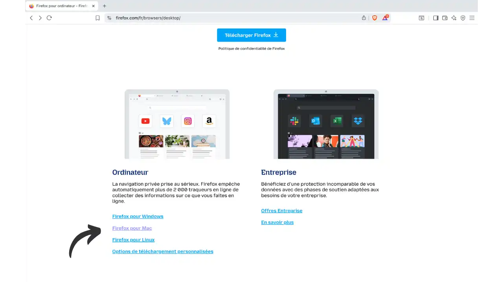


**Official download:** Mene osoitteeseen [firefox.com/browsers/desktop](https://www.firefox.com/en-US/browsers/desktop/). Valitse tällä sivulla käyttöjärjestelmäsi (Windows, macOS, Linux), niin pääset sopivalle lataussivulle, jossa on tarkat asennusohjeet.


- Windows**: lataa `.exe`-asennusohjelma, kaksoisnapsauta sitä ja seuraa ohjatun asennuksen ohjeita
- macOS**: lataa `.dmg`-tiedosto, avaa se ja vedä Firefox Sovellukset-kansioon
- Linux**: useita vaihtoehtoja - paketti `.deb`/`.rpm`, Flatpak (Flathub), Snap tai paketinhallinta (apt, dnf, pacman). Suositaan Mozillan virallisia lähteitä.


**Vihje:** Kun olet asentanut Firefoxin, tarkista päivitykset Ohjeen → **Tietoa Firefoxista** kautta (tärkeää tietoturvakorjausten kannalta).


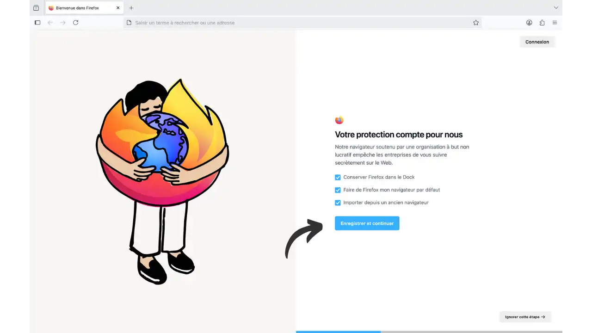


*Ensimmäinen ruutu käynnistettäessä Firefox: aseta Firefox oletusselaimeksi, lisää se pikakuvakkeisiin ja napsauta sitten "Tallenna ja jatka "*


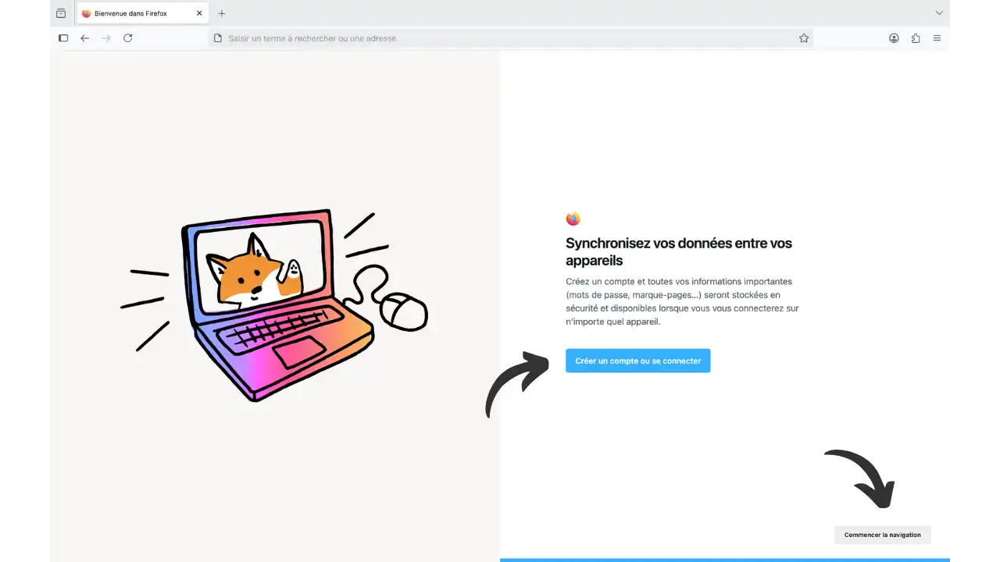


*Valinnainen vaihe: luo Firefox-tili tai kirjaudu sisään. Voit ohittaa tämän vaiheen napsauttamalla "Ei nyt" oikeassa alakulmassa*


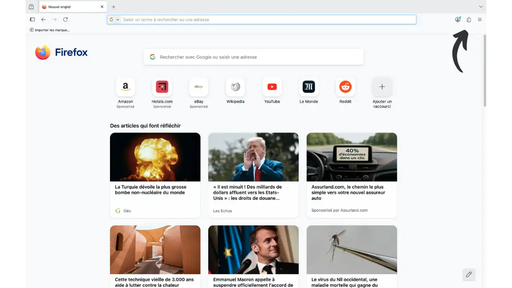


*Firefoxin aloitusnäyttö, kun määritys on valmis. Huomaa oikeassa yläkulmassa oleva ☰-valikko, josta pääset Asetukset ja Laajennukset Firefoxin mukauttamista varten*


## Suojaukset jo oletusarvoisesti aktivoitu (rauhoittavaa)


- Kohteen eristäminen (Fission)**: asteittaisessa käyttöönotossa. Tämä ominaisuus ajaa jokaisen sivuston erillisessä prosessissa, jotta yksi haitallinen välilehti ei pääse käsiksi toisen sivuston tietoihin. Tarkista sen tila osoitteesta `about:support` (etsi hakusanalla "Fission"). Jos se ei ole käytössä, voit aktivoida sen manuaalisesti kohdassa `about:config` komennolla `fission.autostart = true`.
- Total Cookie Protection (TCP)**: oletusarvoisesti aktiivinen. Evästeet ja muu tallennus rajoitetaan ensimmäisen osapuolen sivustolle (yksi "purkki" sivustoa kohti), mikä neutralisoi sivuston rajat ylittävän seurannan. Tilapäisiä poikkeuksia tehdään tarvittaessa Storage Access API:n kautta (integroidut kirjautumispainikkeet).
- Bounce/Redirect Tracking Protection**: Firefox havaitsee ja puhdistaa automaattisesti evästeet, jotka ovat jääneet jäljityssivustojen (linkit, jotka ohjaavat sinut uudelleen jäljittäjän kautta ennen määränpäätä) taakse, ja vähentää näin tätä jäljityskanavaa ilman, että sinun tarvitsee tehdä mitään.


## Taso 1 - olennainen (≤ 10 minuuttia)


Tavoite: yksityisyyden suojaa halutaan parantaa rikkomatta verkkoa. 90 prosenttia käyttäjistä.


Pääset asetuksiin napsauttamalla oikeassa yläkulmassa olevaa valikkoa ☰ ja sitten **"Asetukset "**:


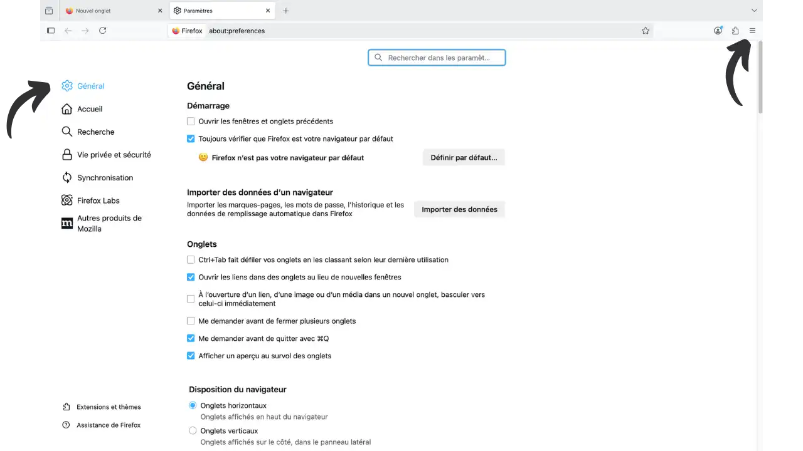


*Firefoxin asetussivu - "Yleiset" -välilehti. Täällä voit määrittää useimmat yksityisyysasetukset*


**Suojaus seurantaan (ETP)**


- Vaihda **ETP** tilalle **Strict**. Estät useampia seurantalaitteita (cross-site-evästeet, sormenjälkitunnistus, kryptomining, sosiaaliset widgetit...).
- Jos jokin sivusto rikkoutuu (video, kirjautumispainike...), poista suojaus käytöstä vain kyseisen sivuston osalta 🛡️-suojan kautta ja päivitä sitten välilehti.


Tässä ovat ETP:n eri suojaustasot:


- Standard** (tasapainotettu, maksimaalinen yhteensopivuus)
  - Estää: sosiaaliset seurantalaitteet, sivustojen väliset evästeet (kaikki ikkunat), sisällön seuranta yksityisessä selauksessa, kryptovaluutan louhijat, sormenjälkitunnistimet.
  - Sisältää **Total Cookie Protection** (TCP): yksi purkki sivustoa kohti.
- Tiukka** (suositellaan luottamuksellisuuden vuoksi)
  - Estää myös seurantasisällön kaikissa ikkunoissa + tunnetut ja epäillyt sormenjäljet.
  - Saattaa rikkoa joitakin sivustoja; käytä 🛡️ -suojaa paikallisen poikkeuksen saamiseksi.
- Mukautettu** (edistynyt)
  - Hienosäätö: evästeet, sisällön seuranta, alaikäiset, sormenjäljet (tunnetut/epäillyt).


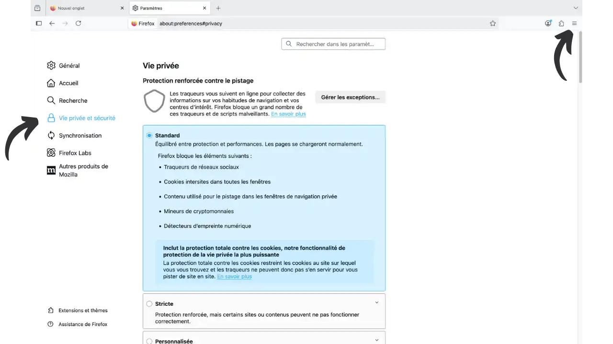


**Cookies ja sivuston tiedot


- Ota käyttöön **"Poista evästeet ja sivuston tiedot sulkemisen yhteydessä "** käynnistääksesi uudelleen puhtaasti joka kerta, kun käynnistät sivuston uudelleen.
- Lisää halutessasi **poikkeuksia** 2-3 tärkeälle sivustolle (sähköposti, pankki).


**Automaattinen tietojen syöttö, ehdotukset ja etusivu**


- Ota **automaattitäyttö** (henkilötunnukset, osoitteet, kortit) pois käytöstä. Käytä sen sijaan salasanahallintaohjelmaa.
- Haku**: poista käytöstä **"Näytä hakuehdotukset "**.
- Address-palkki**: leikkaa **"Sponsoroidut ehdotukset "** ja **"Kontekstiehdotukset "**.
- Etusivu**: poista **Tasku** ja **sponsoroitu sisältö** käytöstä.


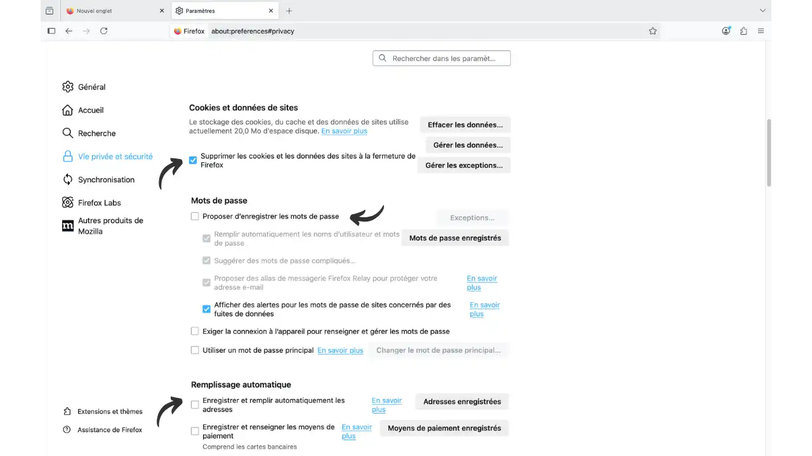


**Vain HTTPS**


- Aktivoi **"HTTPS-tila vain kaikissa ikkunoissa "**.


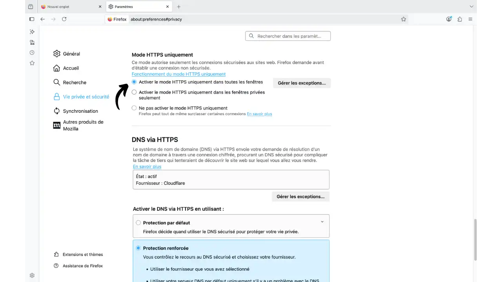


**Telemetria ja mainonnan mittaus


- Kohdassa "Data collection by Firefox" **poista kaikki valinnat**.
- Poista käytöstä **"Yksityisyyden suojaa edistävät mainostoimenpiteet "** (PPA).
- Turvallinen selaus**: pidä se käytössä (suositellaan). Firefox tarkistaa sivustot uhkaluetteloiden perusteella hashed-kyselyjen ja paikallisten tarkistusten avulla, mikä suojaa phishingiltä ja haittaohjelmilta ja vaikuttaa vain vähän yksityisyyteen.


**Globaali yksityisyyden suoja (valinnainen)**


- Aktivoi **GPC** ilmaistaksesi, että kieltäydyt myymästä/jakamasta tietoja.


**Hakukone


- Vaihda **DuckDuckGo**, **Startpage**, **Qwant** tai **Brave Search** (Asetukset → Haku).


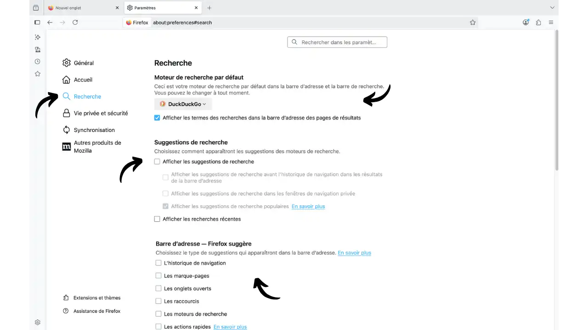


**Private navigation**


- Yksityiset ikkunat (Ctrl/Cmd+Shift+P) kertaluonteisia istuntoja varten (lahjat, toissijaiset tilit...). Vältä "aina yksityinen" -tilaa: laajennukset voivat olla inaktiivisia ja evästeiden poikkeukset vähemmän hyödyllisiä.


**Välttämättömät laajennukset** (asenna virallisesta luettelosta)


- uBlock Origin**: estää mainokset ja nykyisen seurannan, kevyt.
- Privacy Badger**: oppii estämään, mikä sinua seuraa; lähettää Do Not Track / GPC.
- ClearURLs** (valinnainen): Pidä se, jos näet edelleen "likaisia" URL-osoitteita (utm, fbclid).
- Firefoxin usean tilin säiliöt**: **eristää evästeet/istunnot ja tallennuksen säiliökohtaisesti; rinnakkainen monitili; vähemmän cross-site-seurantaa**. Virallinen laajennus: `https://addons.mozilla.org/fr/firefox/addon/multi-account-containers/`.


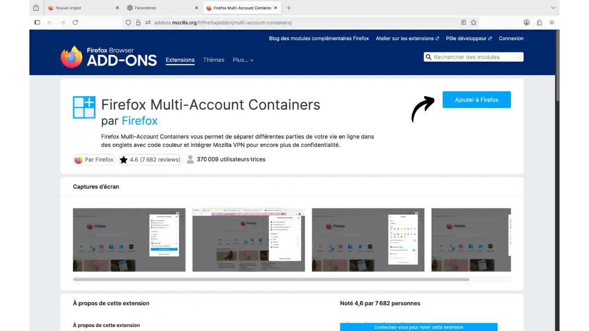


**Salasanat ja 2FA**


- Käytä erityistä salasanahallintaohjelmaa** (Bitwarden, KeePassXC). **Vältä** salasanojen tallentamista selaimeen. ** Ota 2FA** käyttöön aina kun mahdollista.


## Taso 2 - Vahvistettu (osastointi ja verkko)


Tavoite: toimintojen lokerointi ja verkkovuodon vähentäminen.


**DNS over HTTPS (DoH)**


- Oletustila**: Automaattisesti aktivoitu joillakin alueilla (USA, Kanada, Venäjä, Ukraina). Muualla vaaditaan manuaalinen aktivointi.
- Kokoonpano**: Asetukset → Yleiset → Verkkoasetukset → **Verkkoasetukset → **Valmis DoH** → **Cloudflare** tai **Quad9** → **Maksimaalinen suojaus**.
- Suurin suojaus = vain TRR** (ei palautusta järjestelmän DNS:ään). Jos yrityksen/hotellin verkko estää, vaihda takaisin **Standardiin** tai poista DoH käytöstä.
- Redundanssi**: DoH voi olla tarpeeton, jos käytät jo luotettavaa VPN:ää, jolla on oma suojattu DNS.
- Tarkistustesti**: `https://www.dnsleaktest.com/` pitäisi näyttää vain valitun DoH-palveluntarjoajan.


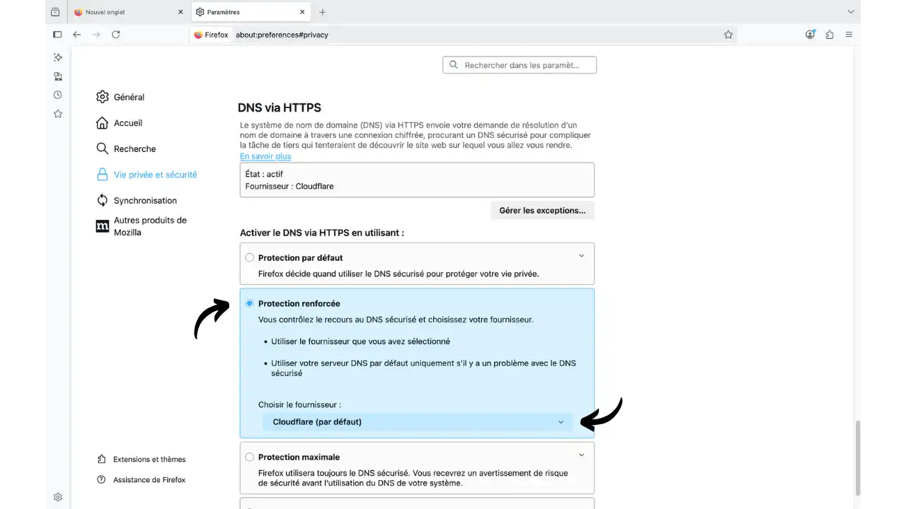


**Konttien ja profiilien avulla tapahtuva lokerointi


- Usean tilin säiliöt**: luo tiloja (Henkilökohtainen, Työ, Talous, Sosiaaliset verkostot, Ostokset, Kertakäyttö). Määritä **"Avaa aina tässä säiliössä "** toistuvia sivustoja varten. Virallinen laajennus: `https://addons.mozilla.org/fr/firefox/addon/multi-account-containers/`.
- Miksi käyttää niitä?
  - Evästeiden, istuntojen ja tallennuksen vahva eristäminen** tilakohtaisesti.
  - Vähemmän cross-site-seurantaa**: rajoitetaan jättiläiset (Facebook, Google).
  - Samanaikaiset useat tilit** samassa palvelussa.
  - Vähemmän CSRF/XSS**-riskiä segmentoitujen identiteettien välillä.
  - Vinkki: ainakin omat säiliöt sosiaalisille verkostoille/Google, työ ja talous.
- Facebook Container** (valinnainen): yksinkertaistettu versio FB/Instagramille.
- Erilliset profiilit**: `about:profiles` kautta (pääprofiili, minimaalinen "erittäin turvallinen" profiili, testiprofiili). Tietojen ja laajennusten täydellinen lokerointi.


**Lisälaajennukset** (varataan)


- Cookie AutoDelete**: poistaa sivuston evästeet heti, kun välilehti suljetaan (hyödyllinen, jos Firefox on auki pitkään).
- LocalCDN**: palvelee nykyisiä kirjastoja paikallisesti (vähentää Google/Microsoft-pyyntöjä). Osittainen yhteensopivuus.


**Kännykkä (Android)**


- Firefox Android + uBlock Origin**: samanlainen suojaus liikkeellä.


## Taso 3 - Asiantuntija (about:config & Arkenfox)


Tavoite: pitkälle kehitetty karkaisu hyväksytyin kompromissein. Suositellaan **erilliseen profiiliin**.


Valitse vain toinen seuraavista kahdesta lähestymistavasta:


**Menetelmä A - Manuaaliset muutokset**: Muutama kohdennettu säätö `about:config`:n kautta (yksinkertaisempi, tarkempi valvonta)


**Lähestymistapa B - Arkenfox user.js**: Täysin automaattinen konfigurointi (monimutkaisempi, maksimaalinen suojaus)


➡️ **Arkenfox sisältää jo KAIKKI alla mainitut about:config-muutokset** + satoja muita. Jos valitset Arkenfoxin, jätä about:config-osio huomiotta.


### Lähestymistapa A: Manuaaliset muutokset about:configin kautta


Kirjoita `about:config` Address-palkkiin → Hyväksy riski.


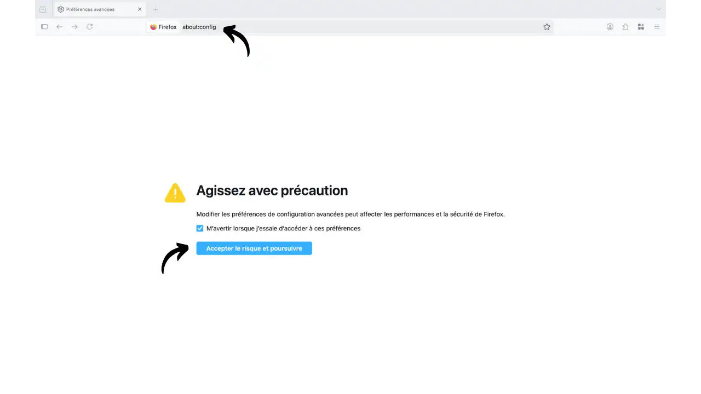


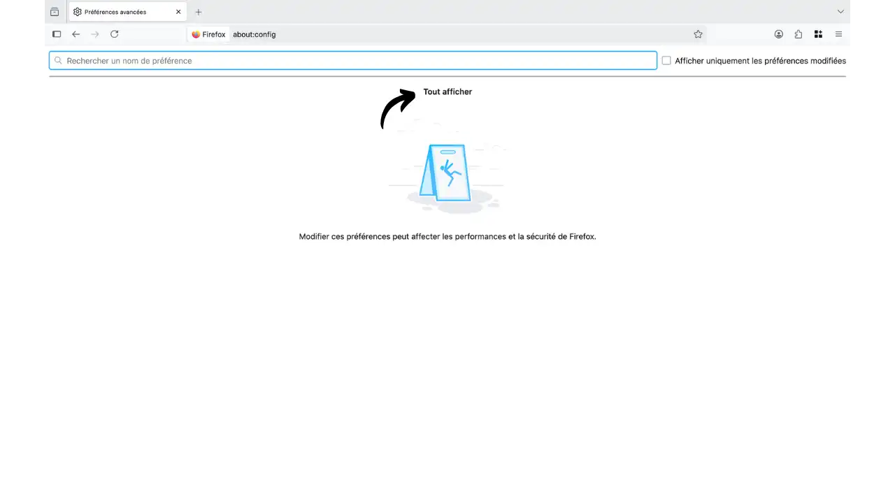


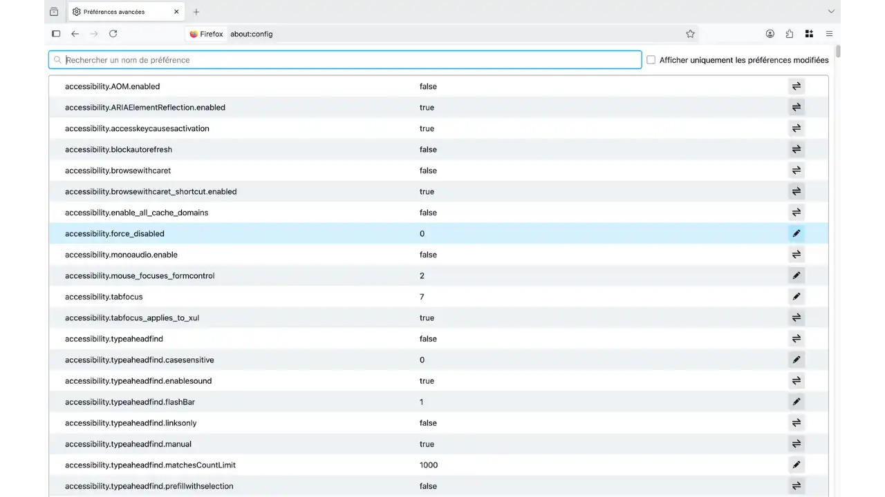


- Sormenjälkien vastustuskyky (periytyy Tor-selaimelta)


```text
privacy.resistFingerprinting = true
```


Vaikutukset: (standardoidut ikkunakoot), standardoidut käyttäjäagentti/käytännöt, Canvas/WebGL/AudioContext-rajoitukset. Enemmän yhdenmukaisuutta, mutta muutama "omituisuus" (offset-aika, joskus vähän englantia).


- Poista WebRTC käytöstä (välttää IP-vuodot; rikkoo Web visio)


```text
media.peerconnection.enabled = false
```


- Referer plus yhteensopiva (oletus)


```text
network.http.referer.XOriginPolicy = 1
network.http.referer.trimOnCrossOrigin = true
```


Tiukka vaihtoehto (voi rikkoa maksut/SSO):


```text
network.http.referer.XOriginPolicy = 2
```


- Rajoittamalla räiskyviä sovellusrajapintoja ja spekulaatiota


```text
dom.battery.enabled = false
device.sensors.enabled = false
beacon.enabled = false
geo.enabled = false
media.navigator.enabled = false
network.prefetch-next = false
browser.urlbar.speculativeConnect.enabled = false
network.http.speculative-parallel-limit = 0
```


Kultainen sääntö: jos jokin menee rikki, palaa edelliseen muutokseen.


### Lähestymistapa B: Arkenfox user.js (Täysin automaattinen konfigurointi)


**Arkenfox**-projekti tarjoaa yhteisön ylläpitämän `user.js`-tiedoston, joka soveltaa automaattisesti satoja yksityisyyteen ja turvallisuuteen liittyviä Firefox-asetuksia. Uudelleenkäynnistyksen yhteydessä Firefox lukee tämän tiedoston profiilistasi ja soveltaa näitä asetuksia.


- Mitä järkeä siinä on? Aloita **yhtenäisestä karkaistusta lähtökohdasta** ilman "klikkailua kaikkialle"; vähennä virheitä; säästä aikaa.
- Mitä se muuttaa (esimerkkejä): telemetrian katkaisu, evästeet/cache/referrer/HTTPS-vahvistus, **RFP** + letterboxing, **WebRTC pois käytöstä**, DoH/TLS-säädöt, chatty API:t rajoitettu.
- Milloin sitä kannattaa käyttää: jos haluat Firefoxin kovetetun 10 minuutissa ja hyväksyä muutamia poikkeuksia (DRM/streaming, Web visio, SSO/maksaminen).
- Edut: nopea, johdonmukainen, **päivitetty** (ESR-suuntautunut), erittäin hyvin **dokumentoitu** (wiki + kommentit), **muuttettavissa** ohitusten avulla.
- Rajoitukset: yhteensopivuus (jotkin verkkosovellukset), mukavuus (UTC, ikkunakoot) ja muistutus: **(ei verkon anonymiteettiä).


Asennus (mieluiten **omistettuun profiiliin**)


1. Tallenna profiili/suosikit ja listaa sivustot, joissa on evästeiden poikkeuksia.


2. Lataa `user.js` osoitteesta `https://github.com/arkenfox/user.js` (ESR/stable-versio).


3. Etsi profiilikansiosi `about:profiles` kautta:


   - Windows: `%APPDATA%/Mozilla/Firefox/Profiles/...`
   - Linux: `~/.mozilla/firefox/...`
   - macOS: `~/Library/Application Support/Firefox/Profiles/...`


4. Sulje Firefox ja siirrä `user.js` profiilikansiosi juureen.


5. Käynnistä uudelleen; muokkaa `about:config`:n tai ohitustiedoston kautta.


Päivitykset


- Seuraa Arkenfox-julkaisuja (ESR:n mukaisesti), vaihda `user.js`, käynnistä Firefox uudelleen; lue julkaisutiedot.


**Räätälöinti ohitusten kautta**


Arkenfox on oletusarvoisesti tarkoituksella rajoittava. Jos haluat mukauttaa tiettyjä asetuksia tarpeisiisi (suoratoisto, visio, tietyt sivustot), voit luoda `user-overrides.js`-tiedoston samaan kansioon kuin `user.js`. Tämän tiedoston avulla voit "ohittaa" tietyt Arkenfoxin asetukset muuttamatta päätiedostoa.


Luo `user-overrides.js` ja lisää mukautukset:


```javascript
// DRM/streaming
user_pref("media.eme.enabled", true);

// Safe Browsing (si vous préférez le garder)
user_pref("browser.safebrowsing.phishing.enabled", true);
user_pref("browser.safebrowsing.malware.enabled", true);

// Historique moins restrictif
user_pref("places.history.expiration.max_pages", 200000);

// Synchronisation Firefox
user_pref("identity.fxaccounts.enabled", true);

// WebRTC (si visio nécessaire)
user_pref("media.peerconnection.enabled", true);

// Referer plus compatible
user_pref("network.http.referer.XOriginPolicy", 1);
user_pref("network.http.referer.trimOnCrossOrigin", true);
```


Parhaat käytännöt


- Käytä erillistä **"Arkenfox"-profiilia** ja pidä "normaali" profiili mukavuuden vuoksi.
- Minimoi laajennukset (uBlock Origin OK) hyökkäyspinnan ja ainutlaatuisuuden rajoittamiseksi.
- Lisää tarvittaessa sivustokohtaisia poikkeuksia (suojaa 🛡️, uBO, NoScript, jos käytössä).
- Testaa jokaisen muutoksen jälkeen: WebRTC/DNS-vuodot, Cover Your Tracks, CreepJS.


## Parhaat käytännöt


- Päivitykset**: Firefox ja laajennukset ajan tasalla.
- Pidennykset**: kohtuullisia ja luotettavia; varo "epäilyttäviä" lunastuksia.
- Lataukset**: varovaisuus; testaa arkaluonteiset tiedostot VirusTotalissa.
- Salasanat**: ***2FA** käytössä; vältä tallentamista selaimeen.
- Hygienia**: rajoita Google/Facebook kontteihin; sulje/avoita säännöllisesti "nollataksesi" kontekstin.


## Rajoitukset ja vaihtoehdot


- Karkaistu selain ≠ verkon anonymiteetti: ilman **VPN**:ää IP-osoitteesi pysyy näkyvissä, ja jopa sen kanssa korrelaatio on edelleen mahdollista.
- Liiallinen muokkaaminen voi tehdä sinusta **yksilöllisen**. **RFP** standardoi; satunnaistamisvälineet (esim. Chameleon) voivat... erottaa sinut muista. Testaa, vertaa, säädä.
- Vaihtoehdot/täydennykset:
 - Tor Browser: verkon anonymiteetti Torin kautta; hitaampi. Katso täydellinen asennus- ja konfigurointioppaamme**:


https://planb.network/tutorials/computer-security/communication/tor-browser-a847e83c-31ef-4439-9eac-742b255129bb


 - Mullvad Browser: mullvad: "Tor ilman Toria", yhdistettävissä VPN:n kanssa; standardoitu jalanjälki. Lue, miten se asennetaan omassa opetusohjelmassamme**:


https://planb.network/tutorials/computer-security/communication/mullvad-browser-a16c13d6-8bf9-4cb5-9aa0-85411a9cda0e


- Suositellut yhdistelmät: Tor/Mullvad arkaluonteisiin toimintoihin; erilliset profiilit lokerointia varten.


## Päätelmä


Kun noudatat tätä vaiheittaista opasta, olet tehnyt Firefoxista todellisen suojan digitaalista valvontaa vastaan. Tärkeistä tason 1 asetuksista edistyneisiin Arkenfox-konfiguraatioihin, jokainen muutos vahvistaa yksityisyyttäsi vaarantamatta selauskokemustasi.


**Yritystietosi on nyt paremmin suojattu**: mainosseurantalaitteet estetty, evästeet lokeroitu, IP Address -vuodot neutraloitu, telemetria poistettu käytöstä. Firefox ei ole enää pelkkä selain, vaan tarpeisiisi räätälöity digitaalinen vastustustyökalu.


** Muista: luottamuksellisuus ei ole koskaan itsestäänselvyys. Testaa suojauksesi säännöllisesti, päivitä asetukset ja älä epäröi mukauttaa asetuksia tottumustesi muuttuessa. Anonymiteettisi verkossa riippuu yhtä paljon työkaluistasi kuin käytännöistäsi.


## Resurssit


### Plan ₿ Network


- SCU 202 - Henkilökohtaisen digitaalisen tietoturvan parantaminen: Lisätietoja tässä opetuksessa käsitellyistä digitaalisen turvallisuuden käsitteistä**


https://planb.network/courses/4ba0e3de-e67f-4ea1-a514-f111206810d1

### Mozillan dokumentaatio


- [Enhanced Tracking Protection] (https://support.mozilla.org/kb/enhanced-tracking-protection-firefox-desktop): Virallinen opas parannettuun jäljityssuojaukseen
- [State Partitioning] (https://developer.mozilla.org/docs/Mozilla/Firefox/Privacy/State_Partitioning): Tekninen dokumentaatio tilojen jakamisesta
- [MDN Web Security](https://developer.mozilla.org/docs/Web/Security): Täydellinen referenssi verkkoturvallisuudesta


### Arkenfox


- [Wiki ja asennusopas](https://github.com/arkenfox/user.js/wiki): Täydellinen Arkenfox-projektin dokumentaatio
- [Talletus ja vapautukset](https://github.com/arkenfox/user.js): Lataa user.js-tiedosto ja seuraa päivityksiä


### Oppaat & yhteisöt


- [PrivacyGuides - Työpöytäselaimet](https://www.privacyguides.org/en/desktop-browsers/): Selainsuositukset ja -vertailut
- Reddit**: r/firefox, r/privacy palautetta ja tukea varten
- PrivacyGuides-foorumi**: syvälliset tekniset keskustelut


### Testityökalut


- [Cover Your Tracks (EFF)](https://coveryourtracks.eff.org/): Digitaalinen sormenjälki ja jäljittämisen estämisen tehokkuus
- [DNS-vuototesti](https://www.dnsleaktest.com/): DNS-vuototesti ja DoH:n tehokkuus
- [BrowserLeaks](https://browserleaks.com/): (WebRTC, Canvas, fontit jne.): Täydellinen testisarja (WebRTC, Canvas, fontit jne.)
- [BadSSL](https://badssl.com/): SSL/TLS-varmenteen validointitestit
- [CreepJS](https://abrahamjuliot.github.io/creepjs/): Kehittynyt analyysi 50+ sormenjälkivektorista
- [Cloudflare DNS Test](https://1.1.1.1/help): Tarkistetaan, että Cloudflare DoH toimii oikein
