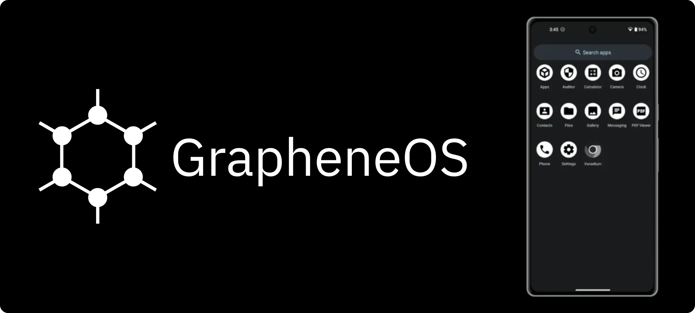
> [GrapheneOS](https://grapheneos.org/) is een non-profit open-source mobiel besturingssysteem dat is ontworpen om een hoog niveau van privacy en veiligheid te bieden, terwijl het volledig compatibel blijft met Android-applicaties.

GrapheneOS, oorspronkelijk opgericht in 2014 als 'CopperheadOS' is gebaseerd op de traditionele Android Code (AOSP), maar met veel veranderingen en verbeteringen gericht op het verbeteren van de privacy en veiligheid van de gebruiker. GrapheneOS geeft de gebruiker de controle over zijn telefoon, niet de grote techbedrijven.

### Sommaire:

- Intro
- Voorbereiding
- Installeer
- App alternatieven
- Nadelen
- Nuttige info

*Deze handleiding is een bewerking van de originele inhoud gepubliceerd door [BitcoinQnA op Bitcoiner.Guide onder MIT-licentie](https://github.com/BitcoinQnA/Bitcoiner.Guide/blob/main/grapheneos.md), aan wie de volledige eer toekomt voor het oorspronkelijke schrijfwerk.*

## Waarom GrapheneOS gebruiken?

Moderne telefoons zijn apparaten van $500-$1000 voor het volgen en verzamelen van gegevens. Elk facet van ons leven loopt er doorheen en helaas worden veel van deze gegevens op de een of andere manier gedeeld met derden.

GrapheneOS is speciaal gebouwd om het delen van gegevens te verminderen en uw apparaat beter te beveiligen tegen potentiële aanvalsvectoren. Er bestaat niet zoiets als een GrapheneOS-account. Je hebt er geen nodig om apps te downloaden of te communiceren met het OS. Simpel gezegd, jij bent niet het product.

GrapheneOS biedt extra beveiliging voor je Android-ervaring door middel van een aantal eenvoudige basisprincipes.

1. **Attack surface reduction** - Onnodige code (of bloatware) verwijderen.

2. **Vulnerability exposure prevention** - Geef de gebruiker genoeg granulariteit om de compromissen te kiezen waar hij zich prettig bij voelt.

3. **Sandbox containment** - GrapheneOS versterkt bestaande Android sandboxes, waardoor het vermogen van elke app om te communiceren met de rest van je telefoon verder wordt vergrendeld.

Lees meer over de technische details van de GrapheneOS-functieset [hier] (https://grapheneos.org/features).

### De overgang vergemakkelijken

Als je al jaren vertrouwd bent met het ecosysteem van Google of Apple, kan de gedachte dat je van de ene op de andere dag al dat gemak kwijtraakt, beangstigend zijn. Maar met een aantal weloverwogen beslissingen over het installeren van apps (waarover later meer), kan veel van deze verwachte problemen worden verminderd of weggenomen.

Hoe goed de alternatieven ook worden, de gedachte aan zo'n verandering kan nog steeds afschrikwekkend zijn. Als je je in deze situatie bevindt, is mijn beste advies om je nieuwe GrapheneOS-apparaat een tijdje naast je bestaande telefoon te gebruiken. Van daaruit kun je langzaam 2 tot 3 apps per week loslaten, totdat je merkt dat je alleen nog maar naar je GrapheneOS-toestel grijpt.

Als je voor deze aanpak kiest, wees dan streng voor jezelf en maak zo snel mogelijk een einde aan je afhankelijkheid van de bewaakte alternatieven. Wij mensen zijn lui en nemen vaak de weg van de minste weerstand. Onthoud waarom je in de eerste plaats bent overgestapt.

**In plaats van te betalen met je persoonlijke gegevens, heb je ervoor gekozen om te betalen met je tijd en soms met je Hard verdiende geld (afhankelijk van de alternatieve apps die je installeert).**

## Aan de slag

GrapheneOS is momenteel alleen in productie voor _(nogal ironisch)_ de serie [Google Pixel](https://grapheneos.org/faq#supported-devices) telefoons. Dit is echter niet zonder reden. Pixel's bieden de beste hardware-gebaseerde beveiliging als aanvulling op het werk dat is gedaan om het OS te harden. Dit omvat zaken als specifieke componentisolaties en geverifieerd opstarten.

### Een apparaat kiezen

Zorg er bij het kiezen van de Pixel waarop je GrapheneOS wilt installeren voor dat je aanvinkt hoe lang het apparaat standaard [beveiligingsupdates] (https://support.google.com/pixelphone/answer/4457705?hl=en#zippy=%2Cpixel-xl-a-a-g-a-g) blijft ontvangen.

Op het moment van schrijven is de Pixel 6a het goedkoopste model dat beschikbaar is met goede langetermijnondersteuning, gegarandeerd tot juli 2027. Als je voor dit model kiest, werkt OEM unlocking niet met de versie van het standaard OS uit de fabriek. Je moet het updaten naar de release van juni 2022 of later via een over-the-air update. Nadat je het hebt bijgewerkt, moet je het toestel ook resetten naar de fabriek om OEM-ontgrendeling te herstellen. Alle andere modellen die carrier unlocked zijn, zullen direct uit de doos klaar zijn voor GrapheneOS.

Als je een toestel kiest, wil je er ook zeker van zijn dat je een ontgrendelde versie koopt. Bepaalde providers zoals Verizon leveren hun toestellen met een bootloader die vergrendeld is, wat het volgende proces volledig verhindert.

### GrapheneOS installeren

De GrapheneOS [web installer](https://grapheneos.org/install/web) maakt het hele proces een fluitje van een cent en kan door iedereen in minder dan 10 minuten worden voltooid.

De volgende instructies zijn een ingekorte versie uit de bovenstaande link.

Het enige wat je hoeft te geven is:

- De pixel
- Een USB-kabel om van de telefoon naar je computer te gaan
- Een computer waarop een webbrowser draait (elke browser op basis van Chromium: Chrome, Edge, Brave, etc.)

Laten we er eens in duiken:

1. De eerste stap is om naar **Instellingen** > **Over telefoon** te gaan en herhaaldelijk op het buildnummer te tikken totdat je ziet dat **'Ontwikkelmodus'** is geactiveerd.

2. Ga vervolgens naar **Instellingen** > **Systeem** > **Ontwikkelopties** en schakel **'OEM ontgrendelen'** in.

3. Start het apparaat nu opnieuw op en houd de volumeknop ingedrukt terwijl de telefoon weer wordt ingeschakeld.

4. Sluit de telefoon aan op je laptop en sta de verbinding toe als om autorisatie wordt gevraagd.

5. Klik op de pagina met het webinstallatieprogramma op 'De bootloader ontgrendelen'.

6. Je ziet dan de telefoonopties veranderen. Gebruik de volumeknop om de selectie te wijzigen in `ontgrendelen` en gebruik de aan/uit-knop om te accepteren.

7. Klik vervolgens op download release op de pagina met het webinstallatieprogramma.

8. Zodra het volledig is gedownload, gaat u naar de volgende stap en klikt u op 'Flashvrijgave'. Dit duurt een minuut of twee en je hoeft de telefoon helemaal niet aan te raken.

9. Ga ten slotte naar de volgende stap van het webinstallatieprogramma en klik op **Lock Bootloader**. Je moet de selectie wijzigen en bevestigen met de aan/uit-knop op dezelfde manier als eerder in het proces.

10. Wanneer je het woord `Start` ziet, bevestig dit dan met de aan/uit-knop en het apparaat zal opstarten in je nieuwe Google-vrije besturingssysteem.

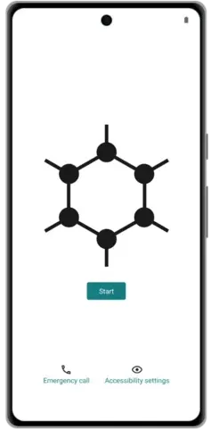

GrapheneOS startscherm

na de eerste keer opstarten en instellen is het een goed gebruik om OEM-ontgrendeling uit te schakelen via Instellingen > Systeem > Opties voor ontwikkelaars._

je kunt ook de extra, optionele maar aanbevolen stap nemen om de installatie te verifiëren via de Auditor app. Je hebt een aparte Android-telefoon nodig waarop de app is geïnstalleerd om deze stap uit te voeren. Instructies hiervoor vind je [hier](https://attestation.app/tutorial)._

Video met details van de eenvoudige stappen hierboven

Als deze eenvoudige stappen een stap te ver lijken, kun je overwegen om een Pixel te kopen met de GrapheneOS software [voorgeïnstalleerd] (https://ronindojo.io/en/roninmobile). Wees je er wel van bewust dat je een klein beetje vertrouwen stelt in de leverancier.

### Vooraf geïnstalleerde apps

Nu je alles hebt ingesteld, valt het je misschien op hoe kaal GrapheneOS er uitziet bij de eerste installatie. Standaard zijn deze apps geïnstalleerd:

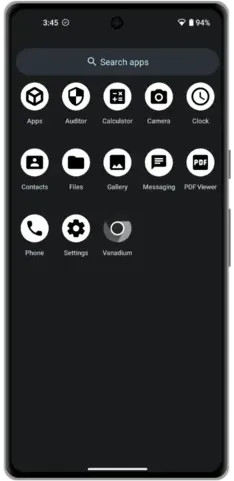

Standaard apps

De enige twee die je misschien niet kent zijn 'Auditor' en 'Vanadium'.

- De [Auditor app] (https://play.google.com/store/apps/details?id=app.attestation.auditor) maakt gebruik van op hardware gebaseerde beveiligingsfuncties om de identiteit van een apparaat te valideren, samen met de authenticiteit en integriteit van het besturingssysteem. Het controleert of het apparaat het standaard besturingssysteem draait met de bootloader vergrendeld en of er niet met het besturingssysteem geknoeid is.
- [Vanadium](https://github.com/GrapheneOS/Vanadium) is een privacy- en beveiligingsbestendige variant van de webbrowser Chromium.

## Aanpassing

Telefooninstellingen zijn iets persoonlijks, maar hier zijn een paar van de eerste dingen die ik verander als ik GrapheneOS installeer om mezelf meer thuis te voelen.

### Een achtergrond instellen en het thema bijwerken

Ga naar Instellingen > Achtergrond en stijl. Vanaf hier:

- Werk de achtergronden van het beginscherm en vergrendelscherm bij voor afbeeldingen die je van het web hebt gedownload.
- De accentkleuren kiezen die in de hele UI worden gebruikt.
- Donker thema inschakelen.

### Batterijpercentage tonen

Ga naar **Instellingen** > **Batterij** en schakel **Batterijpercentage weergeven** in de statusbalk in.

### Contacten importeren

**Vanaf een andere Android-telefoon** - Ga naar de Contacten-app en zoek naar de optie Exporteren naar VCF.

**Vanaf iOS** - Gebruik een app als Export Contact en gebruik de 'vCard' exportoptie om een VCF-bestand te exporteren.

Zodra je het VCF-bestand hebt, kun je het overzetten naar je GrapheneOS-apparaat met een externe opslagmogelijkheid zoals een microSD-kaart of USB-stick. Als je die niet bij de hand hebt, kun je ervoor kiezen om te delen via een van de vele apps hieronder.

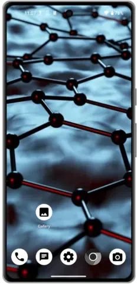

Gepersonaliseerd startscherm

## Alternatieve apps

Om je telefoon nuttig te maken, wil je een aantal applicaties installeren! De volgende opties zijn opgenomen omdat ik ze allemaal persoonlijk heb gebruikt of omdat ze sterk worden aanbevolen door de bredere privacygemeenschap. Er zijn nog veel meer goede alternatieven beschikbaar die niet worden genoemd, en [Awesome Privacy](https://awesome-privacy.xyz) biedt een ongelooflijk uitgebreide lijst met privacybehoudende toepassingen voor alle soorten apparaten.

Het is niet omdat een app Free and Open Source Software (FOSS) is, dat hij vrij is van potentiële privacylekken. Gebruik [Exodus](https://reports.exodus-privacy.eu.org/en/) om te zien hoe uw favoriete apps presteren ten opzichte van hun privacycontroles.

### F-Droid

[F-Droid](https://f-droid.org/) is een installeerbare catalogus van FOSS-toepassingen voor Android. De client maakt het eenvoudig om te bladeren, applicaties te installeren en bij te werken op je apparaat. Het is het vermelden waard dat updates via F-Droid soms langzamer kunnen zijn dan bij andere app stores. Dit is voornamelijk afhankelijk van het feit of de app is gevonden via de hoofdrepository van F-Droid of een aangepaste.

Om F-Droid te installeren ga je gewoon naar hun website via een browser op je GrapheneOS telefoon en tik je op download. Dit zal een `.apk` bestand downloaden. Vervolgens wordt je gevraagd of je de app wilt installeren.

Naast de applicaties die te vinden zijn in de standaard repository in F-Droid, hosten veel Open Source projecten ook hun eigen repository die kan worden toegevoegd in de F-Droid app instellingen. Als dit het geval is, zal het project in kwestie je door de eenvoudige stappen leiden die nodig zijn om dit te bereiken op hun website.

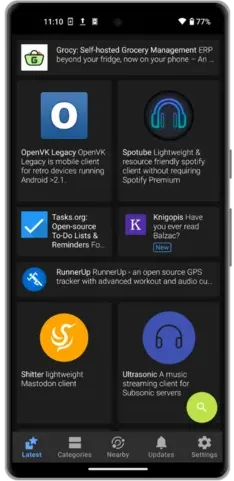

F-Droid startscherm

https://planb.network/tutorials/computer-security/data/f-droid-2cd1aae5-7028-4c04-8fbe-95aeaf278ef4

### Aurora-winkel

[Aurora Store](https://auroraoss.com/) is een FOSS-versie van de Google Play Store. Aurora ziet er erg hetzelfde uit als de traditionele Play Store en je kunt er elke app downloaden en updaten die je normaal via de Google optie zou vinden.

De belangrijkste functie van Aurora is anoniem inloggen. Dit betekent dat je al je favoriete apps kunt downloaden die niet beschikbaar zijn via F-Droid of directe APK, zonder ingelogd te zijn op je Google-account.

Voordat je je haast om dit je standaard installatieoptie te maken, bedenk dan dat veel van de applicaties waar we vanaf proberen te komen, geïnstalleerd zijn vanuit de Play Store. Het feit dat ze toegankelijk zijn via Aurora verandert niets aan het feit dat sommige programma's traceerfuncties kunnen bevatten. Het zal niet altijd mogelijk zijn, maar wanneer je kunt, zoek dan naar een F-Droid alternatief voordat je downloadt via Aurora.

Om Aurora te installeren, zoek je gewoon naar 'Aurora Store' in F-Droid.

Aurora heeft ook een aantal potentiële aanvalsvectoren, omdat de "anonieme accounts" in werkelijkheid worden gemaakt en beheerd door Aurora. In theorie zouden ze kwaadaardige updates of apps naar je telefoon kunnen pushen, hoewel je dan nog steeds de installatieprompt op het apparaat moet accepteren. Aurora heeft soms ook problemen met apps die niet verschijnen door regio- en apparaatfouten. Dit kan meestal worden omzeild met de onderstaande stappen.

**Toptip** - Soms heeft de Aurora Store last van snelheidsbeperking waardoor je beperkt wordt in het zoeken en installeren van apps. Om dit te omzeilen ga je naar **Instellingen** > **Apps** > **Aurora** > **Standaard openen** en voeg je het domein `play.google.com` toe. Wanneer je nu naar de website van een product of dienst navigeert met de link 'Downloaden via Play Store', kun je door erop te tikken de app in Aurora openen en downloaden.

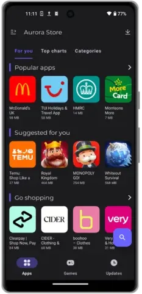

Beginscherm Aurora Store

https://planb.network/tutorials/computer-security/data/aurora-store-b3345da7-1ed1-407e-a9ae-a1c7f0ba9967

### APK downloaden

Apps op Android kunnen ook worden gedownload en geïnstalleerd via een `.apk` bestand. Dit is een geweldig alternatief waarvoor geen app-winkels van derden nodig zijn. Je kunt het bestand gewoon rechtstreeks downloaden van de website van het project of de dienst of de GitHub-repository.

Het nadeel van deze aanpak is dat je geen automatische updates krijgt, dus je moet de communicatiekanalen van die service in de gaten houden om op de hoogte te blijven van nieuwe releases. Er is echter een geweldig project genaamd Obtanium dat dit probeert op te lossen. [Obtainium](https://github.com/ImranR98/Obtainium) stelt je in staat om Open-Source apps direct vanaf hun releases pagina's te installeren en bij te werken, en meldingen te ontvangen wanneer er nieuwe releases beschikbaar zijn.

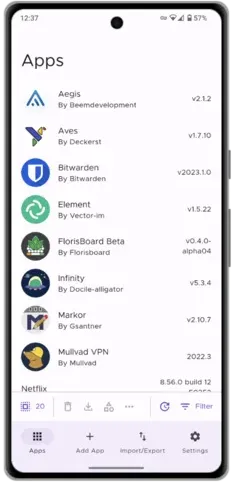

Obtanium preview

### Webtoepassingen

Voor momenten waarop je een dienst zelden wilt gebruiken en geen native applicatie wilt downloaden, kun je eenvoudigweg de webversie openen. Veel websites bieden tegenwoordig ook ondersteuning voor Progressive Web App (PWA). Hierbij kun je een specifieke website (bijvoorbeeld Twitter.com) bookmarken naar het beginscherm van je telefoon. Als je dan op het icoontje tikt, wordt deze geopend als een schermvullende applicatie zonder de gebruikelijke afleidingen van de typische browserervaring. Hieronder zie je een voorbeeld van hoe dit eruit ziet.

Om dit te bereiken in Vanadium, GrapheneOS' eigen browser, navigeer je gewoon naar de website van je keuze, tik je op de drie verticale stippen in de rechterbovenhoek van het scherm en tik je vervolgens op **'Toevoegen aan beginscherm'**.

Het enige nadeel van deze aanpak is dat je geen meldingen krijgt omdat dit gewoon een bladwijzer is. Maar sommigen zien dat misschien als een voordeel!

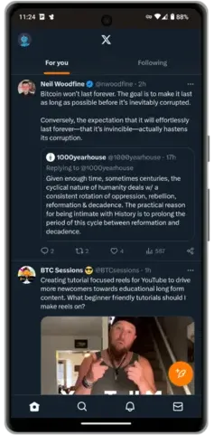

Twitter PWA

### Webbrowsers

Je kunt niet echt de fout in gaan met de voorverpakte optie, Vanadium. De app gedraagt zich identiek aan elke andere mobiele browser die ik heb geprobeerd en ik heb geen enkel compatibiliteitsprobleem gehad.

Voor momenten dat je toegang nodig hebt tot Tor native `.onion` sites, kun je de Tor Browser APK rechtstreeks downloaden van hun [website](https://www.torproject.org/download/#android) of via F-Droid.

### VPN's

Om je online activiteiten te beschermen tegen je snooping internet service provider (ISP), is een Virtual Private Network (VPN) app een goede optie. Een VPN stuurt je internetverkeer in een versleutelde tunnel naar een gedeeld IP Address dat wordt beheerd door de VPN-serviceprovider om ervoor te zorgen dat de activiteiten van je apparaat niet aan jou kunnen worden gekoppeld.

Hier zijn twee erkende opties waarmee je de dienst kunt betalen met Bitcoin zonder enige persoonlijke informatie te verstrekken. Beide zijn beschikbaar op F-Droid.

https://planb.network/tutorials/computer-security/communication/ivpn-5a0cd5df-29f1-4382-a817-975a96646e68

https://planb.network/tutorials/computer-security/communication/mullvad-968ec5f5-b3f0-4d23-a9e0-c07a3e85aaa8

### Berichten

De laatste jaren zijn er veel oplossingen voor versleuteld berichtenverkeer. Het probleem blijft echter, je kunt de beste en meest privé optie op je telefoon geïnstalleerd hebben, maar als je geen contacten hebt die het gebruiken, wat heeft het dan voor zin?

De meeste mensen die niet geïnteresseerd zijn in privacy, gebruiken waarschijnlijk WhatsApp of iMessage. De eerste kan worden gedownload via de Aurora Store, maar de laatste zal niet werken op GrapheneOS (natuurlijk!).

- [Signal](https://signal.org/) is een van de populairdere end-to-end versleutelde (E2EE) messengers met een sterke staat van dienst en uitgebreide functies. Signal vereist een telefoonnummer om je aan te melden, dus als je van plan bent om te chatten met mensen waarvan je liever niet hebt dat ze je telefoonnummer weten, kijk dan eens naar alternatieven. Signal moet worden gedownload via de Aurora Store.
- [Simplex](https://f-droid.org/en/packages/chat.simplex.app/) is een vrij nieuwe E2EE messenger. Het heeft geen gebruikers-ID, vereist geen telefoonnummer of persoonlijke informatie. Mensen vinden je door je persoonlijke QR-code te scannen of door je unieke link te bezoeken. Simplex staat geavanceerde gebruikers ook toe om hun eigen server te draaien om de afhankelijkheid van een gecentraliseerde entiteit verder te verminderen. Simplex heeft geen desktop client, dus is misschien niet geschikt als multi-device op je prioriteitenlijst staat. Simplex voor Android is beschikbaar via F-Droid.
- [Threema](https://threema.ch/en/faq/libre_installation) biedt een soortgelijke ervaring als Simplex, maar bestaat al langer en voelt daardoor wat meer gepolijst aan. Threema is niet gratis, een levenslange licentie kost $4,99 en kan worden gekocht met Bitcoin. Threema biedt een webclient en native desktopapplicaties. De Android applicatie is beschikbaar via F-Droid.
- [Telegram FOSS](https://f-droid.org/en/packages/org.telegram.messenger/) is een onofficiële FOSS Fork van de officiële Telegram-app voor Android. Telegram heeft E2EE 'geheime chats', maar de standaardoptie is niet privé. Telegram FOSS kan worden gedownload van F-Droid.

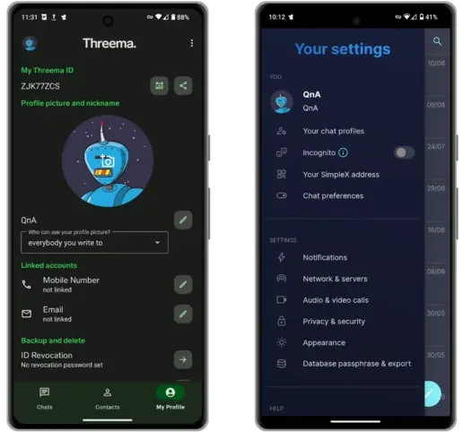

Links: Threema, rechts: Simplex

https://planb.network/tutorials/computer-security/communication/signal-8dfb5572-6962-4f1c-bfa5-3192da4e9a4e

https://planb.network/tutorials/computer-security/communication/telegram-09ab3cf3-7625-4267-97a1-24e59a9e5943

https://planb.network/tutorials/computer-security/communication/tox-027bc897-8c98-4265-b85b-e78b7ab607f3

https://planb.network/tutorials/computer-security/communication/simplex-chat-7a1efa11-4d0a-49c4-92aa-e18bf22c22b9

https://planb.network/tutorials/computer-security/communication/threema-24382d25-df7b-4e96-b332-6968f748df74

### Media

- [Spotube](https://f-droid.org/packages/oss.krtirtho.spotube/) is een cross-platform Spotify-client waarvoor je geen Premium-account nodig hebt. Spotube is beschikbaar via F-Droid.
- [ViMusic](https://f-droid.org/en/packages/it.vfsfitvnm.vimusic/) is een fantastische applicatie voor het gratis streamen van muziek van YouTube. ViMusic is verkrijgbaar bij F-Droid.
- [Newpipe](https://f-droid.org/packages/org.schabi.newpipe/) biedt een YouTube-ervaring zonder de vervelende advertenties en twijfelachtige toestemmingen. Met NewPipe kun je je abonneren op kanalen, op de achtergrond luisteren en zelfs downloaden om offline te bekijken. NewPipe is toegankelijk via F-Droid.
- [AntennaPod](https://f-droid.org/packages/de.danoeh.antennapod/) is een podcastspeler waarmee je je kunt abonneren op al je favoriete shows en deze kunt beheren. AntennaPod is beschikbaar via F-Droid.

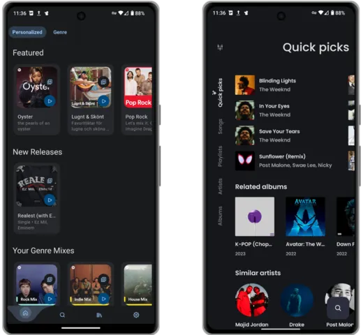

Links: Spotube, rechts: ViMusic

### Kaarten

Als je stemassistentie wilt tijdens het rijden en het gebruik van een kaarten-app in GrapheneOS, dan moet je [RHVoice](https://rhvoice.org/installation/) installeren en [configure](https://discuss.grapheneos.org/d/2488-organic-maps-app-voice-instructions-are-not-available).

- [Magic Earth](https://www.magicearth.com/) is een alternatief voor kaarten dat afslag-voor-afslag navigatie, 3D en offline kaarten ondersteunt. Magic Earth kan worden gedownload van de Aurora Store.
- [Organic Maps](https://f-droid.org/en/packages/app.organicmaps/) is een alternatief voor kaarten voor reizigers, toeristen, wandelaars en fietsers gebaseerd op crowd-sourced OpenStreetMap gegevens. Het is een privacy-gerichte, open-source Fork van Maps.me app (voorheen bekend als MapsWithMe). Het ondersteunt 100% van de functies zonder een actieve internetverbinding en kan worden gedownload van F-Droid.
- [OsmAnd](https://f-droid.org/en/packages/net.osmand.plus/) is een ander geweldig alternatief voor kaarten dat alle bovenstaande functies ondersteunt.

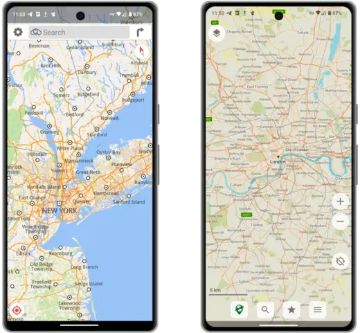

Links: Magische aarde, rechts: Organische kaarten

### E-mail

- [Proton Mail](https://proton.me/mail) biedt een gratis privé e-mailservice die gecontroleerde E2EE ondersteunt. Proton biedt ook een betaalde versie die aangepaste domeinen en [aliasing](https://proton.me/support/creating-aliases) ondersteunt. Proton Mail kan worden gedownload als een directe APK of via Aurora.
- [Tutanota](https://tutanota.com/) biedt dezelfde functies als Proton Mail, inclusief optionele betaalde diensten en kan worden gedownload als een directe APK of via F-Droid.
- [K-9 Mail](https://f-droid.org/en/packages/com.fsck.k9/) is een open source e-mailclient die met vrijwel elke e-mailprovider werkt. Het ondersteunt meerdere accounts, een verenigde inbox en de OpenPGP encryptiestandaard.

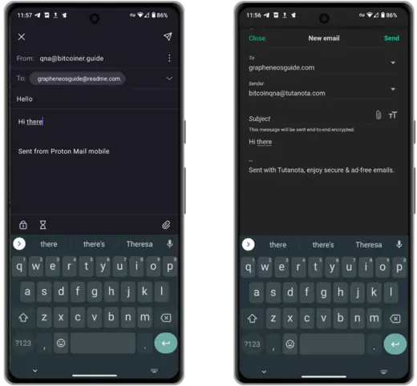

Links: Proton Mail, rechts: Tutanota

### Productiviteit

- [Syncthing](https://f-droid.org/packages/com.nutomic.syncthingandroid/) is een bestandssynchronisatieprogramma. Het synchroniseert bestanden tussen twee of meer apparaten in realtime, veilig beschermd tegen nieuwsgierige ogen. Uw gegevens zijn alleen uw gegevens en u verdient het om te kiezen waar het wordt opgeslagen, of het wordt gedeeld met een derde partij, en hoe het wordt verzonden via het internet. Syncthing is beschikbaar via F-Droid.
- [KDE Connect](https://f-droid.org/packages/org.kde.kdeconnect_tp/) al je apparaten om gemakkelijk met elkaar te praten wanneer ze verbonden zijn met je thuisnetwerk. Verstuur eenvoudig bestanden, foto's en klembordgegevens over al je apparaten (zelfs op iOS!). KDE connect kan worden gedownload van F-Droid.
- [Notesnook](https://f-droid.org/en/packages/com.streetwriters.notesnook/) is een E2EE notitie applicatie voor het synchroniseren van je gedachten en to-do lijsten op al je apparaten. Hun gratis plan zou de meeste persoonlijke gebruikssituaties moeten dekken. Notesnook is beschikbaar op F-Droid.
- [Standard Notes](https://f-droid.org/en/packages/com.standardnotes/) lijkt erg op Notesnook, maar vereist een betaald abonnement voor de functieset. Standard Notes is beschikbaar via F-Droid.
- [Anysoft Keyboard](https://f-droid.org/packages/com.menny.android.anysoftkeyboard/) is een toetsenbord-app waarmee je zo'n beetje alles kunt aanpassen wat je maar kunt bedenken als het gaat om de type-ervaring van je telefoon. Het kan worden gedownload via F-Droid.
- [GBoard](https://play.google.com/store/apps/details?id=com.google.android.inputmethod.latin&hl=en&gl=US) is de standaard Google-toetsenbord-app. In mijn ervaring biedt het veruit de beste type- en veegervaring. Als je deze app downloadt, zorg er dan voor dat je alle netwerkgerelateerde toestemmingen volledig uitschakelt. Hij kan worden gedownload via Aurora.

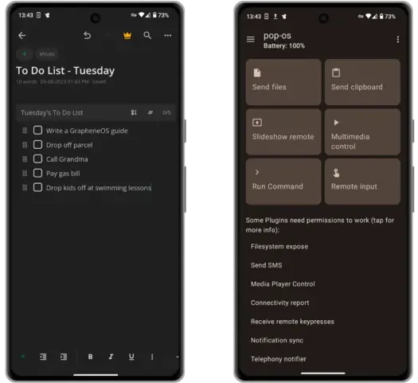

Links: Notesnook, rechts: KDE Connect

### Lifestyle

- [Geometric Weather](https://f-droid.org/en/packages/wangdaye.com.geometricweather/) is een prachtig ontworpen Open Source weer-app die beschikbaar is via F-Droid. Het ondersteunt ook widgets in verschillende formaten, zodat je het weer op de door jou gekozen locatie rechtstreeks vanaf je startscherm kunt zien.
- [Translate You](https://f-droid.org/packages/com.bnyro.translate/) is een Open Source en privacy beschermende vertaal app die meer dan 200 talen ondersteunt. Translate You is beschikbaar via F-Droid.
- [Proton Calendar](https://proton.me/calendar/download) is een eenvoudig te gebruiken E2EE die naadloos samenwerkt met je Proton e-mailaccounts. Proton Calendar kan worden gedownload als een APK of via de Aurora store.
- [PassAndroid](https://f-droid.org/en/packages/org.ligi.passandroid/) is een app voor het weergeven en opslaan van instapkaarten, coupons, bioscoopkaartjes en lidmaatschapskaarten etc. Download gewoon het relevante `pkpass` of `espass` bestand en open het met de app. PassAndroid is beschikbaar via F-Droid.

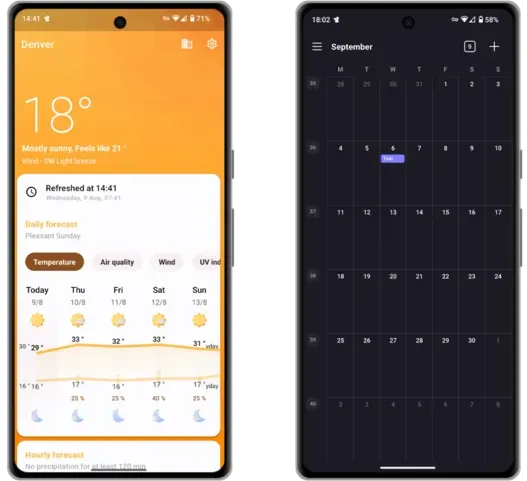

Links: Geometrisch weer, rechts: Protonkalender

### Veiligheid/Privacy

- [Bitwarden](https://mobileapp.bitwarden.com/fdroid/) biedt een gratis en E2EE cross platform wachtwoordmanager oplossing voor al je apparaten. Met hun betaalde service kun je 2FA-codes integreren in de app. De serverkant van Bitwarden kun je zelf hosten en de Android-app is beschikbaar via F-Droid.
- [Proton Pass](https://proton.me/pass/download) biedt een vergelijkbare gratis service als Bitwarden, maar [Proton Unlimited](https://proton.me/pricing) klanten hebben toegang tot extra geavanceerde functies. Proton Pass is beschikbaar via APK of Aurora.
- [FreeOTP](https://f-droid.org/packages/org.fedorahosted.freeotp/) is een tweefactorauthenticatietoepassing voor systemen die gebruikmaken van eenmalige wachtwoordprotocollen. Tokens kunnen eenvoudig worden toegevoegd door een QR-code te scannen. FreeOTP is beschikbaar via F-Droid.
- [Aegis](https://f-droid.org/en/packages/com.beemdevelopment.aegis/) is een gratis, veilige en Open Source app voor Android om je 2-staps verificatie tokens voor je online diensten te beheren. Aegis is beschikbaar via F-Droid.
- [Cryptomator](https://f-droid.org/en/packages/org.cryptomator.lite/) is een betaalde, platformonafhankelijke service die je gegevens lokaal versleutelt zodat je ze veilig kunt uploaden naar je favoriete cloudservice. Cryptomator kan worden gedownload via F-Droid.

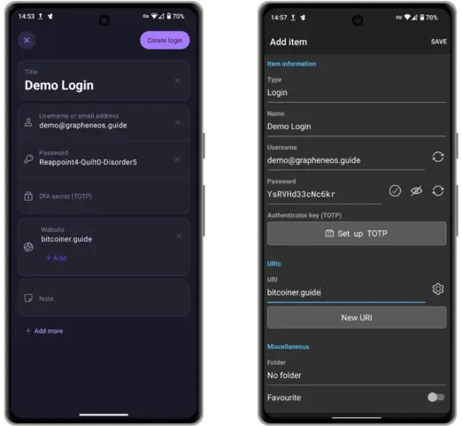

Links: Proton Pass,
rechts: Bitwarden

https://planb.network/tutorials/computer-security/authentication/ente-auth-1928e65a-3b43-40f3-9efd-457ee2d79bb9

https://planb.network/tutorials/computer-security/authentication/bitwarden-0532f569-fb00-4fad-acba-2fcb1bf05de9

https://planb.network/tutorials/computer-security/authentication/aegis-authenticator-22cc4d35-fb46-4e54-8833-bc4b411518bc

https://planb.network/tutorials/computer-security/data/cryptomator-84e52c76-2253-49fe-81da-e05e90c28d0d

### Cloud Oplossingen

- [Proton Drive](https://proton.me/drive/download) is een betaalde E2EE cloud oplossing voor het maken van back-ups en het opslaan van al je bestanden. Op het moment van schrijven hebben ze net een Windows desktop client aangekondigd, maar Mac- en Linux-gebruikers moeten (voorlopig) de webversie blijven gebruiken om te synchroniseren vanaf hun computer. De Android-client is beschikbaar als APK of via Aurora.
- [Skiff](https://skiff.com/download) biedt ook betaalde E2EE cloudopslag en samenwerkingstools voor bestanden. Ze bieden een Mac en Windows desktop client (en ook een web app) en hun Android clients moeten gedownload worden van Aurora.
- [Nextcloud](https://f-droid.org/en/packages/com.nextcloud.client/) biedt een volledig uitgeruste cloudgebaseerde oplossing voor samenwerking, synchronisatie tussen apparaten en bestandsopslag. Meer geavanceerde gebruikers kunnen ervoor kiezen om hun Free en Open Source software zelf te hosten op elke gewenste hardware. De Android clients kunnen gedownload worden via F-Droid.
- [Cryptpad](https://cryptpad.fr/) biedt een gratis, webgebaseerd, E2EE alternatief voor Google Docs.

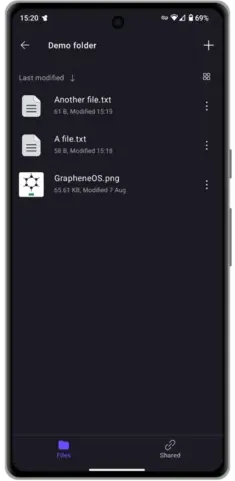

Proton Aandrijving

https://planb.network/tutorials/computer-security/data/proton-drive-03cbe49f-6ddc-491f-8786-bc20d98ebb16

## De nadelen

De Open Source en privacybeschermende alternatieven voor de technische conglomeraatapplicaties die je gewend bent te gebruiken zijn er in overvloed, en sommige zijn vaak beter dan de closed source, spywareverslaafde alternatieven.

Maar als je overstapt op GrapheneOS, zijn er een aantal gemakken die je moet opgeven omdat er geen alternatieven zijn. Deze omvatten:

- **Apple CarPlay/Android Auto** - Je zult het bij ouderwetse Bluetooth, USB of Aux moeten houden.
- **Apple/Google Pay** - Bijna iedereen heeft toch al zijn Wallet bij zich!
- **Bankieren-apps** - Het is niet zo dat deze helemaal niet werken. Sommige werken perfect. Andere werken alleen als Google Play Services is ingeschakeld (lees daar hieronder meer over) en weer andere werken gewoon helemaal niet. Lees het rapport over jouw bank [hier](https://privsec.dev/posts/android/banking-applications-compatibility-with-grapheneos/) om de huidige stand van zaken te zien. Vrees niet als de jouwe op de lijst staat die niet werkt, vergeet niet dat je de URL gewoon kunt opslaan als een webapp op je startscherm.
- **Pushmeldingen** - De meeste applicaties die je updates sturen wanneer je een specifieke app niet gebruikt, doen dit via Google Play Services. Deze zijn niet standaard geïnstalleerd bij GrapheneOS, dus als je merkt dat je niet meteen een melding krijgt als je vriend je een e-mail stuurt, is dit waarschijnlijk de reden. Het goede nieuws is dat sommige van de hierboven genoemde apps hun eigen verbinding op de achtergrond hebben geïmplementeerd om periodiek te controleren op updates en je dan een melding te geven indien nodig

### Sandboxed Google Play

**Houd er rekening mee dat:** GrapheneOS een compatibiliteit Layer heeft die de optie biedt om de officiële releases van Google Play in de standaard app sandbox te installeren en te gebruiken. Google Play krijgt absoluut geen speciale toegang of privileges op GrapheneOS in tegenstelling tot het omzeilen van de app sandbox en het ontvangen van een enorme hoeveelheid zeer bevoorrechte toegang.

Als je merkt dat je gewoon niet kunt leven zonder die pushmeldingen voor je favoriete app of een bepaalde 'must have'-app nutteloos is zonder Play Services, kun je met GrapheneOS deze services [installeren](https://grapheneos.org/usage#sandboxed-google-play-installation) in een volledig sandboxed omgeving. Eenmaal geïnstalleerd hebben deze services geen Google-account nodig om te werken en de rechten van elke service kunnen streng worden gecontroleerd.

Voordat je je haast om deze op dag 1 te installeren, dring ik er bij je op aan om te kijken hoe ver je komt zonder. Je zult waarschijnlijk verbaasd zijn hoeveel apps perfect normaal functioneren zonder.

Als je ze toch wilt installeren, tik je gewoon op de vooraf geïnstalleerde applicatie 'Apps' gevolgd door 'Google Play Services'. Overweeg om ze te installeren naast de minder privé-apps waar je niet zonder kunt, binnen een volledig apart gebruikersprofiel om die extra Layer van afscheiding van de rest van je telefoon te bieden.

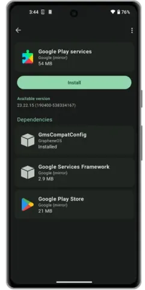

Installatiescherm Play Services

### Profielen

GrapheneOS stelt je in staat om een aparte telefoonervaring te hebben, binnen je telefoon. Extra profielen kunnen hun eigen apps en diensten installeren en hebben geen toegang tot bestanden of gegevens van het account van de eigenaar.

Als je maar een of twee van die must have-apps hebt die Play Services nodig hebben, maar die maar heel zelden worden gebruikt, is het misschien een goed idee om die naast Play Services in een apart profiel te installeren om de minieme privacyimplicaties die overblijven door ze in het gebruikersprofiel te laten draaien, verder te versterken.

Je kunt [hier] meer lezen over deze use case (https://discuss.grapheneos.org/d/168-ideas-for-user-profiles/2).

Als u besluit om een apart profiel toe te voegen voor uw gebruik, kan de app [Insular] (https://f-droid.org/en/packages/com.oasisfeng.island.fdroid/) nuttig voor u zijn. Met Insular kunt u eenvoudig al uw bestaande apps klonen naar het nieuwe profiel zonder dat u de traditionele installatieroutes hoeft te volgen die eerder in deze handleiding zijn beschreven. Met Insular kun je die apps ook snel 'bevriezen' om alle achtergronddiensten van die app volledig uit te schakelen.

Scherm voor gebruikersprofielbeheer

### e-Sims

Als je de privacy van je telefoon naar een hoger niveau wilt tillen en een mobiele dienst wilt hebben die losstaat van je echte identiteit, dan is een eSIM misschien iets voor jou. Een eSIM is een virtuele SIM die je online kunt kopen en aan je telefoon kunt toevoegen via een QR-code. Bedrijven die dergelijke diensten aanbieden die anoniem betaald kunnen worden met Bitcoin zijn onder andere [Silent.Link](https://silent.link/) en [Bitrefill](https://www.bitrefill.com/gb/en/esims/).

eSIM's moeten niet worden gezien als een volledig wondermiddel voor telefoonprivacy. In de juiste handen kunnen ze een nuttig hulpmiddel zijn, maar doe alsjeblieft onderzoek naar de [tradeoffs] (https://grapheneos.org/faq#cellular-tracking) van het gebruik van elk type mobiele service als je van plan bent om volledig 'off grid' te gaan.

Sandboxed Play Services moeten worden geïnstalleerd voor eSIM provisioning in GrapheneOS.

## Back-ups

Nadat je je nieuwe de-Google'd Pixel telefoon hebt ingesteld, is het een goed idee om een back-up te maken. Met deze back-up kun je de telefoon herstellen naar een identieke staat in het geval dat je je telefoon verliest of deze zoekraakt/diefstal pleegt.

Je kunt ervoor kiezen om het back-upbestand op te slaan op een extern opslagmedium of in een zelf gehoste cloudoplossing zoals Nextcloud, hoewel sommige gebruikers melden dat ze met de laatste optie niet altijd even succesvol zijn.

Om uw eerste back-up te maken:

1. Ga naar **Instellingen** > **Systeem** > **Back-up** en schrijf je 12-woordige herstelcode op. Deze code is nodig om het back-upbestand later te ontsleutelen. Als u de code verliest, verliest u de toegang tot de back-up van uw telefoon.

2. Kies vervolgens je opslaglocatie. Ik raad een externe USB-schijf of een microSD-kaart van industriële kwaliteit aan.

3. Kies de gegevens waarvan je een back-up wilt maken. Als je de ruimte hebt op je opgegeven opslagmedium, raad ik aan om alles te selecteren.

4. Tik op de drie puntjes rechtsboven en kies **Backup nu**.

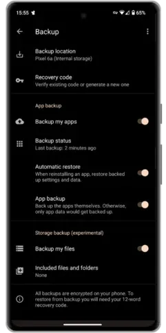

Back-up scherm

Vergeet niet dat als je offline back-ups maakt op externe opslagmedia, het zinvol is om deze stap regelmatig uit te voeren om ervoor te zorgen dat eventuele recente belangrijke updates van je telefoon niet verloren gaan als het ergste zou gebeuren.

Video over het back-upproces

## Conclusie

In de afgelopen jaren is de GrapheneOS software aanzienlijk volwassener geworden. Hij is stabieler en compatibeler dan ooit. Als je dit koppelt aan het bloeiende Open Source en privacybeschermende app-ecosysteem, is GrapheneOS een echt levensvatbaar alternatief voor standaard Android of iOS, zelfs voor 'normale' mensen zoals jij!

Datalekken en sleepnetbewaking zijn in de wereld van vandaag zo gewoon dat ze nauwelijks nog het nieuws halen. Het is aan jou om jezelf te beschermen. Er zullen onderweg aanpassingen en offers moeten worden gemaakt, maar het is lang niet zo moeilijk als je denkt om je blootstelling aan dergelijke inbreuken te verminderen.

Ik hoop dat deze gids je een beetje op weg helpt. Als je deze gids nuttig vond en mijn werk wilt steunen, overweeg dan om een [donatie](/tips) te sturen.

Als je een bestaande GrapheneOS gebruiker bent, of er een wordt als gevolg van deze gids, overweeg dan [doneer](https://grapheneos.org/donate) om hun belangrijke werk te steunen.

### Meer informatie

GrapheneOS is een konijnenhol waar je gemakkelijk weken in kunt duiken. Er is zoveel dat je kunt leren en waar je aan kunt sleutelen om de ervaring aan te passen aan je eisen en dreigingsmodellen. Hieronder vind je een aantal links waar je je reis kunt voortzetten:

- [GrapheneOS officiële handleiding](https://grapheneos.org/usage) - Officiële website
- [GrapheneOS Forum](https://discuss.grapheneos.org/) - Officiële website
- [GrapheneOS Instellingen Masterclass](https://www.youtube.com/watch?app=desktop&v=GLJyD9MJgIQ) - Video door 'The Privacy Wayfinder'
- [GrapheneOS General Podcast](https://www.youtube.com/watch?app=desktop&v=UCPX0mFFRNA) - Podcast door 'Watchman Privacy'

*Deze handleiding is een bewerking van de originele inhoud gepubliceerd door [BitcoinQnA op Bitcoiner.Guide onder MIT-licentie](https://github.com/BitcoinQnA/Bitcoiner.Guide/blob/main/grapheneos.md), aan wie de volledige eer toekomt voor het oorspronkelijke schrijfwerk.*
