___


*このチュートリアルは[IT-Connect](https://www.it-connect.fr/)に掲載されたFlorian BURNEL氏のオリジナルコンテンツに基づいています。ライセンス[CC BY-NC 4.0](https://creativecommons.org/licenses/by-nc/4.0/)。原文に変更が加えられている可能性があります。


___


## Debian12でのGraylogの展開


### I.プレゼンテーション


Graylog はオープンソースの "ログシンク "ソリューションで、マシンやネットワークデバイスのログをリアルタイムで一元化、保存、分析するように設計されています。このチュートリアルでは、無償版の Graylog を Debian 12 マシンにインストールする方法を学びます！


情報システム内では、**Linux**であろうと**Windows**であろうと、それぞれの**サーバー**、そしてそれぞれの**ネットワークデバイス**（スイッチ、ルーター、ファイアウォールなど）は、ローカルに保存された独自のログ**を生成する。各マシンにローカルに保存されたログでは、イベントの分析と相関は非常に困難です。そこで**Graylog**の登場です。Graylogは**ログシンク**として機能し、**すべてのマシンがログを**送信します（例えばsyslog経由で）。Graylogは、これらのログを**保存し、インデックスを作成します。


Graylogは、不審な動作や様々な問題（安定性、パフォーマンスなど）の特定を容易にする分析・監視ツールです。


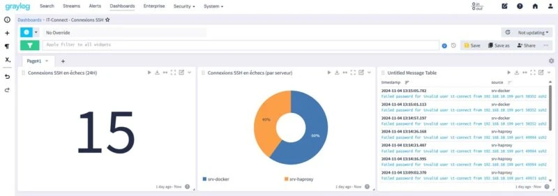


**注：無料版の**Graylog Open**は、WazuhのようなSIEMではない。


### II.前提条件


stack Graylog**は**いくつかのコンポーネント**に基づいており、これらのコンポーネントをインストールして設定する必要があります。ここでは、すべてのコンポーネントを同じサーバーにインストールしますが、複数のノードに基づいてクラスタを作成し、複数のサーバーに役割を分散させることも可能です。このチュートリアルでは、最新のバージョンである**Graylog 6.1**をインストールします。


- MongoDB 7**、Graylogで現在推奨されているバージョン（最小5.0.7、最大7.x）
- OpenSearch**、Amazonが作成したElasticsearchのオープンソースFork（最小1.1.x、最大2.15.x）
- OpenJDK 17**


Graylogサーバー**は**Debian 12**で動作していますが、Docker経由を含め他のディストリビューションへのインストールも可能です。仮想マシンは **8 GB RAM** と **256 GB ディスクスペース** を装備していますが、これはすべてのコンポーネントに十分なリソースを確保するためです（そうしないとパフォーマンスに大きな影響が出る可能性があります）。ただし、**Graylogアーキテクチャのサイジングは処理する情報量に依存する**ため、大まかな目安としています。Graylogは1日に30MBや300MBのデータを処理することも、1日に300GBのデータを処理することもできます。テラバイトのログを処理できる**スケーラブルなソリューション**です（[このページ](https://go2docs.graylog.org/current/planning_your_deployment/planning_your_deployment.html?tocpath=Plan%20Your%20Deployment%7C_____0)を参照）。


提供: グレイログ


設定を開始する前に、Graylogマシンに静的IP Addressを割り当て、最新のアップデートをインストールします。ローカルマシンのタイムゾーンを設定し、日付と時刻の同期用にNTPサーバーを定義してください。実行するコマンドは以下の通りです：


```
sudo timedatectl set-timezone Europe/Paris
```


**注: **Graylog Data Node**を代わりに使用する場合、**OpenSearchのインストールはオプション**です。


### III Graylogのステップバイステップインストール


まずはパッケージのキャッシュを更新し、これからのために必要なツールをインストールすることから始めよう。


```
sudo apt-get update
sudo apt-get install curl lsb-release ca-certificates gnupg2 pwgen
```


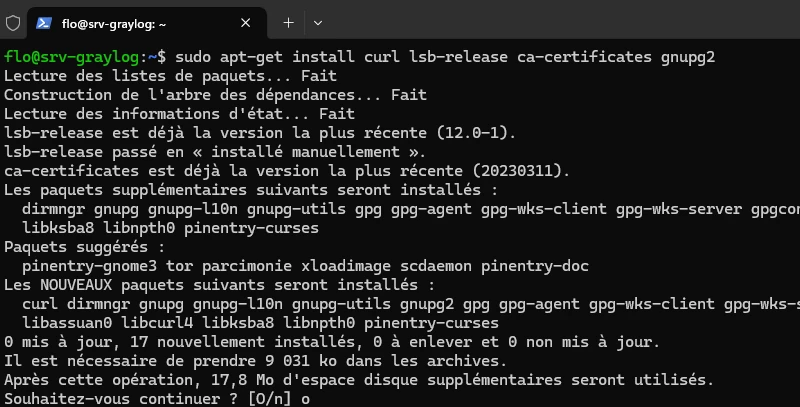


#### A.MongoDBのインストール


これが終わったら、MongoDBのインストールを開始する。MongoDBリポジトリに対応するGPGキーをダウンロードする：


```
curl -fsSL https://www.mongodb.org/static/pgp/server-6.0.asc | sudo gpg -o /usr/share/keyrings/mongodb-server-6.0.gpg --dearmor
```


次に、Debian 12マシンにMongoDB 6リポジトリを追加する：


```
echo "deb [ signed-by=/usr/share/keyrings/mongodb-server-6.0.gpg] http://repo.mongodb.org/apt/debian bullseye/mongodb-org/6.0 main" | sudo tee /etc/apt/sources.list.d/mongodb-org-6.0.list
```


次に、パッケージキャッシュを更新し、MongoDBをインストールしようとする：


```
sudo apt-get update
sudo apt-get install -y mongodb-org
```


依存関係が見つからないため、MongoDBをインストールできません： **libssl1.1**です。Debian 12にはこのパッケージがリポジトリにないので、先に進む前に手動でインストールする必要がある。


```
Les paquets suivants contiennent des dépendances non satisfaites :
mongodb-org-mongos: Dépend: libssl1.1 (>= 1.1.1) mais il n'est pas installable
mongodb-org-server: Dépend: libssl1.1 (>= 1.1.1) mais il n'est pas installable
E: Impossible de corriger les problèmes, des paquets défectueux sont en mode « garder en l'état ».
```


libssl1.1_1.1f-1ubuntu2.23_amd64.deb**」（最新バージョン）というDEBパッケージを**wget**コマンドでダウンロードし、**dpkg**コマンドでインストールする。これにより、以下の2つのコマンドが生成される：


```
wget http://archive.ubuntu.com/ubuntu/pool/main/o/openssl/libssl1.1_1.1.1f-1ubuntu2.23_amd64.deb
sudo dpkg -i libssl1.1_1.1.1f-1ubuntu2.23_amd64.deb
```


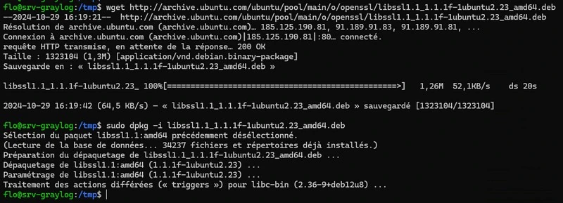


MongoDBのインストールを再起動します：


```
sudo apt-get install -y mongodb-org
```


それから MongoDB サービスを再起動し、Debian サーバーの起動時に自動的に起動するようにします。


```
sudo systemctl daemon-reload
sudo systemctl enable mongod.service
sudo systemctl restart mongod.service
sudo systemctl --type=service --state=active | grep mongod
```


MongoDBがインストールできたら、次のコンポーネントのインストールに移ろう。


#### B.OpenSearchのインストール


サーバへの OpenSearch のインストールに移りましょう。以下のコマンドで、OpenSearch パッケージの署名キーを追加します：


```
curl -o- https://artifacts.opensearch.org/publickeys/opensearch.pgp | sudo gpg --dearmor --batch --yes -o /usr/share/keyrings/opensearch-keyring
```


その後、OpenSearchリポジトリを追加して、**apt**でパッケージをダウンロードできるようにする：


```
echo "deb [signed-by=/usr/share/keyrings/opensearch-keyring] https://artifacts.opensearch.org/releases/bundle/opensearch/2.x/apt stable main" | sudo tee /etc/apt/sources.list.d/opensearch-2.x.list
```


パッケージキャッシュを更新する：


```
sudo apt-get update
```


次に、インスタンスの Admin** アカウントのデフォルト・パスワードを定義するように注意しながら、**OpenSearch** をインストールします。ここでは、パスワードは "**IT-Connect2024!**" となっていますが、この値を強力なパスワードに置き換えてください。 **P@ssword123**」のような弱いパスワード**は避け、各タイプ（小文字、大文字、数字、特殊文字）を少なくとも1文字ずつ含む、少なくとも**8文字**のパスワードを使用してください。 **OpenSearch 2.12.** 以降の前提条件です。


```
sudo env OPENSEARCH_INITIAL_ADMIN_PASSWORD=IT-Connect2024! apt-get install opensearch
```


インストール中はしばらくお待ちください。


設定が終わったら、最小限の設定を行います。YAMLフォーマットの設定ファイルを開きます：


```
sudo nano /etc/opensearch/opensearch.yml
```


ファイルを開いたら、以下のオプションを設定する：


```
cluster.name: graylog
node.name: ${HOSTNAME}
path.data: /var/lib/opensearch
path.logs: /var/log/opensearch
discovery.type: single-node
network.host: 127.0.0.1
action.auto_create_index: false
plugins.security.disabled: true
```


この OpenSearch の設定は、1つのノードをセットアップするためのものです。ここでは、使用するさまざまなパラメータについて説明します：


- cluster.name: graylog**: このパラメータは OpenSearch クラスタを "**graylog**" という名前で指定します。
- node.name: ${HOSTNAME}**: ノード名は、ローカルのLinuxマシンと一致するように動的に設定される。ノードが1つしかなくても、正しく名前を付けることが重要です。
- path.data：/var/lib/opensearch**：このパスは OpenSearch がローカルマシンのどこにデータを保存するかを指定します。
- path.logs：/var/log/opensearch**: このパスは OpenSearch のログファイルが保存される場所を定義します。
- discovery.type: single-node**: このパラメータはOpenSearchを単一のノードで動作するように設定します。
- network.host：127.0.0.1**：この設定によって、OpenSearchはInterfaceのローカル・ループだけをリスンするようになります。
- action.auto_create_index: false**: インデックスの自動作成を無効にすることで、既存のインデックスがない状態でドキュメントが送信されても、OpenSearch は自動的にインデックスを作成しません。
- plugins.security.disabled:true**：このオプションはOpenSearchセキュリティプラグインを無効にします。この設定はGraylogのセットアップの時間を節約しますが、本番環境では避けるべきです ([このページ](https://opensearch.org/docs/1.0/security-plugin/index/) を参照してください)。


いくつかのオプションはすでに存在しているので、それらを有効にするために「#」を削除し、値を示すだけでよい。オプションが見つからない場合は、ファイルの最後で直接宣言することができる。


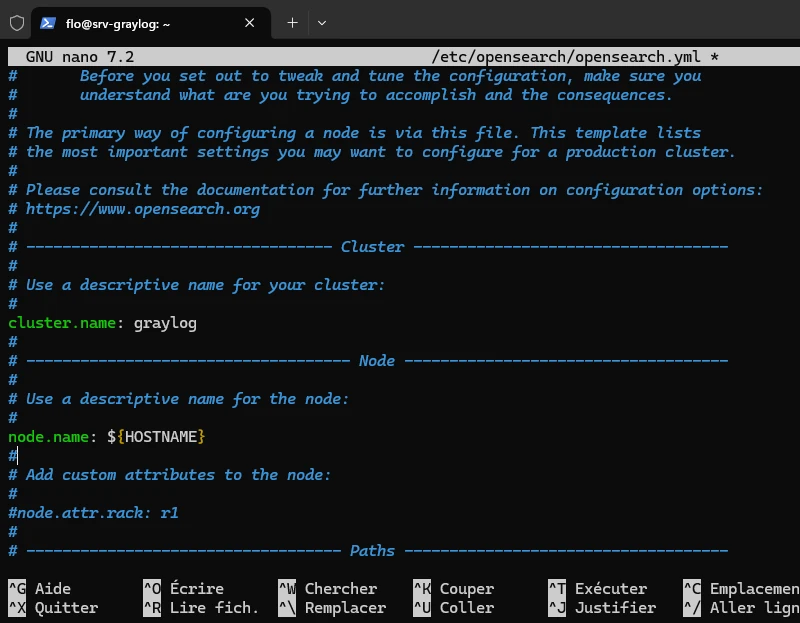


このファイルを保存して閉じる。


#### C.Java（JVM）の設定


このサービスが使用できるメモリの量を調整するために、OpenSearch が使用する Java 仮想マシンを設定する必要があります。以下の設定ファイルを編集します：


```
sudo nano /etc/opensearch/jvm.options
```


この構成では、**OpenSearch は 4 GB の割り当てメモリーで開始し、最大 4 GB まで増設できます**。ここでは、仮想マシンに合計 **8 GB RAM** があることを考慮した構成になっています。両方のパラメータは同じ値でなければなりません。つまり、：


```
-Xms1g
-Xmx1g
```


このセリフで：


```
-Xms4g
-Xmx4g
```


修正する部分のイメージは以下の通り：


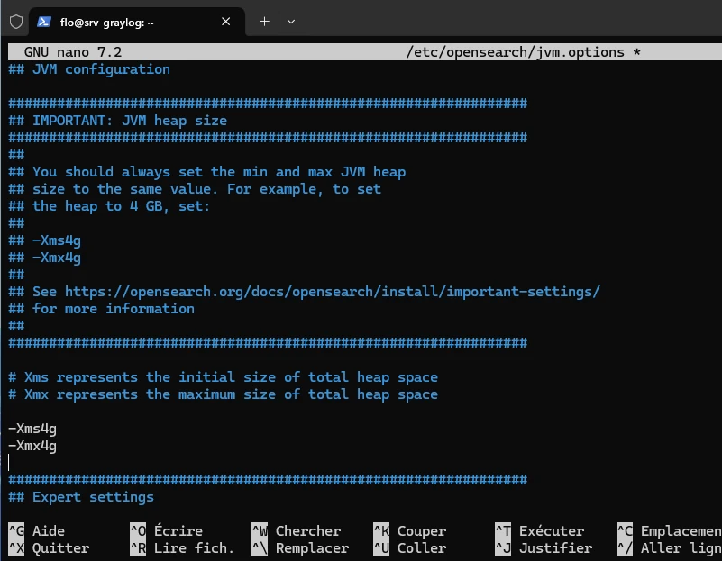


保存後、このファイルを閉じる。


さらに、Linuxカーネルの "**max_map_count**"パラメーターの設定をチェックする必要がある。これは、アプリケーションのニーズを満たすために、プロセスごとにマッピングされるメモリ領域の上限を定義するものです。 *Elasticsearch**のように、**OpenSearch**では、メモリ管理エラーを避けるために、この値を "262144 "に設定することを推奨しています。


原則として、インストールしたばかりのDebian 12マシンでは、この値はすでに正しい。しかし、確認してみよう。次のコマンドを実行する：


```
cat /proc/sys/vm/max_map_count
```


もし "**262144**"以外の値が表示された場合は、以下のコマンドを実行してください。


```
sudo sysctl -w vm.max_map_count=262144
```


最後に、OpenSearch の自動起動を有効にして、関連するサービスを起動します。


```
sudo systemctl daemon-reload
sudo systemctl enable opensearch
sudo systemctl restart opensearch
```


システムのステータスを表示すると、4GBのRAMを持つJavaプロセスが表示されるはずだ。


```
top
```


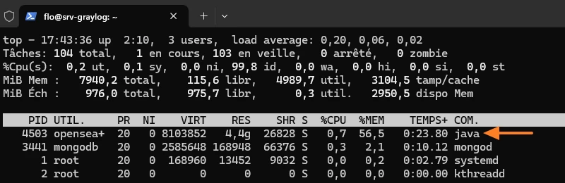


次のステップは、待ちに待ったGraylogのインストールだ！


#### D.Graylogのインストール


最新版のGraylog 6.1**をインストールするには、以下の4つのコマンドを実行して、Graylog Server**をダウンロードしてインストールします：


```
wget https://packages.graylog2.org/repo/packages/graylog-6.1-repository_latest.deb
sudo dpkg -i graylog-6.1-repository_latest.deb
sudo apt-get update
sudo apt-get install graylog-server
```


これが終わったら、Graylogを起動させる前に、Graylogの設定に変更を加える必要がある。


まずはこの2つのオプションを設定しよう：


- password_secret**：このパラメータは、Graylogがユーザーのパスワードを安全に保存するために使用するキーを定義するために使用されます（saltキーの精神）。このキーは**一意で**ランダムでなければなりません。
- root_password_sha2**: このパラメータはGraylogのデフォルトの管理者パスワードに対応する。Hash SHA-256として保存されます。


まず、**password_secret**パラメーター用に96文字のキーを生成することから始めよう：


```
pwgen -N 1 -s 96
wVSGYwOmwBIDmtQvGzSuBevWoXe0MWpNWCzhorBfvMMhia2zIjHguTbfl4uXZJdHOA0EEb1sOXJTZKINhIIBm3V57vwfQV59
```


返された値をコピーし、Graylog設定ファイルを開く：


```
sudo nano /etc/graylog/server/server.conf
```


以下のように、**password_secret**パラメーターにキーを貼り付ける：


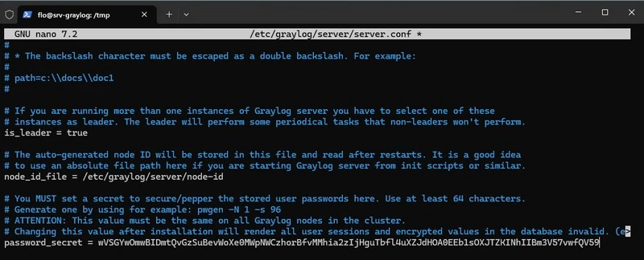


ファイルを保存して閉じる。


次に、デフォルトで作成される "**admin**"アカウントのパスワードを設定する必要がある。設定ファイルには、パスワードのHashが保存されていなければならない。以下の例では、パスワード "**LogsWells@**"のHashが示されています。


```
echo -n "PuitsDeLogs@" | shasum -a 256
6b297230efaa2905c9a746fb33a628f4d7aba4fa9d5c1b3daa6846c68e602d71
```


得られた値を出力としてコピーする（行末のハイフンを除く）。


Graylog設定ファイルをもう一度開く：


```
sudo nano /etc/graylog/server/server.conf
```


この値を**root_password_sha2**オプションに次のように貼り付ける：


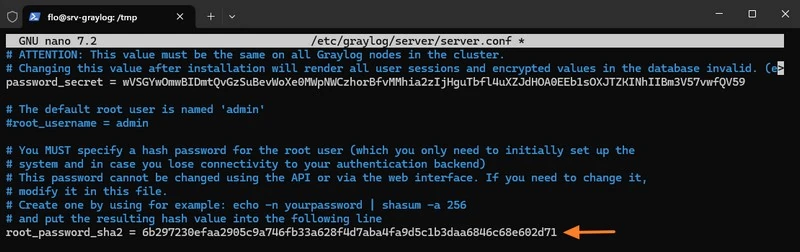


設定ファイルの「**http_bind_address**」オプションを設定します。0.0.0.0:9000**」を指定すると、GraylogのInterfaceのウェブは、任意のサーバーIP Addressを経由して、ポート**9000**でアクセスできるようになります。


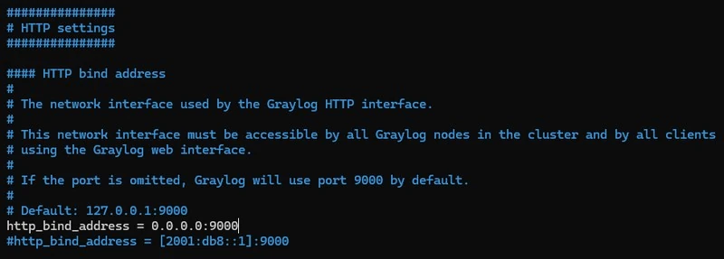


それから "**elasticsearch_hosts**" オプションを `http://127.0.0.1:9200` に設定して、ローカルの OpenSearch インスタンスを宣言します。これは **Graylog Data Node** を使っていないので必要です。このオプションがないと、これ以上先に進めません。


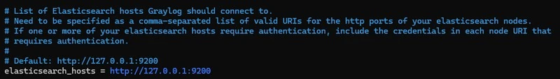


ファイルを保存して閉じる。


このコマンドはGraylogをアクティブにし、次のブート時に自動的に起動するようにし、すぐにGraylogサーバーを起動する。


```
sudo systemctl enable --now graylog-server
```


これが完了したら、ブラウザからGraylogに接続してみてください。サーバーのIP Address（または名前）とポート9000を入力してください。


**ご参考までに


少し前までは、Graylogに初めてログオンすると、下のような認証ウィンドウが表示されました。ログイン名「**admin**」とパスワードを入力しなければならなかった。そして、接続がうまくいかないことに不愉快な驚きを感じたものだ。


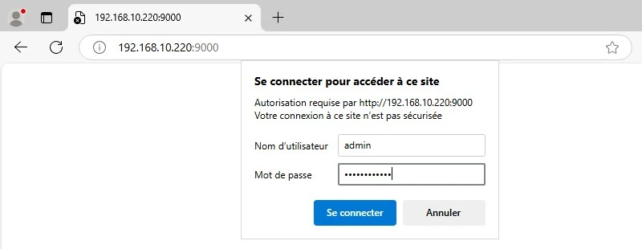


Graylogサーバーのコマンドラインに戻り、ログを参照する必要があった。その結果、**最初の接続**には、ログで指定された一時的なパスワード**を使用する必要があることがわかった。


```
tail -f /var/log/graylog-server/server.log
```


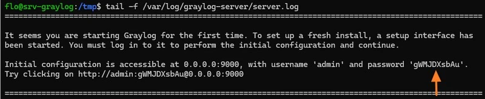


その後、ユーザー "**admin**"と仮パスワードで接続を再試行し、ログインが可能になった！


**このようなことはもうありません。管理者アカウントとコマンドラインで設定したパスワードでログインするだけです。


**グレイログのInterfaceへようこそ！


#### E.Graylog：新しい管理者アカウントの作成


Graylogでネイティブに作成された管理者アカウントを使用するのではなく、あなた自身の個人的な管理者アカウントを作成することができます。システム**"メニューから "**ユーザーとチーム**"をクリックし、"**ユーザーを作成**"ボタンをクリックしてください。その後、フォームに必要事項を入力し、アカウントに管理者ロールを割り当てます。


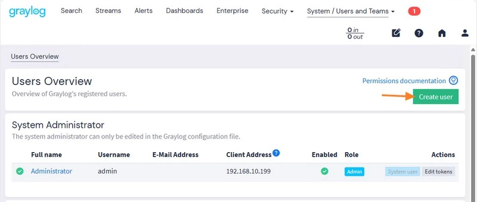


パーソナライズされたアカウントには、ネイティブの管理者アカウントとは異なり、姓名や電子メールAddressなどの追加情報を含めることができます。さらに、各自が指名されたアカウントで作業することで、より良いトレーサビリティが保証される。


## rsyslogでGraylogにログを送信する


### I.プレゼンテーション


この第2部では、Graylogサーバーにログを送るようにLinuxマシンを設定する方法を学ぶ。これを行うには、システムにRsyslogをインストールして設定する。


### II.Linuxログを受信するためのGraylogの設定


Graylogの設定から始めます。3つのステップがあります：


- LinuxマシンがUDP**経由でSyslogログを送信するためのエントリーポイントを作成するための**インプット**の作成。
- 新しい**インデックス**の作成は、すべてのLinuxログ**を格納し、**インデックス**を作成する。
- Graylogが受信したログを新しいLinuxインデックスに**ルーティング**するための**Stream**の作成。


#### A.Syslogの入力を作成する


Graylog Interfaceにログオンし、メニューの "**System**"をクリックし、"**Inputs**"をクリックします。ドロップダウンリストで "**Syslog UDP**"を選択し、"**Launch new input**"ボタンをクリックします。TCPシスログ入力を作成することも可能ですが、その場合はTLS証明書を使用する必要があります。


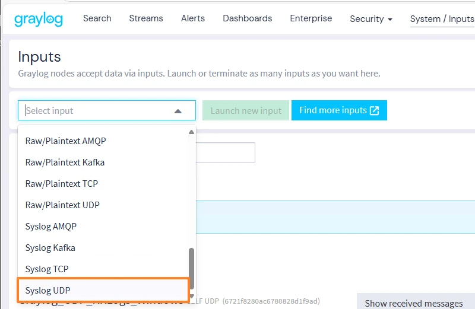


ウィザードが画面に表示されます。この入力に名前を付け、例えば "**Graylog_UDP_Rsyslog_Linux**"とポートを選択します。デフォルトでは、ポートは "**514**"ですが、カスタマイズすることもできます。ここでは、ポート "**12514**"が選択されている。


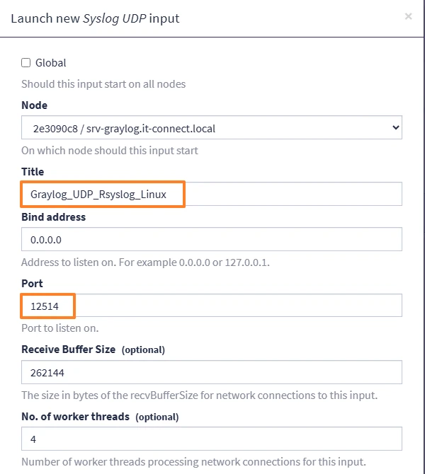


また、"**Store full message**" オプションをチェックすることで、ログメッセージ全体を Graylog に保存することができます。入力開始**」をクリックしてください。


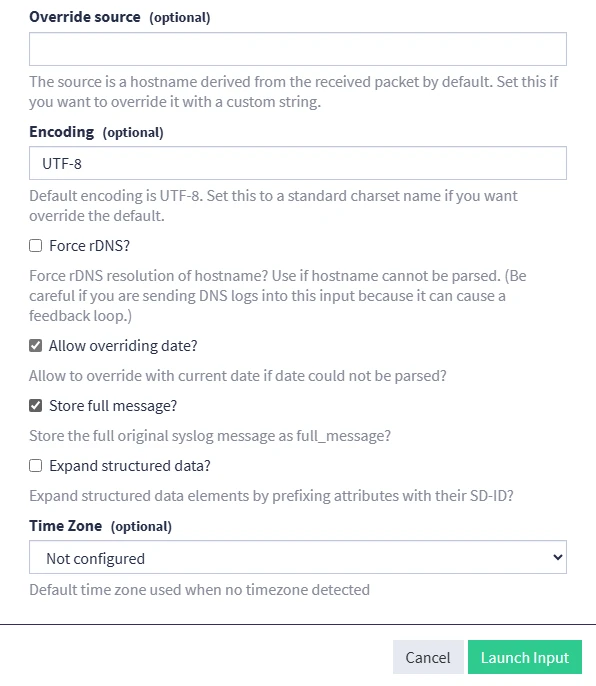


新しい入力が作成され、アクティブになりました。Graylogはポート12514/UDPでSyslogログを受信できるようになりましたが、アプリケーションの設定はまだ終わっていません。


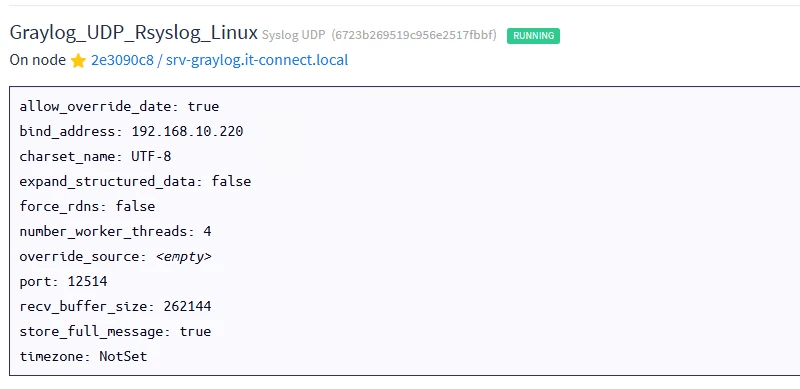


**注：1つのInputで複数のLinuxマシンのログを保存できる。


#### B.新しいLinuxインデックスを作成する


Linuxマシンからのログを保存するために、Graylogにインデックスを作成する必要がある。Graylogの**インデックス**は、受信したログ、つまり受信したメッセージを格納するストレージ構造です。GraylogはストレージエンジンとしてOpenSearchを使用しており、メッセージは高速で効率的な検索ができるようにインデックス化されています。


Graylogからメニューの "**System**"をクリックし、次に "**Indices**"をクリックする。表示された新しいページで、「**インデックスセットを作成**」をクリックします。


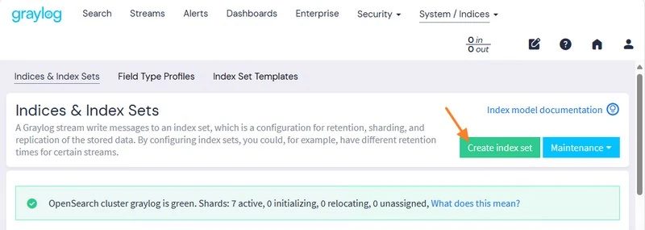


このインデックスに、例えば "**Linuxインデックス**"のように名前を付け、説明と接頭辞を付けてから確定する。ここでは、すべてのLinuxログをこのインデックス**に格納します。また、特定のログのみを保存する特定のインデックスを作成することも可能です（[SSH]ログのみ（https://www.it-connect.fr/cours/comprendre-et-maitriser-ssh/ "SSH"）、ウェブサービスログなど）。


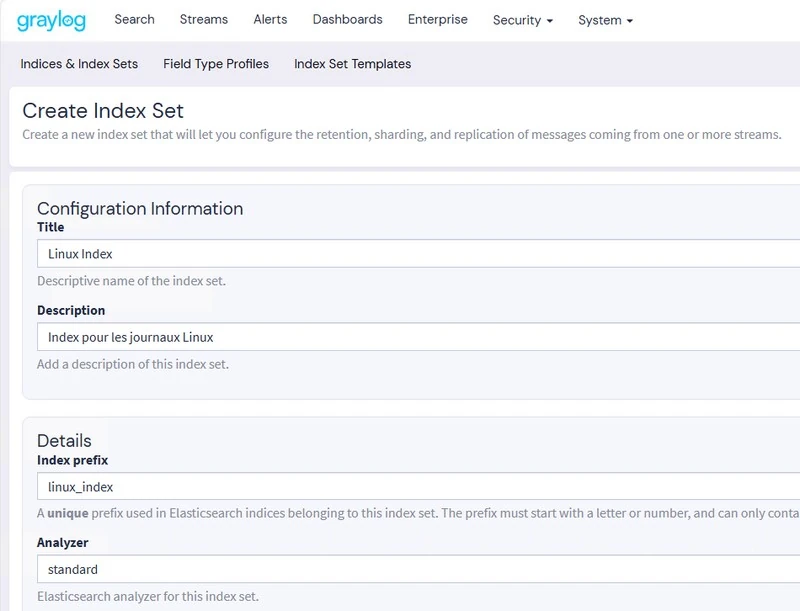


ここで、このインデックスにメッセージをルーティングするための新しいストリームを作成する必要がある。


#### C.ストリームを作成する


新しいストリームを作成するには、Graylogのメインメニューにある「**ストリーム**」をクリックします。次に右側の "**Create stream**"ボタンをクリックします。表示されたウインドウで、ストリーム名を例えば "**Linux Stream**"とし、"**Index Set**"というフィールドに "**Linux Index**"というインデックスを選択します。選択を確認する。


**注意: "**Remove matches from 'Default Stream'**"オプションをチェックしない限り、このストリームに対応するメッセージは "**Default Stream**"にも含まれます。


次に、steamの設定で、"**Add stream rule**"ボタンをクリックして、新しいメッセージルーティングルールを追加します。このウィンドウが見つからない場合は、メニューの "**Streams**"をクリックし、ストリームに対応する行の "**More**"、"**Manage Rules**"の順にクリックしてください。


"**マッチインプット**"タイプを選択し、以前に作成した**UDP**の**Rsyslogインプットを選択します。Create Rule**」ボタンで確認する。これで、新しいInputへのすべてのメッセージがLinux用のIndexに送られるようになります。


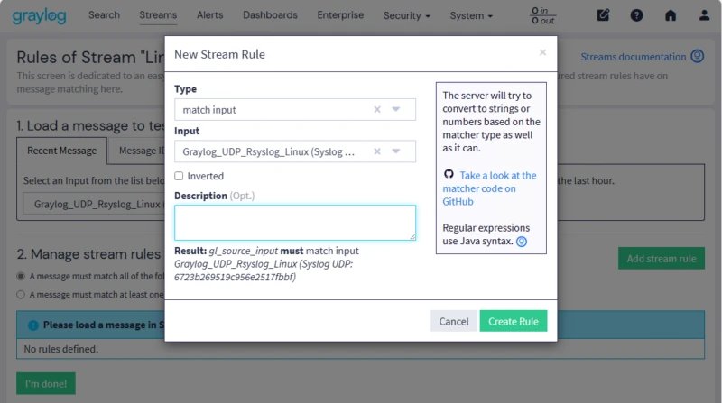


新しいストリームがリストに表示され、"**Running**" 状態になっているはずです。メッセージ帯域幅は "**0 msg/s**" と表示されます。これは、現在Rsyslog UDP入力にログを送信していないためです。ストリームのログを表示するには、その名前をクリックします。


**Graylog側の準備はすべて整った**。次のステップはLinuxマシンの設定です。


### III.Linux上でのRsyslogのインストールと設定


ローカルまたはリモートでLinuxマシンにログオンし、（sudoで）権限を昇格できるユーザー・アカウントを使用する。そうでない場合は、「root」アカウントを直接使用する。


#### A.Rsyslogパッケージのインストール


パッケージキャッシュを更新し、"**rsyslog**"というパッケージをインストールすることから始める。


```
sudo apt-get update
sudo apt-get install rsyslog
```


それからサービスのステータスをチェックする。ほとんどの場合、すでに実行されています。


```
sudo systemctl status rsyslog
```


#### B.Rsyslogの設定


Rsyslogのメイン設定ファイルはここにある：


```
/etc/rsyslog.conf
```


さらに、"**/etc/rsyslog.d/**"ディレクトリは、Rsyslogの追加設定ファ イルを格納するために使用される。メイン設定ファイルには、このディレクトリにあるすべての「**.conf**」ファイルをインポートするインクルード指令がある。これにより、メイン・ファイルを変更することなく、Rsyslogを設定するための追加ファイルを持つことができます。


このディレクトリでは、ファイルはアルファベット順に読み込まれるため、読み込み順序を定義するために数字を使用する必要があります。数字の接頭辞を追加することで、複数の設定ファイル間の優先順位を管理することができます。ここでは、追加ファイルは1つだけなので問題ない。


このディレクトリに "**10-graylog.conf**"というファイルを作成する：


```
sudo nano /etc/rsyslog.d/10-graylog.conf
```


このファイルに次の行を挿入する：


```
*.* @192.168.10.220:12514;RSYSLOG_SyslogProtocol23Format
```


このセリフの解釈はこうだ：


- .*`：LinuxマシンからのすべてのSyslogログをGraylogに送ることを意味する。
- `@`: トランスポートがUDPで行われることを示す。TCPに切り替えるには "**@@**"を指定する必要がある。
- 192.168.10.220:12514`：GraylogサーバーのAddressと、ログを送信するポート（Inputに対応）を示す。
- RSYSLOG_SyslogProtocol23Format`：Graylogに送信するメッセージのフォーマットに対応する。


完了したら、ファイルを保存し、Rsyslogを再起動する。


```
sudo systemctl restart rsyslog.service
```


この操作の後、最初のメッセージがGraylogサーバーに届くはずです！


### IV.GraylogでLinuxログを表示する


Graylogから「**Streams**」をクリックし、新しいストリームを選択すると、関連するメッセージを見ることができます。また、「**検索**」をクリックし、Steamを選択して検索を開始することもできます。


Interfaceの主な特徴は以下の通り：


**1** - メッセージを表示する期間を選択します。デフォルトでは過去5分間のメッセージが表示されます。


**2** - 表示するストリームを選択します。


**3** - メッセージリストの自動更新を有効にする（例えば5秒ごと）。そうでなければ、静的で、手動で更新する必要があります。


**4** - 期間、ストリーム、フィルターを変更した後、虫眼鏡をクリックして検索を開始する。


**5** - 検索フィルターを指定する入力バー。ここでは、"**source:srv-docker**"を指定して、Rsyslogをセットアップした新しいマシンのログだけを表示する。


ログはLinuxマシンから送信される：


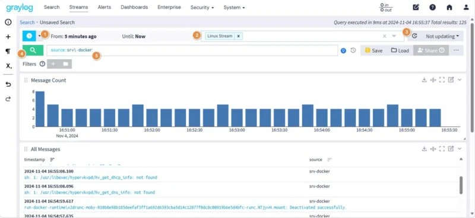


### V.SSH接続の失敗を特定する


Graylogの強みは、ログをインデックス化し、さまざまな条件（ソース・マシン、Timestamp、メッセージの内容など）に従って検索できる点にある。失敗したSSH接続を特定することもできる。


リモートマシン（例えばGraylogサーバー）から、Rsyslogを設定したLinuxサーバーに接続してみてください。例えば


```
ssh [email protected]
```


そして、**generate接続エラー**を起こすために、**ユーザー名**と**パスワード**を故意に間違って入力します。これは、「**/var/log/auth.log**」ファイルに、以下のようなgenerateログメッセージを記録します：


```
Failed password for invalid user it-connect from 192.168.10.199 port 50352 ssh2
```


これらのメッセージはGraylogに掲載されているはずだ。


Graylogでは、以下の検索フィルターを使用して、一致するメッセージのみを表示します：


```
message:Failed password AND application_name:sshd
```


複数のサーバーがあり、特定のサーバーのログを分析したい場合は、：


```
message:Failed password AND application_name:sshd AND source:srv\-docker
```


時間帯を変えて何度か接続エラーを起こしたマシンでの結果の概要である：


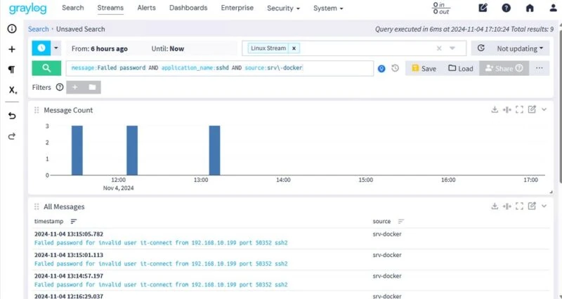


失敗した接続試行は、IP Address "**192.168.10.199**"のマシンから行われます。このホストのアクティビティをもっと知りたい場合は、**このIP Address**を検索することができます。Graylogは、このIP Addressが参照されているすべてのログを、すべてのホスト（ログ送信が設定されている）で出力します。


この場合、使用するフィルターは：


```
message:"192.168.10.199"
```


SSHアプリケーションでフィルターをかけていないのだから、驚くことではない）：


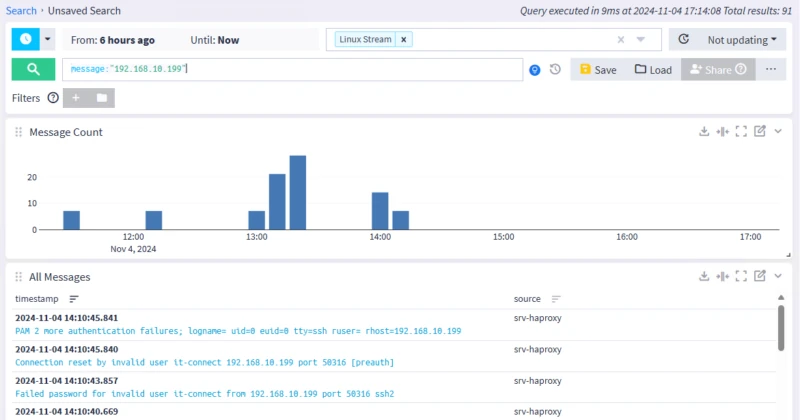


### VI.結論


このチュートリアルに従えば、LinuxマシンのログをGraylogサーバーに送るように設定できるはずです。このようにして、Linuxホストのログをログシンクに集中させることができます！


さらに進めるには、ダッシュボードやアラートを作成し、異常が検出されたときに通知を受け取ることを検討する。


