Jami - это бесплатная программа обмена сообщениями с открытым исходным кодом, имеющая долгую историю и широкий набор функций. Ее история началась в декабре 2004 года, когда монреальская компания *Savoir-faire Linux* запустила SFLPhone, проект цифровой телефонии для бизнеса, полностью основанный на технологиях с открытым исходным кодом. Программное обеспечение, соответствующее телекоммуникационным стандартам (SIP и IAX), отличалось способностью обрабатывать большое количество линий и звонков.


В 2015 году SFLPhone был переименован в Ring и интегрировал распределенную архитектуру, больше не требующую центрального сервера. В следующем году Ring официально присоединился к проекту GNU, укрепив свои позиции в экосистеме свободного программного обеспечения. Наконец, в декабре 2018 года, чтобы избежать путаницы с коммерческими продуктами, использующими английский термин "*Ring*", программа приняла свое нынешнее название: Jami. С тех пор оно продолжает развиваться как свободная, децентрализованная и дружественная к конфиденциальности коммуникационная платформа.


Сегодня Jami доступна на многих системах. Она известна своей производительностью, плавностью и простотой использования. Оно позволяет общаться с помощью мгновенных сообщений, аудио- и видеозвонков, обеспечивая при этом конфиденциальность разговоров благодаря сквозному шифрованию. Простая установка и множество функций делают его полноценным коммуникационным приложением, которым легко и удобно пользоваться каждый день.


| Application          | E2EE 1:1       | E2EE groupes   | Inscription anonyme | Licence client open-source | Licence serveur open-source | Serveur décentralisé | Année de création |
| -------------------- | -------------- | -------------- | ------------------- | -------------------------- | --------------------------- | -------------------- | ----------------- |
| WhatsApp             | ✅              | ✅              | ❌                   | ❌                          | ❌                           | ❌                    | 2009              |
| WeChat               | ❌              | ❌              | ❌                   | ❌                          | ❌                           | ❌                    | 2011              |
| Facebook Messenger   | ✅              | 🟡 (optionnel) | ❌                   | ❌                          | ❌                           | ❌                    | 2011              |
| Telegram             | 🟡 (optionnel) | ❌              | 🟡                  | ✅                          | ❌                           | ❌                    | 2013              |
| LINE                 | ✅              | ✅              | ❌                   | ❌                          | ❌                           | ❌                    | 2011              |
| Signal               | ✅              | ✅              | ❌                   | ✅                          | ✅                           | ❌                    | 2014              |
| Threema              | ✅              | ✅              | ✅                   | ✅                          | ❌                           | ❌                    | 2012              |
| Element (Matrix)     | ✅              | ✅              | ✅                   | ✅                          | ✅                           | 🟡 (fédéré)          | 2016              |
| Delta Chat           | ✅              | ✅              | ✅                   | ✅                          | N/A                         | 🟡 (via email)       | 2017              |
| Conversations (XMPP) | ✅              | ✅              | ✅                   | ✅                          | ✅                           | 🟡 (fédéré)          | 2014              |
| Session              | ✅              | ✅              | ✅                   | ✅                          | ✅                           | ✅                    | 2020              |
| SimpleX              | ✅              | ✅              | ✅                   | ✅                          | ✅                           | ✅                    | 2021              |
| Olvid                | ✅              | ✅              | ✅                   | ✅                          | ❌                           | 🟡(pas d'annuaire)   | 2019              |
| Keet                 | ✅              | ✅              | ✅                   | ❌                          | N/A                         | ✅                    | 2022              |
| **Jami**                 | ✅              | ✅              | ✅                   | ✅                          | N/A                         | ✅                    | 2005              |
| Briar                | ✅              | ✅              | ✅                   | ✅                          | N/A                         | ✅                    | 2018              |
| Tox              | ✅              | ✅              | ✅                   | ✅                          | N/A                         | ✅                    | 2013              |

*E2EE = сквозное шифрование*


## Почему стоит использовать Jami?


- Он с открытым исходным кодом и абсолютно бесплатный**, поэтому вы можете использовать его бесплатно.
- Полный набор полезных функций**: это программное обеспечение позволяет вам воспользоваться многочисленными опциями благодаря возможности легко добавлять плагины из магазина. Можно даже создавать собственные расширения для функций, более подходящих для ваших нужд.
- Простота использования и интуитивность Interface**: несмотря на множество функций, которыми обладает Jami, с ним очень легко разобраться.
- Надежная защита**: Jami использует передовой алгоритм шифрования, который гарантирует безопасность ваших сообщений, уважая при этом вашу конфиденциальность.
- Высокая доступность и скорость**: обеспечивает легкую связь даже при ограниченной пропускной способности, что повышает удобство использования.


## Как установить Jami?


Прежде чем перейти к установке Jami, важно отметить, что приложение доступно для разных операционных систем. Поэтому его установка будет зависеть от используемой вами системы.


### Для пользователей Android или iOS


Приложение доступно прямо из App Store или Play Store. Просто найдите его в строке поиска, а затем запустите установку.


### Для пользователей Windows или macOS


Чтобы установить Jami на свое устройство, вам сначала нужно посетить официальный сайт Jami. По умолчанию на сайте отображается программа, соответствующая операционной системе вашего устройства, и вы можете нажать на кнопку загрузки, чтобы запустить ее. Однако вы также можете загрузить исполняемый файл для Windows прямо со страницы [download page](https://jami.net/download-jami-windows/).


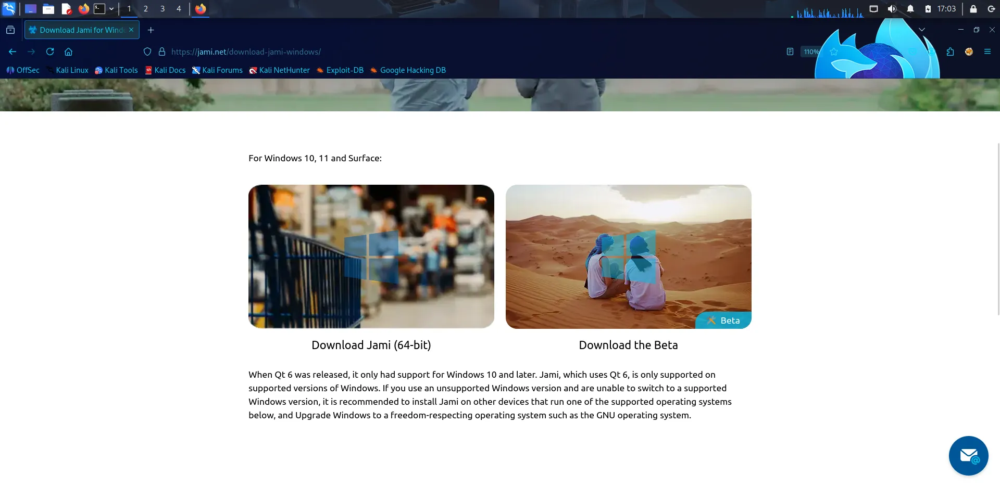


Для пользователей macOS файл также доступен на [странице загрузки macOS](https://jami.net/download-jami-macos/).


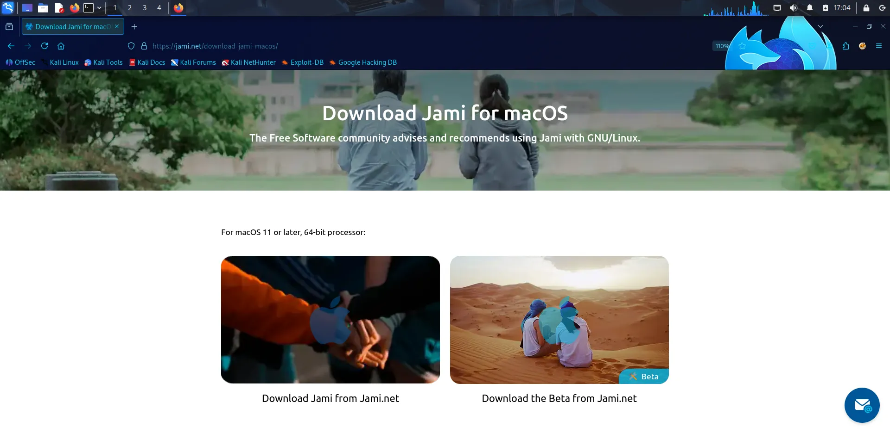


После загрузки исполняемого файла запустите процесс установки, дважды щелкнув на нем. Примите условия использования, затем запустите установку и дождитесь ее завершения.


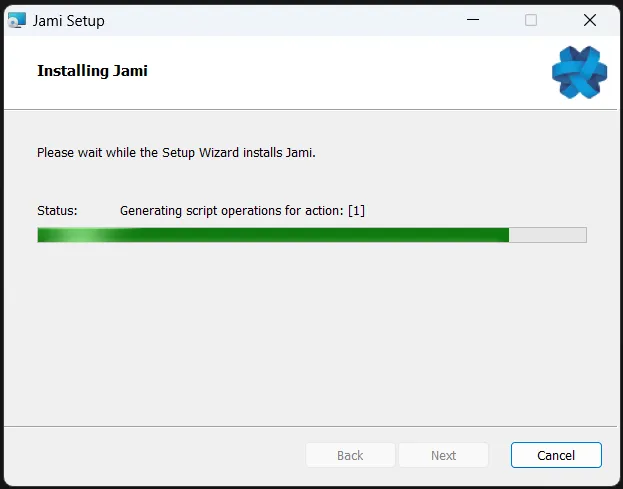


### Для пользователей linux


Для установки Jami в Linux лучше всего использовать командную строку. Важно отметить, что Jami доступна для разных дистрибутивов Linux. Прежде чем приступить к установке Jami, убедитесь, что вы выбрали подходящий дистрибутив для своей системы.


Выбрав дистрибутив, вы можете установить систему. Вам нужно будет установить зависимости, необходимые для запуска Jami на вашей ОС Linux. Команды доступны непосредственно на [этой странице](https://jami.net/download-jami-linux/).


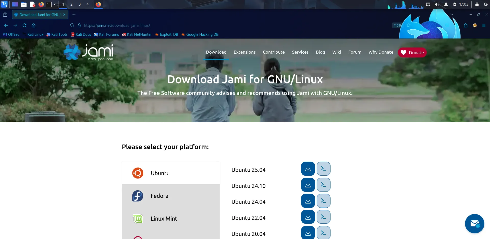


Чтобы установить Jami на **Ubuntu**, вы можете сделать это следующим образом:


```shell
sudo apt install gnupg dirmngr ca-certificates curl --no-install-recommends
```


Эта команда устанавливает инструменты, необходимые для управления ключами GPG (gnupg и dirmngr), сертификатами SSL (ca-certificates) и инструментом загрузки curl.


https://planb.network/tutorials/computer-security/operating-system/ubuntu-78a3be56-5d51-4ec3-8629-0dd27c352ab5

```shell
curl -s https://dl.jami.net/public-key.gpg | sudo tee /usr/share/keyrings/jami-archive-keyring.gpg > /dev/null
```


Здесь curl используется для загрузки открытого ключа GPG Джами. Перенаправление на /dev/null позволяет избежать отображения необработанного ключа на экране.


```shell
sudo sh -c "echo 'deb [signed-by=/usr/share/keyrings/jami-archive-keyring.gpg] https://dl.jami.net/stable/ubuntu_25.04/ jami main' > /etc/apt/sources.list.d/jami.list"
```


Эта команда добавляет официальный репозиторий Jami в список источников APT.


```shell
sudo apt-get update && sudo apt-get install jami
```


Наконец, обновите список доступных пакетов с помощью `apt-get update`, а затем установите Jami прямо из официального репозитория с помощью `apt-get install jami`.


## Базовая конфигурация Jami


После установки Jami на вашу систему вы можете запустить ее прямо из системного меню.


После начала работы с приложением у вас будет возможность создать учетную запись или продолжить работу с уже созданной.


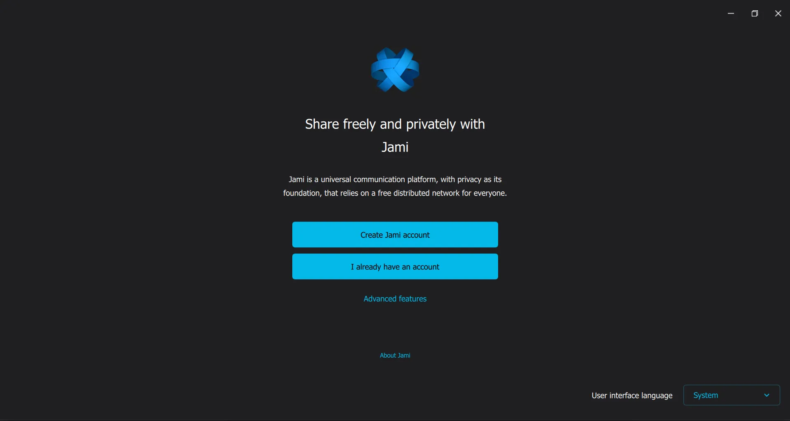


### Создать учетную запись


Создать учетную запись Jami довольно просто. Вам не нужен ни e-mail Address, ни номер телефона: Jami собирает только минимум информации. При желании вы можете зарегистрировать имя пользователя (псевдоним), которое будет указывать на ваш *Jami ID* (криптографический отпечаток пальца). Ассоциация *псевдоним ↔ Jami ID* публикуется на сервере имен по умолчанию (заменяемом/самостоятельном), поэтому псевдоним не является обязательным.


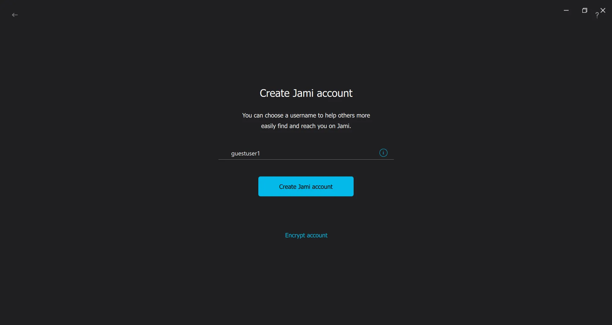


Чтобы защитить данные на локальном уровне, можно установить пароль для шифрования профиля и резервных копий на устройстве. Этот пароль необязателен и не влияет на сквозное шифрование связи, которое активно по умолчанию. Если вы активируете эту локальную защиту, выберите длинный, случайный и уникальный пароль, а затем подтвердите его.


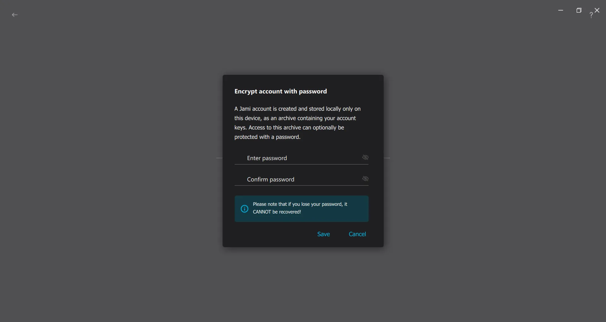


После шифрования учетной записи задайте свое полное имя.


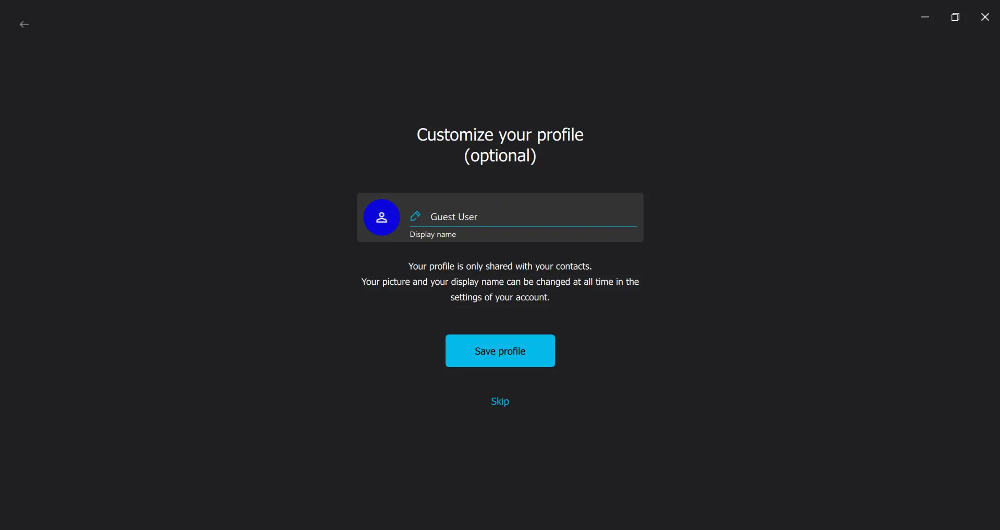


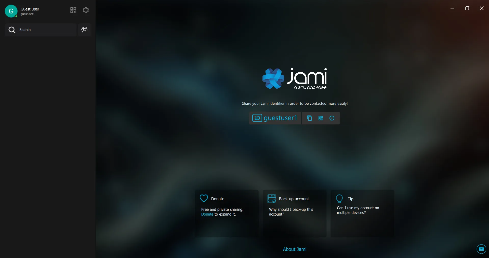


## Войдите в существующую учетную запись


Jami не использует **идентификаторы** и не имеет базы данных для подключения к вашему аккаунту. Все ваши данные хранятся непосредственно на вашем устройстве. Чтобы подключиться к старому аккаунту, необходимо выполнить **резервное копирование** старого аккаунта.


Перейдите в раздел **Настройки**, затем **Аккаунт**, затем **Управление аккаунтом**. Прокрутите страницу в самый низ и выполните **резервное копирование вашей учетной записи**. Выберите место, где будет сохранен файл резервной копии, введите **пароль**, заданный при создании аккаунта, и подтвердите его.


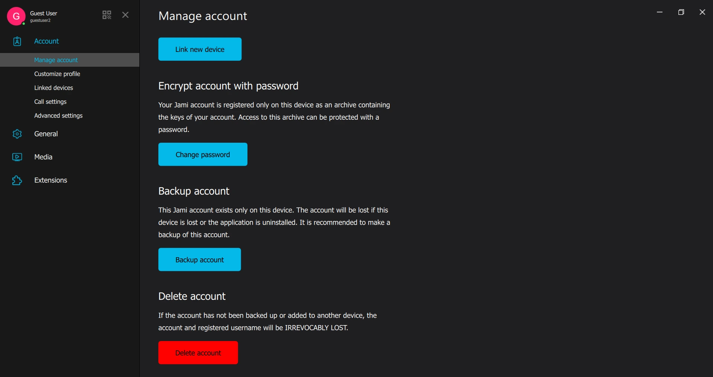


Этот файл резервной копии позволит вам заново подключиться к вашей учетной записи.


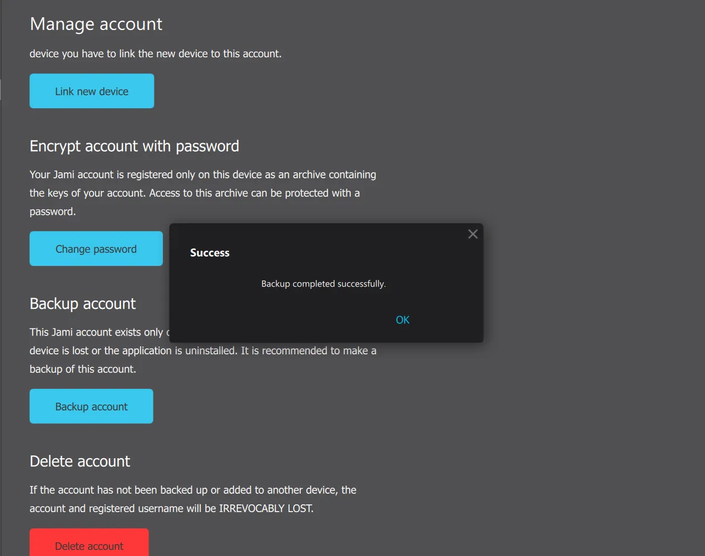


### Подключение через архив


Для этого нажмите на кнопку **Импортировать из архива резервных копий** и выберите файл резервной копии вашей учетной записи Jami.


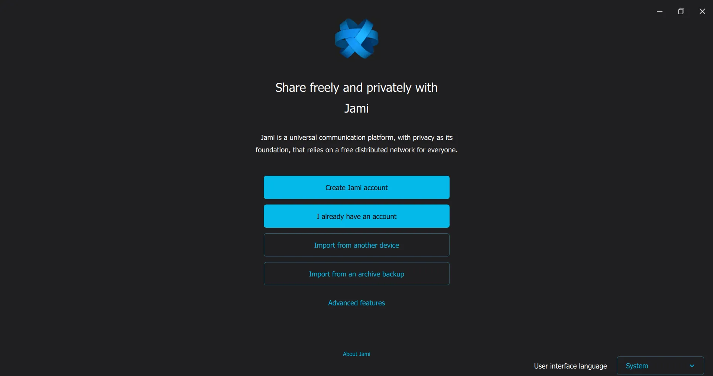


Если при создании учетной записи вы задали пароль, введите его и подтвердите. Ваши данные и сообщения появятся автоматически.


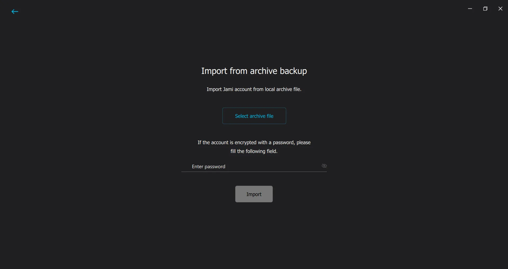


Важно регулярно создавать резервные копии аккаунта, чтобы поддерживать данные в актуальном состоянии и не потерять последние сообщения.


### Подключение через устройство


Если вы уже вошли в систему на другом устройстве под своей учетной записью Jami, перейдите в раздел **Учетная запись**, затем в раздел **Подключенные устройства** и нажмите на **Подключить новое устройство**. Появится программа для чтения QR-кодов, а также поле для ввода кода подключения.


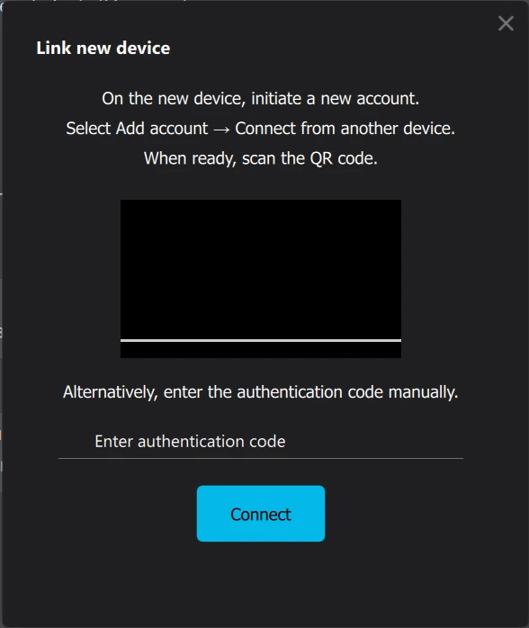


Запустите Jami на новом устройстве и выберите **У меня уже есть аккаунт**, затем **Импортировать с другого устройства**. Вы получите **QR-код** и код входа в систему. Для подключения можно использовать сканер QR-кодов, чтобы отсканировать код, отображаемый на другом устройстве. Однако зачастую проще скопировать код подключения и вставить его непосредственно в указанное поле.


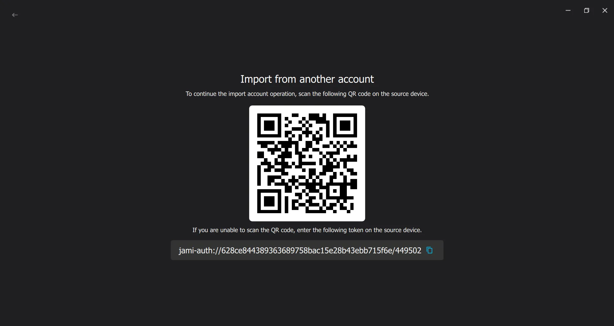


Если при создании учетной записи вы задали пароль, то для продолжения работы вам нужно будет ввести его на новом устройстве.


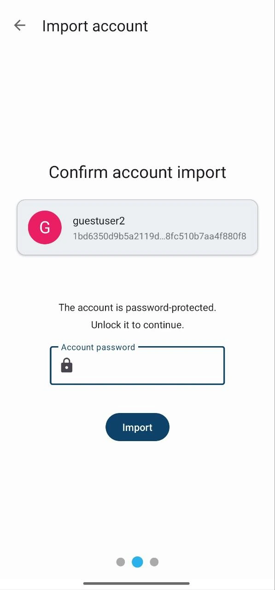


Подтвердите подключение на уже подключенном устройстве, чтобы продолжить.


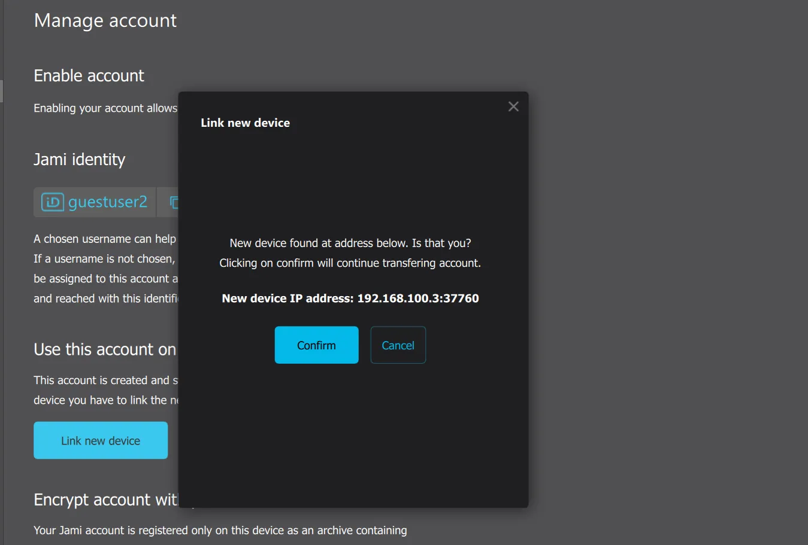


После ввода пароля устройство автоматически подключится к учетной записи и выполнит синхронизацию. После этого вы сможете отправлять и получать сообщения с любого из ваших устройств.


## Добавить расширение к Jami


Одна из интересных особенностей Jami - возможность интегрировать новые возможности с помощью расширений (плагинов). Плагины представляют собой нативные модули (C/C++); SDK предоставляет инструменты и скрипты (в частности, на Python) для их создания. Некоторые плагины доступны непосредственно [здесь] (https://jami.net/extensions/).


Чтобы установить расширение, на Рабочем столе откройте интегрированный магазин расширений, загрузите соответствующий плагин, затем перейдите в **Настройки → Расширения → Установить** и активируйте его. На Android магазин не интегрирован: скачайте файл `.jpl`, затем импортируйте его вручную из **Настройки → Расширения → Установить**; импорт произойдет автоматически, после чего вы сможете активировать расширение и при необходимости настроить его параметры.


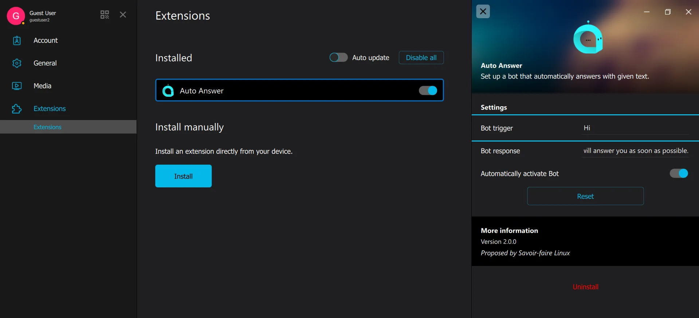


Чтобы разработать собственные плагины, ознакомьтесь с записью в блоге **[Discover the Jami Plugin SDK and create your own plugins](https://jami.net/plugins-sdk/)**.


## Дополнительные возможности


Jami также предлагает **расширенные возможности** для пользователей, желающих продвинуться дальше в настройке и использовании приложения. Эти возможности включают в себя:


- Создать точку рандеву**: Эта функция позволяет создать **точку рандеву** для ваших коммуникаций, что полезно для организации безопасных сессий или обмена сообщениями между несколькими пользователями.
- Подключение к серверу Jami**: Вы можете подключить Jami к **Jami-серверу**, что может повысить производительность или доступность связи, особенно в профессиональной среде.
- Создайте учетную запись SIP**: Вы можете создать учетную запись **SIP** (Session Initiation Protocol), что позволит вам интегрировать Jami с существующими телефонными системами или совершать телефонные звонки.


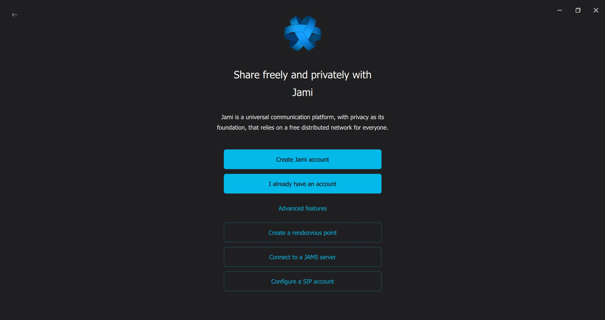


Эти опции предназначены для более опытных пользователей, которые хотят настроить работу с Jami и воспользоваться дополнительными функциями для конкретных нужд.


Одним словом, Jami - это полноценное, безопасное и гибкое коммуникационное решение, подходящее как для персонального использования, так и для более специфических нужд благодаря **расширениям**. Простая установка, интуитивно понятное управление и расширенные функции, такие как **шифрование**, **синхронизация с несколькими устройствами** и возможность **создавать собственные плагины**, делают его мощным инструментом для управления вашими коммуникациями, сохраняя при этом вашу **приватность**.


Discover Tox - децентрализованный протокол, сочетающий сквозное шифрование (E2E), открытые ключи и многие другие алгоритмы, чтобы предложить вам оптимальную связь, которая защищает вашу конфиденциальность через различные клиенты.


https://planb.network/tutorials/computer-security/communication/tox-027bc897-8c98-4265-b85b-e78b7ab607f3