## Въведение


### Защо Kali Linux?


**Kali Linux** е дистрибуция на Linux, специализирана в областта на ИТ сигурността.


Ето защо използваме Kali Linux:


- Той е предварително конфигуриран с широк набор от инструменти за пентатестване (тестове за системна и мрежова сигурност).
- Той е с отворен код и безплатен**, така че можете да го използвате и модифицирате свободно.
- Той е **надежден и сигурен**, идеален за изучаване на киберсигурността.
- Тя ви позволява да научите как да използвате Linux в среда, готова за тестване.
- Тя може да се инсталира по различни начини: **VirtualBox**, **зареждащ се USB ключ** или **двойно зареждане**.


## Инсталиране и конфигуриране


### 1. Предварителни условия


**Необходимо оборудване:**


- 64-битов процесор** (Intel или AMD).
- минимум 8 GB RAM** (4 GB могат да бъдат достатъчни за лека инсталация или виртуална машина).
- 50 GB свободно дисково пространство**, за да инсталирате Kali Linux.
- Интернет връзка**, за да изтеглите ISO образа и актуализациите.
- Минимум 8 GB USB ключ** за създаване на зареждащ носител (ако искате да инсталирате Kali на компютър или да го тествате на Live USB).


Важно е да направите резервно копие на данните си, преди да инсталирате на съществуващ компютър.


### 2. Изтегляне


- Отидете на [kali.org/get-kali](https://www.kali.org/get-kali/#kali-platforms)
- Изберете ISO образа за вашето приложение:
  - Инсталационно изображение** : за инсталиране на компютър.
  - Виртуално изображение**: за инсталиране на Kali на VirtualBox или VMware.
- Изтеглете ISO образа.


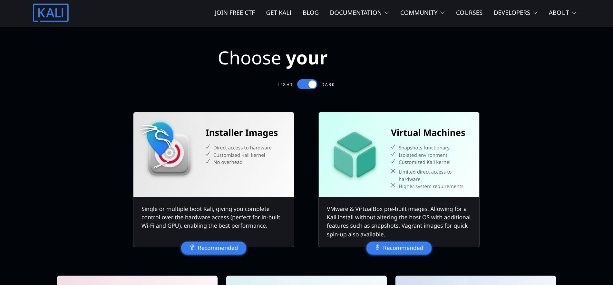


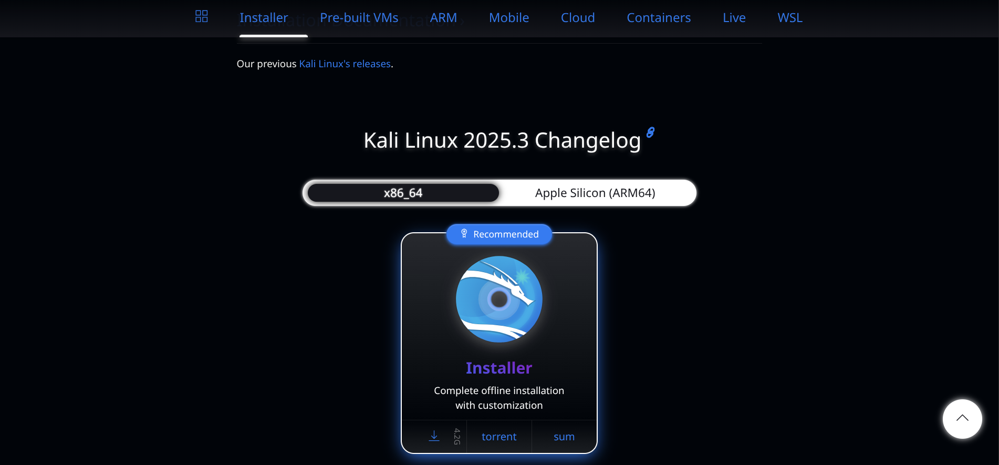


### 3. Създаване на зареждащ USB ключ


Можете да използвате няколко инструмента, като например Balena Etcher :


- Изтеглете и инсталирайте [Balena Etcher](https://etcher.balena.io/).


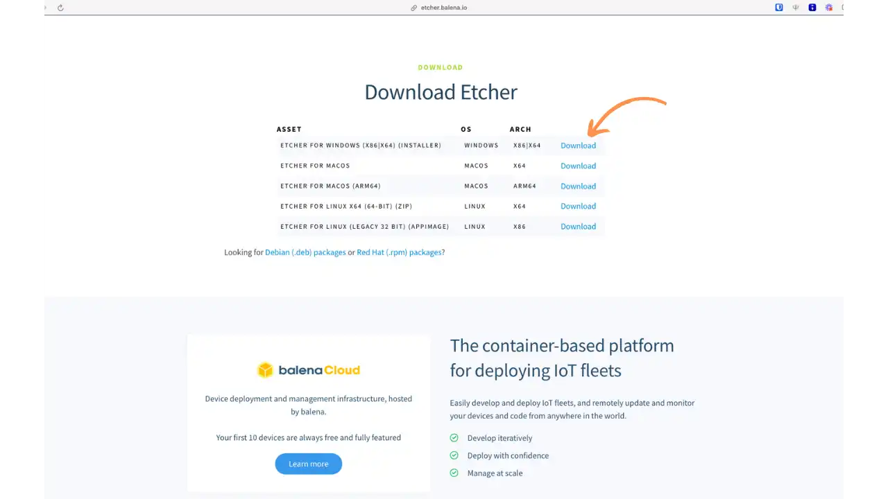


- Отворете Balena Etcher, след което изберете ISO образа на Kali.
- Изберете USB ключ като носител на дестинацията.
- Щракнете върху Flash и изчакайте процесът да завърши.


### 4. Инсталиране и осигуряване на Kali Linux


#### 4.1 Стартиране от USB ключ


- Изключете компютъра.
- Включете USB ключа (съдържащ Kali Linux).
- Включете компютъра си. При последните компютри системата трябва автоматично да разпознае USB ключа за зареждане. Ако случаят не е такъв, рестартирайте компютъра, като задържите натиснат клавиша за достъп до BIOS/UEFI (обикновено F2, F12 или Delete, в зависимост от марката).
  - В менюто BIOS/UEFI изберете USB ключа като устройство за зареждане.
  - Запишете и рестартирайте.


#### 4.2 Стартиране на инсталацията


##### Екран за стартиране


При зареждане от USB паметта трябва да се появи екранът за зареждане на Kali Linux. Изберете между **графична инсталация** и **текстова инсталация**. В този пример сме избрали графична инсталация.


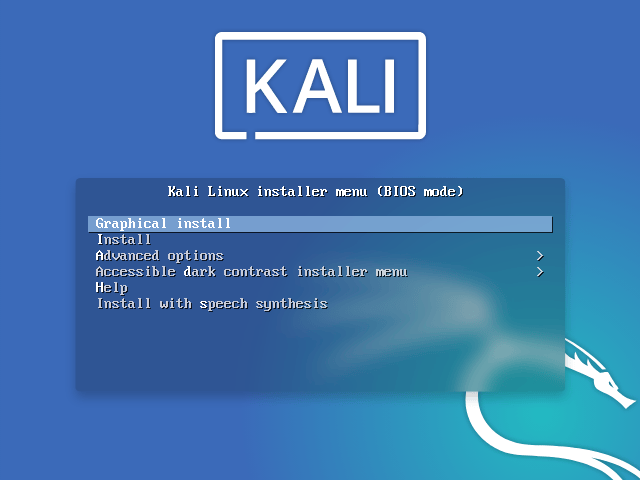


Ако използвате изображението **Live**, ще видите друг режим - **Live**, който е и опцията за стартиране по подразбиране.


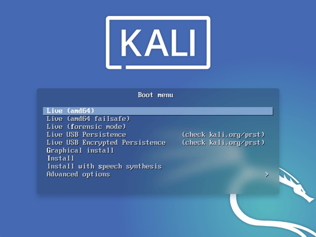


##### Избор на език


Изберете предпочитания от вас език за инсталацията и системата.


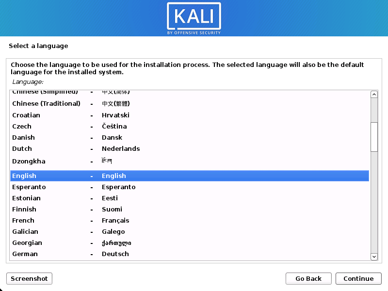


Моля, посочете географското си местоположение.


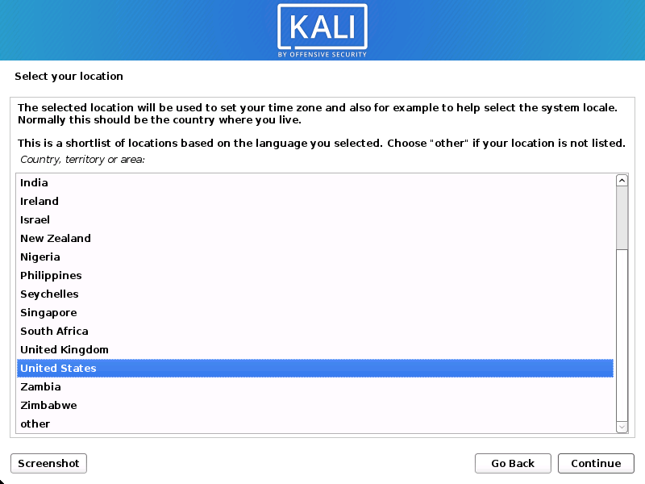


##### Конфигурация на клавиатурата


Изберете клавиатурна подредба. Налично е поле за тест, за да проверите дали клавишите отговарят на вашата конфигурация.


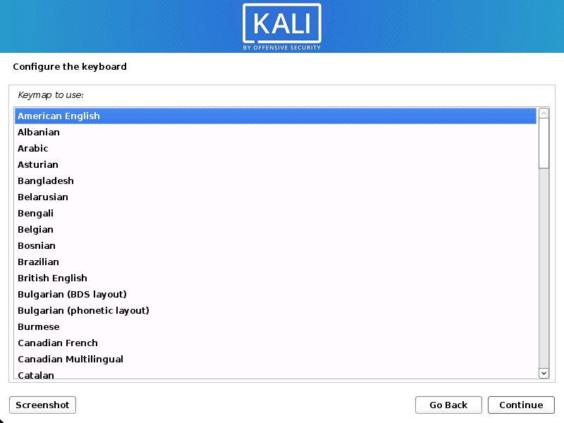


##### Мрежова връзка


Сега инсталацията ще сканира мрежовите интерфейси, ще потърси услугата DHCP и ще ви подкани да въведете име на хост за вашата система. В примера по-долу сме въвели **"kali "** като име на хост.


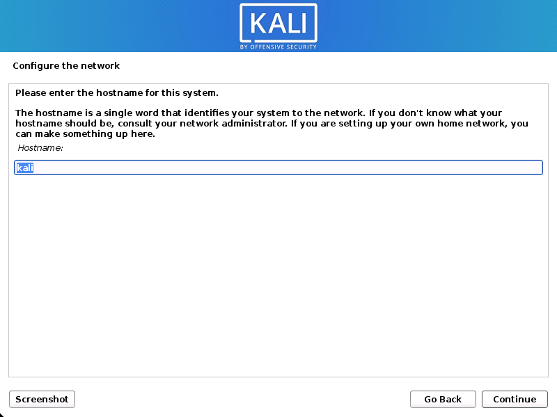


По желание можете да предоставите име на домейн по подразбиране, което тази система ще използва (стойностите могат да бъдат извлечени от DHCP или ако съществува вече съществуваща операционна система).


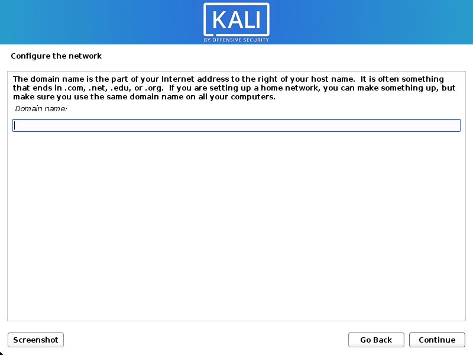


##### Потребителски акаунти


След това създайте потребителски акаунт за системата (пълно име, потребителско име и силна парола).


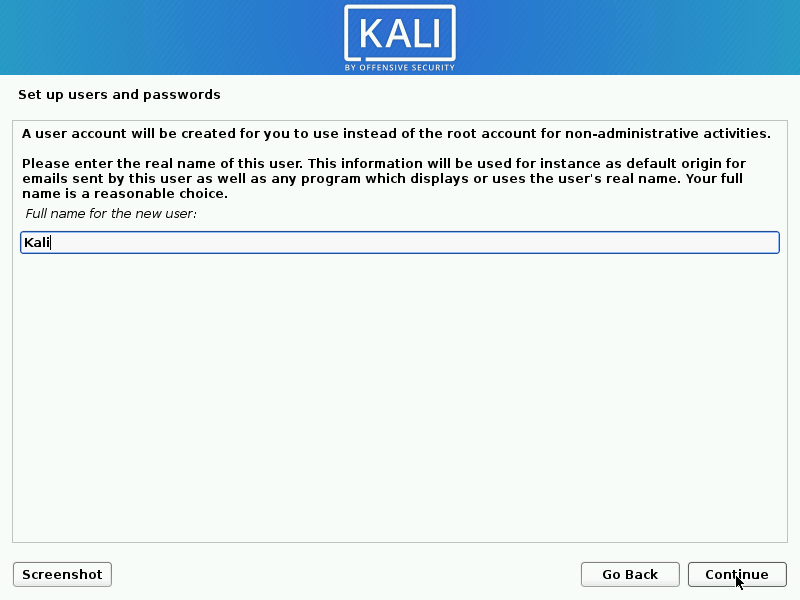


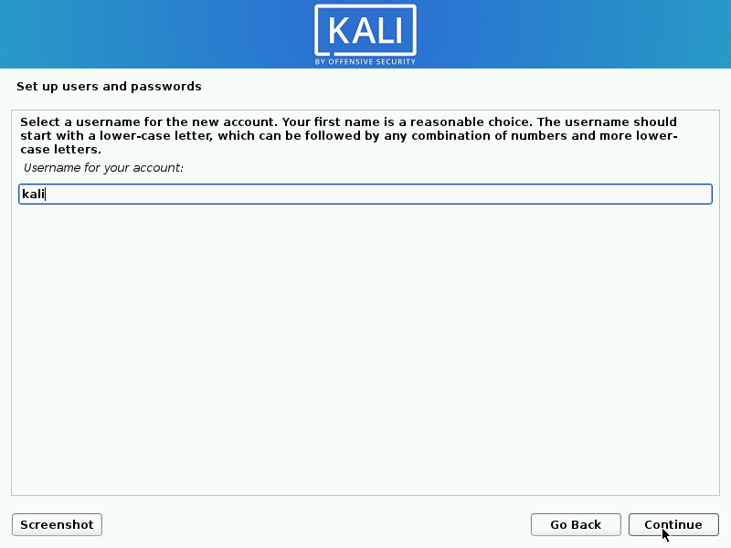


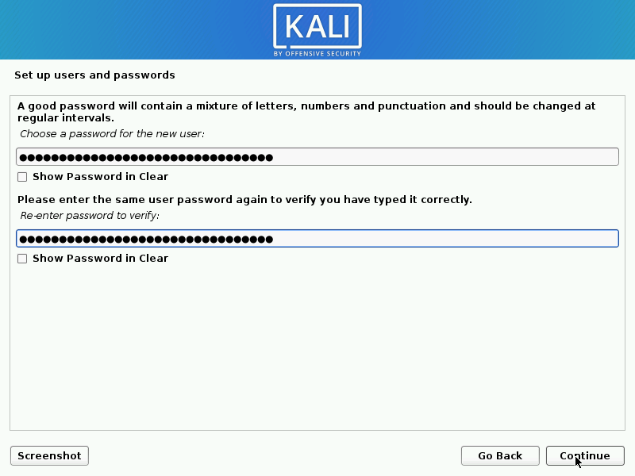


##### Часова зона


Изберете географския си район, за да зададете системното време.


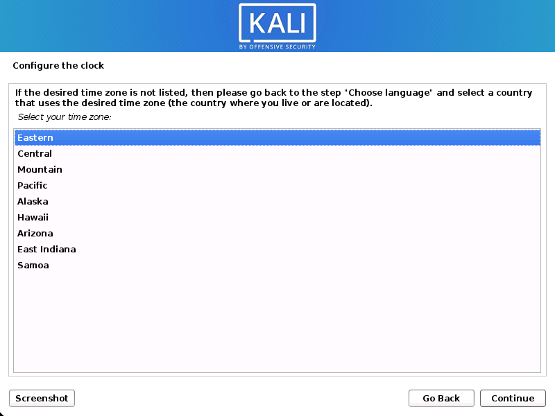


##### Тип разделяне


След това инсталаторът сканира дисковете и показва няколко опции в зависимост от конфигурацията.


В това ръководство започваме от **празен диск**, което дава **четири възможни избора**.


Ще изберем **Guided - use entire disk** (Ръководено - използване на целия диск**), тъй като тук извършваме еднократна инсталация на Kali Linux (единично зареждане). Това означава, че няма да бъде запазена друга операционна система и целият диск може да бъде изтрит.


Ако дискът ви вече съдържа данни, може да се покаже допълнителна опция **Guided - use largest contiguous free space** (Ръководство - използвайте най-голямото свободно пространство)**.


Тази алтернатива ви позволява да инсталирате Kali Linux, без да изтривате съществуващите данни, което я прави идеална за двойно зареждане с друга система.


В нашия случай дискът е празен, така че тази опция не се появява.


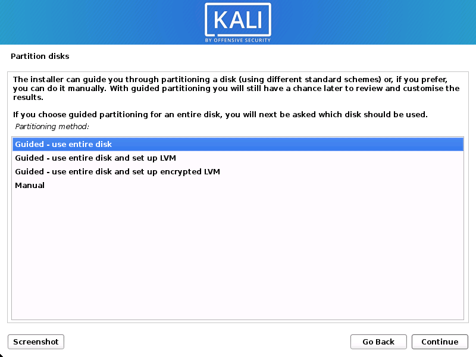


Изберете диска, който ще бъде разделен на дялове.


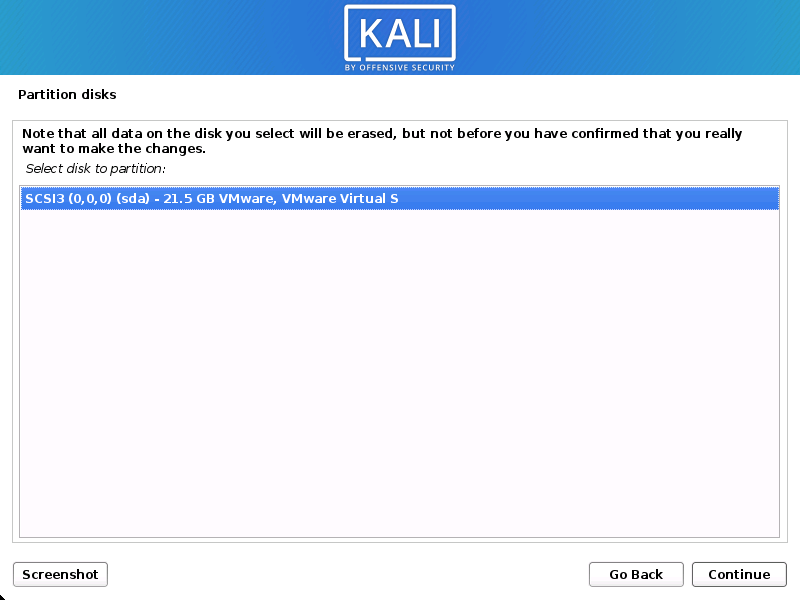


В зависимост от нуждите си можете да изберете да съхранявате всички файлове в един дял (поведение по подразбиране) или да имате отделни дялове за една или повече директории от най-високо ниво.


Ако не сте сигурни какво искате, изберете опцията **Всички файлове в един дял**.


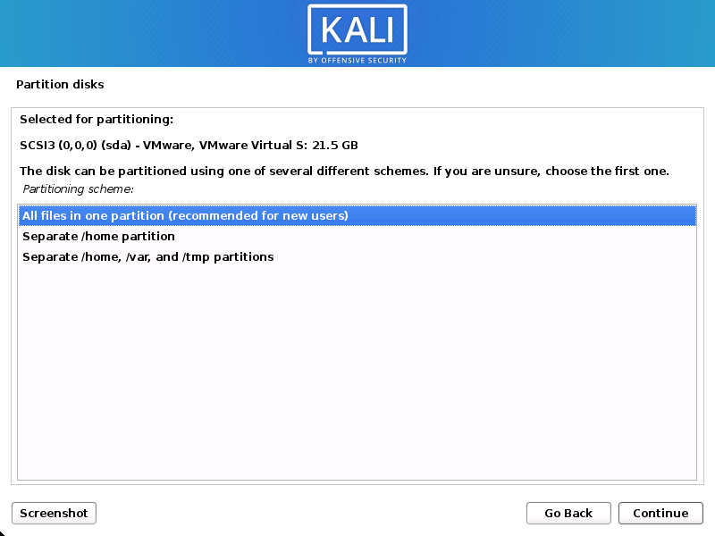


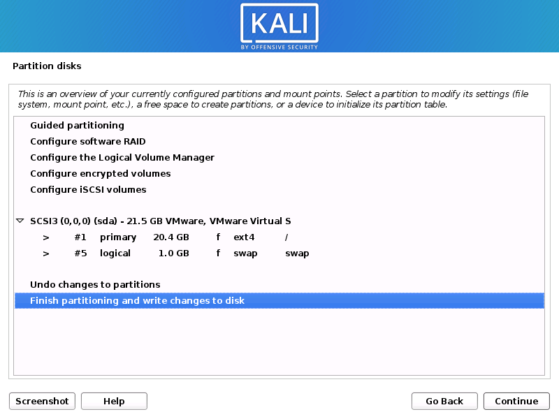


След това ще имате последна възможност да проверите конфигурацията на диска, преди инсталационната програма да направи необратими промени. След като щракнете върху _Continue_, инсталационната програма ще се стартира и инсталацията ще бъде почти завършена.


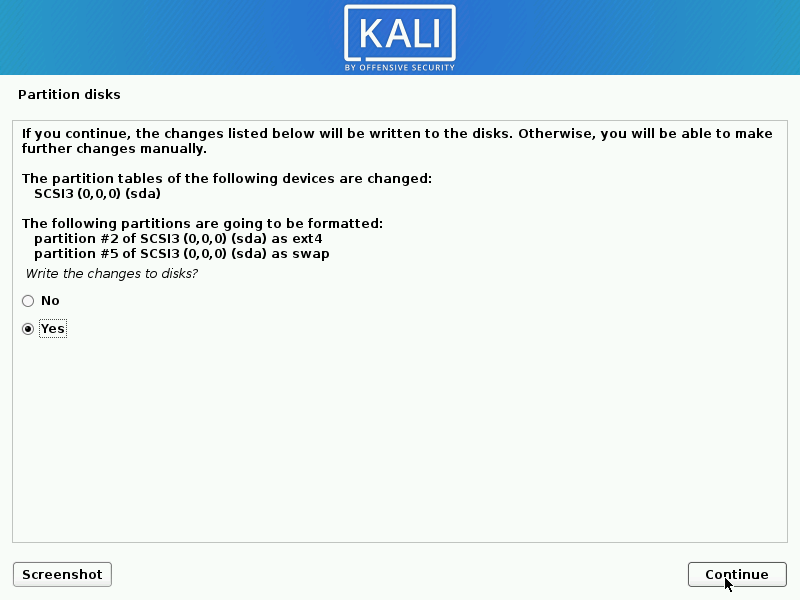


##### Криптиран LVM


Ако тази опция е била разрешена в предишната стъпка, Kali Linux вече ще извърши сигурно изтриване на твърдия диск, преди да ви попита за парола за LVM.


Моля, използвайте силна парола, в противен случай ще се покаже предупреждение за слаба passphrase.


##### Информация за пълномощното


Kali Linux използва хранилища за разпространение на приложения. Ще трябва да въведете необходимата информация за прокси сървъра, ако вашата среда използва такъв.


Ако не сте сигурни дали да използвате прокси, **оставете празно място**. Въвеждането на невярна информация ще попречи на връзката с хранилищата.


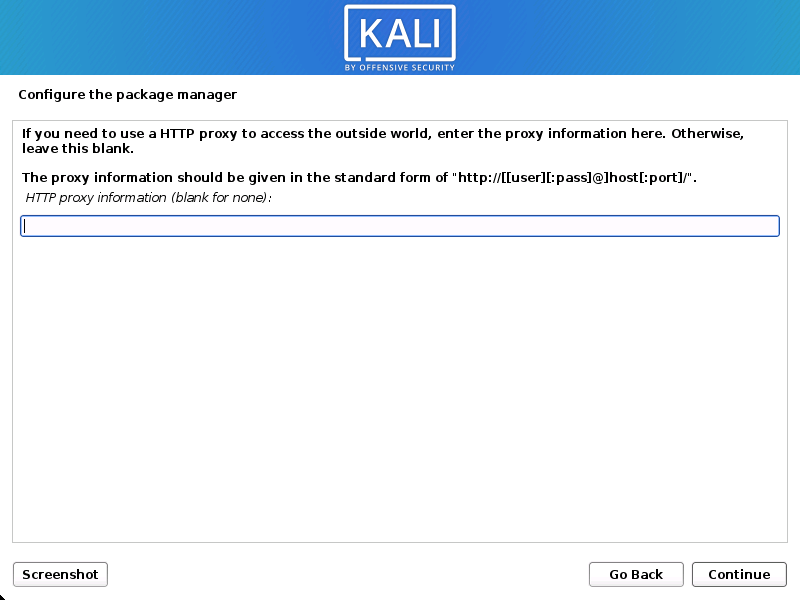


##### Metapets


Ако достъпът до мрежата не е конфигуриран, ще трябва да извършите **допълнителна конфигурация**, когато бъдете подканени.


Ако използвате изображението **Live**, следващата стъпка няма да бъде показана.


След това можете да изберете [метапакетите](https://www.kali.org/docs/general-use/metapackages/), които искате да инсталирате. Опциите по подразбиране ще инсталират стандартна система Kali Linux, така че няма да е необходимо да променяте нищо.


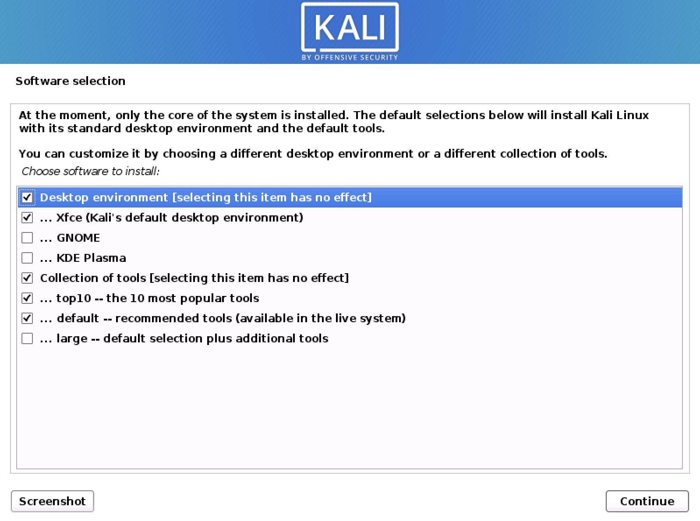


#### Информация за стартиране


След това потвърдете инсталирането на зареждащата програма GRUB.


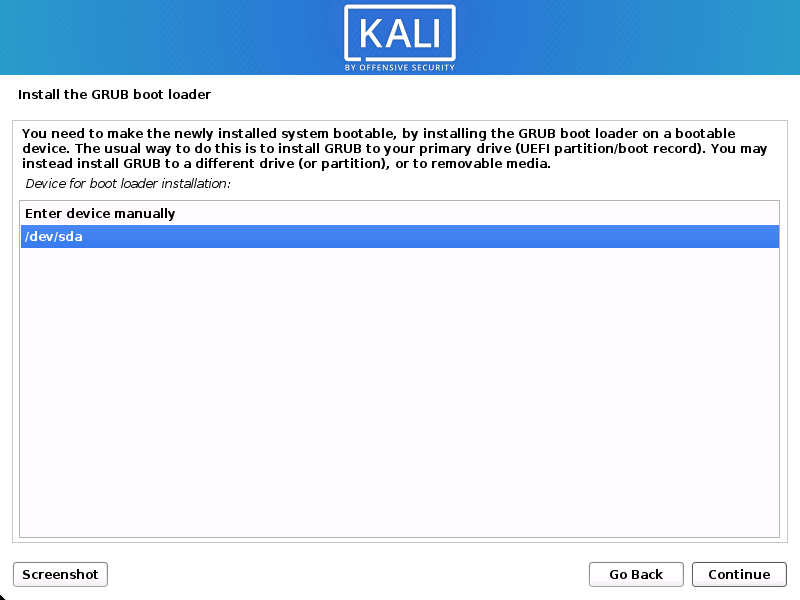


##### Рестартиране на


Накрая щракнете върху Продължи, за да рестартирате новата инсталация на Kali Linux.


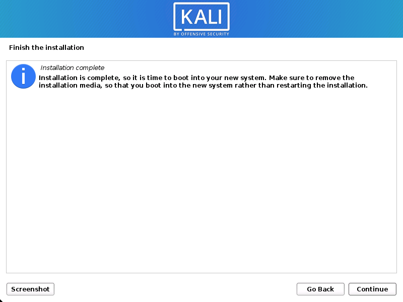


#### 4.3 Актуализиране и конфигуриране на Kali Linux след инсталиране


Актуализирането на системата е важна стъпка след нова инсталация. Имате две възможности:


##### Вариант 1: Чрез графичен потребителски интерфейс (GUI)


Kali, подобно на Debian/Ubuntu, предлага интегриран графичен мениджър за актуализации.


1. Щракнете върху **основното меню** (горе вляво или долу в зависимост от работния плот).


2. Отворете **"Software Updater "**.


3. Инструментът ще :


    - Проверете пакетите, които трябва да бъдат актуализирани.
    - Ще видите списък (с размери и версии).
    - Позволява ви да стартирате актуализацията с едно кликване.


4. Въведете паролата си за администратор (`sudo`), когато бъдете подканени.


5. Оставете го да се инсталира и рестартирайте, ако е необходимо.


##### Вариант 2: Чрез терминал


Отворете терминал и стартирайте :


```bash
# Mettre à jour les dépôts et le système
sudo apt update && sudo apt full-upgrade -y

# Nettoyage
sudo apt autoremove -y && sudo apt autoclean
```


Не е препоръчително да използвате акаунта **root** за ежедневна работа; вместо това създайте потребител, който не е root.


В терминала въведете тези команди:


```bash
sudo adduser yourname
sudo usermod -aG sudo yourname
```


Излезте и влезте отново с новия потребител.


Нека обобщим някои основни задачи на Kali Linux в таблица.


### Основни задачи под Kali Linux


| **Категория** | **Основна задача** | **Описание / Цел** | **Основен метод** |
| -------------------------- | -------------------------------------- | ---------------------------------------------------------- | ------------------------------------------------------------ |
| **Навигация в системата** | Отваряне на терминала | Достъп до главния команден ред на Kali | Кликнете върху иконата на терминала или използвайте `Ctrl + Alt + T` |
| | Разглеждане на папки | Придвижване в системната дървовидна структура | `cd /път/до/папка`, `ls` за изброяване на файловете |
| | Създаване / изтриване на папка | Организиране на файловете | `mkdir име_на_папка`, `rm -r име_на_папка` |
| **Управление на файлове** | Копиране / преместване на файл | Манипулиране на файлове в терминала | `cp файл дестинация`, `mv файл дестинация` |
| | Изтриване на файл | Освобождаване на дисково пространство | `rm име_на_файл` |
| | Показване на съдържанието на текстов файл | Бързо четене на файл | `cat файл.txt`, `less файл.txt` |
| **Управление на системата** | Актуализиране на Kali Linux | Инсталиране на най-новите версии и корекции за сигурност | `sudo apt update && sudo apt full-upgrade -y` |
| | Инсталиране на софтуер | Добавяне на нов инструмент или помощна програма | `sudo apt install име_на_пакет` |
| | Изтриване на софтуер | Почистване на системата | `sudo apt remove име_на_пакет` |
| | Почистване на ненужни зависимости | Спестяване на дисково пространство | `sudo apt autoremove` |
| **Мрежа и интернет** | Проверка на мрежовата връзка | Тестване на достъпа до интернет | `ping google.com` |
| | Идентифициране на IP адреса | Научаване на мрежовата конфигурация | `ip a` или `ifconfig` |
| | Смяна на Wi-Fi мрежа | Свързване към друга точка за достъп | Икона за мрежа → Изберете желаната Wi-Fi мрежа |
| **Акаунти и разрешения** | Изпълнение на администраторска команда | Временно получаване на root права | `sudo команда` |
| | Създаване на нов потребител | Добавяне на локален акаунт | `sudo adduser потребителско_име` |
| | Промяна на парола | Защита на акаунт | `passwd` |
| **Външен вид и комфорт** | Смяна на тапета | Персонализиране на работния плот | Десен бутон върху работния плот → **Настройки на работния плот** |
| | Промяна на темата / иконите | Подобряване на четливостта и естетиката | Настройки → Външен вид / Теми |
| **Инструменти на Kali** | Отваряне на менюто с инструменти | Разглеждане на инструментите за тестване и сигурност | Меню **Приложения → Kali Linux** |
| | Стартиране на инструмент (напр. nmap, wireshark) | Практическо откриване на инструментите за сигурност | `sudo nmap`, `wireshark` и др. |
| **Помощ и документация** | Получаване на помощ за команда | Разбиране на команда преди използването ѝ | `man команда` или `команда --help` |

## Заключение


Инсталирането на Kali Linux е само първата стъпка в откриването на тази мощна среда, посветена на киберсигурността. Като овладее основните задачи и управлението на системата, всеки може да започне да изследва вградените инструменти и да разбере вътрешната работа на една Linux система. Kali предлага отлична платформа за обучение, както за затвърждаване на техническите умения, така и за развиване на истинска култура на ИТ сигурност.