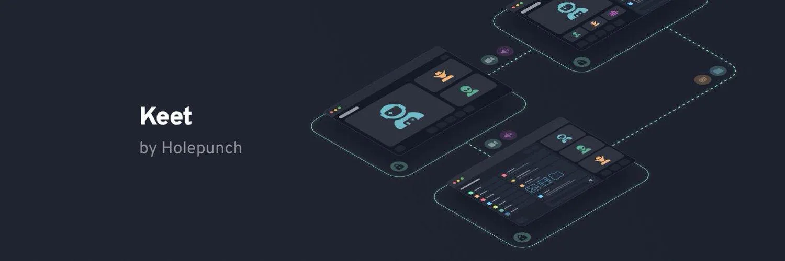

Keet är en applikation för snabbmeddelanden som är utformad för att fungera utan servrar. Applikationen lanserades 2022 av Holepunch (ett företag som finansieras av Tether och Bitfinex) och är helt baserad på ett peer-to-peer-nätverk och har ett radikalt decentraliserat tillvägagångssätt: meddelanden, samtal och filer utbyts direkt mellan användare, utan mellanhänder.

Keet krypterar all kommunikation från början till slut och ber inte om några personuppgifter. Registreringen är anonym, utan krav på telefonnummer eller e-postadress. Förutom att utbyta textmeddelanden erbjuder Keet videosamtal av mycket hög kvalitet samt obegränsad fildelning. Applikationen kan därför användas på ett hybrid sätt, för både personligt och professionellt bruk.

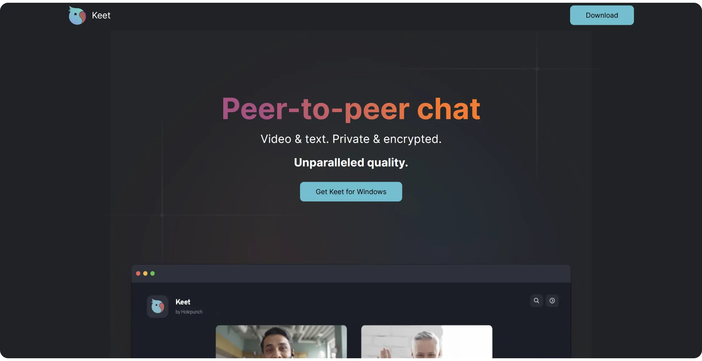

För närvarande (april 2025) är Keet inte helt öppen källkod. En del av källkoden finns tillgänglig på [Holepunchs GitHub-arkiv] (https://github.com/holepunchto), särskilt de kryptografiska komponenterna och nätverkskomponenterna, men klienten Interface är det ännu inte. Holepunch har dock meddelat att de har för avsikt att göra hela applikationen öppen källkod så småningom. Beroende på när du upptäcker denna handledning kan detta redan ha gjorts.

| Application          | E2EE 1:1       | E2EE groups    | Anonymous registration | Open-source client license | Open-source server license | Decentralized server | Year of creation  |
| -------------------- | -------------- | -------------- | ---------------------- | -------------------------- | -------------------------- | -------------------- | ----------------- |
| WhatsApp             | ✅              | ✅              | ❌                      | ❌                          | ❌                          | ❌                    | 2009              |
| WeChat               | ❌              | ❌              | ❌                      | ❌                          | ❌                          | ❌                    | 2011              |
| Facebook Messenger   | ✅              | 🟡 (optional) | ❌                      | ❌                          | ❌                          | ❌                    | 2011              |
| Telegram             | 🟡 (optional) | ❌              | 🟡                     | ✅                          | ❌                          | ❌                    | 2013              |
| LINE                 | ✅              | ✅              | ❌                      | ❌                          | ❌                          | ❌                    | 2011              |
| Signal               | ✅              | ✅              | ❌                      | ✅                          | ✅                          | ❌                    | 2014              |
| Threema              | ✅              | ✅              | ✅                      | ✅                          | ❌                          | ❌                    | 2012              |
| Element (Matrix)     | ✅              | ✅              | ✅                      | ✅                          | ✅                          | 🟡 (federated)      | 2016              |
| Delta Chat           | ✅              | ✅              | ✅                      | ✅                          | N/A                        | 🟡 (via email)      | 2017              |
| Conversations (XMPP) | ✅              | ✅              | ✅                      | ✅                          | ✅                          | 🟡 (federated)      | 2014              |
| Session              | ✅              | ✅              | ✅                      | ✅                          | ✅                          | ✅                    | 2020              |
| SimpleX              | ✅              | ✅              | ✅                      | ✅                          | ✅                          | ✅                    | 2021              |
| Olvid                | ✅              | ✅              | ✅                      | ✅                          | ❌                          | 🟡(no directory)     | 2019              |
| Keet                 | ✅              | ✅              | ✅                      | ❌                          | N/A                        | ✅                    | 2022              |
| Jami                 | ✅              | ✅              | ✅                      | ✅                          | N/A                        | ✅                    | 2005              |
| Briar                | ✅              | ✅              | ✅                      | ✅                          | N/A                        | ✅                    | 2018              |
| Tox                  | ✅              | ✅              | ✅                      | ✅                          | N/A                        | ✅                    | 2013              |

*E2EE = End-to-end-kryptering*

## Installera Keet

Keet finns tillgänglig på alla plattformar. Du kan ladda ner applikationen direkt från din telefons appbutik:

- [Google Play] (https://play.google.com/store/apps/details?id=io.keet.app&pli=1);
- [App Store] (https://apps.apple.com/us/app/keet-by-holepunch/id6443880549);

På Android är det också möjligt att [installera via APK] (https://github.com/holepunchto/keet-mobile-releases/releases).

I den här handledningen koncentrerar vi oss på mobilversionen, men observera att [datorversioner också finns tillgängliga](https://keet.io/) (MacOS, Linux och Windows). Det är också möjligt att synkronisera ditt konto på flera enheter.

## Skapa ett konto på Keet

Vid den första lanseringen kan du ignorera presentationsskärmarna.

Klicka på knappen "*Jag är en ny användare*".

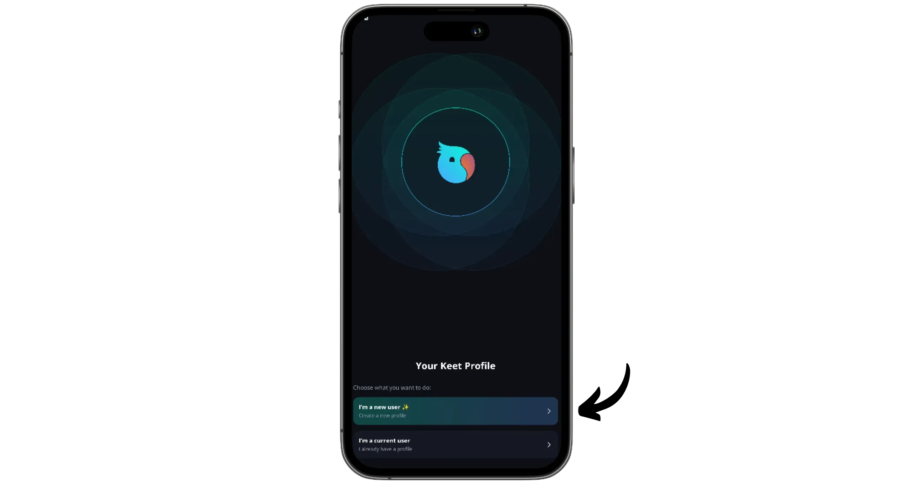

Acceptera användarvillkoren och klicka sedan på "*Quick setup*".

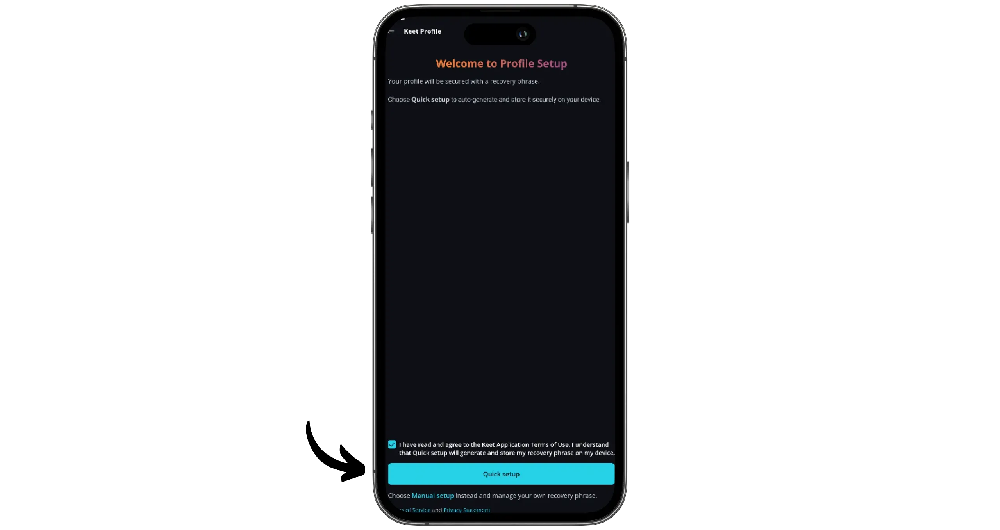

Välj ett namn eller smeknamn och klicka sedan på "*Finish setup*".

Din profil är nu skapad. Klicka på "*Finish setup*" igen för att slutföra.

Du kan när som helst anpassa din profil under fliken "*Profil*".

## Spara ditt Keet-konto

Det första du ska göra med ditt nya Keet-konto är att spara din återställningsfras. Det är en sekvens på 24 ord som gör att du kan återställa åtkomsten till ditt konto om du förlorar det eller byter enhet. Den här frasen ger full åtkomst till ditt konto för alla som känner till den, så det är viktigt att göra en tillförlitlig säkerhetskopia och aldrig avslöja den.

Detta gör du genom att klicka på fliken "*Profil*" längst ned till höger i Interface.

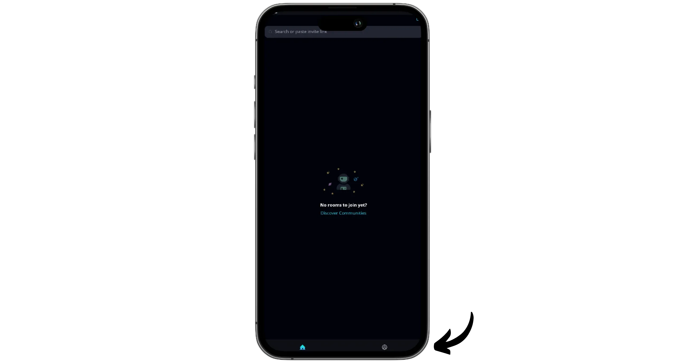

Gå sedan till menyn "*Inställningar*".

Välj "*Privacy and Security*".

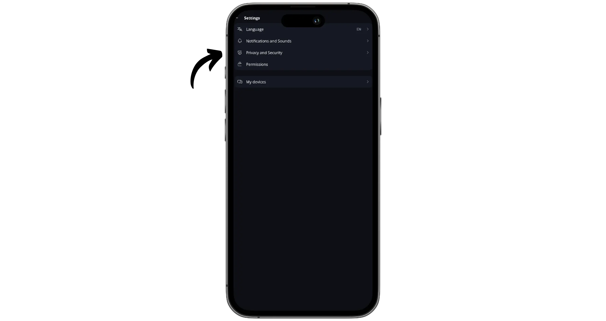

Klicka sedan på "*Återställningsfras*".

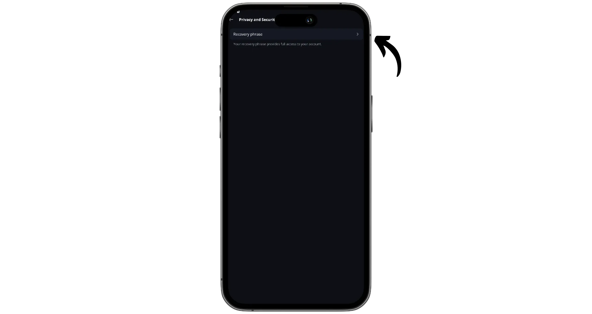

Tryck på knappen "*Visa fras*" för att visa din återställningsfras. Kopiera den noggrant och förvara den på en säker plats.

## Skicka meddelanden med Keet

För att kommunicera på Keet måste du skapa "*Rooms*". För att göra detta klickar du på pennikonen längst upp till höger på Interface.

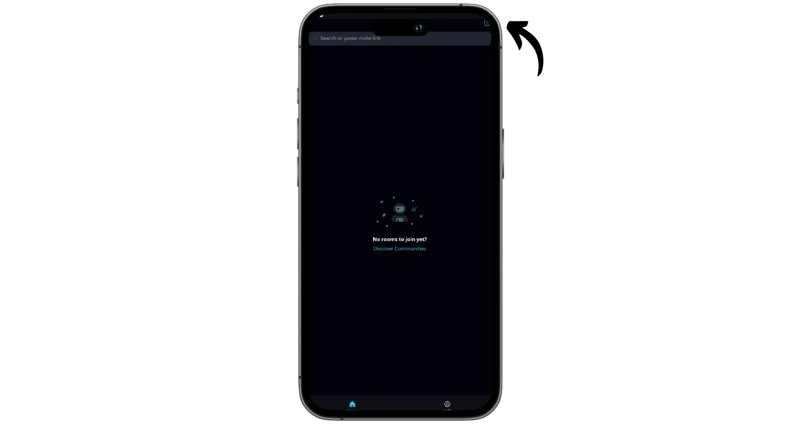

Välj "*Ny gruppchatt*".

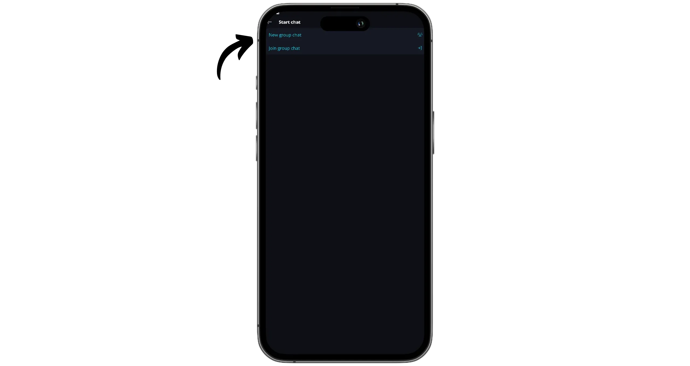

Välj ett namn och en beskrivning för ditt "*Room*" och klicka sedan på "*Create group chat*".

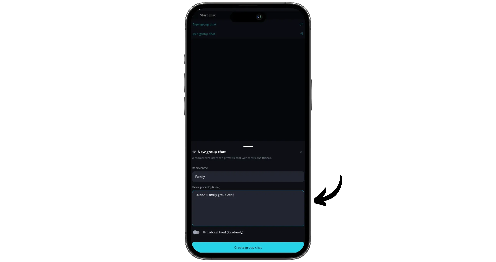

Ditt "*Room*" är nu skapat. Klicka på "*+*"-ikonen längst upp till höger för att bjuda in deltagare.

Ange vilka rättigheter du vill ge nya medlemmar via inbjudningslänken samt hur länge länken ska vara giltig. Klicka sedan på "*generate inbjudan*".

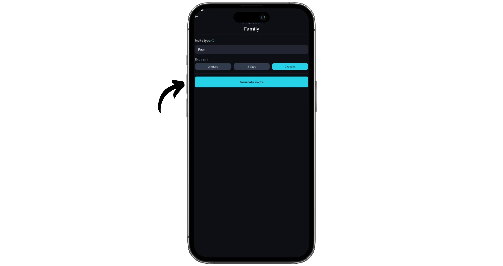

Keet kommer att generate en länk för att gå med i ditt "*Room*". Du kan antingen kopiera den och dela den, eller låta QR-koden skannas av de personer du vill bjuda in.

Du kan nu börja utbyta meddelanden och multimediafiler. För att starta ett samtal klickar du på telefonikonen i det övre högra hörnet.

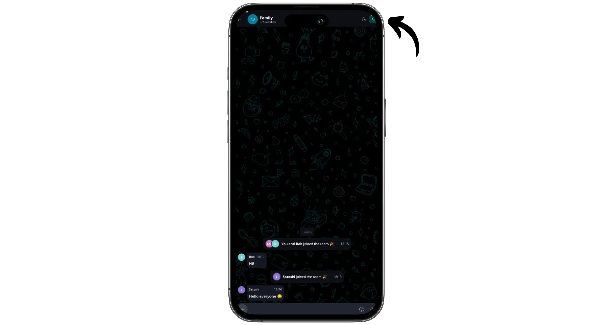

Från den här gruppen kan du också skicka privata meddelanden till en viss medlem. Klicka på gruppens profilbild och välj sedan önskad medlem i avsnittet "*Medlemmar*".

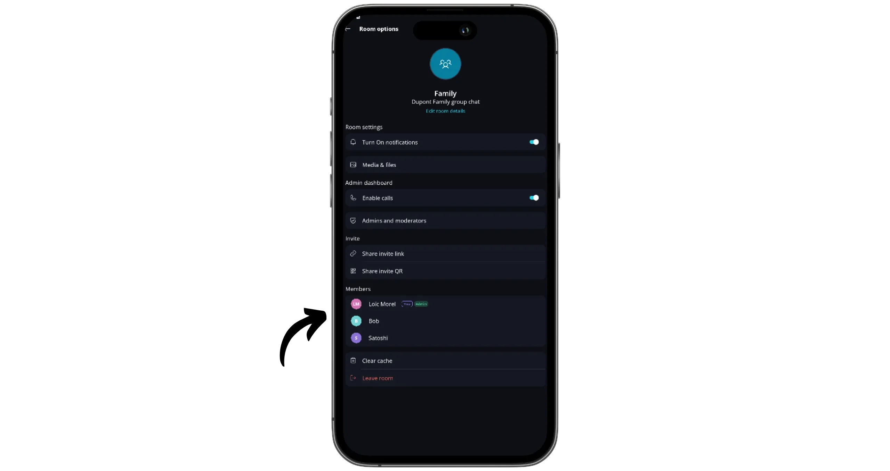

Klicka på knappen "*Send DM request*" och ange ditt meddelande.

När DM-begäran har accepterats hittar du den här kontakten på startsidan, där du kan prata med honom privat.

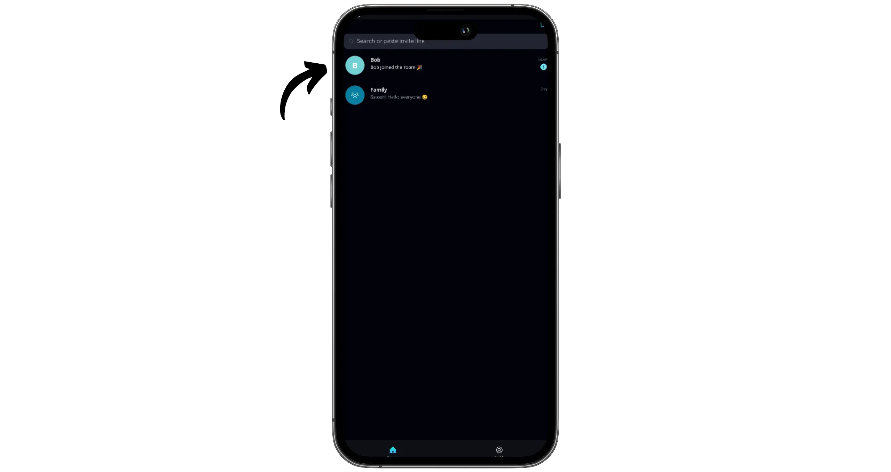

## Synkronisera ditt konto på flera enheter

Nu när du vet hur du använder Keet och har ett konto kan du även synkronisera det på en annan enhet, t.ex. en dator. För att göra detta, öppna applikationen på din mobil, klicka sedan på "*Profil*" och gå till "*Inställningar*".

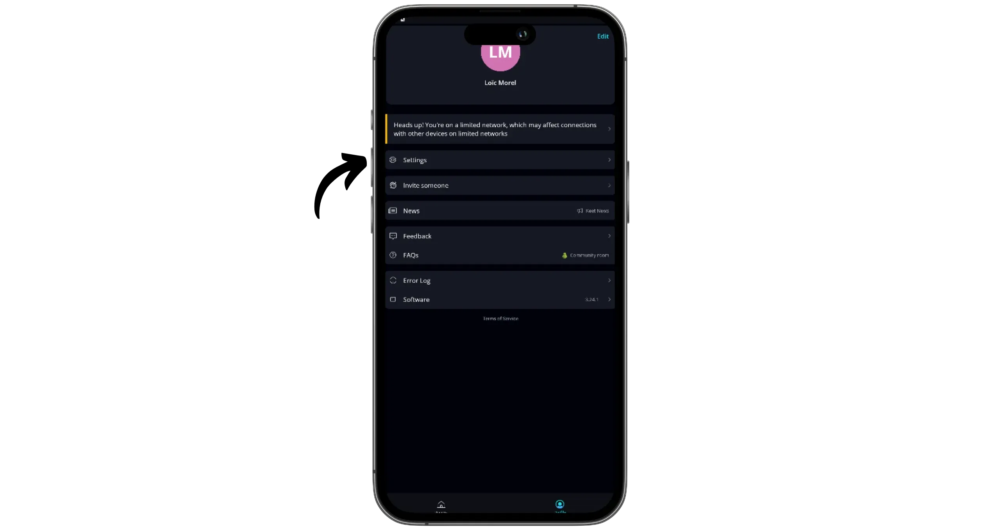

Gå sedan till menyn "*Mina enheter*".

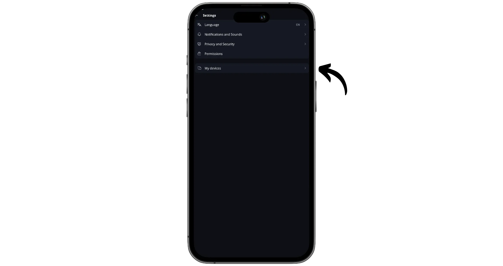

Klicka på "*Lägg till enhet*". Keet kommer generate en länk för att synkronisera en ny enhet. Kopiera den här länken.

Installera Keet på din andra enhet. På startskärmen väljer du alternativet "*Jag är en nuvarande användare*".

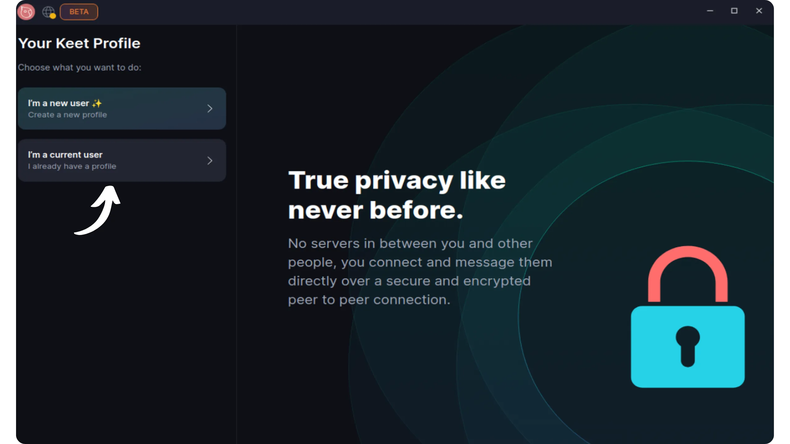

Klicka sedan på "*Länk enhet*".

Klistra in länken från din första enhet och klicka sedan på "*Starta synkronisering*".

På din första enhet klickar du på "*Confirm link devices*" för att godkänna anslutningen.

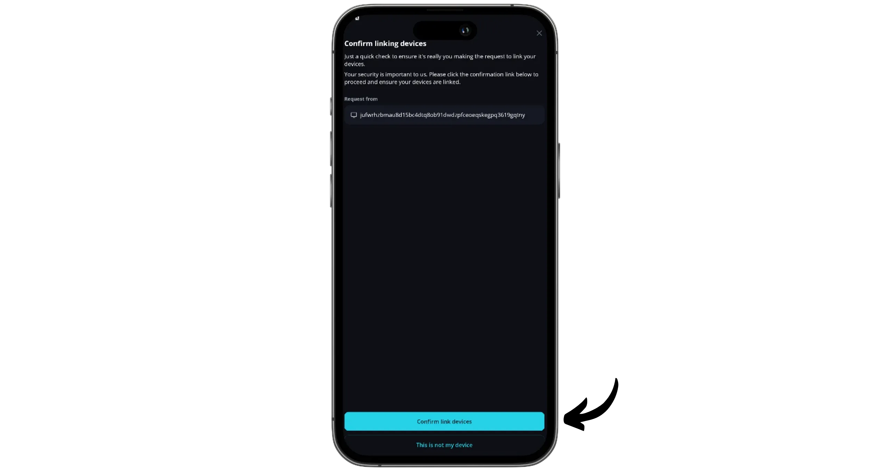

På den andra enheten slutför du processen genom att klicka på "*Link devices*".

Du kan nu komma åt alla dina "*Room*" och konversationer från den här nya enheten.

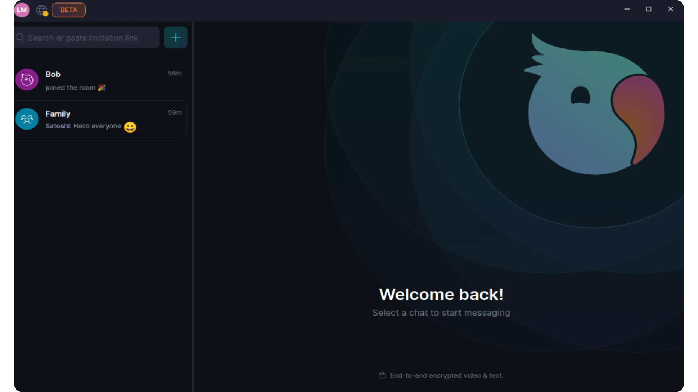

Grattis, du har nu kommit igång med att använda Keet messaging, ett bra alternativ till WathsApp! Om du tyckte att den här handledningen var användbar skulle jag vara mycket tacksam om du lämnar en Green-tumme nedan. Känn dig fri att dela denna handledning på dina sociala nätverk. Tack så mycket!

Jag rekommenderar också den här andra handledningen, där jag introducerar dig till Proton Mail, ett mycket mer integritetsvänligt alternativ till Gmail:

https://planb.network/tutorials/computer-security/communication/proton-mail-c3b010ce-254d-4546-b382-19ab9261c6a2