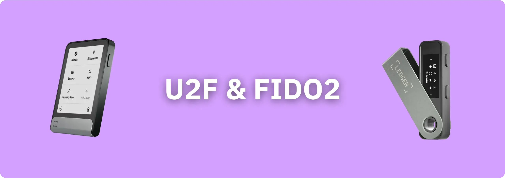
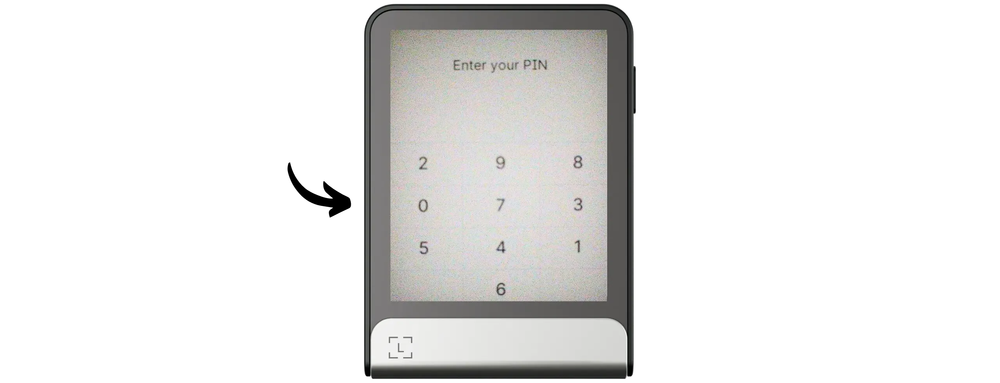
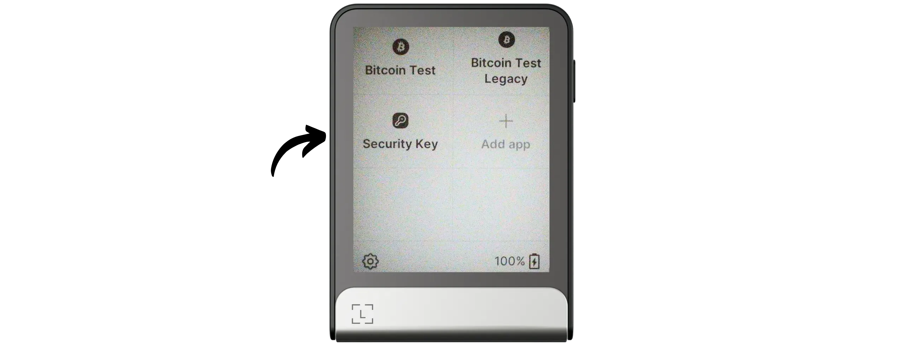
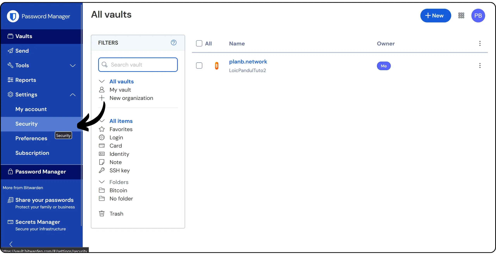
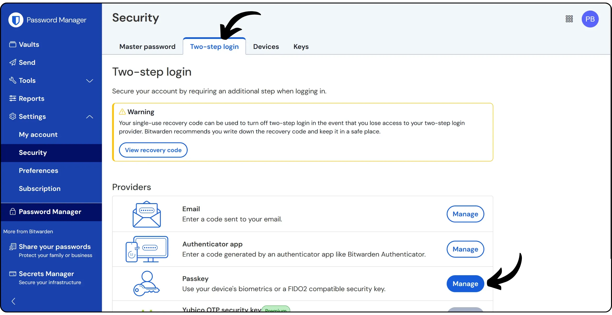
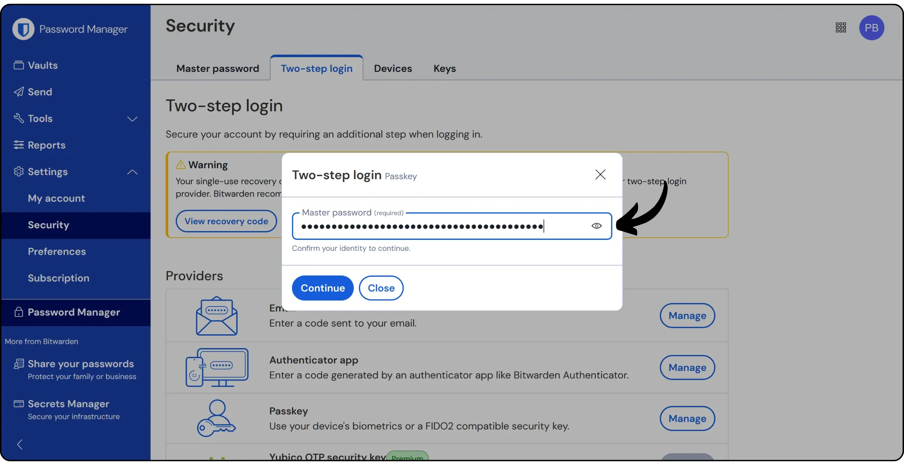
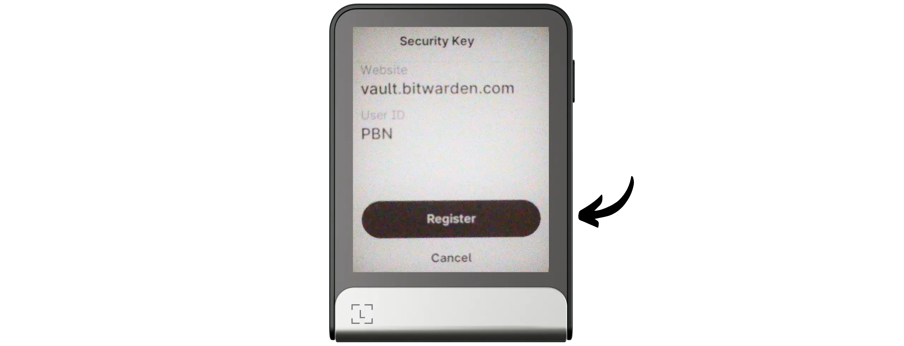
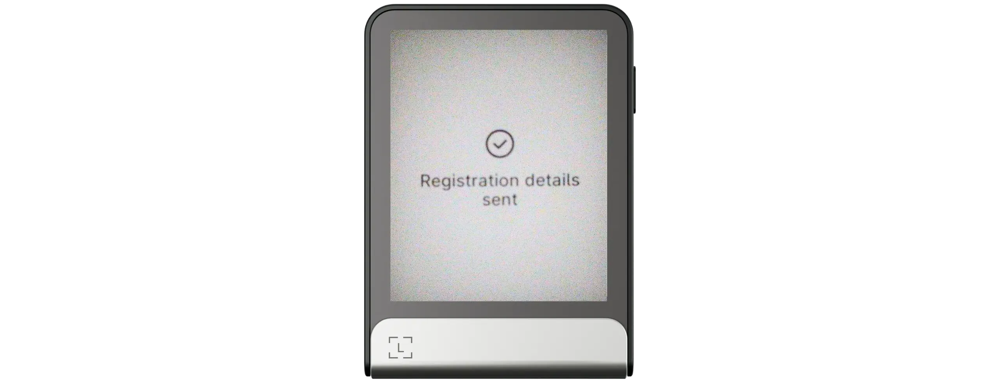
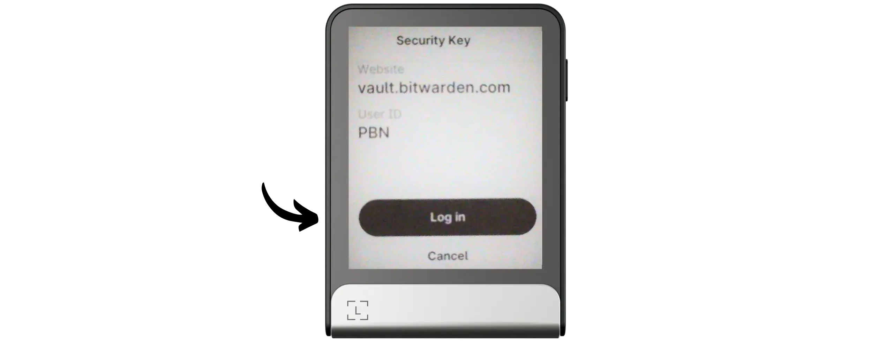

Ledger 设备是硬件钱包，最初设计用于保护 Bitcoin Wallet 的安全，但它们也具有高级选项，可在网络上进行强身份验证。由于与**U2F**和**FIDO2**协议兼容，它们可以通过设置第二个身份验证因素，确保您访问在线账户的安全。

U2F（通用第二因素）协议由谷歌和 Yubico 于 2014 年推出，随后由 FIDO 联盟进行了标准化。它可以在登录时添加第二个物理验证因素（2FA）。激活后，除了传统的密码外，用户还必须通过按下 Ledger 上的按钮来批准每次连接到其账户的尝试。在这种情况下，Ledger 的工作方式类似于 Yubikey。U2F 实际上是 FIDO2 标准的一个子组件，包含了 FIDO2 标准，同时带来了重大改进，包括对现代浏览器的本机支持和认证密钥管理的更大灵活性。

这些方法基于非对称加密技术：不传输秘密数据，使网络钓鱼或拦截攻击无效。目前，许多在线服务都支持 U2F 和 FIDO2。

在本教程中，我们将向您介绍如何激活 U2F 和 FIDO2，以便使用 Ledger 进行双因素身份验证。

**注：** 所有配备最新固件的 Ledger 设备都支持 U2F 和 FIDO2：Nano X 和 Nano S classic 从 2.1.0 版开始，Nano S Plus 从 1.1.0 版开始。Stax 和 Flex 型号原生兼容。

## 安装 Ledger 安全密钥应用程序

如果您使用的是 Ledger 设备，您可能知道仅固件本身并不包含管理加密钱包所需的所有功能。例如，要使用 Bitcoin Wallet，您需要安装 "*Bitcoin*"应用程序。同样，要管理 MFA 密钥，您需要安装 "*安全密钥*"应用程序。

开始之前，请确保您已在 Ledger 上设置了 Bitcoin Wallet。正确保存您的 Mnemonic 非常重要，因为用于 2FA 的密钥来自该 Mnemonic。如果您的 Ledger 丢失或损坏，您可以通过在另一个 Ledger 设备上输入 Mnemonic 短语来恢复对密钥的访问（目前，Ledgers 还不支持 "*无密码*"模式下的 FIDO2 识别码，因此没有常驻识别码）。

将 Ledger 与电脑连接并解锁。

要安装应用程序，请打开 [Ledger Live] 软件 (https://www.Ledger.com/Ledger-live)，然后进入 "*我的 Ledger*"选项卡。找到 "*安全密钥*"应用程序并将其安装到设备上。

现在，"*安全密钥*"应用程序应与 Ledger 上安装的其他应用程序一起出现。

单击应用程序，使其处于打开状态，以便进行教程的下一步操作。

## 使用 U2F/FIDO2 和 Ledger 进行 2FA 验证

使用双因素身份验证访问您要保护的账户。例如，我要使用 Bitwarden 账户。你通常可以在服务设置中的 "*身份验证*"、"*安全*"、"*登录*"或 "*密码*"选项卡下找到 2FA 选项。

在 "双因素身份验证 "部分，选择 "*密钥*"选项（术语可能因网站而异）。

通常会要求您确认当前密码。

给你的安全密钥起个名字，方便识别，然后点击 "*Read Key*"（读取密钥）。

您的账户详细信息将显示在 Ledger 显示屏上。按 "*注册*"按钮确认（或同时按两个按钮，取决于您使用的型号）。

访问密钥已成功注册。

注册此安全密钥。

从现在起，当您登录账户时，除了常规的密码外，还会被要求连接您的 Ledger。

然后，您可以按 Ledger 显示屏上的 "*登录*"按钮确认身份验证（或同时按两个按钮，具体取决于您使用的型号）。

使用 Hardware Wallet Ledger 进行双因素身份验证的好处是，您可以通过 Mnemonic 短语轻松恢复密钥。除基本备份外，您还可以使用激活 2FA 的各服务提供的紧急代码。如果丢失了安全密钥，紧急代码可以让您连接到自己的账户。因此，在必要时，它可以取代 2FA 进行连接。

例如，在 Bitwarden 上，您可以点击 "*查看恢复代码*"来获取该代码。

我建议你把这个密码和你的主密码放在不同的地方，以防止它们一起被盗。例如，如果您的密码保存在密码管理器中，那么请将 2FA 紧急代码单独保存在纸上。

如果用于 2FA 身份验证的 Ledger 丢失，这种方法可为您提供两级备份：第一级备份是使用 Mnemonic 短语备份所有账户，第二级备份是使用紧急代码备份特定账户。不过，重要的是**不要混淆 Mnemonic 和紧急代码的作用**：

- 使用 12 或 24 个字符的 Mnemonic 短语，您不仅可以访问所有账户上用于 2FA 的密钥，还可以访问用 Ledger 加密的比特币；
- 紧急代码只允许您在相关账户上暂时绕过 2FA 请求（在本例中，只允许在 Bitwarden 上绕过）。

恭喜您，现在您已经掌握了如何使用 Ledger 进行 MFA！如果您觉得本教程有用，请在下方留下 Green 的大拇指，我将不胜感激。请随时在您的社交网络上分享本教程。非常感谢

我还想推荐另一篇教程，其中我们介绍了 U2F 和 FIDO2 身份验证的另一种解决方案：

https://planb.network/tutorials/computer-security/authentication/security-key-61438267-74db-4f1a-87e4-97c8e673533e