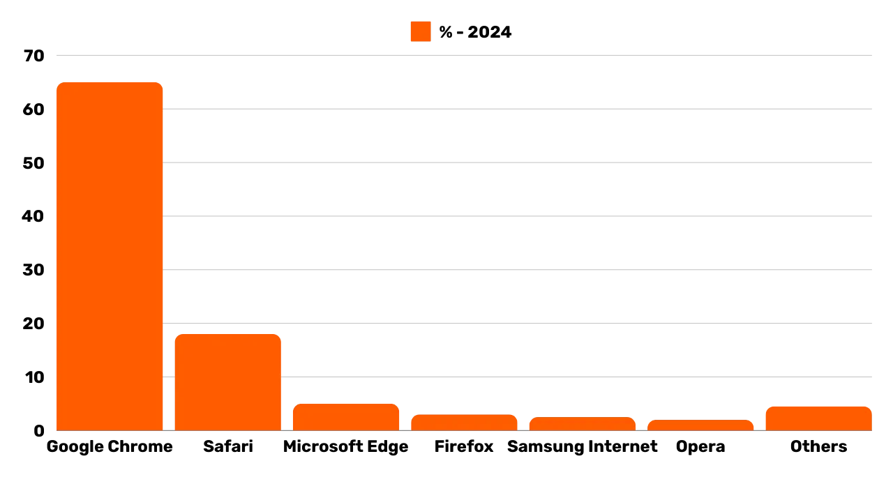
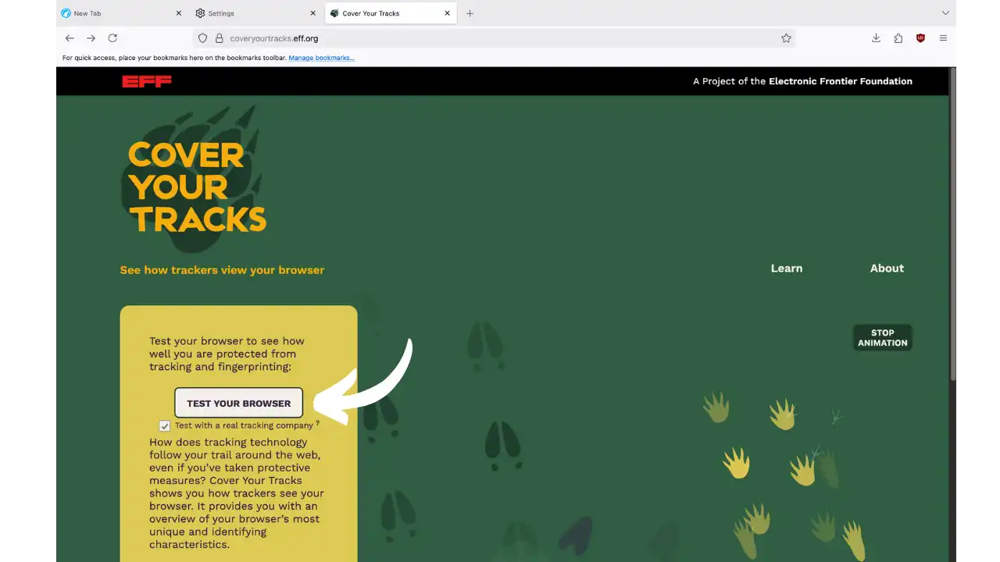
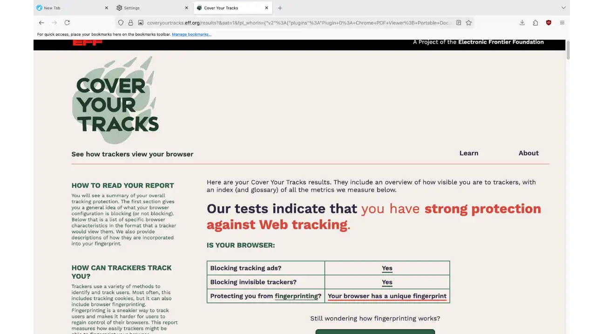
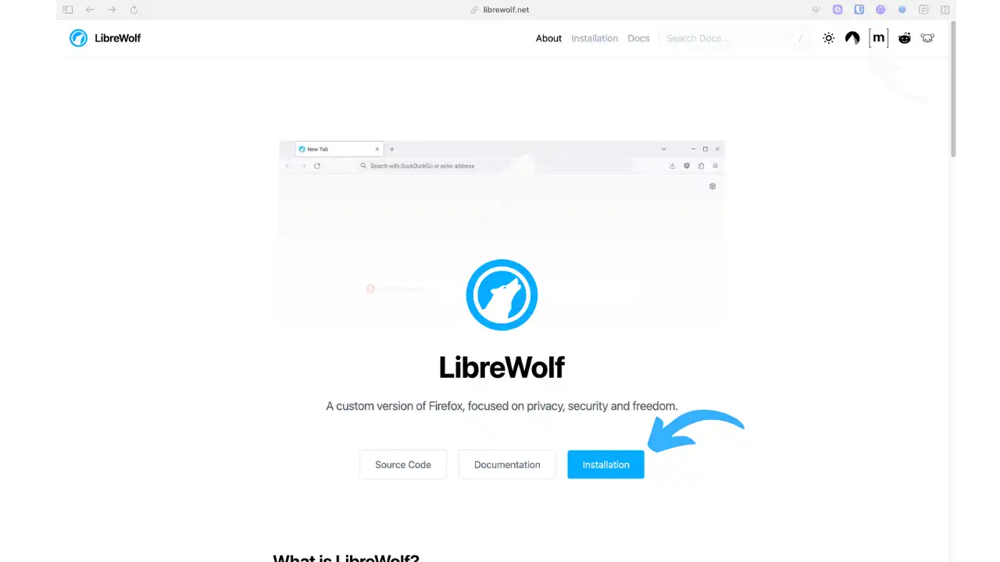
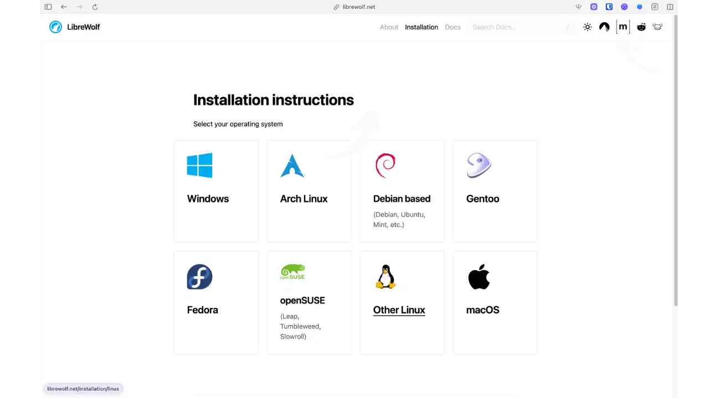
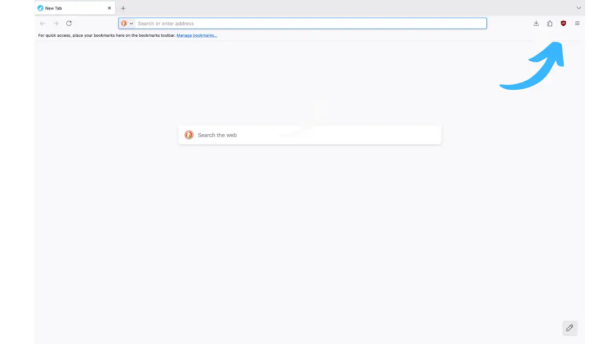
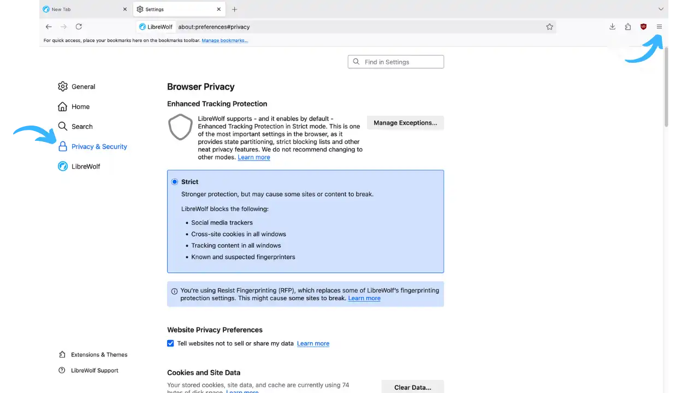
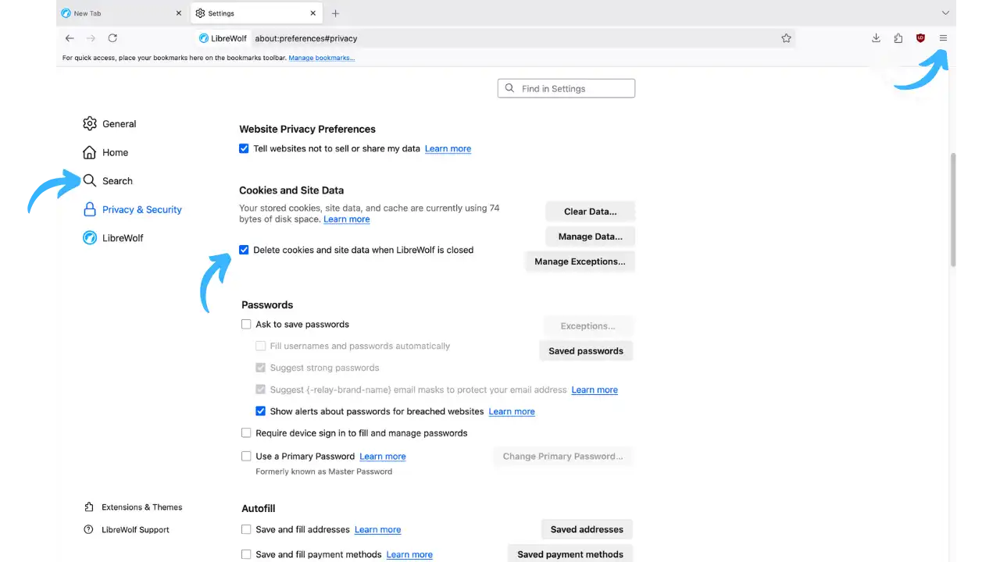

すべてのクリック、すべての検索、すべての訪問サイト：あなたのウェブブラウザは、世界的な商業監視システムを養う洗練された密告者になっている。30億人以上が使用しているGoogle Chromeは、あなたの日々のブラウジングを広告大手のための有益なデータに変えてしまう。Firefoxでさえ、「倫理的な」ブラウザという評判とは裏腹に、デフォルトで遠隔測定メカニズムが作動し、あなたの閲覧習慣をMozillaに送信している。


この現実は本質的な問題を提起している。それは、常にスパイされ、プロファイリングされることなく、インターネットを自由にブラウズすることは可能なのだろうか？幸いなことに、ユーザーを関心の中心に戻すコミュニティ・プロジェクトのおかげで、答えはイエスである。


LibreWolfは、このデジタル抵抗の哲学を体現している。独立系開発者のコミュニティが考案したこのブラウザは、Firefoxをオンライン監視に対する真の盾に変える。市販のブラウザがあなたの注目を独占しようとするのに対し、LibreWolfはその逆を行く。流動的でモダンなブラウジング体験を維持しながら、あなたを追跡者から見えなくするのだ。


このチュートリアルでは、LibreWolfがどのようにあなたのネットサーフィンを変えるのか、パフォーマンスやWebの互換性を犠牲にすることなく、トラッキングからしっかりと保護する方法をご紹介します。





*ウェブブラウザの市場シェア：Chromeが市場の65％を占め、SafariとEdgeがそれに続く。この圧倒的なシェアは、ウェブの多様性とプライバシー*に疑問を投げかけている。


## リブレウルフの紹介


**FreeWolf**は、Mozilla Firefoxから派生したオープンソースのウェブブラウザで、フリーソフトウェア愛好家の独立したコミュニティによって開発・保守されています。その主な目的は、ユーザーのプライバシー、セキュリティ、自由を重視したブラウジングを提供することです。


具体的には、LibreWolfはFirefoxのGeckoエンジンを使っているが、根本的に異なる哲学を持っている。Firefoxがプライバシーと使いやすさのバランスを取らなければならないのに対し、LibreWolfはデフォルトでプライバシーを重視する。このプロジェクトでは、あなたのプライバシーを侵害する可能性のあるもの（遠隔測定、データ収集、スポンサーモジュール）を取り除くと同時に、強化されたセキュリティ設定を統合しています。


### 目的：プライバシーと自由


LibreWolfは、ブラウザのセキュリティを強化しながら、トラッキングやフィンガープリンティングからの保護を最大化することを目的としています。主な目的は以下の通りです：


- Firefoxのすべての遠隔測定とデータ収集を排除する
- 独自のDRMモジュールなど、ユーザーの自由**に反する機能を無効にする。**
- **プライバシー/セキュリティ設定**と特定のパッチを最初から適用する。
- コミュニティ開発は、商業的利益からの透明性と独立性を保証する。


つまり、LibreWolfは「プライバシーが最優先されるのであれば、Firefoxがそうであったであろうように」、つまり追加設定なしでデフォルトであなたを尊重するブラウザであることを提示しているのだ。


### 主な特徴


LibreWolfは最初から、プライバシーを重視した様々な機能を提供しています：


**テレメトリーやデータ収集は一切行いません:** ChromeやFirefoxのように、利用状況の統計を送信することはありませんが、LibreWolfはあなたのブラウジングからデータを収集することは一切ありません。クラッシュレポートも、ユーザー調査も、スポンサーによる提案もありません。


**LibreWolfは、uBlock Origin拡張機能をネイティブに統合しています。デフォルトでは、LibreWolfはオンラインであなたを追跡する可能性のあるもの（押し付けがましい広告、追跡スクリプト、暗号通貨Mining）を積極的にフィルタリングします。**


**デフォルトのプライベート検索エンジン:** LibreWolfのデフォルトの検索エンジンはDuckDuckGoです。他のプライバシー重視の検索エンジン(Searx, Qwant, Whoogle)も利用できます。


**フィンガープリント対策強化:** フィンガープリントは、クッキーがなくてもブラウザの設定によってブラウザを一意に特定することができます。これに対抗するため、LibreWolfはTorプロジェクトのRFP(Resist Fingerprinting)技術を有効にし、ブラウザを可能な限り一般的なものにします。テストによると、coveryourtracks.eff.orgのようなツールでは、標準的なFirefoxのユニーク度は90%程度ですが、LibreWolfでは10～20%程度です（この数値は目安であり、ソフトウェアやハードウェアの構成、インストールされている拡張機能によって異なる場合があります）。





**EFFテストページ[Cover Your Tracks](https://coveryourtracks.eff.org/)をTEST YOUR BROWSERボタンで表示します。このページはトラッカーとフィンガープリンティングに対する保護を評価するために使用されます。**





*Cover Your Tracksのテスト結果。というメッセージが表示され、LibreWolf.*の保護機能が有効であることがわかります。


**LibreWolfは、デフォルトで厳格なセキュリティ設定を有効にしています。** Firefox の Enhanced Tracking Protection は Strict レベルに設定され、何千ものトラッカー、サードパーティの Cookie、悪意のあるコンテンツをブロックします。また、サイトとクッキーの分離（*Total Cookie Protection*）を有効にしてドメインごとにデータを分割し、WebRTCを制限（*ICEの候補を制限*し、プロキシが存在する場合はプロキシ経由でルーティング）してIP Address漏えいのリスクを低減します。


**高速なエンジンアップデート:** このプロジェクトは、Firefox の開発に非常に密接に追従しています：LibreWolf は常に最新の安定版 Firefox をベースにしており、メンテナンス担当者は Firefox の公式リリースから 24 時間から 72 時間以内に新しいバージョンをリリースするよう努めています。


## メリットとデメリット


### メリット


- **テレメトリーや不要な接続はありません:** LibreWolfは使用データを送信しません。


- オープンソースとコミュニティベース：**プロジェクトは100％オープンソースで、ボランティアによって維持されている。この独立性により、いかなる広告モデルも開発に影響を与えないことが保証されています。**


- LibreWolfは、あなたの貴重な時間を節約します。Firefoxの設定を強化するために何時間も費やす必要はありません。


- ネイティブ広告ブロッカー/トラッカー: **uBlock Originが標準で統合されているので、広告やバグから身を守るために何もする必要はありません。**


- **優れたフィンガープリント対策:** RFPと多数のプライバシー設定により、LibreWolfはウェブ上のあなたのデジタルフットプリントを大幅に削減します。


- **パフォーマンスの向上と軽量化:** テレメトリーや特定の非本質的な機能を削除することで、LibreWolfは標準的なFirefoxよりもわずかに速く、消費電力も少なくなっています。


### 欠点と限界


- 自動アップデートは組み込まれていません。新しいバージョンがリリースされたらすぐにインストールしてください。


- **特定のサービスとの互換性の低下:** LibreWolfは非常に厳格な設定のため、特定のウェブサイトで問題が発生する可能性があります。LibreWolfはデフォルトでWidevine DRMを無効にしているため、NetflixとDisney+のストリーミングプラットフォームは動作しません。


- 組み込みの匿名ネットワークはありません: **Tor Browserとは異なり、LibreWolfはTorやVPN経由でトラフィックをルーティングしません。ネットワークの匿名性が必要な場合は、手動でプロキシ/VPNを設定する必要があります。**


- **非永続的なクッキーとセッション(デフォルト):** LibreWolfは機密保持のため、ブラウザを閉じるたびにクッキー、履歴、サイトデータを削除します。ログインするたびに、再度アカウントにログインする必要があります。


- **モバイル版やクラウド同期はありません:** LibreWolfはデスクトップ（Windows、Linux、macOS）でのみご利用いただけます。モバイルアプリケーションはありませんので、アカウントやブックマークをクラウド経由で同期することはできません。


## LibreWolfのインストール


**公式サイト:** [librewolf.net](https://librewolf.net)


LibreWolfはすべての主要なデスクトップOSでご利用いただけます：Linux、Windows、macOS。LibreWolfをダウンロードするには、公式ウェブサイトをご覧ください：





*LibreWolf のホームページ (librewolf.net) には、ブラウザのロゴ、青いインストールボタン、ソースコードとドキュメントのリンクが表示されています。大きな青い矢印はインストールボタンを指しています。*


Installation "ボタンをクリックすると、お使いのオペレーティングシステムの詳細な説明が表示されます：





*LibreWolf.*ダウンロードのオペレーティングシステム選択ページ


インストール方法はOSによって異なります：


### Linuxの場合


LibreWolf は多くのディストリビューション用のビルドを提供しています。Debian/Ubuntuとその派生版では、公式のAPTリポジトリが利用できます。また、LibreWolfはFlathubのFlatpakで公開されています：


```
flatpak install flathub io.gitlab.librewolf-community
```


### ウィンドウズ


公式ウェブサイトからインストーラー（.exe）をダウンロードするか、.exeを使用してください：


- **Chocolatey:** `choco install librewolf`
- **WinGet:** `winget install librewolf`


### macOSの場合


LibreWolfはMac用の.dmgパッケージとして提供されています。公式サイトからディスクイメージをダウンロードし、LibreWolfアプリケーションをアプリケーションフォルダにドラッグ＆ドロップしてください。または、Homebrew経由でインストールすることもできます。


## 設定と最初の使用


初回起動時には、おなじみのFirefox Interfaceが表示されますが、トップページには検索バーのみが表示され、スポンサードサーチは表示されません。ツールバーにはuBlock Originのアイコンが表示され、ブロッカーが有効であることを示します。





**LibreWolfのホームページの拡張機能とメニュー。右上の青い矢印はメニューアイコン(3本の横棒)を示しています。**


LibreWolfは自動的にあなたのページを "strict"（トラッキング防止）モードで読み込み、デフォルトの検索エンジンはDuckDuckGoになります。トラッキングテストサイト(例: amiunique.org)にアクセスし、トラッキングの足跡を観察してみてください。


### プライバシー設定


LibreWolfはプライバシー保護に最適な設定になっています。メニュー → オプション → プライバシーとセキュリティで、LibreWolfはトラッキング保護強化モードに設定されています：厳密]に設定されています。このモードは、.NET Frameworkをブロックします：


- サイト間トラッカー
- 第三者クッキー
- 既知のトラッキング・コンテンツ
- クリプトマイニング
- デジタル指紋検出器





*LibreWolf.*のセキュリティ設定を表示する「セキュリティとプライバシー」タブページ


WebRTCは無効（IPリーク防止）、Total Cookie Protectionは有効。TelemetryとFirefoxの調査は完全に無効化されています。


### クッキーと履歴の管理


デフォルトでは、LibreWolfは終了するたびにクッキーとローカルストレージを削除します。この動作が気になる場合は、プライバシーとセキュリティ → クッキーとサイトデータで、「LibreWolfを閉じるときにクッキーとサイトデータを削除する」のチェックを外してください。





*同じページの少し下には、ブラウザを閉じたときにクッキーを削除するオプションが表示されている*。


### 便利な拡張機能の追加


原則として、LibreWolfは不要な拡張機能を追加することを推奨していません。とはいえ、評判の良い拡張機能はあなたの使い勝手を向上させます：


- Firefox Multi-Account Containers** (by Mozilla): 区分化されたブラウジングのためのFirefox Multi-Account Containers** (by Mozilla)
- **Decentraleyes**または**LocalCDN**で、一般的なライブラリをローカルに提供する。


特に "無料VPN "の拡張機能や怪しげなプロキシは避けてください。


## 普段使い


### 毎日のウェブ閲覧


LibreWolfを日々のインターネット活動にご利用ください。他のブラウザーとの大きな違いは、広告の痕跡をほとんど残さないことです。uBlockのフィルタリングリストのおかげで、多くのサイトで「クッキーを受け入れる」バナーが消えます。


### プライベートタブを使用して区分けする


LibreWolfはセッションの終了時にすべてを削除しますが、セッション中に特定のタスクのためにプライベートブラウザウィンドウ(Ctrl+Shift+P)を開くと、特定のIDを分離するのに便利です。


### マルチアカウントコンテナの活用


拡張機能Multi-Account Containersをインストールすることで、アクティビティをサイロ化することができます。例えば、銀行サイト用の "Banking "コンテナ、Facebook/Twitter用の "Social Networks "コンテナなどを定義できます。各コンテナには独自のクッキー、セッション、隔離されたストレージがあります。各コンテナは独自のクッキー、セッション、隔離されたストレージを持ちます。


### サイトごとのきめ細かな権限管理


LibreWolfでは、サイトへのアクセス許可（位置情報、カメラ、マイク、通知）をケースバイケースでコントロールできます。信頼できるサイト、必要なサイトのみにアクセス許可を与えることができます。


## LibreWolfのベストプラクティス


1. **LibreWolfを最新の状態に保つ:** 新しいバージョンがないか、特にFirefoxの安定版リリース後は定期的にサイトをチェックしてください。


2. **個人的なIDとプライベートなブラウジングの混在を避ける：**理想的には、機密性の高い調査を行っているのと同じセッションで、個人的なアカウントでログインすべきではありません。


3. **LibreWolfに余計な拡張機能を追加しないでください。**


4. **VPNやTorプロキシを併用する:** LibreWolfは、ISPに対して匿名化することはできません。ネットワークの匿名性を確保するためには、信頼できるVPNの後ろでLibreWolfを使うことができます。


5. **重要なデータを保存する：**ブックマーク、ローカルに保存されている場合はパスワード。ブラウザの基本的なパスワードマネージャーではなく、外部のパスワードマネージャー（KeePassXC、Bitwarden）を検討してください。


## 他のブラウザとの比較


LibreWolfは、プライバシーを重視するブラウザーの「ツールボックス」の一部です：


**LibreWolfとFirefoxの比較:** LibreWolfは、すでにハード化されており、遠隔測定は一切ありません。Firefoxは、マルチデバイス同期と非常に大規模なユーザーベースの利点を保持していますが、LibreWolfのレベルの機密性を達成するために手動設定が必要です。


**BraveはChrome/Chromiumのコードを使用し、オプションの広告プログラムを通じてビジネスモデルを統合している。LibreWolfはFirefoxのコミュニティForkであり、Mozillaの自由なエコシステムを維持し、Googleとのつながりはない。**


**LibreWolfとTor Browserの比較:** Tor Browserは、強力な監視の中で匿名性を確保するためにはかけがえのないものですが、日常的に使うには遅くて快適ではありません。LibreWolfは古典的なウェブを日常的にブラウズするには、はるかに高速で実用的です。


**LibreWolf vs Mullvad Browser:** Mullvad Browserは標準化をさらに進めましたが、その代償として使い勝手が低下しました（ログインクッキーを保持することが不可能）。LibreWolfは、非常にプライベートでありながら、日常的に使えるというバランスをとっています。


## 結論


LibreWolfは、Torのような極端な匿名性を求めることなく、超プライベートな「日常的」ブラウザをお探しの方に最適なソリューションです。活動家、ジャーナリスト、開発者、パワーユーザーなど、広告トラッキングやビッグテックから逃れつつ、クラシックなウェブブラウジング（高速でモダンなサイトと互換性がある）を求める人には理想的な選択肢です。


自動アップデートができない、特定のサービスとの互換性が低いなどの制限はありますが、LibreWolfは、デジタルプライバシーを管理したい人にとって、貴重なツールです。その使いやすさとデフォルトの設定は、プライバシーを重視するユーザーにとって賢明な選択となるでしょう。


## リソース


### 公式文書


- [リブレウルフ公式サイト](https://librewolf.net)
- [ソースコードはCodebergに掲載](https://codeberg.org/librewolf)
- [公式FAQ](https://librewolf.net/docs/faq)


### ガイドと比較


- [プライバシーガイド](https://www.privacyguides.org/en/desktop-browsers/)
- [プライバシー比較テスト】(https://privacytests.org)


### 地域支援


- [Subreddit r/LibreWolf](https://www.reddit.com/r/LibreWolf/)
- [カナルマトリックス・リブレウルフ](https://matrix.to/#/#librewolf:matrix.org)