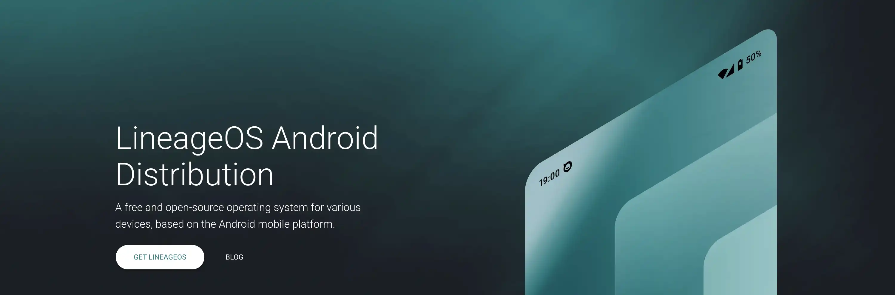

Les systèmes Android classiques préinstallés sur nos smartphones posent plusieurs problèmes bien connus : intégration intensive des services Google entraînant un suivi permanent des données, applications sponsorisées indésirables (bloatware) imposées par les constructeurs, et abandon du suivi des mises à jour après quelques années, condamnant des appareils encore fonctionnels à l'obsolescence programmée.

LineageOS se présente comme une réponse élégante à ces problèmes. Issu de la communauté open source et successeur direct de CyanogenMod (arrêté fin 2016), LineageOS est un système d'exploitation mobile libre basé sur Android qui redonne à l'utilisateur le contrôle de son smartphone. Lancé officiellement en décembre 2016, le projet compte aujourd'hui plus de 4,4 millions d'installations actives dans le monde et prend en charge des centaines de modèles de téléphones de plus de 20 marques différentes.

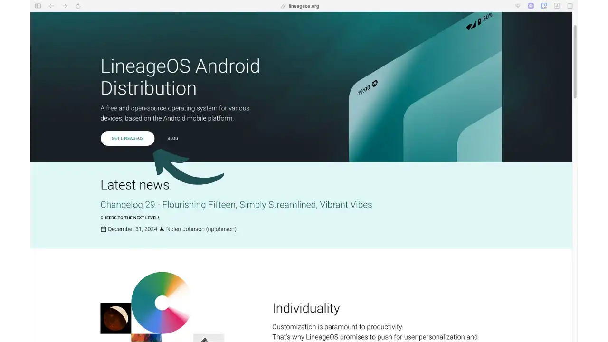

*Site officiel LineageOS présentant le projet et ses objectifs*

## Qu'est-ce que LineageOS ?

### Philosophie et objectifs

LineageOS est un système d'exploitation mobile open source basé sur l'Android Open Source Project (AOSP), développé par une vaste communauté de contributeurs bénévoles à travers le monde. Sa devise officieuse pourrait être "Votre appareil, vos règles" : le projet vise à prolonger la durée de vie des smartphones tout en offrant une expérience Android épurée et respectueuse de la vie privée.

Le projet est né des cendres de CyanogenMod, l'une des ROM Android alternatives les plus populaires de l'histoire. Quand CyanogenMod Inc. a fermé ses portes en décembre 2016, la communauté s'est mobilisée pour créer LineageOS, conservant l'esprit d'innovation et la philosophie du logiciel libre qui caractérisaient son prédécesseur.

Contrairement aux distributions Android des constructeurs, LineageOS ne préinstalle aucune application Google par défaut et élimine complètement le bloatware. L'utilisateur démarre avec un système minimaliste incluant uniquement les applications essentielles (téléphone, messages, appareil photo, navigateur) et choisit librement ce qu'il souhaite ajouter par la suite.

### Impact et communauté

Les statistiques officielles révèlent l'ampleur du projet : avec plus de 4,4 millions d'installations actives réparties dans 224 pays, LineageOS représente l'une des alternatives Android les plus adoptées au monde. Le Brésil arrive en tête avec plus de 2 millions d'utilisateurs, suivi de la Chine et des États-Unis, démontrant l'attrait universel pour un Android libre et personnalisable.


## Fonctionnalités principales

### Interface et expérience utilisateur

**Android pur** : LineageOS propose une expérience Android authentique proche de l'AOSP, sans surcouches constructeur ni applications superflues. L'interface reste familière aux utilisateurs Android tout en offrant une fluidité optimale grâce à l'absence de bloatware.

**Sans Google par défaut** : Aucun service Google n'est préinstallé, pour des raisons légales et éthiques. Cette approche "Google-free" garantit un contrôle total sur vos données personnelles et améliore les performances en évitant les services fonctionnant en arrière-plan.

### Personnalisation et sécurité

**Personnalisation avancée** : LineageOS déverrouille de nombreuses options indisponibles sur Android stock : reconfiguration des boutons de navigation, thèmes système personnalisables, profils d'utilisation adaptés aux différents contextes (travail, personnel, jeu).

**Outil Trust** : Fonctionnalité intégrée qui surveille l'état de sécurité de votre appareil et vous alerte sur les menaces potentielles, offrant une visibilité en temps réel sur la sécurité de votre système.

**Mises à jour prolongées** : La communauté LineageOS s'engage à fournir des correctifs de sécurité mensuels, permettant aux appareils abandonnés par leurs constructeurs de continuer à recevoir les derniers patchs de sécurité Android.

## Appareils compatibles

LineageOS prend en charge des centaines d'appareils de plus de 20 fabricants : Samsung, Xiaomi, OnePlus, Motorola, Sony, Google Pixel, Fairphone, et bien d'autres. Cette compatibilité étendue constitue l'un des atouts majeurs du projet face à des alternatives comme GrapheneOS, limitées aux seuls appareils Pixel.

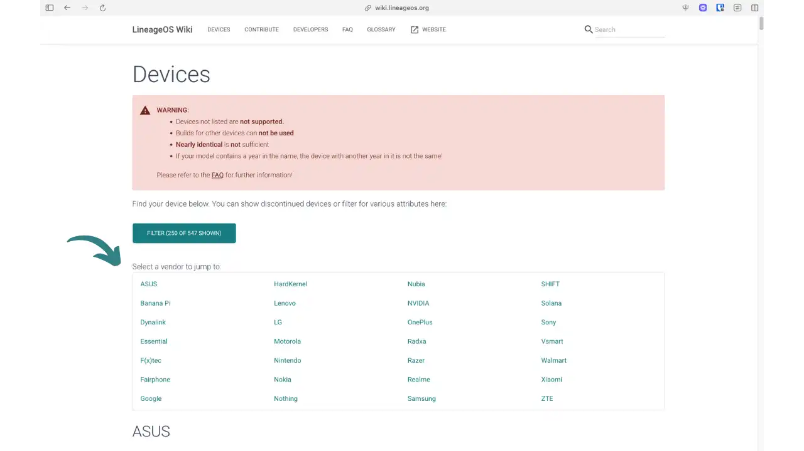

*Page des appareils compatibles LineageOS avec filtre par fabricant*

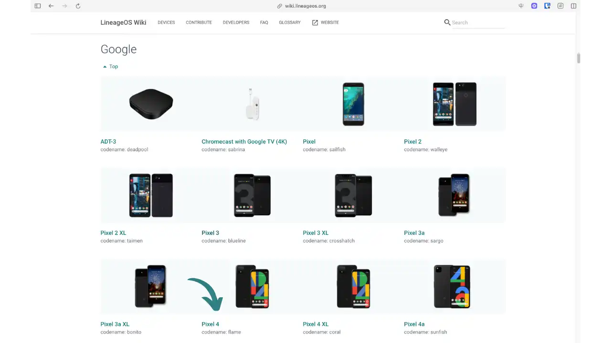

*Appareils Google supportés, incluant le Pixel 4 (nom de code "flame")*

### Appareils populaires

D'après les statistiques officielles, les modèles les plus utilisés incluent des appareils variés couvrant différentes gammes de prix et d'âges, démontrant la capacité de LineageOS à redonner vie à d'anciens smartphones comme à optimiser les plus récents.

### Points cruciaux avant installation

**Bootloader déverrouillable** : Vérifiez que votre fabricant/opérateur autorise le déverrouillage. Certaines marques comme Huawei ont supprimé cette possibilité sur leurs modèles récents, tandis que d'autres imposent des procédures spécifiques.

**Modèle exact** : Il est crucial de télécharger la ROM correspondant précisément à votre appareil. Deux modèles de nom commercial similaire peuvent différer techniquement (Galaxy S10 vs S10 5G par exemple) et nécessiter des images différentes.

**Support évolutif** : Les appareils récents peuvent ne pas être supportés immédiatement, le portage nécessitant qu'un développeur bénévole s'en occupe. Inversement, le support peut s'arrêter si le mainteneur d'un appareil se retire du projet.

## Installation

### Prérequis essentiels

⚠️ **Lisez entièrement ces instructions avant de commencer** pour éviter tout problème !

**Retour au firmware stock (si nécessaire) :**
- **Android Flash Tool** : Utilisez l'outil officiel Google [flash.android.com](https://flash.android.com) pour remettre facilement votre appareil Pixel en version stock Android depuis votre navigateur web (Chrome/Edge requis)
- **Alternative** : Factory images manuelles depuis [developers.google.com/android/images](https://developers.google.com/android/images)

**Tests préalables obligatoires :**
- **Démarrez votre appareil au moins une fois** avec le système stock d'origine
- **Testez toutes les fonctionnalités** : SMS, appels, Wi-Fi, données mobiles
- **Important** : Vérifiez que vous pouvez envoyer/recevoir des SMS et passer/recevoir des appels (y compris via WiFi et 4G/5G). Si ça ne fonctionne pas sur le système stock, ça ne fonctionnera pas non plus sur LineageOS !
- **Appareils récents** : Certains nécessitent d'utiliser VoLTE/VoWiFi au moins une fois sur le système stock pour provisionner l'IMS

**Préparation du système :**
- **Supprimez tous les comptes Google** de votre appareil pour éviter le "Factory Reset Protection" qui pourrait bloquer l'activation
- **Sauvegarde complète** : Le processus effacera intégralement votre téléphone. Sauvegardez photos, contacts, applications et fichiers importants

**Outils ADB et Fastboot :** Suivez le [guide officiel LineageOS](https://wiki.lineageos.org/adb_fastboot_guide#installing-adb-and-fastboot) pour installer les Android SDK Platform Tools. Vérifiez l'installation avec `adb version` et `fastboot --version`.

**Configuration du téléphone :**
- Activez les **Options développeur** : Paramètres > À propos > tapez 7 fois sur "Numéro de build"

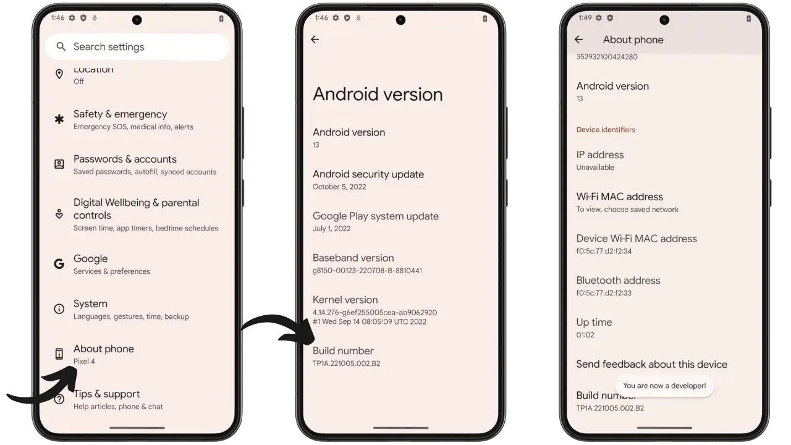

*Navigation dans Paramètres > À propos du téléphone pour activer le mode développeur*

- Activez le **Débogage USB** dans Options développeur
- Activez le **Déverrouillage OEM** (indispensable pour déverrouiller le bootloader)

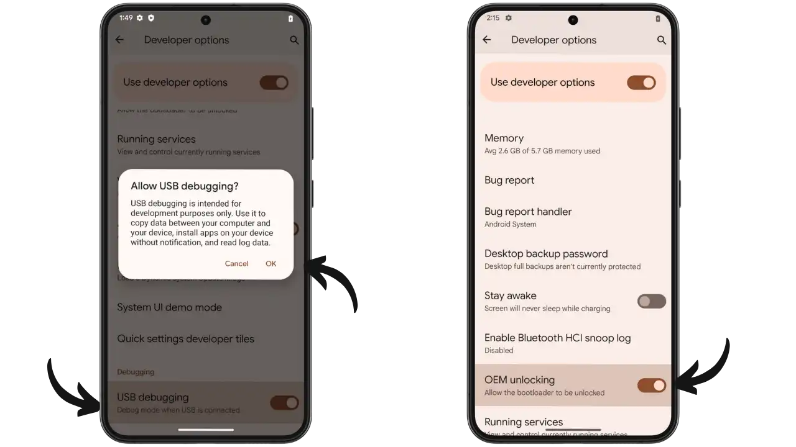

*Activation des Options développeur, du débogage USB et du déverrouillage OEM*

### Installation détaillée

⚠️ **Ces instructions sont spécifiques à LineageOS 22.2. Suivez chaque étape précisément. N'avancez pas si quelque chose échoue !**

#### Étape 1 : Vérification du firmware

**Firmware requis** : Votre appareil doit avoir Android 13 installé avant de continuer (pour Pixel 4). Le firmware fait référence aux images spécifiques au dispositif incluses dans le système stock.

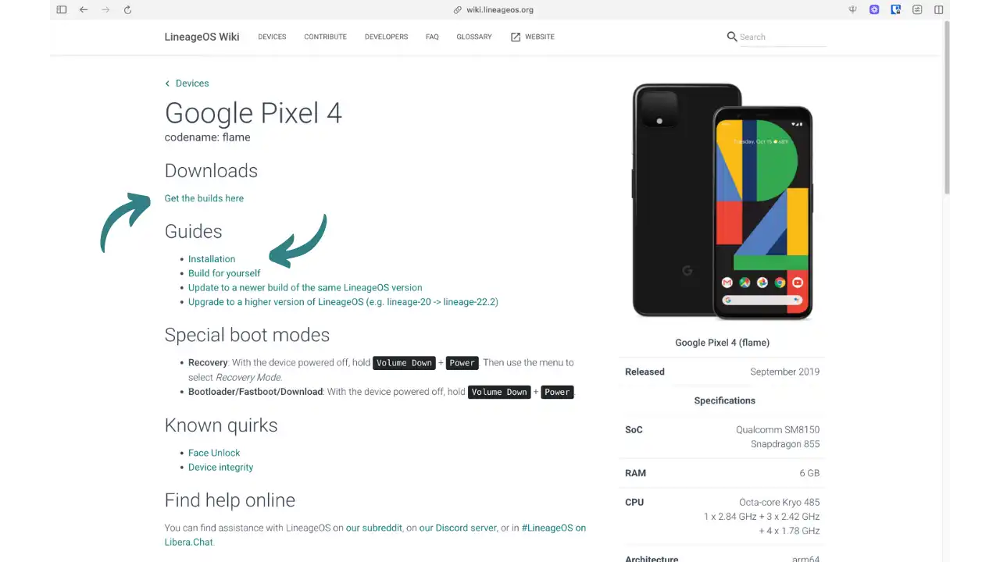

*Page officielle du Pixel 4 avec liens de téléchargement et guides d'installation*

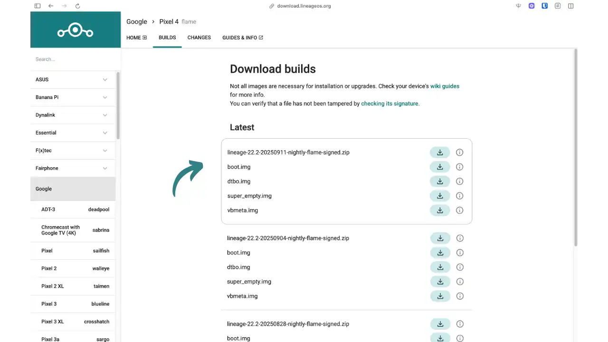

*Page de téléchargement des builds LineageOS et fichiers nécessaires*

**Téléchargements spécifiques au Pixel 4 :**
- **Build LineageOS** : [download.lineageos.org/devices/flame/builds](https://download.lineageos.org/devices/flame/builds)
- **Fichiers requis** : Téléchargez maintenant les 3 fichiers nécessaires depuis cette page (ils seront utilisés dans les étapes suivantes) :
  - `lineage-22.2-YYYYMMDD-nightly-flame-signed.zip` (ROM principale)
  - `dtbo.img` (partition device tree blob)
  - `boot.img` (recovery LineageOS)

⚠️ **Important** : Vérifiez la version Android, pas la version de l'OS du fabricant. Être sur une ROM custom (même LineageOS) ne garantit pas que cette exigence soit remplie.

💡 **Conseil** : En cas de doute sur votre firmware, retournez au système stock avant de continuer !

#### Étape 2 : Déverrouillage du bootloader

⚠️ **Cette étape efface toutes vos données !**

- **Testez la connexion ADB** : Connectez votre appareil en USB et testez avec la commande `adb devices` depuis le terminal de votre ordinateur

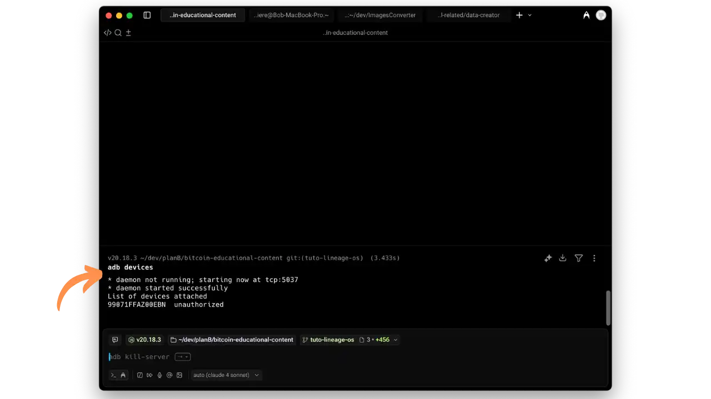

*Vérification de la connexion ADB avec la commande `adb devices`*

- **Autorisez la connexion** sur votre téléphone

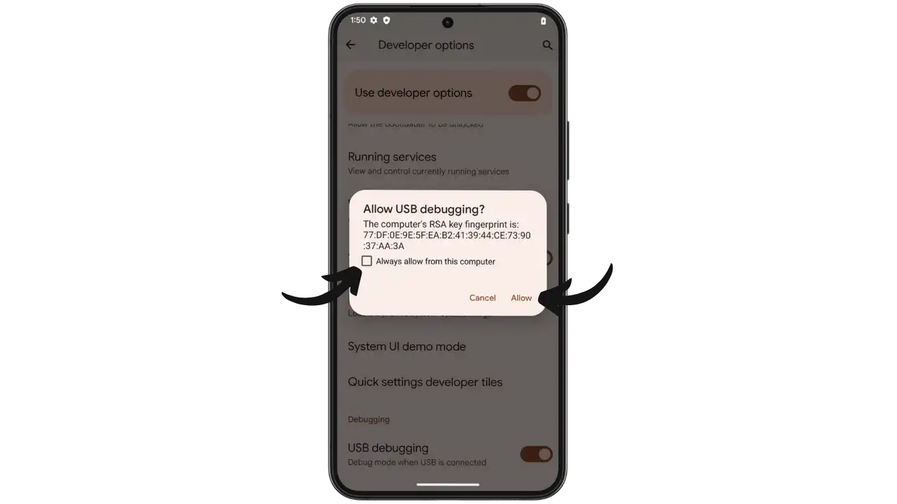

*Autorisation du débogage USB avec empreinte RSA de l'ordinateur*

- **Démarrez en mode bootloader** :
   ```
   adb -d reboot bootloader
   ```
   Ou maintenez **Volume Bas + Power** appareil éteint

- **Vérifiez la connexion fastboot** :
   ```
   fastboot devices
   ```

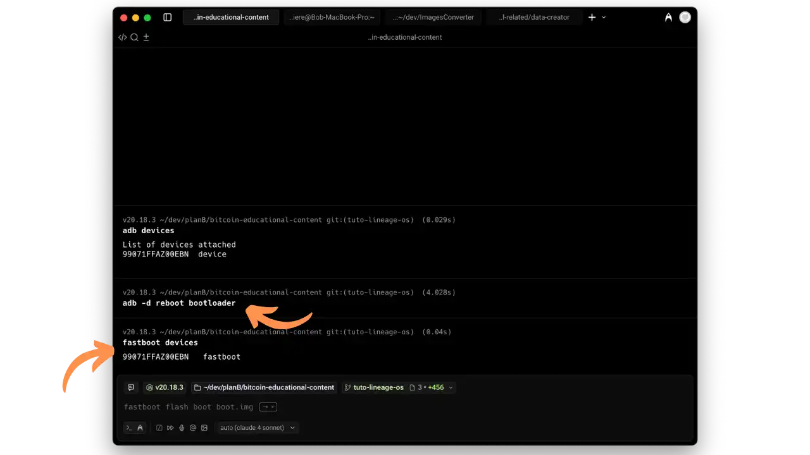

*Commandes fastboot dans le terminal pour vérifier la connexion*

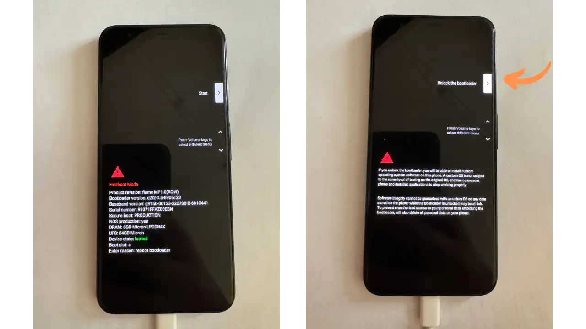

*Écran fastboot du Pixel 4 avec informations système*

- **Déverrouillez le bootloader** :
   ```
   fastboot flashing unlock
   ```
   Sur l'appareil, utilisez les touches Volume pour naviguer et appuyez sur le bouton **Power** pour sélectionner "Unlock the bootloader" et confirmer l'opération

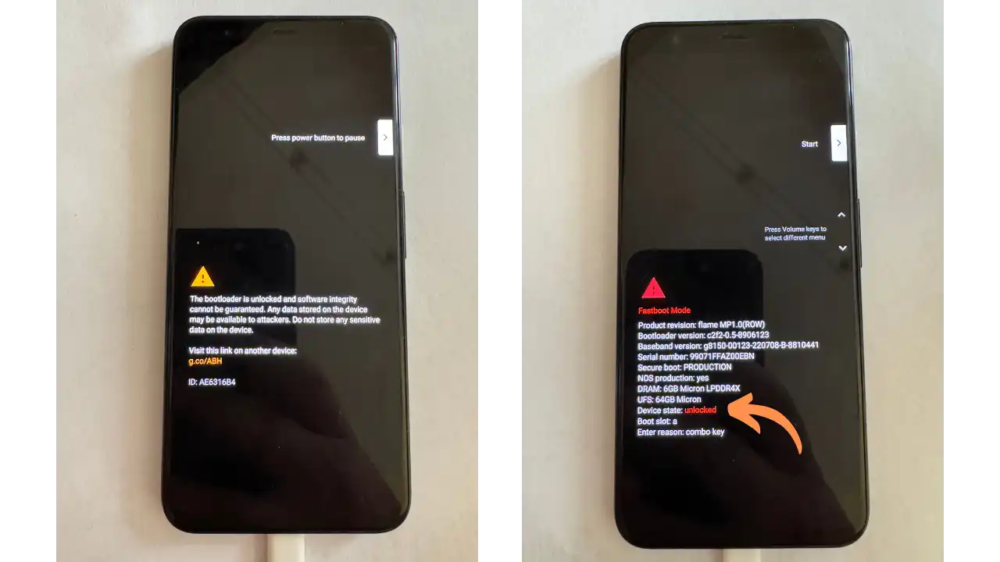

*Confirmation du déverrouillage du bootloader sur l'appareil*

⚠️ **Le téléphone va redémarrer automatiquement** après confirmation du déverrouillage

- **Après le redémarrage automatique**, réactivez le débogage USB dans les options développeur


#### Étape 3 : Flash des partitions additionnelles

⚠️ **Requis pour que le recovery fonctionne correctement**

- **Redémarrez en bootloader** : Volume Bas + Power
- **Flashez** (remplacez `/chemin/vers/` par le dossier où vous avez téléchargé le fichier) :
   ```
   fastboot flash dtbo /chemin/vers/dtbo.img
   ```

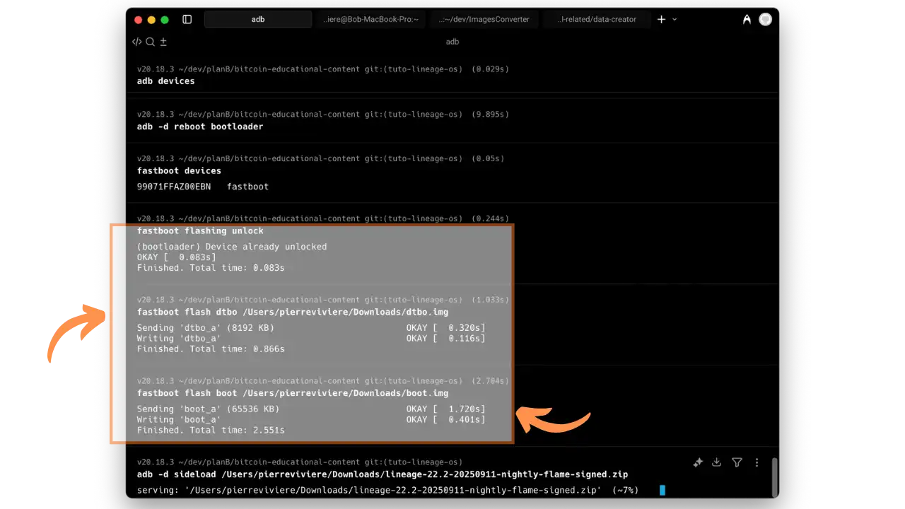

*Flash des partitions dtbo et boot.img via fastboot*

#### Étape 4 : Installation du recovery LineageOS

- **Flashez le recovery** (remplacez `/chemin/vers/` par le dossier où vous avez téléchargé le fichier) :
   ```
   fastboot flash boot /chemin/vers/boot.img
   ```
- **Redémarrez en recovery** pour vérifier

#### Étape 5 : Installation de LineageOS

- **Redémarrez en recovery** : Volume Bas + Power → Recovery Mode

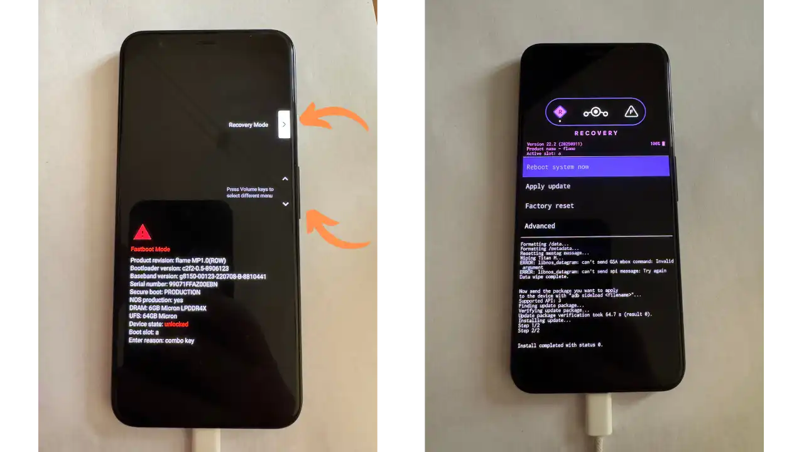

*Interface du recovery LineageOS avec menu principal*

- **Factory Reset** : Tapez "Factory Reset" → "Format data / factory reset"

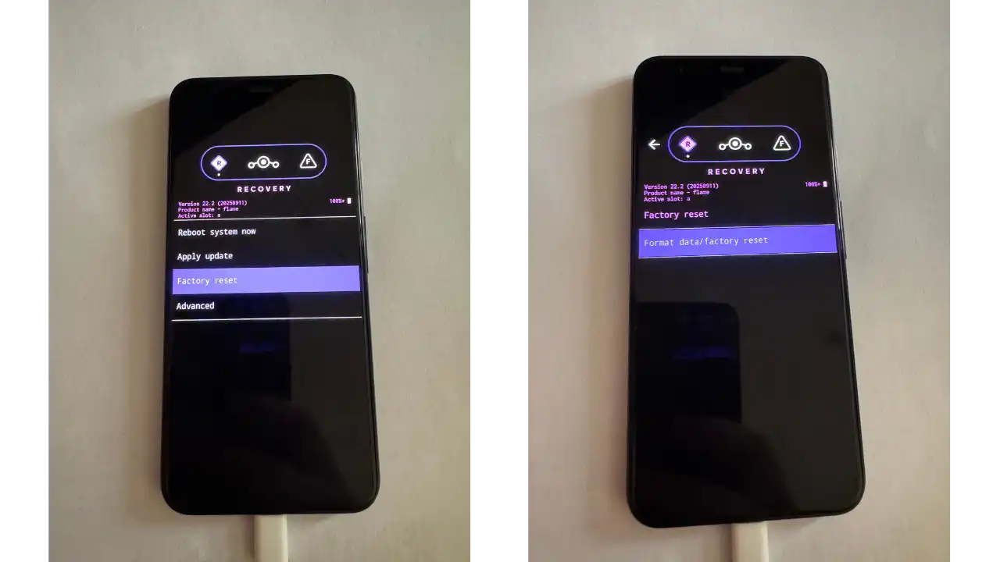

*Processus de factory reset dans le recovery LineageOS*

- **Retournez au menu principal**
- **Sideload LineageOS** :
   - Sur l'appareil : "Apply Update" → "Apply from ADB"
   - Sur PC : `adb -d sideload /chemin/vers/lineageos.zip`

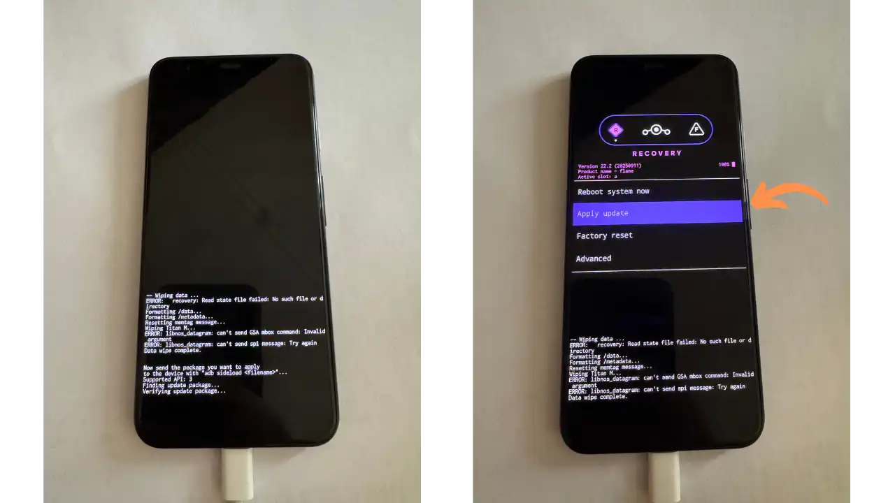

*Sélection "Apply Update" puis "Apply from ADB" dans le recovery*

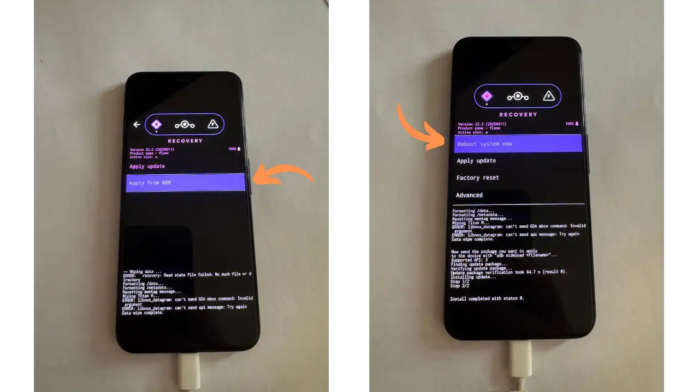

*Installation de LineageOS en cours via sideload*

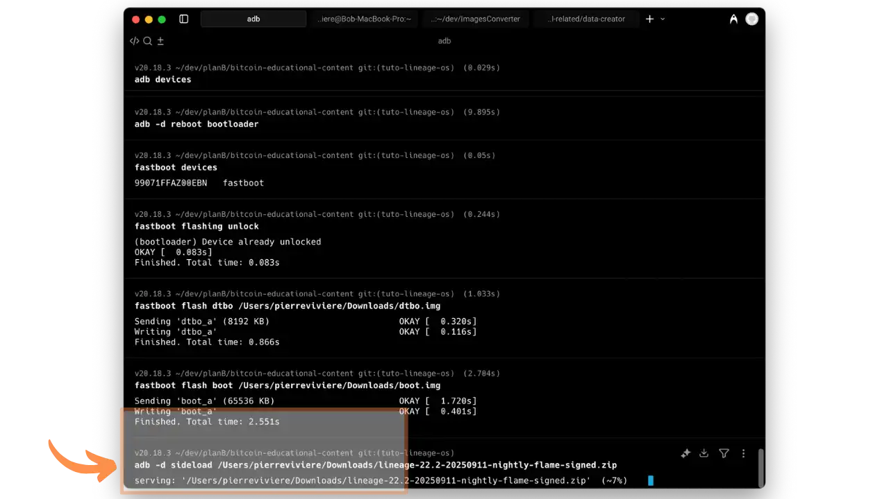

*Commande sideload dans le terminal avec progression de l'installation*

💡 **Normal** : Le processus peut s'arrêter à 47% ou afficher des erreurs "Success" - c'est normal !

#### Étape 6 : Premier démarrage

- **Redémarrez** : "Reboot system now"
- **Premier boot** : Peut prendre jusqu'à 15 minutes

🎉 **Installation terminée !**

### Points d'attention

⚠️ **Avertissement** : LineageOS est fourni "tel quel" sans garantie. Bien que nous nous efforcions de vérifier que tout fonctionne, vous installez ceci à vos propres risques !

**Vérifications critiques :**
- **Compatibilité du firmware** : Vérifiez impérativement la version firmware requise sur la page de téléchargement de votre modèle
- **Ne jamais reverrouiller** le bootloader après installation LineageOS
- **Suivez précisément** les instructions spécifiques à votre appareil

## Configuration et applications

### Premier démarrage
Interface épurée, proche d'Android stock, sans Google. Configuration simple : langue, Wi-Fi, pas de compte requis.

### Applications alternatives

**Sources d'applications sécurisées :**

**F-Droid** : La boutique d'applications open source de référence, préinstallée avec LineageOS for microG ou téléchargeable directement. F-Droid propose exclusivement des logiciels libres vérifiés et compilés de manière transparente, garantissant l'absence de trackers ou de composants malveillants.

**Aurora Store** : Client anonyme pour accéder au Google Play Store sans compte Google. Aurora emprunte des comptes anonymes partagés, permettant de télécharger des applications mainstream tout en préservant votre vie privée.

**Applications alternatives essentielles :**

- **Navigation** : Organic Maps (cartes hors-ligne basées sur OpenStreetMap)
- **Communication** : Signal (messages chiffrés de bout en bout), K-9 Mail (client email libre)
- **Médias** : NewPipe (YouTube sans publicités ni tracking), VLC (lecteur multimédia universel)
- **Productivité** : Nextcloud (cloud auto-hébergeable), Simple Calendar (synchronisation CalDAV)
- **Sécurité** : Bitwarden (gestionnaire mots de passe), Aegis Authenticator (codes 2FA)

Ces applications, pour la plupart disponibles via F-Droid, constituent un écosystème cohérent qui permet de remplacer intégralement les services Google tout en offrant une expérience utilisateur moderne et fonctionnelle.

## Usage et maintenance

### Expérience quotidienne

LineageOS transforme l'expérience Android en privilégiant fluidité et réactivité. L'interface épurée se révèle particulièrement efficace sur d'anciens appareils qui retrouvent une seconde jeunesse, les performances étant généralement supérieures aux ROM constructeur grâce à l'absence d'overlays lourds et de processus superflus.

Les fonctionnalités de base (appels, SMS, photos, navigation) fonctionnent de manière transparente, tandis que les outils de personnalisation permettent d'adapter finement le système aux préférences individuelles sans compromettre la stabilité.

### Système de mises à jour OTA

LineageOS intègre un système de mise à jour Over-The-Air particulièrement simple d'utilisation. Les nouvelles versions sont proposées automatiquement via des notifications, et l'installation s'effectue en quelques clics sans intervention technique complexe. Le processus préserve intégralement vos données et applications installées.

Ces mises à jour régulières constituent un atout majeur, particulièrement pour les appareils abandonnés par leurs constructeurs qui peuvent ainsi continuer à bénéficier des derniers correctifs de sécurité Android.

### Bonnes pratiques recommandées

**Sécurisation post-installation :**
- Configurez un PIN ou mot de passe robuste pour le déverrouillage
- Vérifiez l'activation du chiffrement du stockage (généralement activé par défaut)
- Installez un gestionnaire de mots de passe comme Bitwarden via F-Droid

**Maintenance préventive :**
- Effectuez régulièrement les mises à jour OTA pour la sécurité
- Limitez l'installation d'applications aux sources fiables (F-Droid, Aurora Store)
- Révisez périodiquement les permissions accordées aux applications
- Un redémarrage occasionnel optimise les performances et libère la mémoire

## Avantages et limitations

✅ **Avantages :**
- Confidentialité par défaut (sans tracking Google)
- Compatibilité très large (300+ modèles)
- Performances supérieures (pas de bloatware)
- Mises à jour prolongées sur anciens appareils

❌ **Limitations :**
- Installation technique requise
- Pas d'Android Auto/Google Pay
- Apps bancaires parfois problématiques

## GrapheneOS vs LineageOS : Quelle différence ?

### Approches distinctes

**GrapheneOS** se concentre exclusivement sur la sécurité maximale et ne fonctionne que sur les Google Pixel pour exploiter leurs puces de sécurité dédiées. Le système intègre de nombreuses mitigations avancées contre les exploits et renforce considérablement le sandboxing applicatif.

**LineageOS** privilégie l'équilibre entre sécurité, vie privée et praticité sur un maximum d'appareils. L'approche est plus pragmatique, visant la compatibilité étendue plutôt que la sécurité absolue.

### Gestion des services Google

**GrapheneOS** : Propose un système de "Google Play sandboxé" optionnel. Google Play peut être installé mais fonctionne dans un bac à sable strict, sans privilèges système spéciaux. Cette approche unique permet d'utiliser l'écosystème Google tout en maintenant un contrôle sécuritaire strict.

**LineageOS** : Laisse le choix à l'utilisateur d'installer les services Google (GApps), microG (alternative libre), ou de rester entièrement sans Google. Flexibilité maximale selon les besoins.

### Comparaison technique

| **Aspect** | **GrapheneOS** | **LineageOS** |
|------------|----------------|---------------|
| **Compatibilité** | Pixels uniquement | Centaines d'appareils |
| **Sécurité** | Mitigations avancées | Sécurité AOSP standard |
| **Google Play** | Sandboxé optionnel | Installation classique possible |
| **Installation** | Interface web + USB | Procédure manuelle technique |
| **Philosophie** | Sécurité avant tout | Équilibre et liberté de choix |

### Recommandations d'usage

**Choisissez GrapheneOS** si vous possédez un Pixel, que la sécurité maximale est votre priorité absolue, et que vous acceptez des contraintes pour une protection renforcée.

**Optez pour LineageOS** si vous avez un appareil non-Pixel, cherchez un bon équilibre vie privée/praticité, ou voulez la liberté de choisir votre niveau de compromis avec l'écosystème Google.

## Conclusion

LineageOS offre une alternative mature pour reprendre le contrôle de votre smartphone Android. Expérience dégooglisée, performances optimales, compatibilité étendue : le choix idéal pour allier vie privée et praticité quotidienne.

## Ressources

### Documentation officielle
- [Site officiel LineageOS](https://lineageos.org)
- [Wiki LineageOS](https://wiki.lineageos.org) - Guides d'installation par modèle
- [LineageOS for microG](https://lineage.microg.org) - Version avec microG intégré

### Communauté
- [Subreddit r/LineageOS](https://reddit.com/r/LineageOS)
- [Compte Mastodon @LineageOS](https://fosstodon.org/@LineageOS)

https://planb.network/courses/4ba0e3de-e67f-4ea1-a514-f111206810d1