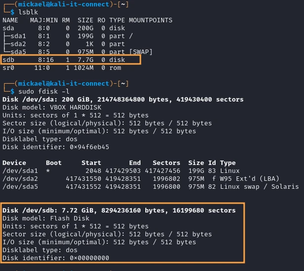
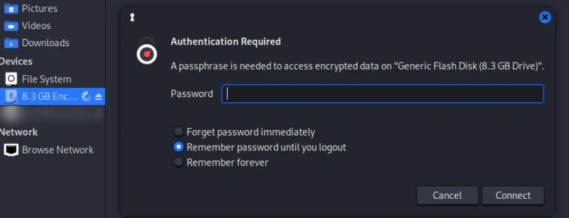

___


*Tutorial ini didasarkan pada konten asli oleh Mickael Dorigny yang dipublikasikan di [IT-Connect](https://www.it-connect.fr/). Lisensi [CC BY-NC 4.0] (https://creativecommons.org/licenses/by-nc/4.0/). Perubahan mungkin telah dilakukan pada teks asli.*


___


## I. Presentasi


Mengenkripsi stik USB adalah cara yang baik untuk melindungi data sensitif Anda. **Dalam tutorial ini, kita akan melihat cara menggunakan LUKS (*Linux Unified Key Setup*) dengan cryptsetup untuk mengenkripsi stik USB di sistem Linux.** Metode ini akan memungkinkan Anda untuk mengamankan data Anda, terutama jika stik USB hilang atau dicuri.


[**LUKS**] (https://fr.wikipedia.org/wiki/LUKS) (*Linux Unified Key Setup*) adalah standar enkripsi disk yang digunakan terutama pada sistem Linux. Standar ini mengamankan data dengan mengenkripsi partisi disk dengan algoritme yang kuat. Dukungannya pada sistem Linux memudahkan pengelolaan kunci enkripsi dan kata sandi, menawarkan Interface standar dan kompatibilitas dengan berbagai alat manajemen.


Untuk mengikuti tutorial ini, Anda memerlukan :


- kunci USB;
- sistem Linux dengan "**cryptsetup**" terinstal (biasanya tersedia secara default, jika tidak, kita akan melihat cara mendapatkannya).


## II. Menginstal cryptsetup


Pertama, kita perlu memastikan bahwa kita memiliki perintah "**cryptsetup**" pada sistem kita:


```
# Vérifier la présence de la commande cryptsetup
which cryptsetup
```


Jika Anda tidak mendapatkan respons terhadap perintah ini, Anda perlu menginstal "**cryptsetup**":


```
# Installer cryptsetup
# Sous Debian et dérivés
apt-get install cryptsetup

# Sous Redhat et dérivés
sudo yum install cryptsetup
# ou
sudo dnf install cryptsetup
```


Sekarang kita sudah memiliki semua yang kita butuhkan untuk membuat kunci USB terenkripsi melalui LUKS.


Pada kenyataannya, utilitas "**dm-crypt**" yang akan melakukan enkripsi. "**cryptsetup**" adalah baris perintah Interface yang mengelola fitur dan tindakan **dm-crypt**.


## III. Membuat partisi LUKS dan sistem berkas


### A. Mengidentifikasi kunci USB


Sekarang kita akan membuat partisi LUKS terenkripsi pada stik USB. Jika Anda belum menyambungkannya ke sistem Anda, sekaranglah saatnya untuk melakukannya.


Untuk keperluan tutorial ini, saya mengenkripsi seluruh stik USB saya, bukan hanya satu partisi. Penting juga untuk diketahui bahwa selama prosedur ini, **semua data yang ada akan terhapus dari kunci**.


Langkah pertama adalah menemukan file perangkat yang sesuai dengan stik USB Anda di direktori "**/dev/**". Masukkan stik USB Anda dan kenali nama perangkatnya. Anda dapat menggunakan perintah berikut ini untuk membuat daftar perangkat penyimpanan:


```
$ lsblk
```


Temukan kunci USB Anda, misalnya "**/dev/sdb**". Anda juga dapat menggunakan perintah "**fdisk -l**" untuk menampilkan nama model kunci USB (sebaiknya jangan sampai salah), dan menggunakan ukuran penyimpanan perangkat sebagai indikator:





Identifikasi kunci USB yang akan dienkripsi dengan "**lsblk**" dan "**fdisk**".


Dalam contoh saya, kunci USB saya terletak di "**/dev/sdb**". Jika Anda melihat "**/dev/sdb1**", "**/dev/sdb2**", dst., ini adalah partisi yang saat ini ada di drive Anda. Ini adalah partisi yang saat ini ada pada kunci Anda. Partisi-partisi tersebut akan dihapus oleh manipulasi kita.


### B. Menghapus data yang ada


Sekarang kita akan menghapus semua data pada stik USB kita. Operasi ini terdiri dari mengisi ruang disk pada stik USB dengan angka 0.


**Pastikan Anda menargetkan file perangkat yang tepat!


```
# Remplir la clé USB de 0
$ sudo dd if=/dev/zero of=/dev/sdb bs=1M

7911+0 records in
7910+0 records out
8294236160 bytes (8.3 GB, 7.7 GiB) copied, 1556.22 s, 5.3 MB/s
```


Hal ini memastikan bahwa tidak akan ada data plaintext yang tetap pada kunci kita.


### C. Enkripsi kunci USB dengan LUKS


Sekarang kita akan menginisialisasi partisi LUKS pada kunci USB. Ini melibatkan pembuatan partisi LUKS:


```
# Formattage d'une partition LUKS sur la clé USB
$ sudo cryptsetup luksFormat /dev/sdb

WARNING!
========
This will overwrite data on /dev/sdb irrevocably.

Are you sure? (Type 'yes' in capital letters): YES
Enter passphrase for /dev/sdb:
Verify passphrase:
```


Di sini, subperintah "`luksFormat`" menginisialisasi dan memformat perangkat untuk menggunakan enkripsi LUKS. Anda akan diminta untuk mengonfirmasi operasi ini dengan mengetik `YES` dalam huruf besar, lalu tentukan *passphrase*. **Pilihlah *passphrase* yang kuat untuk memastikan bahwa, jika terjadi kehilangan, penyerang tidak dapat menemukannya melalui serangan brute force.


Setelah itu, disk "**/dev/sdb**" akan diformat dengan LUKS dan siap digunakan sebagai volume terenkripsi.


### D. Memformat volume terenkripsi


Kita hampir sampai, dan sekarang kita perlu membuat partisi yang valid di dalam partisi LUKS. Dengan cara ini, setelah dibuka, kita dapat menggunakannya seperti sistem berkas lainnya. Untuk melakukannya, kita perlu membuka partisi terenkripsi:


```
# Ouverture de la partition LUKS sur la clé USB
$ sudo cryptsetup luksOpen /dev/sdb usbkey1
Enter passphrase for /dev/sdb:

# Lister les disques
$ sudo fdisk -l
[...]

Disk /dev/sdb: 7.72 GiB, 8294236160 bytes, 16199680 sectors
Disk model: Flash Disk
Units: sectors of 1 * 512 = 512 bytes
Sector size (logical/physical): 512 bytes / 512 bytes
I/O size (minimum/optimal): 512 bytes / 512 bytes


Disk /dev/mapper/usbkey1: 7.71 GiB, 8277458944 bytes, 16166912 sectors
Units: sectors of 1 * 512 = 512 bytes
Sector size (logical/physical): 512 bytes / 512 bytes
I/O size (minimum/optimal): 512 bytes / 512 bytes
```


Di sini, "**usbkey1**" adalah nama yang saya berikan pada partisi yang dipasang dalam konteks saya. Anda dapat memilih yang mana pun yang Anda suka. Kita kemudian perlu memformat partisi yang terdapat pada partisi LUKS, misalnya, di sini sebagai **ext4** :


```
# Formattage de la partition en ext4
$ sudo mkfs.ext4 /dev/mapper/usbkey1

mke2fs 1.47.0 (5-Feb-2023)
Creating filesystem with 2020864 4k blocks and 505920 inodes
Filesystem UUID: cfa607d3-c31f-475d-bcfe-fa951b60a591
Superblock backups stored on blocks:
32768, 98304, 163840, 229376, 294912, 819200, 884736, 1605632

Allocating group tables: done
Writing inode tables: done
Creating journal (16384 blocks):
done
Writing superblocks and filesystem accounting information:
done
```


**Di sini, lokasi target** ditetapkan sebagai "**/dev/mappe/usbkey1**"**, mengapa?


"**/dev/mapper/usbkey1**" adalah "jalan pintas" yang kita berikan pada kunci USB kita ("**/dev/mapper**" adalah umum untuk Linux untuk pemetaan). Oleh karena itu, ini menyediakan akses ke partisi yang telah didekripsi. Inilah yang seharusnya Anda lihat sekarang:


```
# Liste des périphériques et leurs partition
$ lsblk
NAME      MAJ:MIN RM  SIZE RO TYPE  MOUNTPOINTS
sda         8:0    0  200G  0 disk
├─sda1      8:1    0  199G  0 part  /
├─sda2      8:2    0    1K  0 part
└─sda5      8:5    0  975M  0 part  [SWAP]
sdb         8:16   1  7.7G  0 disk
└─usbkey1 254:0    0  7.7G  0 crypt
sr0        11:0    1 1024M  0 rom
```


## IV. Menggunakan kunci USB terenkripsi


### A. Membuka dan mengedit volume LUKS


*melalui grafik Interface ** **:**:**


Pada Debian, "**dm-crypt**" hadir secara default. Jadi, dalam banyak kasus, instalasi berlangsung secara langsung ketika kunci USB dicolokkan. Anda kemudian akan diminta untuk memasukkan passphrase Anda pada jendela pop-up seperti ini:





Permintaan untuk memasukkan dekripsi passphrase untuk partisi LUKS.


Setelah passphrase dimasukkan, sistem Anda akan dapat membaca sistem file pada kunci dan kemudian melakukan mount sistem file ini, yang akan menampilkan partisi yang telah di-mount:


```
$ lsblk
NAME                                        MAJ:MIN RM  SIZE RO TYPE  MOUNTPOINTS
sda                                           8:0    0  200G  0 disk
├─sda1                                        8:1    0  199G  0 part  /
├─sda2                                        8:2    0    1K  0 part
└─sda5                                        8:5    0  975M  0 part  [SWAP]
sdb                                           8:16   1  7.7G  0 disk
└─luks-425f7800-e461-47e9-b8cc-f76d0cefb853 254:0    0  7.7G  0 crypt /media/mickael/cfa607d3-c31f-475d-bcfe-fa95
sr0                                          11:0    1 1024M  0 rom
```


**Pada baris perintah:**


Namun, ada baiknya Anda mengetahui cara melakukan operasi pada baris perintah. Mari kita mulai dengan mendekripsi partisi terenkripsi menggunakan "**crypsetup**" dan sub-perintah "**luksOpen**":


```
# Ouverture de la partition LUKS sur la clé USB
$ sudo cryptsetup luksOpen /dev/sdb usbkey1
Enter passphrase for /dev/sdb:

# Liste des périphériques et leurs partition
$ lsblk
NAME      MAJ:MIN RM  SIZE RO TYPE  MOUNTPOINTS
[...]
sdb         8:16   1  7.7G  0 disk
└─usbkey1 254:0    0  7.7G  0 crypt
sr0        11:0    1 1024M  0 rom
```


Sekarang, volume yang didekripsi dari USB flash drive kita menyajikan volume yang dapat digunakan oleh sistem file dan OS kita, jadi kita akan menyambungkan isinya ke folder mana saja, misalnya "**/home/mickael/mnt**" dalam kasus saya:


```
# Monter le volume déchiffré sur notre système de fichier
$ mkdir /home/mickael/mnt
$ sudo mount /dev/mapper/usbkey1 /home/mickael/mnt

$ ls /home/mickael/mnt -al
total 24
drwxr-xr-x  3 root    root     4096 Jun 11 14:38 .
drwx------ 31 mickael mickael  4096 Jun 11 21:44 ..
drwx------  2 root    root    16384 Jun 11 14:38 lost+found

```


Ini berarti kita dapat mengakses data pada stik USB kita secara bebas dan transparan.


### B. Menutup dan menghapus volume LUKS


Setelah operasi kita selesai, jangan lupa untuk menutup semuanya dengan benar untuk memastikan volume kita tidak rusak. Langkah pertama adalah melepas pemasangan file :


```
# Démontage du volume contenu dans la partition chiffrée
sudo umount /home/mickael/mnt
```


Kemudian tutup partisi terenkripsi itu sendiri:


```
# Fermeture de la partition chiffrée
sudo cryptsetup luksClose usbkey1
```


Sekarang, siapa pun yang menggunakan kunci USB kami tidak akan melihat apa pun dari isinya kecuali data yang dienkripsi.


## V. Kesimpulan


Antarmuka pengguna grafis membuat operasi ini transparan, namun tetap berguna untuk mengetahui cara memformat, membuat, membuka, dan menutup partisi LUKS terenkripsi dari baris perintah. Setelah diformat, manipulasi yang diperlukan untuk membuka dan menutup partisi LUKS sangat minim dibandingkan dengan keuntungan keamanannya.