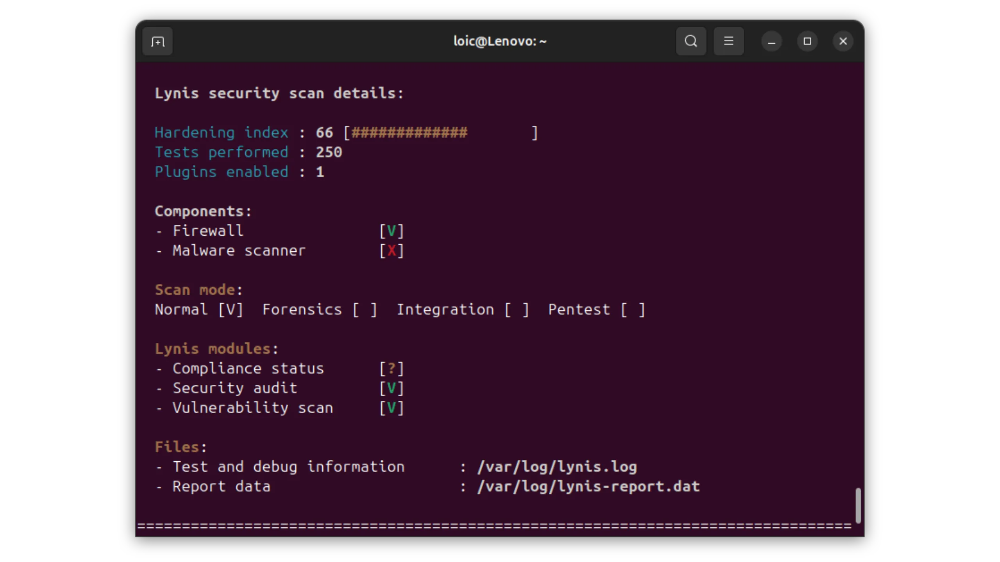


___


*यह ट्यूटोरियल [IT-Connect](https://www.it-connect.fr/) पर प्रकाशित Fares CHELLOUG की मूल सामग्री पर आधारित है। लाइसेंस [CC BY-NC 4.0](https://creativecommons.org/licenses/by-nc/4.0/)। मूल पाठ में बदलाव किए गए हो सकते हैं।*


___


## I. प्रस्तुति


**इस ट्यूटोरियल में, हम सीखेंगे कि लिनिस का उपयोग करके लिनक्स मशीन पर सुरक्षा ऑडिट कैसे करें! आप में से जो लोग लिनिस के बारे में नहीं जानते, उनके लिए बता दूँ कि यह एक छोटी कमांड-लाइन उपयोगिता है जो आपके सर्वर के कॉन्फ़िगरेशन का विश्लेषण करेगी और आपकी मशीन की सुरक्षा बढ़ाने के लिए सुझाव देगी।**


लिनिस, CISOFY का एक ओपन सोर्स टूल है, जो **सिस्टम ऑडिटिंग और हार्डनिंग** में विशेषज्ञता वाली कंपनी है। अगर आप Linux और लोकप्रिय सेवाओं (SSH, Apache2, आदि) को हार्डनिंग करने में प्रगति करना चाहते हैं, तो लिनिस आपका सहयोगी है! लिनिस न केवल आपको बताता है कि क्या गलत हो रहा है, बल्कि आपको सही दिशा दिखाने के लिए सुझाव भी देता है (और आपका समय भी बचाता है)।


**लिनिस** अधिकांश लिनक्स वितरणों के साथ काम करता है, जिनमें शामिल हैं: **डेबियन, फ्रीबीएसडी, एचपी-यूएक्स, नेटबीएसडी, निक्सओएस, ओपनबीएसडी, सोलारिस**। लिनिस लिनक्स/यूनिक्स उपयोगकर्ताओं के लिए है, लेकिन यह **मैकओएस** के साथ भी संगत है। इंस्टॉल करने में बहुत तेज़, पैकेज स्तर पर कोई निर्भरता प्रबंधन नहीं है।


इसका उपयोग विभिन्न प्रयोजनों के लिए किया जाता है:


- सुरक्षा ऑडिट
- अनुपालन परीक्षण (PCI, HIPAA और SOX)
- कठिन सिस्टम कॉन्फ़िगरेशन
- भेद्यता का पता लगाना


इस टूल का व्यापक रूप से उपयोगकर्ताओं की एक विस्तृत श्रृंखला द्वारा उपयोग किया जाता है, जिसमें सिस्टम प्रशासक, आईटी ऑडिटर और पेनटेस्टर शामिल हैं। विश्लेषण के लिए, यह टूल **सीआईएस बेंचमार्क, एनआईएसटी, एनएसए, ओपनएससीएपी** जैसे मानकों और **डेबियन, जेंटू, रेड हैट** की आधिकारिक अनुशंसाओं पर आधारित है।


यह परियोजना **Github** पर इस Address पर उपलब्ध है:


- [GitHub - लिनिस](https://github.com/CISOfy/lynis)
- [CISOFY से लिनिस डाउनलोड करें](https://cisofy.com/lynis/#download)


इस चरण-दर-चरण ट्यूटोरियल में, मैं **डेबियन 12 पर चलने वाले एक वीपीएस का उपयोग करने जा रहा हूं** और मैं एसएसएच भाग पर ध्यान केंद्रित करने जा रहा हूं, क्योंकि मैं इसकी कॉन्फ़िगरेशन की जांच करना चाहता हूं और इसमें सुधार करना चाहता हूं।


## II. डाउनलोड और इंस्टॉलेशन


लिनिस को डाउनलोड और इंस्टॉल करने के कई तरीके हैं। नीचे दी गई सूची में से अपनी पसंद का विकल्प चुनें।


### A. डेबियन रिपॉजिटरी से इंस्टॉलेशन


यह इंस्टॉलेशन मोड आपको सिस्टम पर कहीं से भी **lynis** कमांड का उपयोग करने की अनुमति देता है, स्रोत से इंस्टॉलेशन के विपरीत, जहां आपको निर्देशिका में स्थित होना चाहिए।


SSH के माध्यम से अपने सर्वर से कनेक्ट करें और Lynis को स्थापित करने के लिए निम्नलिखित कमांड दर्ज करें:


```
sudo apt-get update
sudo apt-get install lynis -y
```


यही है जो तुम्हें मिला:


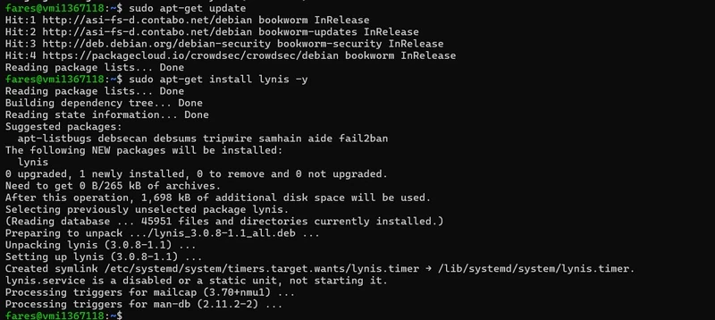


### B. आधिकारिक वेबसाइट से डाउनलोड करें


आप इसे Cisofy वेबसाइट से भी डाउनलोड कर सकते हैं:


```
sudo wget https://downloads.cisofy.com/lynis/lynis-3.0.9.tar.gz
```


यही है जो तुम्हें मिला:


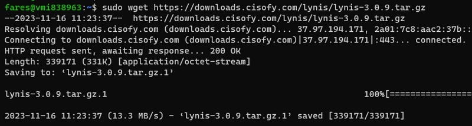


इसके बाद, हम निम्नलिखित कमांड का उपयोग करके संग्रह को अनपैक करेंगे:


```
sudo tar -zxf lynis-3.0.9.tar.gz
```


यही है जो तुम्हें मिला:


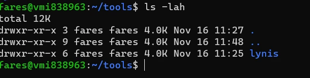


आइए **lynis** फ़ोल्डर पर चलते हैं:


```
cd lynis
```


हम निम्नलिखित कमांड से अपडेट की जांच कर सकते हैं:


```
./lynis update info
```


यही है जो तुम्हें मिला:


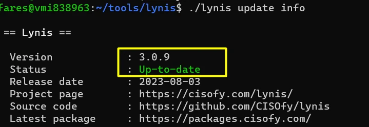


### C. GitHub से डाउनलोड करें


हम निम्नलिखित कमांड का उपयोग करके आधिकारिक GitHub रिपोजिटरी से **Lynis** डाउनलोड करेंगे (*git* आपकी मशीन पर मौजूद होना चाहिए):


```
git clone https://github.com/CISOfy/lynis.git
```


यही है जो तुम्हें मिला:


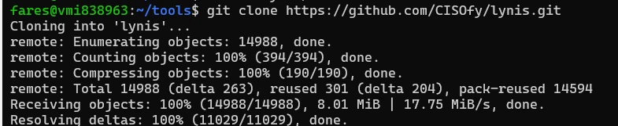


## III. लिनिस का उपयोग


लिनिस हमारी मशीन पर मौजूद है, तो आइए जानें इसका उपयोग कैसे करें!


### A. मुख्य नियंत्रण और विकल्प


उपलब्ध कमांड प्रदर्शित करने के लिए, बस निम्नलिखित कमांड दर्ज करें:


```
sudo lynis
# Si vous avez récupéré Lynis depuis les sources, utilisez cette syntaxe:
./lynis
```


यही है जो तुम्हें मिला:


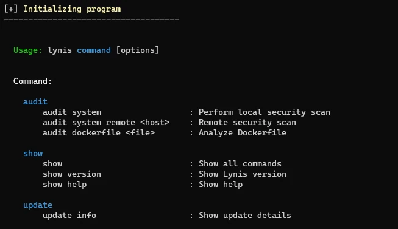


और आपको निम्नलिखित विकल्प भी मिलते हैं:


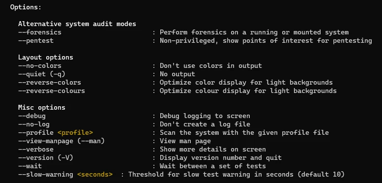


सभी उपलब्ध कमांड प्रदर्शित करने के लिए, निम्नलिखित कमांड दर्ज करें:


```
sudo lynis show
```


यही है जो तुम्हें मिला:


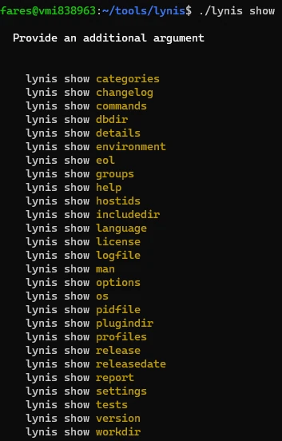


यदि आप सभी विकल्प प्रदर्शित करना चाहते हैं, तो आपको यह दर्ज करना होगा:


```
sudo lynis show options
```


यही है जो तुम्हें मिला:


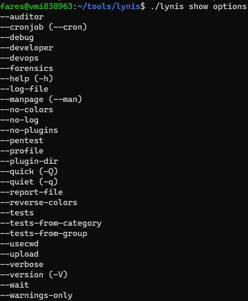


इस लेख के बाकी हिस्सों में हम सीखेंगे कि कुछ विकल्पों का उपयोग कैसे करें।


### B. सिस्टम ऑडिट करना


हम **लिनिस** से हमारे सिस्टम का ऑडिट करने के लिए कहेंगे, जिसमें यह बताया जाएगा कि क्या सही ढंग से कॉन्फ़िगर किया गया है और क्या सुधार किया जा सकता है। ऐसा करने के लिए, निम्न कमांड दर्ज करें:


```
sudo lynis audit system
# ou
./lynis audit system
```


डिफ़ॉल्ट रूप से, यदि आप इस कमांड को चलाते समय रूट के रूप में लॉग इन नहीं हैं, तो टूल वर्तमान में लॉग इन उपयोगकर्ता के विशेषाधिकारों के साथ चलेगा। कुछ परीक्षण इस संदर्भ में नहीं चलाए जाएँगे:


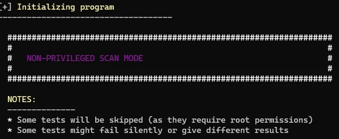


यहां वे परीक्षण दिए गए हैं जो इस मोड में नहीं किए जाएंगे:


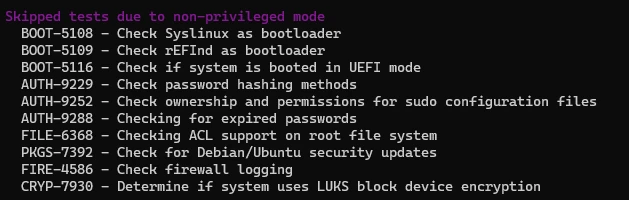


कमांड निष्पादित होने के बाद, विश्लेषण शुरू हो जाता है। बस एक क्षण प्रतीक्षा करें।


ऑडिट के अंत में, आपको यह मिलता है (हम देख सकते हैं कि **लिनिस** ने **डेबियन 12** सिस्टम की सही पहचान की है और विश्लेषण के लिए **डेबियन प्लगइन** का उपयोग करेगा):


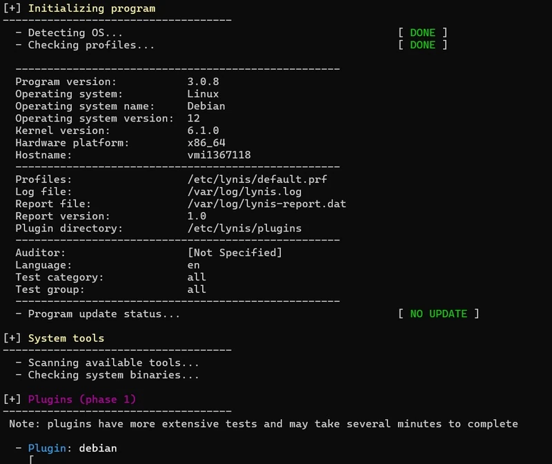


इसके बाद, लिनिस हमारे सिस्टम पर जाँची गई हर चीज़ से संबंधित बिंदुओं का एक सेट सूचीबद्ध करेगा। जैसा कि हम आगे देखेंगे, यह श्रेणी के अनुसार व्यवस्थित है। यह भी ध्यान देने योग्य है कि सुझावों को हाइलाइट करने के लिए एक रंग कोड का उपयोग किया जाता है:


- **लाल** महत्वपूर्ण Elements या सर्वोत्तम प्रथाओं का सम्मान न किए जाने के लिए (उदाहरण के लिए, एक अनुपलब्ध पैकेज), अर्थात आपका सर्वर इस बिंदु का सम्मान नहीं करता है
- **पीला** सुझाव या सिफारिश के आंशिक अनुपालन के लिए (मान लें कि इस रंग से चिन्हित बिंदु का अनुपालन करना एक प्लस है (गैर-प्राथमिकता))
- **Green** उन बिंदुओं के लिए जहां आपका सर्वर कॉन्फ़िगरेशन अनुरूप है
- **सफेद**, जब तटस्थ


यहां, हम देख सकते हैं कि लिनिस **fail2ban** स्थापित करने की अनुशंसा करता है:


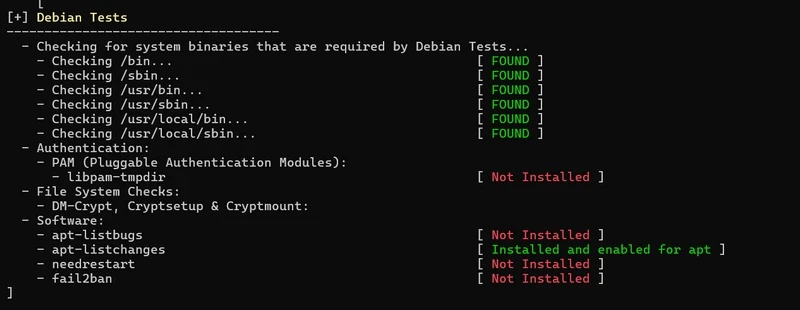


"**बूट और सेवाएँ**" अनुभाग में, हम देखते हैं कि *systemd* के माध्यम से सेवा सुरक्षा में सुधार किया जा सकता है। सकारात्मक पक्ष यह है कि Grub2 मौजूद है और अनुमतियों को लेकर कोई समस्या नहीं है:


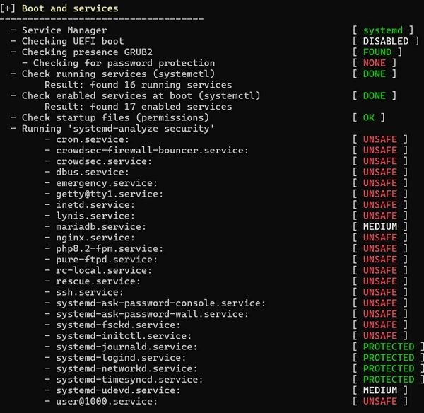


फिर आपके पास "कर्नेल" और "मेमोरी और प्रक्रियाएं" अनुभाग हैं:


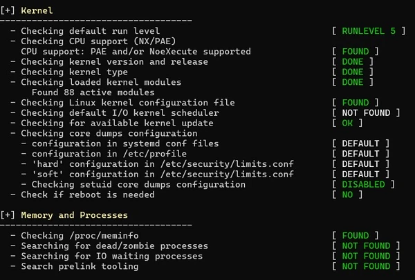


अगला, "**उपयोगकर्ता, समूह और प्रमाणीकरण**" अनुभाग। यह टूल हमें "**/etc/sudoers.d**" निर्देशिका की अनुमतियों के बारे में एक चेतावनी देता है। फ़िलहाल, हमें ज़्यादा जानकारी नहीं है, लेकिन विश्लेषण के अंत में हम देख पाएँगे कि सिफ़ारिश क्या है।


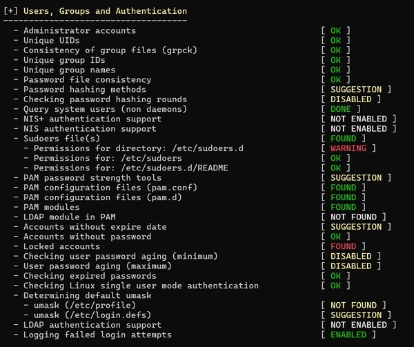


"**शेल्स", "फ़ाइल सिस्टम्स", और "USB डिवाइसेज़"** अनुभागों में आपको ये जानकारी मिल सकती है। अन्य बातों के अलावा, हम देख सकते हैं कि माउंट पॉइंट्स के बारे में सुझाव दिए गए हैं और इस मशीन पर वर्तमान में USB डिवाइसेज़ की अनुमति है।


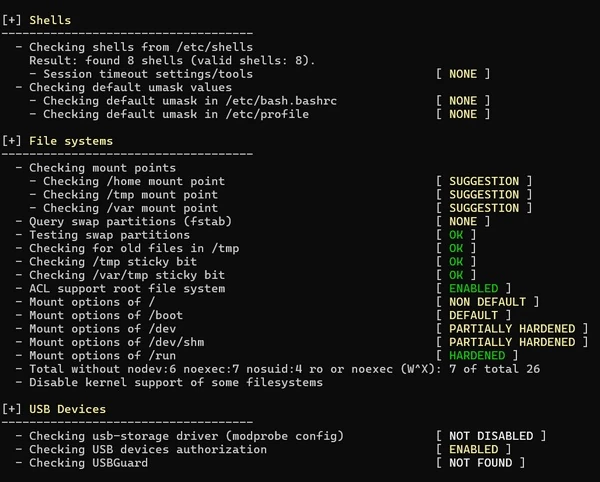


इसके बाद, अनुभाग: "**नाम सेवाएं", "पोर्ट और पैकेज", "नेटवर्किंग"।** यह यहां इंगित करता है कि अब उपयोग में नहीं आने वाले पैकेजों को हटाया जा सकता है और स्वचालित अपडेट को प्रबंधित करने में सक्षम कोई उपयोगिता नहीं है।


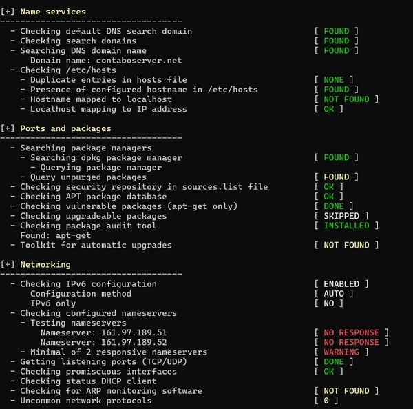


हम देख सकते हैं कि फ़ायरवॉल सक्रिय है (और हाँ, iptables भी है!)। इसके अलावा, हम देख सकते हैं कि इसे अप्रयुक्त नियम मिल गए हैं और एक Apache वेब सर्वर स्थापित है।


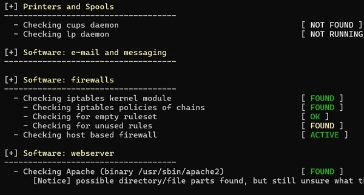


इसके बाद वेब सर्वर का विश्लेषण किया जाता है, क्योंकि सेवा की पहचान हो चुकी है।


हम देख सकते हैं कि इसे Nginx कॉन्फ़िगरेशन फ़ाइलें मिली हैं, और SSL/TLS भाग के लिए, सिफ़र ऐसे प्रोटोकॉल का उपयोग करके कॉन्फ़िगर किए गए हैं जो असुरक्षित होगा। दूसरी ओर, लिनिस के अनुसार, लॉग प्रबंधन सही है।


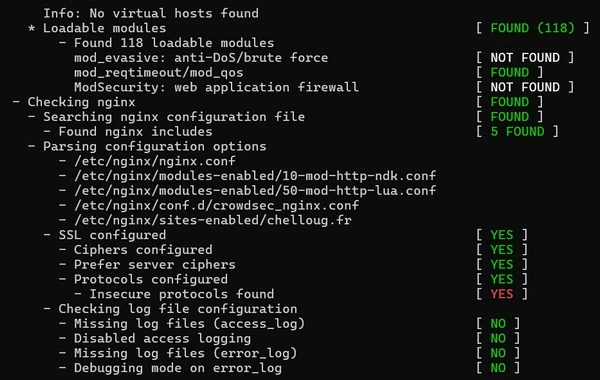


SSH सेवा मेरे VPS सर्वर पर मौजूद है। इसके कॉन्फ़िगरेशन का विश्लेषण Lynis द्वारा किया गया है। यह कहना ज़रूरी है कि SSH सुरक्षा को आसानी से बेहतर बनाया जा सकता है! सुझाव मिलने के बाद हम इस विषय पर विस्तार से चर्चा करेंगे।


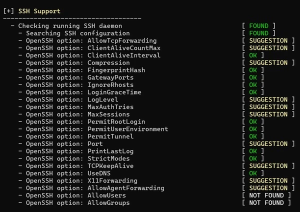


यहां अनुभाग हैं **"एसएनएमपी समर्थन", "डेटाबेस", "पीएचपी", "स्क्विड समर्थन", "एलडीएपी सेवाएं", "लॉगिंग और फाइलें"**।


लॉग प्रबंधन के बारे में एक बहुत ही महत्वपूर्ण सुझाव है: यह दृढ़ता से अनुशंसा की जाती है कि आप अपनी मशीन पर लॉग को केवल स्थानीय रूप से संग्रहीत न करें। यदि मशीन किसी हमलावर द्वारा दूषित कर दी गई हो, तो संभव है कि वह अपने निशान मिटाने की कोशिश करे... इसलिए हमें लॉग को बाहरी रूप से संग्रहीत करने की आवश्यकता है।


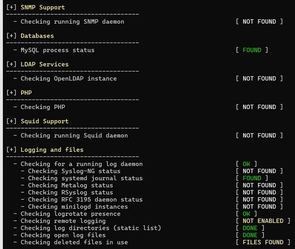


यहाँ, हमारे पास असुरक्षित सेवाओं, खाता प्रबंधन, निर्धारित कार्यों और NTP सिंक्रनाइज़ेशन का ऑडिट है। बैनर और पहचान वाले हिस्से पर यह दर्शाया गया है कि स्तर कम है: यह समझ में आता है, क्योंकि अगर आप सिस्टम संस्करण प्रदर्शित करते हैं, तो यह संभावित हमलावर को संकेत देता है। यह डिफ़ॉल्ट सेटिंग है।


फोरेंसिक विश्लेषण के मामले में लॉग्स प्राप्त करने के लिए ऑडिटडी को सक्रिय करना दिलचस्प होगा। एनटीपी की भी जाँच की जाती है, क्योंकि लॉग्स को कुशलतापूर्वक खोजने के लिए, सिस्टम का समय पर होना बेहतर होता है, जिससे खोज आसान हो जाती है।


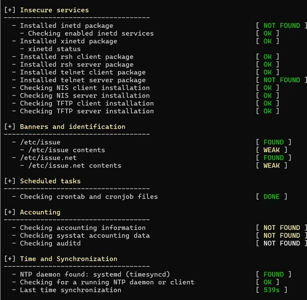


इसके बाद लिनिस क्रिप्टोग्राफ़िक Elements, वर्चुअलाइज़ेशन, कंटेनर और सुरक्षा ढाँचों पर नज़र डालते हैं। कुछ खंड खाली हैं क्योंकि विश्लेषण की गई मशीन से कोई पत्राचार नहीं है। हालाँकि, हम देख सकते हैं कि मेरे पास दो एक्सपायर हो चुके SSL प्रमाणपत्र हैं और मैंने **SELinux** सक्रिय नहीं किया है।


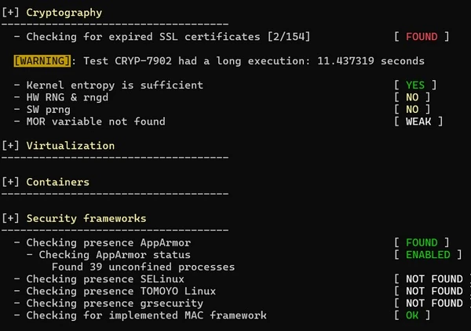


यहां भी सुधार की गुंजाइश है: यहां कोई एंटी-वायरस या एंटी-मैलवेयर स्कैनर नहीं है, और हमारे पास फ़ाइल अनुमतियों पर सुझाव हैं।


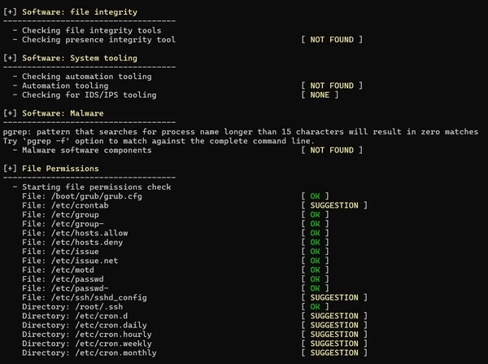


इसके बाद, लिनिस लिनक्स कर्नेल कॉन्फ़िगरेशन (IPv4 स्टैक के लिए नियमों सहित) को मजबूत करने के साथ-साथ लिनक्स मशीन की "होम" निर्देशिकाओं के प्रबंधन पर ध्यान केंद्रित करता है।


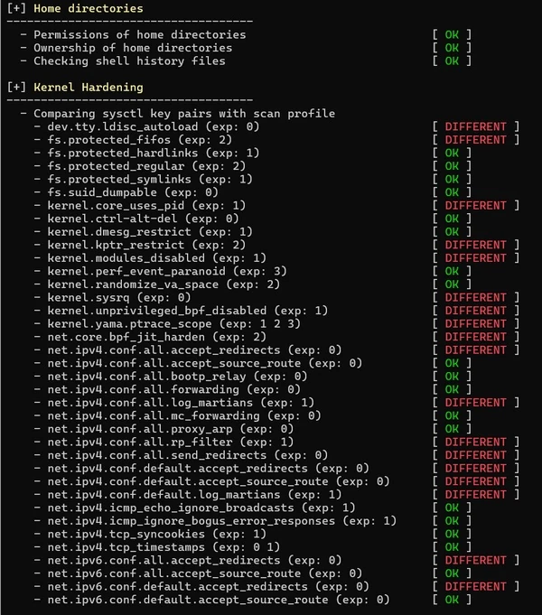


हम विश्लेषण के अंत में आ गए हैं... यह अंतिम बिंदु दर्शाता है कि इस मशीन पर ClamAV होने से हमें सब कुछ हासिल होगा।


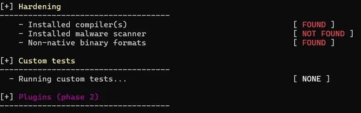


## IV. सिफारिशें


ऑडिट के बाद, सिफारिशों को पढ़ने और उनका विश्लेषण करने का समय आता है। यहीं से हमें लिनिस द्वारा किए गए प्रत्येक परीक्षण के लिए सिफारिशें और स्पष्टीकरण मिलते हैं।


उदाहरण के लिए, SSH अनुशंसाओं को लें। **प्रत्येक सुझाव के लिए, आपको अनुशंसित पैरामीटर और एक लिंक मिलेगा जो सुरक्षा बिंदु की व्याख्या करेगा। **आपके संदर्भ और उपयोग के आधार पर, यह निर्णय लेना आपके ऊपर है।


आइए सिफारिशों के कुछ उदाहरणों पर नजर डालें जो पूरे ऑडिट में उजागर किए गए बिंदुओं को सीधे तौर पर प्रतिध्वनित करते हैं...


### A. सिफारिशों के उदाहरण


- जैसा कि हमने पहले देखा, NTP टाइम-स्टैम्पिंग लॉग के लिए महत्वपूर्ण है:


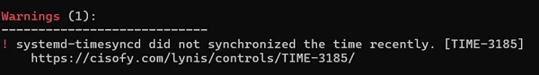


- लिनिस ने **apt** के माध्यम से पैकेज स्थापना के दौरान महत्वपूर्ण बगों के बारे में जानकारी प्राप्त करने के लिए **apt-listbugs** पैकेज स्थापित करने का भी सुझाव दिया है।


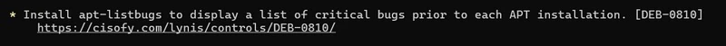


- उपकरण सुझाव देता है कि हम **needrestart स्थापित करें ताकि** यह देखा जा सके कि कौन सी प्रक्रियाएं लाइब्रेरी के पुराने संस्करण का उपयोग कर रही हैं और उन्हें पुनः आरंभ करने की आवश्यकता है।


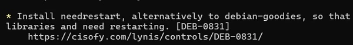


- यह सुझाव **fail2ban** को स्थापित करने का सुझाव देता है, ताकि प्रमाणीकरण में विफल रहने वाले होस्ट को स्वचालित रूप से ब्लॉक किया जा सके (विशेष रूप से ब्रूट फोर्स)।


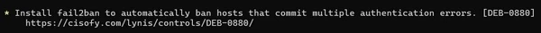


- सिस्टम सेवाओं को मजबूत बनाने के लिए, वह अनुशंसा करते हैं कि हम अपनी मशीन पर प्रत्येक सेवा के लिए नीला कमांड चलाएँ।


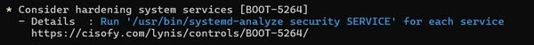


- उन्होंने सभी संरक्षित खाता पासवर्डों के लिए समाप्ति तिथि निर्धारित करने का सुझाव दिया।


- यह सुझाव पासवर्ड की आयु के लिए न्यूनतम और अधिकतम मान निर्धारित करने का सुझाव देता है। अन्य बातों के अलावा, इससे यह सुनिश्चित होगा कि पासवर्ड नियमित रूप से बदले जाते रहें।


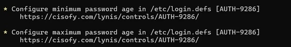


- हम एक विभाजन पर डिस्क स्थान की समस्याओं के प्रभाव को सीमित करने के लिए अलग-अलग विभाजनों का उपयोग करने की अनुशंसा करते हैं।


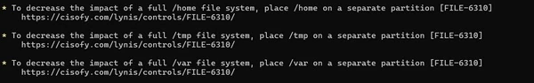


- यह अनुशंसा डेटा लीक को रोकने के लिए USB संग्रहण और फायरवायर को अक्षम करने का सुझाव देती है


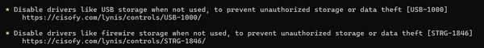


- इस अनुशंसा को पूरा करने के लिए, उदाहरण के लिए, बस **unnatended-upgrade** को स्थापित और कॉन्फ़िगर करें।


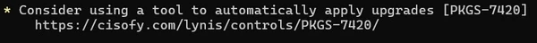


### B. अनुशंसित पैकेज स्थापित करना


सिस्टम कॉन्फ़िगरेशन में सुधार करने के लिए, हम मशीन पर कुछ पैकेज स्थापित करने जा रहे हैं: कुछ लिनिस द्वारा अनुशंसित, कुछ जिन्हें मैं व्यक्तिगत रूप से सुझाता हूं।


आपके पास काम करने के लिए एक अच्छा आधार होगा, बशर्ते आप उन्हें कॉन्फ़िगर करने में थोड़ा समय लगाएँ। ऐसा करने के लिए, IT-Connect साइट, वेब पर मौजूद अन्य लेख और टूल दस्तावेज़ देखें।


```
sudo apt-get install debsums apt-listbugs needrestart apt-show-versions fail2ban unattended-upgrades clamav clamav-daemon rkhunter
```


स्थापित पैकेजों के बारे में कुछ जानकारी:


- **क्लैमाव** एक एंटीवायरस है।
- **अनअटेंड-अपग्रेड्स** आपको अपने अपडेट को स्वचालित रूप से प्रबंधित करने और यहां तक कि मशीन को रीबूट करने या पुराने पैकेजों को स्वचालित रूप से शुद्ध करने में सक्षम करेगा, यह पूरी तरह से कॉन्फ़िगर करने योग्य है।
- **rkhunter** एक एंटी-रूटकिट है जो आपके फ़ाइल सिस्टम को स्कैन करता है।
- **Fail2ban** आपके द्वारा पढ़ी जाने वाली लॉग फाइलों के आधार पर काम करेगा और यह **iptables** के साथ काम करेगा, उदाहरण के लिए उन IP पतों पर प्रतिबंध लगाने के लिए जो SSH में आपके सर्वर पर "ब्रूट फोर्स" करने का प्रयास करते हैं।


### C. SSH के लिए सिफारिशें


आइए SSH अनुशंसाओं पर एक नज़र डालें। वे नीचे सूचीबद्ध हैं। चिंता न करें, हम आपको तुरंत बताएँगे कि कॉन्फ़िगरेशन को कैसे बेहतर बनाया जाए।


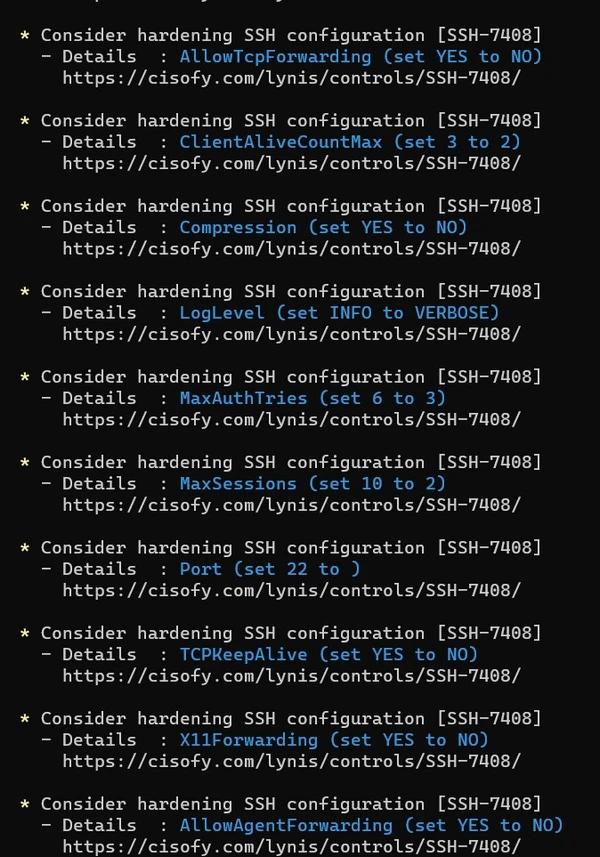


आइये मेरे वर्तमान **SSH** कॉन्फ़िगरेशन पर करीब से नज़र डालें:**/etc/ssh/sshd_config**


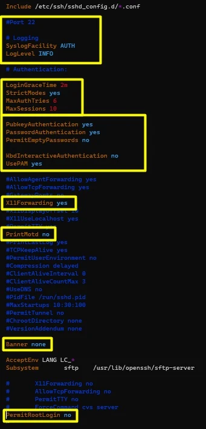


नीचे सुझाया गया कॉन्फ़िगरेशन अभी भी अनुकूलित किया जा सकता है, लेकिन यह आपको एक अच्छा आधार प्रदान करता है। *कृपया ध्यान दें कि मैंने बेहतर पठनीयता के लिए कई टिप्पणियाँ हटा दी हैं*।


हम ऐसा करेंगे:


- SSH कनेक्शन पोर्ट बदलें (डिफ़ॉल्ट 22 को भूल जाएं)
- लॉग्स के शब्दाडंबर स्तर को **INFO** से **VERBOSE** तक बढ़ाएँ
- **LoginGraceTime** को **2 मिनट** पर सेट करें


यदि दो मिनट के भीतर कोई कनेक्शन जानकारी दर्ज नहीं की जाती है, तो कनेक्शन काट दिया जाता है।


- **strictModes** सक्रिय करें


यह निर्दिष्ट करता है कि क्या "sshd" को कनेक्शन मान्य करने से पहले उपयोगकर्ता की फ़ाइलों के मोड और स्वामी के साथ-साथ उपयोगकर्ता की होम निर्देशिका की भी जाँच करनी चाहिए। यह सामान्यतः वांछनीय है, क्योंकि कभी-कभी नौसिखिए उपयोगकर्ता गलती से अपनी निर्देशिका या फ़ाइलों को सभी के लिए पूरी तरह से सुलभ छोड़ देते हैं। डिफ़ॉल्ट "हाँ" है।


- **MaxAuthtries** को 3 पर सेट करें


यह संचार बंद होने से पहले असफल प्रमाणीकरण प्रयासों की संख्या को दर्शाता है।


- **MaxSessions** को 2 पर सेट करें


यह एक साथ चलने वाले सत्रों की अधिकतम संख्या को दर्शाता है।


- सार्वजनिक कुंजी प्रमाणीकरण सक्षम करें


```
PubkeyAuthentication yes
```


- पासवर्ड प्रमाणीकरण बनाए रखें:


```
PasswordAuthentication yes
```


खाली पासवर्ड और **केर्बेरोस** प्रमाणीकरण, साथ ही **प्रत्यक्ष रूट प्रमाणीकरण** को प्रतिबंधित करें


```
PermitEmptyPasswords no
PermitRootLogin no
```


सुनिश्चित करें कि आपके पास **PermitRootLogin no** है, यदि यह **yes** के बराबर है, तो यह **पूर्णतः बुरा** है।


- TCP कनेक्शन पुनर्निर्देशन को प्रतिबंधित करें


```
AllowTcpForwarding no
```


यह दर्शाता है कि क्या TCP रीडायरेक्ट की अनुमति है, डिफ़ॉल्ट सेटिंग "हाँ" के साथ। कृपया ध्यान दें: यदि उपयोगकर्ताओं के पास शेल तक पहुँच है, तो TCP रीडायरेक्ट को अक्षम करने से सुरक्षा में कोई वृद्धि नहीं होती है, क्योंकि वे अभी भी अपने स्वयं के रीडायरेक्टेशन टूल सेट कर सकते हैं।


- X11 पुनर्निर्देशन को प्रतिबंधित करें


```
X11Forwarding no
```


यह दर्शाता है कि X11 रीडायरेक्ट स्वीकार किए जाते हैं या नहीं, डिफ़ॉल्ट सेटिंग "नहीं" के साथ। कृपया ध्यान दें: X11 रीडायरेक्ट अक्षम होने पर भी, इससे सुरक्षा नहीं बढ़ती, क्योंकि उपयोगकर्ता अभी भी अपने रीडायरेक्टर सेट कर सकते हैं। यदि **UseLogin** चुना जाता है, तो X11 रीडायरेक्टेशन स्वतः अक्षम हो जाता है।


- क्लाइंट और sshd के बीच संचार टाइमआउट सेट करें


```
ClientAliveInterval  300
```


सेकंड में एक टाइमआउट निर्धारित करता है, जिसके बाद, यदि क्लाइंट से कोई डेटा प्राप्त नहीं होता है, तो sshd सेवा क्लाइंट से प्रतिक्रिया का अनुरोध करते हुए एक संदेश भेजती है। डिफ़ॉल्ट रूप से, यह विकल्प "0" पर सेट होता है, जिसका अर्थ है कि ये संदेश क्लाइंट को नहीं भेजे जाते हैं। SSH प्रोटोकॉल का केवल संस्करण 2 ही इस विकल्प का समर्थन करता है।


```
ClientAliveCountMax 0
```


[sshd के लिए दस्तावेज़ (*मैन पेज*)](https://www.delafond.org/traducmanfr/man/man5/sshd_config.5.html) के अनुसार, इस विकल्प का अर्थ यह है: "sshd के लिए क्लाइंट से प्रतिक्रिया के बिना भेजे जाने वाले होल्ड संदेशों (ऊपर देखें) की संख्या निर्धारित करता है। यदि होल्ड संदेश भेजे जाने के दौरान यह सीमा पूरी हो जाती है, तो sshd क्लाइंट को डिस्कनेक्ट कर देता है और सत्र समाप्त कर देता है। यह ध्यान रखना महत्वपूर्ण है कि ये होल्ड संदेश KeepAlive विकल्प (नीचे) से बहुत अलग हैं। कनेक्शन होल्ड संदेश एन्क्रिप्टेड टनल के माध्यम से भेजे जाते हैं, और इसलिए इन्हें जाली नहीं बनाया जा सकता। KeepAlive द्वारा सक्षम TCP-स्तरीय कनेक्शन होल्ड जाली है। कनेक्शन होल्ड तंत्र तब उपयोगी होता है जब क्लाइंट या सर्वर को यह जानना हो कि कनेक्शन निष्क्रिय है या नहीं।"


- **motd, बैनर, लास्टलॉग** को अक्षम करके सूचना प्रकटीकरण को रोकें


```
PrintMotd no
```


यह निर्दिष्ट करता है कि क्या sshd को "/etc/motd" फ़ाइल की सामग्री दिखानी चाहिए जब कोई उपयोगकर्ता इंटरैक्टिव मोड में लॉग ऑन करता है। कुछ सिस्टम पर, यह सामग्री शेल द्वारा /etc/profile या किसी समान फ़ाइल के माध्यम से भी प्रदर्शित की जा सकती है। डिफ़ॉल्ट मान "yes" है।


```
Banner none
```


यह ध्यान देने योग्य है कि कुछ न्यायालयों में, प्रमाणीकरण से पहले संदेश भेजना कानूनी सुरक्षा के लिए एक पूर्वापेक्षा हो सकती है। निर्दिष्ट फ़ाइल की सामग्री कनेक्शन प्राधिकरण दिए जाने से पहले दूरस्थ उपयोगकर्ता को प्रेषित कर दी जाती है। इस विकल्प को कॉन्फ़िगर करना आवश्यक है, क्योंकि डिफ़ॉल्ट रूप से कोई संदेश प्रदर्शित नहीं होगा।


छवियों में, यह देता है:


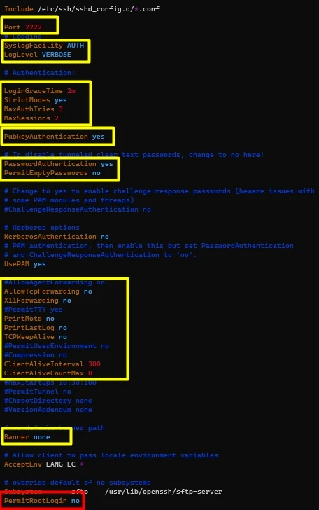


### D. ऑडिट स्कोर


अंत में, **लिनिस ऑडिट स्कोर** देखना न भूलें! हम देखते हैं कि **मेरा हार्डनिंग स्कोर 63 है** और रिपोर्ट फ़ाइल "**/var/log/lynis-report.dat**" में देखी जा सकती है। "**/var/log/lynis.log**" फ़ाइल भी है।


**दूसरे शब्दों में, स्कोर जितना ज़्यादा होगा, उतना ही बेहतर होगा!** इसलिए आपको अपने कॉन्फ़िगरेशन पर काम करके सबसे ज़्यादा स्कोर हासिल करना होगा, साथ ही अपनी मशीन और होस्टेड सेवाओं को सामान्य रूप से काम करने देना होगा (जिसका मतलब है कि आपको फ़ंक्शनल टेस्ट करने होंगे)।


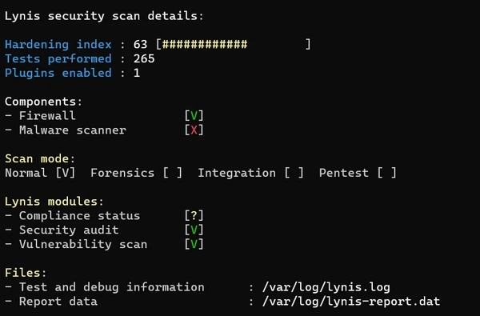


आइए मेरे दूसरे सर्वर के नतीजों पर एक नज़र डालते हैं, जहाँ मैंने थोड़ा ज़्यादा समय हार्डनिंग में बिताया! इसलिए यह स्वाभाविक है कि स्कोर ज़्यादा (**76**) होगा।


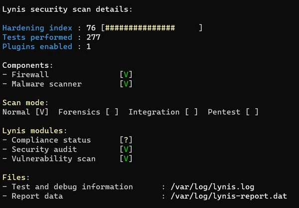


## वी. लिनिस स्वचालित योजना


**Lynis** एक निर्धारित कार्य के माध्यम से अपनी जाँच चलाने का विकल्प भी प्रदान करता है। वास्तव में, **"--cronjob "** विकल्प मौजूद है, जो सत्यापन या उपयोगकर्ता कार्रवाई की आवश्यकता के बिना सभी Lynis परीक्षण चलाएगा। फिर आप बहुत आसानी से एक स्क्रिप्ट बना सकते हैं जो **Lynis** चलाएगी और आउटपुट को संबंधित सर्वर के नाम के साथ एक टाइम-स्टैम्प्ड फ़ाइल में डाल देगी। यहाँ इस प्रकार की एक फ़ाइल दी गई है जिसे आप */etc/cron.daily* फ़ोल्डर में रख सकते हैं:


```
#!/bin/sh
mkdir /var/log/lynis
NOM_AUDITEUR="tache_crontab"
DATE=$(date +%Y%m%d)
HOTE=$(hostname)
LOG_DIR="/var/log/Lynis"
RAPPORT="$LOG_DIR/rapport-${HOTE}.${DATE}"
DATA="$LOG_DIR/rapport-data-${HOTE}.${DATE}.txt"

cd /root/Lynis./Lynis -c --auditor "${NOM_AUDITEUR}" --cronjob > ${RAPPORT}
mv /var/log/lynis-report.dat ${DATA}
```


**"AUDITOR_NAME "** चर केवल एक चर है जिसे हम **Lynis** के **"--auditor "** विकल्प में सेट करेंगे ताकि यह नाम रिपोर्ट में प्रदर्शित हो:


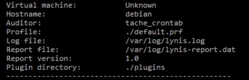


हम कुछ प्रासंगिक चर भी बनाने जा रहे हैं जो हमें स्वयं को बेहतर ढंग से व्यवस्थित करने में मदद करेंगे, जैसे कि रिपोर्ट को नाम देने और उस पर समय अंकित करने के लिए होस्ट नाम और दिनांक, तथा उस फ़ोल्डर का पथ जिसमें हम अपनी रिपोर्ट रखना चाहते हैं।


## VI. निष्कर्ष


लिनिस एक बेहद व्यावहारिक टूल है जो आपको समय बचाने और लिनक्स सर्वर के कॉन्फ़िगरेशन की स्थिति, खासकर सुरक्षा के मामले में, के बारे में ज़्यादा जानने में मदद करेगा। हालाँकि, यह न भूलें कि हर बदलाव को प्रोडक्शन में लागू करने से पहले, आपके अपने उपयोग और संदर्भ को ध्यान में रखते हुए, उसका परीक्षण ज़रूर करना चाहिए।


आप संभवतः इंटरनेट से जुड़े VPS के लिए समान कॉन्फ़िगरेशन लागू नहीं करेंगे, जहाँ आपको केवल एक SSH कनेक्शन की आवश्यकता होगी (क्योंकि आप ही एकमात्र व्यक्ति हैं जो कनेक्ट हो रहे हैं), इसके विपरीत **bastion** या **scheduler** को **SSH.** कनेक्शनों को गुणा करने की आवश्यकता होगी।


एक बार जब आपको हार्डनिंग के लिहाज़ से उपयुक्त कॉन्फ़िगरेशन मिल जाए, तो एक ऑटोमेशन टूल अपनाना उचित होगा ताकि आपको काम दोबारा मैन्युअली न करना पड़े, क्योंकि यह समय लेने वाला और त्रुटि-प्रवण होगा। उदाहरण के लिए, आप **: पपेट, शेफ, एन्सिबल, आदि...** का उपयोग कर सकते हैं।


कार्यान्वयन से पहले अपनी टीमों के साथ संवाद करना न भूलें: आपको उन्हें यह समझाना होगा कि आप ये बदलाव क्यों कर रहे हैं, न कि केवल यह बताना होगा कि आप ये बदलाव क्यों कर रहे हैं। अंततः, उद्देश्य अच्छे तरीकों को आगे बढ़ाना होगा, और इससे आपकी सफलता की संभावनाएँ बढ़ेंगी।


अंत में, आप **लिनिस** की तुलना अन्य टूल्स से भी कर सकते हैं, जिनमें से कई उपलब्ध हैं। अगर आप ओपन सोर्स रहते हुए केंद्रीकृत प्रबंधन की ओर बढ़ना चाहते हैं, तो मैं [वाज़ुह] टूल (https://wazuh.com/) की सलाह देता हूँ।


**यह ट्यूटोरियल समाप्त हो गया है, लिनिस के साथ मज़े करें!**