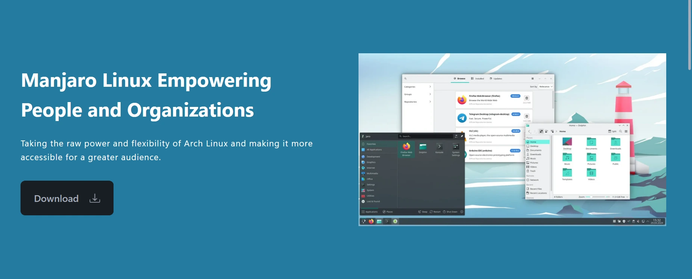


아치 리눅스는 견고함과 안정성 덕분에 여러 분야에서 널리 사용되는 운영체제입니다. 하지만 초보 사용자에게는 익숙해지기 어려울 수 있습니다. 이러한 문제를 해결하기 위해 **만자로**는 직관적이고 배우기 쉬운 Address을 기반으로 아치 리눅스의 강력한 기능을 제공하면서도 더 간단하고 접근하기 쉬운 환경을 제공하기 위해 만들어졌습니다.


## Manjaro 시작하기


Manjaro의 가장 큰 자산 중 하나는 **간단하고 효율적인 업데이트 시스템**입니다. 수동으로 관리할 필요가 없습니다: Manjaro가 알아서 처리해 드립니다! 알림 영역의 아이콘(에디션에 따라 위치가 달라짐)이 업데이트가 있을 때 알려줍니다. 안내에 따라 진행하기만 하면 빠르고 간편하게 업데이트가 완료됩니다.


Manjaro는 **방대한 애플리케이션 카탈로그**도 제공합니다. Manjaro는 Arch Linux를 기반으로 하기 때문에 독점 애플리케이션을 포함한 다양한 소프트웨어가 풍부한 공식 리포지토리에 직접 액세스할 수 있다는 이점이 있습니다. Manjaro는 추가 테스트를 위해 일부 Arch Linux 업데이트를 약간 지연시키므로 새 릴리스가 약간 지연되는 대신 안정성이 향상됩니다. 이 선택이 충분하지 않다면 커뮤니티에서 관리하는 거대한 라이브러리인 **AUR(*Arch 사용자 리포지토리*)**에 액세스할 수도 있습니다. 공식 리포지토리에 없는 프로그램이라면 AUR에서 사용할 수 있을 가능성이 높습니다.


만자로의 또 다른 장점은 Windows나 macOS와 같은 시스템보다 리소스를 훨씬 덜 소모한다는 점입니다. RAM과 컴퓨팅 성능을 덜 소모하므로 구형 컴퓨터나 성능이 떨어지는 컴퓨터에 이상적인 선택이며, 컴퓨터의 유동성과 속도가 향상되어 제2의 젊음을 되찾을 수 있습니다.


무엇보다도 Manjaro는 **완전히 무료**입니다. Windows나 macOS와 달리 설치 및 활용을 위해 비용을 지불할 필요가 없습니다. 마지막으로, 정기적이고 신속한 업데이트를 통해 취약점에 대한 노출을 제한하는 **강화된 보안**을 제공합니다. 또한 활발한 커뮤니티를 통해 문제를 신속하게 수정하고 효과적인 해결책을 제시합니다.


## 만자로 OS 알아보기


Manjaro 설치를 시작하기 전에 이 배포판은 여러 가지 버전으로 제공된다는 점을 알아두는 것이 중요합니다. 이러한 각 에디션은 워크플로와 시스템 리소스 소비에 영향을 미치는 고유한 데스크톱 환경을 제공합니다. Manjaro에는 세 가지 주요 공식 버전이 있습니다.


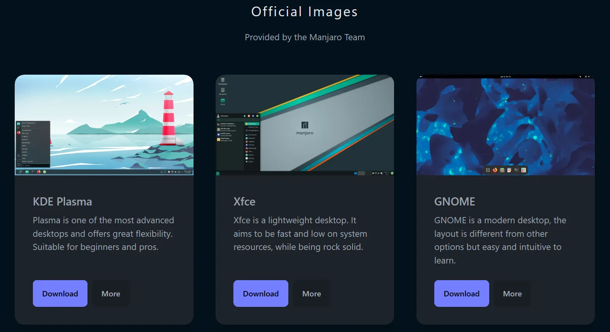


- KDE 플라즈마** 에디션은 가장 커스터마이징이 가능합니다. 시각적으로 우아하고 고성능을 갖춘 시스템을 찾고 있다면 KDE Plasma는 탁월한 선택입니다. 이 안정적인 데스크톱 환경은 완벽한 제어와 맞춤형 경험을 원하는 사용자에게 이상적입니다.


- 리소스가 더 제한된 컴퓨터의 경우 **Xfce** 에디션이 이상적인 솔루션입니다. Interface는 가볍고 직관적이어서 구형 컴퓨터에서도 원활한 작동을 보장합니다. 또한, Windows를 연상시키는 레이아웃으로 신규 사용자가 Linux로 쉽게 전환할 수 있습니다.


- 마지막으로, **GNOME** 에디션은 완전히 다른 접근 방식을 제공합니다. 간소화된 디자인은 가상 작업 공간을 통해 생산성과 정리를 강조합니다. 이 활동 중심의 워크플로는 이미 Linux에 익숙하고 미니멀하고 효율적인 환경을 원하는 사용자에게 특히 매력적입니다.


### 다른 만자로 에디션


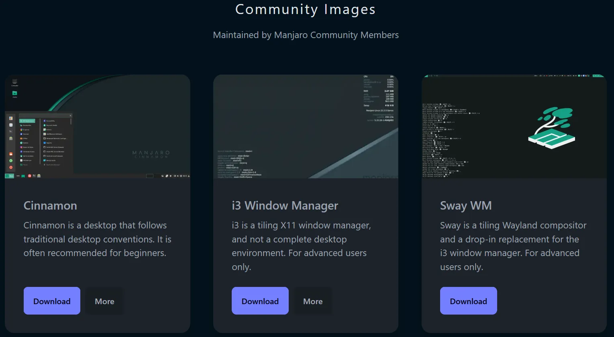


공식 버전 외에도 Manjaro 커뮤니티에서는 다른 버전도 제공합니다. 이러한 대체 버전은 특정 요구 사항을 충족하고 다양한 데스크톱 환경을 제공하도록 설계되었습니다.


시나몬** 에디션은 이제 막 시작하여 익숙한 Interface를 찾고 있다면 탁월한 선택입니다. 기존 사무실 환경의 고전적인 관습을 유지하면서 사용하기 쉽도록 설계되었습니다.


고급 사용자를 위해 **i3 Window Manager** 또는 **Sway**와 같은 버전이 있습니다. 훨씬 가볍고 빠르지만, 명령줄을 완벽하게 구성하고 활용하려면 숙달된 숙련도가 필요합니다. 이러한 환경은 시스템을 완벽하게 제어하고 싶고 효율성을 무엇보다 중요시하는 사용자에게 이상적입니다.


## 기술 요구 사항


Manjaro가 최적으로 작동하려면 컴퓨터가 몇 가지 최소 요구 사항을 충족해야 합니다. 최소한 :


- 64비트(x86_64) 프로세서
- 4GB RAM 권장(최소 2GB)**(아래 참조)
- 30GB의 디스크 공간(전용 `/home` 파티션을 생성하는 경우 더 많은 공간)


## 만자로 설치


다운로드하려면 [공식 Manjaro 웹사이트](https://manjaro.org/)로 이동하여 필요에 가장 적합한 에디션을 선택하세요. 파일을 다운로드한 후에는 Manjaro ISO 이미지로 부팅 가능한 USB 키를 만들어야 합니다.


그런 다음 [Rufus] 소프트웨어 웹사이트(https://rufus.ie/fr/)로 이동하여 다운로드합니다. 프로그램을 실행하고 USB 키를 연결한 다음 Manjaro ISO 이미지를 선택하고 깜박이기 시작합니다. 프로세스가 완료될 때까지 기다렸다가 키를 제거하세요. 그런 다음 컴퓨터를 다시 시작할 수 있습니다.


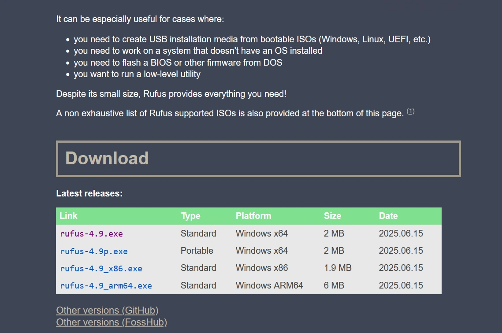


컴퓨터에 Manjaro를 설치하려면 먼저 컴퓨터의 전원을 완전히 끄세요. 그런 다음 USB 키를 연결하고 컴퓨터를 다시 켠 다음 **F2, F10, F12, Escape** 또는 **삭제**(제조업체에 따라 다름)를 눌러 부팅 메뉴 또는 UEFI/BIOS 펌웨어에 액세스하세요.


그런 다음 USB 키를 부팅 장치로 선택하여 OS 설치 프로세스를 시작합니다.


### 시작 화면


USB 키에서 Manjaro를 처음 실행하면 설치 메뉴로 바로 이동합니다. 설치를 시작하기 전에 키보드 레이아웃이나 시스템 언어를 변경할 수 있습니다.


그런 다음 **오픈 소스 드라이버로 부팅** 옵션을 선택하여 Manjaro 설치를 시작합니다. 이러한 오픈 소스 드라이버는 대부분의 하드웨어와 호환되며 대부분의 경우 충분합니다. 예를 들어 NVIDIA 그래픽 카드를 사용하거나 더 높은 그래픽 성능이 필요한 경우, 전용 드라이버를 사용하는 **전용 드라이버로 부팅**을 선택할 수 있습니다.


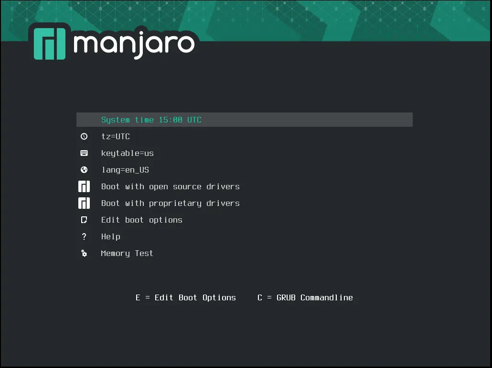


시스템이 **기본 라이브 모드**로 시작됩니다. 이를 통해 영구적으로 설치하기 전에 Manjaro의 기능을 테스트하여 필요에 맞는지 확인할 수 있습니다. 준비가 완료되면 **만자로 리눅스 설치** 옵션을 클릭합니다.


설치에 사용할 언어를 선택한 후 **다음**을 클릭합니다.


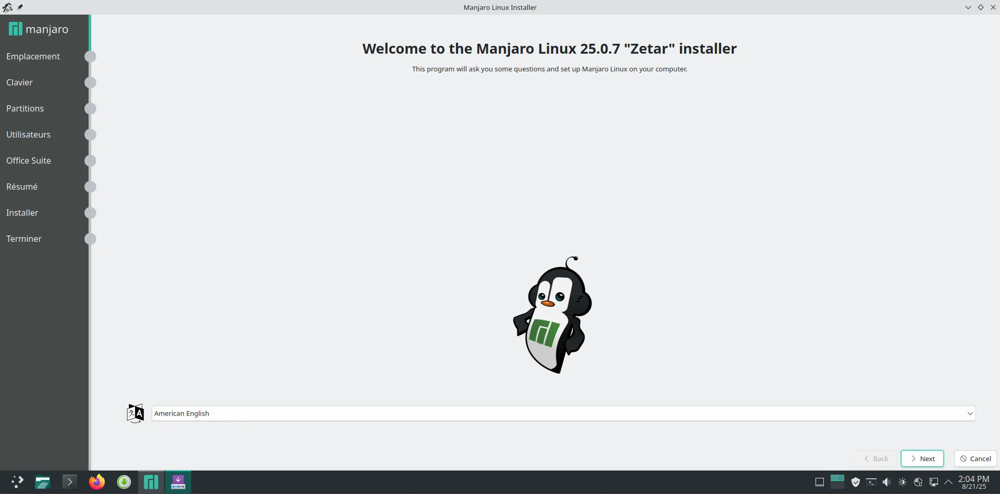


그런 다음 위치를 선택하여 올바른 시간대를 설정합니다. 이 단계에서 언어 및 날짜 형식을 변경할 수도 있습니다.


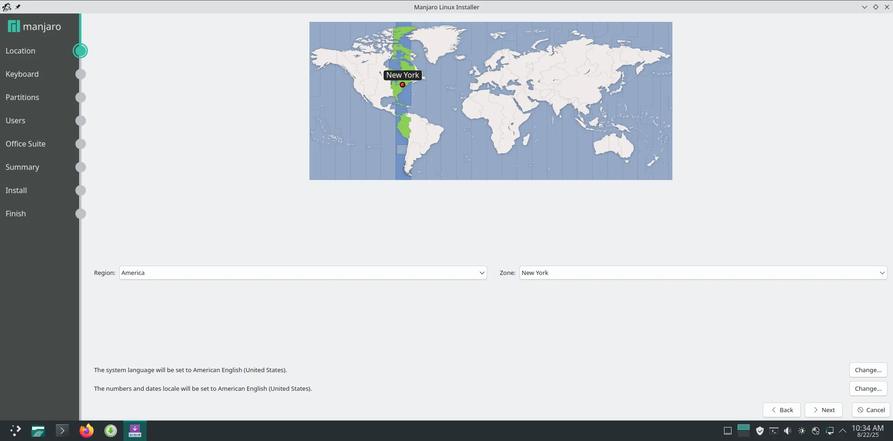


키보드 레이아웃을 선택합니다. 테스트 필드를 사용하여 입력한 키가 예상 문자와 일치하는지 확인할 수 있습니다.


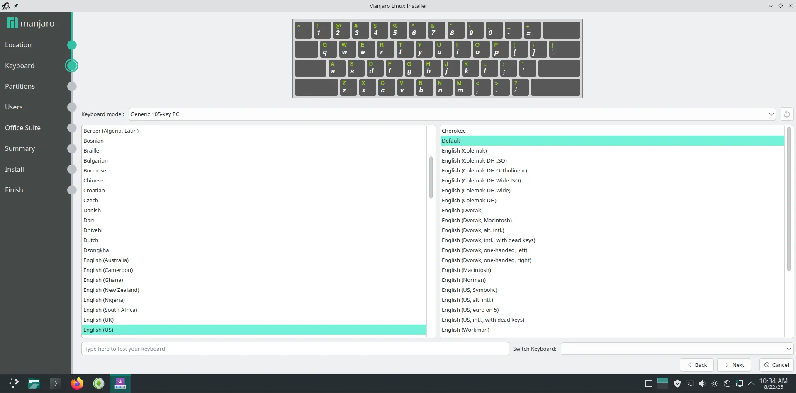


### 디스크 파티셔닝


디스크 파티션에는 두 가지 옵션이 있습니다.


- 가장 간단한 첫 번째 방법은 전체 디스크를 지우고 그 위에 Manjaro를 설치하는 것입니다.
- 두 번째는 **수동 파티셔닝**을 허용합니다.


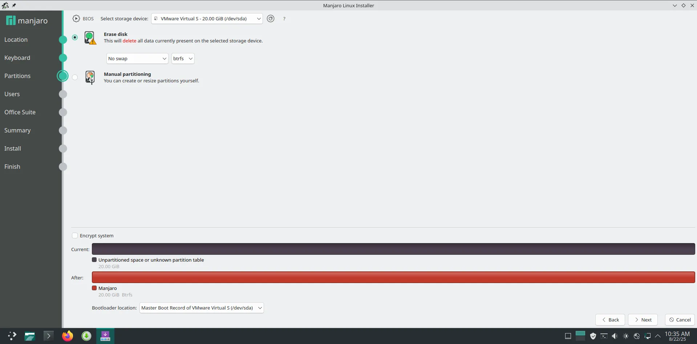


새로 설치하려면 파티션을 3개 이상 만드는 것이 좋습니다:


- 부팅**을 위한 **516MB**(기본)의 첫 번째 파티션입니다.
- 스왑**을 위한 두 번째 **2GB**(논리적) 파티션.
- 개인 데이터**를 위한 세 번째 파티션입니다.


다른 시스템을 병렬로 설치하려는 경우, 이 마지막 파티션을 분할하여 Manjaro에 한 부분만 할당해야 합니다(적절한 시스템 작동을 보장하려면 최소 **15GB** 이상).


### 사용자 계정 만들기


필요한 정보를 입력하여 시스템에서 사용자 계정을 만듭니다. 마지막으로 관리자 비밀번호(**root**)를 설정합니다. 이 관리자는 시스템에 대한 모든 권한과 고급 명령을 실행할 수 있는 **슈퍼 유저**입니다.


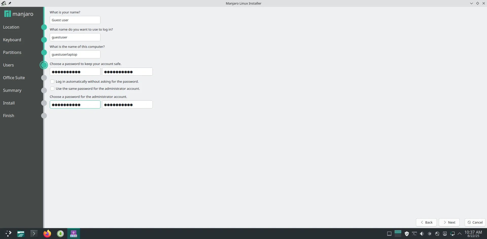


### 적합한 오피스 제품군 선택


Manjaro에서는 **FreeOffice**와 **LibreOffice** 중에서 선택할 수 있습니다.


- 더 다양한 소프트웨어와 고급 기능으로 더욱 완성도 높은 LibreOffice**를 만나보세요.
- 반면에 FreeOffice**는 더 가볍고 필수 기능만 포함되어 있습니다: **텍스트 메이커**, **플랜 메이커**, **프레젠테이션**.


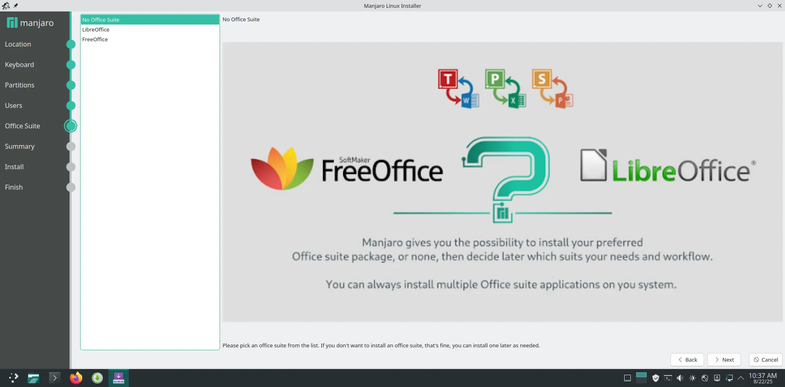


### 구성 요약


요약 화면에는 설정한 모든 매개변수가 표시됩니다. 필요한 경우 이미 설정한 다른 설정에 영향을 주지 않고 돌아가서 변경할 수 있습니다.


그런 다음 **설치**를 클릭하고 확인하여 실제 설치를 시작합니다.


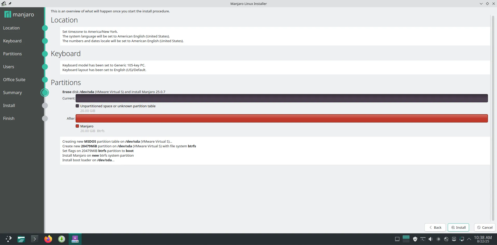


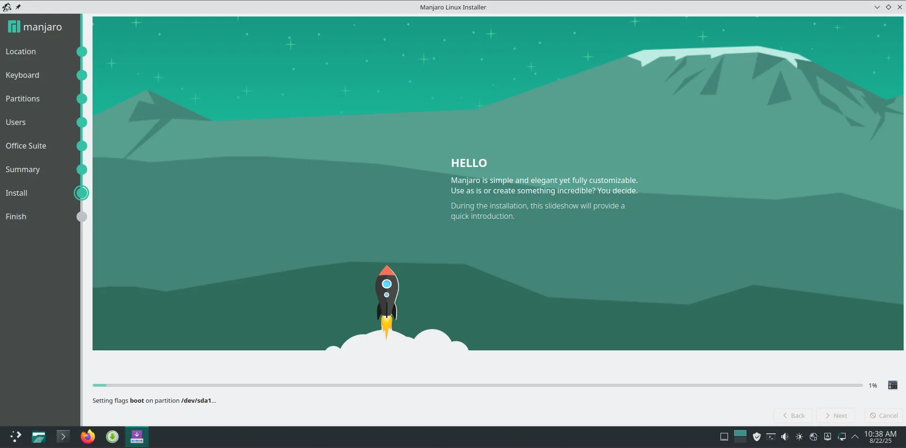


### 설치 종료


프로세스가 끝나면 **지금 다시 시작** 상자에 체크한 다음 **완료**를 클릭합니다. 시스템이 재부팅되고 **만자로를 사용할 준비가 완료됩니다**.


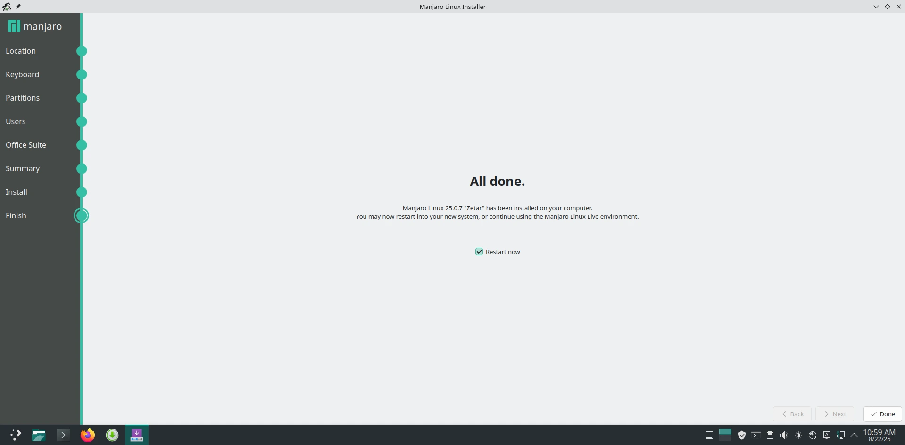


## Manjaro의 첫 걸음


Manjaro 설치는 첫 단계에 불과합니다. 시스템을 최대한 활용하기 위해 알아두면 유용한 몇 가지 사항을 소개합니다.


### 시스템 업데이트


Manjaro는 업데이트를 크게 간소화합니다. 패키지를 업데이트하려면 :


```shell
sudo pacman -Syu
```


이 명령은 사용 가능한 최신 버전을 다운로드하여 설치합니다. 시스템을 **안전하고 안정적으로 유지**하기 위해 정기적으로 실행하는 것이 좋습니다.


### 개발 환경 구성


Manjaro에서 웹 애플리케이션을 개발하려면 명령 한 번으로 필수 도구를 설치하세요:


```shell
sudo pacman -S nodejs npm git yarn
```


이 명령은 자바스크립트 및 타입스크립트 프로젝트를 실행하고 관리하기 위한 Node.js와 npm, 버전 관리를 위한 Git, 대체 패키지 관리자로서의 Yarn을 설치합니다.


### Bitcoin Wallet 설치


만자로에서 비트코인을 관리하려면 가볍고 안전한 Wallet인 **Electrum**을 설치하면 됩니다:


```shell
sudo pacman -S electrum  # Install Electrum
```


일렉트럼을 사용하면 **비트코인을 쉽게 받고 보낼 수 있으며, 다중 Wallet 관리 및 passphrase 보호와 같은 고급 기능을 제공합니다. 일렉트럼 사용에 대한 전체 가이드를 보시려면 전용 튜토리얼에서 Wallet 생성, 자금 보호, 거래 진행 방법을 확인해보세요.


https://planb.network/tutorials/wallet/desktop/electrum-efec9166-46b5-4937-8cee-6bc310975177

## Manjaro 시스템 보안


보안은 모든 Linux 설치에서 중요한 요소입니다. 데이터의 기밀성과 무결성을 보호하는 것이 중요합니다.


### 방화벽 구성


만자로에는 네트워크 필터 방화벽을 관리하기 위한 프로그램인 UFW(*Uncomplicated Firewall*)가 포함되어 있지만 수동으로 활성화해야 합니다:


```bash
# Installation if not present
sudo pacman -S ufw

# Firewall activation
sudo systemctl enable ufw.enable

sudo ufw enable

# Allow SSH connections (optional)
sudo ufw allow ssh

# Check the status
sudo ufw status verbose
```


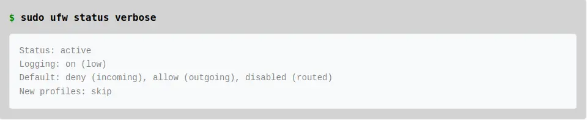


### 사용자 권한 관리


1. **권한이 없는 사용자 만들기**


```shell
sudo useradd -m username
sudo passwd username
```


2. **수더스 파일 구성**


```shell
sudo EDITOR=nano visudo
```


이제 여러분의 컴퓨터에서 만자로 리눅스를 사용할 준비가 되었습니다. 간단한 설치**, **쉬운 업데이트**, **유연성** 덕분에 개발, 일상적인 사용, 일렉트럼과 같은 도구로 비트코인을 관리하는 데 적합한 강력한 고성능 시스템을 갖추게 됩니다.


만자로는 **안정성, 속도, 보안**을 겸비한 동시에 **완전히 무료**이기 때문에 초보자와 고급 사용자 모두에게 이상적인 선택입니다. 시간을 내어 다양한 기능을 살펴보고 필요에 맞게 환경을 맞춤 설정하세요. 더 많은 전문 지식과 아치 리눅스 시스템에 대해 알아보고 싶으시다면 튜토리얼을 적극 추천합니다.


https://planb.network/tutorials/computer-security/operating-system/arch-linux-7a3dc8a8-629b-4971-bb0d-4eab94f93973