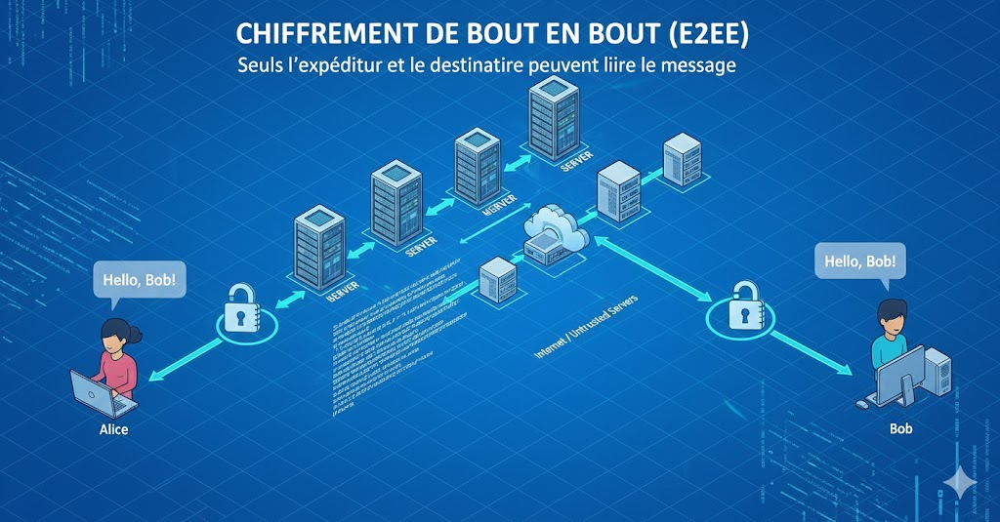
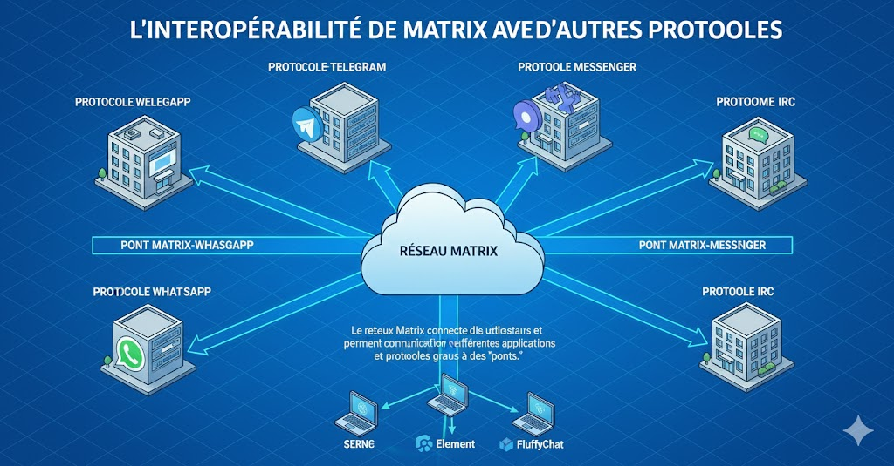
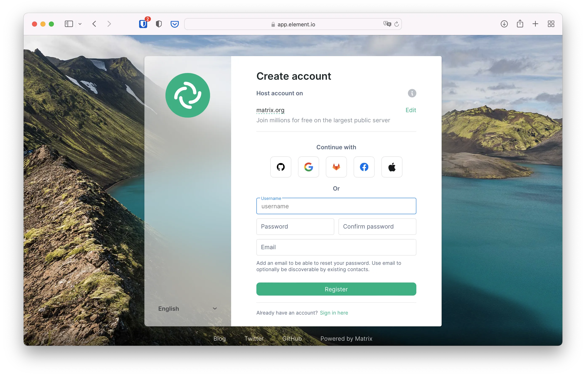
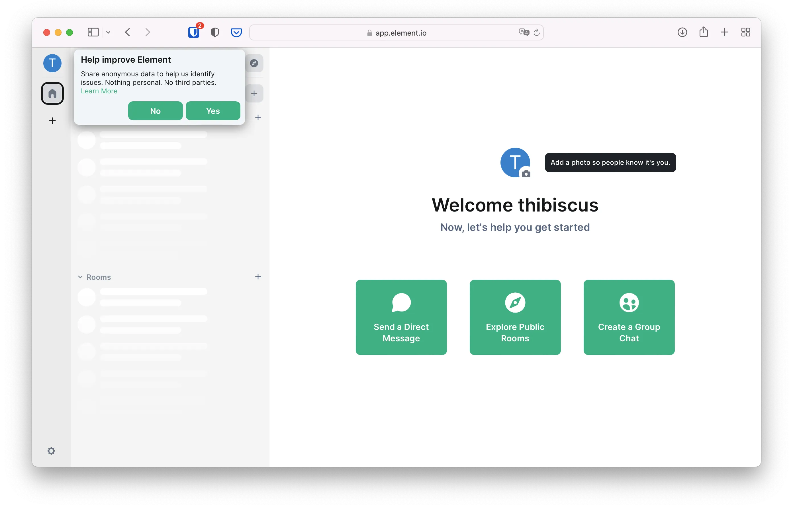
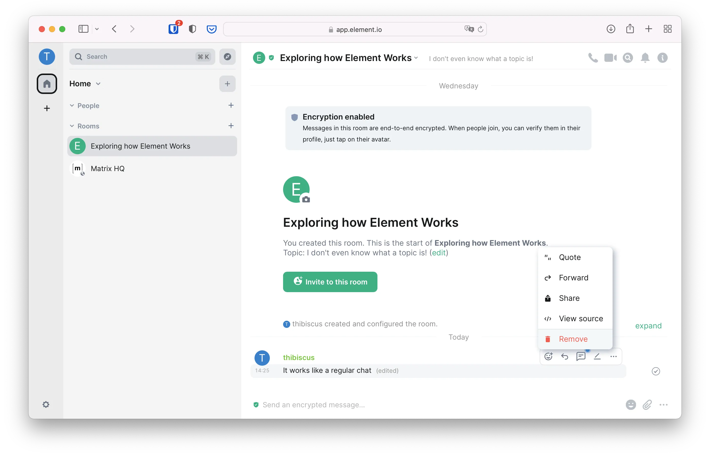
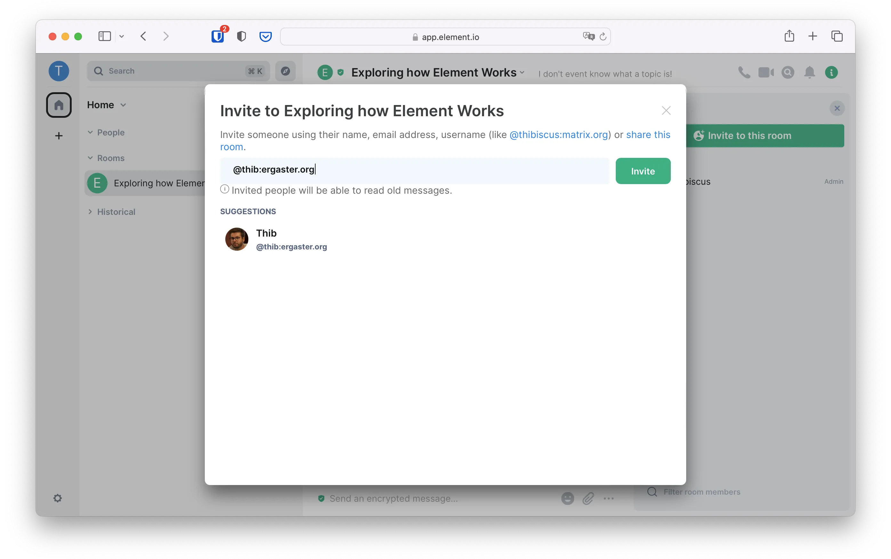
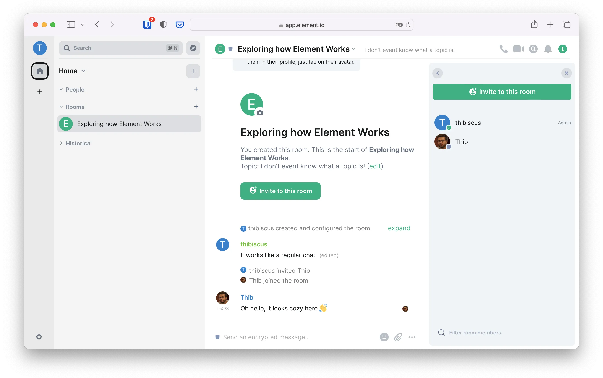
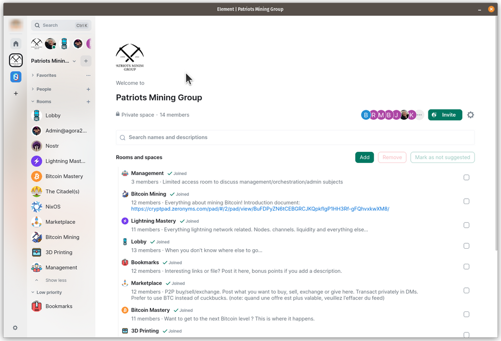

## 매트릭스란 무엇인가요?


Matrix는 중앙 기업에 의존하지 않고 사용자와 애플리케이션 간에 메시지, 파일, 음성/영상 통화를 교환할 수 있도록 설계된 **분산형 커뮤니케이션 프로토콜**입니다. 기존 메시징 플랫폼과 달리 Matrix는 이메일과 유사한 **개방형 인프라**로, 누구나 서버를 선택하거나 직접 운영할 수 있으며 나머지 네트워크와 교환할 수 있는 기능을 유지합니다.


매트릭스는 세 가지 기본 원칙으로 구분됩니다:


### 애플리케이션이 아닌 프로토콜


Matrix는 WhatsApp이나 Telegram과 같은 애플리케이션이 아닙니다.


많은 애플리케이션에서 사용할 수 있는 표준화된 언어입니다.


즉, FluffyChat, Cinny, Nheko 등 다양한 Element 소프트웨어가 동일한 Matrix 네트워크에 대한 액세스를 제공합니다.


이를 통해 연락처 손실 없는 애플리케이션 변경, 다양한 인터페이스, 단일 공급업체로부터의 독립성 등 완전한 자유를 보장합니다.


### 탈중앙화된 연합 네트워크


Matrix의 구조는 여러 독립 서버가 서로 협력하는 모델인 **연합**을 기반으로 합니다.


각 서버(_홈서버_라고 함)는 사용자, 채팅방을 호스팅하고 네트워크의 다른 서버와 메시지를 동기화할 수 있습니다.


따라서 :


- 단일 주체가 전체 시스템을 제어하지 않습니다;
- 서버는 나머지 네트워크에 영향을 주지 않고 사라질 수 있습니다;
- 각 조직이나 개인이 자신의 공간을 관리할 수 있습니다.


이 모델은 **높은 복원력**을 보장하고 기술 주권의 가치를 반영합니다.


### 안전한 암호화 시스템


Matrix는 비공개 거래소와 암호화된 그룹을 위해 **종단 간 암호화(E2EE)**를 지원합니다.


메시지는 중간 서버가 아닌 참가자만 읽을 수 있습니다.


이 접근 방식을 사용하면 프로토콜의 투명성과 자체 서버 호스팅 가능성을 유지하면서 교환 내용을 제삼자에게 노출하지 않고 통신할 수 있습니다.





### 고유한 상호 운용성


매트릭스의 주요 자산 중 하나는 서로 다른 통신 시스템 간의 **브릿지** 역할을 할 수 있다는 점입니다. 브리지_ 덕분에 연결이 가능합니다:


- Telegram
- WhatsApp
- Signal
- 메신저
- Slack
- 불화
- IRC, XMPP 등


이를 통해 여러 플랫폼에 흩어져 있는 커뮤니티를 통합하는 동시에 인프라에 대한 통제권을 유지할 수 있습니다.





## 매트릭스는 어떻게 작동하나요?


이 섹션에서는 분산된 생태계 내에서 사용자, 서버, 애플리케이션이 상호 작용하는 방식을 이해하기 위해 Matrix 네트워크의 내부 구조를 설명합니다. 매트릭스는 세 가지 필수 요소를 기반으로 합니다: 통신에 사용되는 _홈서버_, 신원, _클라이언트_입니다.


### 서버: 홈서버


매트릭스는 _홈서버_라는 독립 서버에서 실행됩니다.


각 홈서버는 :


- 호스팅하는 사용자 계정입니다,
- 이러한 사용자가 참여하는 비공개 대화 및 라운지를 차단합니다,
- 다른 네트워크 서버와 동기화합니다.


매트릭스 네트워크에 연결된 모든 홈서버는 공유 거실에서 자동으로 메시지와 이벤트를 주고받습니다. 예를 들어


- 서버 A에 등록된 사용자는 서버 B에 있는 사용자와 채팅할 수 있습니다,
- 살롱은 수십 대의 서버에 분산되어 있을 수 있습니다,
- 살롱이나 커뮤니티 전체를 통제할 수 있는 사람은 아무도 없습니다.


이 모델은 복원력이 뛰어나며 각 조직이나 개인이 자체 인프라를 관리할 수 있습니다.


### 매트릭스 식별자


각 사용자에게는 주소처럼 보이는 **MXID**(_매트릭스 ID_)라는 고유 식별자가 있습니다:


```bash
@nomdutilisateur:serveur.xyz
```


다음으로 구성됩니다:


- 앞에 **@**가 오는 사용자 이름입니다
- 계정이 생성된 서버의 이름 앞에 **:**를 붙입니다


예시:


- `@alice:matrix.org`
- `@bened:monserveur.bj`


이 식별자를 사용하면 원본 서버에 관계없이 다른 Matrix 사용자와 통신할 수 있습니다.


### 매트릭스 클라이언트(애플리케이션)


매트릭스를 사용하려면 **클라이언트 매트릭스**라는 애플리케이션에 연결해야 합니다.


가장 잘 알려진 것은 :


- 요소(웹, 모바일, 데스크톱)
- 플러피챗(모바일)
- Cinny(미니멀한 웹/데스크톱)
- Nheko(데스크톱)


이러한 애플리케이션은 단지 :


- 를 클릭하여 메시지를 확인합니다,
- 텍스트, 이미지 또는 파일을 전송합니다,
- 트레이드쇼에 참여하거나 생성하세요,
- 음성/영상 통화를 할 수 있습니다.


모든 애플리케이션은 동일한 표준화된 프로토콜을 통해 서버와 통신합니다.


### 룸 및 비공개 메시지(DM)


매트릭스에서 교환은 **룸**에서 이루어집니다:


- 방은 공개 또는 비공개일 수 있습니다
- 두 명 또는 수천 명을 수용할 수 있습니다
- 여러 서버 간에 공유할 수 있습니다
- 로 시작하는 고유 식별자가 있습니다


비공개 메시지는 두 명의 참여자만 있는 채팅방으로, 흔히 **DM(쪽지)**이라고도 합니다.


살롱 동기화는 참여 서버 간에 실시간으로 이루어지므로 탈중앙화를 유지하면서 원활한 경험을 보장합니다.


## 왜 매트릭스를 사용하나요?


매트릭스는 단순히 중앙 집중식 메시징 시스템의 대안이 아니라 디지털 주권, 보안, 상호운용성 측면에서 실질적인 요구를 충족하는 기술입니다. 점점 더 많은 사람, 기업, 기관이 커뮤니케이션을 위해 이 프로토콜을 선택하는 데에는 여러 가지 이유가 있습니다.


### 커뮤니케이션에 대한 통제력 회복


대부분의 메시징 플랫폼은 서버, 액세스, 데이터 및 사용 규칙을 단일 플레이어가 제어하는 중앙 집중식 모델에서 운영됩니다. 이 모델은 공급업체에 대한 전적인 의존성을 의미합니다.


Matrix는 다른 접근 방식을 취합니다.


누구나 자신의 계정을 호스팅할 위치를 선택하거나 자체 서버를 배포할 수 있습니다. 어떤 기업도 사용자를 차단하거나 신원 확인을 요구하거나 정책 변경을 강요할 수 있는 권한이 없습니다.


이 아키텍처는 개인과 조직 모두에게 자율성을 돌려줍니다. 커뮤니케이션은 더 이상 회사에 대한 신뢰가 아니라 문서화되고 검증 가능한 개방형 프로토콜에 기반합니다.


### 안전한 암호화 통신


Matrix는 비공개 대화 및 그룹에 대한 엔드투엔드 암호화를 지원합니다. 이 메커니즘은 메시지가 페더레이션의 타사 서버를 통과하더라도 참가자만 메시지를 읽을 수 있도록 보장합니다.


이 프로토콜은 분산된 다중 디바이스 환경에서 강력한 보안을 제공하도록 특별히 설계된 Megolm/Olm 알고리즘을 사용합니다.


이를 통해 다음을 수행할 수 있습니다:


- 민감한 대화를 보호합니다,
- (호스트 서버에서도) 무단 액세스를 방지합니다,
- 장기적으로 기밀을 유지합니다.


암호화는 선택 사항이 아니라 프로토콜의 핵심 구성 요소입니다.


### 더 이상 단일 애플리케이션에 종속되지 않음


Matrix는 애플리케이션이 아니라 프로토콜입니다.


이러한 고객의 다양성은 :


- 개인의 필요에 맞는 선택입니다,
- 모든 유형의 기기에서 Matrix를 사용할 수 있습니다,
- 단일 소프트웨어에 의존하지 않습니다.


고객이 부적합하거나 유지 관리를 중단하는 경우 다른 고객을 선택하기만 하면 계정은 계속 정상적으로 운영됩니다.


### 서로 다른 커뮤니티 연합 및 상호 연결


페더레이션을 사용하면 서로 다른 서버를 독립적으로 관리하면서 함께 작업할 수 있습니다.


따라서 :


- 조직은 자체 홈서버를 관리할 수 있습니다,
- 개인이 공용 서버에 참여할 수 있습니다,
- 모두 같은 플랫폼에 있는 것처럼 서로 소통할 수 있습니다.


이러한 유연성 덕분에 팀, 협회, 커뮤니티, 기관 또는 오픈 소스 프로젝트 등 모든 요구사항에 맞는 커뮤니케이션 공간을 만들 수 있습니다.


매트릭스는 특히 기술계, 활동가 집단, 연구자, 정부, 그리고 점점 더 많은 Bitcoin 커뮤니티에서 인기를 얻고 있습니다.


### 메시징 환경에서의 고유한 상호 운용성


연결할 수 있는 브리지 덕분에 거래소를 **확장**할 수 있다는 점이 Matrix의 주요 자산 중 하나입니다:


- WhatsApp
- Telegram
- Signal
- Slack
- 불화
- IRC
- XMPP
- 및 기타 여러 플랫폼


따라서 매트릭스는 서로 다른 애플리케이션에 흩어져 있는 여러 커뮤니티를 하나로 모으는 커뮤니케이션의 통합 계층이 됩니다.


이러한 상호 운용성은 파편화를 줄이고 협업을 간소화합니다.


### 무료, 개방형, 지속 가능한 프로토콜


매트릭스 프로토콜은 완전히 오픈 소스이며 투명하게 개발되었습니다.


이는 몇 가지 이점을 보장합니다:


- 표준을 지속적으로 발전시키고 있습니다,
- 누구나 코드를 확인할 수 있는 기능을 제공합니다,
- 상업적 또는 정치적 변화로부터의 독립성,
- 장기적인 복원력.


독점 메시징 시스템과 달리 Matrix의 미래는 단일 회사가 아닌 글로벌 커뮤니티와 개방형 표준에 달려 있습니다.


## Matrix 계정은 어떻게 만들 수 있나요?


매트릭스 계정 생성은 간단하며 기술적인 기술이 필요하지 않습니다. 사용자는 기존 서버에 가입하여 로그인을 생성하고 바로 채팅을 시작할 수 있습니다. 이 섹션에서는 필수 단계를 간략하게 설명합니다.


### 서버 선택(공용 또는 비공개)


매트릭스는 연합 네트워크입니다. 여러 조직, 커뮤니티 또는 개인이 관리하는 수많은 서버(홈서버)가 있습니다. 서버 선택은 계정이 호스팅되는 '위치'만 결정할 뿐, 전체 네트워크와의 통신을 방해하지는 않습니다.


**두 가지 옵션을 사용할 수 있습니다


### - 공용 서버 사용


이것이 가장 간단한 해결책입니다.


인기 서버의 예


- _matrix.org_(가장 잘 알려진)
- _envs.net_
- 주제별 커뮤니티 서버(기술, 개인정보 보호, 오픈소스...)


이 서버는 빠르게 등록하려는 초보 사용자에게 적합합니다.


### - 비공개 서버 사용


에 이상적입니다:


- 조직입니다,
- 가족,
- 오픈 소스 프로젝트입니다,
- 작업 팀입니다,
- 또는 주권적인 자체 호스팅 용도로 사용할 수 있습니다.


이 경우 누군가가 서버(Synapse, Dendrite, Conduit...)를 관리해야 합니다.


어떤 서버를 선택하든 페더레이션 덕분에 사용자들은 서로 대화할 수 있습니다.


### 단계별로 계정 만들기


Matrix는 개방형 프로토콜이므로 여러 애플리케이션에서 액세스할 수 있습니다.


위에서 설명한 것처럼 요구 사항에 따라 다양한 인터페이스와 기능을 제공합니다:


- Element**: 모든 플랫폼에서 사용할 수 있는 가장 완벽한 클라이언트입니다.
- FluffyChat**: 심플하고 모던하며 모바일에 이상적입니다.
- Nheko**: 가볍고 인체공학적인 PC용 클라이언트.
- 쉴디챗**: 인체공학적으로 개선된 요소 변형.
- NeoChat**: KDE 에코시스템에 통합되었습니다.


어떤 클라이언트를 선택하든 계정에 영향을 미치지 않으며, 모든 Matrix 서버에서 작동합니다.


### 클래식 단계 :


- 선택한 애플리케이션을 엽니다. 여기서는 [엘리먼트](app.element.io)로 이 작업을 수행합니다.
- '계정 만들기'를 선택합니다.





간단히 설명하기 위해 **Google, Facebook, Apple, GitHub 또는 GitLab**을 사용하여 Matrix 계정을 만들 수 있습니다. 이러한 서비스는 해당 계정이 Matrix에 액세스하는 데 사용되었다는 사실만 알 수 있으며, 이를 **소셜 연결**이라고 합니다.


기밀성을 높이기 위해 **사용자 이름**, **비밀번호**, **이메일 주소**를 선택하여 수동으로 등록할 수도 있습니다.


선택한 서버에 따라 **보안문자**를 입력해야 할 수 있으며 **이용약관**에 동의해야 할 수도 있습니다.


등록이 확인되면 확인 이메일이 전송됩니다.


링크를 클릭해 계정을 활성화하고 웹 애플리케이션(엘리먼트)에 접속하면 첫 번째 매트릭스 대화에 참여할 수 있습니다.





이제 계정이 생성되어 웹 버전의 Element를 사용할 수 있습니다.


## 첫 번째 연락처 추가


Matrix에서 다른 사용자와 소통하려면 **Matrix ID**라는 전체 식별자만 알면 됩니다.


예시:


`@alice:matrix.org @bened:monserveur.bj`


### 연락처 추가하기


그룹채팅에 친구를 초대하려면 오른쪽 상단의 'i' 동그라미를 클릭합니다. 그러면 오른쪽 패널이 열립니다. '사람들'을 클릭하면 이 대화방의 구성원 목록이 표시됩니다. 현재 나만 대화방에 있는 상태여야 합니다.





사람 목록 상단의 '이 방에 초대'를 클릭하면 친구를 Matrix에 초대할 수 있는 메시지가 열립니다. 친구가 이미 Matrix에 로그인한 상태라면 Matrix ID를 입력합니다. 로그인하지 않은 경우 이메일 주소를 입력하면 친구를 초대할 수 있습니다.


'친구' 시스템은 없으며, 연락처는 단순히 대화가 개설된 사람입니다.





초대를 받은 사람은 초대를 수락하거나 거절할 수 있습니다. 상대방이 수락하면 대화방에 참여하게 됩니다. 많으면 많을수록 좋습니다!





### 나만의 서버 설정


Matrix는 개인 서버와 함께 사용할 때 그 진가를 발휘합니다.


자체 홈서버를 배포하면 다음을 수행할 수 있습니다:


- 데이터에 대한 완벽한 제어를 유지합니다,
- 자체 사용 규칙을 정의합니다,
- 여러 계정(친구, 팀, 커뮤니티)을 호스팅할 수 있습니다,
- 제한이나 검열이 발생할 경우 최대한의 복원력을 보장합니다.


**사용 가능한 솔루션:**


- Synapse**: 역사적으로 가장 완벽한 구현입니다.
- 덴드라이트**: 더 가볍고 강력하며 프로토콜의 미래를 위해 설계되었습니다.
- Conduit**: 배포하기 쉬운 미니멀한 변형입니다.


**전제 조건:**


- 도메인 이름입니다,
- 머신 또는 VPS,
- 최소한의 시스템 관리 기술.


약간의 구성이 필요하더라도 자체 서버를 관리하면 Matrix를 주권적이고 내구성 있는 도구로 만들 수 있습니다.


### 첫 무역 박람회 참가하기


매트릭스는 _룸_(거실)에 크게 의존합니다.


공공, 민간, 커뮤니티, 기술, 지역 및 국제 무역 박람회가 있습니다.


**살롱에 가입하는 세 가지 방법:**


1. **초대 링크를 통해**(보통 `matrix.to` URL 형태).


2. **애플리케이션에서 살롱 이름**을 검색합니다.


3. **전체 쇼 ID**를 입력합니다(예: :


`#bitcoin:matrix.org`


`#communauté-bénin:monsrv.bj`


일단 참여하면 채팅방은 사용하는 클라이언트에 따라 기록, 암호화, 파일, 리액션, 음성/영상 통화 등 일반 뉴스 그룹처럼 작동합니다.





## 더 나아가기


기본 기능을 익히고 나면 Matrix는 다양한 고급 기능을 제공합니다. 다른 메시징 시스템을 연결하거나, 자체 서버를 호스팅하거나, 커뮤니티를 구성하는 등 다양한 기능을 활용할 수 있는 에코시스템이 마련되어 있습니다.


### 브릿지(WhatsApp, Telegram, Signal 등)


브리지는 Matrix를 다른 메시징 시스템과 연결합니다.


를 통해 메시지를 주고받을 수 있습니다:


- WhatsApp
- Telegram**
- Signal**
- Facebook 메신저
- 불화
- Slack**
- IRC** (IRC)
- 및 기타 많은


### 교량이 할 수 있는 일


- Matrix에서 모든 대화를 중앙 집중화하세요
- 독점 서비스와의 상호 작용을 위한 개방형 인터페이스 제공
- 단일 위치에서 멀티플랫폼 커뮤니티 관리


공식적인 다리도 있고 커뮤니티 기반의 다리도 있습니다.


부서에 따라 를 요구할 수 있습니다:


- 개인 서버,
- 추가 구성이 필요합니다,
- 또는 기존 공용 다리를 사용하세요.


### Bitcoin 조직, 커뮤니티 또는 프로젝트에 Matrix 사용하기


Matrix는 단순한 개인 도구가 아닙니다.


워크그룹을 구성하거나, 지역 커뮤니티를 조직하거나, 프로젝트 커뮤니케이션을 관리하는 데 사용할 수 있습니다.


**사용 예:**


- 오픈 소스 커뮤니티
- Bitcoin 및 Lightning 에코시스템 프로젝트
- 학생 또는 개발자 그룹
- 시민 단체
- 독립 미디어
- 지역 그룹 및 협회


**이 점이 흥미로운 이유는 무엇인가요?


- 100% 오픈 소스** 도구
- 주권적이고 탈중앙화된** 커뮤니케이션
- 라운지**, **서브그룹**, **프라이빗 라운지** 등으로 구성된 공간.
- Nextcloud, GitLab, Mattermost 또는 사용자 지정 봇과 통합하기
- 미세 조정된 권한 및 중재 관리


그런 다음 매트릭스는 대규모 중앙 집중식 플랫폼으로부터 독립성을 유지하고자 하는 모든 구조의 커뮤니케이션 기둥이 됩니다.


## 결론


매트릭스는 실시간 커뮤니케이션을 위한 현대적이고 개방적이며 안전한 솔루션으로, 기존 플랫폼에 대한 탈중앙화된 대안을 제시합니다. 연합 아키텍처와 고급 암호화 프로토콜 덕분에 사용자는 유연하고 상호 운용 가능한 경험을 즐기면서 데이터에 대한 통제권을 유지할 수 있습니다. 개인용, 업무용, 커뮤니티용 등 어떤 용도로 사용하든 Matrix는 오늘날의 요구에 맞는 커뮤니케이션 환경을 구축할 수 있는 강력하고 확장 가능한 프레임워크를 제공합니다.


Matrix에서 제공하는 모든 기능에 대해 자세히 알아보려면 여기에서 공식 문서를 참조하세요:


[https://matrix.org/docs/](https://matrix.org/docs/)