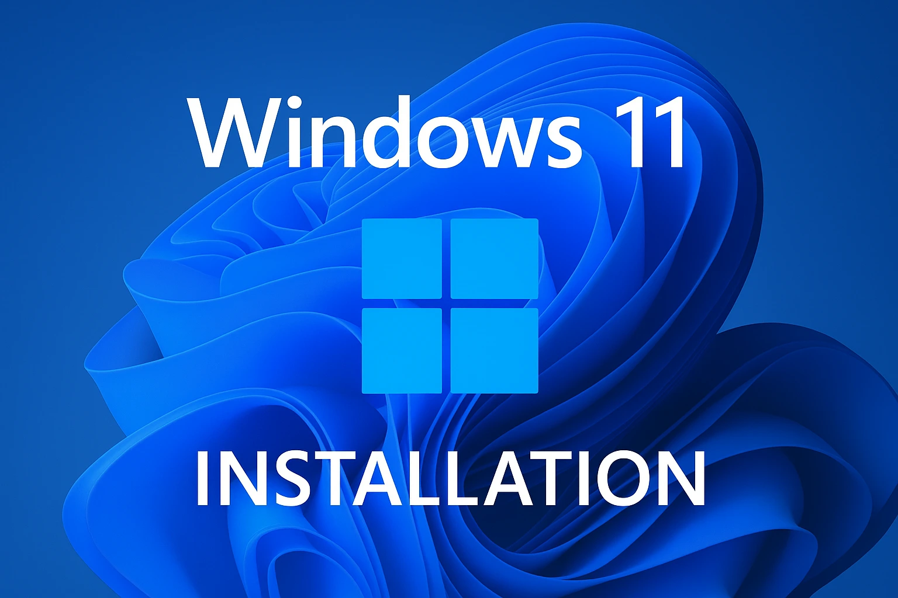

Trong hướng dẫn này, chúng ta sẽ tìm hiểu cách cài đặt Windows 11 tự động bằng một phương pháp khác với quy trình cài đặt Windows tiêu chuẩn.

## Tải xuống!

Điều đầu tiên bạn cần là một tập tin cài đặt. Nơi an toàn và đáng tin cậy nhất để tải xuống là trực tiếp từ trang web chính thức của Microsoft.

Chỉ cần truy cập vào liên kết được cung cấp bên dưới và làm theo hướng dẫn để tải xuống [tệp ISO Windows 11](https://www.microsoft.com/en-us/software-download/windows11)

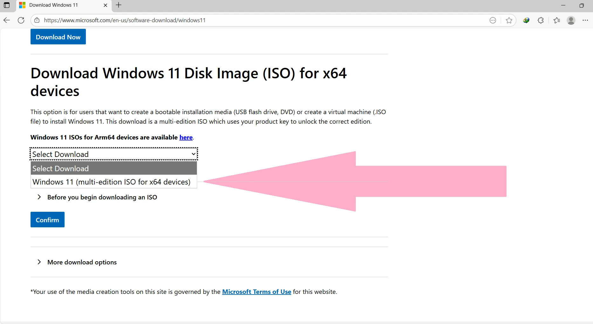

Khi bạn đã ở trên trang tải xuống, hãy cuộn xuống phần để tải xuống tệp ISO.

Và hãy chọn phiên bản phù hợp.

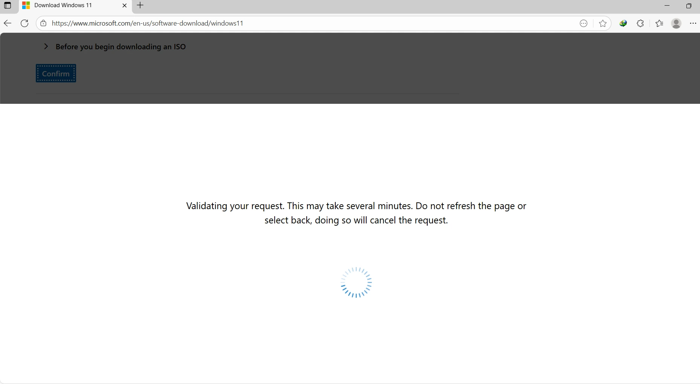

Sau khi chọn Windows 11, hãy nhấp vào nút Xác nhận.

Ở bước này, quá trình xử lý yêu cầu có thể mất vài giây, sau đó bạn sẽ thấy trang sau:

Sau khi xác nhận yêu cầu, bạn cần chọn ngôn ngữ ưa thích của mình.

Sau khi chọn ngôn ngữ và nhấn nút Xác nhận, yêu cầu sẽ được xử lý. Bước này có thể mất vài giây.

Sau khi yêu cầu được xử lý thành công, bạn sẽ thấy một trang có liên kết tải xuống tệp .iso. Nhấp vào nút Tải xuống 64-bit để bắt đầu tải xuống.

Dung lượng file khoảng 5,5 GB, và đường dẫn được tạo ra sẽ có hiệu lực trong 24 giờ.

## Tự động hóa!

Ở giai đoạn này, chúng ta cần thực hiện các thay đổi đối với quá trình cài đặt Windows tiêu chuẩn. Trong giai đoạn này, bằng cách sử dụng cài đặt tự động (Unattended install), chúng ta xác định các mục nào sẽ được cài đặt mà không cần sự can thiệp của người dùng sau đó. Trên thực tế, trong phương pháp này, một tệp XML được sử dụng để cấu hình các bước cài đặt và các dịch vụ được cài đặt trong Windows. Nói cách khác, việc sử dụng tệp Unattended.xml tạo ra một quy trình tự động hóa trong quá trình cài đặt, ngăn ngừa việc phải chọn nhiều tùy chọn và tránh các bước tẻ nhạt thường cần thiết trong quá trình thiết lập. Phương pháp này là một phương pháp không phổ biến nhưng là phương pháp tiêu chuẩn đã được Microsoft giới thiệu. Thông tin chi tiết hơn có sẵn trên [trang web chính thức của Microsoft](https://learn.microsoft.com/en-us/windows-hardware/manufacture/desktop/update-windows-settings-and-scripts-create-your-own-answer-file-sxs?view=windows-11).

Có nhiều công cụ trên internet để tạo tệp Unattended. Một số công cụ hoạt động trực tuyến, một số khác hoạt động ngoại tuyến. Một trong những công cụ trực tuyến để tạo tệp này là [trang web này](https://schneegans.de/windows/unattend-generator). Sau khi mở trang web, chúng ta sẽ thấy trang sau:

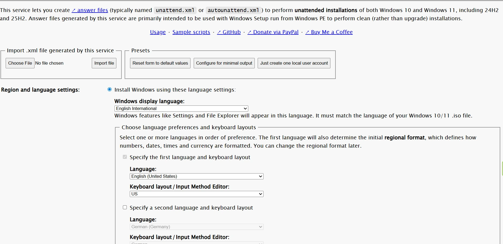

Như đã đề cập ở đầu trang, phương pháp này có thể được sử dụng để cài đặt Windows 10 và 11. Bước đầu tiên, chúng ta chọn ngôn ngữ Windows. Nếu cần thêm ngôn ngữ thứ hai hoặc thậm chí ngôn ngữ thứ ba vào danh sách ngôn ngữ hiển thị và bàn phím của Windows, chúng ta có thể sử dụng hộp bên dưới:

Bước tiếp theo, chúng ta chọn vị trí mong muốn.

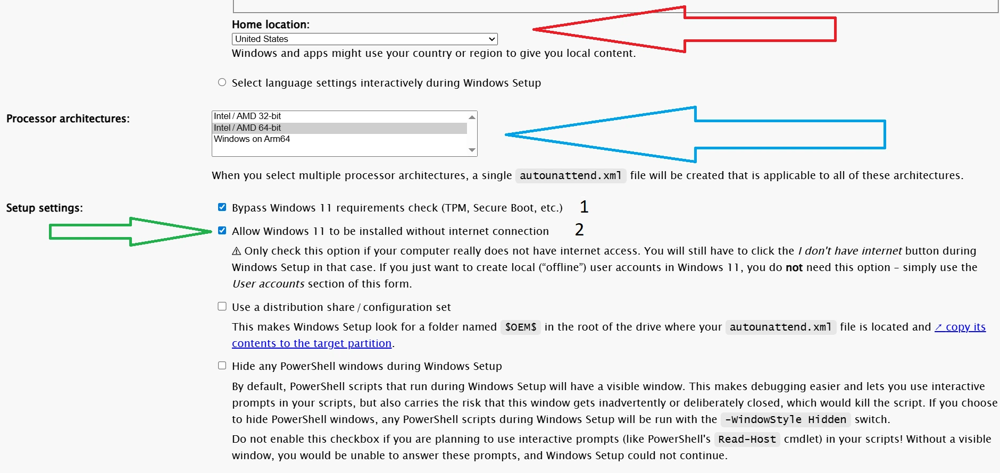

Ở giai đoạn này, chúng ta cũng có thể xác định kiến trúc bộ xử lý cho máy tính. Trong bước này, chúng ta có thể:

1. Quyết định xem có nên bỏ qua các tính năng bảo mật của Windows, chẳng hạn như TPM và Secure Boot hay không. Tính năng Secure Boot đảm bảo rằng nếu bất kỳ tệp tin cốt lõi nào của Windows bị can thiệp trong quá trình khởi động, sự cố sẽ được phát hiện và việc thực thi chúng sẽ bị ngăn chặn. Tính năng này cũng giúp bảo vệ hệ thống khỏi việc cài đặt các bản cập nhật độc hại trên Windows. Việc bật tùy chọn bỏ qua các tính năng này đôi khi là không thể tránh khỏi trên một số máy tính, đặc biệt là các mẫu máy cũ hơn. Tuy nhiên, nhìn chung, nên giữ cho các tính năng như Secure Boot được bật.

2. Bỏ qua yêu cầu kết nối internet để hoàn tất quá trình. Điều này hữu ích trong trường hợp không có kết nối mạng LAN có dây, vì trong hầu hết các trường hợp, card mạng không dây chưa được nhận diện trong quá trình cài đặt Windows và cần phải truy cập internet qua cáp. Kích hoạt tùy chọn này sẽ giải quyết các sự cố liên quan đến bước này.

Bước tiếp theo, chúng ta có thể chọn tên cho máy tính.

Chúng ta cũng có thể cho phép Windows tự chọn tên cho hệ thống. Ở bước này, chúng ta có thể chọn loại Windows, có thể là dạng nén hoặc không nén, hoặc để Windows tự động xác định phiên bản phù hợp dựa trên cấu hình máy tính. Múi giờ cũng có thể được thiết lập ở giai đoạn này.

Bước tiếp theo liên quan đến thiết lập phân vùng:

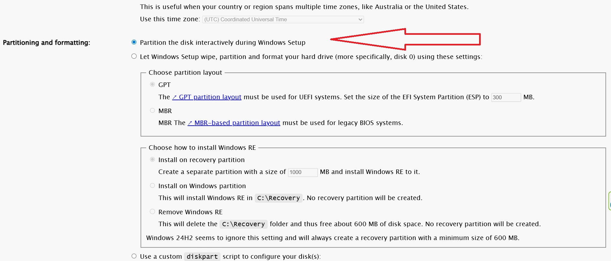

Ở giai đoạn này, chúng ta có thể chỉ định loại phân vùng để cài đặt Windows, cũng như các thiết lập cần thiết để cài đặt Môi trường Khôi phục Windows. Bằng cách chọn tùy chọn đầu tiên, việc chọn và phân vùng sẽ được hoãn lại đến thời điểm cài đặt Windows, và trong quá trình thiết lập, các câu hỏi này sẽ được hỏi giống như trong phương pháp cài đặt thông thường.

Ở bước này, chúng ta chọn phiên bản Windows để cài đặt:

Nếu có mã sản phẩm, bạn cũng có thể nhập mã đó ở bước này.

Bước tiếp theo là cấu hình tài khoản đăng nhập Windows:

## Cài đặt tài khoản

Ở giai đoạn này:

1. Chúng ta có thể đặt tên người dùng và mật khẩu cho tài khoản quản trị. Cũng có thể tạo nhiều tài khoản người dùng hoặc quản trị viên.

2. Tại đây, chúng ta chỉ định tài khoản nào sẽ được sử dụng để đăng nhập lần đầu tiên sau khi cài đặt Windows. Các tùy chọn khác nhau cho phần này được hiển thị trong hình ảnh.

3. Nếu bạn không muốn tạo bất kỳ tài khoản nào, hãy xóa tất cả tài khoản và chọn tùy chọn này. Trong trường hợp này, sau khi cài đặt Windows, bạn sẽ tự động đăng nhập vào tài khoản Quản trị viên Windows.

Bước tiếp theo bao gồm cấu hình mật khẩu và cài đặt tệp máy chủ:

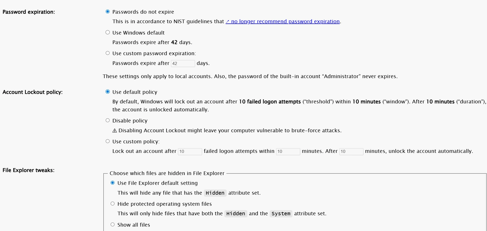

Ở giai đoạn này, chúng ta sẽ xác định xem mật khẩu có nên có thời hạn hết hạn hay không. Ngoài ra, phần này bao gồm các cài đặt bảo mật liên quan đến các lần đăng nhập không thành công, có thể được bật hoặc tắt tùy theo nhu cầu của bạn.

Ở cuối phần này, có các cài đặt hiển thị tập tin. Không có tùy chọn nào trong số này khả dụng trong quá trình cài đặt Windows tiêu chuẩn và phải được cấu hình sau khi cài đặt. Ngược lại, với phương pháp cài đặt tự động (Unattended installation), các cài đặt này dễ dàng truy cập hơn.

Bước tiếp theo là cấu hình các thiết lập bảo mật của Windows:

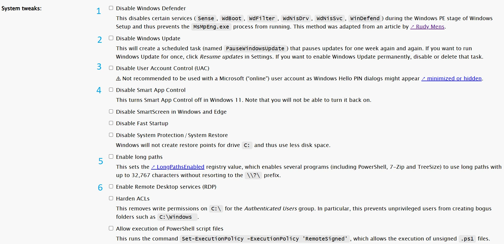

## Cài đặt bảo mật

Ở giai đoạn này:

1. Bạn có thể bật hoặc tắt Windows Defender. Tính năng này hoạt động như một phần mềm bảo mật trong Windows và giúp ngăn chặn việc thực thi các tập tin độc hại, một số cuộc tấn công mạng, v.v.

2. Có thể tắt tính năng cập nhật Windows tự động. Đây là một trong những thách thức phổ biến mà người dùng Windows gặp phải!

3. Phần này cho phép bật hoặc tắt UAC (Kiểm soát tài khoản người dùng). Tính năng này ngăn chặn các ứng dụng đáng ngờ chạy với quyền đọc và ghi cao.

4. Tính năng này được Windows sử dụng để phát hiện phần mềm có khả năng gây hại.

5. Bật hoặc tắt hỗ trợ đường dẫn dài trong các ứng dụng Windows, chẳng hạn như PowerShell và các ứng dụng khác.

6. Bật hoặc tắt tính năng Truy cập máy tính từ xa (Remote Desktop) để truy cập hệ thống từ xa.

Tùy thuộc vào phiên bản Windows đang sử dụng, một số tính năng này có thể được hỗ trợ hoặc không.

Bước tiếp theo là cấu hình các biểu tượng:

Trong phần này:

1. Danh sách các biểu tượng trên màn hình nền cho phép thêm hoặc xóa chúng khi cần thiết.

2. Danh sách các biểu tượng trong menu Bắt đầu được hiển thị, có thể thêm hoặc xóa tùy theo nhu cầu.

3. Phần này cho phép cấu hình xem các công cụ liên quan đến ảo hóa có được cài đặt hay không. Tùy chọn này chỉ dành riêng cho Windows 11 và không áp dụng cho Windows 10.

Bước tiếp theo là cấu hình cài đặt Wi-Fi:

Trong phần này, bạn có thể cấu hình cài đặt mạng Wi-Fi. Như đã đề cập trước đó, trong hầu hết các trường hợp, card Wi-Fi không được nhận diện trong quá trình cài đặt Windows, vì vậy việc kết nối trong quá trình thiết lập thường không thể thực hiện được. Tuy nhiên, bằng cách cấu hình phần này, nếu card không dây được phát hiện, hệ thống có thể kết nối với internet.

Bước tiếp theo liên quan đến một thiết lập quan trọng:

Trong phần này, chúng tôi sẽ xác định xem thông tin về sự cố hệ thống có nên được gửi đến Microsoft hay không.

Bước tiếp theo là cấu hình các ứng dụng mặc định:

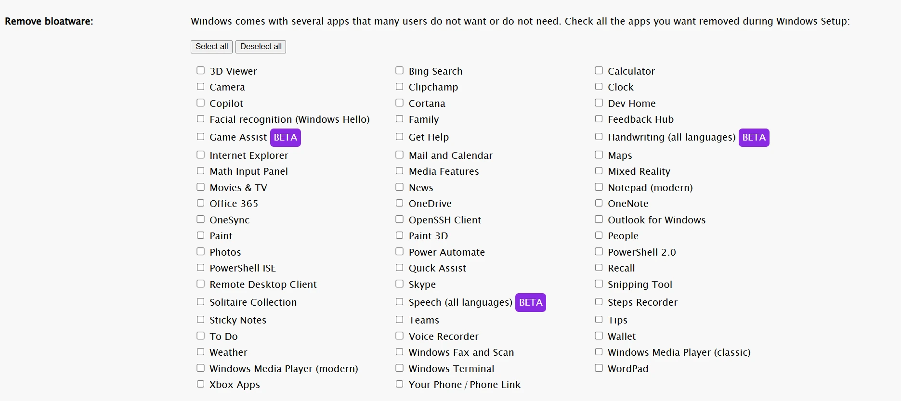

## Bật/tắt phần mềm mặc định

Trong phần này, chúng ta có thể chọn bất kỳ ứng dụng nào mà chúng ta không muốn được cài đặt mặc định. Ví dụ, chúng ta có thể chọn không cài đặt Cortana hoặc Copilot.

Bước tiếp theo liên quan đến các thiết lập bảo mật liên quan đến việc thực thi ứng dụng:

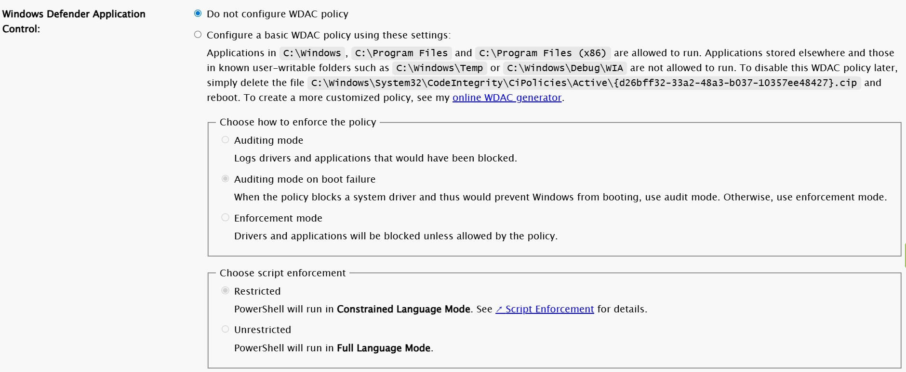

Bằng cách áp dụng các thiết lập WDAC, việc thực thi một số ứng dụng nhất định có thể bị ngăn chặn.

Cuối cùng, sau khi áp dụng các thiết lập mong muốn, tệp XML được tạo ra có thể được tải xuống:

Bằng cách nhấp vào Tải xuống tệp XML, tệp autounattend.xml sẽ được tải xuống. Để sử dụng tệp này, chỉ cần gắn tệp ISO đã tải xuống vào ổ USB, đặt tệp autounattend.xml vào thư mục gốc, sau đó tiến hành cài đặt Windows.

Một trong những công cụ có sẵn để tạo ổ USB khởi động là Rufus. Rufus có thể tạo ổ USB cài đặt Windows có khả năng khởi động, với tệp ISO cài đặt Windows được cung cấp. Quá trình này nhanh chóng và đơn giản, bạn có thể tải xuống [tại đây](https://rufus.ie/en/#download)

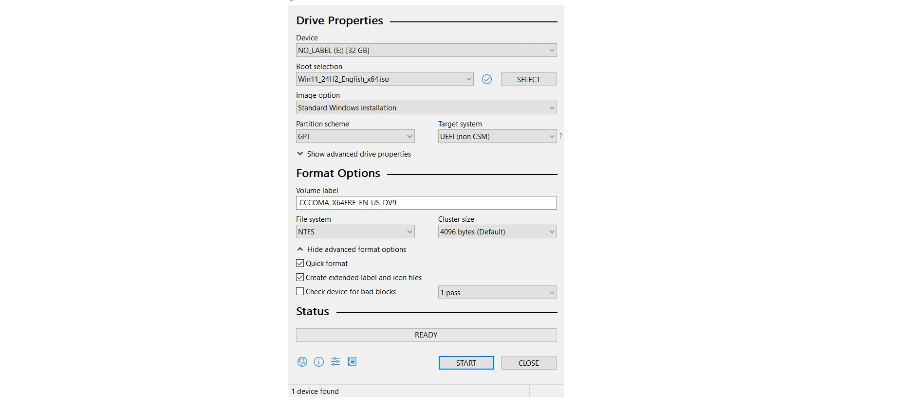

Trong phần mềm này, sau khi chọn ổ USB mong muốn và tệp ISO phù hợp, chúng ta nhấp vào Bắt đầu.

Ở bước này, chúng ta vô hiệu hóa tất cả các tùy chọn, vì việc kích hoạt chúng có thể gây xung đột khi sử dụng tệp Unattend được tạo ra. Sau khi các tệp được sao chép vào ổ USB, chúng ta đặt tệp autounattend.xml vào thư mục gốc:

Đến bước này, ổ USB đã sẵn sàng để sử dụng cài đặt Windows tự động và quá trình cài đặt có thể được bắt đầu bằng ổ đĩa này.

## Chỉnh sửa ISO

Nếu cần cài đặt Windows trên máy ảo, bạn có thể sử dụng phần mềm tạo và chỉnh sửa file ISO. Một trong những phần mềm đó là AnyBurn. Sau khi giải nén nội dung của file ISO tải xuống từ trang web của Microsoft, hãy đặt file autounattend.xml vào thư mục gốc. Sau đó, sử dụng AnyBurn để tạo một file ISO mới với nội dung đã được cập nhật.

AnyBurn là phần mềm đa chức năng dùng để làm việc với các tập tin ISO. Nó cung cấp nhiều tính năng để xử lý các tập tin ISO, một trong số đó là tạo ảnh ISO có khả năng khởi động; [đây](https://www.anyburn.com/download.php) là trang web chính thức.

Trên trang chủ của phần mềm, chọn "Tạo ảnh từ tập tin/thư mục":

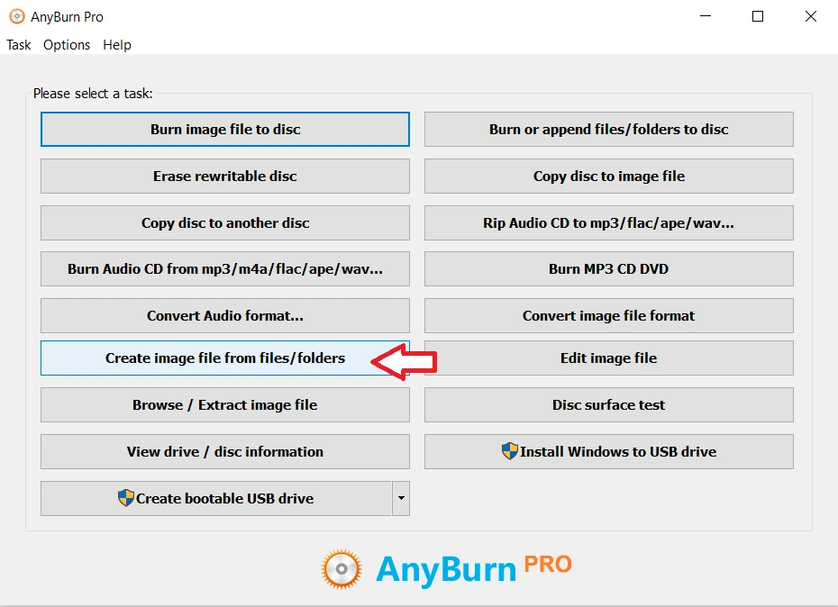

Ở trang tiếp theo, hãy chọn tất cả các tệp đã được giải nén từ ảnh ISO cùng với tệp autounattend.xml.

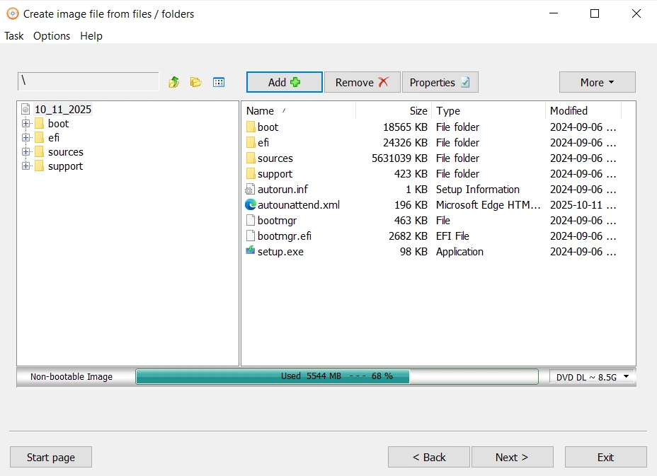

Ở bước này, chúng ta cấu hình các thiết lập để làm cho tệp ISO có thể khởi động được:

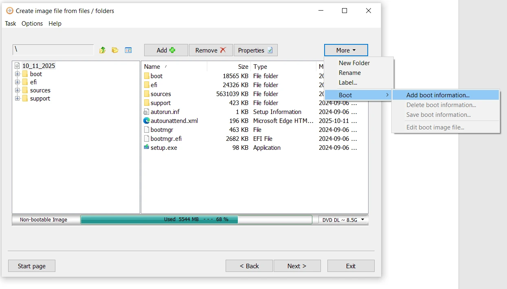

Ở bước này, cần thiết lập đường dẫn đến tệp bootfix.bin để làm cho ISO có thể khởi động được. Tệp này nằm ở thư mục gốc của ISO, bên trong thư mục boot. Bạn cũng nên bật cả hai tùy chọn ISO9660 và UDF trong phần Thuộc tính.

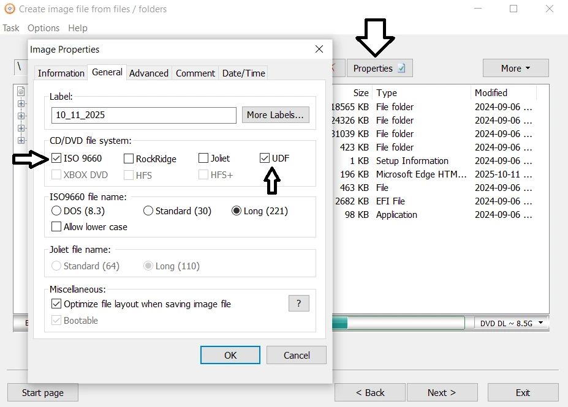

Sau bước này, nhấp vào Tiếp theo sẽ tạo tệp ISO. Tệp này có thể được sử dụng trong phần mềm ảo hóa như Oracle VirtualBox. Dưới đây là hướng dẫn về VirtualBox:

https://planb.academy/tutorials/computer-security/operating-system/virtualbox-6472f5be-10ce-4a07-8b24-097bfbcedd65