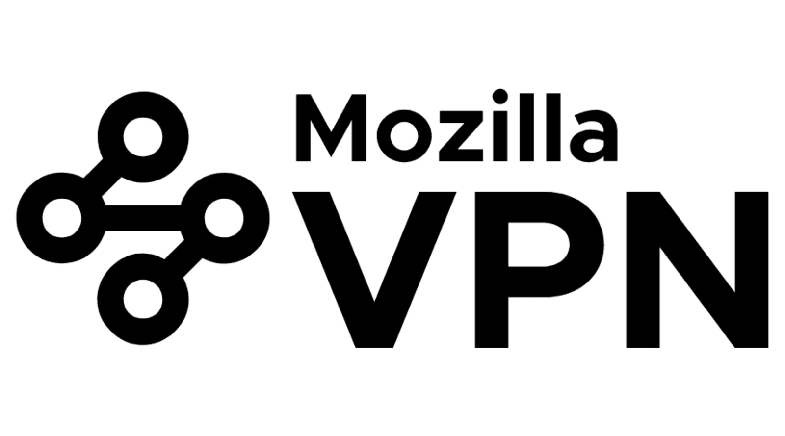

Di era digital pengumpulan data, privasi online telah menjadi masalah utama bagi kita para pengguna internet. Di antara pelacakan iklan, risiko peretasan melalui jaringan publik dan pembatasan geografis, semakin banyak pengguna yang beralih ke VPN (*Virtual Private Networks*) untuk mengamankan penjelajahan mereka. Di antara sekian banyak pilihan yang tersedia untuk mereka, layanan dari yayasan Mozilla, yang dikenal dengan Commitment untuk Internet yang bebas dan beretika, sangat menonjol. Dalam tutorial ini, kita akan melihat Mozilla VPN untuk mengendalikan privasi Internet Anda.

## Apa itu Mozilla VPN?

Sebuah ***Virtual Private Network*** (VPN) adalah sebuah sistem untuk membuat sambungan langsung antara komputer jarak jauh yang terhubung ke jaringan lokal yang berbeda. Dengan kata lain, VPN adalah sebuah sistem yang mengisolasi dan mengenkripsi pertukaran Anda dari lalu lintas lainnya di Internet. Untuk mempelajari lebih lanjut tentang VPN, kegunaannya, dan manfaat menggunakan VPN, lihat kursus SCU 101:

https://planb.network/courses/99c46148-7080-4915-a7e0-9df0e145cd47

Berdasarkan prinsip ini, [Mozilla VPN] (https://www.mozilla.org/fr/products/vpn/download/) adalah layanan VPN sumber terbuka yang dikembangkan pada tahun 2020 oleh Mozilla Foundation. Layanan ini tersedia di:

- Android,
- iOS,
- Mac,
- Linux,
- Windows,
- dan juga sebagai ekstensi untuk peramban Firefox Mozilla.

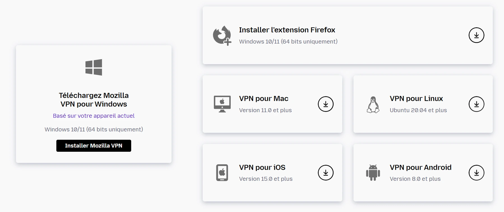

VPN ini tersedia di lebih dari 30 negara dan memiliki lebih dari 500 server yang bertanggung jawab untuk menyamarkan IP Address Anda untuk memindahkan Anda sambil memastikan kerahasiaan interaksi Anda di Internet. Mozilla VPN dibedakan dengan:

- Kemudahan penggunaan: grafik Interface yang ramping dan minimalis yang menunjukkan kepada Anda hal-hal penting dari server dan negara yang dapat Anda pilih.

- Teknologi WireGuard: protokol komunikasi dan perangkat lunak sumber terbuka yang menggunakan kriptografi mutakhir untuk membuat terowongan terenkripsi, menawarkan alternatif yang ringan dan lebih mudah digunakan dengan basis kode yang lebih kecil dan penekanan pada kecepatan dan keamanan.

- Harga transparan: sekitar 10 euro untuk biaya bulanan dan 5 euro per bulan untuk langganan tahunan.

- Beberapa perangkat yang terhubung: Sambungkan hingga 5 perangkat secara bersamaan ke akun Mozilla VPN Anda.

## Memulai dengan Mozilla VPN

Anda bisa mengunduh [Mozilla VPN](https://www.mozilla.org/fr/products/vpn/download/) tergantung pada sistem operasi Anda. Dalam tutorial ini, kita akan melihat Mozilla VPN di bawah sistem operasi Windows.

⚠️ Karena Mozilla VPN tidak tersedia di beberapa negara, Anda mungkin akan menemukan notifikasi ini saat mengunduh aplikasi Mozilla VPN dari Google Play Store.

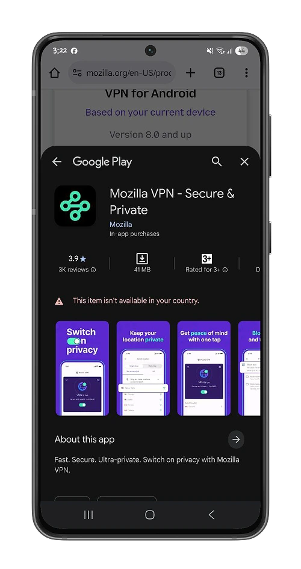

Setelah berhasil terinstal, klik tombol **Daftar** untuk membuat akun baru.

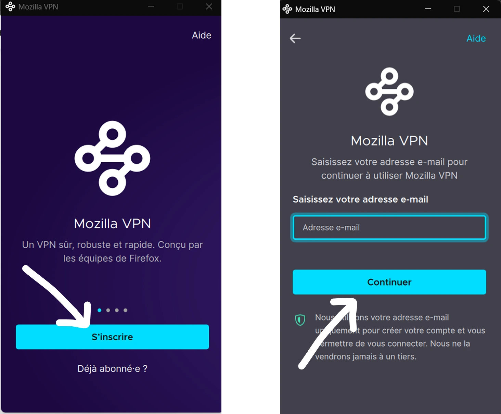

Masukkan kata sandi Anda dan konfirmasikan akun Anda dengan mengisi kode OTP yang dikirim ke email Anda Address. Karena Mozilla VPN adalah layanan berbayar dari Mozilla Foundation, Anda perlu berlangganan untuk menggunakan Mozilla VPN secara maksimal. Klik "Berlangganan sekarang" untuk dialihkan ke halaman harga Mozilla VPN.

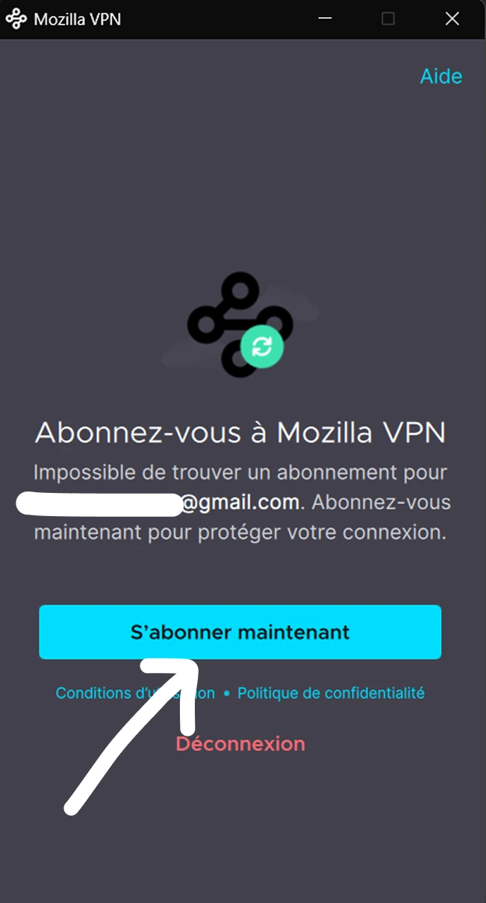

Kemudian pilihlah paket langganan yang tepat untuk Anda.

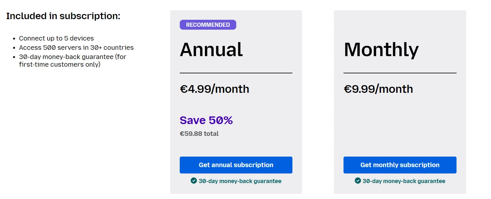

Kemudian lanjutkan ke pembayaran dengan PayPal atau kartu kredit.

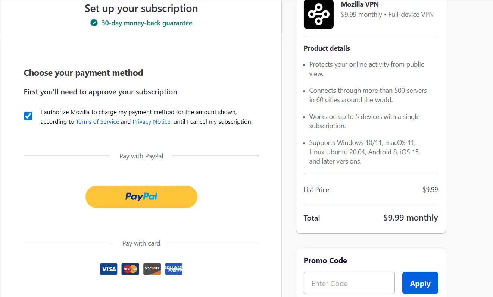

Setelah Anda mengaktifkan langganan Anda, buka perangkat lunak Mozilla VPN dan, sesuai keinginan Anda, beri otorisasi Mozilla VPN untuk mengumpulkan data teknis tentang penjelajahan Anda atau tidak.

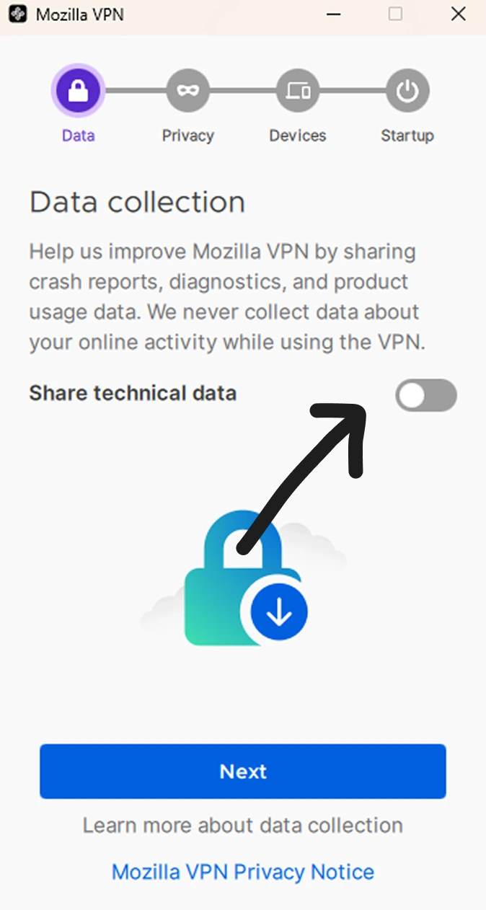

Anda juga dapat mengaktifkan opsi anti-iklan, pemantauan peramban, dan pemblokiran malware.

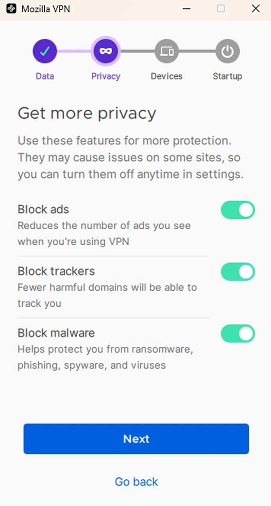

Setelah proses konfigurasi selesai, Mozilla VPN Interface terlihat seperti ini:

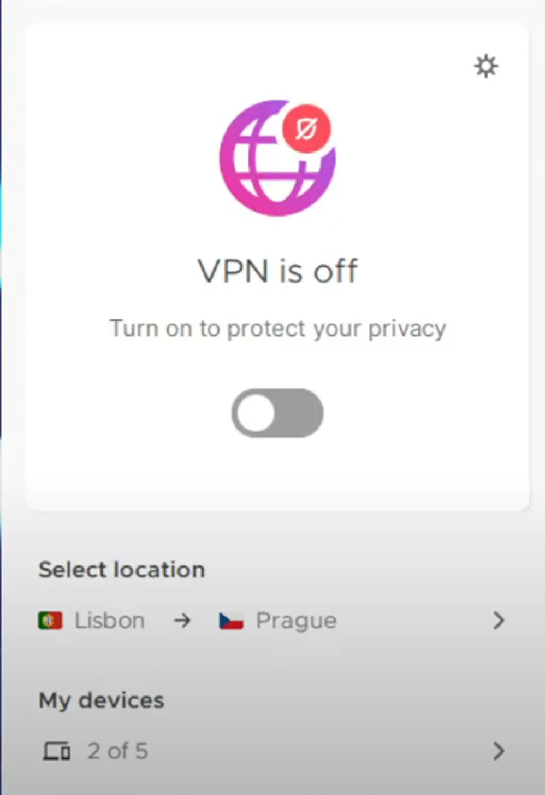

Anda dapat mengaktifkan VPN dengan mengeklik tombol radio di bawah ini, yang akan memindahkan IP Address komputer Anda ke berbagai alamat IP di lokasi yang Anda pilih. Anda juga dapat melihat daftar perangkat yang terhubung ke akun Mozilla VPN Anda langsung dari halaman beranda.

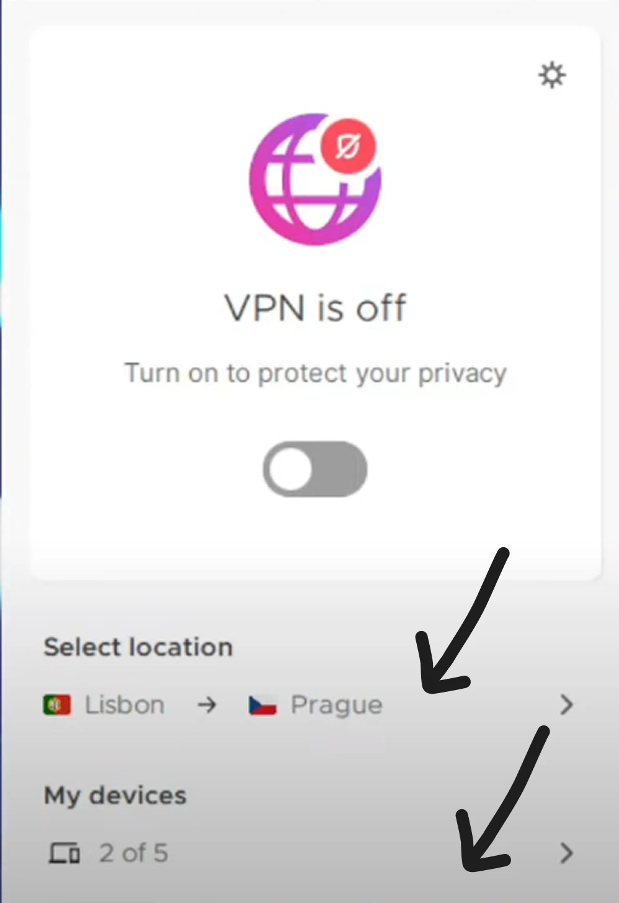

Mozilla VPN memungkinkan Anda untuk memilih lokasi Anda dalam dua format:

- Single-Hop: yang merelokasi IP Address komputer Anda dan mengenkripsi data ke server di wilayah tertentu yang dipilih, dalam contoh kami Sofia di Belarus.

- Multi-Hop: membuat koneksi terenkripsi dari komputer Anda ke dua server jarak jauh. Ini adalah enkripsi ganda: data Anda dienkripsi melalui server A, kemudian dari server A, data dienkripsi lagi ke server B.

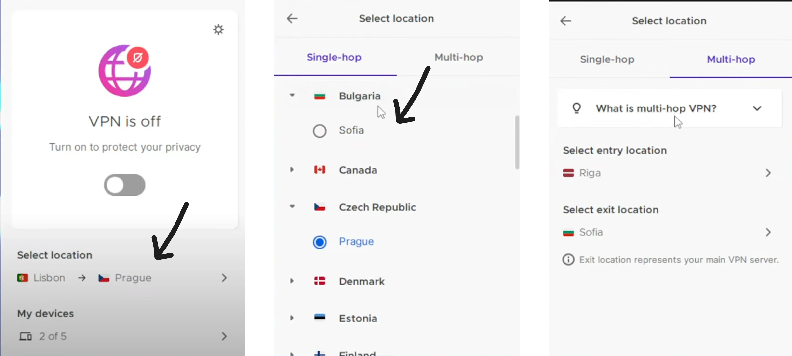

Dengan mengklik ikon **Pengaturan**, Anda dapat mengakses berbagai opsi penyesuaian yang ditawarkan Mozilla VPN. Dalam menu **Pengaturan Jaringan**, Anda dapat mengonfigurasi Mozilla VPN untuk semua aplikasi Anda, atau memilih aplikasi yang tidak ingin Anda gunakan dengan Mozilla VPN. Opsi ini adalah salah satu inovasi yang membedakan Mozilla VPN dari kebanyakan VPN lainnya: pemisahan terowongan.

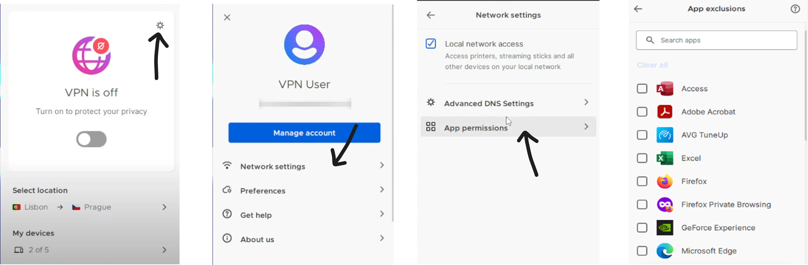

Kanalisasi terpisah adalah fitur praktis yang memungkinkan Anda untuk merutekan sebagian lalu lintas Internet Anda melalui VPN dan sebagian lagi tanpa VPN selama sesi yang sama. Ini dapat berguna untuk perbankan online atau lalu lintas Internet lainnya yang tidak berfungsi dengan baik dengan VPN.

⚠️Mozilla VPN menawarkan kanalisasi terpisah pada semua produk kecuali MacO dan iOS. Maaf para pengguna Apple, Anda tidak akan bisa menggunakan fitur ini. Kemungkinan besar mereka akan melakukannya, karena mereka hanya mengizinkan fitur ini melalui aplikasi Android mereka dan sekarang ini diperluas ke sistem operasi lainnya.

Selalu dengan tujuan untuk menjamin kerahasiaan yang lebih baik bagi para penggunanya, Mozilla VPN dilengkapi dengan sistem **Kill Switch** yang memungkinkannya untuk memutuskan koneksi Internet Anda jika VPN mati karena alasan apa pun. Hal ini melindungi IP Address Anda dan informasi pribadi lainnya.

Sekarang Anda siap menjelajahi Internet dengan aman dan rahasia. Jika Anda menikmati tutorial ini, berikan jempol pada Green. Kami juga yakin Anda akan menikmati tutorial kami tentang MULLVAD VPN, solusi VPN lain yang tidak memerlukan data pribadi dari para penggunanya dan memungkinkan Anda membayar langganan Anda dengan bitcoin (opsi yang lebih rahasia daripada kartu kredit):

https://planb.network/tutorials/computer-security/communication/mullvad-968ec5f5-b3f0-4d23-a9e0-c07a3e85aaa8