In this tutorial, we will learn how to install Windows 11 automatically using a method other than the standard Windows installation process.

## Download!

The first thing you’ll need is an installation file. The safest and most reliable place to download it is directly from Microsoft’s official website.

Simply visit the link provided below and follow the instructions to download the [Windows 11 ISO file](https://www.microsoft.com/en-us/software-download/windows11)

Once you’re on the download page, scroll down to the section for downloading the ISO file.

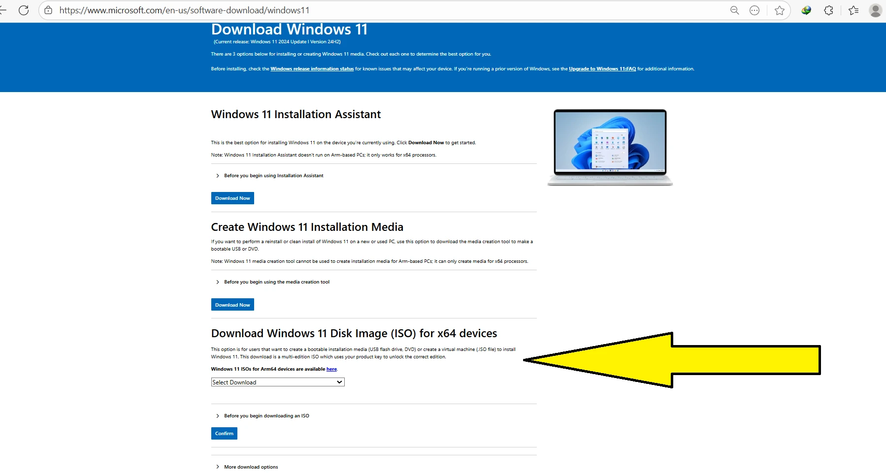

َAnd choose the proper version.

After selecting Windows 11, click the Confirm button.

At this step, it may take a few seconds to process the request, and then you will see the following page:

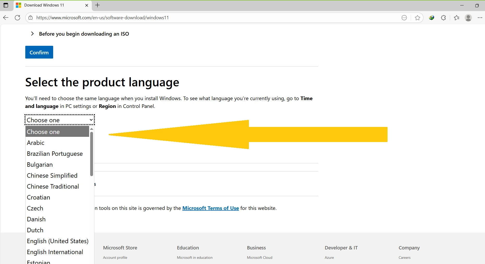

After confirming the request, you need to choose your preferred language.

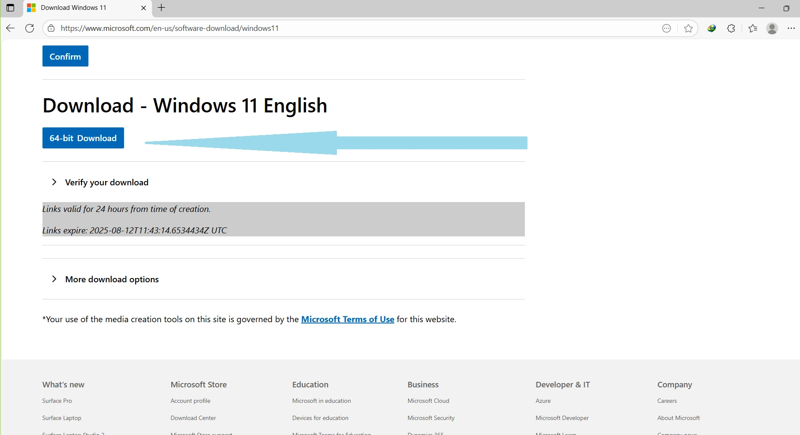

After selecting the language and clicking the Confirm button, the request will be processed. This step may take a few seconds.

Once the request is successfully processed, you will see a page with the download link for the .iso file. Click the 64-bit Download button to start the download.

The file size is about 5.5 GB, and the generated link will be valid for 24 hours.

## Automation!

At this stage, we need to make changes to the standard Windows installation. In this stage, using Unattended install, we determine which items are going to be installed, without the user's input afterwards. In fact, in this method, an XML file is used to configure the installation steps and services installed in Windows. In other words, the use of the Unattended.xml file creates an automation process during installation, preventing the need to select multiple options and avoiding the tedious steps usually required during setup. This method is an unusual but standard method that has been introduced by Microsoft. More information is available on [Microsoft's official website](https://learn.microsoft.com/en-us/windows-hardware/manufacture/desktop/update-windows-settings-and-scripts-create-your-own-answer-file-sxs?view=windows-11).

There are various tools available on the internet for generating Unattended files. Some of them are online, while others are offline. One of the online tools for creating this file is [this website](https://schneegans.de/windows/unattend-generator). After opening it, we are presented with the following page:

As mentioned at the top of the page, this method can be used for installing Windows 10 and 11. In the first step, we select the Windows language. If we need to add a second or even a third language to the list of Windows display and keyboard languages, we can use the box below:

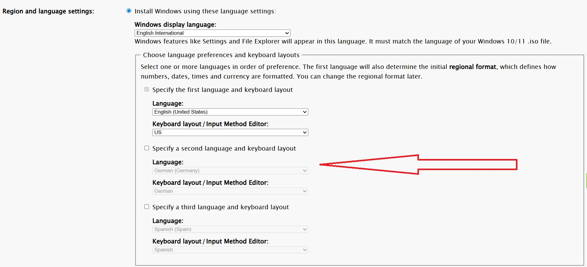

In the next step, we select the desired location.

At this stage, we can also specify the processor architecture for the computer. In this step, we can:
1. Decide whether to ignore Windows security features, such as TPM and Secure Boot. The Secure Boot feature ensures that if any core Windows files are tampered with during the boot process, the issue is detected and their execution is prevented. This feature also helps protect the system from installing malicious updates on Windows. Enabling the option to bypass these features is sometimes unavoidable on certain computers, especially older models. However, it is generally recommended to keep features like Secure Boot enabled.
2. Ignore the requirement for an internet connection to complete the process. This is useful in situations where a wired LAN connection is not available, because in most cases, the wireless card is not yet recognized during Windows installation, and internet access via cable is required. Activating this option resolves issues related to this step.

In the next step, we can choose a name for the computer.

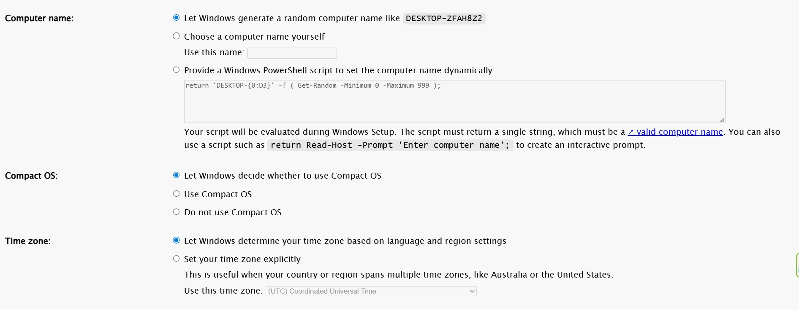

We can also allow Windows to choose a name for the system. In this step, we can select the type of Windows, whether compressed or uncompressed, or let Windows determine the appropriate version based on the computer’s specifications. The time zone can also be set at this stage.

The next step involves partition settings:

At this stage, we can specify the partition type for installing Windows, as well as the required settings for installing the Windows Recovery Environment. By selecting the first option, the partition selection and partitioning are postponed to the time of Windows installation, and during setup, these questions will be asked just like in the normal installation method.

In this step, we select the version of Windows to install:

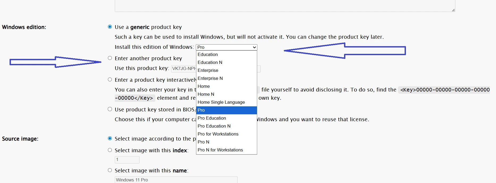

If a product key is available, it can also be entered at this stage.

The next step involves configuring the Windows login account:

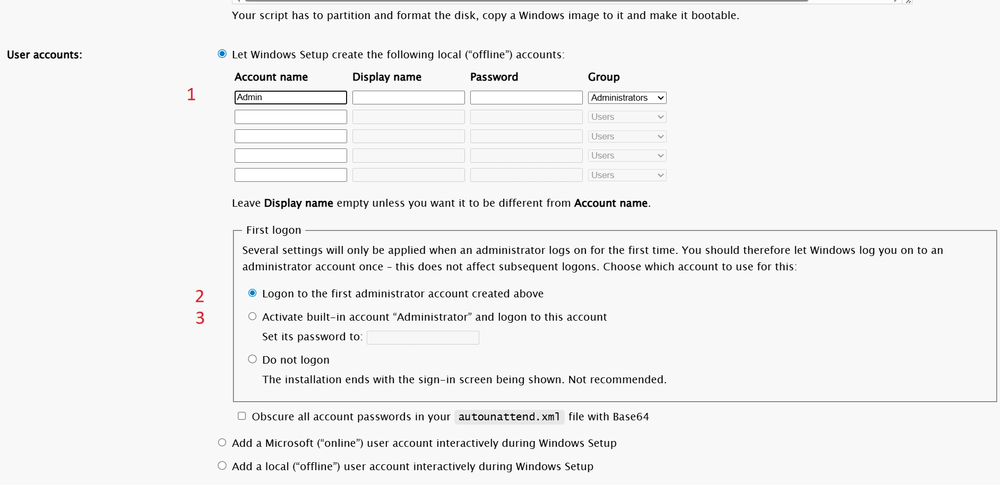

## Account seetings

At this stage:

1. We can define a name and password for the admin account. It is also possible to create multiple user or admin accounts.
2. Here, we specify which account to log into the first time after Windows installation. The different options for this section are shown in the image.
3. If you don’t want any accounts to be created, clean all accounts, and select this option. In this case, after Windows installation, you will automatically be logged into the Windows Administrator account.

The next step involves configuring password and host file settings:

At this stage, we determine whether passwords should have an expiration period. Additionally, this section includes security settings related to failed login attempts, which can be enabled or disabled based on your needs.

At the bottom of this section, there are settings for file display. None of these options are available during a standard Windows installation and must be configured after installation. In contrast, with the Unattended installation method, these settings are easily accessible.

The next step involves configuring Windows security settings:

## Security settings

At this stage:

1. Windows Defender can be enabled or disabled. This feature acts like security software in Windows and helps prevent the execution of malicious files, certain network attacks, and more.
2. Automatic Windows updates can be disabled. This is one of the common challenges faced by Windows users!
3. This section allows enabling or disabling UAC (User Account Control). This feature prevents suspicious applications from running with elevated permissions for reading and writing.
4. This feature is used by Windows to detect potentially harmful software.
5. Enable or disable support for long paths in Windows applications, such as PowerShell and others.
6. Enable or disable Remote Desktop for accessing the system remotely.

Depending on the Windows version being used, some of these features may or may not be supported.

The next step involves configuring the icons:

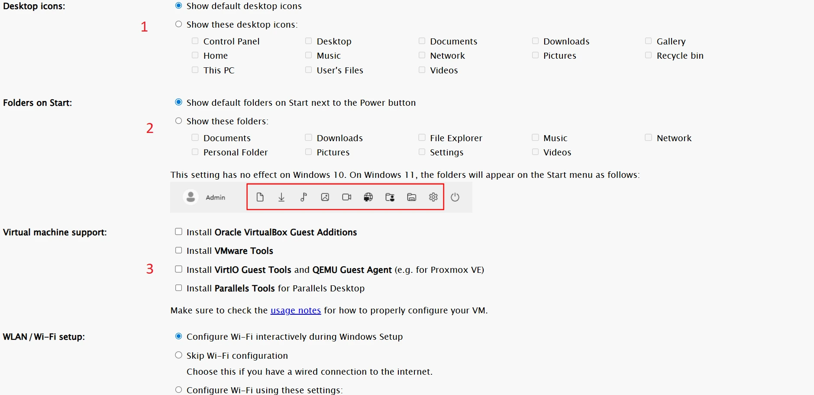

In this section:

1. Desktop icons are listed, which can be added or removed as needed.
2. Start menu icons are listed, which can also be added or removed based on requirements.
3. This section allows configuring whether virtualization-related tools are installed or not. This option is specific to Windows 11 and does not apply to Windows 10.

The next step involves configuring Wi-Fi settings:

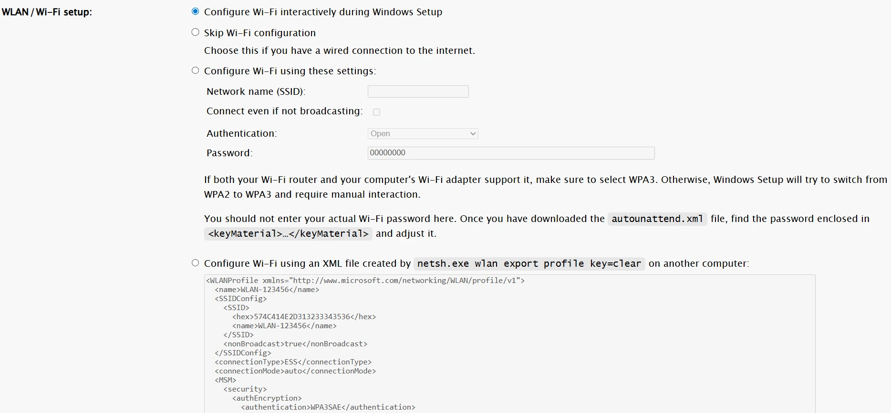

In this section, Wi-Fi network settings can be configured. As mentioned earlier, in most cases, the Wi-Fi card is not recognized during Windows installation, so connecting during setup is usually not possible. However, by configuring this section, if the wireless card is detected, the system can connect to the internet.

The next step involves an important setting:

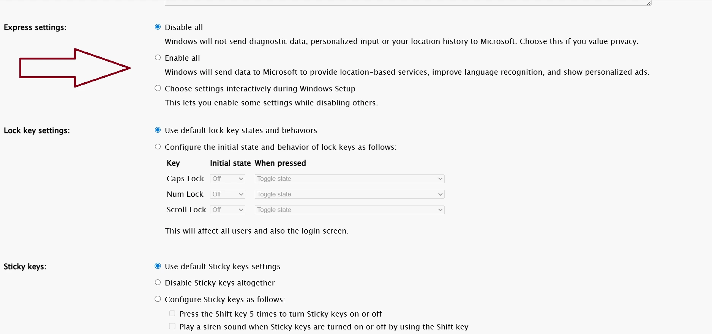

In this section, we specify whether system problem information should be sent to Microsoft or not.

The next step involves configuring default applications:

## Default software enable/disable

In this section, we can choose any applications that we do not want to be installed by default. For example, we can opt not to install Cortana or Copilot.

The next step involves security settings related to application execution:

By applying WDAC settings, the execution of certain applications can be prevented.

Finally, after applying the desired settings, the generated XML file can be downloaded:

By clicking on Download XML File, the autounattend.xml file is downloaded. To use this file, simply mount the downloaded ISO on a USB drive, place the autounattend.xml file in the root directory, and then proceed with the Windows installation.

One of the tools available for creating a bootable USB drive is Rufus. Rufus can make a bootable Windows installation flash drive, with a given windows instllation ISO file. It is fast and simple, you can download it [here](https://rufus.ie/en/#download)

In this software, after selecting the desired USB drive and the appropriate ISO file, we click on Start.

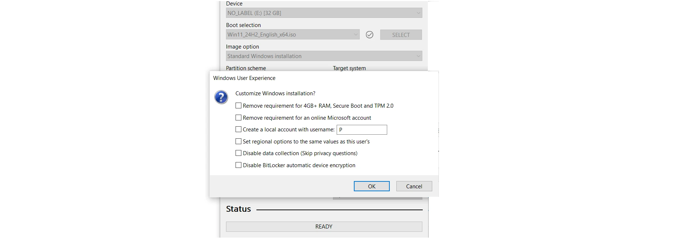

At this stage, we disable all options, as having them enabled can cause conflicts when using the generated Unattend file. After the files are copied to the USB drive, we place the autounattend.xml file in the root directory:

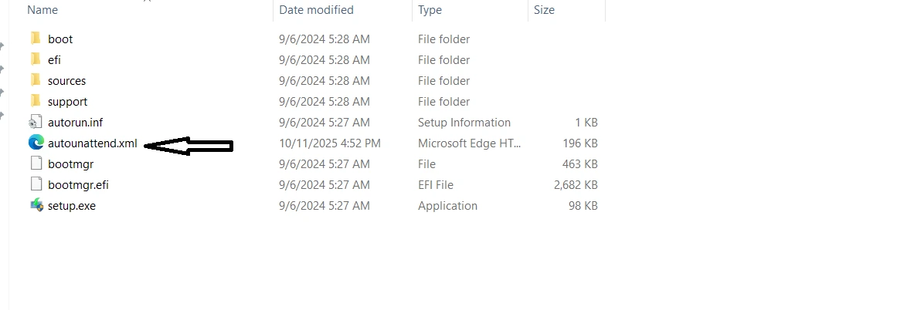

At this point, the USB drive is ready for use to install Windows automatically, and the installation can be started using this drive.

## ISO editing

If you need to install Windows on a virtual machine, you can use software to create and edit ISO files. One such software is AnyBurn. After extracting the contents of the ISO file downloaded from the Microsoft website, place the autounattend.xml file in the root directory. Then, using AnyBurn, create a new ISO with the updated contents.

AnyBurn is a multifunctional software for working with ISO files. It offers various features for handling ISO files, one of which is creating bootable ISO images; [here](https://www.anyburn.com/download.php) is the original website.
  
On the main page of the software, select "Create Image from File/Folder":

On the next page, select all the files extracted from the ISO along with the autounattend.xml file.

In this step, we configure the settings to make the ISO file bootable:

At this stage, the path to the bootfix.bin file must be set to make the ISO bootable. This file is located in the root of the ISO, inside the boot folder. It is also recommended to enable both ISO9660 and UDF options in the Properties section.

After this step, clicking Next will create the ISO file. This file can be used in virtualization software such as Oracle VirtualBox. below you will find a tutorial about VirtualBox:

https://planb.academy/tutorials/computer-security/operating%20system/virtualbox-6472f5be-10ce-4a07-8b24-097bfbcedd65
