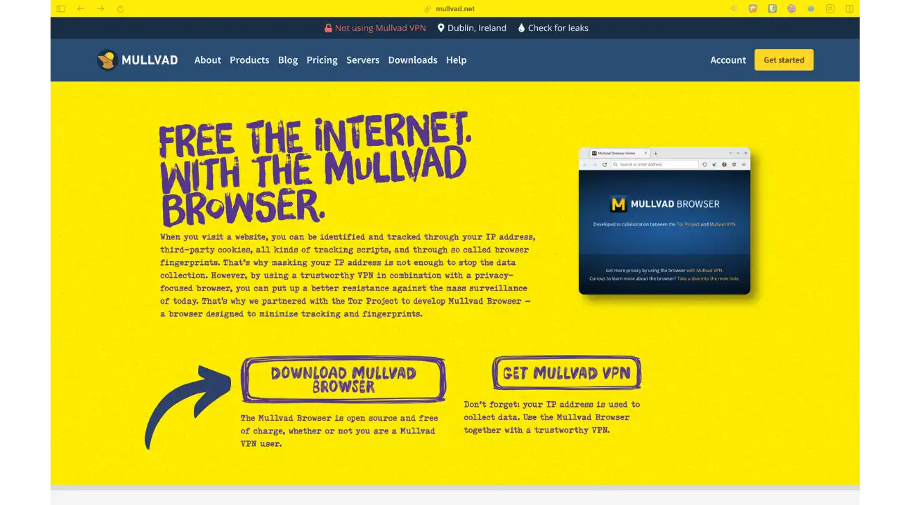
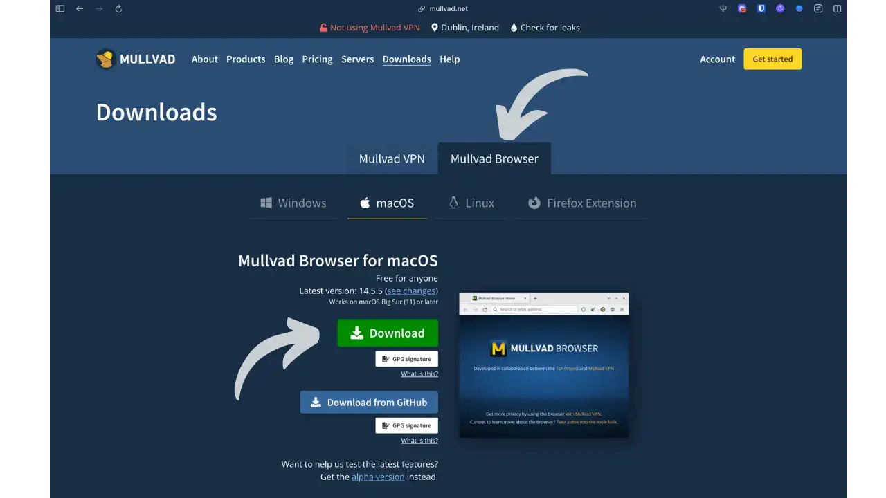
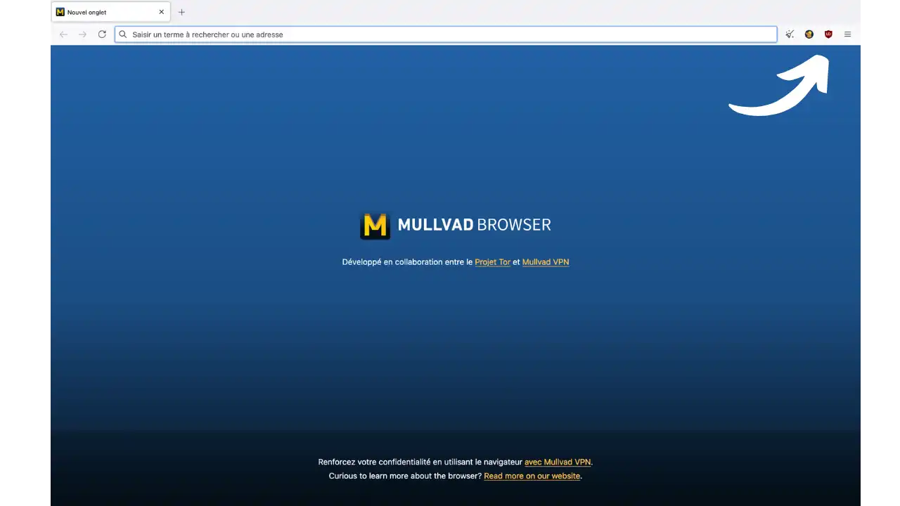
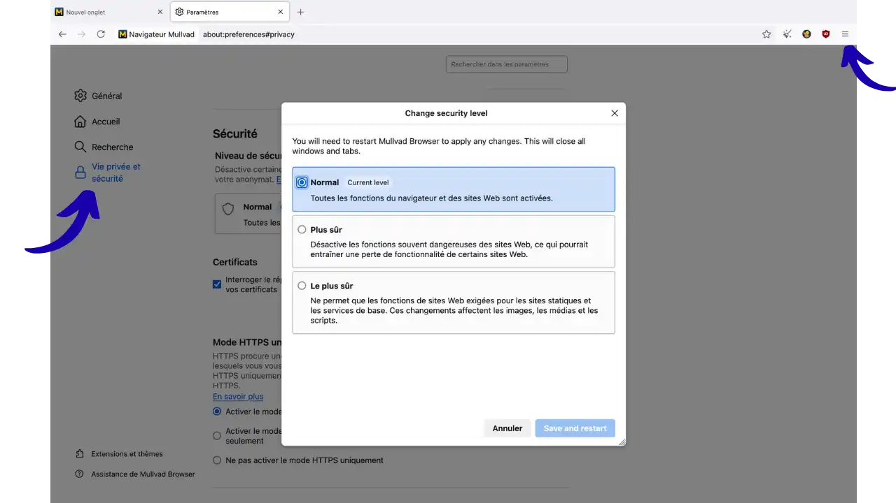
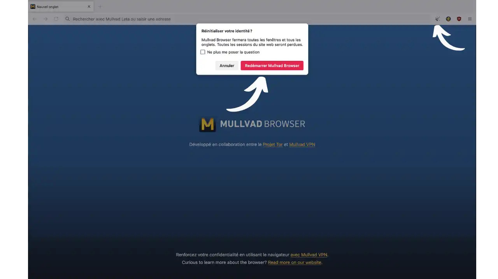

Num mundo em que a vigilância digital está a tornar-se omnipresente, proteger a sua privacidade em linha nunca foi tão crucial. As empresas utilizam técnicas sofisticadas para o localizar:

- **Cookies de terceiros**: pequenos ficheiros depositados por sítios externos para o seguir de um sítio para outro
- **Impressão digital**: recolhe caraterísticas únicas do seu navegador e dispositivo (resolução do ecrã, tipos de letra instalados, plug-ins, etc.) para o identificar sem cookies
- **Scripts de rastreio**: códigos JavaScript invisíveis que analisam o seu comportamento de navegação (cliques, deslocação, tempo despendido)
- **Análise IP Address**: localização geográfica e identificação do seu fornecedor de serviços Internet

Estes dados são depois combinados para criar perfis detalhados do seu comportamento em linha e monetizados, muitas vezes sem o seu conhecimento. Esta realidade levanta uma questão fundamental: como é que se pode navegar na Internet preservando o anonimato e a confidencialidade?

A resposta está, em grande parte, na escolha do seu navegador Web. Esta ferramenta, que utilizamos todos os dias para aceder a informações, fazer compras ou comunicar, desempenha um papel decisivo na proteção dos nossos dados pessoais. Infelizmente, os navegadores mais populares, como o Google Chrome (que detém cerca de 65% do mercado mundial), foram concebidos em função de modelos de negócio baseados na recolha maciça de dados dos utilizadores.

*O Mullvad Browser destaca-se pelo seu bloqueio de rastreadores excecionalmente eficaz, ultrapassando largamente os browsers de consumo*

Face a este desafio, estão a surgir novos intervenientes com uma filosofia diferente: a de colocar a privacidade no centro da sua conceção. Entre eles, o Mullvad Browser destaca-se como uma solução inovadora que combina as melhores protecções de privacidade com uma experiência de navegação fluida e acessível.

Ao contrário dos browsers tradicionais que procuram personalizar a sua experiência através da recolha dos seus dados, o Mullvad Browser adopta a abordagem oposta: faz com que todos os seus utilizadores pareçam idênticos aos websites, tornando assim o rastreio individualizado virtualmente impossível.

Neste tutorial, vamos descobrir juntos como o Mullvad Browser pode transformar a forma como navega na Internet, oferecendo-lhe uma proteção robusta contra a vigilância sem sacrificar a facilidade de utilização.

## Apresentação do Mullvad Browser

O **Mullvad Browser** é um navegador Web centrado na privacidade, desenvolvido em colaboração com o Projeto Tor e distribuído gratuitamente pela empresa sueca Mullvad VPN. Lançado em abril de 2023, apresenta-se como um **"Navegador Tor sem a rede Tor"**, concebido para minimizar o rastreio e a recolha de impressões digitais online, permitindo aos utilizadores navegar através de uma VPN de confiança em vez da rede Tor.

O Mullvad Browser é um navegador gratuito e de código aberto baseado no Firefox ESR (a versão de longa duração do Mozilla Firefox) e reforçado por especialistas do Projeto Tor. Em termos concretos, inclui a maioria das **caraterísticas de proteção do Navegador Tor**, mas **não encaminha o tráfego através da rede Tor**. Em vez disso, os utilizadores podem (e devem) ligá-lo a uma VPN encriptada de confiança para tornar anónimo o seu IP Address.

Em termos de experiência do utilizador, o Mullvad Browser assemelha-se a um navegador clássico, oferecendo uma navegação fluida. Está disponível gratuitamente no Windows, macOS e Linux (sem versão móvel). Não é necessário ser assinante de uma VPN Mullvad para o utilizar; no entanto, **utilizar o Mullvad Browser sem mascarar o seu IP não proporciona um anonimato completo** - pelo que é altamente recomendável utilizá-lo em conjunto com uma VPN fiável.

### Objectivos: privacidade e anti-rastreio

O browser Mullvad foi concebido com um objetivo principal em mente: **proteger a privacidade do utilizador** online e contrariar as técnicas comuns de rastreio e criação de perfis. Os seus principais objectivos incluem:

- Reduzir drasticamente o rastreamento de anúncios e o **rastreamento** por sites e agências de publicidade. Por predefinição, o Mullvad Browser bloqueia rastreadores de terceiros, cookies de rastreio e scripts de impressões digitais que o possam identificar.

- Normalize a impressão digital do seu browser para **"se misturar com a multidão"**. A impressão digital é como um "bilhete de identidade" único criado pela combinação de todas as caraterísticas do seu browser. O Mullvad Browser garante que todos os seus utilizadores têm exatamente o mesmo "bilhete de identidade", tornando impossível distingui-los individualmente.

- Oferece proteção imediata sem extensões adicionais. O Mullvad Browser é fornecido numa configuração "pronta a utilizar": o utilizador não precisa de instalar uma série de extensões nem de modificar quaisquer definições para ficar protegido.

- Não sacrifique o desempenho ou a ergonomia mais do que o necessário. Na ausência do roteamento Tor, o Mullvad Browser oferece uma navegação muito mais rápida do que o Tor Browser, aproximando-se do desempenho de um navegador padrão associado a uma VPN.

### Principais caraterísticas do Mullvad Browser

O Mullvad Browser inclui uma série de **caraterísticas de segurança e privacidade** diretamente inspiradas no Tor Browser:

- **Navegação privada em todos os momentos:** O modo de navegação privada é ativado por predefinição e não pode ser desativado. **Não é guardado qualquer histórico, cookies ou cache de uma sessão para a seguinte**. Assim que fechar o Mullvad Browser, todos os dados de navegação são eliminados.

- **Proteção melhorada contra a impressão digital:** O browser aplica definições rigorosas para impedir a impressão digital. Isto inclui:
- Normalização do agente do utilizador e da versão do browser
- Fuso horário definido para **UTC** para todos os utilizadores
- **Letterboxing**: uma técnica que adiciona automaticamente margens cinzentas à volta das páginas Web para normalizar o tamanho de visualização e evitar a identificação pelas dimensões do ecrã
- **Bloquear APIs de impressão digital**: As tecnologias Canvas (desenho 2D), WebGL (gráficos 3D) e AudioContext (processamento de áudio) estão desactivadas porque podem revelar detalhes únicos sobre o seu hardware
- **Tipos de letra do sistema normalizados** para evitar a identificação por tipos de letra instalados

- Bloqueio de trackers e publicidade: O Mullvad Browser integra nativamente a extensão **uBlock Origin** (pré-instalada) com listas de proteção adicionais para bloquear **third-party trackers, scripts de publicidade e outros conteúdos maliciosos**. Esta proteção é acompanhada por **First-Party Isolation**: uma técnica que armazena os cookies em "potes" separados para cada sítio Web, impedindo que um sítio leia os cookies depositados por outro.

- **Botão de reinicialização da sessão:** Tal como o botão "Nova identidade" do navegador Tor, o Mullvad Browser oferece um botão para **reiniciar rapidamente o navegador com uma sessão nova e em branco**.

- **Níveis de segurança ajustáveis:** Pode ajustar o nível de segurança (*Normal*, *Safer*, *Safest*) nas definições, tal como no Navegador Tor.

## Extensões incorporadas por defeito

O Mullvad Browser inclui **três extensões pré-instaladas** que constituem o núcleo da sua proteção anti-rastreamento. **É crucial nunca as remover ou modificar as suas configurações**, pois isso torná-lo-ia único entre os utilizadores do Mullvad Browser:

### **uBlock Origin**

Esta extensão de bloqueador de anúncios e rastreadores vem pré-configurada com **listas de filtros optimizadas** para bloquear:

- Publicidade intrusiva
- Rastreadores de terceiros que recolhem os seus dados
- Scripts maliciosos
- Seguimento comportamental Elements

o uBlock Origin no Mullvad Browser utiliza parâmetros normalizados para garantir que todos os utilizadores bloqueiam exatamente o mesmo Elements, preservando assim a uniformidade das pegadas digitais.

### **NoScript**

O NoScript é executado em segundo plano para gerir os **níveis de segurança** do browser. Este:

- Controla a execução do **JavaScript** de acordo with o nível selecionado (Normal/Mais seguro/Mais seguro)
- Filtra automaticamente os ataques **XSS** (Cross-Site Scripting)
- Bloqueia conteúdos activos **perigosos** em sites não HTTPS
- O seu ícone está oculto por predefinição, mas pode ser apresentado através de "Personalizar a barra de ferramentas"

### *extensão* **Mullvad Browser**

Esta extensão específica da Mullvad oferece diferentes funcionalidades, consoante seja ou não cliente da VPN Mullvad:

#### **Sem subscrição do Mullvad VPN:**

- **Verificação básica da ligação**: apresenta o seu IP público atual e algumas informações sobre a ligação
- **Recomendações de privacidade**: sugestões para melhorar as suas definições de segurança (DNS, apenas HTTPS, motor de busca)
- **Controlo WebRTC**: ativar/desativar para evitar fugas de IP Address
- Pode ser eliminado sem impacto na sua pegada digital se não utilizar o **Mullvad VPN**

#### **Com a subscrição Mullvad VPN:**

A extensão revela todo o seu potencial com funcionalidades avançadas:

- **Proxy SOCKS5 integrado**: ligação com um clique ao servidor proxy VPN Mullvad
- **IP fixo Address**: ao contrário de uma VPN, que pode alterar o seu IP Address, um proxy garante sempre o mesmo Address de saída
- **Kill switch automático**: se a VPN se desligar, o tráfego do browser é imediatamente bloqueado
- **Suporte IPv6**: Conectividade IPv6 mesmo que a sua ligação VPN não a tenha activada

- **Multihop (VPN dupla)**: capacidade de alterar a localização do proxy para criar um túnel dentro do túnel
 - O seu tráfego passa primeiro pelo seu servidor VPN e depois "salta" para outro servidor Mullvad
 - Utilizar uma localização diferente apenas para o browser

- **Monitorização avançada da ligação**: monitorização em tempo real do seu estado VPN, servidor ligado e deteção de fugas de DNS

- Acesso ao **Mullvad Leta**: motor de busca privado reservado aos assinantes (embora não recomendado pelo Mullvad por razões de correlação com a sua conta)

Estas três extensões trabalham em conjunto para criar um ecossistema coerente de proteção, em que cada utilizador beneficia exatamente das mesmas defesas, sem a possibilidade de personalização que comprometeria o anonimato coletivo.

## Vantagens e desvantagens do Mullvad Browser

### Benefícios

- **Excelente proteção de privacidade por predefinição:** O Mullvad Browser aplica definições de privacidade muito rigorosas logo desde o início, sem necessidade de configuração manual.

- Melhor desempenho que o Navegador Tor: Na ausência do roteamento onion, o Navegador Mullvad é **notavelmente mais rápido e mais responsivo** que o Navegador Tor para navegação clássica na web.

- **Simplicidade familiar do Interface:** O Mullvad Browser é baseado no Interface do Firefox. Se está habituado ao Firefox ou mesmo ao Tor Browser, não se sentirá deslocado.

- **Colaboração de confiança e código auditado:** O Mullvad Browser beneficia da experiência do Projeto Tor, e todo o código fonte está disponível para auditoria externa.

### Desvantagens

- Não há anonimato de rede sem VPN: O ponto mais importante é que o **Mullvad Browser não esconde o seu IP Address por si só** (como todos os outros browsers, exceto o Tor Browser). O seu IP Address é como o seu "Address postal" na Internet: revela a sua localização e o seu ISP. Por conseguinte, **depende fortemente de uma VPN** (rede privada virtual) para ocultar esta informação crucial.

- **Sem versão móvel:** Até à data, o Mullvad Browser só está disponível para PC (Windows, Mac, Linux).

- **Incompatível com determinados hábitos:** O **modo privado permanente** significa que não é possível manter uma sessão de uma utilização para a seguinte. É impossível permanecer ligado a uma conta Web de uma sessão para a seguinte.

- **Funcionalidades restritas:** Para preservar a uniformidade das impressões digitais, o Mullvad Browser **desactivou várias funcionalidades** presentes no Firefox e não se destina a personalização.

## Instalar o Mullvad Browser

O Mullvad Browser está disponível gratuitamente para Windows, macOS e Linux. Para o instalar, visite [o sítio Web oficial do Mullvad] (https://mullvad.net/browser).

**Página inicial oficial do Mullvad Browser com o botão de transferência em destaque**

*Selecione o seu sistema operativo na página de transferência do Mullvad Browser.*

Clique no botão **"Descarregar "** correspondente ao seu sistema operativo.

Para Linux, pode escolher entre diferentes formatos consoante a sua distribuição. Quando a transferência estiver concluída:

### No Windows

Execute o ficheiro `.exe` descarregado e siga as instruções de instalação.

### No macOS

Abra o ficheiro `.dmg` transferido e arraste a aplicação Mullvad Browser para a pasta Aplicações.

### No Linux

Extraia o arquivo `.tar.xz` para o diretório de sua escolha e execute o arquivo `start-mullvad-browser.desktop`.

## Configuração e primeira utilização

Quando iniciar o Mullvad Browser pela primeira vez, verá um Interface muito semelhante ao do Tor Browser. O navegador está pré-configurado para privacidade e não requer modificações especiais.

*Interface Página inicial do Mullvad Browser com extensões, ícone de vassoura para generate uma nova identidade e menu de aplicações no canto superior direito.*

**Importante:** O Mullvad Browser não mascara o seu IP Address por defeito. Para uma proteção completa, recomendamos vivamente a utilização de uma VPN em paralelo. Pode utilizar o Mullvad VPN ou qualquer outro serviço VPN de confiança.

O navegador também inclui **DNS-over-HTTPS (DoH)** utilizando o serviço DNS da Mullvad: esta tecnologia encripta os seus pedidos de DNS (traduzindo nomes de sites em endereços IP) para evitar que o seu ISP monitorize os sites que visita.

### Definições de segurança

Pode ajustar o nível de segurança clicando no **menu da aplicação** (três barras horizontais) no canto superior direito, depois em **"Definições "** e no separador **"Privacidade e segurança "**. Desloque-se para baixo até à secção **"Segurança "**:

*Escolha dos níveis de segurança: as setas indicam o caminho desde o menu da aplicação até ao separador "Privacidade e segurança" e às opções de segurança*

O Mullvad Browser oferece três níveis de segurança:

- **Normal** (nível predefinido atual): Todas as funções do browser e do sítio Web activadas

- **Mais seguro**: Desactiva funções de websites frequentemente perigosas, o que pode levar a uma perda de funcionalidade em alguns websites:
 - O JavaScript está desativado para sítios não HTTPS
 - Alguns tipos de letra e símbolos matemáticos estão desactivados
 - O som e o vídeo (multimédia HTML5), bem como o WebGL, são "clicar para reproduzir"

- **O mais seguro**: Permite apenas as funções de sítio Web necessárias para sítios estáticos e serviços básicos:
 - O JavaScript está desativado por defeito em todos os sítios
 - Alguns tipos de letra, ícones, imagens e símbolos matemáticos estão desactivados
 - O som e o vídeo (multimédia HTML5), bem como o WebGL, são "clicar para reproduzir"

### Botão Nova sessão

Para recomeçar com uma sessão em branco sem fechar o navegador, clique no ícone da vassoura ou utilize o menu da aplicação > **"Nova sessão "**.

*Função "Repor a sua identidade" para reiniciar o browser com uma sessão completamente nova*

## Utilização quotidiana

### Navegação normal

O Mullvad Browser comporta-se como um browser clássico para a navegação quotidiana. Todos os sítios Web são acessíveis como habitualmente, com a vantagem adicional de uma proteção melhorada contra o rastreio.

### Gestão de cookies e início de sessão

Devido ao modo privado permanente, terá de voltar a ligar-se às suas contas sempre que iniciar sessão. Este é o preço a pagar pela máxima confidencialidade.

### Extensões

Tecnicamente, o Mullvad Browser permite-lhe instalar extensões adicionais a partir do catálogo do Firefox, mas **é importante compreender as implicações**. Cada extensão adicionada altera a sua pegada digital e distingue-o de outros utilizadores do Mullvad Browser, o que vai contra o princípio fundamental do browser: fazer com que todos os utilizadores pareçam idênticos.

Como explica Mullvad: *"Por vezes, não ter uma defesa específica é melhor do que ter uma. Ao querer aumentar a privacidade online, instala extensões que acabam por o tornar ainda mais visível. "*

Se optar por instalar extensões de qualquer forma, tenha em atenção que está a criar uma impressão digital única que pode ser utilizada para o localizar de site para site. Para uma proteção máxima, é melhor limitar-se às três extensões pré-instaladas, que são idênticas para todos os utilizadores.

## Melhores práticas com o Mullvad Browser

1. **Utilize sempre uma VPN:** O Mullvad Browser não mascara o seu IP. Uma VPN é essencial para o anonimato total.

2. **Não personalizar o browser**: Evite alterar as definições ou adicionar extensões, pois isso pode torná-lo identificável.

3. **Utilize o botão de nova sessão**: Entre diferentes actividades, utilize a função de reposição para dividir as suas sessões.

4. **Escolha o nível de segurança que melhor se adapta às suas necessidades**:

- **Normal (recomendado)**: Para a navegação quotidiana. Já oferece uma excelente proteção, mantendo os sítios Web funcionais. Este é o melhor equilíbrio para 95% dos utilizadores.
- **Mais seguro**: Se estiver a visitar sites desconhecidos ou potencialmente perigosos, ou para proteção extra em redes Wi-Fi públicas. Alguns sítios podem não funcionar corretamente.
- **Mais seguro**: Reservado para situações de alto risco (jornalismo de investigação, comunicações sensíveis, ambientes hostis). A maioria dos sítios modernos será quebrada, mas esse é o preço da segurança máxima.

5. **Verificar regularmente se existem actualizações**: Mantenha o seu browser atualizado com os mais recentes patches de segurança.

6. **Utilizar motores de pesquisa que respeitam a privacidade**: Escolha DuckDuckGo, Startpage ou Searx em vez do Google.

7. **Ativar o modo apenas HTTPS**: Nas definições, certifique-se de que o modo "Apenas HTTPS" está ativado para forçar ligações seguras.

8. **NÃO altere quaisquer definições avançadas**: Ao contrário de outros navegadores, o Mullvad Browser foi concebido para que TODOS os utilizadores tenham exatamente a mesma configuração. Modificar as definições em `about:config` ou alterar as definições do uBlock Origin/NoScript torná-lo-ia único e anularia completamente o anonimato do navegador.

## Configuração de DNS recomendada

O Mullvad Browser integra automaticamente o Mullvad DNS-over-HTTPS. Se estiver a utilizar o Mullvad VPN, a extensão recomendará que **desactive o Mullvad DoH**, uma vez que é mais rápido utilizar o servidor DNS do seu servidor VPN. Se não estiver a utilizar o Mullvad VPN, mantenha o Mullvad DoH ativado para evitar a monitorização do DNS pelo seu ISP.

## Conclusão

O Mullvad Browser é uma excelente solução para quem procura uma navegação na Web que respeite a privacidade, sem as limitações de desempenho da rede Tor. Combinado com uma VPN de qualidade, oferece uma proteção robusta contra o rastreio e a vigilância online.

Embora tenha algumas limitações (sem versão móvel, sessões não persistentes), o Mullvad Browser é uma ferramenta valiosa no arsenal de qualquer pessoa que deseje recuperar o controlo da sua privacidade digital. A sua facilidade de utilização e configuração predefinida fazem dele uma escolha sensata para utilizadores preocupados com a privacidade, quer sejam principiantes ou experientes.

## Recursos

### Documentação oficial

- [Sítio Web oficial do Mullvad Browser](https://mullvad.net/fr/browser)
- [Página de transferência do Mullvad Browser](https://mullvad.net/en/download/browser)
- [Especificações técnicas pormenorizadas](https://mullvad.net/en/browser/Hard-facts)
- [Extensão do navegador Mullvad](https://mullvad.net/en/help/mullvad-browser-extension)

### Guias e explicações

- [Porque é que a privacidade é importante] (https://mullvad.net/en/why-privacy-matters/how-mass-surveillance-companies-collect-your-data)
- [Tor sem Tor: conceito do navegador Mullvad](https://mullvad.net/en/browser/tor-without-tor)
- [Como escolher um browser amigo da privacidade] (https://mullvad.net/en/browser/things-to-look-for-when-choosing-a-browser)
- [Compreender a impressão digital do browser] (https://mullvad.net/en/browser/browser-fingerprinting)

### Apoio e ajuda

- [Centro de ajuda do navegador Mullvad](https://mullvad.net/en/help/tag/mullvad-browser)
- [Primeiros passos para a privacidade em linha] (https://mullvad.net/en/help/first-steps-towards-online-privacy)

### Recursos comunitários

- [Guia do navegador Mullvad - Guias de privacidade](https://www.privacyguides.org/en/desktop-browsers/)
- [Debates comunitários](https://discuss.privacyguides.net/t/about-changing-settings-in-mullvad-browser/18330)