*See õpetus põhineb Mickael Dorigny originaalsel sisul, mis on avaldatud veebilehel [IT-Connect](https://www.it-connect.fr/). Litsents [CC BY-NC 4.0](https://creativecommons.org/licenses/by-nc/4.0/). Originaaltekstis on tehtud muudatusi.*


___


Tere tulemast selle Nmapi sissejuhatava õpetuse juurde, mis on mõeldud kõigile, kes soovivad seda võimsat võrgu skaneerimisvahendit omandada. Eesmärgiks on anda teile põhiteadmised, mida vajate Nmapi tõhusaks igapäevaseks kasutamiseks.


Nmap on mitmekülgne tööriist, mida IT-, võrgu- ja küberturvalisuse spetsialistid kasutavad laialdaselt diagnostikaks, võrgu avastamiseks ja turvalisuse auditeerimiseks. See õpetus on mõeldud neile, kes on nendes valdkondades uued ja soovivad õppida Nmapi põhitõdesid. Soovitatav on süsteemi- ja võrguadministratsiooni algteadmised.


Saate teada Nmapi põhitõed, kuidas teha portide skaneerimist, tuvastada võrgus olevaid aktiivseid hoste, tuvastada teenuste versioone ja operatsioonisüsteeme, teostada haavatavuse skaneerimist ja palju muud. Iga osa sisaldab üksikasjalikke selgitusi ja praktilisi näiteid, mis aitavad teil omandada Nmapi kasutamist erinevates kontekstides.


Selle õpetuse lõpuks on teil kindel arusaam Nmapist ja te suudate seda tõhusalt kasutada, et parandada oma võrkude turvalisust ja haldamist. Head lugemist.


## 1 - Sissejuhatus Nmap'ile: Mis on Nmap?


### I. Esitlus


Selles esimeses osas vaatleme võrgu skaneerimise tööriista Nmap. Vaatame peamisi Elements, mida peate selle tööriista kohta teadma ja kuidas see üldiselt töötab. See aitab meil paremini mõista ülejäänud õpetust.


### II. Tööriista Nmap tutvustamine


Nmap, mis tähendab _Network Mapper_, on tasuta, avatud lähtekoodiga tööriist, mida kasutatakse **võrgu avastamiseks, kaardistamiseks ja turvalisuse auditeerimiseks**. Seda saab kasutada ka muudeks ülesanneteks, näiteks **võrgu inventeerimiseks, diagnostikaks või järelevalveks**.


Sellega saab kindlaks teha, kas sihtvõrgu hostid on aktiivsed ja kättesaadavad, millised võrguteenused on avatud, millised versioonid ja tehnoloogiad on kasutusel ning muud kasulikku analüüsiteavet. Nmapiga saab skaneerida ühte teenust konkreetses masinas või suures võrgus, kuni kogu Interneti ulatuses.


Nmapil on palju tugevaid külgi:


- Võimas ja paindlik**: Nmap suudab skaneerida suuri võrke ja kasutada täiustatud tuvastamistehnikaid. See toetab UDP, TCP, ICMP, IPv4 ja IPv6 ning võib teostada versioonide tuvastamist, haavatavuse skaneerimist või protokolliga seotud interaktsioone. Selle arhitektuur on modulaarne, eelkõige tänu NSE (Nmap Scripting Engine) skriptidele, mida me vaatleme hiljem selles õpetuses.
- Kasutamise lihtsus**: ametlik dokumentatsioon on rikkalik ja kvaliteetne. Samuti on saadaval arvukad kogukonna ressursid, mis aitavad teil alustada.
- Populaarsus ja pikaealisus**: Nmap on olnud oma valdkonnas referents alates 1998. aastast. Praegune versioon on selle värskenduse ajal 7.95. Kuigi konkreetsete ülesannete jaoks on olemas ka teisi vahendeid, on Nmap endiselt hädavajalik võrgu kaardistamiseks ja analüüsimiseks.


**Nmap filmides**


Nmap on üks väheseid turvavahendeid, mis on omandanud teatava tuntuse üldsuse seas. See esineb filmis _Matrix Reloaded_ sümboolses stseenis, kus Trinity kasutab seda süsteemi häkkimiseks:


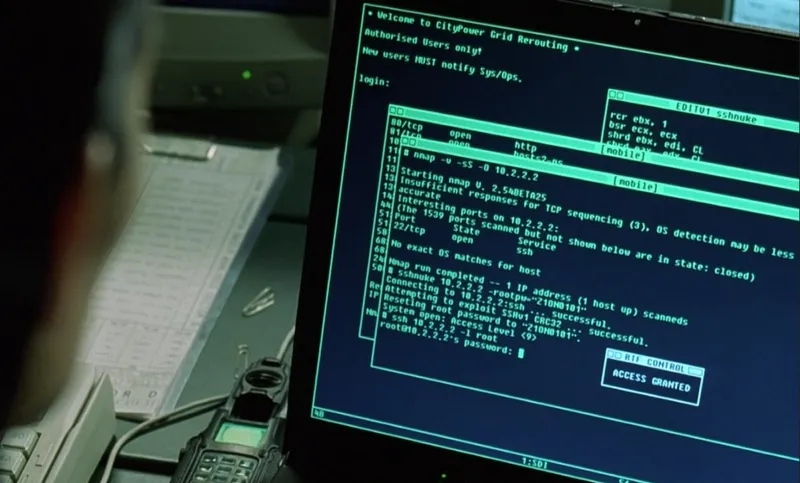


maatriks: Reloaded stseeni featuring Nmap


Ta osaleb ka teistes kinematograafilistes töödes.


**Feedback


Süsteemiadministraatorina ja seejärel küberturbe audiitorina ja pentesterina kasutan **Nmap'i peaaegu igapäevaselt** ja ma **reeglina soovitan** seda süsteemiadministraatoritele, kes soovivad tugevdada oma kontrolli võrkude üle ja parandada oma diagnostikavõimalusi.


### III. Kõrgetasemeline tegevus


Nmap on saadaval Linuxi, Windowsi ja macOSi jaoks. See on kirjutatud peamiselt C, C++ ja Lua keeles (NSE skriptide jaoks). Seda kasutatakse peamiselt käsureal, kuigi saadaval on ka graafilised kasutajaliidesed, näiteks Zenmap. Soovitame siiski tungivalt alustada käsurealt, et paremini mõista, kuidas see töötab.


Lihtne näide:


```
nmap 192.168.10.13 10.10.10.0/24 -sV -sC --top-ports 250
```


Seda käsku selgitatakse üksikasjalikult hiljem. Selles õpetuses kasutame Nmap'i Linuxis, kuid selle kasutamine on sarnane ka teistes süsteemides. Windowsis tugineb Nmap võrgupakettide püüdmiseks ja sisestamiseks **Npcap** raamatukogule (mis asendab nüüdseks vananenud WinPcap'i).


Nmap'i kasutatakse nagu tavalist binaarkoodi, näiteks `ls` või `ip`. Mõned täiustatud funktsioonid võivad nõuda kõrgendatud õigusi, kuna tööriist manipuleerib mõnikord pakette ebatraditsioonilisel viisil, et esile kutsuda konkreetseid reaktsioone sihtsüsteemides (eelkõige teenuse või haavatavuse tuvastamiseks).


### IV. Nmapi kasutamise mõju


Enne Nmapi kasutamist on oluline olla teadlik selle võimalikust mõjust võrkudele ja süsteemidele:


- See võib saata **tuhandeid või isegi miljoneid pakette** lühikese aja jooksul, mis võib küllastada teatud võrguinfrastruktuure.
- See võib generate **võltsitud või mittestandardsed** paketid, mis tõenäoliselt häirivad teatud seadmeid (eriti tööstussüsteeme).
- See võib tekitada **rünnakulaadset käitumist**, mis võib vallandada hoiatusi turvasüsteemides (tulemüürid, IDS/IPS jne).


Üldiselt on **Nmap väga jutukas tööriist**, kuna see tekitab palju liiklust, et saada võimalikult palju teavet. Seetõttu on soovitatav enne selle kasutamist tundlikes või tootmiskeskkondades täielikult mõista, kuidas see töötab.


### V. Kokkuvõte


Selles jaotises tutvustatakse Nmapi ja selle peamisi funktsioone. Nägime, et tegemist on olulise, võimsa ja paindliku võrgu kaardistamise vahendiga. Samuti arutasime, kuidas see töötab ja milliseid ettevaatusabinõusid tuleb selle kasutamisel järgmiseks osaks ette valmistada.


## 2 - Miks kasutada Nmapi?


### I. Esitlus


Selles jaotises vaatleme võrgu skaneerimise tööriista Nmap peamisi kasutusalasid. Me näeme, et see on vahend, mida kasutatakse laialdaselt paljudes kontekstides ja ametites ning et selle olemasolu oma tööriistakastis ja selle valdamine on kindlasti kasulik oskus.


### II. Nmapi kasutamine diagnostikaks ja järelevalveks


Nmap'i saab kasutada võrgu diagnostikaks ja laiemalt jälgimiseks. Samamoodi nagu pingi abil saab kindlaks teha, kas kaks hosti suhtlevad, saab Nmapi abil kiiresti kindlaks teha, kas host on aktiivne või kas konkreetne teenus töötab. Tänu [Nmapile] (https://www.it-connect.fr/cours/nmap-cartographie-reseau-scan-de-vulnerabilites/ "Nmap") saame täpseid andmeid hostide vastamisaja, pakettide poolt läbitud marsruudi, konkreetse teenuse poolt tehtud vastuse jne kohta.


Järgmist käsku ja tulemust saab kasutada näiteks selleks, et kiiresti välja selgitada, kas veebiserver hostil **192.168.1.18** on aktiivne ja vastab õigesti:


```
nmap --open -p 80 192.168.1.18
```


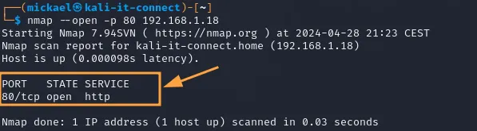


*Kasutage Nmapi, et saada veebiteenuse olek kaugserverist.*


Niisiis, Nmapi kasutamine läheb kaugemale kui kuulus "pingitest" silumise või diagnostika faasis. Hiljem näeme, et Nmap kasutab mitmeid meetodeid, et tuvastada, milline teenus kuulab antud porti, sealhulgas selle versiooni.


### III. Nmapi kasutamine võrgu kaardistamiseks


Võrgukaardistajana on selle tööriista peamine eesmärk võrgu kaardistamine. Seda saab kasutada kohalikus võrgus või mitme võrgu, alamvõrgu ja VLANi vahel, et loetleda kõik juurdepääsetavad hostid ja teenused. Nmap muudab selle ülesande palju kiiremaks ja tõhusamaks kui mis tahes käsitsi tehtavad meetodid.


Näiteks saab järgmist käsku kasutada aktiivsete hostide kiireks tuvastamiseks võrgus **192.168.1.0/24**:


```
nmap -sn 192.168.1.0/24
```


*Märkus: valik `-sP` on vananenud ja on asendatud valikuga `-sn`.*


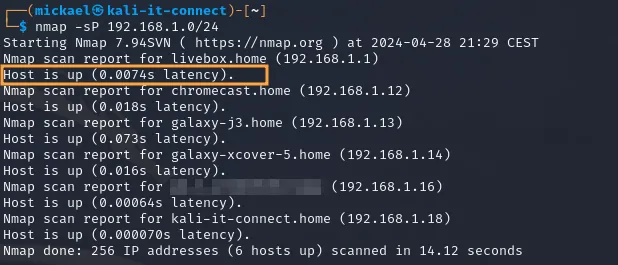


*Nmapi kasutamine võrgus olevate juurdepääsetavate hostide avastamiseks*


Hiljem näeme, et Nmap kasutab mitmeid meetodeid, et määrata, kas host võib olla "aktiivne", isegi kui see ei avalda a priori ühtegi teenust.


### IV. Nmapi kasutamine filtreerimispoliitika hindamiseks


Nmap'i eeliseks on faktilisus: selle tulemused võimaldavad teha konkreetseid järeldusi, erinevalt mis tahes arhitektuuridokumendist või filtreerimispoliitikast. See on peamine vahend infosüsteemide killustatuse tõhususe hindamiseks, kuna võimaldab **kontrollida, kas filtreerimispoliitikat ka tegelikult rakendatakse**.


Parimate tavade kohaselt tuleb süsteemid ettevõtte võrgus segmenteerida vastavalt nende rollile, kriitilisusele või asukohale. Filtreerimisreeglid (mida sageli rakendatakse tulemüüride kaudu) peavad piirama tsoonide vahelist suhtlust. Kuid need konfiguratsioonid on sageli keerulised ja vigadele kalduvad.


Seega, et kinnitada, et poliitikast on kinni peetud, ei ole midagi paremat kui konkreetne test. Näiteks saate kontrollida, et tundlikud administreerimisteenused (SSH, WinRM, MSSQL, MySQL jne) ei ole kasutajatsoonist ligipääsetavad.


**Nmap'i kasutamine filtreerimispoliitika testimiseks** peaks olema süstemaatiline enne sellise poliitika kasutuselevõttu. Kahjuks jäetakse see kontroll sageli tähelepanuta.


Minu kogemuse kohaselt jäävad paljud konfiguratsioonivead valideerimistestide puudumisel märkamatuks. Lihtne viga IP-piirkonnas või reegli ületamine võib muuta väidetavalt isoleeritud tsooni haavatavaks.


### V. Nmapi kasutamine turvalisuse auditeerimiseks ja sissetungitestimiseks


Nmapil on **mitmeid kasulikke funktsioone turvalisuse hindamiseks**, penetratsioonitestide (penteste) ja kahjuks ka ründajate jaoks.


Võrgustiku avastamisfunktsioonid on ründaja jaoks väga olulised, sest ta peab pärast esialgset kompromissi mõistma võrgu topoloogiat. Kuid Nmap pakub palju enamat: see integreerib skriptimootori, **millest paljud on pühendatud haavatavuste tuvastamisele**.


Näiteks saab selle käsuga kontrollida, kas FTP-teenus lubab anonüümset ühendust, ilma et oleks vaja käsitsi ühendust luua:


```
nmap --script ftp-anon -p 21 192.168.1.18
```


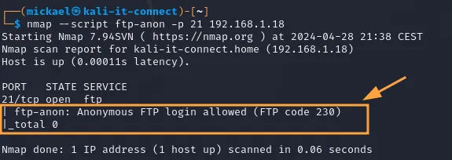


*NSE skripti kasutamine anonüümse FTP autentimise kontrollimiseks Nmap.* kaudu


Nmap haavatavuse tuvastamine on üks esimesi samme auditi või sissetungitesti läbiviimisel. See võimaldab teil kiiresti tuvastada teatud nõrgad kohad ja optimeerida oma analüüsi jõupingutusi.


Kuid olge ettevaatlik: **Haavatavuse skaneerimise tööriistadel on oma piirid**. Nmap katab ainult osa ohtudest ja ei garanteeri, et süsteem on turvaline, kui probleeme ei avastata. Seetõttu on oluline **tundma õppida, kuidas kasutatavad skriptid töötavad**, ja mitte toetuda ainult nende hinnangule.


### VI. Kokkuvõte


Me nägime, et Nmap'i valdamine võib hõlmata väga erinevaid kasutusviise, alates diagnostikast ja jälgimisest kuni kaardistamise, turvapoliitika hindamise ja haavatavuse skaneerimiseni. Järgmises jaotises läheme asja juurde ja paigaldame Nmapi.


## 3 - Nmapi paigaldamine ja seadistamine


### I. Esitlus


Selles jaotises õpime, kuidas paigaldada Nmap võrgu skaneerimise tööriist Linuxi ja Windowsi operatsioonisüsteemidesse. Selle jaotise lõpus on meil kõik vajalik, et hakata kasutama Nmap'i tulevaste moodulite jaoks. Lõpuks näeme, milliseid privileege ta kasutamisel võib nõuda ja miks.


### II. Nmapi paigaldamine Linuxi alla


Nmap oli algselt mõeldud GNU/Linuxi operatsioonisüsteemidele. Selle tulemusena ja tänu selle pikaealisusele ja populaarsusele leiate selle kõigist suuremate Unix-distributsioonide ametlikest repositooriumidest. Selles õpetuses kasutan ma Debianil põhinevat operatsioonisüsteemi [Kali Linux] (https://www.it-connect.fr/cours/debuter-avec-kali-linux/ "Kali Linux"). Kuid te võite seda kasutada täpselt samamoodi ka klassikalisest Debianist, CentOSist, Red Hatist või millest iganes!


Debianis saate kontrollida, kas Nmap on teie praegustes repositooriumides olemas, kasutades järgmist käsku:


```
# Debian and derivatives
$ sudo apt search ^nmap$
Sorting... Done
Full Text Search... Done
nmap/kali-rolling,now 7.94+git20230807.3be01efb1+dfsg-2+kali1 amd64
The Network Mapper

# Red Hat and derivatives
$ dnf search '^nmap$'
```


Vastus näitab selgelt, et pakett "nmap" on olemas repositooriumides (siin Kali [Linux](https://www.it-connect.fr/cours-tutoriels/administration-systemes/linux/ "Linux")). Nüüdsest saad Nmap'i paigaldada tavaliste paigalduskäskude kaudu, midagi desarmeerivat hetkel ei ole 🙂:


```
# Debian and derivatives
sudo apt install nmap

# Red Hat and derivatives
sudo dnf install nmap
```


Et kontrollida, kas Nmap on õigesti paigaldatud, näitame selle versiooni:


```
nmap --version
```


Siin on oodatav tulemus:


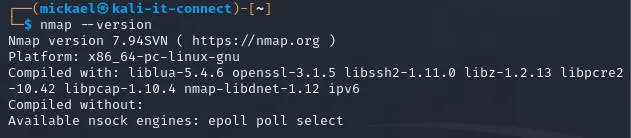


nmap._ praeguse versiooni kuvamise tulemus


Pange tähele, et selles näidikus on olemas "libpcap" (_Packet Capture Library_) raamatukogu ja selle versioon. "libpcap", mida kasutab ka Wireshark, kasutatakse Nmap'i poolt pakettide loomiseks ja manipuleerimiseks ning võrguliikluse kuulamiseks.


### III Nmapi paigaldamine Windowsis


Windowsi operatsioonisüsteemi paigaldamiseks alustage binaarkoodi allalaadimisega ametlikust saidist (ja mitte mujalt!):


- Nmapi allalaadimise leht ametlikul veebisaidil: [https://nmap.org/download.html#windows](https://nmap.org/download.html#windows)


Seejärel peate alla laadima binaarkoodi nimega `nmap-<VERSIOON>-setup.exe`:


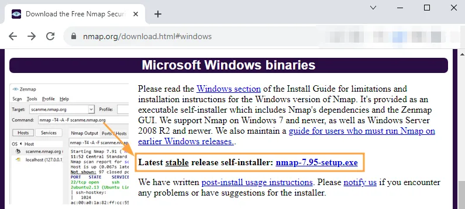


nmap for Windows binaarse installeerimise allalaadimisleht


Kui see binaarsüsteem on teie süsteemis, käivitage see lihtsalt Nmapi installimiseks. See on lihtne paigaldus ja te võite jätta kõik valikud vaikimisi.


Minu refleks on eemaldada märkeruut "zenmap (GUI Frontend)". See on Nmapi graafiline Interface, mida ma ei kasuta ja mida selles õpetuses ei käsitleta, kuid võite seda julgelt proovida, kui olete Nmapi käsurea tööriistaga hakkama saanud!


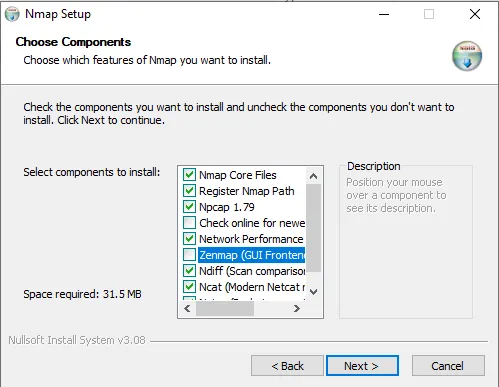


zenmapi valikuline eemaldamine Nmapi installimisel Windowsis


Nmap'i paigaldamise lõpus tehakse ettepanek paigaldada teine paigaldus: "Npcap" raamatukogu:


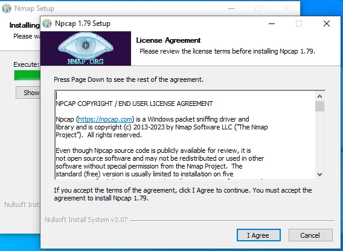


"Npcap" raamatukogu paigaldamine Nmap'i paigaldamisel Windows'i alla


See on raamatukogu, millele Nmap tugineb võrgukommunikatsiooni haldamisel, st võrgupakettide loomisel, saatmisel ja vastuvõtmisel. Tõenäoliselt olete selle raamatukoguga juba kokku puutunud, kui kasutate Wiresharki Windowsis, sest ka see kasutab seda ja nõuab installeerimist.


Nagu Linuxi puhul, saate kontrollida, et Nmap on paigaldatud, avades käsurea või [Powershell] terminali (https://www.it-connect.fr/cours-tutoriels/administration-systemes/scripting/powershell/ "Powershell") ja sisestades järgmise käsu:


```
nmap --version
```


Siin on oodatav tulemus:


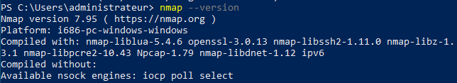


nmap._ praeguse versiooni kuvamise tulemus


Nmap on nüüd paigaldatud Windowsis. Seda saab kasutada täpselt samamoodi nagu Linuxis, järgides seda õpetust.


### IV. Nmapi kasutamiseks vajalikud kohalikud õigused


Aga muide, kui kasutate Nmap'i, **on vaja, et süsteemis oleksid kõrged kohalikud õigused?** Vastus on: **See sõltub**.


Väga lihtsal kujul, s.t. ilma selle valikute kasutamisel väga kaugele minemata, ei nõua Nmap tingimata privilegeeritud õigusi. Siiski mõistad peagi, et parem on Nmap'i kasutada privilegeeritud kontekstis ("root" Linuxi all, "administrator" või samaväärne Windows'i all), et seda täies mahus kasutada, riskides samasuguse veateate saamisega:


veateade Linuxi all, kui Nmapi valikud nõuavad root-õigusi._


Nii Linuxis kui ka Windowsis on palju juhtumeid, kus Nmap küsib teilt privilegeeritud juurdepääsu. Peamised põhjused on järgmised (mittetäielik loetelu):


- "Töötlemata" võrgupakettide konstrueerimine**: Nmap on võimeline kasutama mitmesuguseid skaneerimismeetodeid, sealhulgas täiustatud pakettide manipuleerimist ja konstrueerimist. See on näiteks siis, kui tahame teha TCP SYN-skaneerimisi, mis ei pea kinni TCP-vahetuse klassikalisest _kolmesuunalisest käepigistusest_. Selleks peab Nmap kasutama muid funktsioone kui operatsioonisüsteemidele omaseid, mis teavad ainult seda, kuidas järgida võrgukommunikatsiooni head tava (ta kasutab eespool nähtud raamatukogusid "Npcap" ja "libcap"). Just seetõttu, et Nmap ei tee asju "standardsel" viisil, suudab ta tuletada teatud teavet operatsioonisüsteemide, teenuste ja teatud haavatavuste kohta.


- Kuulake võrguliiklust**: mõned Nmapi valikud nõuavad, et ta kuulaks võrku, et saada teatud teavet. Seda tegevust peetakse operatsioonisüsteemides tundlikuks, kuna see võimaldab teil ka süsteemi teiste rakenduste kommunikatsiooni pealt kuulata. Nii nagu Wireshark, vajab ka Nmap selleks spetsiifilisi privileege, mida on lihtsam saada, kui viibida otse privilegeeritud sessioonis.


- Kuulamine privilegeeritud porte**: operatsioonisüsteemides on pordid 0 kuni 1024 (nii TCP kui ka UDP) nn privilegeeritud, st need on kuidagi reserveeritud väga spetsiifiliseks kasutuseks ja seetõttu kaitstud. Kuigi see on tänapäeval mõnevõrra vananenud põhjus, on siiski vaja teatud privileege, et neid porte kuulata, mida Nmap võib sõltuvalt kasutamisviisist teha.


- UDP-pakettide saatmine:** Samamoodi nõuab UDP-portide (olematu protokoll) võrgu rakenduse kuulamine operatsioonisüsteemides privilegeeritud õigusi. Seetõttu on vaja privilegeeritud seanssi, kui soovite teha UDP-skaneerimist, mille puhul Nmap peab ootama vastust, et analüüsida vastuseid oma skaneeringutele.


Täpsemalt öeldes on vähemalt Linuxi all võimalik käivitada Nmap'i koos kõigi selle funktsioonide ja valikutega, ilma et oleksite tegelikult root. See saavutatakse, andes binaarsele programmile õiged _võimekused_. See nõuab aga edasijõudnud manipuleerimist ja ei pruugi olla nii praktiline kui Nmap'i käivitamine otse õigustega. Samuti on see lähenemine vähem levinud ja võib valesti konfigureerituna tekitada turvaprobleeme.


Kuid see on natuke erinev meie Nmapi õpetusest, seega loobume sellest praegu.


Selle õpetuse ülejäänud osas eeldame, et Nmap'i käivitatakse alati "root'ina" (shell'ist "root'ina" või käsuga "sudo") või Windowsis administraatori terminalis, isegi kui see ei ole märgitud, siis eeldame, et Nmap'i käivitatakse alati "root'ina" (shell'ist "root'ina" või käsuga "sudo"). Vastasel juhul võib tekkida peeneid, kuid märgatavaid erinevusi võrreldes õpetusega.


### V. Kokkuvõte


See on kõik! Nmap on nüüd meie operatsioonisüsteemi installeeritud ja valmis kasutamiseks ning ei vaja enam mingit edasist seadistamist. See lõik lõpetab Nmap'i tutvustamise ja tutvustamise. Ma loodan, et see pani teile suu vett jooksma ja et te olete innukas, et alustada praktikat.


Kui rääkida tõsisemalt, siis nüüd on meil parem ülevaade sellest, mis on Nmap kaardistamise tööriist ja millised on selle kõige levinumad kasutusalad, samuti selle piirangud. Liigume edasi!


## 4 - TCP ja UDP portide skaneerimine Nmapiga


### I. Esitlus


Selles jaotises õpime, kuidas teha oma esimesed portide skaneerimised, kasutades võrgu skaneerimise tööriista Nmap. Me näeme, kuidas seda kasutada, et koostada loend võrguteenustest, mis on hostil avatud, kas TCP- või UDP-protokollide abil.


Nüüdsest alates ärge unustage, et skannite ainult kontrollitud keskkonnas olevaid hoste, mille jaoks teil on selgesõnaline luba.


- Meeldetuletuseks: [Karistusseadustik: III peatükk: Rünnakud automatiseeritud andmetöötlussüsteemide vastu](https://www.legifrance.gouv.fr/codes/article_lc/LEGIARTI000030939438/)


**Kui sul ei ole seda käepärast**, siis soovitan järgmisi tasuta lahendusi, mis on just see, mis vaja!


- [Hack The Box](https://app.hackthebox.com/ "Hack The Box")**: Hacking koolitusplatvorm, Hack The Box pakub pidevalt haavatavaid süsteeme, mida saab rünnata nii, nagu ise heaks arvate. Saadaval on mitusada süsteemi, kuid 20 masinast koosnevat uuendatud reservi pakutakse aastaringselt tasuta, millele on juurdepääs OpenVPN VPN-i kaudu.


- [Vulnhub](https://www.vulnhub.com/ "Vulnhub")**: See platvorm pakub allalaadimiseks arvukalt tahtlikult haavatavaid süsteeme, mida saab kasutada VirtualBoxi (samuti tasuta lahendus) kaudu või muul viisil. Pärast allalaadimist ei ole vaja VPN-i - kõik on lokaalne.


Samuti võite vabalt **luua virtuaalse masina** oma lemmikoperatsioonisüsteemil ja paigaldada sinna testimise sihtmärgiks erinevaid teenuseid. Selle eeliseks on see, et sa saad ka näha, mis toimub serveri poolel skaneerimise ajal, eriti Wiresharki abil, ja sa saad kätt proovida kohalikus tulemüüris, kui me teeme edasijõudnute teste.


Olgem praktilised!


### II. Hosti TCP-portide skaneerimine Nmapi abil


#### A. Esimene TCP-portide skaneerimine Nmapiga


Nüüd teeme oma esimesed skaneerimised Nmapi kaudu. Meie eesmärk on lihtne: me tahame teada saada, millised teenused on äsja kasutusele võetud veebiserveri poolt avatud, et näha, kas seal on midagi ootamatut, näiteks administreerimisteenus, mis ei tohiks olla kättesaadav, või mõne rakenduse port, mida me arvasime, et see on eemaldatud, on avatud.


Minu näites on skaneeritaval hostil IP Address "192.168.1.18":


```
nmap 192.168.1.18
```


Siin on võimalik tulemus. Me näeme klassikalist Nmapi tagastust, mis sisaldab palju teavet:


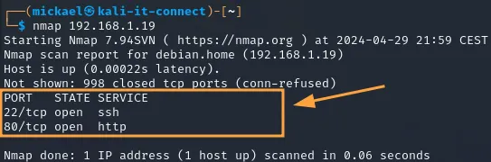


nmapiga tehtud lihtsa TCP-skaneerimise tulemused._


Vaadates seda tulemust, saame aru, et sellel hostil on ligipääs portidele TCP/22 ja TCP/80.


Vaikimisi ja kui te seda ei ütle, skaneerib Nmap ainult TCP-porti.


#### B. Lihtsa Nmap-skaneerimise tulemuste mõistmine


Läheme aga selle väljundi mõistmiseks sammu võrra kaugemale: iga rida on oluline, esiteks selleks, et teada saada, mida just tehti, ja teiseks selleks, et õigesti tõlgendada skaneerimistulemusi.


Esimene rida on sisuliselt meeldetuletus skannimisversioonist ja -kuupäevast (kasulik logimise ja arhiveerimise jaoks!):


```
Starting Nmap 7.94SVN ( https://nmap.org ) at 2024-04-29 21:59 CEST
```


Teine rida näitab skaneerimise tulemuste algust hostile "debian.home (192.168.1.19)". See teave on kasulik, kui me alustame mitme hosti skaneerimist korraga:


```
Nmap scan report for debian.home (192.168.1.19)
```


Kolmas rida ütleb meile, et kõnealune host on "Up", st aktiivne:


```
Host is up (0.00022s latency).
```


Lõpuks teatab Nmap meile, et 998 suletud TCP-porti ei kuvata:


```
Not shown: 998 closed tcp ports (conn-refused)
```


See säästab meid peaaegu 1000 rida väljundit, mis näeb välja nagu:


```
1/tcp closed
2/tcp closed
3/tcp closed
…
```


Täname teda, et ta meid sellega säästis!


Miks 998 "suletud" sadamat? Kui lisada 2 avatud porti, on tulemuseks 1000, ja see on portide arv, mida Nmap oma vaikimisi konfiguratsioonis skaneerib, mitte 65535 olemasolevat TCP-porti! Hiljem näeme, et see on täielikult ja lihtsalt kohandatav. Aga kui sihtmärgiks oleval hostil on teenus, mis kuulab mõnda üsna eksootilist porti, siis see "vaikimisi" skaneerimine seda ei avasta.


Selle teabe järel leiame kõige huvitavama: tabeli, mis on korraldatud kolme veeru "PORT - STATE - SERVICE" järgi:


- Esimene veerg "PORT" näitab lihtsalt sihtport/-protokolli, ja siin on oluline vaadata, kas tegemist on TCP-porti (`<port>/tcp`) või UDP-porti (`<port>/udp`).


- Veerg "STATE" näitab selles pordis avastatud võrguteenuse staatust, mille Nmap määras saadud vastuse põhjal. See võib olla "avatud", "suletud", "filtreeritud" või "teadmata". Hiljem näeme, kuidas Nmap neid eri olekuid eristab.


- Veerg "SERVICE" näitab kõnealuses sadamas avatud teenust. Pange aga tähele, et me ei ole siin kasutanud aktiivse teenuse avastamise võimalusi. Nmap tugineb kohalikule viitele pordi/protokolli ja väidetavalt määratud teenuse vahel: fail "/etc/services"


Kui te vaatate Linuxi süsteemis faili "/etc/services", leiate sealt lingi "port/protocol - service", mis on sarnane Nmap'i poolt kuvatud lingiga:


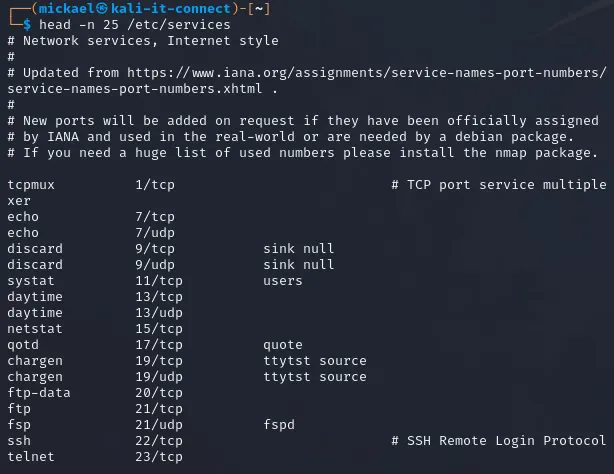


väljavõtte faili "/etc/services" sisust Linuxi all._


Oluline on mõista, et praegu ei ole Nmap teinud aktiivset teenuseotsingut. Näiteks ei oleks ta suutnud tuvastada SSH teenust TCP/80 pordi taga, kui see oleks olnud nii. Seega on oluline teada, kuidas kasutada õigeid valikuid - see tuleb varsti!


Nmap'i väljundite tõlgendamise oskus on oluline osa selle tööriista valdamisest. Hea uudis on see, et see väljund on suures osas sama, olenemata sellest, milliseid valikuid te kasutate.


#### C. Kapoti all: võrguanalüüs Wiresharki abil


Kui te vaatate tähelepanelikult, mis toimub serverit skaneeriva host'i Interface võrgus või serveri enda võrgus, on Nmap'i tegevus palju selgem. See on see, mida me siin teeme.


See, mida ma saan teile siin näidata, on vaid osa sellest, mida Wiresharkis näha on. Kui soovite minna kaugemale, tehke skaneerimise ajal ise võrgukaart ja sirvige siis seda, mis on jäädvustatud.


Selles testis on minu skaneerimishost (192.168.1.18) ja minu sihthost (192.168.1.19) samas kohalikus võrgus.


Nmap alustab selle väljaselgitamisega, kas sihtarvuti on kohalikus võrgus aktiivne, saates ARP-päringu. Kui ta saab vastuse, teab ta, et host on aktiivne ja alustab võrgu skaneerimist:


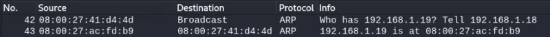


_ARP päring, mille Nmap väljastab, et teha kindlaks, kas sihtarvuti on kohalikus võrgus olemas._


Kui skaneeritav host asub kaugvõrgus, saadab Nmap esmalt pingi päringu ja püüab jõuda mõnda kõige sagedamini avatud porti (TCP/80, TCP/443):


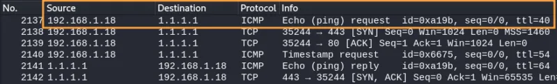


nmap'i poolt väljastatud ping päring, et teha kindlaks, kas sihtarvuti on kaugvõrgus kättesaadav


Kui ta saab vastuse mõnele neist testidest, loeb ta sihtmärgi aktiivseks.


Kui Nmap on kindlaks teinud, et sihtmärk on aktiivne, püüab ta selle domeeninime lahendada võrgukaardile konfigureeritud DNS-serveri abil:


dNS resolutsioon Nmap skaneerimise sihtmärgil


Nüüd, kui Nmap on tuvastanud oma sihtmärgi ja teab, et see on aktiivne, alustab ta TCP-porti skaneerimist:


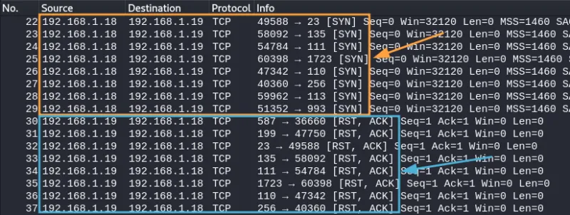


tCP SYN-paketi edastamine ja RST/ACK vastuvõtmine Nmap-skaneerimise ajal


Selleks saadab ta iga TCP-porti oma vaikimisi vahemikus ** TCP SYN-pakette ja ootab vastust**. Ülaltoodud ekraanipildil saab ta skaneeritud serverilt TCP RST/ACK-paketid, mis tähendab, et "liigu edasi, siin pole midagi näha" - teisisõnu, need pordid on suletud. Nagu nägime tulemusest, on see nii enamiku skaneeritud portide puhul. Kahe erandiga:


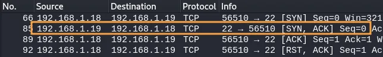


vastus TCP SYN-paketile, mis on saadetud port 22, mis on aktiivne skaneerimise sihtmärgis


Ülaltoodud ekraanipildil näeme TCP SYN/ACK-paketti, mille on saatnud sihtarvuti**. Port on aktiivne ja avab teenuse. Nmap kinnitab vastuse kättesaamist ja lõpetab seejärel ühenduse (TCP RST/ACK). **Sellest sai ta teada, et port TCP/22 on aktiivne**.


Nägime siin, et Nmap järgib TCP-võrgu skaneerimisel "kolmepoolset käepigistust". Jõudluse huvides on võimalik paluda tal mitte vastata serveri tagasisidele, säästes nii suure võrgu skaneerimisel mitu tuhat paketti. Aga me vaatame neid võimalusi ja optimeerimisi hiljem õppematerjalis.


Nüüd on meil parem ettekujutus sellest, kuidas teha TCP-skaneerimist ja mis tegelikult juhtub, kui seda tehakse. Samuti nägime, et vaikimisi teostab Nmap TCP-portide skaneerimise piiratud arvu portide kohta.


### III. UDP-portide skaneerimine Nmapiga


#### A. Esimene UDP portide skaneerimine Nmapiga


Nüüd vaatame, kuidas skaneerida host'i UDP-porti. Nagu me nägime, skaneerib Nmap vaikimisi alati TCP-porti. See võib tähendada, et kui me ei ole sellest teadlikud, jääb palju infot saamata.


Meeldetuletuseks, et selle testi jaoks on minu skaneerimishost (192.168.1.18) ja sihthost (192.168.1.19) samas kohalikus võrgus.


```
nmap -sU 192.168.1.19
```


Siin on saadud tagastus sama formaat nagu TCP-skaneerimisel, kuid aktiivsed teenused kuvatakse `<port>/UDP`, nagu nõutud!


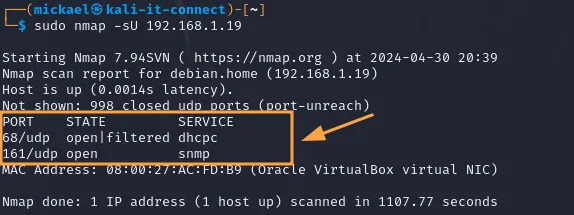


nmapiga tehtud lihtsa UDP-skaneerimise tulemus._


Valikut "-sU" kasutatakse selleks, et öelda Nmapile, et soovite töötada UDP-s, mitte TCP-s, nagu on vaikimisi.


Muuseas, te ilmselt märkate, et Nmap nõuab UDP-skaneerimiseks "root"-õigusi, nagu varem õpetuses mainitud.


märkus: Alates Nmap'i viimastest versioonidest on usaldusväärsete tulemuste tagamiseks alati soovitatav käivitada UDP-skaneerimine administraatori õigustega, kuna mõned funktsioonid nõuavad toorest juurdepääsu võrgupesadele._


UDP skaneerimine võib võtta väga kaua aega (minu näites 1100 sekundit 1000 pordi skaneerimiseks), kuna UDP-s puudub "kolmepoolne käepigistus", mis tähendab, et Nmap ootab iga saadetud UDP-paketi tagasisidet ja määrab pordi "suletud" ainult siis, kui pärast teatud aega (timeout) ei tule tagasisidet. See vastus skaneeritud hostidelt ei ole süstemaatiline ja sageli on vastuste arv sekundis piiratud, et vältida teatud võimendusrünnakuid. See on vastupidine TCP-le, kus skaneeritud host vastab kohe, olenemata sellest, kas port on avatud või suletud. Hiljem näeme, kuidas seda optimeerida.


Teine probleem UDP puhul on **see, et teenused ei vasta alati sissetulevatele pakettidele**, lihtsalt sellepärast, et see ei ole alati vajalik ja see on UDP põhimõte. Kui see on nii ja ICMP "port unreachable" ei ole vastu võetud, märgib Nmap teenuse "open|filtered", nagu on näidatud ülaltoodud ekraanipildil.


#### B. Kapoti all: võrguanalüüs Wiresharki abil


Sarnaselt TCP-skaneerimisega vaatame lähemalt, mis toimub UDP-skaneerimise ajal võrgutasandil, kasutades Wiresharki analüüsi. Nmap'i käitumine selle määramisel, kas host on aktiivne, on sama.


Ainus tegelik erinevus UDP skaneerimisel on see, et Nmap ei oota "kolmepoolset käepigistust", kuna seda mehhanismi ei ole UDP-s (olematu protokoll) olemas:


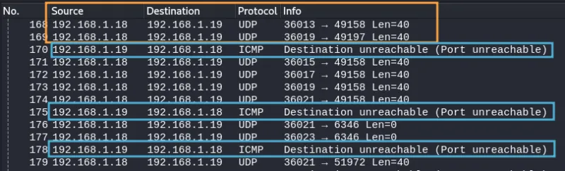


uDP pakettide edastamine ja ICMP vastuvõtt (port kättesaamatu) Nmap skaneerimise ajal


Ülaltoodud ekraanipildil näeme, et Nmap saadab suure hulga UDP-pakette ja saab vastuseks enamiku neist ICMP-paketi "Destination unreachable (Port unreachable)". See on normaalne, sest see on [RFC 1122] (https://www.freesoft.org/CIE/RFC/1122/41.htm "RFC 1122") määratletud asjakohane vastus, kui UDP-port on kättesaamatu:


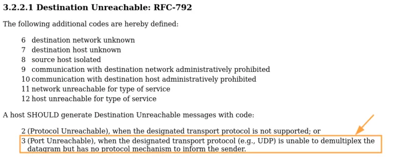


väljavõte RFC 1122._


Vaatame lähemalt seda Wiresharki kaadrit, mis näitab **kolme võimalikku stsenaariumi** UDP:


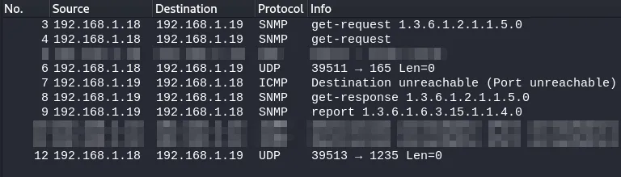


võrgu kaaperdamine UDP-skaneerimise ajal erinevatel sadamatel Nmap._ abil


Kolm juhtumit on järgmised:


- Esimene Exchange koosneb pakettidest nr. 3, 4 ja 8, 9. Nmap saadab UDP-pakette klassikalises SNMP-portis ja seega **konstrueerib protokollile vastavad paketid eelnevalt**. Seejärel saab ta serverilt vastuse (paketid nr 8 ja 9). Tulemus: Nmap on saanud vastuse, teenus on "avatud".


- Teine Exchange koosneb pakettidest 6 ja 7. Nmap saadab "tühja" UDP-paketi (ilma protokollistruktuurita) port UDP/165 ja saab vastuseks ICMP-paketi: "Destination unreachable (Port unreachable)". Tulemus: Nmap on saanud (negatiivse) vastuse, host on püsti, kuid teenus, mida ta püüdis saavutada, ei tööta sellel pordil, mis märgitakse "suletud".


- Viimane Exchange koosneb paketist nr 12: Nmap saadab "tühja" UDP-paketi UDP/1235 porti. Vastus puudub, isegi mitte selgesõnaline keeldumine skaneeritud hostilt. Tulemus: Nmap märgib pordi "open|filtered", kuna ta ei suuda öelda, kas see on tingitud tulemüürist, mis on konfigureeritud mitte vastama, või aktiivsest UDP-teenusest, mis niikuinii ei vasta (UDP-s ei ole kohustuslik).


Siin on Nmap'i poolt kuvatud tulemus nende kolme juhtumi järel:


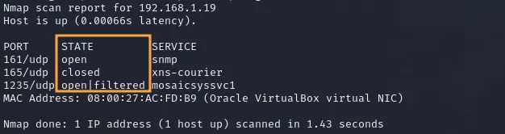


nmap._ kaudu teostatud UDP-skaneerimise võimalikud tulemused


Nüüd on meil parem ettekujutus sellest, kuidas teha UDP-skaneerimist ja mis tegelikult juhtub, kui seda tehakse. Siiani oleme Nmap'i kasutanud väga lihtsalt, otsustamata, milliseid porte skaneerida, kuid see muutub peagi!


### IV. Pordi skaneerimise peenhäälestamine Nmapiga


#### A. Meeldetuletus Nmap'i vaikimisi käitumise kohta


Nagu me nägime, valib Nmap ise skaneeritava arvu ja pordid, kui te ei määra mingeid valikuid. See on "vaikimisi" konfiguratsioon, mida Nmap kasutab, kui te ei ütle talle täpselt, mida teha. Need vaikimisi valikud on mõeldud selleks, et anda ettekujutus peamistest kokkupuutuvatest portidest, kusjuures need valitakse kokkupuute sageduse järgi (kõige levinumad või sagedasemad pordid), mitte numbrilises järjekorras (port 1, 2, 3 jne), ning ka selleks, et vältida 65535 võimaliku pordi skaneerimise alustamist, kui te ei määra vastavaid valikuid, mis oleks "vaikimisi" kasutusjuhu jaoks liiga pikk ja sõnaline.


**Kuidas need sadamad valitakse?


Vaikimisi režiimis skaneeritavad 1000 porti valitakse vastavalt nende esinemissagedusele. Seda statistikat haldab Nmap ja seda ajakohastatakse samamoodi nagu binaarsüsteemi ennast ja selle skripte (mooduleid). Seda statistikat saate ise vaadata failist "/usr/shares/nmap/nmap-services":


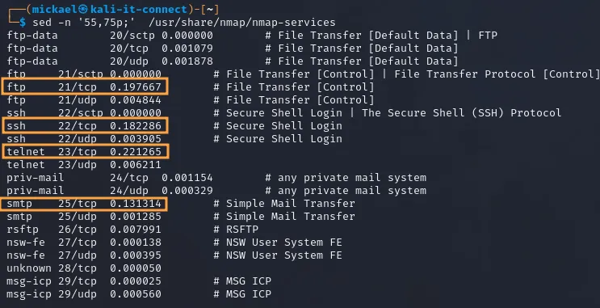


ekstraheeritud failist "/usr/shares/nmap/nmap-services"._


Siin, kolmandas veerus, näeme tõenäosusi (0 ja 1 vahel) või protsentuaalset jaotust. See on iga sadama/protokolli paari esinemissagedus. Näeme, et kõige tuntumatel portidel (FTP, SSH, TELNET ja SMTP selles väljavõttes) on palju suurem väärtus kui teistel.


#### B. Täpselt määrata Nmap-skaneerimise sihtportid


Reaalses maailmas võib meil aga olla vaja skaneerida ainult konkreetset sadamat või mitut sadamat või konkreetset sadamate vahemikku. Nmap teeb seda lihtsaks, et teha seda nii UDP kui ka TCP skaneerimise puhul ühtsel viisil.


**Skaneeri konkreetset porti Nmapi kaudu**


Kui me soovime skaneerida ainult ühte porti, mitte 1000, siis saame selle pordi määrata Nmapi valiku "-p" või "--port" abil:


```
# Scan a single TCP port with Nmap
nmap 192.168.1.19 -p 80

# Scan a single UDP port with Nmap
nmap -sU 192.168.1.19 -p 161
```


Selle tulemusena on skaneerimine loomulikult palju kiirem ja Nmap saadab ainult need paketid, mis on vajalikud selleks, et tuvastada, kas host on aktiivne, ja seejärel, kas määratud port on juurdepääsetav. See säästab aega, kui soovite lihtsalt teha kiire testi, et näha, kas teie näidisveebi veebiteenus on veel töös.


**Skaneeri mitu porti Nmapi kaudu**


Samamoodi saame Nmapile määrata mitu porti, kasutades sama valikut ja ühendades määratud pordid komaga:


```

# Scan several TCP ports with Nmap

nmap 192.168.1.19 -p 80,10999,22,23,1345

# Scan several UDP ports with Nmap

nmap -sU 192.168.1.19 -p 161,23,69

```


Sõltumata järjekorrast, Nmap kontrollib kõiki neid porte ja ainult neid, mis on sihtmärgiks oleval hostil. Nmap'i väljundis märkate, et ta **selgesõnaliselt teatab meile kõik pordid ja nende staatuse**, isegi kui need on "suletud". Erinevalt vaikimisi käitumisest, kus see täielik väljund oleks võtnud liiga palju ruumi:


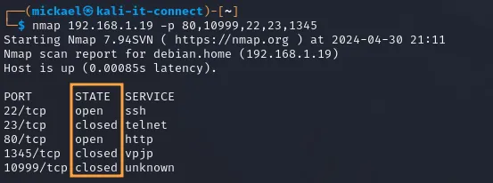


*Nmap TCP skaneerimise tulemus näidatud portide kohta.*


**Skaneeri erinevaid sadamaid


Kui skaneeritavate sadamate arv on liiga suur, võite määrata need vahemiku järgi, näiteks:


```

# Scan TCP ports from 1000 to 2000 with Nmap

nmap 192.168.1.19 -p 1000-2000

# Scan UDP ports from 1000 to 2000 with Nmap

nmap -sU 192.168.1.19 -p 100-150

```


Loomulikult võite näiteks kombineerida ja sobitada, kuidas teile sobib:


```

# Scan TCP ports 22,80, 3389 and from 1000 to 2000 with Nmap

nmap 192.168.1.19 -p 22,80,1000-2000,3389

```


**TCP ja UDP portide skaneerimine


Samuti saate teha UDP- ja TCP-skaneerimisi valitud portide kohta samaaegselt:


```

# Scan the list of 1000 default ports, in TCP and UDP

sudo nmap 192.168.1.19 -sT -sU

# Scan only UDP/161 and TCP/22

sudo nmap 192.168.1.19 -sT -sU -p U:161,T:22

```


Selles viimases näites märkate, et "U:" tähistab UDP-porti ja "T:" TCP-porti. Siin on sellise skaneerimise võimalik väljund:


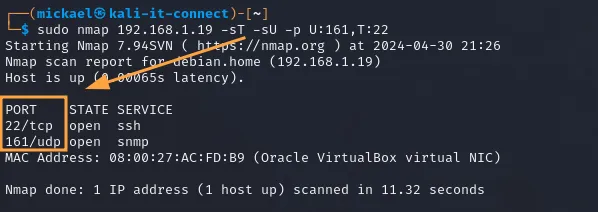


*TCP ja UDP portide skaneerimise tulemus Nmap.* abil


See on huvitav viis oma skaneeringute kohandamiseks!


**Scan kõik sadamad


Lõpuks on võimalik Nmapile määrata palju suuremaid või väiksemaid vahemikke. Nägime, et Nmap'i poolt valitud vaikimisi nimekiri sisaldab 1000 porti. Me võime küsida ka 100 kõige sagedamini esinevat porti või 200 kõige sagedamini esinevat porti, kasutades valikut "--top-ports":


```

# Scan the top 100 most common ports with Nmap

nmap 192.168.1.19 --top-ports 100

# Scan the top 200 most common ports with Nmap

nmap 192.168.1.19 --top-ports 200

```


Lõpuks võime paluda tal skaneerida kõiki võimalikke porte (kõik 65535), kasutades märkust "-p-":


```

# Scan all TCP ports from 1 to 65535 with Nmap

nmap 192.168.1.19 -p-

```


Viimane võtab kauem aega, eriti UDP puhul, kuid te ei jäta kindlasti ühtegi avatud porti kasutamata.


*Märkus: Valik "-p-" on soovitatav meetod kõigi TCP-portide skaneerimiseks. UDP-skaneerimise puhul on soovitatav piirata portide arvu jõudluse huvides, kuna kõikide UDP-portide täielik skaneerimine võib võtta väga kaua aega.*


Hiljem õpikuga näeme, kuidas optimeerida Nmapi skaneerimise kiirust vastavalt meie vajadustele, mis on eriti kasulik kõikide TCP- ja UDP-portide skaneerimisel.


### V. Kokkuvõte


Selles jaotises oleme lõpuks saanud natuke praktikat, nii et me teame nüüd **kuidas kasutada Nmap'i põhiliselt, et skaneerida hostide TCP- ja UDP-porti**. Samuti vaatasime üksikasjalikult, mis toimub võrgu tasandil ja **kuidas Nmap tuvastab, kas TCP- või UDP-port on aktiivne või mitte**. Lõpuks teame, kuidas peenelt valida pordid, mida tahame skaneerida, ja **mis on Nmap'i vaikimisi valikud tegelikult**. Järgnevalt kasutame neid teadmisi uuesti ja rakendame neid kogu võrgu skaneerimiseks, sealhulgas globaalseks kaardistamiseks ja võrgu avastamiseks.


## 5 - Võrgu kaardistamine ja avastamine Nmapiga


### I. Esitlus


Selles jaotises õpime, kuidas kasutada võrgu kaardistamiseks Nmap-võrgu skaneerimise tööriista, et kaardistada oma võrku. Me näeme, kui tõhus see võib olla selle ülesande täitmisel, kasutades selle erinevaid võimalusi. Lõpuks vaatame erinevaid viise, kuidas Nmapile meie skaneerimise sihtmärke määrata.


Eelkõige kasutame seda, mida õppisime eelmises jaotises selle kohta, kuidas Nmap määrab kindlaks, kas host on aktiivne ja juurdepääsetav.


Nagu Nmapi sissejuhatuses mainitud, on tegemist võrgukaardistajaga. Sellisena on see ideaalne vahend, et koostada nimekiri võrgus olevatest ligipääsetavatest hostidest, olgu need siis kohalikud või eemal asuvad.


**Autori tagasipöördumine:**


Tegelikult kasutan ma küberturbe audiitorina ja pentesterina Nmap'i süstemaatiliselt, kui teen sisemisi penetratsiooniteste, et teada saada, kus ma olen, kes on minu naabrid kohalikus võrgus ja millised teised võrgud on ligipääsetavad ning millised süsteemid asuvad neis. Minu eesmärk on lihtne: kaardistada võrk, määrata kindlaks infosüsteemi suurus ja eelkõige visandada selle ründepind.


Võrgu kaardistamine võib olla kasulik ka võrgu diagnostika, järelevalve ja varade kaardistamise kontekstis (kas olete tõesti kindel, et teie IS koosneb ainult sellest, mis on Active Directory's või GLPI/OCS Inventory's? Seda saab kasutada ka varjatud IT olemasolu tuvastamiseks teie infosüsteemis.


### II. Nmap'i kasutamine võrgupiirkonna skaneerimiseks


#### A. Võrgu avastamine Nmap-skaneerimisega


Nüüd tahame minna sammu võrra edasi ja analüüsida kogu meie kohalikku võrku. Miski ei saaks olla lihtsam: peame vaid taaskasutama käske, mida nägime eelmises jaotises, kuid määrama lihtsa IP Address asemel CIDRi.


CIDR (**Classless Inter Domain Routing**) on "klassikaline" tähistus võrgu vahemiku ja selle ulatuse määramiseks (maski abil). Näiteks "192.168.0.0/24" on "tõlge" kümnismaski märkest "255.255.255.255.0".


Nmapi kasutamiseks CIDR-i määrates saame seda kasutada järgmiselt:


```
# Scan a CIDR
nmap 192.168.0.0/24
```


Samuti on võimalik, nagu ka eelmises jaotises portide puhul, määrata mitu hosti, mitu võrku või vahemikku:


```
# Scan several networks at once via their CIDR
nmap 192.168.0.0/24 192.168.1.0/24

# Scan several hosts via their IP
nmap 192.168.1.2 192.168.1.3 192.168.1.10-20

# Mix of both
nmap 192.168.0.0/24 192.168.1.3 192.168.1.10-20
```


Siin on näide tulemustest, mida võime saada, kui käivitame skaneerimise võrgus:


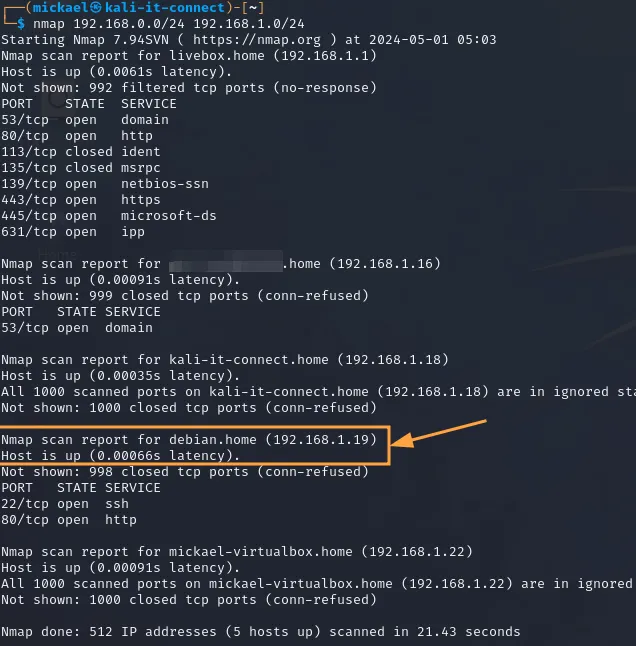


nmap skaneerimise tulemused mitme võrgu kaardistamiseks


Eelkõige näeme mitmeid aktiivseid hoste ja iga hostide osa algab sellise reaga:


```
Nmap scan report for <name> (<IP>)
```


See võimaldab meil selgelt näha, millisele vastuvõtjale järgmised tulemused viitavad. Oluline on ka viimane rida:


```
Nmap done: 512 IP addresses (5 hosts up) scanned in 21.43 seconds
```


Me teame, et Nmap avastas skaneeritud võrkudes 5 aktiivset hosti.


#### B. Kapoti all: võrguanalüüs Wiresharki abil


Nüüd vaatleme lähemalt, mis juhtub võrgu tasandil Nmapi abil teostatud võrgu avastamisel.


Nagu nägime eelmises jaotises, kasutab Nmap vaikimisi ARP-protokolli, et tuvastada hostide olemasolu kohalikus võrgus:


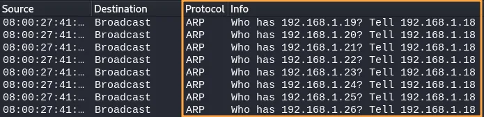


aRP paketid, mis on salvestatud kohaliku võrgu skaneerimisel Nmapi ja selle vaikimisi valikute abil


Seega suudab see tuvastada praktiliselt kõik kohalikus võrgus olevad hostid, kuna ARP päringule antud vastused on tavaliselt kõik võrgus aktiivsed hostid ja need ei tundu kuidagi kahtlased.


Kaugvõrkude puhul kasutab Nmap erinevaid meetodeid:


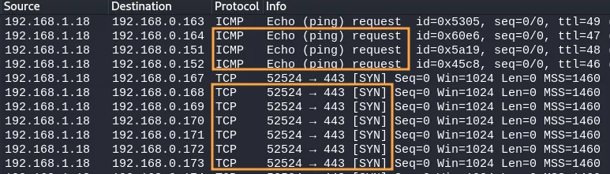


iCMP- ja TCP-paketid, mis on salvestatud kaugvõrgu skaneerimisel Nmapi ja selle vaikimisi valikute abil


Täpsemalt kasutab Nmap ICMP echo paketti (klassikaline pingimise juhtum) ja ICMP Timestamp paketti, mida tavaliselt kasutatakse pakettide transiidiaegade arvutamiseks. See loodab saada vastuse kaugvõrkudes asuvatelt hostidelt.


Aga see on veel midagi muud. Ülaltoodud Wiresharki kaadris on näha, et **TCP SYN** pakette saadetakse süstemaatiliselt iga potentsiaalse skaneeritava võrgu TCP/443 porti, samuti **TCP ACK** pakette TCP/80 porti.


**Milleks saata TCP-pakette portidele võrgu tuvastamise osana?


SYN-paketi saatmine antud porti võimaldab Nmapil **määrata, kas teenus kuulab seda porti**. Kui host vastab SYN-paketile SYN/ACK-paketiga, näitab see, et ta on aktiivne ja et teenus kuulab seda porti. Seetõttu proovib Nmap selle teenuse puhul õnne, **ka siis, kui pingile ei ole saadud vastust**.


ACK-paketi saatmine antud porti võimaldab Nmapil **määrata, kas sellel hostil on tulemüür**. Kui vastuvõtja vastab ACK-paketile RST (Reset) paketiga, näitab see, et sellel vastuvõtjal on tõenäoliselt tulemüür ja see blokeerib soovimatu liikluse. Seega reedab vastuvõtja oma olemasolu võrgus, isegi kui ta ei ole teistele päringutele vastanud.


Oluline on siiski märkida, et tulemüüri tuvastamine selle meetodi abil ei pruugi kõigil juhtudel olla täiesti usaldusväärne. Mõned hostid võivad generate RST-vastuseid anda muudel põhjustel kui tulemüüri olemasolu, näiteks konkreetse teenuse või operatsioonisüsteemi konfiguratsiooni tõttu. Lisaks võib moodsaid tulemüüre konfigureerida nii, et nad ei reageeri seda tüüpi avastamiskatseid.


Oleme nüüdseks jõudnud kaugele ja suudame teha põhilisi võrguotsinguid. Nüüd vaatame veel mõningaid võimalusi, mis annavad meile suurema kontrolli Nmap'i käitumise üle.


### III. Võrgu avastamine ilma pordi skaneerimiseta Nmapiga


Nagu olete ehk märganud, teostab Nmap vaikimisi **portide skaneerimise pärast aktiivse vastuvõtja avastamist**, mis lisab meie skaneerimisele tohutu hulga pakette ja vastuste ootamist. Kui teie võrgus on 5 host'i, püüab Nmap kontrollida umbes 5000 pordi olekut, mis võtab kauem aega.


Siiski on võimalik kasutada Nmap'i võimalusi, et teha **ainult aktiivsete hostide** avastamist võrgus, ilma nende teenuseid avastamata.


Kui me tahame ainult teada, millised hostid on kättesaadavad, ilma igasuguse teabeta nende poolt pakutavate teenuste ja portide kohta, siis võime kasutada valikut "-sn", et teha **ainult skaneerimist, kasutades ICMP Echo (ping) ja ARP päringuid**. Teisisõnu, lülitage portide skaneerimine täielikult välja:


```
# Scan a CIDR in Echo ICMP
nmap 192.168.1.0/24 -sn
```


Siin on Nmap-võrguotsingu tulemus, mis on tehtud ilma portide skaneerimiseta:


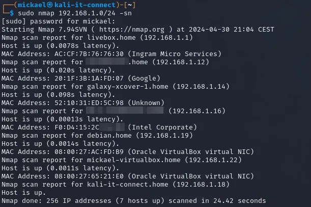


Nmapiga ilma pordi skaneerimiseta võrgu avastamise tulemus.


Me mainisime juba ICMP kasutamise võimalikke piiranguid ainult hostide leidmiseks (kaugvõrkude puhul). Seetõttu kasutab Nmap ka mõningaid trikke, mis võivad reeta tulemüüri või konkreetse teenuse olemasolu hostidel. Valikute abil saame neid trikke taaskasutada ja isegi laiendada, ilma et peaksime alustama uuesti iga avastatud hosti täielikku portide skaneerimist.


Selleks kasutame valikuid "-PS" (TCP SYN) ja "-PA" (TCP ACK), mis võimaldavad meil määrata pordid, millega me soovime liituda hostide tuvastamise osana, samuti valikut "-PP":


```
# Scan specific ports on a CIDR
nmap -sn -PP -PS22,3389,445,139 -PA80 192.168.1.0/24
```


See skaneerimine tagab juba praegu, et hostide tuvastamine on veidi täielikum kui vaikimisi valiku puhul.


Me hakkame saama üsna põhjalikke käske, kasutades mitmeid võimalusi. Seda seetõttu, et me teame, kuidas Nmap töötab ja tema "vaikimisi" valikute piiranguid, mis võivad mõnikord põhjustada aja raiskamist või oluliste Elements vahelejäämist. See ongi kogu mõte, et võtta aega selle omandamiseks!


Täpsustada meie viimase tellimuse võimalusi:


- "sn": keelab portide skaneerimise iga Nmap'i poolt avastatud aktiivse host'i puhul.


- "-PP": võimaldab ICMP kaja (ping skaneerimine) hostide avastamiseks.


- "`-PS <PORT>`": saadab TCP SYN-paketi näidatud port(idesse), et tuvastada mis tahes aktiivset teenust, mis reedab, et host ei ole pingile vastanud.


- "`-PA <PORT>`": saadab TCP ACK-paketi näidatud port(id), et tuvastada aktiivne tulemüür, mis reedab, et host ei ole pingile vastanud.


Ülaltoodud näites määran ma oma Nmap-kontekstides kõige sagedamini avatud pordid valikule "-PS". Neid erinevaid porte testitakse seejärel igal hostil, mitte selleks, et näha, kas nende hostis olev teenus on tõesti aktiivne, vaid selleks, et näha, kas see võimaldab meil avastada host, mis ei ole meie ICMP Echo'le vastanud, kuigi on endiselt aktiivne (teenuse või hosti tulemüüri vastuse kaudu).


Siin on näha, mida saab näha sellise skaneerimise ajal tehtud võrgukaardistuses, antud juhul väljavõte ühest sihtmärgiks olevast hostist:


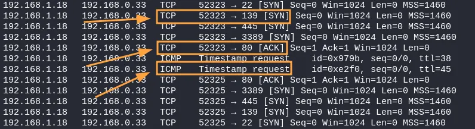


nmapi poolt võrgu täiustatud avastamise ajal saadetud paketid, ilma pordi skaneerimiseta


Me leiame meie TCP SYN paketid, meie TCP ACK pordi TCP/80 ja meie ICMP kaja. Nmap teeb kõik need testid iga hostile, mida meie võrguotsingu skaneerimine on sihtmärgiks võtnud.


### IV. Nmapiga sihtmärgiks oleva varade faili kasutamine


Sihtmärkide määramine võib kiiresti osutuda keeruliseks reaalsetes infosüsteemides, mis võivad mõnikord koosneda kümnetest või sadadest võrkudest, alamvõrkudest ja VLANidest. Seetõttu on lihtsam kasutada Nmapi allikana faili kui määrata neid ükshaaval käsureal.


Alustuseks looge lihtne fail, mis sisaldab ühte kirjet rea kohta:


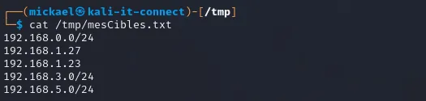


fail, mis sisaldab ühte sihtmärki (host või võrk) rea kohta


Järgmisena võime kasutada kõiki seni nähtud Nmapi valikuid ja määrata valiku "-iL <path/file>":


```
# Scan a list of targets contained in a file
nmap -iL /tmp/mesCibles.txt
```


Seejärel kaasab Nmap oma skaneerimisse kõik meie failis sisalduvad sihtmärgid.


Kui soovite olla kindel, et kõik teie sihtmärgid võetakse arvesse, võite kasutada valikut "-sL -n". Nmap tõlgendab siis ainult failis olevaid CIDR-e ja hoste ning kuvab need teile, ilma et ta saadaks ühtegi paketti üle võrgu:


```
# Display targets contained in a file
nmap -iL /tmp/mesCibles.txt -sL -n

Starting Nmap 7.94SVN ( https://nmap.org ) at 2024-05-01 14:52 CEST
Nmap scan report for 192.168.0.0
Nmap scan report for 192.168.0.1
Nmap scan report for 192.168.0.2
Nmap scan report for 192.168.0.3
Nmap scan report for 192.168.0.4
Nmap scan report for 192.168.0.5
Nmap scan report for 192.168.0.6
Nmap scan report for 192.168.0.7
Nmap scan report for 192.168.0.8
Nmap scan report for 192.168.0.9
Nmap scan report for 192.168.0.10
Nmap scan report for 192.168.0.11
Nmap scan report for 192.168.0.12
```


See tagab, et skaneeritavate hostide nimekiri on täpne.


Üks viimane oluline nõuanne, mida ma tahaksin teiega jagada, puudutab **hosti või võrgu välistamist skaneerimise osana**. See vajadus välistada host võib olla vajalik mitmel juhul, eriti kui me tahame olla kindlad, et **teabesüsteemi tundlikku komponenti meie skaneerimine ei häiri või häiriks**.


Sageli on sellised vajadused näiteks siis, kui ettevõte omab tööstuslikke (PLC) või tervishoiu seadmeid. Sellised seadmed on mõnikord halvasti konstrueeritud ja üldse mitte mõeldud halvasti vormindatud pakettide vastuvõtmiseks või liiga paljude pakettide vastuvõtmiseks. Ilmselgetel kättesaadavuse või ärilise/inimliku riski põhjustel on eelistatav neid testimisest välja jätta.


IP-aadresside või võrkude väljajätmiseks meie skaneerimisest võime kasutada Nmapi valikut "--exclude", näiteks:


```
# Exclude an IP address in a CIDR scan
nmap 192.168.1.0/24 --exclude 192.168.1.140
```


Selles näites skaneerin võrku "192.168.1.0/24", kuid jätan välja seal asuva host "192.168.1.140". Nmap ei saada sellele hostile ühtegi paketti. Teine näide allvõrgu välistamisega:


```
# Exclude a subnet in a CIDR scan
nmap 10.0.0.0/16 --exclude 10.0.100.0/24
```


Samamoodi skaneerin suurt võrku "10.0.0.0/16", kuid võrku "10.0.100.0/24" ei skaneerita. Jällegi soovitan kasutada valikut "-sL -n", et saada väga selge ülevaade sellest, millised hostid skaneeritakse ja millised jäetakse skaneerimisest välja, eriti kui tegutsed tundlikus kontekstis.


### V. Võrgu avastamine ja portide skaneerimine


Nüüd saame kombineerida selles jaotises õpitut sellega, mida õppisime eelmises jaotises pordi skaneerimise võimaluste kohta. Vaikimisi nägime, et Nmap skaneerib 1000 kõige sagedasemat porti igal aktiivsel hostil, mille ta avastab. Me nägime, kuidas seda käitumist takistada, kui me seda ei soovi, kuid me saame seda täielikult kontrollida ja isegi laiendada, kui see sobib meie vajadustele.


Näiteks järgmine käsk kontrollib, kas igal skaneeritaval hostil on olemas kuulatav teenus pordil TCP/22:


```
# Scan TCP/22 on a CIDR
nmap 192.168.0.0/24 192.168.1.0/24 -p 22
```


Nmap teeb esmalt võrguotsingu, et loetleda aktiivsed hostid ja kontrollib igaühe puhul, kas teenus on olemas pordil TCP/22.


Samamoodi saame teostada kõigi TCP-portide täieliku skaneerimise igal võrgus "192.168.0.0/24" avastatud hostil, välja arvatud näiteks host "192.168.0.4":


```
# Port scan of a CIDR with exclusion
nmap 192.168.0.0/24 --exclude 192.168.0.4 -p-
```


Te võite vabalt kombineerida kõiki seni õpitud võimalusi vastavalt oma vajadustele.


### VI. Kokkuvõte


Selles jaotises nägime, kuidas kasutada Nmapi võrgu kaardistamiseks, kasutades erinevaid võimalusi. Nüüd on meil täpsustatud arusaam meie skaneerimise sihtmärkidest, samuti Nmap'i portide skaneerimise käitumisest ja hostide leidmise meetodist. Ja mis kõige tähtsam, me teame, millised on Nmap'i vaikimisi käitumine ja piirangud ning kuidas kasutada selle peamisi võimalusi, et minna kaugemale.


Järgmises jaotises vaatleme mehhanisme ja võimalusi Nmapiga skaneeritavate teenuste ja operatsioonisüsteemide versioonide avastamiseks.


## 6 - Teenuse ja operatsioonisüsteemi versioonide tuvastamine Nmapiga


### I. Esitlus


Selles jaotises õpime, kuidas kasutada Nmap'i, et avastada ja täpselt tuvastada skaneeritud hostide poolt kasutatavate teenuste ja operatsioonisüsteemide versioonid. Vaatleme üksikasjalikult, kuidas Nmap seda ülesannet täidab, ning tutvume ka tööriista piirangutega, et selle tulemusi paremini mõista ja tõlgendada.


Nagu me selle õpetuse eelmistes osades nägime, ei vaata Nmap vaikimisi, milline teenus on avatud sadamates, mida ta skaneerib ja mida ta peab avatuks. Nii et kui te kuulate veebiteenust pordil TCP/22, teatab Nmap sellest jätkuvalt kui avatud, kuid `SSH` teenusena. See on tingitud sellest, et ta kasutab teie süsteemi kohalikku [andmebaasi](https://www.it-connect.fr/cours-tutoriels/administration-systemes/stockage/bdd/), et otsida seost pordi/protokolli ja teenuse nime vahel (fail `/etc/services/`).


Enamikul juhtudel annab [Nmap](https://www.it-connect.fr/cours/nmap-cartographie-reseau-scan-de-vulnerabilites/) teile õiget teavet, sest tootmiskeskkonnas on selliseid juhtumeid harva. Ülejäänud juhtumid on aga olukorrad, kus klassikaline teenus ([SSH](https://www.it-connect.fr/cours/comprendre-et-maitriser-ssh/), HTTP jne) on avatud mitteklassilisel pordil (nt 2022 SSH-teenuse puhul), mille puhul Nmap ei leia oma kohalikust andmebaasist vastet või ei vasta tegelikkusele ja te jääte ilma olulisest teabest.


Õnneks pakub Nmap väga täpseid võimalusi ja mehhanisme selle avastamiseks, milline täpne teenus võib olla avatud pordi taga peidus. Sellel on isegi päringute ja allkirjade andmebaas, et tuvastada täpsed tehnoloogiad ja versioonid. Lisaks teenustele suudab Nmap tuvastada ka kasutatud tehnoloogia ja selle versiooni.


Seda me vaatleme selles osas.


### II. Kuidas tuvastada tehnoloogiat või versiooni


#### A. Meeldetuletus tehnoloogia või versiooni tuvastamise kohta


Tehnoloogia ja versiooni tuvastamine hõlmab teenuse, CMSi, rakenduse või tarkvara nime, mis kuulab sihtportis. Näiteks veebilehte haldab CMS (WordPress), seda haldab veebiteenus (Apache, IIS, Nginx) ja seda haldab server (Linux või Windows). Aga kuidas te teate, milline veebiteenus töötab?


Klassikaline meetod selle teabe väljaselgitamiseks on _bänneri haaramine_, mis seisneb lihtsalt selles, et tuleb leida koht, kus kõnealune teenus seda teavet kuvab, ja lugeda andmeid. Väga sageli kuvavad teenused oma vaikimisi konfiguratsioonis või töötlemisel oma nime ja isegi versiooni esimese vastusena pärast ühenduse loomist.


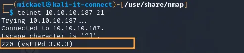


kuvab versiooni kohe, kui FTP-teenus loob TCP-ühenduse


Siin näeme, et lihtne TCP-ühendus selle teenusega `telneti` kaudu annab tulemuseks TCP-paketi, mis sisaldab selle tehnoloogiat ja versiooni.


Kui olete saanud aimu, millise teenusega on tegemist, saate saata sellele teenusele ka konkreetseid käske või päringuid, et saada sealt teavet. Neid päringuid/käsklusi võib saata ka pimesi (olemata kindel, et tegemist on õiget tüüpi teenusega), lootuses, et üks neist kutsub esile vastuse kõnealuselt teenistuselt.


Teistel, keerukamatel juhtudel on vaja saata konkreetseid pakette, et tekitada reaktsioon, näiteks viga, mis annab üksikasjalikku teavet kasutatud versiooni või tehnoloogia kohta.


Nagu te võite ette kujutada, kasutab Nmap kõiki neid meetodeid, et püüda tuvastada pordis hostitud teenuse täpne tüüp, samuti selle tehnoloogia nimi ja versioon.


#### B. Nmapi sondide ja vastete mõistmine


Kõigi nende kontrollide teostamiseks iga skaneeritud pordi puhul kasutab Nmap kohalikku andmebaasi, mida uuendatakse sageli (nagu ka binaarsüsteemi või selle mooduleid). See on mitme tuhande reaga tekstifail: `/usr/share/nmap/nmap-smap-service-probes`.


See fail koosneb arvukatest kirjetest, mis kõik on korraldatud kahe peamise suunise ümber:


- Probe: see on paketi määratlus, mille Nmap saadab, et püüda tuvastada tuvastatava teenuse reaktsiooni. Mõelge sellele kui pimedale katsele nagu _Hello? Guten Tag? Hello? Um... Buenos Dias ehk?_. Niipea, kui sihtrühma teenus saab sondi, millest ta aru saab (st räägib õiget protokolli), vastab ta Nmapile, mis saab siis kinnituse, mis tüüpi teenusega on tegemist.


- Match": need on regulaaravaldised, mida Nmap rakendab saadud vastuse suhtes. Kui HTTP GET päringu saatmine on esile kutsunud teenuse vastuse, rakendab ta selle vastuse suhtes kümneid regulaarseid väljendeid, et tuvastada näiteks sõna `Apache`, `Nginx`, `Microsoft IIS` jne. olemasolu.


Konkreetsete juhtumite jaoks on veel mõned direktiivid, kuid peamised, mis aitavad mõista, kuidas Nmap töötab, ja kohandada selle kasutamist, on need. Et seda teooriaosa konkreetsemaks muuta, on siin näide:


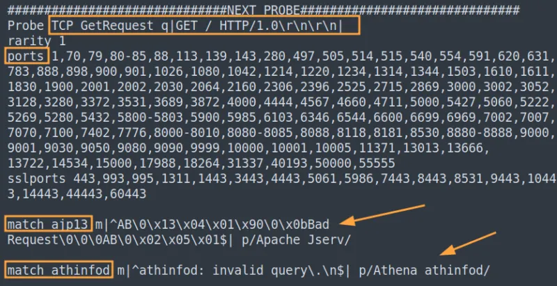


näide proovi kohta Nmap'i failis `/usr/share/nmap/nmap-service-probes`


Selle näite esimeses reas näeme lihtsasti mõistetavat proovi nimega `GetRequest`. See on TCP-pakett, mis sisaldab tühja HTTP GET päringut veebiteenuse juurest, kasutades HTTP/1.0, millele järgneb reavõte ja tühi rida.


Rida `ports` ütleb Nmapile, millise pordi jaoks seda proovi saata. See võimaldab teil seada testid tähtsuse järjekorda ja säästa aega.


Lõpuks on meil kaks näidet `match` kohta. Esimene näiteks liigitab skaneeritud veebiteenuse kategooriasse `ajp13`, kui selles reas sisalduv regulaarväljend vastab saadud teenuse vastusele.


Et aidata teil mõista, kuidas Probes võib välja näha, on siin nimekiri mõnest Probesist, mida selles failis leiate (selle õpetuse kirjutamise ajal on neid kokku 188).


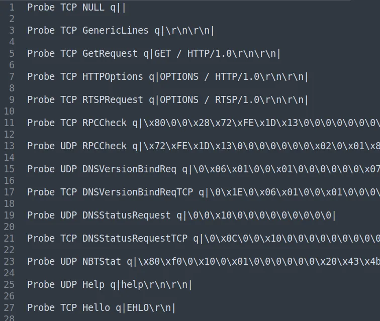


näide mitmest Nmap'i poolt kasutatavast sondist, mis asuvad failis `/usr/share/nmap/nmap/nmap-service-probes`._


Kaks esimest (nimega `NULL` ja `GenericLines`) on siinkohal eriti huvipakkuvad, kuna nad lihtsalt saadavad tühja TCP-paketi või sellise, mis sisaldab reavahet. Serveri teenused teatavad end sageli just siis, kui ühendus on saadud, ilma mingi konkreetse tegevuse, käsu või taotluseta kliendi poolt.


Siin on tegemist veidi keerulisema _vastavusega_:


```
# Match Nginx + version in an error 400 page
match ssl/http m|^HTTP/1.1 400 Bad Request\r\n.*?Server: nginx/([\d.]+)[^\r\n]*?\r\n.*<title>400 The plain HTTP request was sent to HTTPS port</title>|s p/nginx/ v/$1/ cpe:/a:igor_sysoev:nginx:$1/
```


Täpne regulaaravaldis on siin `m|` ja `|` vahel, mis piirab kõiki regulaaravaldisi selles failis. Palun võtke aega, et lugeda kogu see näide läbi. Märkate regulaaravaldises valikut: `([\d.]+)`, mida kasutatakse versiooni eraldamiseks. Selles näites on määratletud ka muud Elements, nagu tootenimi `p/nginx/`, hangitud versioon `v/$1/` ja CPE koos versiooniga `cpe:/a:igor_sysoev:nginx:$1/`.


CPE (Common Platform Enumeration) on standardiseeritud märkmete süsteem, mida kasutatakse tarkvara ja riistvara identifitseerimiseks ja kirjeldamiseks. See formaat võimaldab haavatavuste ja turvakonfiguratsioonide tõhusamat haldamist ja eelkõige nende ühtset esitusviisi, olenemata sellest, millise tootega on tegemist. Siin on kaks CPE näidet: `cpe:/o:microsoft:windows_8.1:r1` ja `cpe:/a:apache:http_server:2.4.35`


Siinkohal määratleme selgelt nende tüübid `o` operatsioonisüsteemi jaoks, `a` rakenduse, tootja, toote ja versiooni jaoks.


Seega, kui _match_ vastab ühele neist regulaaravaldistest, saame lisaks teenuse nimele ka selle versiooni ja täpse CPE, mis lihtsustab seda versiooni mõjutavate CVE-de leidmist. Te leiate selle teabe Nmap'i standardväljundist ja näete, et see on väga kasulik ka muudel eesmärkidel, mida me käsitleme mõnes järgmises lõigus.


Faili `/usr/share/nmap/nmap/nmap-service-probes` täpne süntaks ei piirdu sellega ja võib tunduda üsna keeruline, kui te ei ole harjunud Nmapiga ja selle tulemustega manipuleerima. Siiski peaksite vähemalt meeles pidama selle olemasolu ja üldist toimimist, mis tuleb hiljem kasuks, kui soovite tulemust mõista või siluda, skaneerimist kohandada või isegi Nmapi arendusse panustada.


### III. Nmapi kasutamine versioonide tuvastamiseks


Nüüd kasutame kogu seda keerulist _Probe_ ja _Match_ mehaanikat lihtsa valiku abil: `-sV`. See lihtsalt ütleb Nmapile: proovige täpselt välja selgitada, milliseid teenuseid ja portside versioone te olete seadnud avatuks.


```
# Enable service and version detection
nmap 192.168.1.0/24 -sV
```


Siin on täielik näide sellise käsu tulemusest:


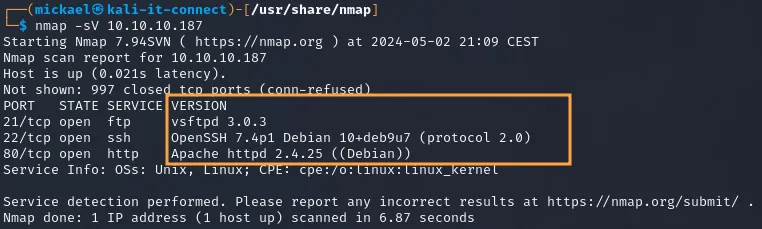


nmap'i versioonituvastuse tulemused võrgus avatud rakenduste kohta


Siin näeme, et Nmap on suutnud tuvastada kõik võrguteenuste versioonid, mida see sihtmärk pakub, ja kuvab selle teabe uues veerus `VERSIOON`. On võimalik näha üsna täpset teavet, isegi kuni operatsioonisüsteemini välja, kui see teave on osa taastatud allkirjast.


Selleks, et mõista üksikasjalikult, mis toimub haavatavuse skaneerimise ajal, saame kasutada valikut `--version-trace`. See annab silumisrežiimi vaate, mis näitab _Probe_, mis viis avastamiseni:


```
# Enable version detection debug
nmap 192.168.1.0/24 -sV --version-trace
```


Selle tulemusena on meil palju teavet, mida sorteerida. Püüdke tuvastada read, mis algavad sõnaga `Service scan Hard match`. Seejärel näete selliseid ridu:


```
Service scan hard match (Probe NULL matched with NULL line 789): 10.10.10.187:21 is ftp. Version: |vsftpd|3.0.3||
Service scan hard match (Probe NULL matched with NULL line 3525): 10.10.10.187:22 is ssh. Version: |OpenSSH|7.4p1 Debian 10+deb9u7|protocol 2.0|
Service scan hard match (Probe GetRequest matched with GetRequest line 10510): 10.10.10.187:80 is http. Version: |Apache httpd|2.4.25|(Debian)|
```


Me näeme selgelt, milliseid _Probes_ kasutati tehnoloogia ja versiooni tuvastamiseks (antud juhul `NULL` ja `GetRequest` _Probes_), samuti saadud teavet.


### IV. Testide kontrollimine ja tuvastamise täpsus


Nüüd pöördume tagasi failis `/usr/share/nmap/nmap-service-probes` oleva direktiivi juurde, mida me varem ei vaadanud:


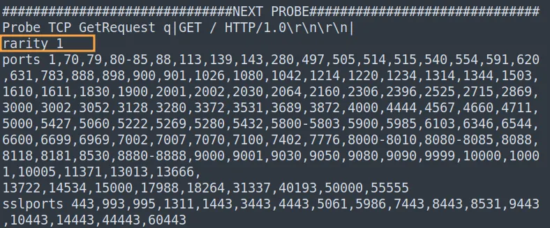


probes `rarity` direktiiv failis `/usr/share/nmap/nmap-service-probes`._


Seda direktiivi kasutatakse _Probe_ga seotud harulduse (st prioriteedi/tõenäosuse) märkimiseks. See märkus 1 kuni 9 võimaldab teil kontrollida Nmap'i poolt _Probes_ saatmisel teostatava analüüsi täielikkust. Nmap'i "notatsioonisüsteemis" annab haruldus 1 teavet enamikul juhtudest, samas kui haruldus 8 või 9 tähistab väga erilist juhtumit, mis on seotud harva esineva konfiguratsiooni või teenusega.


Et olla selgem, saadab Nmap vaikimisi igale tuvastatavale teenusele _Probes_, mille haruldus on vahemikus 1 kuni 7. Et anda teile parem ettekujutus _Probes_ jaotusest _harulduse_ järgi, on siin nende arv:


```
$ grep -E "^rarity" nmap-service-probes |sort |uniq -c

6 rarity 1
1 rarity 2
3 rarity 3
8 rarity 4
9 rarity 5
13 rarity 6
8 rarity 7
81 rarity 8
54 rarity 9
```


See võib tunduda vasturääkivana, et 8 ja 9 on rohkem "haruldust" kui ülejäänud. Seda just seetõttu, et harulduse 1 proovid on üldised ja töötavad enamikul juhtudel, sõltumata teenusest (mäletage `NULL` proovi, mis lihtsalt saadab tühja TCP-paketi). Samas kui keerulisemad Probes on peaaegu unikaalsed iga teenuse kohta.


Kui me soovime käsitsi hallata proovivõttureid, mida me soovime kasutada oma versiooniskaneerimisel, saame kasutada valikut `--version-intensity`. Siin on kaks näidet:


```
# Less accurate version detection than default
nmap 192.168.1.0/24 -sV --version-intensity 2

# Very deep detection, using all existing Probes
nmap 192.168.1.0/24 -sV --version-intensity 9
```


Selle teema lõpetuseks on siin näide _Probe_ 9 ja 8 kohta:


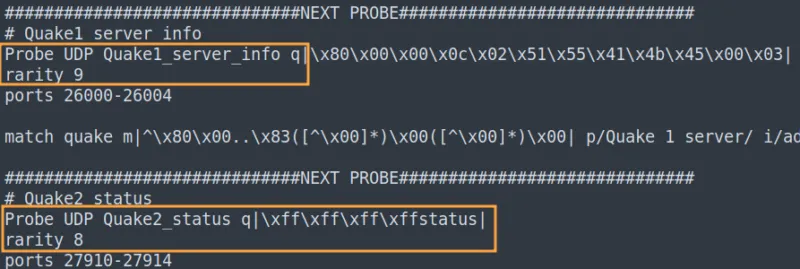


näited Probe'i kohta harulduse 8 ja 9 juures failis `/usr/share/nmap/nmap-service-probes`._


Need kaks _Probes_ tuvastavad Quake1 ja Quake2 serverid (videomäng). Huvitav nostalgilise poole pealt, kuid tõenäoliselt ei ole sellest palju kasu igapäevaelus.


Sõltuvalt teie vajadusest täpsuse või kiiruse järele, pidage meeles, et see "harulduse" põhimõte on olemas ja võib tulemust mõjutada.


### V. Nmapi kasutamine operatsioonisüsteemide tuvastamiseks


Nüüd vaatame, kuidas Nmap aitab meil tuvastada võrgus skaneeritud ja tuvastatud hostide operatsioonisüsteeme. Selleks kasutame Nmap'i valikut `-O` (kui `OS Scan`).


```
# Enable OS Scan
nmap -O 10.10.10.0/24
```


Siin on näide tulemustest. Siin ütleb Nmap meile, et tegemist on tõenäoliselt Linuxi operatsioonisüsteemiga, ja pakub meile mitmesugust statistikat selle täpse versiooni kohta.


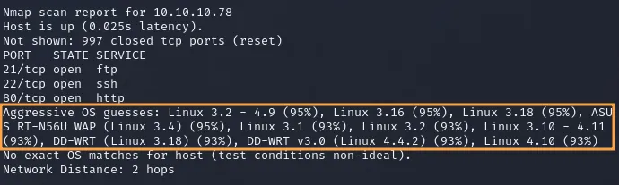


operatsioonisüsteemi tuvastamise tõenäosuse tuvastamine Nmapiga


Selle saavutamiseks kasutab Nmap mitmeid tehnikaid, mis töötavad tehnoloogia ja versiooni tuvastamiseks väga sarnaselt _Probes_ ja _Matches_ meetoditega. Peamine erinevus seisneb selles, et Nmap kasutab ICMP, TCP, UDP ja muude protokollide üsna "madala taseme" parameetreid. Siin on kaks testinäidet Microsoft Windows 11 operatsioonisüsteemi tuvastamiseks:


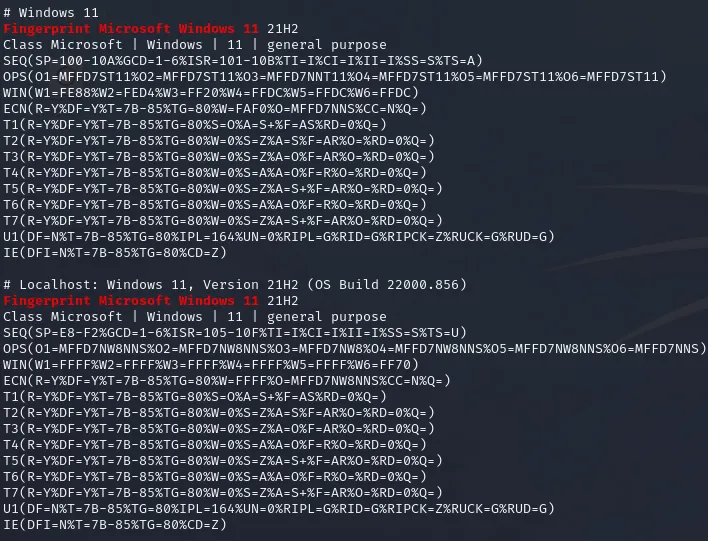


näited Nmap'i poolt Windows 11 operatsioonisüsteemi tuvastamiseks tehtud testide kohta


Olgem ausad, neid teste on väga raske tõlgendada ja me ei hakka neid sissejuhatava Nmap-õpiku raames põhjalikult mõistma. Kui soovite teemasse sügavamalt süveneda, siis seda teavet sisaldav fail on `/usr/share/nmap/nmap/nmap-os-db`.


Siiski peate olema teadlik, et operatsioonisüsteemi tuvastamine on pigem Nmapi poolt kindlaks tehtud tõenäosus kui kindlus.


### VI. Kokkuvõte


Selles jaotises õppisime, kuidas kasutada Nmapi võimalusi skaneeritud hostide ja teenuste tehnoloogiate, versioonide ja operatsioonisüsteemide tuvastamiseks. Nüüd on meil hea arusaam sellest, kuidas Nmap seda teavet eemalt hangib. Samuti oleme vaadanud läbi sõnavara ja testide täpsuse haldamise võimalused ning tööriista piirangud nendel teemadel.


Järgmises jaotises õpime, kuidas kasutada Nmap'i NSE skripte, et teostada meie infosüsteemi turvanalüüsi. Võtke aega, et lugeda viimased lõigud uuesti läbi, kui teil on vaja, ja ärge kartke harjutada ja ise tööriista sisemusse süveneda, et paremini omandada seni õpitut.


## 7 - Turvalisuse analüüs: haavatavuste tuvastamine


### I. Esitlus


Selles jaotises õpime, kuidas kasutada Nmap võrgu skaneerimise tööriista, et tuvastada ja analüüsida haavatavusi meie skaneeritavates sihtmärkides. Eelkõige vaatleme erinevaid võimalusi, mis on selle ülesande täitmiseks saadaval, ning uurime tööriista võimaluste piire, et paremini mõista ja tõlgendada selle tulemusi.


Selles esimeses osas vaatame Nmap'i haavatavuse skannerit ja vaatame, kuidas kasutada põhilisi haavatavuse tuvastamise võimalusi. Järgmistes osades vaatame lähemalt, kuidas see funktsioon töötab ja kuidas seda saab kohandada.


### II. Nmapi kasutamine haavatavuste tuvastamiseks


Nüüd tahame kasutada Nmap võrgu skannerit, et tuvastada haavatavusi meie infosüsteemi teenustes ja süsteemides. See tähendab, et lisaks aktiivsete hostide avastamisele, avatud teenuste loendamisele ning versioonide ja tehnoloogiate tuvastamisele otsib Nmap ka haavatavusi.


Selle saavutamiseks kasutab Nmap NSE (_Nmap Scripting Engine_) skripte, mida võib vaadelda kui mooduleid, mis võimaldavad testimise granuleeritud lähenemist.


Õigeid valikuid kasutades palume Nmapil kasutada oma erinevaid NSE skripte iga avastatud teenuse puhul, mis võimaldab meil avastada:


- Konfiguratsioonivigad ;


- Täiendav ja täiustatud versioon ja OS avastused ;


- Teadaolevad haavatavused (CVE) ;


- Nõrgad tunnused ;


- Pahavara infektsiooni iseloomulik Elements ;


- Teenuse keelamise võimalused ;


- Jne.


Nagu näete, laiendavad NSE skriptid oluliselt Nmapi võimalusi võrguoperatsioonide osas, mida ta saab teha. Ja seda selleks, et täita palju rohkem arenenud ülesandeid kui kunagi varem. Hea uudis on see, et nagu tavaliselt, saab neid funktsioone kasutada lihtsalt valiku kaudu ja vaikimisi kontekstis. Seda me näeme järgmisena.


### III. Näide haavatavuse skaneerimisest


NSE skripte saab kasutada Nmapi kasutamisel, et skaneerida ühte porti hostil, kõiki teenuseid sellel hostil või kõiki teenuseid, mis on tuvastatud mitmes võrgus. Seega saame kasutada võimalusi, mida me näeme kõigis seni uuritud kontekstides.


Haavatavuse skaneerimise lubamiseks Nmap skaneerimise kaudu peame kasutama valikut `-sC`:


```
# Enable vulnerability scanning during a scan
nmap -sC 10.10.10.152
```


Pidage meeles, et kui te ei määra midagi, skaneerib Nmap vaikimisi ainult 1000 kõige levinumat porti. See ei tuvasta haavatavusi eksootilisemates sadamates, mida teie sihtmärgid võivad avada.


Enne selle funktsionaalsuse kasutamist tootmisinfosüsteemis kutsun teid üles jätkama õpetuse lugemist. Järgnevates osades vaatleme, kuidas paremini kontrollida testide mõju ja tüüpe, mida käivitatakse.


Kasutades varem õpitut uuesti, saame näiteks olla põhjalikumad ja skaneerida kõiki sihtmärgi TCP-porti:


```
# Enable vulnerability scanning on all ports
nmap -sC -p- 10.10.10.152
```


Siin on Nmap skaneerimise tulemus, kasutades NSE skripte:


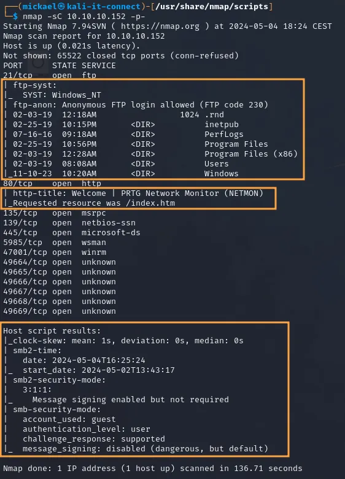


näide Nmap._ kaudu tehtud haavatavuse skaneerimise tulemustest hostil


Siin näeme haavatavuse analüüsi kontekstis huvipakkuva lisateabe kuvamist:


- FTP-teenusele saab juurdepääsu anonüümselt ja see ei ole kaitstud autentimisega. Selle kontrollimise eest vastutav NSE skript ütleb meile seda ja kuvab isegi osa FTP-teenuse puude struktuurist. Siin näeme, et meil on juurdepääs Windowsi süsteemi `C` kataloogile!


- NSE skript, mis vastutab täiustatud veebiteenuste otsimise eest, kuvab lehekülje pealkirja, mis annab meile parema ettekujutuse sellest, mida veebiteenus majutab.


- Meil on ka SMB teenuse konfiguratsiooni minianalüüs (skriptid `smb2-time`, `smb-security-mode` ja `smb2-security-mode`). Teave kuvatakse veidi teisiti, pärast võrgu skaneerimise tulemust, et seda oleks lihtsam lugeda. Eelkõige näitab see teave SMB Exchange allkirjade puudumist. See konfiguratsiooni nõrkus võimaldab sihtmärki kasutada SMB-relay-rünnakus, mis on märkimisväärne turvanõrkus, mida kasutatakse sageli ära sissetungi/kiberrünnaku testides.


Loomulikult on see vaid üks näide. Nmapil on NSE skriptid paljude teenuste jaoks, mis on suunatud paljudele haavatavustele. Neid võimalusi vaatleme lähemalt järgmises jaotises.


Selle haavatavuse skaneerimise sissejuhatuse lõpetuseks on siin täielik käsk võrgu avastamiseks, TCP-portide skaneerimiseks, versiooni ja haavatavuse tuvastamiseks:


```
# Complete and realistic vulnerability scan command
nmap -sV -sC -p- 192.168.0.0/24 192.168.1.13 192.168.2.10-20 --exclude 192.168.0.4
```


Siin on käsk, mis hakkab nägema realistlikumaid Nmapi kasutusjuhtumeid!


### IV. Nmapi piirangute mõistmine haavatavuse skaneerimisel


Olgem selged: Nmap ei ole võimeline läbi viima teie infosüsteemi täielikku sissetungitesti või simuleerima punase meeskonna operatsiooni. Sellel on mitu piirangut, millest peate olema teadlik, kui te ei taha, et teil oleks vale turvatunne:


- Piiratud katvus**: kuigi Nmap'i NSE skriptid on võimsad, võib nende testide katvus olla piiratud võrreldes teiste spetsialiseeritud haavatavuste avastamise vahenditega. Mõned haavatavused ei pruugi olla hõlmatud kättesaadavate NSE skriptidega, näiteks Active Directory haavatavused, tundlike andmete paljastamine või haavatavate veebirakenduste keerulisemad juhtumid.


- Haavatavuse keerukus**: teatavat tüüpi haavatavusi võib olla keeruline tuvastada NSE skriptide abil nende keerukuse tõttu. Näiteks ei pruugi Nmap tõhusalt tuvastada haavatavusi, mis nõuavad keerulist suhtlemist kaugteenusega (nagu näiteks ülemäärased õigused failijagis või õiguste kontrolli puudus veebirakenduses).


- Passiivne tuvastamine**: Nmap keskendub haavatavuste tuvastamisel peamiselt aktiivsetele skaneerimistele, mis tähendab, et see ei pruugi tõhusalt tuvastada võimalikke haavatavusi ilma aktiivse ühenduse loomiseta sihtmoodulitega. Seetõttu võivad jääda tähelepanuta haavatavused, mis ei ilmne aktiivse skaneerimise käigus (nagu näiteks koodisisestus veebirakenduses).


- Sõltuvus uuendustest**: Nmap'i [andmebaas](https://www.it-connect.fr/cours-tutoriels/administration-systemes/stockage/bdd/) NSE skriptide kohta areneb pidevalt, kuid uue haavatavuse avastamise ja vastava skripti Nmap'ile lisamise vahel võib olla viivitus. Selle tulemusena ei pruugi Nmap olla alati ajakohane uusimate haavatavuste osas.


- Valepositiivsed ja valenegatiivsed tulemused**: nagu iga turvavahendi puhul, võivad ka Nmap'i NSE skriptid anda valepositiivseid (valehäired haavatavuse kohta) või valenegatiivseid (tegelikud haavatavused, mida ei ole avastatud) tulemusi. Seda tuleb Nmapi tulemuste analüüsimisel silmas pidada.


Seega on oluline mõista, mida Nmap teeb ja mida mitte, ning samuti teada, kuidas selle tulemusi tõlgendada. Eelkõige oleme selle õpetuse jooksul näinud, et vaikimisi valikud võivad viia meid oluliste Elements vahele, mida saab hoolika kasutamisega avastada.


Olenemata sellest, kas olete võrgusüsteemi administraator, turvainsener või isegi CISO, Nmapi kasutamine annab teile ülevaate infosüsteemi turvaseisundist. See on oluline esimene samm süsteemi kaitsmisel, mida IT-meeskond võib regulaarselt teha. See ei tohiks siiski asendada [küberturvalisuse] ekspertide (https://www.it-connect.fr/cours-tutoriels/securite-informatique/) sekkumist ja nõuandeid, kes suudavad Nmapiga võrreldes palju põhjalikumalt nõrkusi avastada.


### V. Kokkuvõte


Selles 3. mooduli esimeses osas tutvustasime Nmapi abil haavatavuse skaneerimist. Me teame nüüd, kuidas kasutada selle ülesande täitmiseks peamist võimalust, kuid me teame ka selle harjutuse piiranguid. Järgmises osas vaatleme seda funktsionaalsust lähemalt, kasutades NSE skripte, et laiendada Nmap'i võimsust kümnekordselt.


## 8 - Nmap'i NSE skriptide kasutamine


### I. Esitlus


Selles jaotises vaatleme põhjalikult NSE (_Nmap Scripting Engine_) skripte. Eelkõige vaatleme, miks need on selle tööriista üks suuri tugevusi, kuidas nad töötavad ning kuidas sirvida ja kasutada paljusid olemasolevaid skripte.


See osa on jätkuks eelmisele õpetusele, kus me õppisime, kuidas kasutada Nmap'i haavatavuse skaneerimise funktsioone põhiliselt. Nüüd vaatame lähemalt, kuidas [Nmap](https://www.it-connect.fr/cours/nmap-cartographie-reseau-scan-de-vulnerabilites/) selles osas töötab, et saaksime taas kord täpsemaid ja kontrollitumaid skaneerimisi teostada.


### II. Nmap NSE skriptide kontseptsioon


Nmap'i NSE skriptid võimaldavad laiendada selle võimalusi väga paindlikult. Need on kirjutatud LUA keeles, mis on lihtsamini käsitletav ja kättesaadavam kui Nmapis kasutatav C või C# keel. LUA skriptide kasutamise eelis koos Nmapiga, mitte eraldiseisva tööriistaga, seisneb selles, et see võimaldab kasutada ära Nmapi täitmise kiirust ja standardseid funktsioone (hostide, portide ja versioonide tuvastamine jne).


Need skriptid on jaotatud kategooriate kaupa ja üks skript võib kuuluda rohkem kui ühte kategooriasse:


| Catégorie       | Description |
|----------------|-------------|
| **auth**       | Contient les scripts relatifs à l’authentification sur des services, dont l’accès anonyme ou l’énumération des utilisateurs. Exemples: `oracle-enum-users`, `ftp-anon`. |
| **broadcast**  | Contient les scripts relatifs aux opérations de broadcast sur le réseau, notamment en vue d’exploiter et de découvrir certains services, hôtes ou protocoles reposant sur le broadcast (IPv6, wake on lan, IGMP, etc.). Exemples: `broadcast-dhcp6-discover`, `broadcast-ospf2-discover`. |
| **brute**      | Contient les scripts relatifs aux opérations de brute force de l’authentification sur les services (brute force [SSH](https://www.it-connect.fr/cours/comprendre-et-maitriser-ssh/), MSSQL, etc.). Exemples: `ssh-brute`, `vnc-brute`. |
| **default**    | Contient les scripts utilisés dans le cas par défaut (utilisation de `-sC`). Plusieurs critères sont utilisés afin de valider l’entrée d’un script dans cette catégorie dont la vitesse d’exécution, la structure de la sortie, la fiabilité du test, le caractère “intrusif” ou “risqué”, etc. |
| **discovery**  | Contient les scripts relatifs à la découverte avancée du réseau et des services. On y retrouve par exemple l’énumération du contenu d’un partage SMB, d’une version d’un service VNC, des requêtes SNMP, etc. Exemples: `mysql-info`, `http-security-headers`. |
| **dos**        | Contient les scripts pouvant causer un déni de service. Il peut s’agir de scripts créés pour exploiter une vulnérabilité de type déni de service ou alors de scripts ayant pour effet de bord un déni de service. Prudence donc (ils sont exclus de la catégorie `default`). Exemples: `http-slowloris`, `ipv6-ra-flood`. |
| **exploit**    | Contient les scripts créés pour exploiter de manière directe une vulnérabilité. Exemples: `http-shellsock`, `smb-vuln-ms08-067`. |
| **external**   | Contient les scripts qui nécessitent l’utilisation d’une ressource tierce, comme une base d’information en ligne. Cela indique notamment une tentative de connexion vers l’extérieur (attention à la confidentialité). Exemples: `whois-ip`, `dns-blacklist`, `ip-geolocation-geoplugin`. |
| **fuzzer**     | Contient les scripts conçus pour envoyer des trames, paquets ou paramètres inattendus par un service. Cela permet notamment de causer des erreurs ou dysfonctionnements afin d’obtenir des pistes de vulnérabilité ou des informations techniques. Exemples: `dns-fuzz`, `http-form-fuzzer`. |
| **intrusive**  | Contient les scripts qui sont catégorisés comme “risqués” d’un point de vue disponibilité, ou détection. Ils peuvent provoquer un crash du système ou être détectés comme malveillant par une solution de sécurité. Il s’agit de la catégorie inverse de `safe`. Exemples: `smtp-brute`, `smb-vuln-ms08-067`, `smb-psexec`. |
| **malware**    | Contient les scripts conçus pour détecter la présence d’élément caractéristique d’un malware, tel qu’un port en écoute communément utilisé par une backdoor connue. Exemples: `ftp-proftpd-backdoor`, `smtp-strangeport`. |
| **safe**       | Contient les scripts qui sont considérés comme sûrs d’un point de vue détection ou stabilité. Il s’agit de la catégorie inverse de `intrusive` et elle contient en grande majorité des scripts avancés d’identification de version ou de relevé d’élément de configuration. Exemples: `html-title`, `smb2-security-mode`, `ms-sql-info`. |
| **version**    | Contient les scripts qui permettent une détection avancée de version. Ils peuvent être utilisés en complément des Probes et Matchs étudiés précédemment quand la détection d’une version nécessite des opérations un peu plus complexes. Exemples: `http-php-version`, `vmware-version`. |
| **vuln**       | Contient les scripts conçus pour détecter la présence de vulnérabilité connue (CVE) sans pour autant les exploiter (à l’inverse de la catégorie `exploit`). Ils se contentent en général de rapporter le statut “vulnérable” ou non d’un service. Exemples: `smb-vuln-ms17-010` (eternal blue), `http-phpmyadmin-dir-traversal`. |


Tehniliselt on kategooriad, millesse skript kuulub, märgitud otse selle koodis.


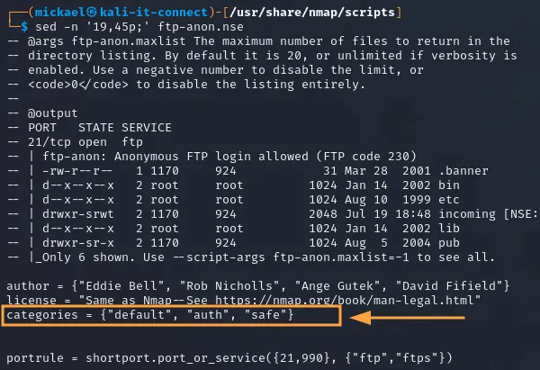


nSE skriptide kategooriad `ftp-anon`._


See näide näitab osa NSE skripti `ftp-anon.nse` koodist, mille täitmist me nägime eelmises lõigus.


### III. Olemasolevate NSE skriptide loetelu


Vaikimisi asuvad Nmap'i NSE skriptid kataloogis `/usr/share/nmap/scripts/`, millel puudub konkreetne puude struktuur või hierarhia. Siin on ülevaade selle kataloogi sisust:


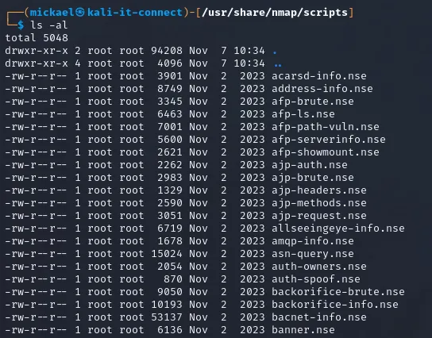


ekstraheerib kataloogi `/usr/share/nmap/scripts/` sisu, mis sisaldab NSE skripte._


See kataloog sisaldab üle 5000 NSE skripti. Enamasti sisaldab skripti nime esimene osa protokolli või kategooriat, millesse see kuulub. See võimaldab meil nimekirja sorteerida, näiteks kui soovime loetleda kõik FTP-teenusele suunatud skriptid:


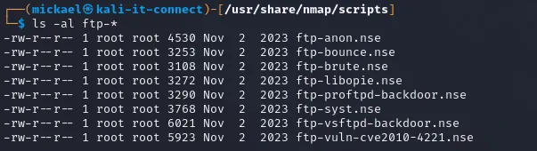


nimekiri NSE Nmap skriptidest, mille nimed algavad `ftp-`._


Nmap ei paku tegelikult võimalust oma NSE skriptide sirvimiseks ja loetlemiseks; saate kasutada käsku `--script-help`, millele järgneb kategooria nimi või sõna:


```
# List all scripts whose name starts with "ftp-"
nmap --script-help=ftp-*

# List all scripts from the "discovery" category
nmap --script-help=discovery
```


Väljundiks on siiski iga skripti nimi ja kirjeldus, mis ei ole optimaalne, kui otsing toob välja mitukümmend skripti:


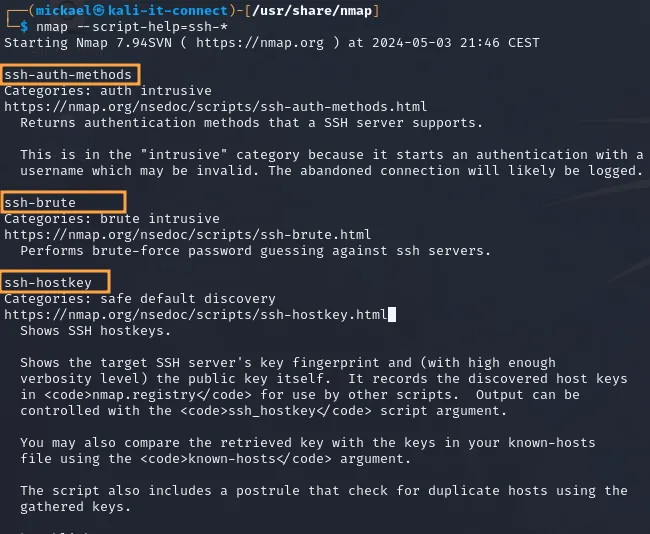


nmap'i käsu `--script-help` kasutamise tulemus


Minu arvates on kõige tõhusam meetod kasutada klassikalisi Linuxi käske kataloogis `/usr/share/nmap/scripts/`:


```
# List scripts targeting the "ssh" service
ls -al /usr/share/nmap/scripts/ssh*

# List scripts from the "dos" category
grep -rl '"dos"' /usr/share/nmap/scripts/
```


Saate vabalt sirvida teid kõnetavate moodulite koodi, et paremini mõista, kuidas NSE skript töötab.


### IV. Nmap'i NSE skriptide kasutamine


Nüüd õpime, kuidas teostada haavatavuse skaneerimist, valides hoolikalt välja NSE skriptid, mis meid huvitavad.


#### A. Valige skriptid kategooriate kaupa


Alustuseks võime valida, kas käivitada kõik konkreetsesse kategooriasse kuuluvad skriptid. Me peame selle kategooria või need kategooriad Nmapile märkima argumendiga `-skript <kategooria>`:


```
# Use default NSE scripts
nmap --script default 10.10.10.152
```


See esimene käsk on samaväärne käsuga `nmap -sC`. Vaikimisi valib Nmap skriptid kategoorias `default`, kuid see on vaid argumenteerimiseks. Järgmine käsk kasutab näiteks kõiki skripte kategoorias `discovery`:


```
# Use NSE scripts from the "discovery" category
nmap --script discovery 10.10.10.152
```


Nagu nägime, võimaldavad mõned kategooriad kiiresti kindlaks teha, mida seotud NSE skriptid teevad (`discovery`, `vuln`, `exploit`), samas kui teised määratlevad teostatud testi riski, tuvastamise või stabiilsuse taseme. Kui me oleme tundlikus kontekstis ja meil ei ole head ülevaadet meie skriptivaliku poolt teostatavatest erinevatest toimingutest, võime valida valikute kombineerimise, et valida ainult need skriptid, mis kuuluvad kategooriatesse `discovery` ja `safe`:


```
# Use scripts from multiple categories
nmap --script "discovery and safe" 10.10.10.152
```


Kui te tahate tingimata ja selgelt välistada skriptid kategooriatest `dos` ja `intrusive`, võite kasutada järgmist märkust:


```
# Exclude categories
nmap --script "not intrusive and not dos" 10.10.10.152
```


Pange tähele, et eespool esitatud välistamistingimuste täpsustamine toob kaasa kõigi teiste kategooriate kasutamise, mis ei ole selgesõnaliselt välistatud. Õigluse huvides võiks täpsustada näiteks:


```
# Include scripts from the "vuln" category except those that are too risky
nmap --script "vuln and not intrusive and not dos" 10.10.10.152

# Same thing, but only targeting the HTTP protocol
nmap --script "(http and vuln) and not intrusive and not dos" 10.10.10.152
```


Siin on mõned näited selle kohta, kuidas käsitleda NSE skripte kategooriate kaupa, eriti kui kasutate Nmap'i haavatavuste analüüsiks reaalses kontekstis.


#### B. Valige skriptid kui üksus


Me võime ka valida, kas analüüsi ajal teha üks konkreetne test, mis vastab NSE-skriptile. Selleks peame määrama skripti nime parameetris `skript <nimi>`. Võtame näiteks skripti `ftp-anon.nse`:


```
# Use an NSE script and a specific port
nmap --script ftp-anon -p 21 10.10.10.152
```


Siis saame väga täpse tulemuse:


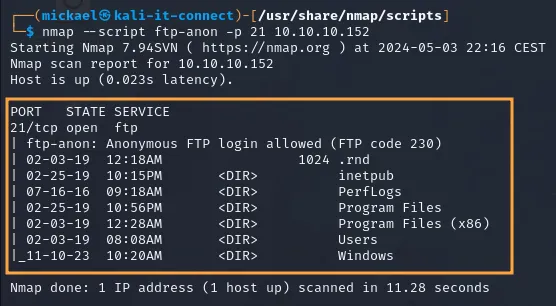


nSE `ftp-anon` skripti kasutamise tulemus Nmap._ kaudu FTP-portil


Me näeme skripti `ftp-anon` käivitamise tulemust port 21 ja mitte ühtegi muud porti, sest me määrasime valiku `-p 21`. Me oleksime võinud teha ka tavalise pordiotsingu, käivitades NSE skripti `ftp-anon` ainult avastatud FTP-teenuste puhul:


```
# Use a specific NSE script
nmap --script ftp-anon 10.10.10.152
```


Seega oleks Nmap teostanud selle anonüümse ühenduse testi ka siis, kui ta oleks leidnud FTP-teenuse mõnes teises pordis.


Lühikirjelduse selle kohta, mida NSE skript teeb, saate kasutada eespool mainitud valikut `--script-help`:


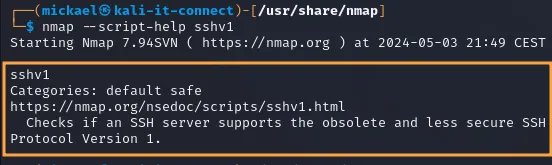


abi NSE skripti `sshv1` tulemuse kuvamine._


Ühesõnaga, me saame taas kord kasutada kõiki seni kasutatud võrgu avastamise võimalusi, teenuseid, versioone ja tehnoloogiaid!


#### C. Skripti argumentide haldamine


Nmapi kasutamise käigus puutute kokku teatud NSE skriptidega, mis vajavad korrektseks toimimiseks sisendargumente. Vaatame nüüd, kuidas Nmapi valikute kaudu nendele skriptidele argumente edastada.


Võtame näiteks skripti `ssh-brute`, mis võimaldab teil sooritada SSH-teenuse vastu brute force rünnakut.


Klassikaline brute force rünnak seisneb mitme parooli (mõnikord miljonite) testimises, et üritada autentimist konkreetsele kontole. Proovides nii palju paroole, panustab ründaja tõenäosusele, et kasutaja on kasutanud nõrka parooli, mis kuulub ründamiseks kasutatud paroolide sõnastikku.


Sellel skriptil on "vaikimisi" valikud, mida võiksime kohandada vastavalt meie kontekstile. Selle rünnaku kontekstis saame näiteks anda Nmapile kasutajate nimekirja ja kasutatava parooli sõnastiku. Minu teada ei ole võimalik skripti jaoks vajalikke argumente lihtsalt üles lugeda, seega on kõige usaldusväärsem viis külastada Nmapi ametlikku veebilehte. Otselinki NSE skripti dokumentatsioonile saab vastuseks `--script-help` valikule:


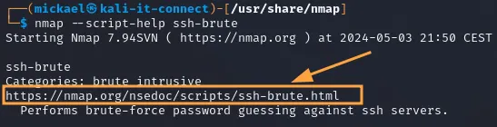


nSE `ssh-brute` skripti abi kuvamise tulemus koos lingiga nmap.org._ juurde


Klõpsates osutatud lingile, jõuame veebilehe [https://nmap.org](https://nmap.org/) sellele veebilehele:


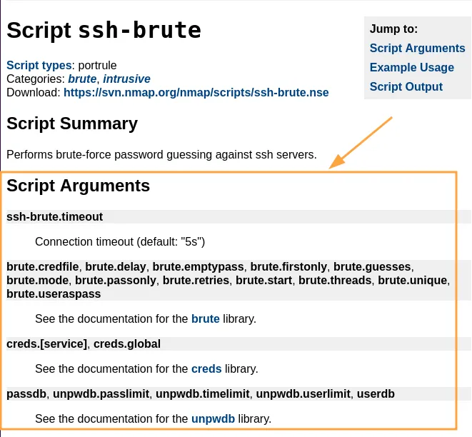


nimekiri argumentidest, mida saab edastada Nmap'i `ssh-brute` NSE skriptile


Siin on meil selge ülevaade argumentidest, mida saab kasutada, meie kontekstis on peamised argumendid `passdb` (fail, mis sisaldab paroolide nimekirja) ja `userdb` (fail, mis sisaldab kasutajate nimekirja). Dokumentatsioon viitab siinkohal Nmapi sisemistele raamatukogudele, kuna need brute force mehhanismid ja nendega seotud valikud on vastastikku ühtlustatud, et neid saaks kasutada ühtselt mitmes skriptis (`ssh-brute`, `mysql-brute`, `mssql-brute` jne) ja seetõttu on neil enam-vähem samad argumendid:


```
# Create a file containing my user list
echo "root" > /tmp/userlist

# Create a file containing my password list
echo "123456" > /tmp/passlist
echo "NomEntreprise75" >> /tmp/passlist
echo "changezmoi" >> /tmp/passlist

# Run an SSH brute force via Nmap network scan
nmap --script ssh-brute --script-args userdb=/tmp/userlist,passdb=/tmp/passlist 10.10.10.245 192.168.1.19
```


Nagu viimasest käsust näha, saame Nmap skriptile vajalikud argumendid määrata, kasutades valikut `--scripts-args key=value,key=value`. Siin on Nmapi väljundi võimalik tulemus SSH brute force'i teostamisel `ssh-brute` NSE skripti abil:


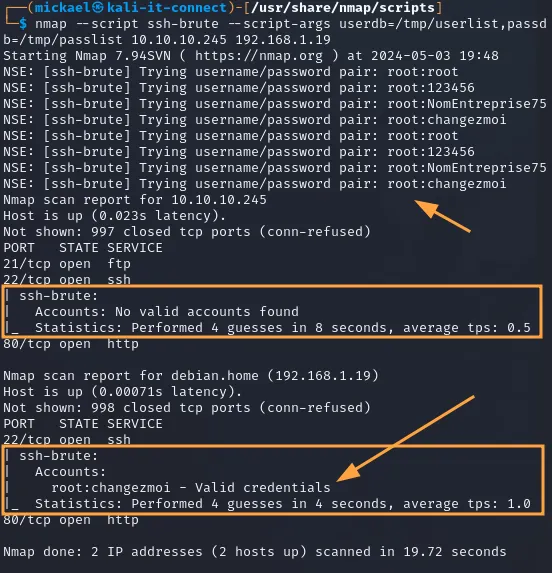


sSH bruteforce täitmise tulemus Nmap._ kaudu


Nagu näete, on interaktiivses väljundis (terminali väljundis) NSE skriptide poolt genereeritud teabe eesliide `NSE: [skripti nimi]`, mis teeb selle leidmise lihtsamaks. Nmap'i tulemuste tavapärase kuvamise raames on meil lihtsalt kokkuvõte, mis näitab, kas on avastatud nõrku identifikaatoreid (sealhulgas paroole, pidage meeles) või mitte.


Et minna sammu võrra kaugemale ja tuletada meelde, et seda kõike saab kasutada lisaks kõigile juba vaadeldud võimalustele, on siin käsk, mis avastab võrgu `10.10.10.0/24`, skaneerib 2000 kõige sagedasemat TCP-porti ja teostab anonüümse juurdepääsu otsingu FTP-teenustele ning toore jõu kampaania SSH-teenustele:


```
# Example of a complete command using multiple scripts
nmap --top-ports 2000 10.10.10.0/24 --script ftp-anon,ssh-brute --script-args userdb=/tmp/userlist,passdb=/tmp/passlist
```


See on vaid üks näide paljudest olemasolevatest skriptidest ja nende võimalustest. Kuid nüüd on meil parem ettekujutus sellest, kuidas NSE skriptidega hakkama saada, kas need nõuavad argumente ja kuidas neid argumente Nmapile edastada.


### V. Kokkuvõte


Selles jaotises oleme õppinud, kuidas kasutada Nmap'i NSE skripte erinevate ülesannete täitmiseks. Kutsun teid üles võtma aega, et tutvuda erinevate skriptide kategooriate ja skriptide endiga, et näha, kui palju teste nad suudavad automatiseerida.


Juba mitme sektsiooni jooksul oleme kogunud rohkem või vähem arenenud avastamis-, skaneerimis- ja loendamisvõimalusi. Nüüdseks peaksite olema teadlikud, et Nmap'i väljund ja tulemuste kuvamine hakkab muutuma üsna ulatuslikuks, mõnikord isegi meie terminali jaoks liiga laialivalguvaks. Järgmises peatükis õpime, kuidas seda väljundit hallata, eelkõige salvestades seda erinevates formaatides failidesse.


## 9 - Nmapi väljundandmete haldamine


### I. Esitlus


Selles jaotises vaatleme Nmap'i poolt toodetud väljundit ja eelkõige erinevaid võimalusi selle väljundi vormindamiseks. Me näeme, et Nmap saab toota erinevaid väljundformaate, mis vastavad erinevatele vajadustele, ja et ka see on üks selle tööriista suurtest tugevustest.


Vaikimisi pakub Nmap üksikasjalikku ülevaadet tehtud skaneerimiste ja testide tulemustest. See hõlmab skaneeritud hostid ja teenused, need, mis on tuvastatud ligipääsetavatena, avatud porte, nende staatust ja versiooni. Lisaks on terminaliväljundis saadaval ka NSE skriptide üksikasjad. See väljund võib siiski kiiresti muutuda mahukaks, isegi kui teave on selgelt vormistatud, mis võib raskendada täpse teabe leidmist tulemustest.


### II. Nmapi väljundformaatide omandamine


#### A. Salvesta skannimise tulemused tekstifaili


Asja lihtsustamiseks võimaldab [Nmap](https://www.it-connect.fr/cours/nmap-cartographie-reseau-scan-de-vulnerabilites/) väga lihtsalt salvestada oma väljundid tekstifaili. See võib olla kasulik arhiveerimiseks, võrdlemiseks teiste testidega, aga ka selle väljundi sirvimiseks spetsiaalsete tekstitöötlusvahendite või skriptikeeltega, nagu Sublime text, [PowerShell](https://www.it-connect.fr/cours-tutoriels/administration-systemes/scripting/powershell/), Python, grep, sed jne. Nmap'i standardväljundi salvestamiseks tekstifaili, saame kasutada valikut `-oN <filename>` ("N" sõnast "normal"):


```
# Save Nmap output to a file
nmap 10.10.10.0/24 -sV -oN nmap_scan_10.10.10.0_24.txt
```


Pole siis üllatus, sest Nmap kuvab oma tavalise standardväljundi meie terminalis, aga ka määratud failis.


#### B. generate Nmapi väljund lühendatud kujul


"Teksti" stiilis on olemas ka teine väljundformaat, mida inimene saab hõlpsasti tõlgendada: "greppable" formaat.


See vorming loodi selleks, et anda Nmapi väljundist "kokkuvõtlik" vaade, mis on struktureeritud nii, et hõlbustada selle töötlemist selliste tööriistadega nagu `grep`. Vaatame ühte näidet seda tüüpi väljundist:


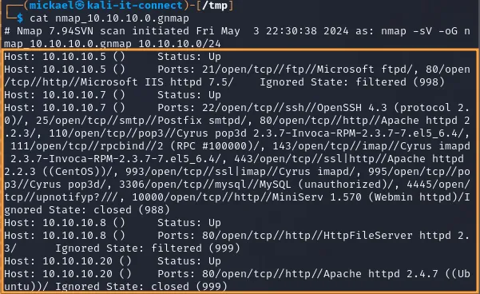


nmap võrgu skaneerimine ja väljund "greppable" formaadis._


Siinkohal olen teinud võrguotsingu, samuti portide skaneerimise ning tehnoloogiate ja versioonide analüüsi /24 võrgus, seejärel salvestasin väljundi faili "greppable" formaadis. Lõpuks saan faili, mis sisaldab 2 rida iga aktiivse host'i kohta:


- Esimene rida ütleb mulle, et selline ja selline peremees on _Up_;


- Teine rida ütleb mulle, milliseid porte on skaneeritud, nende staatus ning tehnoloogia- ja versiooniteave, mis on välja otsitud väga spetsiifilises formaadis: `<port>/<staatus/<protokoll>//<teenus>//<versioon>/,`


Selline vorming koos fikseeritud eraldajaga võimaldab kiiret töötlemist tekstitöötlusvahenditega, nagu `grep`, või skript- ja programmeerimiskeeltega. Näiteks järgmine käsk võimaldab mul hõlpsasti saada teavet host `10.10.10.10.5` kohta, kui Nmap on teinud tohutu skaneerimise, mille väljundit oleks raske sirvida:


```
# Filter by IP address in the Nmap "greppable" file
grep '10.10.10.5' nmap_10.10.10.0.gnmap
Host: 10.10.10.5 () Status: Up
Host: 10.10.10.5 () Ports: 21/open/tcp//ftp//Microsoft ftpd/, 80/open/tcp//http//Microsoft IIS httpd 7.5/ Ignored State: filtered (998)
```


Seevastu saan ka hõlpsasti loetleda kõik hostid, millel on avatud port 21, sest pordid ja IP on samal real:


```
# Filter by open port in the Nmap "greppable" file
grep '21/open' nmap_10.10.10.0.gnmap
Host: 10.10.10.5 () Ports: 21/open/tcp//ftp//Microsoft ftpd/, 80/open/tcp//http//Microsoft IIS httpd 7.5/ Ignored State: filtered (998)

Host: 10.10.10.152 () Ports: 21/open/tcp//ftp//Microsoft ftpd/, 80/open/tcp//http//Indy httpd 18.1.37.13946 (Paessler PRTG bandwidth monitor)/, 135/open/tcp//msrpc//Microsoft Windows RPC/, 139/open/tcp//netbios-ssn//Microsoft Windows netbios-ssn/, 445/open/tcp//microsoft-ds//Microsoft Windows Server 2008 R2 - 2012 microsoft-ds/ Ignored State: closed (995)
```


generate selliseks väljundiks peame kasutama valikut `-oG <failinimi>.gnmap` ("G" grep'is). Harjumuse järgi kasutan ma siin sellise faili jaoks laiendit `.gnmap`, kuid võite vabalt kasutada seda, mis teile meeldib:


```
# Save Nmap output to a file in "greppable" format
nmap 10.10.10.0/24 -sV -oG nmap_scan_10.10.10.0_24.gnmap
```


Seda formaati saab kasutada mitmel eesmärgil ja see on eriti kasulik kiireks skriptimiseks/sorteerimiseks. Sellest hoolimata kiputakse sellest loobuma formaadi kasuks, mida me vaatleme järgmisena.


märkus: alates Nmap 7.90 on greppable formaat `-oG` ametlikult kaotanud kehtivuse. Seda võib endiselt kasutada ühilduvuse tagamiseks. Seda võib endiselt kasutada ühilduvuse eesmärgil, kuid on soovitatav kasutada XML- või tavalist formaati igasuguse arenduse või automatiseeritud parsimise jaoks._


#### C. Nmap-väljundi XML-vorming


Viimane formaat, mida tasub selles õpetuses mainida, on XML. Erinevalt kahest eelmisest formaadist ei ole see formaat mõeldud mitte inimeste, vaid teiste tööriistade või skriptide lugemiseks.


XML (_eXtensible Markup Language_) on märgistuskeel, mida kasutatakse andmete salvestamiseks ja edastamiseks, pakkudes hierarhilist struktuuri kohandatud siltide abil.


Nmapis kasutatakse XML-vormingut generate üksikasjalike aruannete koostamiseks teostatud skaneerimiste kohta, sealhulgas teave tuvastatud hostide, portide ja haavatavuste kohta, samuti lisateave, mida Nmapi standardväljundis ei kuvata.


generate väljundfaili saamiseks XML-vormingus tuleb kasutada valikut `-oX` ("O" alates "XML"):


```
# Save Nmap output to a file in XML format
nmap 10.10.10.0/24 -sV -oX nmap_scan_10.10.10.0_24.xml
```


Tulemuseks on Nmap'i standardväljund teie terminalis, samuti XML-vormingus fail teie praeguses kataloogis.


Loomulikult ei ole XML-vorming mõeldud inimeste poolt lugemiseks ja tõlgendamiseks. Siiski, kui soovite teha skriptide koostamist või automatiseeritud analüüsi selle Nmapi väljundvormi kohta, peate siiski omama ettekujutust kasutatud siltidest ja struktuurist. Näiteks siin on osa Nmapi loodud XML-faili sisust, mis näitab 1 host'i skaneerimistulemusi:


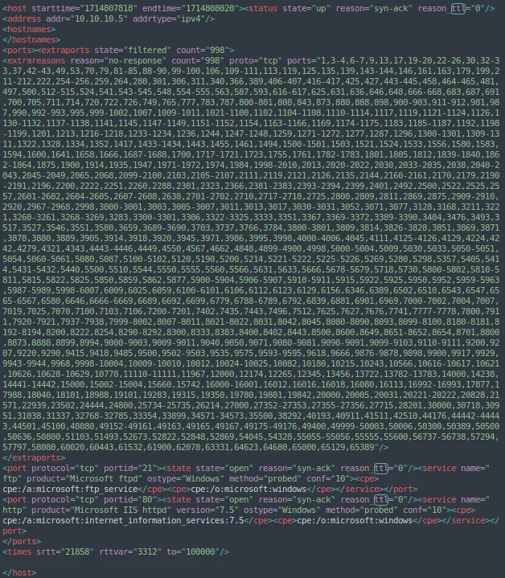


näide XML-kirje kohta 1 hostile Nmap-skaneerimise ajal


Siin on palju teavet ja meid huvitavad eriti kaks avatud sadamat:


```
<port protocol="tcp" portid="21"><state state="open" reason="syn-ack" reason_ttl="0"/><service name="ftp" product="Microsoft ftpd" ostype="Windows" method="probed" conf="10"><cpe>cpe:/a:microsoft:ftp_service</cpe><cpe>cpe:/o:microsoft:windows</cpe></service></port>
<port protocol="tcp" portid="80"><state state="open" reason="syn-ack" reason_ttl="0"/><service name="http" product="Microsoft IIS httpd" version="7.5" ostype="Windows" method="probed" conf="10"><cpe>cpe:/a:microsoft:internet_information_services:7.5</cpe><cpe>cpe:/o:microsoft:windows</cpe></service></port>
```


Me mõistame, et see formaat hõlbustab tulemuste automaatset analüüsimist, kuna iga teave on kenasti paigutatud spetsiaalsesse, nimelisse tagi või atribuuti. Eelkõige leiame teabe, millega me varem ei ole kokku puutunud: CPE.


```
cpe>cpe:/a:microsoft:internet_information_services:7.5</cpe><cpe>cpe:/o:microsoft:windows</cpe></service></port>
<cpe>cpe:/a:microsoft:internet_information_services:7.5</cpe><cpe>cpe:/o:microsoft:windows</cpe></service></port>
```


Me mainisime lühidalt CPE-d mooduli 2. osas ja see teave määratakse kindlaks vastete puhul versiooni tuvastamise käigus. Nmap kasutab oma teenuse, tehnoloogia ja versiooni tuvastamise mehhanisme, et leida seotud CPE.


See võimaldab meil seda teavet taaskasutada koos andmebaaside ja rakendustega, mis seda kasutavad. Pean silmas eelkõige NVD andmebaasi, mis viitab CVE-dele. Iga CVE puhul sisaldab see CPEd, mida haavatavus mõjutab. Siin on näide CVE kohta, mis puudutab `a:microsoft:internet_information_services:7.5` NVD andmebaasist:


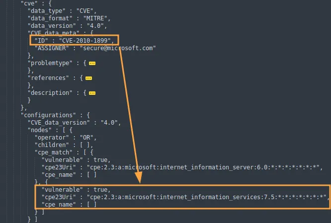


cPE esinemine CVE üksikasjades NVD andmebaasis


Nüüd on meil parem arusaam selle formaadi eelistest, mis pakub väga selget teabestruktuuri ja sisaldab kõiki Nmap'i poolt kogutud või töödeldud andmeid.


Refleksina salvestan ma süstemaatiliselt oma Nmapi skaneeringud kõigis kolmes formaadis korraga. Seda võimaldab valik `-oA <nimi>` ("A" nagu "All"), mis loob faili `<nimi>.nmap`, faili `<nimi>.xml` ja faili `<nimi>.gnmap`. Nii olen kindel, et ma ei jookse millestki välja, kui mul on vaja tulemusi uuesti üle vaadata.


Nende kolme formaadi abil peaks teil olema kõik vajalik Nmapi tulemuste salvestamiseks ja automatiseeritud töötlemiseks. Me kasutame XML-vormingut uuesti järgmises jaotises, kui vaatleme Nmapi kasutamist koos teiste turvatööriistadega.


#### III. HTML-aruande genereerimine Nmap-skaneerimisest


XML-vorming pakub palju võimalusi, mitte ainult seda, et selle põhjal saab luua HTML-vormingus aruande, mida on visuaalselt meeldivam sirvida.


XML-vormingus Nmap-faili muutmiseks veebileheks kasutame tööriista `xsltproc`, mille peame esmalt installima:


```
# Install the xsltproc tool
sudo apt install xsltproc
```


Kui see tööriist on paigaldatud, esitage sellele lihtsalt konverteeritav XML-fail ja genereeritava HTML-aruande nimi:


```
# Create an Nmap HTML report from XML
xsltproc nmap_10.10.10.0.xml -o "Nmap – rapport web 05-2024.html"

# Open the .html file with Firefox
firefox "Nmap – rapport web 05-2024.html"
```


Selle tulemusel on kogu meie skaneering kenasti struktureeritud, isegi mõned värvid ja klikitavad lingid sisukorras!


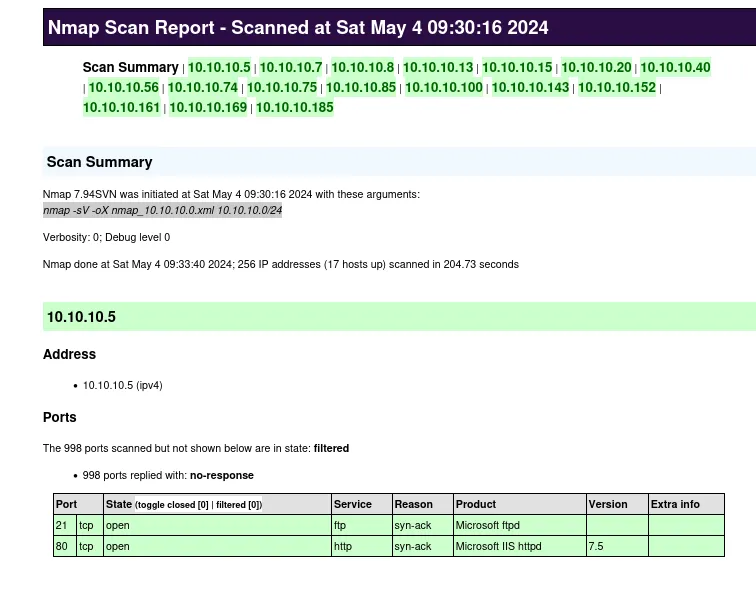


väljavõte Nmap skaneerimisaruandest HTML-formaadis, mille on genereerinud xsltproc._


Laias laastus sisaldab Nmapi poolt salvestatud XML-fail viide teisele XSL-vormingus failile:


```
<?xml-stylesheet href="/usr/share/nmap/nmap.xsl" type="text/xsl"?>
```


Seega on HTML-ks konverteerimine funktsioon, mida pakub ja hõlbustab Nmap, kusjuures `xsltproc` on levinud ja tunnustatud vahend selle ülesande täitmiseks (mis ei kuulu Nmapi tööriistakomplekti).


XSLT (_Extensible Stylesheet Language Transformations_) on XSL-i alamhulk, mis võimaldab XML-andmeid kuvada veebilehel ja "teisendada" paralleelselt XSL-i stiilidega loetavaks, vormindatud teabeks HTML-formaadis.


allikas: [helpx.adobe.com/](https://helpx.adobe.com/fr/dreamweaver/using/xml-xslt.html)_


Aruande teabe tase on samaväärne Nmapi XML-vorminguga ja kõrgem kui standardse terminali väljundis (_interaktiivne väljund_).


### IV. Nmap'i sõnalisuse taseme haldamine


Nüüd vaatame mõned võimalused Debugger Nmapi kasutamiseks või selle edenemise jälgimiseks.


Esimene valik, mida me peaksime mainima, on valik `-v`, mis suurendab Nmap'i verbaalsust. Siin on näide:


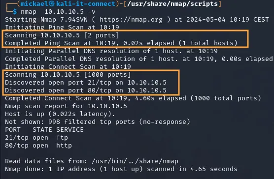


nmap'i üksikasjalik väljund, kasutades `-v`._ valikut


Paljusid hoste ja porte hõlmava skaneerimise korral on terminali väljundit raske kasutada, kuna kuvatakse palju teavet. Seetõttu tuleks seda valikut kasutada koos eelnevalt nähtud valikutega, mis võimaldavad salvestada Nmap'i standardväljundid faili. Informatsioon, mis on seotud sõnavara kasutamisega, ei kuulu sellesse väljundfaili. Nagu ülaltoodud näitest näha, võimaldab see verbosity jälgida Nmap'i tegevusi ja avastusi selgelt ja otseselt. Pikemate skaneerimiste puhul, kus andmete kuvamine võib olla aeglane, välditakse sellega Nmap'i praeguse tegevuse pimedaks jäämist ja teadmist, et asjad edenevad ja millises tempos. Et suurendada sõnalisust veel ühe taseme võrra, võite kasutada valikut `-vv`.


Nmap'i tegevuse jälgimiseks skaneerimise ajal saate kasutada valikut `--packet-trace`. Valikuga `-v` saame reaalajas logi kõigist Nmap'i poolt avastatud avatud portidest, samas kui selle valikuga saame logirea iga paketi kohta, mis on saadetud mõnda porti. See annab loomulikult väga laialivalguva väljundi, kuid võimaldab Nmap'i tegevuse üksikasjalikku jälgimist, siin on näide:


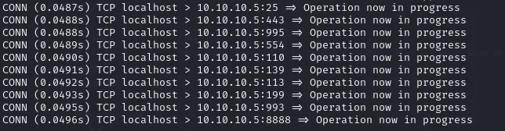


nmapi tegevuse üksikasjalik jälgimine `--packet-trace` kaudu._


Ka seda teavet ei salvestata Nmap'i koostatud väljundfaili, kui kasutatakse valikuid `-oN`, `-oG`, `-oX` või `-oA`.


Lõpuks pakub Nmap ka kahte debugimisvõimalust: `-d` ja `-dd`. Need valikud käituvad sarnaselt `-v` sõnalisuse valikuga, kuid lisavad täiendavat tehnilist teavet, näiteks tehniliste parameetrite kokkuvõtte skaneerimise alguses:


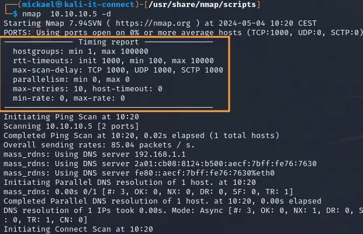


ajastusvalikud kuvatakse Nmapi silumisvaates


Järgnevalt vaatame, millised on "Ajastamise" valikud ja miks tasub neid teada.


Lõpuks, kui soovite saada ainult põhilist, sünteetilist ülevaadet Nmapi skaneerimise käigust, võite kasutada valikut `--stats-every 5s`. "5s" tähendab siin 5 sekundit ja seda saab muuta vastavalt oma vajadustele. See on sagedus, millega me saame Nmapilt tagasisidet selle edenemise kohta:


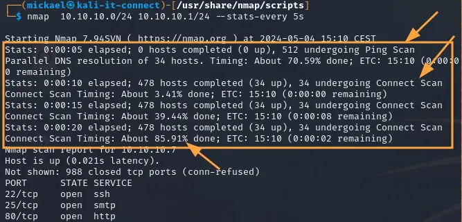


nmap'i valiku `--stats-every` poolt kuvatud teave


Täpsemalt saame protsentuaalselt teada, kui kaugele on jõutud, samuti saame teada, millises faasis see on: hostide leidmise faas [ping](https://www.it-connect.fr/le-ping-pour-les-debutants/) kaudu, avatud TCP-portide leidmise faas jne. Seda teavet saab ka terminali väljundist, kui vajutada skaneerimise ajal "Enter".


Nmap ei oska aga väga hästi hinnata, kui kaua ülesanne aega võtab, eelkõige seetõttu, et ta ei tea ette, kui palju hoste ja teenuseid ta peab skaneerima.


### V. Kokkuvõte


Selles jaotises vaatlesime mitmeid võimalusi Nmapi skannimise tulemuste salvestamiseks erinevates failivormingutes. See tuleb väga kasuks, sest realistlikus kontekstis võivad skaneerimistulemused hõlmata sadu või isegi tuhandeid ridu! Samuti nägime, kuidas suurendada Nmap'i sõnalisuse taset silumiseks või skaneerimise eduaruande saamiseks.


XML-vorming on eriti kasulik järgmises peatükis, kus vaatleme mõningaid tööriistu, mis saavad töötada Nmapi tulemustega.


## 10 - Nmapi kasutamine koos teiste turvatööriistadega


### I. Esitlus


Selles jaotises vaatleme mõningaid klassikalisi Nmapi kasutusvõimalusi koos teiste tasuta ja avatud lähtekoodiga turvatööriistadega. Eelkõige kasutame eelnevates osades õpitut, et veelgi suurendada Nmap'i võimsust ja tõhusust.


Võimalus salvestada Nmapi skaneerimistulemusi XML-vormingus muudab andmed ühilduvaks paljude teiste tööriistadega. Kuna peaaegu kõigis programmeerimis- ja skriptimiskeeltes on tänapäeval olemas XML-i analüüsimiseks võimelised raamatukogud, muudab see nende andmete töötlemise palju lihtsamaks. Mitmed tööriistad, eriti need, mis on suunatud ründavale turvalisusele, omavad funktsioone Nmap'i poolt genereeritud XML-vormingu töötlemiseks. Vaatame lähemalt.


Ma mainin mõned ründavad vahendid, ilma et kirjeldaksin üksikasjalikult, kuidas neid kasutatakse või kuidas nad töötavad. Eeldan, et lugeja on nende põhikasutusega tuttav ja et nad on juba töökorras. See osa pakub erilist huvi [küberturvalisuse] spetsialistidele (https://www.it-connect.fr/cours-tutoriels/securite-informatique/), koolitusel olevatele inimestele või neile, kes on otsustanud teemasse süveneda.


### II. Nmapi tulemuste importimine Metasploiti


Esimene vahend, mida me vaatame Nmapi andmete taaskasutamiseks ründava turvalisuse ja haavatavuse uurimisel, on Metasploit.


Metasploit on ekspluateerimise ja ründamise raamistik. See on tasuta lahendus ja tunnustatud tööriist, mis sisaldab suurt hulka Ruby või Pythonis kirjutatud mooduleid. Need võimaldavad kasutada haavatavusi, teostada rünnakuid, genereerida tagauksi, hallata tagasipöördumisi (C&C ehk kommunikatsiooni- ja kontrollifunktsioonid) ja kõike ühtselt kasutada.


Eelkõige võib see tuntud ja laialdaselt kasutatav operatsioonisüsteem töötada koos postgreSQL [andmebaasiga](https://www.it-connect.fr/cours-tutoriels/administration-systemes/stockage/bdd/), kus on salvestatud hostid, pordid, teenused, autentimisandmed ja muud andmed.


- Ametlik Metasploiti dokumentatsioon: [https://docs.metasploit.com/](https://docs.metasploit.com/)


Siinkohal tulevad mängu Nmap ja selle väljund, sest Nmapi väljundi XML-vormingut saab hõlpsasti importida Metasploiti andmebaasi, et täita selle andmebaas hostide ja teenuste kohta, mida saab seejärel kiiresti määrata selle või teise rünnaku sihtmärkideks.


Kui ma olen oma Metasploiti interaktiivses kestas, alustan ma tööruumi loomisega, mis on minu päevakeskkonnale omane ruum:


```
# Create a Metasploit workspace
msf6 > workspace -a SI_siege
```


Kui minu tööruum on loodud, peame kinnitama, et side andmebaasiga toimib:


```
# Retrieve the database status
msf6 > db_status
[*] Connected to msf. Connection type: postgresql.
```


Lõpuks saame kasutada Metasploiti käsku `db_import`, et importida meie Nmap skaneerimine XML-vormingus:


```
# Import a Nmap XML file into the database
msf6> db_import /tmp/nmap_10.10.10.0.xml
```


Siin on kõigi nende käskude täitmise tulemus:


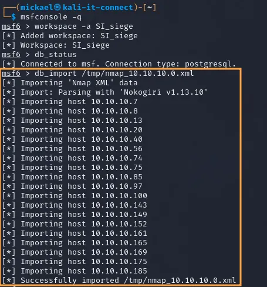


importida Nmap skaneerimine XML formaadis Metasploit andmebaasi


Siin näete, et iga host on imporditud koos oma teenustega. Neid andmeid saab seejärel kuvada käsuga `services` või `services -p <port>` konkreetse teenuse jaoks:


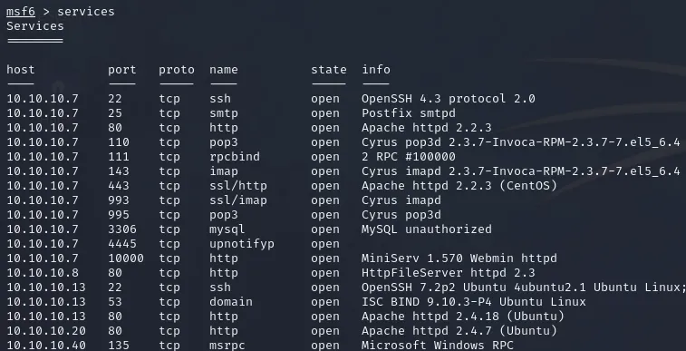


xML-failist Metasploit andmebaasi imporditud teenuste nimekiri


Lõpuks saame neid andmeid kiiresti ja lihtsalt moodulis uuesti kasutada tänu valikule `-R`, mis "teisendab" teenuste nimekirja, mis on saadud sisendiks direktiivile `RHOSTS`, mida kasutatakse teostatava rünnaku sihtmärkide määramiseks. Siin on näide `ssh_login` mooduliga, mis võimaldab teostada [SSH] teenuste (https://www.it-connect.fr/cours/comprendre-et-maitriser-ssh/) brute force rünnakut:


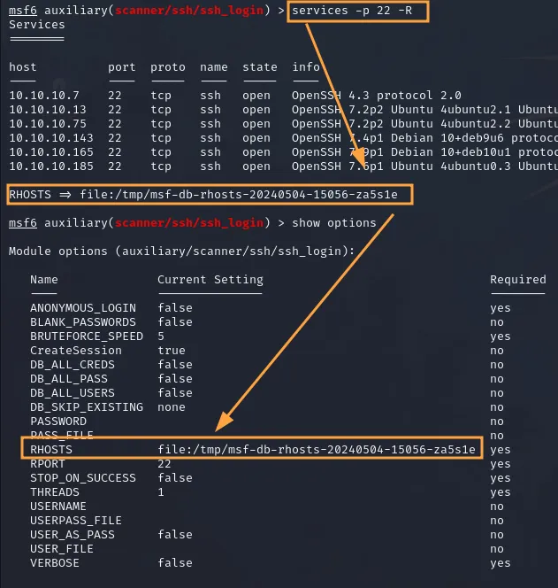


kasutage valikut `services -R`, et importida rünnaku sihtmärgiks määratud teenused


See on vaid väike näide sellest, mida saab Metasploitis Nmapi andmetega teha, kuid see annab teile väikese ettekujutuse sellest, kui kiiresti ja lihtsalt saab seda teavet uuesti kasutada tungimistesti, haavatavuse skaneerimise või küberrünnaku osana. Samuti tasub mainida, et Nmap'i saab käivitada otse Metasploit'ist, et importida tulemused andmebaasi (käsk `db_nmap`), veel üks huvitav teema, mida käsitleda!


### III. Nmapi kasutamine koos Aquatone'i veebiskanneriga


Teine tööriist, mida ma tahaksin selles Nmapi tulemuste taaskasutamise osas tutvustada, on Aquatone.


Aquatone on veebiskanner, mis on mõeldud veebirakenduste tõhusaks uurimiseks võrgus. See pakub täiustatud funktsioone veebiteenuste avastamiseks, alamdomeenide tuvastamiseks, portide analüüsiks ja veebirakenduste sõrmejälgede tuvastamiseks. Kõik on esitatud selgelt ja ülevaatlikult HTML-, JSON- ja tekstiaruannetes, et veebiturvalisuse analüüsimine oleks lihtne.


Sarnaselt Metasploitiga saab Aquatone otse töödelda Nmapi XML-vormingut ja kasutada seda skaneerimise sihtmärgina. Eelkõige saab ta kõigist Nmapi aruandes sisalduvatest andmetest eraldada ainult huvipakkuvad hostid ja teenused (veebiteenused).


- Tööriista link: [Github - Michenriksen/aquatone](https://github.com/michenriksen/aquatone)


Nmapi XML-väljundi kasutamiseks Aquatone'iga tuleb lihtsalt saata XML-faili toru kaudu, mida Aquatone tarbib. Siin on näide:


```
# Send the Nmap XML output to Aquatone
cat /tmp/nmap_10.10.10.0.xml | ./aquatone -nmap
```


Kui tavaliselt teostab Aquatone veebiteenuste leidmiseks hostide pordiotsingu, siis siinkohal tugineb ta ainult Nmapi tulemustele, mis on selle operatsiooni juba teinud, säästes seega aega:


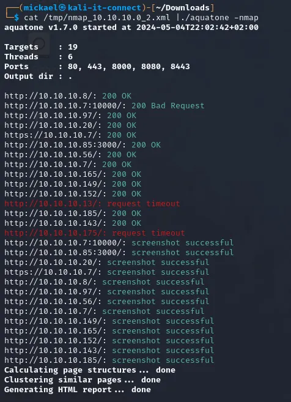


kasutades Nmapi tulemusi XML formaadis `aquatone`._


Teie teavitamiseks on siin väljavõte Aquatone'i koostatud aruandest:


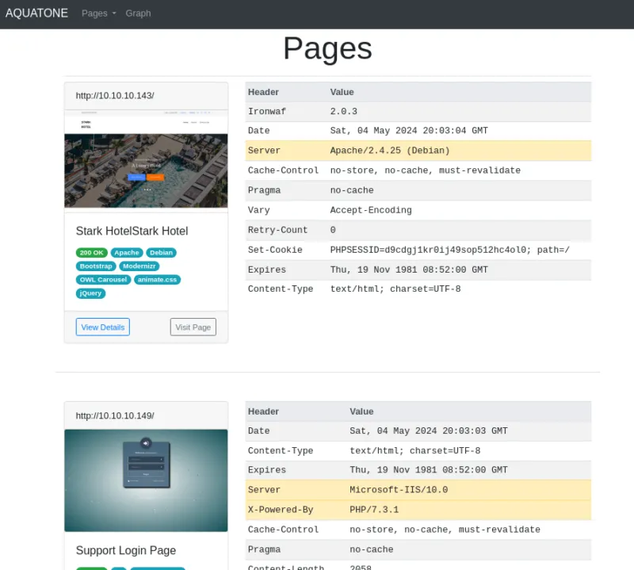


näide "akvatooni" aruande kohta


Mina isiklikult kasutan Aquatone'i sageli selleks, et saada kiire ülevaade võrgus olevate veebisaitide tüüpidest, eelkõige tänu selle ekraanipildifunktsioonile.


Ka siinkohal säästab täielik Nmapi aruanne XML-vormingus aega ja võimaldab seda hõlpsasti teises tööriistas taaskasutada.


### IV. Kokkuvõte


Need kaks näidet näitavad selgelt, et Nmap'i XML-vorming lihtsustab teiste tööriistade jaoks tulemuste kasutamist, kuna see on struktureeritud ja hõlpsasti kasutatav andmeformaat. Neid tulemusi on võimalik töödelda ka paljude teiste vahenditega, näiteks automaatsete aruandlusvahenditega, graafiliste esitustega või keerukamate, omaette haavatavuse skanneritega.


Loomulikult võite arendada ka oma skripte ja tööriistu Pythonis, [PowerShellis](https://www.it-connect.fr/cours-tutoriels/administration-systemes/scripting/powershell/) või mis tahes muus keeles, millel on XML-parsimisraamatukogu, et Nmapi tulemuste andmeid vastavalt vajadusele muuta ja taaskasutada.


See lõik toob meid Nmapi edasijõudnute kasutamise, eelkõige NSE skriptide abil haavatavuse skaneerimise õpetusmooduli lõppu.


Õpetuse järgmises osas keskendutakse muu hulgas mõnele täiendavale, tehnilisemale parimale praktikale ja näpunäidetele konkreetsete skaneerimiste kohta, mida Nmap saab teostada. Samuti vaatleme skaneerimise jõudluse optimeerimise võimalusi, mis on eriti kasulikud suurte võrkude skaneerimisel.


## 11 - Võrgu skaneerimise jõudluse parandamine


### I. Esitlus


Selles peatükis õpime, kuidas optimeerida Nmapiga tehtavate võrgu skaneerimiste kiirust, kasutades selleks erinevaid spetsiifilisi valikuid. Eelkõige saame rohkem teada Nmapi sisemisest toimimisest, alates _timeout_ juhtimisest kuni tööriista eelkinnitatud konfiguratsioonideni.


Nüüd, kui me oleme Nmap'i funktsioone põhjalikult tutvunud, tutvume selle koletise ja selle võimsusega. Kui olete seda tööriista kunagi kasutanud suurtes võrkudes, siis olete ilmselt märganud, et mõned skaneerimised võivad hoolimata tööriista võimsusest võtta kaua aega. Ja põhjusega: lihtne käsk `nmap`, millel on mõned valikud, võib generate miljonid paketid, mis on suunatud sadadele tuhandetele potentsiaalsetele süsteemidele ja teenustele.


Veelgi enam, mõned võrguseadmete konfiguratsioonid võivad tahtlikult kehtestada aeglasema kiiruse (pakettide arv sekundis), mis võib teie pakette tagasi lükata või keelata teie IP Address turvalisuse huvides.


Sõltuvalt kontekstist võib tasuda proovida seda kõike optimeerida, nagu me selles peatükis näeme.


Igal juhul saate Nmap debug'i abil (eelmises peatükis nähtud valik `-d`) kontrollida parameetrite vaikeväärtusi, mida me vaatleme, samuti seda, kas kasutatavaid valikuid on õigesti arvesse võetud:


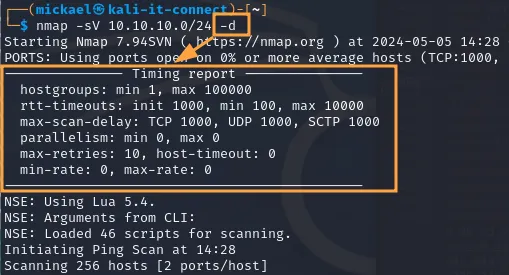


vaadata ajastusvalikuid Nmapi valiku `-d` kaudu._


### II. Nmap skaneerimise kiiruse haldamine


#### A. Paralleelsuse haldamine


Vaikimisi kasutab Nmap oma skaneerimiste optimeerimiseks paralleelsust ja kõiki kasutatavaid parameetreid saab muuta erinevate valikute kaudu. Juhtumeid, kus neid parameetreid on tegelikult vaja muuta, on siiski üsna harva, seega ei käsitle me neid käesolevas õpetuses üksikasjalikult:


- `----min-hostgroup/max-hostgroup <size>`: paralleelsete hostide skaneerimisrühmade suurus.


- `--min-parallelism/max-parallelism <numprobes>`: Probes'i paralleelsus.


- `--scan-delay/--max-scan-delay <time>`: reguleerib sondide vahelist viivitust.


Lihtsalt teadke, et need on olemas ja neid saab kasutada.


#### B. Pakettide arvu haldamine sekundis


Vaikimisi kohandab Nmap ise saadetavate pakettide arvu sekundis vastavalt võrgu reageeringule. Kuid seda seadistust on võimalik sundida, määrates kõrge ja/või minimaalse väärtuse, mida tuleb järgida pakettide arvu osas sekundis. See seadistus tehakse valikuid `--min-rate <number>` ja `--max-rate <number>` kasutades, kus `number` tähistab pakettide arvu sekundis. Näide:


```
# Limit the scan speed to 300 packets per second
nmap -sV 10.10.10.0/24 --max-rate 300
```


Need valikud võimaldavad teil kohandada skannimise kiirust vastavalt teie konkreetsetele vajadustele, kas protsessi kiirendamiseks või kasutatava ribalaiuse piiramiseks. Viimane juhtum (skaneerimiskiiruse piiramine) on see, mis teid kõige tõenäolisemalt nende valikute juurde viib, eriti kui teil tekib Nmapi kasutamisel võrgu viivitus (mis on üsna haruldane).


### III. Ühenduse tõrgetega ja ajakatkestustega tegelemine


Teine parameeter, millega me saame Nmapi skaneerimise kiiruse optimeerimiseks (või suurema täpsuse tagamiseks) mängida, puudutab _timeout_ ja _retry_.


_timeoutide_ puhul on see **vastuse puudumise aeg**, mille möödudes Nmap lõpetab vastuse ootamise ja loeb teenuse või hosti kättesaamatuks. _retry_ puhul on see **korduvate katsete arv**, mida Nmap teeb enne edasiliikumist.


Sarnaselt paralleelsusega saab _timeout_ ja _retry_ juhtimist rakendada ka hostide või teenuste leidmise etappide puhul:


- `----min-rtt-timeout/max-rtt-timeout/initial-rtt-timeout <time>`: määrab Exchange ringlusaja. Ka see parameeter arvutatakse ja kohandatakse tegelikult skaneerimise ajal. On ebatõenäoline, et teil on vaja seda kasutada, kuna Nmap arvutab selle aja lennult vastavalt võrgu reaktsioonile.


- `--max-retries <number>`: piirab paketi korduvkatsete arvu pordi skaneerimise ajal. Vaikimisi võib Nmap ühe teenuse puhul teha kuni 10 korduskatset, eriti kui ta leiab võrgu tasandil viivitusi või kadusid, kuid enamasti tehakse ainult üks korduskatse.


- `--host-timeout <time>`: määrab maksimaalse aja, mille Nmap veedab hostil kõigi oma operatsioonide, sealhulgas pordi skaneerimise, teenuste tuvastamise ja muude selle hostiga seotud operatsioonide jaoks. Kui see ajavahemik on ületatud ilma vastuse või **toimingute lõpetamiseta**, jätab Nmap selle host'i ilma seda puudutavaid tulemusi näitamata ja läheb edasi järgmise host'i juurde. See võimaldab teil kontrollida maksimaalset aega, mille Nmap antud hostile kulutab, vältides takerdumist vastumeelsetele hostidele ja optimeerides üldist skaneerimisaega.


Oma igapäevatöös kasutan ma skaneerimise optimeerimiseks valikuid `--max-retries` ja `--host-timeout`:


```
# Optimization of a scan with 0 additional attempts and a timeout of 15 minutes per host
nmap -sV -sC 10.10.10.0/24 --max-retries 0 --host-timeout 15m
```


Need parameetrid pakuvad täiendavat paindlikkust skannimiskäitumise kohandamiseks vastavalt konkreetsetele vajadustele ja võrgutingimustele. Siiski peate olema teadlik nende mõjust skaneeritavate hostide koormusele ja võimalikule täpsuse kaotusele.


### IV. Ettevalmistatud konfiguratsioonide kasutamine


Erinevaid võimalusi, mida me selles peatükis nägime, saab kasutada eraldi või osana Nmapi pakutavatest valmis konfiguratsioonidest. Valik, mis võimaldab neid _malle_ (konfiguratsioonimalle) kasutada, on `-T <number>` või `-T <nimi>`. Kasutatavaid _template_-tasandeid on 5:


```
-T<0-5>: Set timing template (higher is faster)
```


Nmap kasutab vaikimisi _template_ 3 (_normal_), mis on üldiselt piisav.


Omalt poolt tegutsen üldiselt kontekstides, kus pean olema üsna kiire (jäädes samal ajal võimalikult täielikuks) ja kasutan sageli valikut "T4".


```
# Use Nmap for a network scan with preset T4 (with debug)
nmap 10.10.10.0/24 -sV --top-ports 2000 -T4 -d
```


Siin on see, mida selle skaneerimise kohta käivitatud andmed näitavad meile:


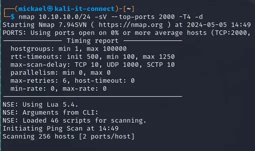


"T4" seadistuse kasutamine Nmap skaneerimise ajal


### V. Kokkuvõte


Selles peatükis vaatlesime erinevaid tehnikaid ja võimalusi, mida saate kasutada Nmap'i võimsuse, agressiivsuse ja jõudluse haldamiseks. Need valikud on eriti kasulikud suurte võrkude skaneerimisel ja harvemini varjatuse eesmärgil.


Järgmises peatükis vaatleme mõningaid parimaid tavasid Nmapi kasutamiseks ja selle turvalisuse tagamiseks.


## 12 - Andmete turvalisus ja konfidentsiaalsus Nmapi kasutamisel


### I. Esitlus


Selles peatükis vaatleme mitmeid häid tavasid, mida tuleb järgida seoses Nmap'i poolt toodetud, töödeldud ja salvestatud andmete turvalisuse ja eelkõige konfidentsiaalsusega.


Nmapi kasutamist infosüsteemis võib kiiresti liigitada ründavaks tegevuseks. Sellest tulenevalt tuleb võtta mitmeid ettevaatusabinõusid, et tegutseda õiguslikus raamistikus, tagades samal ajal sihtmärkide, kogutud andmete ja skaneerimiseks kasutatava süsteemi turvalisuse.


### II. Asjakohaste lubade saamine


Enne võrgu või süsteemi skaneerimist veenduge, et olete saanud asjakohased volitused. Süsteemide skaneerimine haavatavuste (NSE-skriptid) otsimiseks ilma loata võib olla ebaseaduslik ja sellel võivad olla õiguslikud tagajärjed, eriti kui infosüsteemide turvalisus ei kuulu teie ametlike ülesannete hulka.


- Meeldetuletuseks: [Karistusseadustik: III peatükk: Rünnakud automatiseeritud andmetöötlussüsteemide vastu](https://www.legifrance.gouv.fr/codes/article_lc/LEGIARTI000030939438/)


### III. Tundlike andmete kaitsmine


Nmap'i saadud tulemusi võib pidada tundlikuks, eriti kui need sisaldavad teavet infosüsteemi nõrkade kohtade kohta, mida ründaja võib ära kasutada. Aga ka siis, kui need puudutavad süsteeme, mis ei ole kõigile kättesaadavad (nt tundlikud, tööstuslikud, tervishoiu- või [varundus-] infosüsteemid (https://www.it-connect.fr/cours-tutoriels/administration-systemes/autres/sauvegarde/)).


Samuti nägime, et sõltuvalt kasutatavatest NSE skriptidest võivad NSE skaneerimistulemused [Nmap](https://www.it-connect.fr/cours/nmap-cartographie-reseau-scan-de-vulnerabilites/) sisaldada ka identifikaatoreid.


Seega on pahatahtlikul isikul, kellel õnnestub pääseda ligi nendele skaneerimistulemustele, käepärast infosüsteemi kaart ja hulgaliselt tehnilist teavet, ilma et ta oleks ise neid toiminguid sooritanud, riskides seejuures avastamisega.


Seetõttu on oluline olla ettevaatlik, et Nmapi kasutamisel ei kogutaks ega salvestataks ebasobivalt tundlikku teavet, sealhulgas, kuid mitte ainult, järgmist:


- Väljundandmete krüpteerimine: kui teil on vaja oma Nmap-skaneerimise tulemusi salvestada või edastada, krüpteerige need kindlasti, et kaitsta andmete konfidentsiaalsust. See hoiab ära tundliku teabe loata pealtkuulamise. Ideaalis tuleks andmed krüpteerida kohe, kui need lahkuvad skaneerimiseks kasutatud süsteemist (tugeva parooliga krüpteeritud ZIP-arhiiv on väga hea algus).


- Seadistage juurdepääsukontroll: veenduge, et ainult volitatud isikutel on juurdepääs Nmap-skaneerimise tulemustele, kus neid säilitatakse. Seadistage asjakohased juurdepääsukontrollid, et kaitsta tundlikku teavet volitamata juurdepääsu eest.


- Valvsus andmete käitlemisel: andmete edastamisel, kopeerimisel või skaneeritud andmete töötlemisel veenduge, et hoiate andmete turvalisust rangelt kontrolli all. See tähendab: ärge jätke neid Internetis ühendatud tööjaama kataloogi `Download`, ärge laske neid läbi oma sisemise HTTP-faili Exchange rakenduse, ärge jätke oma Notepad'i avatud ilma tööjaama lukustamata lõunapausi ajal jne.


### IV. Agressiivsete skaneerimiste haldamine


Nagu me oleme kogu selle õpetuse jooksul näinud, võib Nmap olla võrgu tasandil väga üksikasjalik. Samuti võib ta saata pakette, mis ei ole korralikult vormistatud ja mis ei järgi rangelt protokolli struktuuri tema poolt genereeritud võrguraamides ja -pakettides. Kõik need tegevused võivad mõjutada teatud süsteeme ja teenuseid, mõnikord kuni süsteemi ja võrguressursside talitlushäirete või küllastumiseni.


Selleks, et vältida vahejuhtumeid, tuleb teil omandada Nmap'i käitumine ja osata seda kohandada vastavalt kontekstile, milles seda kasutatakse, kasutades selleks erinevaid võimalusi, mida selles õpetuses käsitletakse. Me ei kasuta Nmap'i tingimata samamoodi tööstuslikku [riistvara](https://www.it-connect.fr/actualites/actu-materiel/) sisaldavas infosüsteemis kui kohaliku tulemüüriga kaitstud Windows-süsteemidest koosnevas kasutajavõrgus või võrgu tuumikus.


Loodetavasti on selle õpetuse erinevad õppetunnid õpetanud teile, kuidas Nmapi käitumist omandada ja analüüsida, kuid parim viis õppida on teha. Nii et veenduge, et olete tuttav Nmapi võimalustega, mida te kasutate.


### V. Skaneerimissüsteemi kaitsmine


Esimeses peatükis nägime, et enamasti tuleb Nmap'i käivitada juurkasutaja või kohaliku administraatorina. See on tingitud sellest, et ta teostab võrguoperatsioone, mõnikord üsna madalal tasemel, läbi võrguraamatukogude, mis nõuavad süsteemi stabiilsuse või teiste rakenduste konfidentsiaalsuse seisukohalt kõrgeid ja riskantseid õigusi.


Selle tulemusena võib Nmapi pidada süsteemi, kuhu see on paigaldatud, tundlikuks komponendiks. Kasutage kindlasti Nmapi uusimat versiooni, sest vanemad versioonid võivad sisaldada teadaolevaid turvaauke. Kasutades ajakohastatud versiooni, saate minimeerida tööriista kasutamisega seotud riske.


Kui olete otsustanud kasutada Nmapi mitte sessiooni kaudu `root'ina, vaid andes privilegeeritud kasutajale konkreetsed õigused, et tal oleks kõik vajalik Nmapi kasutamiseks (`sudo` või _capabilities_), siis olge teadlik, et Nmapi saab kasutada täieliku privileegide tõstmise osana:


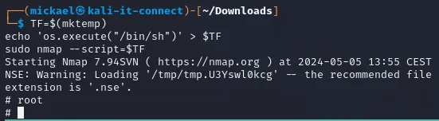


nmapi õiguste tõstmine `sudo` kaudu._


Siinkohal kasutan ma Nmap käsku `sudo` kaudu, kuid see võimaldab mul saada interaktiivse shell'i `root'ina süsteemi, mis ei olnud algne eesmärk.


Samuti on äärmiselt ebasoovitav paigaldada Nmapi süsteemidesse, mis ei ole mõeldud võrgu skaneerimiseks. Pean silmas eelkõige servereid või tööjaamu. Ühest küljest lisaks see potentsiaalse vektori privileegide tõstmiseks, kuid eelkõige annaks see ründajale vaevata ligipääsu ründevahendile.


Lõpuks tuleb laiemalt tagada skaneerimiseks kasutatava süsteemi turvalisus, et see ei muutuks ise sissetungi või infolekke vektoriks. Süsteemi administraatorina on parem kasutada spetsiaalset süsteemi, ideaalis piiratud elueaga, kui oma tööjaama.


### VI. Kokkuvõte


Kokkuvõtteks veenduge, et olete Nmapi korralikult omandanud enne selle kasutamist reaalsetes või tootmistingimustes, ning olge selle tulemuste töötlemisel ja haldamisel tähelepanelik. Oleks kahjulik tekitada kahju, lekitada andmeid või hõlbustada kompromissi, kui esialgne lähenemine on suunatud teie ettevõtte turvalisuse parandamisele.


## 13 - Pordi skaneerimine TCP kaudu: SYN, Connect ja FIN


### I. Esitlus


Selles ja järgmises peatükis vaatleme lähemalt erinevaid Nmapis saadaval olevaid TCP-skaneerimise tüüpe, alustades kõige sagedamini kasutatavatest: SYN-, Connect- ja FIN-skaneerimine.


Nagu olete ehk märganud, pakub Nmap TCP-skaneerimiseks mitmeid võimalusi:


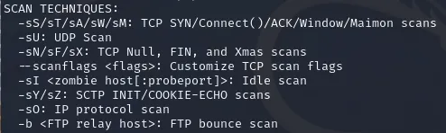


nmap._ saadaval olevad skaneerimistehnikad


Siinkohal tahame selgitada mõningaid neist meetoditest, et aidata teil mõista nende erinevusi, eeliseid ja piiranguid. Näete, et sõltuvalt kontekstist või sellest, mida soovite teada saada, on parem valida üks või teine võimalus.


### II. TCP SYN skaneerimine või "Half Open scan" (pooleldi avatud skaneerimine)


Esimene TCP-skaneerimise tüüp, mida me vaatleme, on "TCP SYN Scan", mida tuntakse ka kui "Half Open Scan". Kui mäletate võrgu skaneerimisi, mida me tegime pärast meie esimesi portide skaneerimisi, siis seda tüüpi skaneerimist kasutab [Nmap](https://www.it-connect.fr/cours/nmap-cartographie-reseau-scan-de-vulnerabilites/) vaikimisi, kui seda käivitatakse root-õigustega.


Tõlge aitab teil mõista, kuidas see skaneerimine toimib. Tegelikult saadetakse TCP SYN skaneerimise käigus igale sihtportile TCP SYN-pakett, mis on esimene pakett, mille klient (see, kes taotleb ühenduse loomist) saadab kuulsa _Kolmeviisilise käepigistuse_ TCP osana. Tavaliselt, kui port on sihtserveril avatud ja selle taga töötab teenus, saadab server tagasi TCP SYN/ACK-paketi, et kinnitada kliendi SYN ja initsialiseerida TCP-ühendus. See vastus on TCP-paketi kujul, mille SYN- ja ACK-lipud on seatud 1, mis võimaldab meil kinnitada, et port on avatud ja viib teenuse juurde.


Teisest küljest, kui port on suletud, saadab server meile `TCP` paketi, mille RST ja ACK lipukesed on seatud 1, et lõpetada ühenduse taotlus, nii et me teame, et selle pordi taga ei tundu olevat aktiivne teenus:


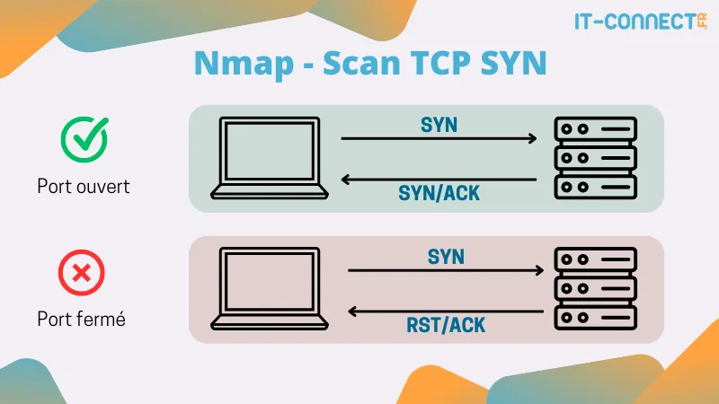


tCP SYN Scan käitumisdiagramm avatud ja suletud portide puhul


Et saada konkreetsemat ülevaadet `TCP SYN Scan`, teostasin TCP/80 pordi skaneerimise hostile, millel oli aktiivne veebiserver selles pordis. Tehes Wiresharkiga võrgu skaneerimise, näeme järgmist voogu (skaneerimise allikas: `10.10.14.84`):


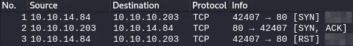


tCP SYN skaneerimise ajal avatud pordi võrgu kaaperdamine


Esimesel real näeme, et skaneerimisallikas saadab TCP-paketi hostile `10.10.10.203` pordil TCP/80. Selles TCP-paketis on SYN-märgis seatud 1, mis näitab, et tegemist on TCP-ühenduse initsialiseerimise taotlusega.


Seejärel näeme teisel real, et sihtmärk vastab `TCP SYN/ACK`, mis tähendab, et ta nõustub ühenduse loomisega ja seega voogude vastuvõtmisega TCP/80 pordil. Seega võime järeldada, et port TCP/80 on avatud ja et skaneeritud serveril on olemas veebiserver.


Seejärel saadab meie vastuvõtja ühenduse sulgemiseks RST-paketi tagasi, mis võimaldab skaneeritaval vastuvõtjal mitte säilitada avatud TCP-ühendust vastuse ootamisel. Paljude portide skaneerimise korral võib TCP-ühenduste sulgemata jätmine viia teenuse eitamiseni, küllastades serveri poolt vastamist ootavate ühenduste arvu (vt [Wikipedia - Syn flood](https://fr.wikipedia.org/wiki/SYN_flood))


Wiresharkis saate näha TCP-lippide staatust iga läbiviidava testi puhul. See näitab, kas pakett on SYN-, SYN/ACK-, ACK- jne. pakett:


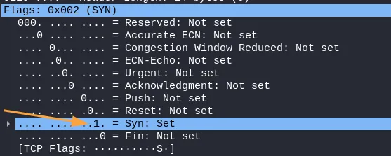


vaadata paketi TCP lipud Wiresharkis (TCP SYN siin)


Vastupidi, ma tegin sama testi kahe masina vahel, kuid seekord skaneerisin TCP/81 porti, kus ükski teenus ei ole aktiivne (skaneerimise allikas: `10.10.14.84`):


võrgu kaaperdamine TCP SYN skaneerimise ajal suletud pordi jaoks


Kui port ei ole avatud, saadab skaneeritav host vastuseks minu "TCP SYN"-ile "TCP RST/ACK".


Nagu mainitud, on Nmapi käivitamisel privilegeeritud terminalist vaikimisi režiimiks TCP SYN Scan, mida saab sundida valikuga `-sS` (`scan SYN`):


```
# Execution of a TCP Syn Scan_
nmap -sS 192.168.1.15
```


Kiiruse tõttu on kõige sagedamini kasutatav skaneerimine "TCP SYN Scan". Teisest küljest võib kliendi suutmatus lõpetada _Kolmepoolset käepigistust_ (st mitte saata ACK pärast serveri SYN/ACKi) tunduda kahtlane, kui seda täheldatakse liiga palju kordi serveris või samast allikast võrgus. Tõepoolest, kliendi tavapärane käitumine pärast TCP SYN/ACK paketi saamist vastuseks TCP SYNile on saata "kinnitust" (ACK) ja seejärel alustada Exchange.


Sellegipoolest pakub see veidi kiiremat skaneerimist, kuna ei viitsi iga positiivse vastuse korral ACK-d saata. SYN Scan'i eeliseks on kiirus, kuna iga skaneeritava pordi kohta saadetakse ainult üks pakett, kuid selle arvelt on suurem tõenäosus, et see avastatakse.


Lisaks sellele suudab TCP SYN skaneerimine tuvastada, kas port on tulemüüri poolt filtreeritud (kaitstud). Tegelikult saab sihtarvuti ees asuva tulemüüri tuvastada selle järgi, kuidas see käitub, kui ta saab TCP SYN-paketi pordile, mida ta peaks kaitsma. Ta lihtsalt ei vasta. Kuid nagu me nägime, mõlemal juhul (avatud või suletud port) tuleb hostilt vastus. See kolmas käitumine paljastab tulemüüri olemasolu skaneeritava host'i ja skaneerimist teostava masina vahel. Siin on tulemus, mille Nmap võib tagastada, kui skaneeritud port on tulemüüri poolt filtreeritud:


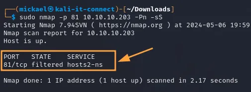


nmap ekraanil filtreeritud pordi skaneerimisel


Kui me teostame skaneerimise ajal võrgukaardistamise, näeme tegelikult, et mingit vastust ei anta:


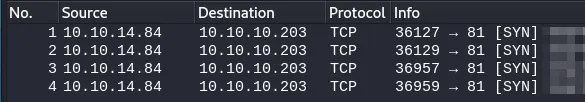


võrgu kaaperdamine TCP SYN skaneerimise ajal tulemüüri poolt filtreeritud pordi jaoks


Erinevus suletud ja filtreeritud pordi vahel on järgmine: filtreeritud port on tulemüüriga kaitstud port, samas kui suletud port on port, kus ei tööta ühtegi teenust ja mis seetõttu ei saa meie TCP-pakette töödelda. Mõned TCP-skaneerimise tüübid, näiteks TCP SYN-skaneerimine, suudavad tuvastada, kas port on filtreeritud, teised skaneerimise tüübid aga mitte.


### III. TCP Connect skaneerimine või täielik avatud skaneerimine


Teine TCP-skaneerimise tüüp on `TCP Connect scan`, mida tuntakse ka kui _Full Open Scan`. See töötab samamoodi nagu TCP SYN skaneerimine, kuid seekord tagastab `TCP ACK` pärast positiivset vastust serverilt (SYN/ACK). Seepärast nimetatakse seda `Full Open`, kuna ühendus avatakse täielikult ja algatatakse igas skaneerimise käigus avatud pordis, järgides seega TCP _Three Way Handshake_:


tCP Connect Scan'i käitumisdiagramm avatud ja suletud portide jaoks


Siin on näha, mida saab näha võrgu läbimise ajal "TCP Connect scan", mis on suunatud avatud porti:


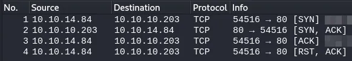


võrgu nuhkimine TCP Connect skaneerimise ajal avatud pordi otsimiseks


Näeme, et esimene saadetud TCP-pakett on kliendi poolt saadetud `TCP SYN`, millele server vastab `TCP SYN/ACK`, mis näitab, et port on avatud ja seal on aktiivne teenus. Et simuleerida legitiimset klienti, saadab Nmap seejärel serverile tagasi `TCP ACK`. Seevastu suletud pordi skaneerimisel:


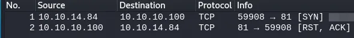


võrgukaardistamise ajal TCP Connect skaneerimine suletud pordi jaoks


Pange tähele, et serveri vastus meie `SYN` paketile on jällegi `TCP RST/ACK` pakett, seega võime järeldada, et port on suletud ja selles ei tööta ühtegi teenust.


Nmapi kasutamisel kasutatakse TCP Connect Scan'i (TCP Connect Scan) valiku `-sT` (`scan Connect`) abil. Pange tähele, et kui Nmap'i kasutatakse privilegeerimata seansist, on see vaikimisi TCP skaneerimisrežiim:


```
# Execution of a TCP Connect Scan
nmap -sT 192.168.1.15
```


`TCP Connect Scan` simuleerib legitiimsemat ühendustaotlust, mille käitumine sarnaneb kõige rohkem lambda-kliendi käitumisele, seega on raskem tuvastada vähendatud arvu portide skaneerimist. See on aga aeglasem, kuna see initsialiseerib täielikult iga TCP-ühenduse skaneeritava masina avatud portides.


10 000 pordi Nmap-skaneerimine on siiski kergesti tuvastatav, kui on paigaldatud võrgu sissetungi tuvastamise ja kaitse teenused (IDS, IPS, EDR). Kui ründaja soovib hoida madalat profiili, keskendub ta pigem vähestele strateegiliselt valitud portidele, näiteks 445 (SMB) või 80 (HTTP), mis on sageli serverites avatud ja kujutavad endast tavalisi haavatavusi.


Kuna TCP Connect Scan ootab mõlemal juhul vastust, võib see tuvastada ka tulemüüri olemasolu, mis võib filtreerida sihtarvuti porte.


### IV. TCP FIN skaneerimine või "Stealth Scan" (varjatud skaneerimine)


TCP FIN Scan, tuntud ka kui _Stealth Scan_, kasutab TCP-ühenduse lõpetava kliendi käitumist avatud pordi tuvastamiseks.


TCP puhul tähendab sessiooni lõpetamine TCP-paketi saatmist, mille FIN-flipp on seatud 1. Tavalise Exchange puhul lõpetab server igasuguse suhtluse kliendiga (vastust ei tule). Kui serveril ei ole aktiivset TCP-ühendust kliendiga, saadab ta `RST/ACK`. Seega saame me eristada avatud ja suletud porte, saates `TCP FIN` pakette portide kogumile:


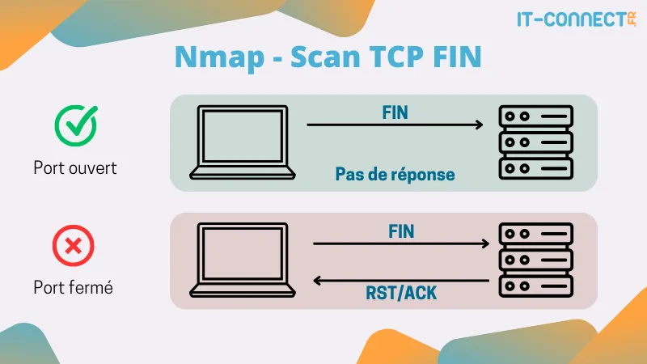


tCP FIN skaneerimise käitumisdiagramm avatud ja suletud portide jaoks


Ma jälle pildistasin võrgu _Stealth scan_ ajal ja see on see, mida näete, kui skaneeritud port on avatud:


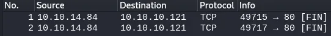


tCP FIN skaneerimise ajal avatud pordi võrgu hõivamine


Näeme, et klient saadab TCP-ühenduse lõpetamiseks ühe või kaks paketti ja et server ei vasta. Ta lihtsalt aktsepteerib ühenduse lõppu ja lõpetab suhtluse.


Seda näeme nüüd, kui me skaneerime suletud porti:


võrgu kaaperdamine TCP FIN skaneerimise ajal suletud pordi jaoks


Me näeme, et server saadab tagasi `TCP RST/ACK` paketi, seega on erinevus avatud ja suletud pordi käitumises, ja me saame TCP FIN paketi saatmise teel loetleda serveri avatud pordid. Nmap'i kasutades kasutatakse TCP FIN skaneerimiseks valikut `-sF` (`scan FIN`):


```
# Execution of a TCP Fin Scan
nmap -sF 192.168.1.15
```


TCP FIN Scan ei tööta Windowsi hostidel, sest operatsioonisüsteem kipub TCP FIN pakette ignoreerima, kui need saadetakse portidesse, mis ei ole avatud. Seega, kui te käivitate TCP FIN Scan'i Windowsi hostil, jääb teile mulje, et kõik pordid on suletud.


Seepärast on oluline tunda mitmeid skaneerimismeetodeid ja mõista nende erinevusi.


Kuna kummalgi juhul ei oota TCP FIN vastust, ei suuda ta tuvastada tulemüüri olemasolu sihtarvuti ja skaneerimise allika vahel.


Siin on näide Nmap'i TCP FIN skaneerimise tulemusest:


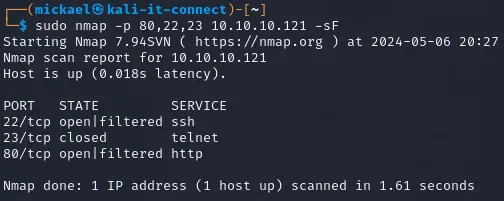


tCP FIN skaneerimise tulemused Nmap._


Tegelikult võib hostilt antud pordi mittevastamine tähendada, et port on filtreeritud, kuid ka seda, et see on avatud ja aktiivne.


Seda skaneerimist nimetatakse "varjatuks", kuna see ei generate palju liiklust ja üldiselt ei põhjusta sihtmärgiks olevates süsteemides logimist. Seda saab kasutada võrgu portide diskreetseks avastamiseks ilma häireid tekitamata. Kuid nagu eespool mainitud, võib selle tõhusus erineda sõltuvalt sihtsüsteemist, nagu ka selle diskreetsus sõltuvalt turvaseadmete konfiguratsioonist.


### V. Kokkuvõte


Niipalju siis esimesest kahest peatükist, mis käsitlevad Nmapi erinevaid TCP-skaneerimistüüpe! Järgmises peatükis vaatleme XMAS, Null ja ACK TCP skaneerimistüüpe, mis toimivad erinevalt, et tuvastada avatud pordid hostil.


## 14 - Pordi skaneerimine TCP kaudu: XMAS, Null ja ACK


### I. Esitlus


Selles jaotises jätkame Nmapi pakutavate erinevate TCP-skaneerimismeetodite uurimist. Siinkohal vaatleme meetodeid `XMAS`, `Null` ja `ACK`, mis kasutavad TCP-spetsiifilisi omadusi, et saada teavet antud sihtmärgi avatud portide ja teenuste kohta.


### II. TCP XMAS skaneerimine


XMAS Scan TCP on veidi ebatavaline, sest see ei simuleeri üldse tavalist kasutaja või masina käitumist võrgus. Tegelikult saadab XMAS Scan TCP-pakette, mille lipud `URG` (Urgent), `PSH` (Push) ja `FIN` (Finish) on seatud 1, et mööda minna teatud tulemüüridest või filtreerimismehhanismidest.


Nimi XMAS tuleneb asjaolust, et nende lippude nägemine on ebatavaline. Kui kõik kolm lippu on TCP-paketis samaaegselt seatud, näeb see välja nagu valgustatud jõulupuu:


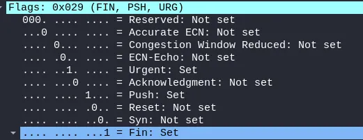


xMASi skaneerimisel kasutatavad tCP lipud


Ilma siinkohal nende lipukeste rolli üksikasjalikult kirjeldamata on oluline teada, et kui saadate paketi nende kolme lipukesega, ei saada sihtportide taga olev aktiivne teenus ühtegi paketti tagasi. Teisalt, kui port on suletud, saame TCP RST/ACK paketi. Nüüd suudame masina portide loetelus eristada avatud ja suletud pordi käitumist:


tCP XMAS skaneerimise käitumisdiagramm avatud ja suletud portide jaoks


Sama loogikat järgides näitab aktiivse veebiserveriga host'i TCP/80 pordi võrgu skaneerimine järgmist käitumist, kui tuvastatakse avatud port (skaneerimisallikas `10.10.14.84`):


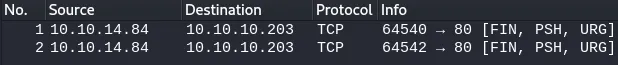


tCP XMAS skaneerimise ajal avatud pordi võrgu hõivamine


Näeme, et skaneerimisallikas saadab kaks TCP XMAS paketti (mille lipud `FIN`, `PSH` ja `URG` on seatud 1) hostile `10.10.10.203` ja et sihtmärgilt ei tule mingit vastust, mis näitab, et port on avatud. Seevastu, kui tehakse `TCP XMAS Scan` suletud pordile, siis saadakse järgmine tulemus:


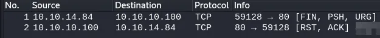


võrgu kaaperdamine TCP XMAS skaneerimise ajal suletud pordi jaoks


Vastus meie TCP-paketile on siis `TCP RST/ACK`, mis näitab, et port on suletud. Selle tehnika kasutamiseks Nmapiga võimaldab valik `-sX` (`scan XMAS`) teostada TCP XMAS skaneerimist:


```bash
# Execution of a TCP XMAS Scan
nmap -sX 192.168.1.15
```


Oluline on märkida, et TCP XMAS skaneerimine ei suuda tuvastada tulemüüre, mis võivad olla sihtmärgi ja skaneeritava masina vahel, erinevalt mõnest muust skaneerimise tüübist, nagu TCP SYN või Connect. Tõepoolest, aktiivne tulemüür kahe hosti vahel tagab, et TCP-pöördumist ei toimu, kui sihtport on filtreeritud (st tulemüüriga kaitstud). Vastuse puudumise korral ei ole seega võimalik teada, kas port on tulemüüri poolt kaitstud või avatud ja aktiivne. Samuti peaksite arvestama, et sarnaselt TCP FIN skaneerimisele võivad teatud rakendused või operatsioonisüsteemid, näiteks Windows, moonutada seda tüüpi skaneerimise tulemusi.


märkus: XMAS/FIN/NULL-skaneerimise tugi Windowsi viimaste versioonide puhul on endiselt piiratud ja tulemused võivad seda tüüpi sihtmärgi puhul olla ebaühtlased. (Uuendus 2025)_


### III. TCP nullturseerimine


Erinevalt TCP XMAS skaneerimisest saadab TCP Null scan TCP skaneerimispakette, mille kõik lipud on seatud 0. Ka see on käitumine, mida ei esine kunagi tavalises Exchange masinate vahel, kuna TCP-paketi saatmine ilma liputa ei ole TCP-protokolli kirjeldavas RFC-s määratletud. Seetõttu on seda lihtsam tuvastada.


Nagu TCP XMAS skaneerimine, võib ka see skaneerimine häirida teatud tulemüüride või filtreerimismoodulite tööd, võimaldades pakettide läbipääsu:


tCP Null Scan käitumisdiagramm avatud ja suletud portide puhul


Siin on näha, mida saab võrgus näha TCP Null skaneerimise ajal avatud pordil:


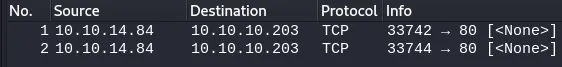


tCP Null skaneerimise ajal avatud pordi võrgu kaaperdamine


Skaneerimismasin saadab liputa paketi (`[<None>]` Wiresharkis) ilma serveri vastuseta. Vastupidi, kui sihtport on suletud:


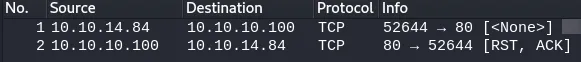


võrgu kaaperdamine suletud TCP Null skaneerimise ajal suletud pordi jaoks


TCP Null skaneerimise teostamiseks Nmapiga kasutage lihtsalt valikut `-sN` (`scan Null`):


```bash
# Execution of a TCP Null Scan
nmap -sN 192.168.1.15
```


Kuna vastus, kui port on avatud ja kui tulemüür on aktiivne (kummalgi juhul ei ole serveri tagasisidet), on TCP Null scan võimetu tuvastama tulemüüri olemasolu. Veelgi enam, tulemüür võib tulemust isegi võltsida, andes mõista, et port on avatud, sest ta ei reageeri TCP-pakettidele ilma lipukesteta, kuigi port on filtreeritud. See on oluline teave, mida tuleb teadvustada, kui kasutatakse skaneerimisi, mis ei suuda eristada avatud ja filtreeritud (tulemüüriga kaitstud) porti, näiteks `TCP Null`, `XMAS` või `FIN` skaneerimisi, et jääda saadud tulemuste tõlgendamisel järjepidevaks.


### IV. TCP ACK skaneerimine


TCP ACK-skaneerimist kasutatakse selleks, et tuvastada tulemüüri olemasolu sihtarvutis või sihtarvuti ja skaneerimise allika vahel.


Erinevalt teistest skaneerimistest ei püüa TCP ACK skaneerimine tuvastada, millised pordid on hostil avatud, vaid pigem seda, kas filtreerimissüsteem on aktiivne, vastates iga pordi puhul "filtreeritud" või "filtreerimata". Mõned TCP-skännid, nagu `TCP SYN` või `TCP Connect`, suudavad teha mõlemat korraga, samas kui teised, nagu `TCP FIN` või `TCP XMAS`, ei suuda üldse kindlaks teha, kas filtreerimine on olemas. Seetõttu võib TCP ACK skaneerimine olla kasulik:


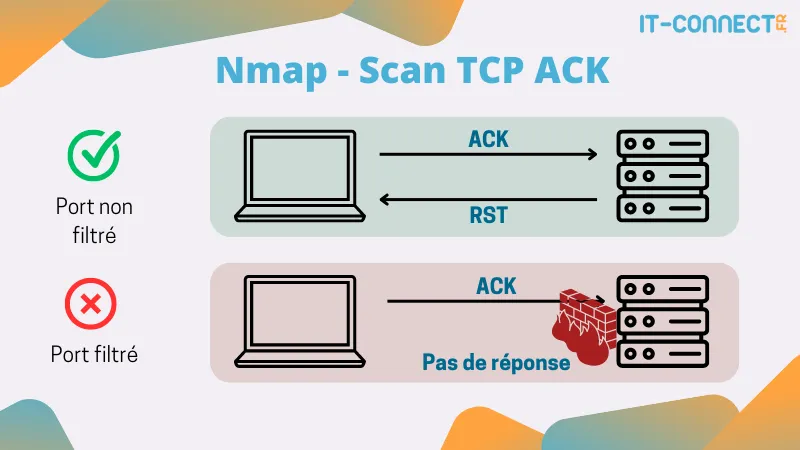


tCP ACK skaneerimise käitumisdiagramm filtreeritud ja filtreerimata sadamate puhul


Kasutame Nmap'i valikut `-sA`, et seda tüüpi skaneerimist teostada. Siin on TCP ACK skaneerimise tulemus, kui port on filtreeritud, st blokeeritud ja tulemüüriga kaitstud:


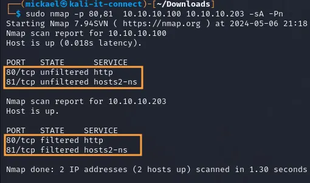


nmap kuvab TCP ACK Scan._ ajal


Näidistulemus tulemuse kohta tulemüüriga ja ilma tulemüürita hostil. Nmap tagastab `10.10.10.203` hosti TCP/80 ja TCP/81 porte `filtered`. Wiresharki abil tehtud võrguanalüüsil on käitumine järgmine:


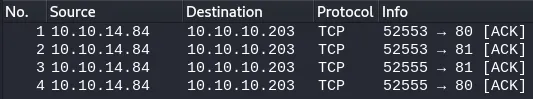


tCP ACK skaneerimise ajal võrgukaardistamise port, mida tulemüür ei ole filtreerinud


Sihtmasin ei tagasta midagi, kui tulemüür on olemas.


Selle skaneerimise käivitamiseks Nmapiga kasutage valikut `-sA` (`scan ACK`):


```bash
# Execution of a TCP ACK Scan
nmap -sA 192.168.1.15
```


### V. Kokkuvõte


Lisaks juba tutvustatud meetoditele oleme vaadelnud kolme erinevat TCP kaudu skaneerimise meetodit. Neid erinevaid meetodeid tuleb kasutada väga spetsiifilistes tingimustes ja kontekstides, eelkõige sissetungitestide või punase meeskonna operatsioonide kontekstis, mille käigus on olemas diskreetsuse mõiste.


## 15 - Nmap CheatSheet - õpikukommandode kokkuvõte


### I. Esitlus


Siin on lühike kokkuvõte Nmapi paljudest käskudest ja kasutusviisidest, et saaksite need kiiresti üles leida ja igapäevases kasutuses uuesti kasutada.


### II. Nmap: IT-Connect


Siin on esitatud käskude spikker. See lehekülg lihtsustab Nmapi kõige levinumate kasutusvõimaluste leidmist.


- Sadama skaneerimine


```bash
# Display installed Nmap version
nmap --version

# Scan for open specific ports on a single IP address
nmap --open -p 80 192.168.1.18

# Scan TCP ports on a selection of ports
nmap 192.168.1.19 -p 80
nmap 192.168.1.19 -p 22,80,1000-2000,3389

# Scan UDP services on an IP address
nmap -sU 192.168.1.19

# Scan UDP services on specific ports
nmap -sU 192.168.1.19 -p 161,23

# Scan the 100 most commonly used TCP ports
nmap 192.168.1.19 --top-ports 100

# Scan all ports on an IP address
nmap 192.168.1.19 -p-

# Scan multiple subnets with specific ports
nmap 192.168.0.0/24 192.168.1.0/24 -p 22

# Scan a subnet while excluding a specific IP address, scan all ports
nmap 192.168.0.0/24 --exclude 192.168.0.4 -p-
```


- Aktiivsete hostide avastamine


```bash
# Scan on CIDR or IP ranges
nmap 192.168.0.0/24
nmap 192.168.0.0/24 192.168.1.0/24
nmap 192.168.1.2 192.168.1.3 192.168.1.10-20
nmap 192.168.0.0/24 192.168.1.3 192.168.1.10-20

# Host discovery scan (Ping Scan) on a network
nmap -sn 192.168.1.0/24
```


märkus: valik `-sP` on juba mitu aastat vananenud ja tuleks asendada valikuga `-sn`. (Uuendus 2025)_


```bash
# Host discovery scan without port scan
nmap 192.168.1.0/24 -sn

# Host discovery scan on a local network using various probe techniques
nmap -sn -PP -PS22,3389,445,139 -PA80 192.168.1.0/24

# Scan hosts listed in a text file
nmap -iL /tmp/mesCibles.txt

# Network scan with a specific IP excluded
nmap 192.168.1.0/24 --exclude 192.168.1.140

# Subnet scan excluding another subnet
nmap 10.0.0.0/16 --exclude 10.0.100.0/24
```


- Versiooni tuvastamine


```bash
# Enable version detection
nmap 192.168.1.0/24 -sV

# Version detection + advanced trace
nmap 192.168.1.0/24 -sV --version-trace

# Version detection with maximum probe rarity of 2
nmap 192.168.1.0/24 -sV --version-intensity 2

# Version detection with all probes
nmap 192.168.1.0/24 -sV --version-intensity 9

# Enable OS detection
nmap -O 10.10.10.0/24
```


- NSE skriptid: haavatavuste otsimine


```bash
# Run default NSE scripts
nmap -sC 10.10.10.152

# Scan all TCP ports with default NSE scripts
nmap -sC -p- 10.10.10.152

# Display help for script by name
nmap --script-help=ftp-*

# Display help for a category
nmap --script-help=discovery

# Use NSE scripts by category
nmap --script default 10.10.10.152
nmap --script discovery 10.10.10.152

# Inclusion/exclusion filter for NSE script categories
nmap --script "discovery and safe" 10.10.10.152
nmap --script "not intrusive and not dos" 10.10.10.152
nmap --script "vuln and not intrusive and not dos" 10.10.10.152
nmap --script "(http and vuln) and not intrusive and not dos" 10.10.10.152

# Run a specific NSE script
nmap --script ftp-anon -p 21 10.10.10.152
nmap --script ftp-anon 10.10.10.152

# Pass arguments to an NSE script
nmap --script ssh-brute --script-args userdb=/tmp/userlist,passdb=/tmp/passlist 10.10.10.245 192.168.1.19
```


- Nmap väljundite haldamine


```bash
# Save scan to text file
nmap 10.10.10.0/24 -sV -oN nmap_scan_10.10.10.0_24.txt

# Save scan to condensed text file
nmap 10.10.10.0/24 -sV -oG nmap_scan_10.10.10.0_24.gnmap

# Save scan to XML file
nmap 10.10.10.0/24 -sV -oX nmap_scan_10.10.10.0_24.xml
```


- Jõudluse optimeerimine


```bash
# Version detection scan with max rate of 300 packets per second
nmap -sV 10.10.10.0/24 --max-rate 300

# Version detection scan with default scripts, no retry, max host timeout 15min
nmap -sV -sC 10.10.10.0/24 --max-retries 0 --host-timeout 15m

# Version detection scan with the 2000 most common ports, aggressive scan speed (T4), debug output
nmap 10.10.10.0/24 -sV --top-ports 2000 -T4 -d
```


- TCP-skaneerimise tüübid


```bash
# TCP SYN scan (fast, less stealthy)
nmap -sS 192.168.1.15

# TCP Connect scan (classic)
nmap -sT 192.168.1.15

# TCP FIN scan (stealth)
nmap -sF 192.168.1.15

# TCP XMAS scan
nmap -sX 192.168.1.15

# TCP Null scan
nmap -sN 192.168.1.15

# TCP ACK scan (detect firewall)
nmap -sA 192.168.1.15
```


Loodan, et need käsud on teile kasulikud. Ärge unustage kohandada oma skaneerimise sihtmärki oma kontekstiga ja tutvuda ametliku dokumentatsiooniga, et täielikult omandada tehtud testid.


### III. Kokkuvõte


Nmapi õpetus on nüüdseks lõppenud. Nüüd on teil olemas selle põhjaliku ja võimsa tööriista kasutamiseks vajalikud põhitõed. Soovitame tungivalt harjutada kontrollitud keskkondades (Hack The Box, VulnHub, virtuaalmasinad) enne selle kasutamist tootmises.


Palju on veel uurida tööriista sisemisi toiminguid ja täiustatud funktsioone. Siin esitatud käskude ja mõistete valdamine võimaldab teil siiski Nmapi kindlalt ja asjakohaselt kasutada.