___


*Dieses Tutorial basiert auf Originalinhalten von Florian Duchemin, die auf [IT-Connect](https://www.it-connect.fr/) veröffentlicht wurden. Lizenz [CC BY-NC 4.0](https://creativecommons.org/licenses/by-nc/4.0/). Am Originaltext können Änderungen vorgenommen worden sein.*


___


## I. Präsentation


**Ob zur Überprüfung des Netzwerkflusses, um ein klares Bild von der Nutzung zu erhalten oder für Leistungsstatistiken, die Überwachung des Netzwerkflusses ist ein wichtiger Bestandteil eines Unternehmensnetzwerks**. Sie hilft dabei, Änderungen an der Infrastruktur zu antizipieren und die Nutzungsqualität für die Benutzer sicherzustellen (auch bekannt als QoE für *Quality of Experience*, im Gegensatz zu QoS).


Zu diesem Zweck gibt es viele Techniken und Software/Protokolle. Mit Netflow, das von Cisco entwickelt wurde, können beispielsweise IP-Flow-Statistiken von einem Interface abgerufen werden, aber die Verwendung ist auf kompatible Geräte beschränkt.


Deshalb stelle ich Ihnen in diesem Tutorial **Ntop** vor und zeige Ihnen, wie Sie es in Ihrer Infrastruktur einsetzen können, um die Nutzung Ihres Netzwerks im Auge zu behalten.


Ntop ist eine Open-Source-Software, die auf jedem Linux-Rechner installiert werden kann. Sie ist kostenlos und kann die folgenden Daten sammeln:


- Bandbreitennutzung
- Wichtigste Kunden
- Wichtigste Ziele
- Verwendete Protokolle
- Verwendete Anwendungen
- Verwendete Ports
- Etc.


Jetzt umbenannt in **Ntopng (New Generation)**, bietet es viele Grundfunktionen kostenlos an. Es ist auch eine kommerzielle Version erhältlich, die es ermöglicht, konfigurierte Alarme in eine SIEM-ähnliche Software zu exportieren oder den Datenverkehr mit direkt von der Sonde definierten Regeln zu filtern.


## II. Voraussetzungen


Die Installation einer Ntop-Sonde ist je nach Gerät und Umgebung unterschiedlich. Daher werde ich Ihnen hier keine Schritt-für-Schritt-Anleitung geben, sondern die verschiedenen Möglichkeiten skizzieren.


### A. Eingebauter Modus


Wenn Sie eine pfSense-, OPNSense- oder Endian-Firewall in der Produktion haben, oder sogar eine Linux-Workstation mit NFTables, dann gibt es gute Neuigkeiten! Sie können Ntopng direkt installieren und mit der Überwachung Ihrer Schnittstellen beginnen.


Der Vorteil dieser Technik ist, dass sie keine zusätzliche Hardware erfordert. Andererseits erhöht sie die Ressourcenauslastung. Stellen Sie daher sicher, dass Sie über geeignete Hardware oder eine VM ausreichender Größe verfügen (mindestens 2 Kerne und 2 GB RAM).


### B. TAP/SPAN-Modus


Ein **Tap** ist **ein Netzwerkgerät, das den Datenverkehr, der es durchläuft, dupliziert und an ein anderes Gerät sendet**. Der Vorteil dieses Geräts besteht darin, dass es keine Änderungen an der bestehenden Infrastruktur erfordert und überall platziert werden kann, um bestimmte Netzwerkabschnitte zu überwachen, oder zwischen dem Core-Switch und dem Edge-Router, um den Datenverkehr zum/vom Internet zu analysieren.


Der große Nachteil dieser Art von Geräten sind ihre Kosten. In den heutigen Gigabit-Netzwerken kann ein passiver Abgriff den Netzwerkverkehr nicht richtig erfassen, so dass Sie ein aktives Gerät benötigen, das mindestens 200 € kostet.


Der **SPAN**-Modus, auch bekannt als **Port Mirroring**, wird von einem Switch verwendet, um den Datenverkehr von einem Port zu einem anderen weiterzuleiten. Dies ist bei weitem die von mir bevorzugte Methode, da sie einfach einzurichten ist und es Ihnen, wie bei Tap, ermöglicht, einen Teil des Netzwerks oder das gesamte Netzwerk nach Belieben zu überwachen. Es gibt jedoch zwei Nachteile: Der Switch muss diese Funktion integrieren, und ihre Verwendung kann die Prozessorlast des Switches erhöhen.


### C. Router-Modus


Es ist durchaus möglich, einen Router unter Linux zu mounten und ntopng auf ihm zu installieren. Der einzige Nachteil dieser Methode ist, dass sie Ihr Netzwerk verändert, entweder seine interne Adressierung oder die Adressierung zwischen Ihrem "echten" Router und dem hinzugefügten Router.


Hinweis: Für Leser des Artikels [Create a Wifi router with Raspberry Pi and RaspAP] (https://www.it-connect.fr/creer-un-routeur-wifi-avec-un-raspberry-pi-et-raspap/) ist es durchaus möglich, ntopng auf dem Rpi zu installieren, um genaue Statistiken zu erhalten!


### D. Bridge-Modus


Eine interessante Alternative ist die Verwendung eines **Linux-Rechners im Bridge-Modus**, der zwischen zwei Geräten platziert wird und es ermöglicht, den gesamten Datenverkehr zu erfassen, ohne in die Konfiguration der Infrastruktur oder ihrer Geräte eingreifen zu müssen. Da ein alter Rechner diese Aufgabe übernehmen kann, kann diese Methode auch kostengünstig sein. Um optimal zu sein, sollte das Gerät über drei Netzwerkkarten verfügen, zwei im Bridge-Modus und eine für den Zugriff auf Interface und SSH. Es ist möglich, nur zwei Karten zu verwenden, aber dann wird auch der Datenverkehr der Geräteverwaltung aufgezeichnet...


Ich werde also **diesen letzten Modus** verwenden. Aus praktischen Gründen werde ich für die Demonstration virtuelle Maschinen verwenden, aber die Methode bleibt dieselbe für die Verwendung auf physischen Maschinen.


## III. Probenvorbereitung mit Interface-Brücke


Für die Sonde habe ich einen **Debian 11**-Rechner mit Minimalinstallation gewählt.


Der erste Schritt ist immer derselbe: Aktualisieren Sie die:


```
apt-get update && apt-get upgrade
```


Dann installieren Sie das Paket **bridge-utils**, mit dem wir unsere Bridge erstellen können:


```
apt-get install bridge-utils
```


Nach der Installation müssen wir uns zunächst den aktuellen Namen unserer Netzwerkkarten merken. Unter Debian kann dieser Name verschiedene Formen annehmen, und wir benötigen ihn für die Konfiguration.


Ein einfacher Befehl **ip add** liefert eine Ausgabe mit diesen Informationen:


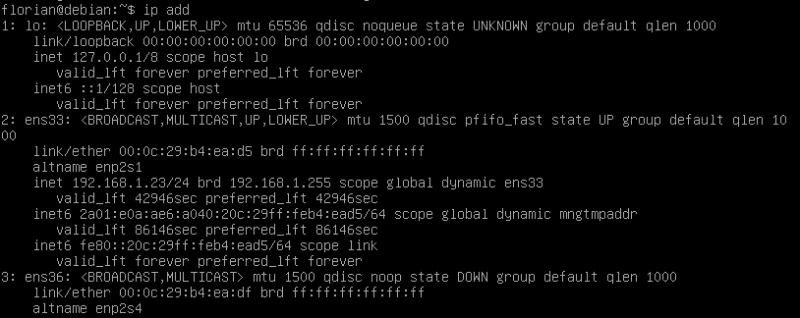


Hier sehe ich 3 Schnittstellen:


- Lo**: Dies ist der Loopback-Interface; es ist ein virtueller Interface, der über das Gerät "schleift". Im Grunde genommen wird dieser Interface, dessen Address 127.0.0.1 ist (obwohl jeder Address in 127.0.0.0/8 ausreicht, da dieser Bereich für diesen Zweck reserviert ist), verwendet, um das Gerät selbst zu kontaktieren. Wenn Sie eine Website auf Ihrer Workstation installiert haben (z. B. mit WAMPP), haben Sie wahrscheinlich den "*localhost*" verwendet Address verwendet, um die auf Ihrem eigenen Rechner gehostete Site anzuzeigen. Dieser Hostname ist mit dem Address 127.0.0.1 und somit mit dem Interface Loopback verbunden.
- ens33**: dies ist mein erster Interface, der hier von meinem DHCP einen Address erhalten hat
- ens36**: mein zweiter Interface


Da ich nun alle Informationen habe, kann ich die Datei */etc/network/interfaces* ändern, um meine Bridge zu erstellen. So sieht sie derzeit aus (kann variieren):


```
# This file describes the network interfaces available on your system
# and how to activate them. For more information, see interfaces(5).

source /etc/network/interfaces.d/*

# The loopback network interface
auto lo
iface lo inet loopback

# The primary network interface
allow-hotplug ens33
iface ens33 inet dhcp
# This is an autoconfigured IPv6 interface
iface ens33 inet6 auto
```


Der erste Teil betrifft meinen Loopback-Interface, den ich nicht anfassen werde, gefolgt von dem Interface ens33. Die Änderungen umfassen das Hinzufügen meines zweiten Interface (ens36) und die Konfiguration der Bridge mit diesen beiden Schnittstellen:


```
# The primary network interface
auto ens33
iface ens33 inet manual

#The secondary network interface
auto ens36
iface ens36 inet manual
```


Im Folgenden finden Sie einige Erläuterungen zu diesen ersten Änderungen:


- auto *Interface***: startet automatisch Interface beim Systemstart
- iface *Interface* inet manual**: um den Interface ohne IP Address zu verwenden. Wie das Schlüsselwort "static", um eine statische IP Address zu definieren oder "dhcp", um eine dynamische Adressierung zu verwenden


Die Änderungen werden fortgesetzt:


```
# Bridge interface
auto br0
iface br0 inet static
address 192.168.1.23
netmask 255.255.255.0
gateway 192.168.1.1
bridge_ports ens33 ens36
bridge_stp off
```


Hier noch einmal ein paar Erklärungen:


- iface br0 inet static**: Hier habe ich meine Interface-Brücke (*br0*) mit einem statischen Address definiert.
- Address, Netzmaske, Gateway**: Informationen zur Adressierung der Karte
- bridge_ports**: Schnittstellen, die in die Bridge einbezogen werden sollen
- bridge_stp**: Das Spanning-Tree-Protokoll wird bei der Verbindung von Switches verwendet, um redundante Verbindungen zu erkennen und Schleifen zu vermeiden. Da eine Brücke zwischen zwei Netzwerkpfaden eingefügt werden kann, kann sie die Quelle einer Schleife sein, daher die Möglichkeit, dieses Protokoll zu aktivieren. Ich benötige es hier nicht, also deaktiviere ich es.


Speichern Sie die Änderungen und starten Sie das Netzwerk neu:


```
systemctl restart networking
```


Um die Änderungen zu überprüfen, zeigen Sie das Ergebnis des Befehls **ip** add erneut an:


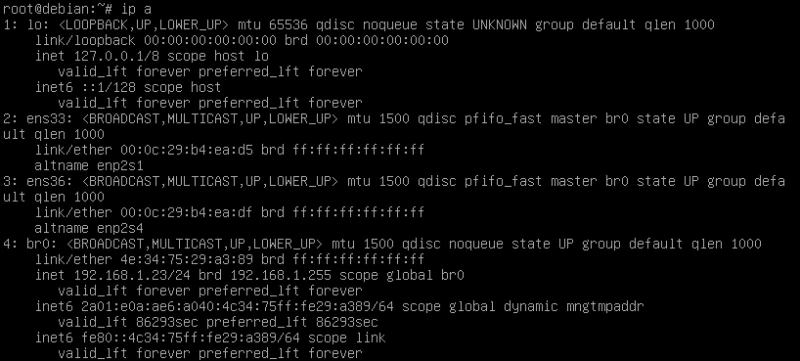


Sie können deutlich **meinen neuen Interface "*br0*" mit der IP Address sehen, die ich ihm zugewiesen habe**. Übrigens können Sie auch sehen, dass meine beiden physischen Schnittstellen tatsächlich "UP" sind, aber keine IP Address haben.


## IV. Installation von NtopNG


Da unsere Sonde nun in der Lage ist, den Datenverkehr zwischen meinem Netzwerk und dem Router abzuhören, muss nur noch ntopng installiert werden. Dazu ändern Sie zunächst die Datei */etc/apt/sources.list* und fügen **contrib** am Ende jeder Zeile hinzu, die mit **deb** oder **deb-src** beginnt.


Standardmäßig enthalten die Paketquellen nur DFSG (*Debian Free Sotftware Guidelines*) konforme Pakete, die mit dem Schlüsselwort **main** gekennzeichnet sind. Sie können diese Quellen auch hinzufügen:


- contrib**: Pakete, die DFSG-konforme Software enthalten, aber Abhängigkeiten verwenden, die nicht Teil des **Hauptzweigs** sind
- non-free**: enthält Pakete, die nicht DFSG-konform sind


Beispiel für eine Zeile in /etc/apt/sources.list:


```
deb http://deb.debian.org/debian/ bullseye main
```


Ich füge also einfach das Wort **contrib** zu Zeilen wie diesen hinzu.


Der Rest der Schritte ist auf der [NtopNG]-Seite (https://packages.ntop.org/apt/) aufgeführt, wo Sie für Debian 11 die Ntop-Quellen für die zukünftige Installation hinzufügen müssen. Diese Hinzufügung erfolgt automatisch durch die Verwendung einer:


```
wget https://packages.ntop.org/apt/bullseye/all/apt-ntop.deb
apt install ./apt-ntop.deb
```


Dann kommt die eigentliche Installationsphase:


```
apt-get clean all
apt-get update
apt-get install ntopng
```


Der erste Befehl löscht den Cache des apt-Paketmanagers. Mit dem zweiten wird die Paketliste aktualisiert und mit dem dritten wird NtopNG installiert.


Nach der Installation ist die **NtopNG-Software direkt auf Port 3000 des Debian-Rechners** verfügbar. Bei mir ist es also `http://192.168.1.23:3000`


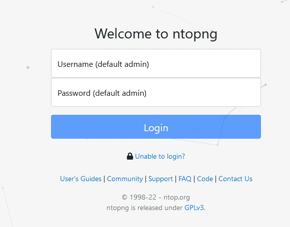


NtopNG-Startseite


Der Standard-Login und das Passwort werden angezeigt, und Sie müssen sie nur noch eingeben!


## V. Verwendung von NtopNG


Wenn Sie sich zum ersten Mal anmelden, werden Sie als Erstes aufgefordert, das Standard-Administrator-Passwort und die Sprache zu ändern. Leider gehört Französisch nicht dazu.


Sie gelangen dann auf das Armaturenbrett:


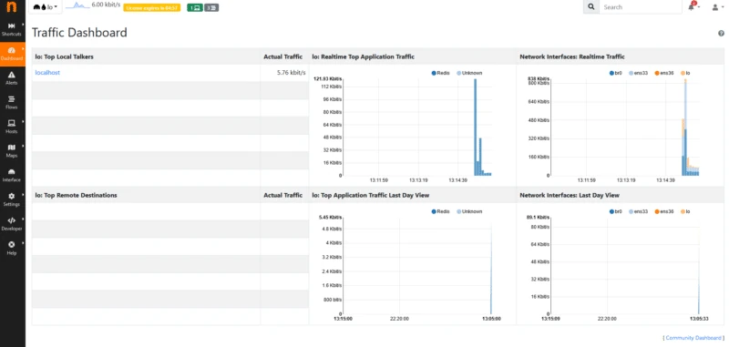


NtopNG Armaturenbrett


Gewöhnen Sie sich nicht an diesen Satz! Wenn Sie den gelben Kasten oben auf dem Bildschirm beachten, sehen Sie den Satz: "*Lizenz läuft in 04:57* ab". Standardmäßig wird bei der Installation eine Testversion der Vollversion von NtopNG gestartet, allerdings für eine (sehr) begrenzte Zeit. Sobald dieser "Countdown" erreicht ist, wird die *Community*-Version aktiviert und das Dashboard ändert sich:


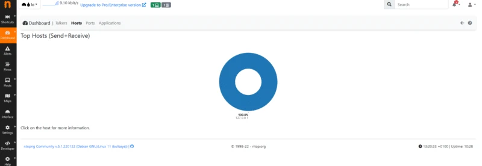


Neues Dashboard der NtopNG-Gemeinschaft


Als Erstes müssen Sie **prüfen, ob das richtige Interface zuhört**. In der oberen linken Ecke befindet sich eine Dropdown-Liste mit den verfügbaren Schnittstellen, aus der Sie den Interface auswählen können, der uns hier interessiert: br0


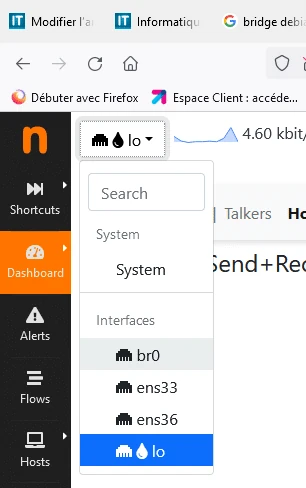


Interface-Auswahl


In dem neuen Fenster werden die "Top Flaw Talkers" angezeigt, d. h. die Geräte, die am meisten kommunizieren. Hier habe ich nur zwei Sender, die angezeigt werden:


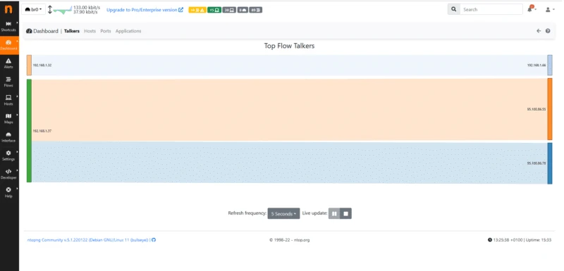


**Quell-Hosts erscheinen auf der linken Seite, Ziel-Hosts auf der rechten ** So können Sie die Nutzung der gesamten Bandbreite durch jeden Host visualisieren und einen Gesamtüberblick über den Netzwerkverkehr erhalten. Das ist nicht schlecht, aber wir können noch weiter gehen...


Wenn ich z. B. auf "*Hosts*" klicke, erhalte ich ein Diagramm, das den Sende- und Empfangsstromverbrauch jedes Hosts in meinem Netzwerk anzeigt. Hier kann ich zum Beispiel sehen, dass allein 192.168.1.37 für 80 % meines Datenverkehrs verantwortlich ist:


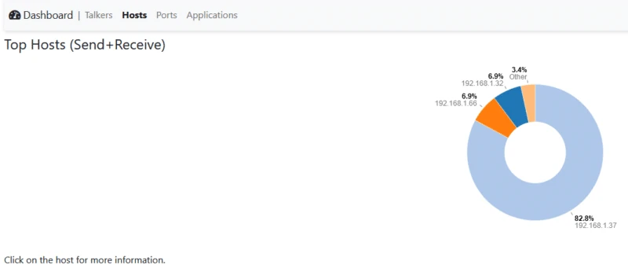


Wenn ich auf die IP Address des fraglichen Hosts klicke, werde ich auf eine Übersichtsseite weitergeleitet:


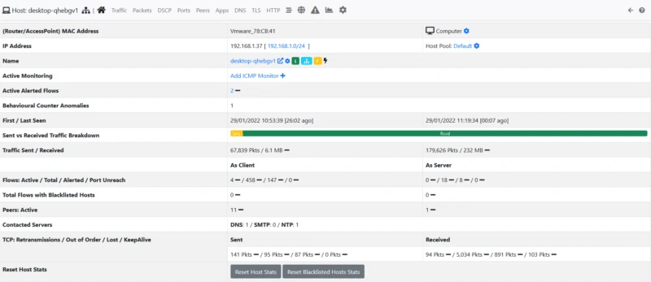


Ich kann zum Beispiel sehen, dass es sich um einen VMWare-Rechner handelt (indem ich das JA meines MAC Address erkenne), dass er DESKTOP-GHEBGV1 heißt (also sicherlich ein Windows-Host ist) UND ich habe **Statistiken über empfangene und gesendete Pakete sowie die Datenmenge**.


Sie werden auch ein neues Menü am oberen Rand dieser Zusammenfassung bemerken. Ich schlage vor, dass Sie auf "**Apps**" klicken, um zu sehen, was so viel Traffic verursacht:


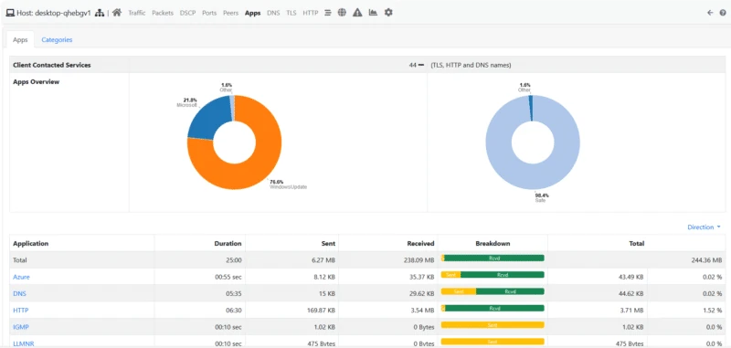


Ha, sieht so aus, als hätten wir eine Antwort! Auf dem Diagramm auf der linken Seite sehen wir, dass 76,6% des Datenverkehrs von ... Windows Update**, also lädt dieser Host Updates herunter!


NtopNG verwendet eine Technologie namens DPI für *Deep Packet Inspection*, die es ermöglicht, jeden Netzwerkfluss zu kategorisieren und die dahinter stehende Anwendung (oder Familie von Anwendungen) zu definieren.


Um das zu demonstrieren, starte ich ein YouTube-Video auf meinem Rechner:


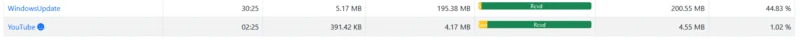


**Der Verkehr wurde sofort erkannt und kategorisiert!


Hinweis: Aus offensichtlichen Gründen kann diese Art von Software Probleme mit dem Datenschutz aufwerfen, also achten Sie darauf, sie unter den richtigen Bedingungen zu verwenden. Beachten Sie auch, dass es möglich ist, **Ergebnisse zu anonymisieren**. Die Option finden Sie unter **Einstellungen > Einstellungen > Verschiedenes** und heißt "**Host IP Address** maskieren".


## VI. Erkennungen und Warnungen


NtopNG ist auch in der Lage, Sicherheitswarnungen für bestimmte Feeds auszugeben. Diese finden Sie im Menü **Warnungen** auf dem linken Banner. Hier habe ich zum Beispiel insgesamt 2851 Warnungen, die in verschiedene Schweregrade unterteilt sind: Hinweis, Warnung und Fehler.


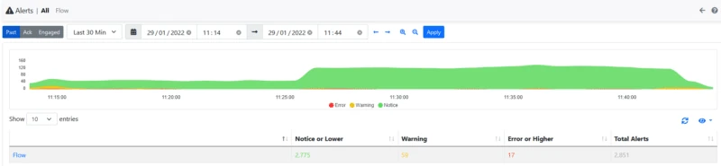


Werfen wir einen Blick auf die Warnmeldungen mit hoher Kritikalität, ich habe 17 davon!


Wenn Sie auf diese Zahl klicken, werden die Details der Warnungen angezeigt. Hier gibt es nichts Beunruhigendes, es handelt sich um einen Fehlalarm. Der Download von Updates wird als binäre Dateiübertragung in einem HTTP-Stream kategorisiert, was tatsächlich einen Angriff bedeuten könnte.


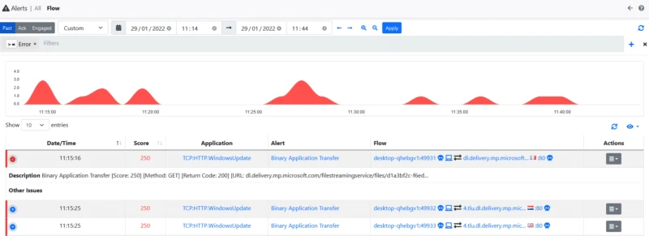


Da ich jedoch die kostenlose Version verwende, kann ich keine Domänen oder Hosts ausschließen, die die Quelle von Alarmen sind, so dass Sie diese im Auge behalten müssen, um nicht etwas viel Besorgniserregenderes zu verpassen. NtopNG wird generate-Warnungen im Falle von:


- Herunterladen von Binärdateien über HTTP
- Verdächtiger DNS-Verkehr
- Verwendung eines nicht standardisierten Anschlusses
- Erkennung von SQL-Injection
- Cross-Site Scripting (XSS)
- Etc.


## VII. Schlussfolgerung


In diesem Tutorial haben wir gesehen, **wie man eine Sonde mit NtopNG** einrichtet, die es uns ermöglicht, **unseren Netzwerkverkehr** zu analysieren, um die Nutzung von Protokollen und die Auslastung der einzelnen Hosts zu visualisieren, aber auch verdächtigen Verkehr zu erkennen.


Leider kann ich in diesem Artikel nicht auf alle Funktionen und Möglichkeiten eingehen, aber erkunden Sie sie ruhig!


Diese Lösung kann dauerhaft in eine Unternehmensinfrastruktur implementiert werden. NtopNG kann die Ergebnisse auch in eine InfluxDB-Datenbank exportieren, so dass Sie Ihre eigenen Dashboards mit einem Drittanbieter-Tool wie Graphana erstellen können.