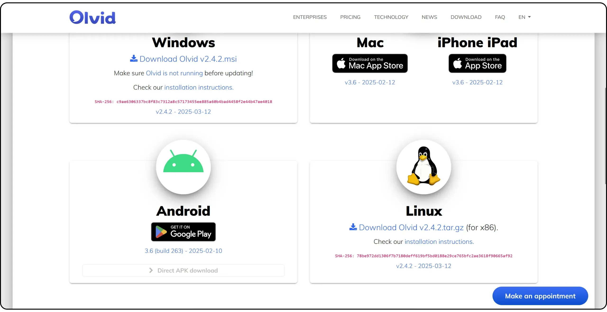
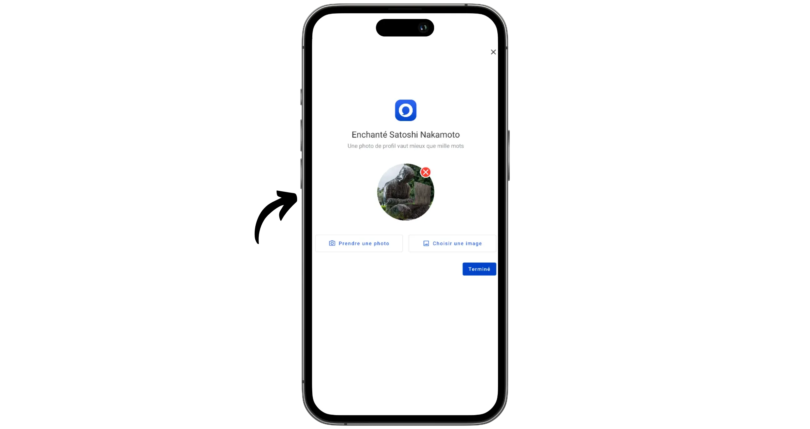
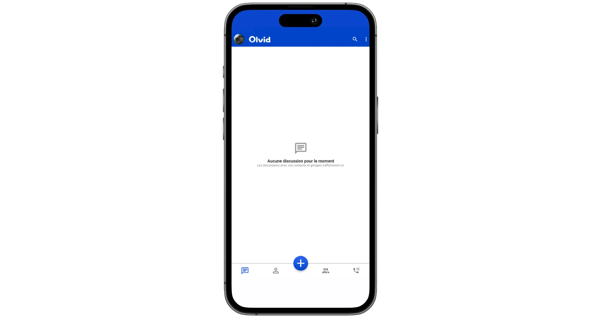
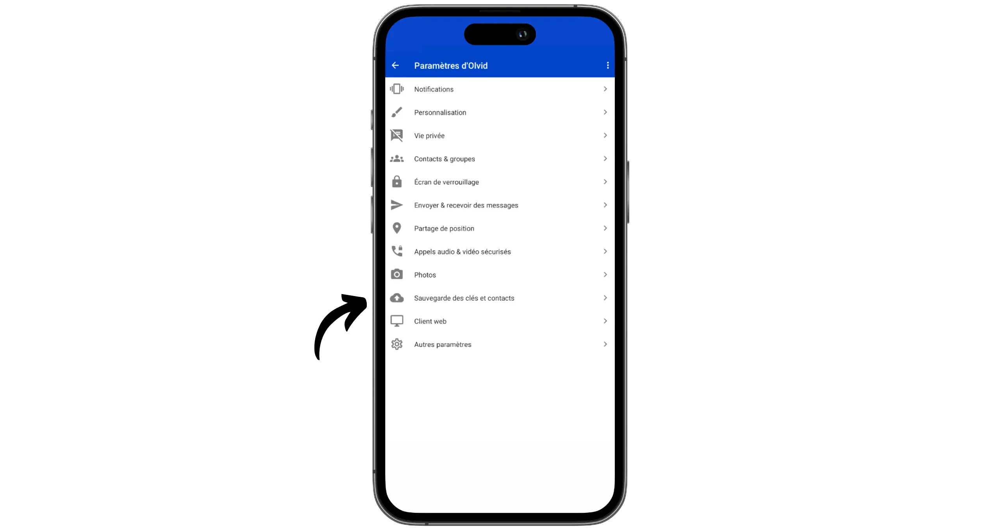
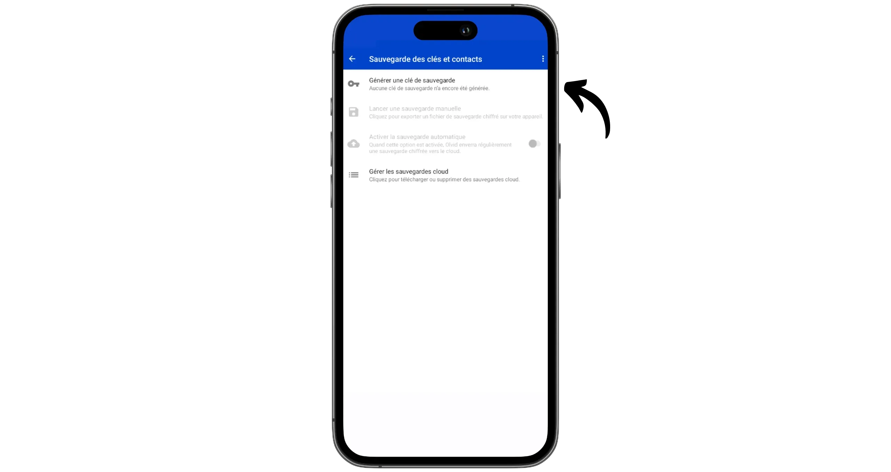
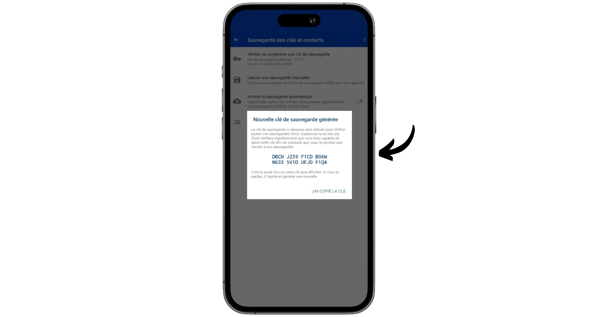
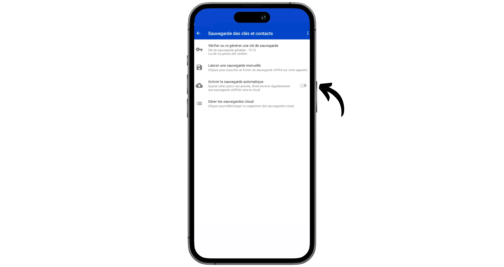
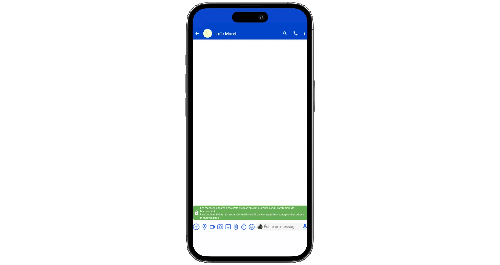
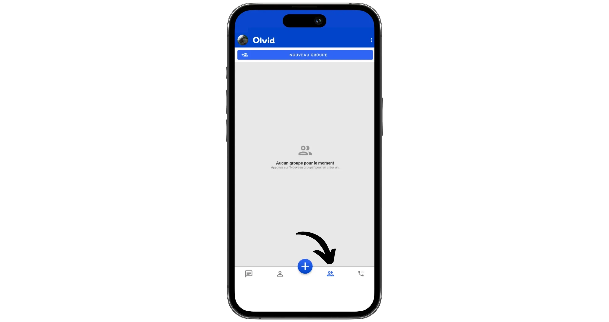

اولید یک برنامه پیام‌رسان فوری فرانسوی است که در سال ۲۰۱۹ راه‌اندازی شد و برای ارائه سطح بالایی از امنیت طراحی شده است، بدون اینکه به حریم خصوصی لطمه‌ای وارد کند. برخلاف واتساپ یا سیگنال، اولید در زمان ثبت‌نام هیچ اطلاعات شخصی درخواست نمی‌کند: نه شماره تلفن، نه ایمیل، هیچ‌چیز. شناسایی بین کاربران بر اساس یک Exchange از کلیدها انجام می‌شود، بدون سرور دایرکتوری یا کتاب Address مشترک.

همه پیام‌ها به صورت سرتاسری رمزگذاری شده‌اند با استفاده از یک پروتکل رمزنگاری اصلی، طراحی شده برای حفاظت از متادیتا نیز: هیچ‌کس نمی‌داند با چه کسی صحبت می‌کنید یا چه زمانی. کد کلاینت متن‌باز است، اما سرور مرکزی که برای مسیریابی پیام‌های رمزگذاری شده استفاده می‌شود، اختصاصی باقی می‌ماند و بر روی AWS میزبانی می‌شود.

مدل امنیتی Olvid بر یک اصل کلیدی متکی است: عدم وجود کامل اشخاص ثالث مورد اعتماد در ایجاد هویت‌های دیجیتال. برخلاف اکثر پیام‌رسان‌های رمزگذاری‌شده که به یک فهرست مرکزی برای مدیریت هویت کاربران متکی هستند، Olvid به هیچ زیرساخت مرکزی برای اطمینان از یکپارچگی ارتباطات وابسته نیست. این معماری خطرات مرتبط با به خطر افتادن فهرست را از بین می‌برد.

با این حال، Olvid از یک سرور مرکزی توزیع پیام استفاده می‌کند که به‌طور محدود به یک نقش لجستیکی محدود شده است: این سرور انتقال ناهمزمان پیام‌های رمزگذاری‌شده را مدیریت می‌کند. این سرور نقشی در فرآیند رمزگذاری ندارد، هویت واقعی کاربران یا محتوای پیام‌ها و متادیتا را نمی‌داند (به‌جز کلید عمومی گیرنده که برای مسیریابی ضروری است). بنابراین می‌توان آن را به‌طور پیش‌فرض خصمانه در نظر گرفت بدون اینکه امنیت کلی سیستم به خطر بیفتد. حتی اگر به خطر بیفتد، دسترسی به محتوای پیام‌ها را فراهم نمی‌کند. بنابراین Olvid برای تحویل پیام‌ها فرض بر تمرکزگرایی دارد (برای کارایی و کیفیت خدمات)، در حالی که امنیتی را تضمین می‌کند که مستقل از این زیرساخت است.

اولید یک نسخه رایگان و یک نسخه اشتراکی با قیمت ۴.۹۹ یورو در ماه ارائه می‌دهد. نسخه رایگان تمامی قابلیت‌ها را ارائه می‌دهد، به جز امکان برقراری تماس‌های صوتی و تصویری (اگرچه امکان دریافت آن‌ها وجود دارد) و اجازه همگام‌سازی حساب کاربری در چندین دستگاه را نمی‌دهد. بنابراین اگر قصد دارید فقط از گوشی هوشمند خود استفاده کنید و نیازی به برقراری تماس ندارید، اولید یک راه‌حل عالی است.

اولید توسط ANSSI (مرجع امنیت سایبری فرانسه) تأیید شده است. این برنامه جایگزین عالی برای خدمات پیام‌رسانی سنتی (واتساپ، فیسبوک مسنجر، وی‌چت...) برای کسانی است که به دنبال حفظ حریم خصوصی در عین سادگی استفاده هستند.

| Application          | E2EE 1:1      | E2EE groups   | Anonymous registration | Open-source client license | Open-source server license | Decentralized server | Year of creation |
| -------------------- | ------------- | ------------- | ---------------------- | -------------------------- | -------------------------- | -------------------- | ---------------- |
| WhatsApp             | ✅             | ✅             | ❌                      | ❌                          | ❌                          | ❌                    | 2009             |
| WeChat               | ❌             | ❌             | ❌                      | ❌                          | ❌                          | ❌                    | 2011             |
| Facebook Messenger   | ✅             | 🟡 (optional) | ❌                      | ❌                          | ❌                          | ❌                    | 2011             |
| Telegram             | 🟡 (optional) | ❌             | 🟡                     | ✅                          | ❌                          | ❌                    | 2013             |
| LINE                 | ✅             | ✅             | ❌                      | ❌                          | ❌                          | ❌                    | 2011             |
| Signal               | ✅             | ✅             | ❌                      | ✅                          | ✅                          | ❌                    | 2014             |
| Threema              | ✅             | ✅             | ✅                      | ✅                          | ❌                          | ❌                    | 2012             |
| Element (Matrix)     | ✅             | ✅             | ✅                      | ✅                          | ✅                          | 🟡 (federated)       | 2016             |
| Delta Chat           | ✅             | ✅             | ✅                      | ✅                          | N/A                        | 🟡 (via email)       | 2017             |
| Conversations (XMPP) | ✅             | ✅             | ✅                      | ✅                          | ✅                          | 🟡 (federated)       | 2014             |
| Session              | ✅             | ✅             | ✅                      | ✅                          | ✅                          | ✅                    | 2020             |
| SimpleX              | ✅             | ✅             | ✅                      | ✅                          | ✅                          | ✅                    | 2021             |
| **Olvid**            | **✅**         | **✅**         | **✅**                  | **✅**                      | **❌**                      | 🟡(no directory)     | **2019**         |
| Keet                 | ✅             | ✅             | ✅                      | ❌                          | N/A                        | ✅                    | 2022             |
| Jami                 | ✅             | ✅             | ✅                      | ✅                          | N/A                        | ✅                    | 2005             |
| Briar                | ✅             | ✅             | ✅                      | ✅                          | N/A                        | ✅                    | 2018             |
| Tox                  | ✅             | ✅             | ✅                      | ✅                          | N/A                        | ✅                    | 2013             |

*E2EE = رمزگذاری سرتاسر*

## برنامه Olvid را نصب کنید

اولید در تمامی پلتفرم‌ها در دسترس است. می‌توانید برنامه را مستقیماً از فروشگاه برنامه گوشی خود دانلود کنید:

- [Google Play](https://play.google.com/store/apps/details?id=io.olvid.messenger);
- [App Store](https://apps.apple.com/app/olvid/id1414865219);

در اندروید، همچنین امکان [نصب از طریق APK](https://www.olvid.io/download/) وجود دارد.

در این آموزش، ما بر روی نسخه موبایل تمرکز خواهیم کرد، اما لطفاً توجه داشته باشید که [نسخه‌های کامپیوتری نیز در دسترس هستند](https://www.olvid.io/download/) (MacOS، Linux و Windows). اگر نسخه پولی را انتخاب کنید، قادر خواهید بود حساب خود را بر روی چندین دستگاه همگام‌سازی کنید.

## ایجاد حساب کاربری در Olvid

وقتی برای اولین بار برنامه را اجرا می‌کنید، روی دکمه "*من یک کاربر جدید هستم*" کلیک کنید.

یک نام مستعار انتخاب کنید یا نام و نام خانوادگی خود را وارد کنید.

یک عکس پروفایل اضافه کنید.

حساب شما اکنون ایجاد شده است.

برای جلوگیری از هرگونه از دست دادن دسترسی به حساب Olvid خود، توصیه می‌کنیم پشتیبان‌گیری خودکار را تنظیم کنید. برای انجام این کار، تنظیمات را با کلیک بر روی سه نقطه در بالای سمت راست Interface باز کنید، سپس "*Settings*" را انتخاب کنید.

⚠️ **هشدار**: از نسخه 3.7 Olvid، روش پشتیبان‌گیری از پروفایل‌ها و مخاطبین شما با یک روش جدید جایگزین شده است. این آموزش هنوز نسخه قدیمی را ارائه می‌دهد. شما می‌توانید نسخه جدید را در بخش پرسش‌های متداول آن‌ها کشف کنید: [💾 پشتیبان‌گیری از پروفایل‌های شما](https://www.olvid.io/faq/sauvegarder-vos-profils/)

به منوی "*ذخیره کلیدها و مخاطبین*" بروید.

سپس روی "*generate a backup key*" کلیک کنید. این کلید پشتیبان‌های شما را رمزگذاری می‌کند. اگر نیاز دارید حساب خود را روی دستگاه دیگری بازیابی کنید و دیگر به آن دسترسی ندارید، به هر دو، یک پشتیبان و این کلید، برای رمزگشایی نیاز خواهید داشت.

این کلید را در مکانی امن نگه دارید. همچنین می‌توانید یک نسخه کاغذی تهیه کنید.

سپس می‌توانید انتخاب کنید که یک نسخه پشتیبان محلی ایجاد کنید یا یک نسخه پشتیبان خودکار در یک سرویس ابری. این گزینه دوم به شدت توصیه می‌شود تا دسترسی به حساب Olvid شما در همه شرایط تضمین شود، حتی اگر گوشی خود را گم کنید.

مطمئن شوید که گزینه "*فعال‌سازی پشتیبان‌گیری خودکار*" علامت‌دار است.

شما همچنین می‌توانید سایر تنظیمات موجود را برای سفارشی‌سازی برنامه بر اساس نیازهای خود بررسی کنید.

## ارسال پیام‌ها با Olvid

برای ارسال پیام‌ها، ابتدا باید مخاطبین را اضافه کنید. از صفحه اصلی، روی دکمه آبی "*+*" کلیک کنید.

سپس Olvid شناسه کاربری شما را نمایش می‌دهد. سپس می‌توانید آن را به افرادی که می‌خواهید با آنها ارتباط برقرار کنید، بدهید تا بتوانند شما را به عنوان یک مخاطب اضافه کنند.

برای افزودن یک شخص، کارت شناسایی او را با دوربین خود اسکن کنید، یا با کلیک بر روی سه نقطه کوچک در گوشه بالا سمت راست، به صورت دستی وارد کنید.

پس از اسکن شدن شناسه، می‌توانید یا از مخاطب خود بخواهید کد QR نمایش داده شده را اسکن کند، یا با کلیک بر روی "*ارتباط از راه دور*" درخواست اتصال از راه دور برای آنها ارسال کنید.

اتصال اکنون برقرار است.

اکنون می‌توانید پیام‌ها و محتوای دیگر را با مخاطب خود مبادله کنید!

از صفحه اصلی، تمام مکالمات خود را خواهید یافت.

تب دوم شامل تمام مخاطبین شما است.

شما همچنین می‌توانید بحث‌های گروهی ایجاد کنید.

تبریک می‌گویم، اکنون با استفاده از پیام‌رسان Olvid که جایگزین عالی برای واتس‌اپ است، به‌روز هستید! اگر این آموزش را مفید یافتید، بسیار سپاسگزار خواهم بود اگر یک انگشت شست Green در زیر بگذارید. لطفاً این آموزش را در شبکه‌های اجتماعی خود به اشتراک بگذارید. بسیار متشکرم!

من همچنین این آموزش دیگر را توصیه می‌کنم که در آن شما را با Proton Mail آشنا می‌کنم، جایگزینی بسیار دوستدار حریم خصوصی به جای Gmail:

https://planb.network/tutorials/computer-security/communication/proton-mail-c3b010ce-254d-4546-b382-19ab9261c6a2