___


*このチュートリアルは[IT-Connect](https://www.it-connect.fr/)に掲載されたFlorian BURNEL氏のオリジナルコンテンツに基づいています。ライセンス[CC BY-NC 4.0](https://creativecommons.org/licenses/by-nc/4.0/)。原文に変更が加えられている可能性があります。


___


## I.プレゼンテーション


このチュートリアルでは、OPNsense オープンソースファイアウォールを取り上げます。この FreeBSD ベースのソリューションの主な機能、 前提条件、インストール方法について見ていきます。


始める前に知っておくべきことは、**OPNsense と pfSense はどちらも FreeBSD ベースのオープンソース・ファイアウォール**だということだ。pfSense は OPNsense の兄のようなもので、後者は 2015 年に作成された Fork です。最後に、2017年以降、**OPNsenseはFreeBSD**の代わりにHardenedBSDに切り替えたことを指摘しておきたい。HardenedBSD は FreeBSD の強化版で、高度なセキュリティ機能を備えています。


OPNsense は、よりモダンなユーザー Interface と **より頻繁な更新頻度** で際立っています。実際、OPNsense のアップデートスケジュールには年に 2 回のメジャーリリースが含まれており、2 週間ごとにアップデートされる（結果的にマイナーリリースになる）。これらのソリューションのコミュニティ版を見ると、このフォローアップは pfSense と比較して非常に興味深い。


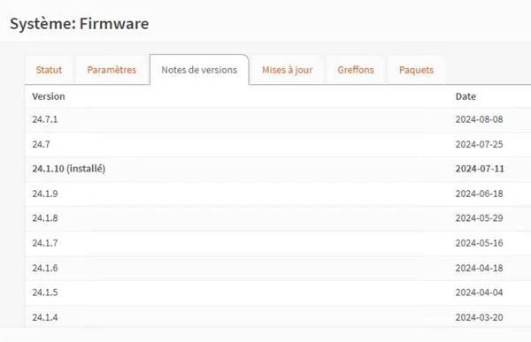


## II.OPNsenseの特徴


OPNsenseは、ファイアウォールとルーターとして機能するように設計されたオペレーティング・システムであるが、その機能は多数あり、追加パッケージをインストールすることで拡張することができる。本番環境での使用に適しており、主にネットワーク・セキュリティとフロー管理に使用される。


### A.主な特徴


OPNsenseの主な機能を紹介しよう：


- ファイアウォールと NAT**：OPNsense は、ステートフル・フィルタリングによる高度なステートフル・ファイアウォール機能と、ネットワーク Address トランスレーション（NAT）機能を提供します。


- DNS/DHCP**：OPNsense は、ネットワーク上の DNS と DHCP サービスを管理するように設定できます。DHCPサーバーとして機能するだけでなく、ローカルネットワーク上のマシンのDNSリゾルバとしても使用できます。Dnsmasqもデフォルトで統合されています。


- VPN**：OPNsenseは、IPsec、OpenVPN、WireGuardを含む複数のVPNプロトコルをサポートしており、モバイルワークステーションへのリモートアクセスやサイト間接続のためのセキュアな接続を可能にします。


- ウェブ・プロキシ**：OPNsenseには、インターネットアクセスを制御およびフィルタリングするためのWebプロキシが含まれています。また、コンテンツのフィルタリングやネットワークアクセスの管理にも使用できます。


- 帯域幅管理 (QoS)**：OPNsenseは、ネットワーク・トラフィックを優先し、ネットワーク帯域幅をよりよく管理するためのQoS（Quality of Service）管理機能を提供します。


- キャプティブポータル**：この機能により、認証ページ（ローカルベース、バウチャーなど）を介してネットワークへのユーザーアクセスを管理できます。公衆Wi-Fiネットワークによく導入されている機能です。


- IDS/IPS**：OPNsenseはSuricataを統合し、攻撃からネットワークを保護する侵入検知・防御（IDS/IPS）機能を提供します。


- 高可用性 (CARP)**：OPNsense は、複数の OPNsense ファイアウォール間の高可用性を実現する CARP (*Common Address Redundancy Protocol*) をサポートしており、ハードウェアの障害時にもサービスが有効であることを保証します。


- レポートとモニタリング**：OPNsense は、ログを作成することにより、ネットワーク・パフォーマンスを追跡し（NetFlow を使用）、潜在的な問題を検出するためのリアルタイムのレポートおよびモニタリング・ツールを提供します。これにはグラフィックも含まれます。MonitツールはOPNsenseに統合されており、ファイアウォール自体の監視を可能にします。


### B.追加パッケージ


これはOPNsenseが提供する機能の概要に過ぎません。さらに、OPNsenseの管理Interfaceからアクセスできる**パッケージ・カタログ**では、ファイアウォールを**追加機能**で充実させることができます。これにはACMEクライアント、Wazuhエージェント、NTP Chronyサービス、リバースプロキシとしてのCaddyが含まれます。


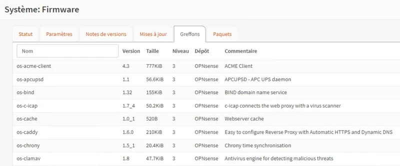


## III.OPNsenseの前提条件


まず最初に、OPNsenseをインストールする場所を決める必要があります。.NETへのインストールなど、いくつかの解決策が考えられます：


- Hyper-V、Proxmox、VMware ESXiなど、仮想マシンとしてのハイパーバイザー。
- ベアメタル*システムとしてのマシン。これはファイアウォールとして機能するミニPCかもしれない。


OPNsenseのラックマウント型アプライアンス**をオンラインストアで購入することもできます。


OPNsenseの実行に必要なハードウェア・リソースを考慮する必要があります。これについては、[このドキュメント・ページ](https://docs.opnsense.org/manual/hardware.html)で詳しく説明しています。


*制作に最低限必要なリソースと推奨されるリソース：***。


| Caractéristiques | Minimum | Recommandation |
| --- | --- | --- |
| Processeur | 1 GHz - 2 cœurs | 1.5 GHz - Multi-coeurs |
| Mémoire vive (RAM) | 2 Go | 8 Go |
| Espace de stockage pour le système | Disque dur, disque SSD ou carte SD (4 Go) | 120 Go en SSD |

最後に、**必要なリソースは、何よりも管理する接続数**に依存し、したがって**必要な帯域幅**に依存します。さらに、**有効化され使用されるサービス**（プロキシ、侵入検知など）は、CPUおよび/またはRAMを消費する可能性があるため、**留意する必要があります。


OPNsenseのインストールISOイメージも必要です。[公式サイト](https://opnsense.org/download/)からダウンロードできます。VMにインストールする場合は、イメージ・タイプとして "**dvd**"を選択し、ISOイメージを入手してください（あとはお好きなように...）。ブータブルUSBキーでインストールする場合は、"**vga**"オプションを選択して "**.img**"ファイルを入手してください。


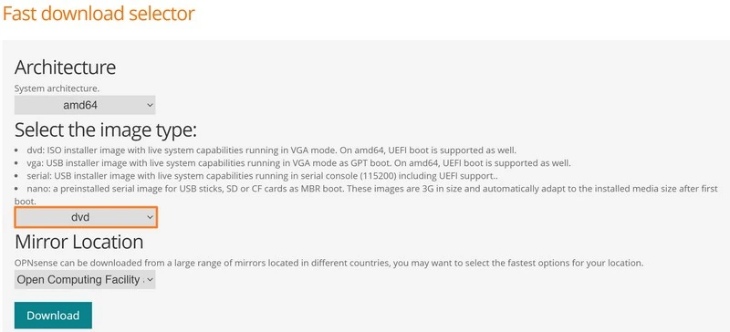


また、OPNsenseの管理およびテスト用にコンピュータが必要です。


## IV.ターゲット構成


我々の目標は


- OPNsenseファイアウォール経由でインターネットにアクセスできる内部仮想ネットワーク（192.168.10.0/24 - LAN）**を作成します。本番環境では、ローカル・ネットワーク、ケーブル・ネットワーク、Wi-Fiを使用します。
- 内部仮想ネットワークのVMがインターネットにアクセスできるように、NAT**を有効にして設定する。
- OPNsense**のDHCPサーバーを有効にして設定し、内部の仮想ネットワークに接続されている将来のマシンにIP設定を配布する。
- HTTP(80)とHTTPS(443)のLANからWANへの発信フローのみを許可するようにファイアウォール**を設定する。
- ファイアウォール**を設定し、仮想LANがOPNsenseをDNSリゾルバとして使用できるようにします(53)。


Hyper-Vプラットフォームを使用している場合、以下のように表示される：


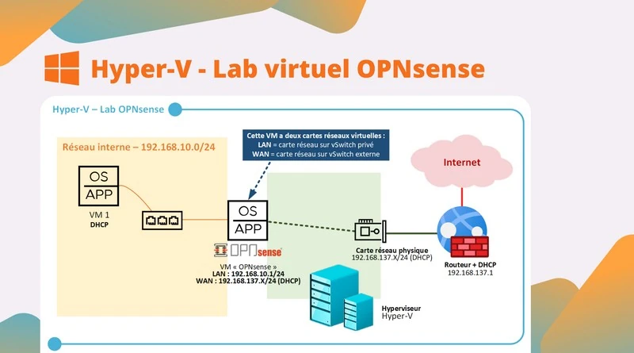


## V.OPNsense ファイアウォールのインストール


### A.ブータブルUSBキーの準備


最初のステップは、インストール・メディアの準備です： **OPNsense**のブータブルUSBキーです。もちろん、仮想環境で作業している場合はオプションですが、いずれにしてもOPNsenseのインストールISOイメージをダウンロードする必要があります。


ダウンロード後、".img "** フォーマットのイメージを含むアーカイブを入手できます。balenaEtcher**を含む様々なアプリケーションで**ブータブルUSBメモリ**を作成できます。しかも、このアプリケーションはアーカイブ内のイメージを認識するので、事前に解凍する必要はありません。


- [バレナエッチャーのダウンロード](https://etcher.balena.io/)


アプリケーションがインストールされたら、イメージとUSBキーを選択し、"Flash "をクリックします！しばらくお待ちください。


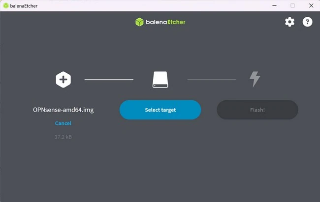


これでインストールの準備は整った。


### B.OPNsense システムのインストール


OPNsenseをホストするマシンを起動します。以下のようなウェルカムページが表示されます。数秒間、表示された画面がウィンドウに表示されます。プロセスを実行させる


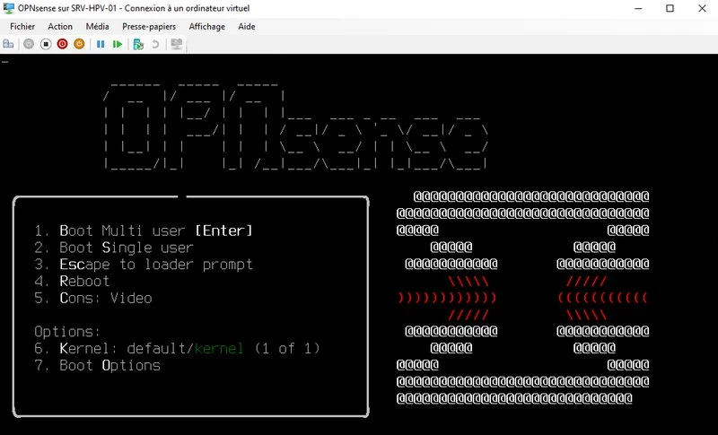


OPNsenseのイメージはマシンにロードされ、システムは「**ライブ**」モードでアクセスできる。


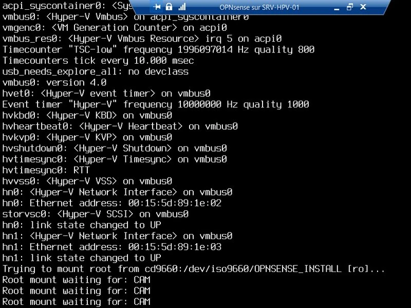


すると、以下のようなInterfaceが表示されます。ログインは「**installer**」、パスワードは「**opnsense**」です。キーボードは**QWERTY**ですのでご注意ください。この時点で、**OPNsenseのインストールプロセス**を開始します。


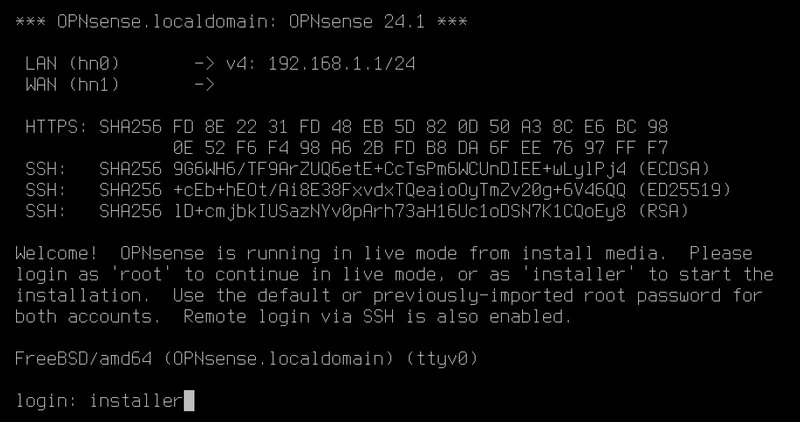


新しいウィザードが画面に表示されます。最初のステップは、設定に対応するキーボードレイアウトを選択することです。AZERTYキーボードの場合、リストから「**フランス語（アクセントキー）**」を選択し、**をダブルクリックします。


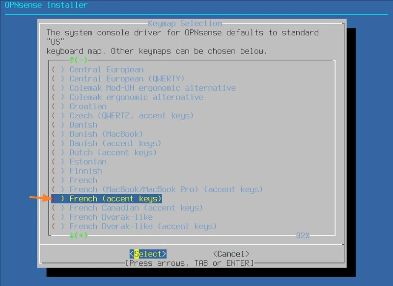


第2のステップは、実行するタスクを選択することである。ここでは、**ZFSファイルシステム**を使用してインストールを実行します。Install(ZFS)**"の行に自分を置き、**Enter**で確定する。


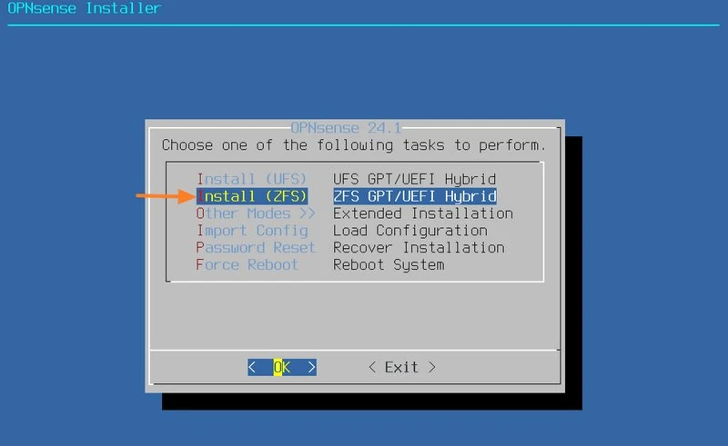


ファイアウォールのストレージとそのデータを保護するための冗長性はありません。ファイアウォールのストレージとそのデータを保護するための冗長性はありません。これは特に、RAID原理によってディスクのハードウェア障害から保護するために物理的なマシンにインストールする場合に関連します。


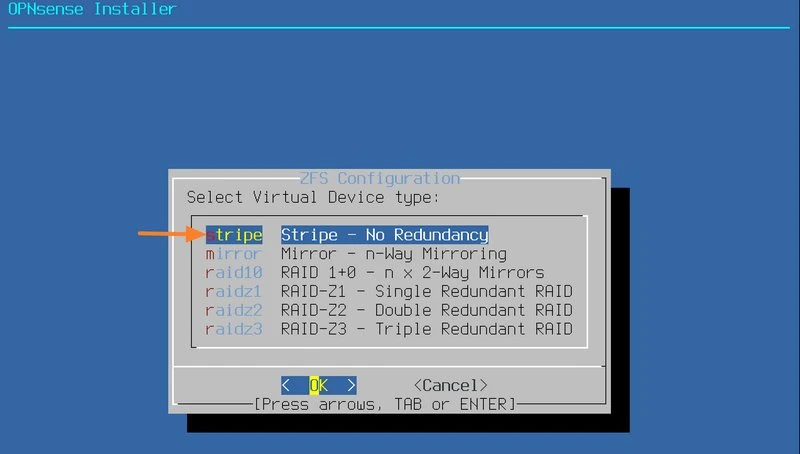


4番目のステップでは、**Enter**を押して確定するだけです。


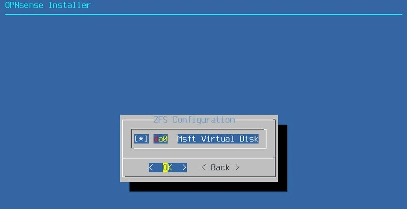


最後に "**YES**"を選択し、**Enter**キーを押して確定する。


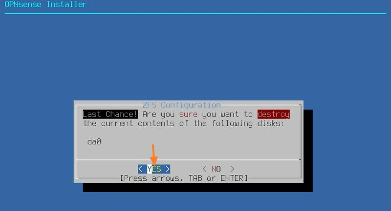


OPNsenseがインストールされるまで、しばらくお待ちください。この作業には5分ほどかかる。


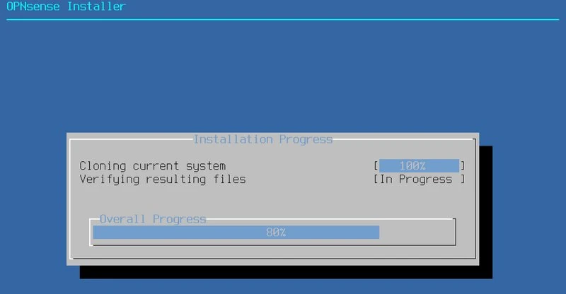


インストールが完了したら、再起動する前に "**root**"パスワードを変更します。ルート・パスワード**」を選択し、**Enter**キーを押し、パスワード「**ルート**」を2回入力する。


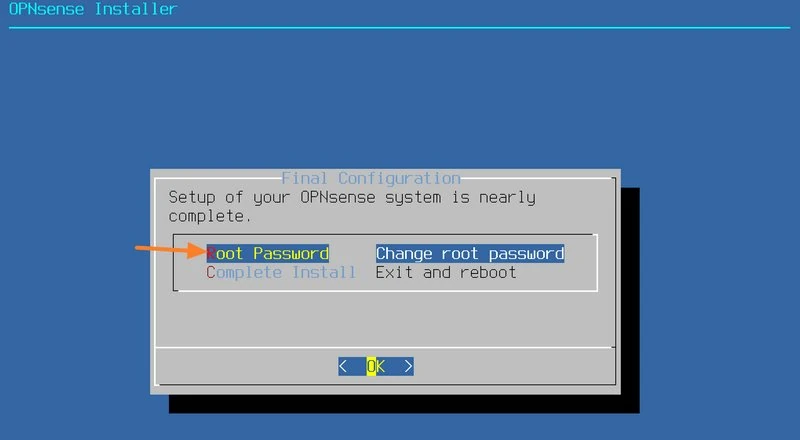


最後に、"**Complete Install**"を選択し、**Enter**を押します。この機会に、**VMのDVDドライブからディスクを取り出してください**。VMの設定では、最初の起動をディスクに設定することもできる。


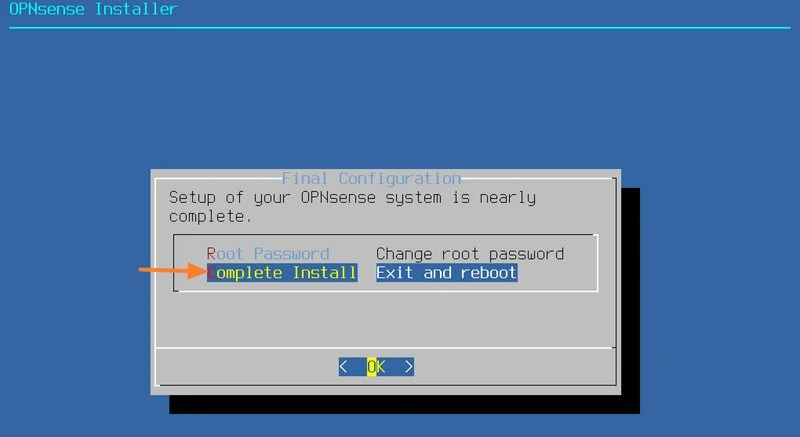


仮想マシンが再起動し、OPNsenseシステムがディスクからロードされます。コンソールの「root」アカウントと新しいパスワードでログインします（それ以外の場合、デフォルトのパスワードは「**opnsense**」です）。


### D.ネットワークインターフェースのリンク


下図の画面が表示されます。1**」を選択し、**Enter**を押すと、マシンのネットワークカードがOPNsenseインターフェースに関連付けられます。


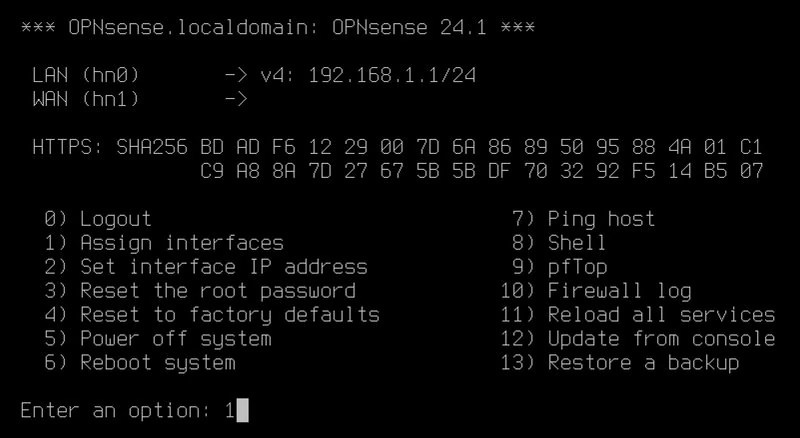


最初に、ウィザードがリンクアグリゲーションとVLANの設定を尋ねてきます。拒否する場合は「**n**」を指定し、その都度「**Enter**」で回答を確認する。次に、「**hn0**」と「**hn1**」の2つのインタフェースを「**WAN**」と「**LAN**」に割り当てる必要があります。原則として、"**hn0**"がWANに対応し、もう一方のInterfaceがLANに対応する。


仕組みはこうだ：


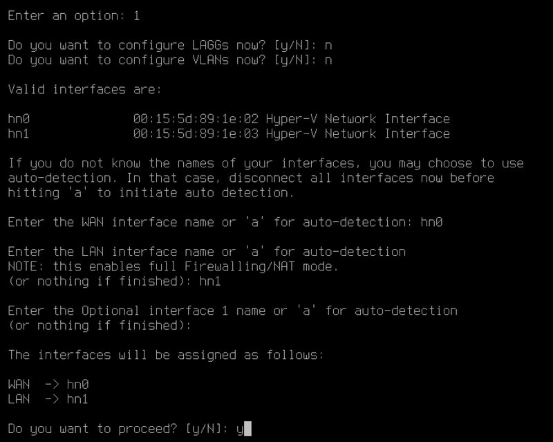


我々は今、：


- Interfaceの**LAN**は "**hn1**"ネットワークカードに関連付けられ、OPNsenseのデフォルトIP Address、すなわち**192.168.1.1/24**に関連付けられる。
- Interfaceの**WAN**は "**hn0**"ネットワークカードに関連付けられ、IP Addressはローカルネットワーク上の**DHCP**経由で取得される（外部の仮想スイッチのおかげ）。


デフォルトでは、OPNsense の管理用 Interface には LAN の Interface からしかアクセスできません。そのため、管理を行うにはファイアウォールの Interface LAN に接続する必要があります。これが不可能な場合は、WAN から OPNsense を一時的に管理することができます。この場合、ファイアウォール機能を無効にする必要があります。


これを行うには、"**8**"オプションでシェルモードに切り替え、以下のコマンドを実行する：


```
pfctl -d
```


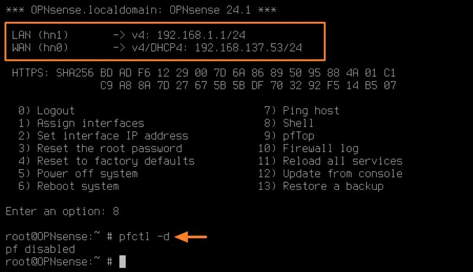


### E.OPNsense Interface管理システムへのアクセス


OPNsense Administration Interfaceは、LAN** Interface（またはWAN）のIP Addressを使用して、HTTPSでアクセスできます。ブラウザからログインページが表示されます。先ほど選択した「root」アカウントとパスワードでログインします。


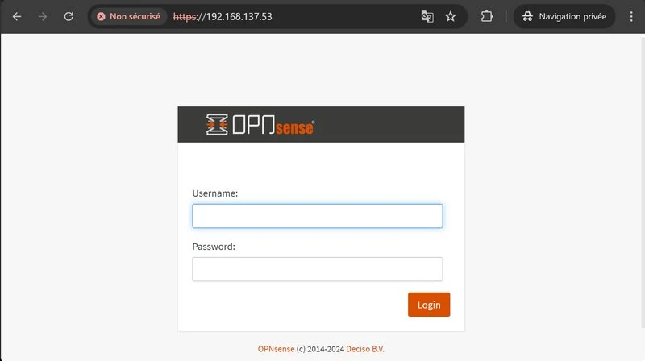


数秒待つ基本設定を行うためのウィザードが表示されます。Next**"をクリックしてください。


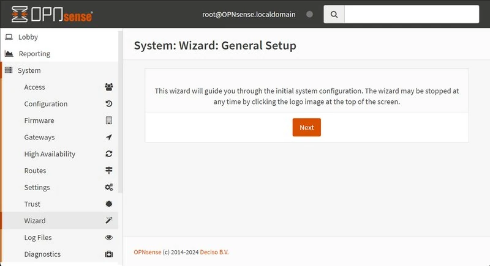


最初のステップは、ホスト名、ドメイン名を定義し、言語を選択し、名前解決に使用するDNSサーバーを定義することである。リゾルバを有効にする**」オプションは、ファイアウォールをDNSリゾルバとして使用できるようにします。


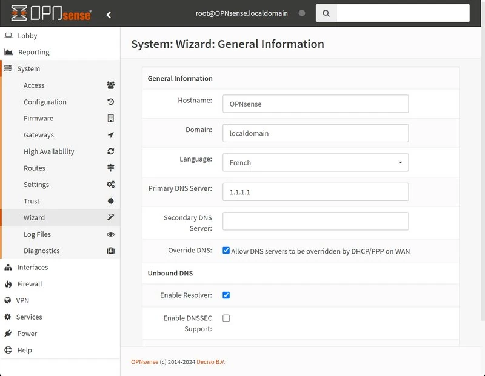


次のステップに進みます。ウィザードでは、日付と時刻を同期するためのNTPサーバーを設定するオプションがあります。さらに、（特別な要件がない限り）地理的な場所に対応するタイムゾーンを選択することが不可欠です。


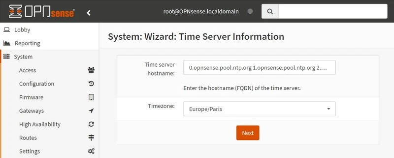


それからが重要なステップです： **Interface WAN**の設定です。現在はDHCPで設定されており、静的IPのAddressを設定しない限り、この設定モードのままです。


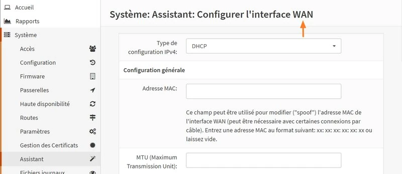


InterfaceのWAN設定ページで、WAN側のネットワークがプライベートアドレスを使用している場合は、「***WAN経由のプライベートネットワークへのアクセスをブロック**」オプションのチェックを外す必要があります。これはおそらくラボを運営している場合に該当するため、インターネットにアクセスできなくなる可能性があります。


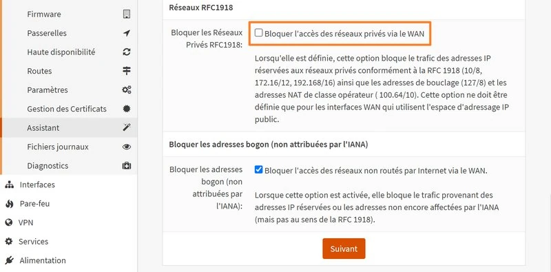


次に、"root "**パスワードを定義することができるが、これはすでにやったことなので省略できる。


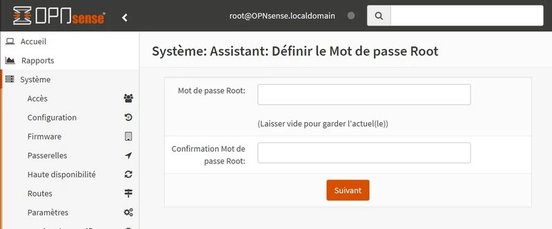


コンフィギュレーションのリロードを開始するには、このまま最後まで続ける。WAN経由で制御を続ける必要がある場合は、このプロセスが完了したら、上記のコマンドを再起動してください。


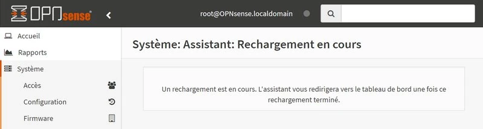


それだけだ！


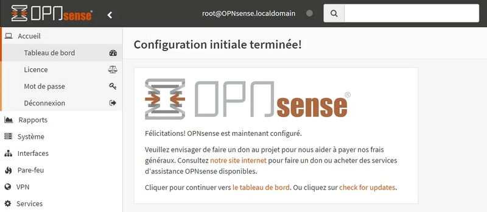


### E.DHCPコンフィグレーション


この目的は、OPNsense DHCPサーバーを使って仮想LANにIPアドレスを配布することです。そのためには、このメニューの場所にアクセスする必要があります：


```
Services > ISC DHCPv4 > [LAN]
```


**ご覧のように、DHCPはデフォルトでLAN上ですでに有効になっています。DHCPはすでに有効になっており、私たちはそれを使用したいのですが、その設定を確認することが重要です。


必要に応じて、配布するIPアドレスの範囲を変更できます： *現在の設定により、*192.168.10.10**から**192.168.10.245**に変更できます。


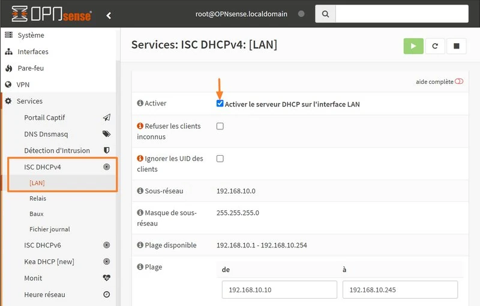


また、"**DNSサーバー**"、"**ゲートウェイ**"、"**ドメイン名**"などの フィールドは、デフォルトでは空であることがわかる。実際、これらのさまざまなフィールドには、特定のオプションとデフォルト値が自動的に継承されている。例えば、DNSサーバーについては、Interface LANのIP Addressが配布され、OPNsenseファイアウォールをDNSリゾルバとして使用できるようになります。


必要であれば、変更後に設定を保存します。


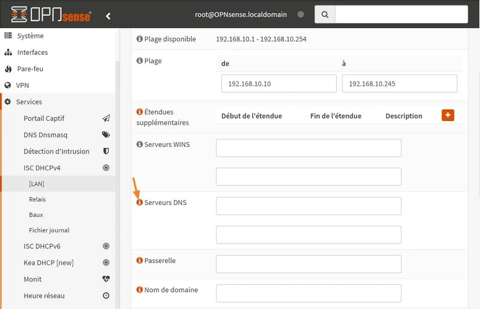


DHCPサーバーをテストするには、ファイアウォールのLANネットワークにマシンを接続する必要があります。


このマシンはOPNsense DHCPサーバーからIP Addressを取得し、私たちのマシンはネットワークにアクセスできる必要があります。インターネットにアクセスできること。WANからOPNsenseにアクセスするためにファイアウォール機能を無効にした場合、NATが無効になり、Webにアクセスできなくなりますのでご注意ください。


*注***：現在発行されているDHCPリースは、OPNsenseの管理Interfaceから見ることができます。これを行うには、次の場所に移動します： **Services > ISC DHCPv4 > Leases**.


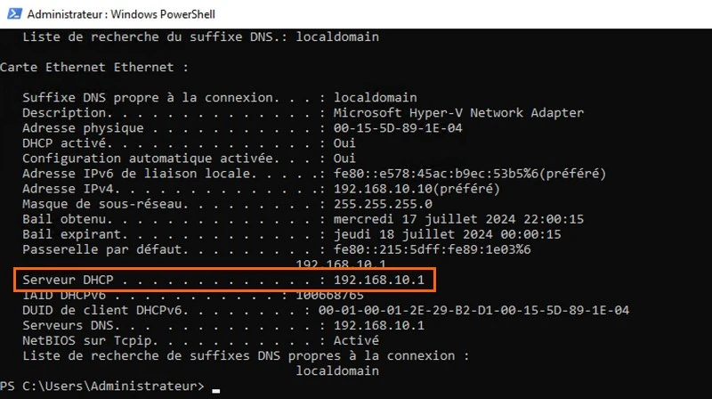


### F.NATとファイアウォールルールの設定


朗報は、LANからOPNsenseの管理用Interfaceにアクセスできるようになったことだ。


```
https://192.168.1.10
```


OPNsenseにログオンした後、NATの設定を確認しましょう。次の場所に移動します： **ファイアウォール > NAT > アウトバウンド**。ここでは、アウトバウンドNATルールの自動作成（デフォルト）と手動作成を選択できます。


発信NATルールの自動生成**」オプションで自動モードを選択し、「**保存**」をクリックします（原則として、この設定はすでにアクティブになっています）。自動モードでは、OPNsense自身が各ネットワークのNATルールを作成します。


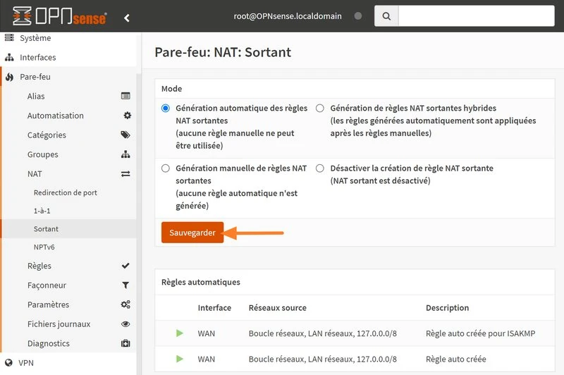


当面、仮想LAN「**192.168.10.0/24**」に接続されたすべてのコンピューターは、制限なくインターネットにアクセスできる。しかし、私たちの目標は、ファイアウォールのInterface LANで、WANへのアクセスをHTTPとHTTPSプロトコル、そしてDNSに制限することです。


そこで、ファイアウォール・ルールを作成する必要がある。以下のようにメニューをブラウズする： **ファイアウォール > ルール > LAN**.


**デフォルトでは、IPv4とIPv6**の2つのルールがあり、すべての発信LANトラフィックを許可します。各行の先頭にある左端のGreen矢印をクリックして、これら2つのルールを無効にしてください。


次に、**LANネットワーク**（すなわち「**LAN net**」）を.NETに認可するための新しいルールを3つ作成する：


- HTTP**を使用してすべての宛先にアクセスできます。
- HTTPS**ですべての宛先にアクセスできます。
- InterfaceのLAN**（つまり "**LAN Address**"）で**OPNsense**を要求し、**DNSプロトコル**（これはファイアウォールをDNSとして使用することを意味します）を介して、そうでなければIP Addressを介してDNSリゾルバを承認します。


これは次のような結果をもたらす：


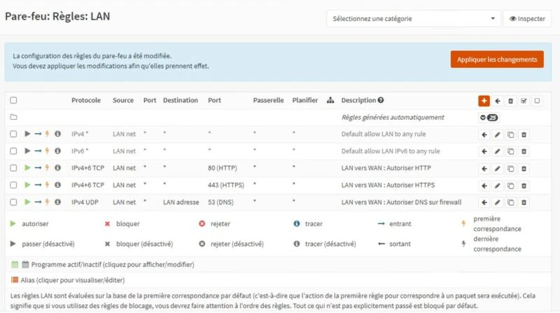


あとは、"**Apply changes**"をクリックして、新しいファイアウォールルールを本番環境に切り替えるだけです。 **明示的に許可されていないすべてのフローは、デフォルトでブロックされることに注意してください。


LANマシンはHTTPとHTTPSを使ってインターネットにアクセスできる。その他のプロトコルはすべてブロックされます。


## IV.結論


このガイドに従えば、OPNsense をインストールしてすぐに使い始めることができます。OPNsense は、ネットワーク・トラフィックを効率的に保護および管理するための幅広い機能を備えており、プロフェッショナルな環境での使用に適しています。


このインストールはほんの始まりに過ぎません。OPNsenseをあなたのニーズに適応させるために、自由にメニューを探索し、他の機能を設定してください。