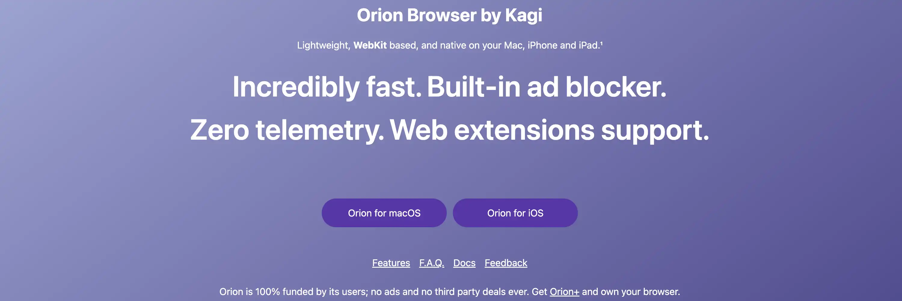


## Pendahuluan


Dalam konteks di mana sebagian besar peramban mengumpulkan data pribadi kita secara besar-besaran, pilihan peramban yang ramah privasi menjadi sangat penting. Chrome mendominasi dengan 65% pasar global, tetapi model bisnisnya didasarkan pada eksploitasi data penjelajahan Anda. Safari, meskipun terintegrasi ke dalam ekosistem Apple, tidak memiliki fitur perlindungan tingkat lanjut dan tidak secara fleksibel mendukung ekstensi pihak ketiga.


*Perincian pasar peramban web: Chrome mendominasi dengan pangsa pasar lebih dari 65%, diikuti oleh Safari, Edge, dan Firefox*


**Orion Browser** hadir sebagai alternatif yang inovatif bagi pengguna Apple. Dikembangkan oleh Kagi, peramban ini menggabungkan kecepatan mesin WebKit dengan filosofi telemetri nol. Tidak seperti para pesaingnya, Orion tidak mengirimkan data ke server jarak jauh dan secara native memblokir 99,9% iklan dan pelacak, termasuk YouTube.


Fitur uniknya? Orion adalah peramban WebKit **satu-satunya** yang dapat memasang ekstensi Chrome **dan** Firefox secara bawaan, menawarkan yang terbaik dari kedua ekstensi tersebut. Kompatibilitas ini, dikombinasikan dengan konsumsi memori 2 hingga 3 kali lebih rendah daripada browser lain dan integrasi tanpa batas dengan ekosistem Apple (iCloud, Keychain), membuatnya menjadi pilihan ideal bagi pengguna Mac dan iPhone yang sadar akan privasi.


## Mengapa memilih Orion Browser?


### Manfaat utama


**Perlindungan maksimum langsung dari kotaknya**: Orion memblokir 99,9% iklan (termasuk YouTube) dan semua pelacak pihak pertama dan pihak ketiga secara default. Teknologinya menggabungkan Pencegahan Pelacakan Cerdas WebKit dengan daftar EasyPrivacy untuk efisiensi maksimum. Fitur unik: Orion memblokir skrip sidik jari **sebelum dieksekusi**, sehingga pelacakan menjadi tidak mungkin dilakukan - sebuah pendekatan yang lebih radikal dibandingkan peramban lain yang hanya berusaha "menutupi" data.


**Telemetri nol yang dapat diverifikasi**: Orion mengambil pendekatan radikal terhadap privasi, dengan desain tanpa telemetri. Tidak seperti peramban lain, yang membuat ratusan permintaan jaringan pada saat memulai (eksponen IP, sidik jari peramban, informasi pribadi), Orion tidak pernah "menelepon ke rumah". Perbedaan mendasar ini sepenuhnya menghilangkan risiko kebocoran data yang tidak disengaja.


**Performa luar biasa**: Berdasarkan versi WebKit yang dioptimalkan, Orion menyamai atau bahkan melampaui Safari dalam hal kecepatan pada Mac. Pengujian Speedometer 2.0/2.1 secara konsisten menempatkannya di urutan pertama pada prosesor Apple Silicon. Pemblokiran iklan asli semakin mempercepat pemuatan halaman sebesar 20 hingga 40%.


**Dukungan ekstensi universal**: Sebuah inovasi besar, Orion memungkinkan Anda memasang ekstensi dari Toko Web Chrome **dan** Pengaya Mozilla. Dukungan WebExtensions saat ini masih dalam tahap percobaan, dengan target kompatibilitas 100% pada rilis beta. Anda bisa menggunakan banyak ekstensi populer seperti uBlock Origin, Bitwarden, bahkan di iPhone - yang pertama di dunia pada iOS, meskipun beberapa mungkin tidak bekerja dengan sempurna.


### Keterbatasan yang harus diperhatikan


- Ketersediaan terbatas**: Saat ini disediakan untuk macOS dan iOS/iPadOS. Versi Linux sedang mencapai tonggak pengembangan (Milestone 2 pada tahun 2025), tetapi tidak ada versi publik yang tersedia. Windows dan Android tidak dalam pengembangan karena kurangnya sumber daya.
- Kode sumber tertutup**: Meskipun beberapa komponen merupakan sumber terbuka, Orion tetap didominasi oleh hak milik, sebuah titik perdebatan dalam komunitas privasi.
- Ekstensi eksperimental**: Dukungan ekstensi masih dalam versi beta, dengan ketidaksesuaian yang sering terjadi. Ekstensi dapat memengaruhi kinerja, dan beberapa tidak berfungsi sama sekali.
- Keamanan WebKit**: Tidak seperti Chromium, WebKit tidak menawarkan isolasi proses per situs yang kuat, yang dapat menimbulkan risiko keamanan dalam skenario tertentu.
- Tes pemblokiran**: Orion memiliki kinerja yang sengaja buruk dalam tes iklan online (26-35%), karena Kagi menganggap tes ini "cacat secara fundamental". Efektivitas aktual dalam penggunaan sehari-hari jauh lebih unggul.


## Instalasi Peramban Orion


### Di macOS


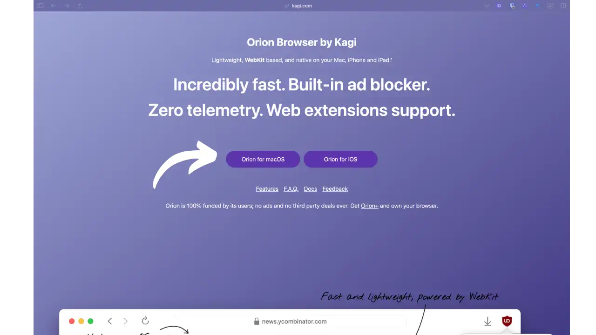


*Halaman muka Kagi menampilkan Orion Browser sebagai "peramban bebas iklan dengan perlindungan privasi total dan dukungan ekstensi universal "*


- Kunjungi [kagi.com/orion](https://kagi.com/orion/)
- Klik "**Unduh Orion untuk macOS**"


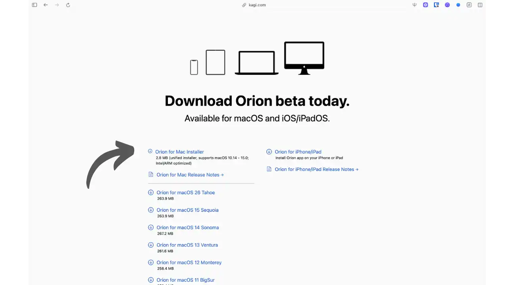


*Halaman unduhan Orion Browser yang menunjukkan ketersediaan untuk macOS dan iOS, dengan tautan ke App Store*


- Buka file `.dmg` yang telah diunduh
- Seret aplikasi Orion ke dalam folder Aplikasi
- Saat pertama kali diluncurkan, macOS akan meminta Anda untuk mengonfirmasi pembukaan


**Alternatif Homebrew**:


```bash
brew install --cask orion
```


### Pada iPhone/iPad


- Buka **App Store**
- Cari "**Browser Orion oleh Kagi**"
- Instal aplikasi gratis (kompatibel dengan iOS 15+)


### Konfigurasi awal


Saat pertama kali diluncurkan, Orion akan memandu Anda melalui beberapa langkah:


**1. Layar selamat datang


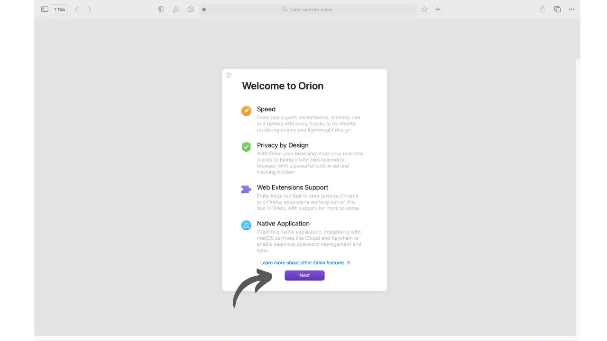


*Layar selamat datang Orion Browser menyoroti fitur-fitur utama: penjelajahan yang lebih cepat, tanpa telemetri, pemblokiran iklan, dan dukungan ekstensi*


**2. Kustomisasi Interface**


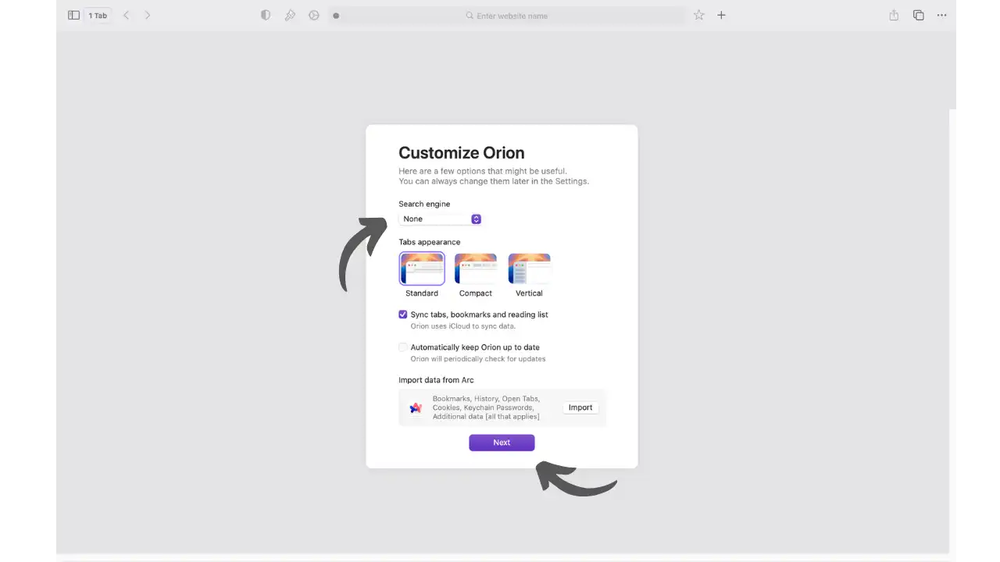


*Layar kustomisasi memungkinkan Anda mengonfigurasi tampilan tab dan Interface agar sesuai dengan preferensi Anda*


- Impor data**: Mentransfer favorit dan kata sandi dengan mudah dari Safari, Chrome, atau Firefox
- Sinkronisasi iCloud**: Aktifkan untuk menemukan favorit dan tab di semua perangkat Apple Anda


**3. Pemasangan pada perangkat seluler**


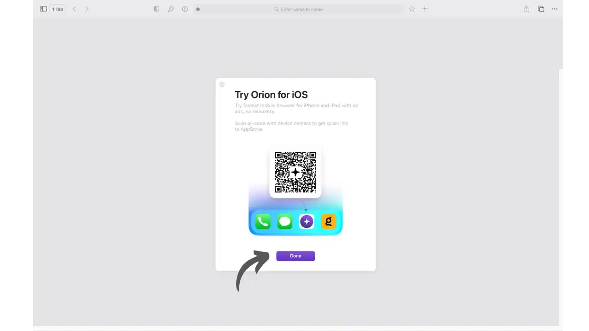


*Layar instalasi pada iOS yang menunjukkan kode QR untuk mengunduh Orion Browser dengan cepat dari App Store*


**4. Interface alat sambutan dan alat penting


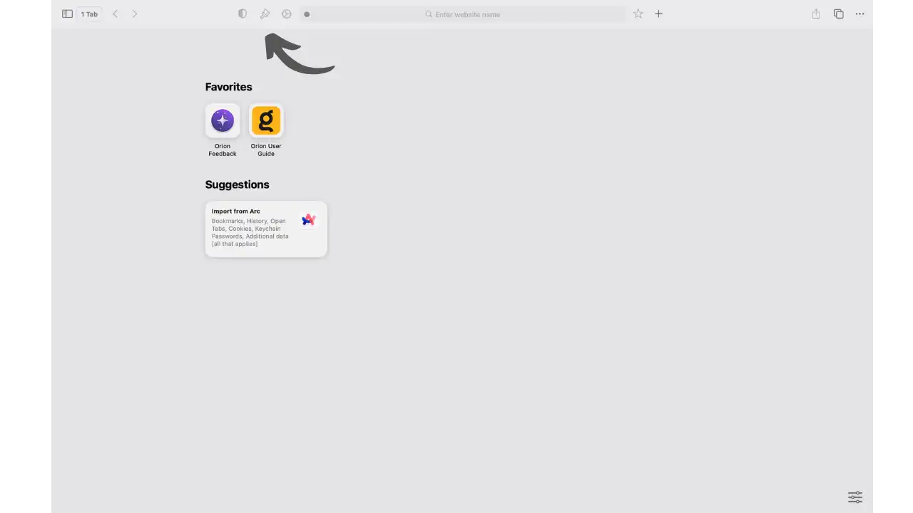


*Halaman beranda Orion Browser Interface: tanda panah menunjukkan tiga alat utama yang dapat diakses langsung dari bilah Address*


Setelah konfigurasi selesai, Anda akan menemukan Interface yang ramping dari Orion dengan **tiga alat penting** (ditunjukkan oleh tanda panah):


- Perisai 🛡️**: Menampilkan Laporan Privasi dengan jumlah item yang diblokir pada halaman saat ini
- Sikat 🖌️**: Menyesuaikan tampilan halaman (tema, font, menghapus Elements yang mengganggu)
- Perlengkapan ⚙️**: Mengonfigurasi parameter khusus situs web (izin, pemblokiran, dll.)


Alat-alat ini selalu tersedia dan memungkinkan Anda untuk mengontrol pengalaman penjelajahan Anda berdasarkan situs per situs.


**Penting**: Orion gratis dan tidak memerlukan registrasi atau pembuatan akun untuk beroperasi.


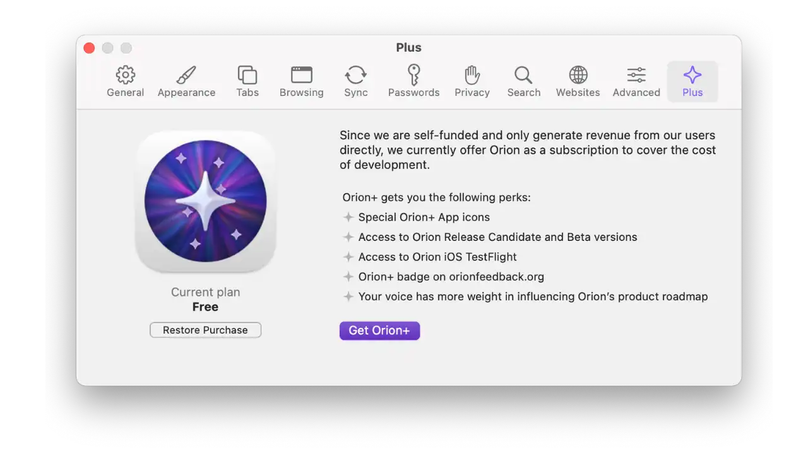


*Layar langganan Orion+ di preferensi, menawarkan langganan opsional untuk mendukung pengembangan*


**Orion+ (opsional)**: Untuk mendukung pengembangan proyek, Kagi menawarkan Orion+ ($5/bulan, $50/tahun, atau $150 seumur hidup). Langganan sukarela ini memungkinkan:


- Berkomunikasi secara langsung dengan tim pengembangan
- Mempengaruhi evolusi browser sesuai dengan kebutuhan Anda
- Akses versi Malam dengan fitur eksperimental terbaru
- Dapatkan manfaat dari mesin WebKit terbaru
- Dapatkan lencana khas di forum umpan balik


Orion+ menjamin kemandirian proyek ini: "Kontribusi keuangan Anda membantu kami tetap independen dan menepati janji kami untuk menjadi peramban terbaik bagi para pengguna". Model pendanaan dari pengguna inilah yang membuat Orion bebas dari iklan dan telemetri.


## Konfigurasi untuk kerahasiaan maksimum


### Parameter penting


Akses preferensi melalui **Orion → Preferensi** (atau ⌘,):


**1. Penelusuran - Mesin telusur pribadi**


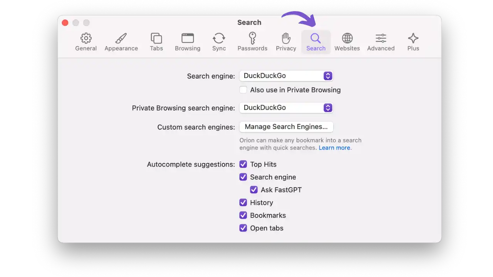


*Konfigurasi mesin pencari default: DuckDuckGo dipilih untuk privasi maksimum*


- Mesin bawaan**: Pilih **DuckDuckGo**, **Startpage** atau **Kagi** untuk privasi yang optimal (hindari Google/Bing)
- Saran pencarian**: Nonaktifkan untuk mencegah penekanan tombol bocor ke server mesin pencari


**2. Privasi - Perlindungan umum**


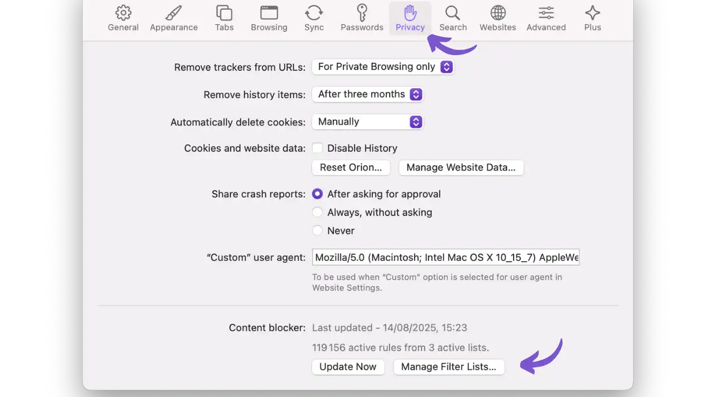


*Pengaturan privasi Orion menunjukkan Pemblokir Konten dengan 119.156 aturan aktif, opsi penghapusan pelacak, dan agen pengguna khusus*


**Pemblokir Konten aktif secara default**:


- Daftar Mudah**: 119 ribu+ aturan pemblokiran iklan
- EasyPrivacy**: Perlindungan terhadap pelacakan
- Mengelola Daftar Filter**: Menambahkan daftar tambahan (disarankan oleh Hagezi)


**Opsi privasi**:


- Menghapus pelacak dari URL**: "Hanya untuk Penjelajahan Pribadi" membersihkan tautan yang disalin
- Membagikan laporan kerusakan**: "Setelah meminta persetujuan" menghormati persetujuan Anda
- Agen pengguna khusus**: Dapat dimodifikasi untuk memintas penyumbatan tertentu


*Contoh YouTube yang dilihat dengan Orion: tidak ada iklan yang terlihat dan Laporan Privasi yang menunjukkan banyak Elements yang diblokir*


**3. Pengaturan Situs Web - Kontrol berdasarkan situs**


*Pengaturan Situs Web untuk YouTube yang menampilkan opsi kompatibilitas, pemblokiran konten, dan izin khusus situs*


**Akses cepat**: Klik pada roda gigi ⚙️ di bilah Address untuk menyesuaikan:


- Mode Kompatibilitas**: Mengatasi masalah tampilan dengan menangguhkan ekstensi
- Pemblokir Konten**: Menonaktifkan pemblokiran untuk situs tertentu jika perlu
- JavaScript/Kuki**: Kontrol granular berdasarkan situs
- Izin**: Kamera, mikrofon, lokasi dikonfigurasi secara individual


**4. Filter Khusus Tingkat Lanjut** (lihat di bawah)


**Membuat filter khusus** (Privasi → Kelola Daftar Filter → Filter Khusus):


**Sintaks yang disederhanakan** (Kompatibel dengan Adblock Plus):


- `reddit.com##.promotedlink`: Menyembunyikan postingan Reddit yang disponsori
- `|ads.example.com^`: Memblokir domain iklan sepenuhnya
- `@@||situs-utile.com^`: Membuat pengecualian untuk sebuah situs


**Saran: Kunjungi [FilterLists.com] (https://filterlists.com) untuk mendapatkan ribuan daftar khusus yang siap digunakan.


### Ekstensi yang disarankan


Orion secara bawaan mendukung ekstensi Chrome dan Firefox. Instal langsung dari toko resmi:


**Penting**:


- asal uBlock**: Menambahkan kontrol granular ke pemblokir asli
- Bitwarden**: Pengelola kata sandi sumber terbuka
- Hapus URL**: Menghapus parameter pelacakan URL


**Opsional**:


- LocalCDN**: Melayani perpustakaan bersama secara lokal
- Hapus Otomatis Cookie**: Secara otomatis menghapus cookie setelah menutup tab
- NoScript**: Kontrol penuh atas eksekusi JavaScript (pengguna tingkat lanjut)


Untuk menginstal file:


- Kunjungi [chrome.google.com/webstore](https://chrome.google.com/webstore) atau [addons.mozilla.org](https://addons.mozilla.org)
- Klik "Tambahkan ke Chrome/Firefox"
- Orion akan mencegat dan memasang ekstensi secara otomatis


**Perhatian**: Karena dukungan ekstensi bersifat eksperimental, banyak ekstensi yang mungkin tidak berfungsi dengan baik atau dapat memengaruhi kinerja. Jika terjadi masalah (situs tidak lagi berfungsi, kelambatan), nonaktifkan ekstensi satu per satu untuk mengidentifikasi sumbernya.


## Penggunaan sehari-hari


### Interface dan fitur-fitur unik


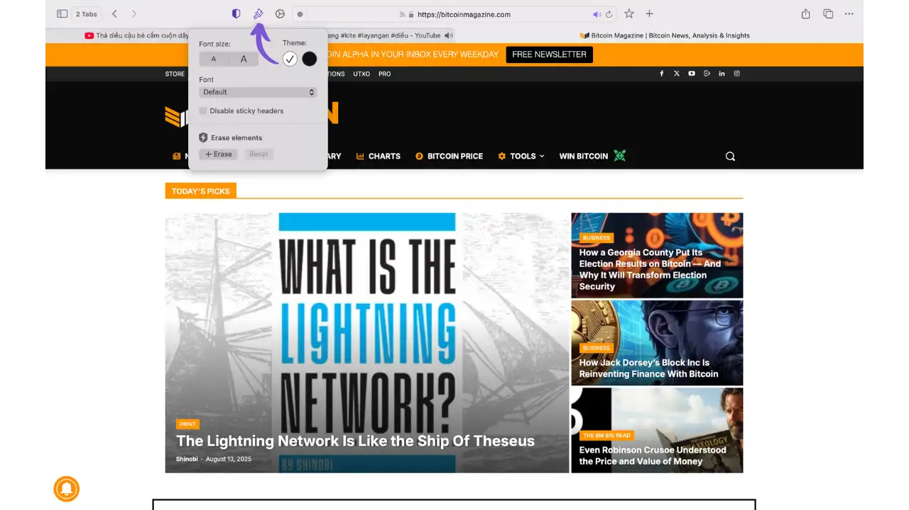


*Menu kuas Orion untuk menyesuaikan tampilan: ukuran font, tema (terang/gelap), penonaktifan tajuk yang lengket dan penghapusan Elements yang mengganggu*


**Alat kuas: kustomisasi tingkat lanjut**


Alat **brush** Orion adalah fitur unik yang memungkinkan Anda menyesuaikan tampilan setiap situs web:


**Pilihan tema**:


- Beralih antara tema terang dan gelap untuk setiap situs
- Adaptasi otomatis dengan preferensi sistem Anda


**Kontrol tipografi**:


- Ukuran huruf**: Sesuaikan keterbacaan dengan tombol A- dan A+
- Gaya huruf**: Mengubah jenis huruf (default atau kustom)


*pembersihan *Interface**:


- Menonaktifkan tajuk yang lengket**: Menghapus header yang tetap tersangkut di bagian atas saat menggulir
- Hapus Elements**: Menghapus Elements yang mengganggu secara permanen (iklan, pop-up, spanduk cookie)
  - Klik "+ Hapus" lalu pilih item yang akan disembunyikan
  - Sangat berguna untuk situs dengan iklan persisten atau pelacakan visual Elements


**Ketekunan**: Semua pengaturan ini disimpan per domain dan secara otomatis diterapkan kembali saat Anda berkunjung kembali.


**Manajemen tab lanjutan**:


- Tab vertikal**: Aktifkan melalui bilah menu (Fungsi Tab di Samping)
- Tab yang ringkas**: Dalam Preferensi → Tab → Tata Letak "Ringkas" untuk menghemat ruang
- Grup tab**: Atur sesi Anda berdasarkan tema
- Beberapa profil**: Buat identitas terpisah melalui bilah menu (fungsi Profil) dengan data yang sepenuhnya terisolasi


**Mode Daya Rendah**: Terinspirasi dari iPhone, mode ini secara otomatis menangguhkan tab yang tidak aktif setelah 5 menit dan dapat mengurangi konsumsi energi hingga 90%. Aktifkan melalui bilah menu Orion di Mac, atau di pengaturan pada iOS.


**Alat bantu bawaan** (Menu edit dan lainnya):


- Edit Teks di Halaman**: mengubah teks apa pun untuk sementara (menu Edit)
- Izinkan Salin & Tempel**: Melewati pembatasan penyalinan (menu Edit)
- Salin Tautan Bersih**: Klik kanan pada tautan untuk menghapus parameter pelacakan
- Mode Fokus**: navigasi layar penuh yang bebas gangguan
- Gambar dalam Gambar**: Menonton video di jendela mengambang
- Buka di Internet Archive**: Akses langsung ke versi arsip
- Laporan Privasi**: Klik pada perisai 🛡️ untuk melihat item yang diblokir berdasarkan halaman


### Manajemen penjelajahan pribadi


Penawaran navigasi pribadi Orion (⌘⇧N):


- Isolasi lengkap cookie dan sesi
- Penghapusan otomatis saat penutupan
- Riwayat dan penonaktifan cache
- Perlindungan yang ditingkatkan terhadap sidik jari


**Kiat**: Untuk kompartementalisasi tingkat lanjut, buat **profil terpisah** melalui menu bar (fungsi Profil). Setiap profil muncul sebagai aplikasi terpisah di Dock, dengan pengaturan, ekstensi, dan datanya yang sepenuhnya terisolasi.


### Optimalisasi kinerja dan privasi


Untuk menjaga Orion tetap cepat dan privat:


- Ekstensi**: Batasi hingga batas minimum yang ketat (dapat mengurangi kinerja)
- Mode Daya Rendah**: Aktifkan untuk sesi yang panjang (kemungkinan penghematan 90%)
- Laporan Privasi**: Klik pada perisai 🛡️ untuk melihat penyumbatan secara real time
- Kustomisasi visual**: Gunakan kuas 🖌️ untuk menyesuaikan tampilan dan menghapus Elements yang mengganggu
- Salin Tautan Bersih**: Klik kanan untuk menyalin tautan tanpa pelacak
- Profil terpisah**: Gunakan profil khusus untuk mengelompokkan aktivitas Anda
- Pengaturan Situs Web**: Klik pada roda gigi ⚙️ untuk menyesuaikan izin berdasarkan situs
- Pembersihan rutin**: Menghapus cache melalui Orion → Hapus Data Penjelajahan


## Perbandingan dengan alternatif


| Critère | Orion | Safari | Chrome | Firefox | Brave |
|---------|-------|--------|---------|----------|--------|
| **Télémétrie** | Aucune | Minimale | Extensive | Modérée | Minimale |
| **Bloqueur natif** | 99,9% efficace | Basique | Absent | Partiel | Complet |
| **Extensions** | Chrome + Firefox | Limitées | Chrome uniquement | Firefox uniquement | Chrome uniquement |
| **Performance Mac** | Excellente | Excellente | Bonne | Moyenne | Bonne |
| **Consommation RAM** | Très faible | Faible | Élevée | Moyenne | Moyenne |
| **Open Source** | Partiel | Partiel (WebKit) | Partiel | Complet | Complet |
| **Plateformes** | Mac/iOS | Mac/iOS | Toutes | Toutes | Toutes |

**Versus Safari**: Orion menawarkan perlindungan yang unggul dengan pemblokir canggih dan dukungan ekstensi, sambil mempertahankan kinerja WebKit.


**Versus Chrome**: privasi yang tak tertandingi tanpa mengorbankan kompatibilitas, berkat dukungan untuk ekstensi Chrome.


**Versus Firefox**: Lebih cepat di Mac, Interface lebih intuitif, tetapi kontrolnya kurang terperinci dan bukan sumber terbuka.


**Versus Brave**: Filosofi yang serupa, tetapi Orion menghindari kontroversi kripto/BAT dan menawarkan integrasi Apple yang lebih baik.


## Kasus penggunaan yang disarankan


**Ideal untuk **:


- Pengguna Apple yang mencari privasi lebih dari Safari
- Orang yang ingin memblokir semua iklan (termasuk YouTube) tanpa ekstensi
- Pengembang yang membutuhkan alat bantu WebKit dengan perlindungan privasi terintegrasi
- Pengguna iPhone yang menginginkan ekstensi desktop di ponsel (inovasi unik)
- Profesional yang perlu mengkotak-kotakkan aktivitas mereka (beberapa profil)
- Pengguna ponsel yang mencari manajemen baterai yang lebih baik (Mode Daya Rendah)


**Hindari jika **:


- Anda umumnya menggunakan Windows/Linux (tidak ada versi yang tersedia)
- Sumber terbuka penuh sangat penting untuk model ancaman Anda
- Anda bergantung pada ekstensi tertentu yang mungkin tidak berfungsi
- Anda memerlukan sinkronisasi lintas platform di luar ekosistem Apple
- Anda lebih memilih solusi yang sudah terbukti dan stabil (status beta permanen sejak 2021)


## Poin-poin yang perlu diperhatikan dan aman


### Fitur keamanan yang unik


**Perlindungan anti-sidik jari yang revolusioner**: Orion adalah satu-satunya peramban yang memblokir eksekusi skrip sidik jari secara penuh sebelum skrip tersebut dapat memindai sistem Anda. Pendekatan "tidak ada skrip yang berjalan = tidak ada sidik jari yang mungkin" ini mengungguli metode penyamaran tradisional yang digunakan oleh peramban lain.


**Daftar Putih Transparan**: Orion memelihara daftar kecil situs publik (browserbench.org, wizzair.com) di mana pemblokiran secara otomatis dinonaktifkan untuk menghindari kegagalan fungsi. Transparansi ini memungkinkan pengguna untuk memahami dengan tepat kapan dan mengapa pemblokiran dikurangi.


**Ekstensi yang belum diaudit**: Dukungan untuk ekstensi Chrome/Firefox menimbulkan risiko tambahan, karena ekstensi ini tidak dirancang untuk WebKit dan tidak diaudit secara khusus untuk lingkungan ini.


### Pemeliharaan dan pembaruan


- Pembaruan otomatis**: Orion diperbarui secara otomatis di macOS melalui Sparkle
- Pelacakan kerentanan**: Periksa catatan rilis secara teratur untuk mengetahui patch keamanan
- Pelaporan bug**: Gunakan [orionfeedback.org](https://orionfeedback.org) untuk melaporkan masalah


## Kesimpulan


Orion Browser merupakan langkah maju yang signifikan untuk privasi di macOS dan iOS. Pendekatan tanpa telemetri, dikombinasikan dengan pemblokir asli yang sangat efisien dan dukungan unik untuk ekstensi universal, menjadikannya pilihan yang sangat baik bagi pengguna Apple yang sadar akan privasi.


**Penting**: Orion tetap dalam versi beta permanen sejak tahun 2021, dengan keterbatasan kompatibilitas ekstensi dan risiko WebKit yang melekat. Kaji pertukaran ini sesuai dengan model ancaman Anda.


Untuk penggunaan sehari-hari di Mac atau iPhone, ini mungkin merupakan kompromi terbaik antara kerahasiaan, performa, dan kemudahan penggunaan yang tersedia di ekosistem Apple, asalkan Anda menerima keterbatasannya.


Ingat: melindungi privasi Anda tidak hanya bergantung pada peramban Anda. Kombinasikan Orion dengan praktik terbaik (kata sandi yang kuat, 2FA, VPN jika perlu) untuk keamanan online yang optimal.


## Sumber daya dan dukungan


### Dokumentasi resmi


- Situs web resmi**: [kagi.com/orion](https://kagi.com/orion/)
- Pertanyaan Umum Lengkap**: [browser.kagi.com/faq](https://browser.kagi.com/faq)
- Forum komunitas**: [community.kagi.com](https://community.kagi.com)
- Pelacakan bug**: [orionfeedback.org](https://orionfeedback.org)
- GitHub Orion**: [github.com/OrionBrowser](https://github.com/OrionBrowser) - Komponen sumber terbuka
- Blog Kagi**: [blog.kagi.com](https://blog.kagi.com) - Berita dan pembaruan


### Tes verifikasi yang disarankan


Setelah konfigurasi, uji pengaturan Anda:


- [Cover Your Tracks (EFF)](https://coveryourtracks.eff.org/) - Tes sidik jari
- [Tes Kebocoran DNS](https://www.dnsleaktest.com/) - Periksa kebocoran DNS
- [BrowserLeaks](https://browserleaks.com/) - Rangkaian lengkap tes privasi


### Alternatif pada Plan ₿ Network


Untuk perlindungan maksimal, bacalah panduan kami yang lain:


- [Firefox yang diperkeras](https://planb.network/tutorials/computer-security/communication/firefox-11814cec-3415-4ed9-a06e-f6fda5c9510f) - Konfigurasi multi-platform tingkat lanjut
- [Tor Browser](https://planb.network/tutorials/computer-security/communication/tor-browser-a847e83c-31ef-4439-9eac-742b255129bb) - Anonimitas jaringan lengkap
- [Browser Mullvad](https://planb.network/tutorials/computer-security/communication/mullvad-browser-a16c13d6-8bf9-4cb5-9aa0-85411a9cda0e) - Perlindungan sidik jari maksimum


Jika Anda ingin mempelajari lebih lanjut tentang sejarah dan pengoperasian browser, serta objek digital utama dalam kehidupan sehari-hari, saya mengundang Anda untuk menemukan kursus pelatihan gratis kami yang baru, SCU 202, yang tersedia di Plan ₿ Network:


https://planb.network/courses/4ba0e3de-e67f-4ea1-a514-f111206810d1
