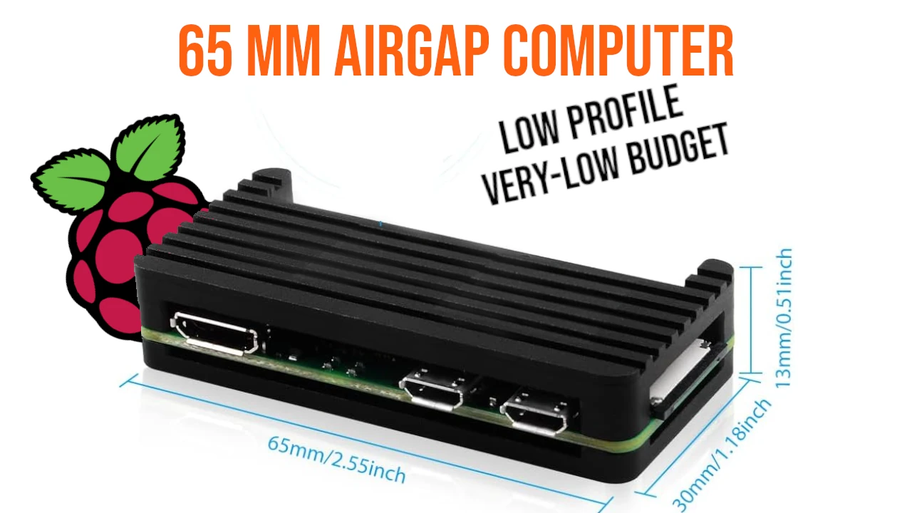

Se sei sulle pagine di Plan ₿ Network da un po', hai già imparato che una delle più caldeggiate impostazioni di sicurezza, pressoché irrinunciabile, **è la gestione dei fondi tramite la conservazione offline delle tue chiavi private**.

Se non lo hai ancora scoperto, nel corso di questo tutorial troverai i link a risorse open source con cui approfondire l'argomento.

Per gestire offline le chiavi private, dunque, serve un dispositivo perennemente scollegato dalla rete, che sia un [hardware wallet](https://planb.network/resources/glossary/hardware-wallet) o un computer airgap, da dedicare a questa specifica funzione.

Come fare se, ad esempio, non si ha la possibilità di acquistare hardware che svolga solo questo compito, ma non si vuole rinunciare a questo step di sicurezza?

## La Soluzione
Se ti dicessi che puoi realizzare un dispositivo offline, sotto forma di computer airgap che ha le dimensioni e il peso di una chiavetta USB e costa 35 euro? Non ci credi?

Continua a leggere. 

Ti dirò di più: leggi fino in fondo. La soluzione proposta è economica, ma non è esattamente la più semplice. Prima ti fai un'idea generale, poi deciderai di investire un po' del tuo tempo in alcune ricerche personali e scegliere, con tutta la serenità possibile, se e come procedere.

## Requisiti
**1** Una [Raspberry PI Zero](https://www.raspberrypi.com/products/raspberry-pi-zero/): la PI Zero (senza alcuna sigla al seguito) è la base per realizzare un computer dalle prestazioni minime, ma è soprattutto priva delle schede Wi-Fi e Bluetooth, requisiti indispensabili per lo scopo di questa esercitazione.

- **Costo**: circa 15,00 euro al momento della stesura di questo tutorial (agosto 2025).
- **Continuità di produzione**: Raspberry garantisce la produzione fino a gennaio 2030.

Le PI Zero senza Wi-Fi e Bluetooth, sono purtroppo diventate praticamente introvabili. Potresti trovare più agevolmente le alternative PI Zero W e PI Zero 2W. In questo caso, potrai disabilitare le funzioni di connessione cambiando il file config. Dopo aver installato il sistema operativo, dovrai aggiungere queste voci alla configurazione:

``` 
dtoverlay=disable-wifi
dtoverlay=disable-bt
```

una sezione di questa guida ti mostrerà come e dove farlo. Comunque, se vuoi proprio essere sicuro, puoi trovare sul web diversi tutorial per eliminare il chip Wi-Fi con una piccola tronchesina, di quelle adatte alla lavorazione sulle schede elettroniche.

**2** Uno _starter kit_ per Raspberry PI Zero: come è prassi per il mondo Raspberry, nudo e crudo, senza case esterno. Inoltre, le limitate risorse di una scheda così piccola, condizionano le possibilità di connessione con l'esterno.

Quando ho deciso di procedere, ho trovato [questo kit](https://www.amazon.it/-/en/GeeekPi-Raspberry-Aluminum-Passive-Heatsink/dp/B0BJ1WWHGF?crid=1NAFFVHG3IFBU&sprefix=raspberry+pi+zero+kit+geeek+pi%2Caps%2C88&sr=8-65) pieno di accessori, per sfruttare appieno tutte le potenzialità della PI Zero. Il kit contiene, infatti, un alimentatore USB A -> micro USB, un piccolo hub USB, un adattatore mini-HDMI -> HDMI, un dissipatore in rame e un case esterno in alluminio. Insieme al kit sono fornite anche le viti e la brugola necessarie per mettere la PI Zero nel nuovo case.

- **Costo**: 19,99 euro.

**3** Questo tutorial non prevede che tu spenda grandi budget per la realizzazione del computer airgap. Devi però sapere che ti serviranno una tastiera e un mouse USB (rigorosamente via cavo, evita il Bluetooth) e un monitor. A seconda dell'ingresso al tuo monitor, potrebbe servirti un adattatore da mini-HDMI, l'unica uscita disponibile sulla PI Zero. Infine, cerca bene che in casa, da qualche parte, abbiamo tutti una tastiera e un mouse non-wireless: è arrivato il momento di rispolverarli.

## Extra Budget

**4** Puoi procurarti l'alimentatore originale da Raspberry, del costo di circa 15,00 euro.

**5** Personalmente ho optato per utilizzare l'alimentatore fornito nello _starter kit_, unendolo però ad un cavetto USBA → miniUSB cosiddetto `no data`, del costo di 3,70 euro.

**6** Una scheda micro SD, per avere un minimo di memoria di massa almeno da 32 GB; se di qualit/livello industriale è meglio.

**7** Ti servirà un sistema, un adattatore da USB a micro SD, come quello che vedi in foto. Il sistema operativo della tua PI Zero e la sua memoria, infatti, lavoreranno su tale supporto.

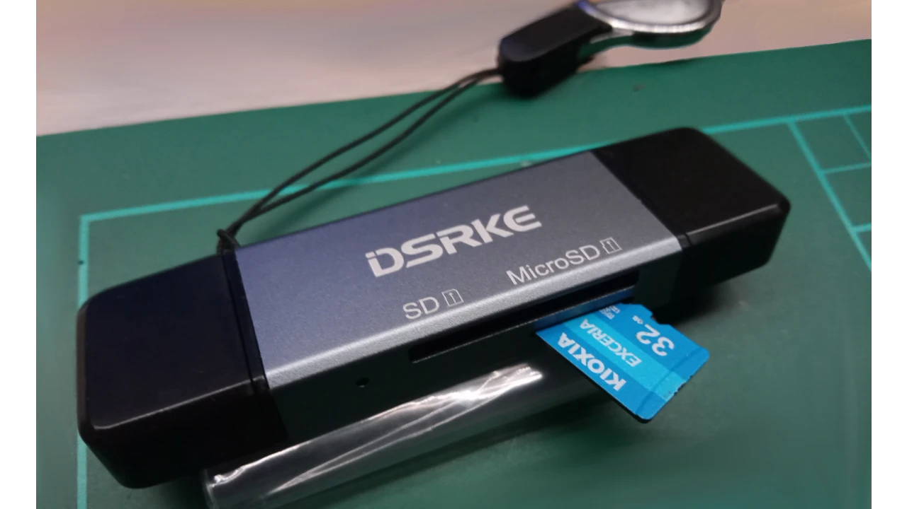

## Installazione del Sistema Operativo
Prima di chiudere la tua PI Zero nel case, ti consiglio di installare il sistema operativo. Potrai così controllare il led che indica il funzionamento, in maniera immediata.

Per scegliere e masterizzare il sistema operativo, ho optato per la via più semplice: usare il tool `PI Imager` di Raspberry.


Vai quindi sul [Github di Raspberry](https://github.com/raspberrypi/rpi-imager/releases) per scaricare l'ultima release dell'Imager, scegliendo quella più adatta al tuo sistema operativo (v. 1.9.6 al momento della stesura). Noterai che, accanto ad ogni asset, c'è anche l'hash del file corrispondente. Ci tornerà utile per la verifica.


Ti consiglio di verificare il sistema operativo che utilizzerai sul tuo computer airgap, per tua tranquillità personale. Questa operazione ti darà la certezza che stai operando con una versione legittima (non malevola) dell'Imager e, di conseguenza, di Raspi OS.

Fai la verifica subito al download, con la tua macchina che usi normalmente connessa a Internet

Apri quindi il terminale Linux e prepara il download, creando una directory `raspios` utile per lavorarci.

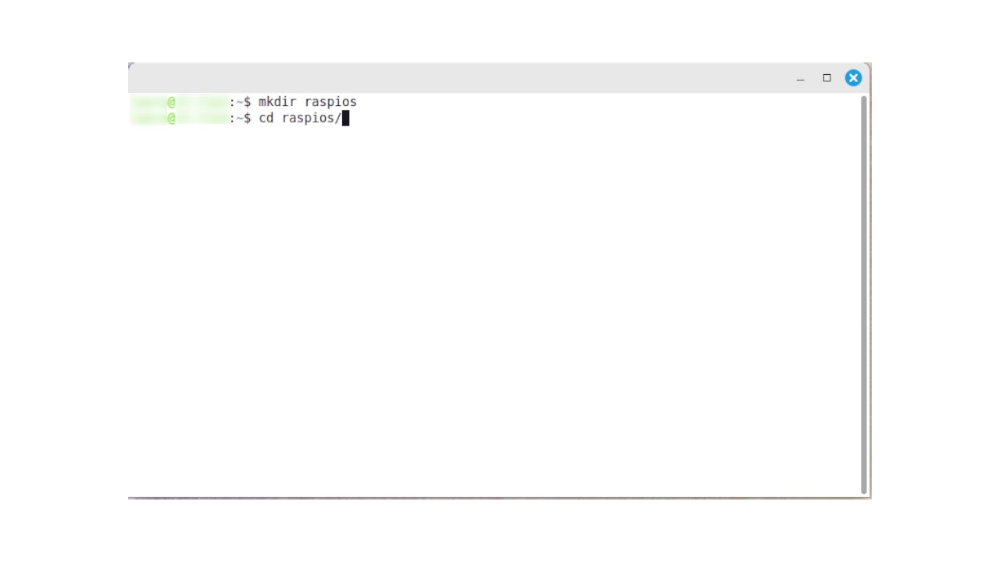

Scarica l'Imager per la tua distribuzione Linux con `wget`.

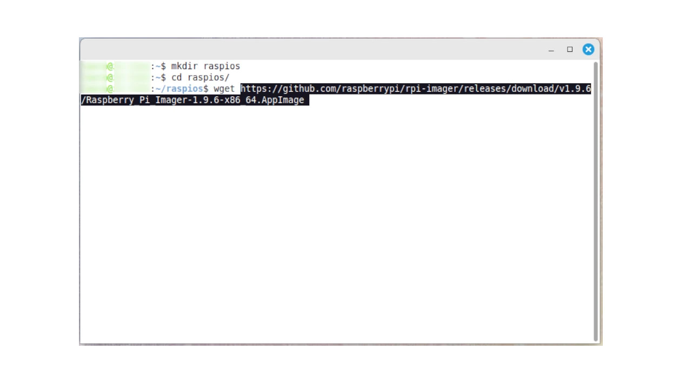

Infine, esegui il comando `sha256sum` del file e confronta l'hash con quello fornito da Raspberry nel suo Github.

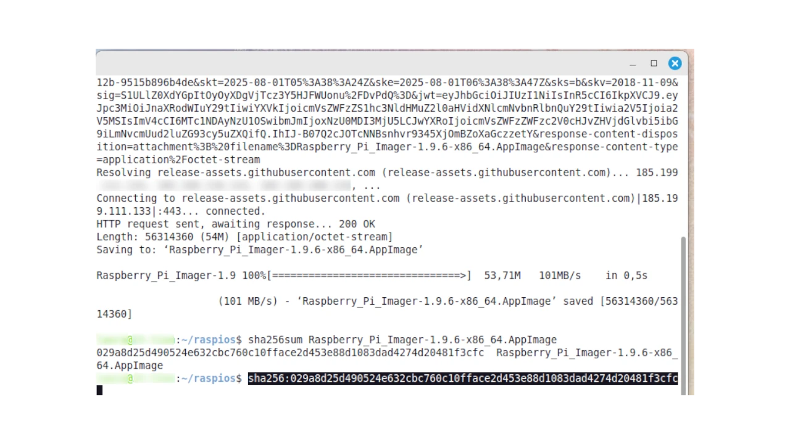

Oppure, se hai Windows, apri la Power Shell e digita il seguente comando:

``` 
Get-FileHash -Path <yourpath>\imager-1.9.6.exe
```


Otterrai l'hash che deve coincidere con quello pubblicato sul Github di Raspberry.

Una volta verificato il download, puoi installare Imager sul tuo computer quotidiano ed aprirlo. Imager è lo strumento che serve per masterizzare il sistema operativo sulla micro SD, che sarà il "disco di sistema" della PI Zero.

Il procedimento è estremamente semplice: scegli innanzitutto il dispositivo Raspberry che andrai ad utilizzare (pertanto presta attenzione al **tuo modello** di Raspi Zero), poi la versione del sistema operativo e infine il mount point della  scheda micro SD su cui flashare il S.O.

### Primo Step


### Secondo Step

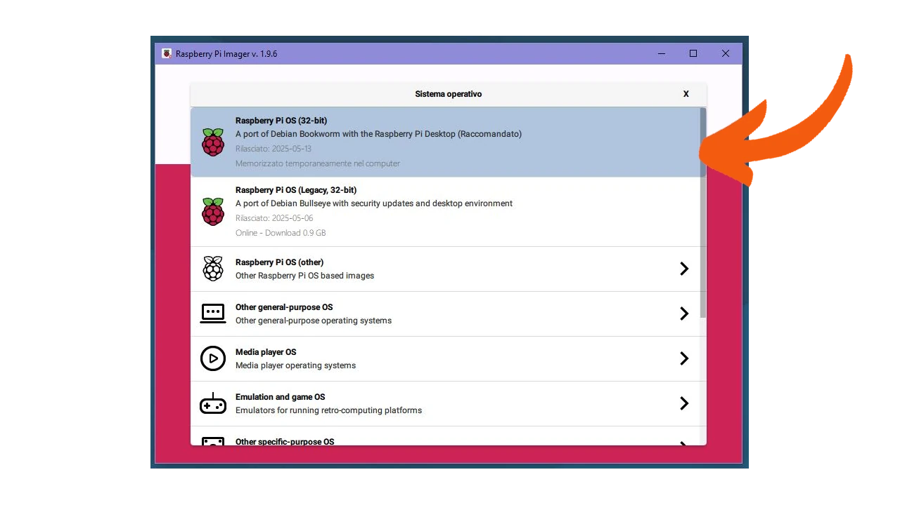

**Nota bene**: scegli `PI OS a 32 bit`, l'unico che funziona con la PI Zero.

### Terzo Step


(Fai molta attenzione a lasciare selezionato _Escludi unità di sistema_ per evitare che ti venga proposto di installare il sistema operativo di Raspi sul tuo computer).

Quando è tutto impostato, l'Imager ti chiederà se desideri usare impostazioni personalizzate. Scegli quello che desideri, oppure clicca _No_ per proseguire con le opzioni predefinite.

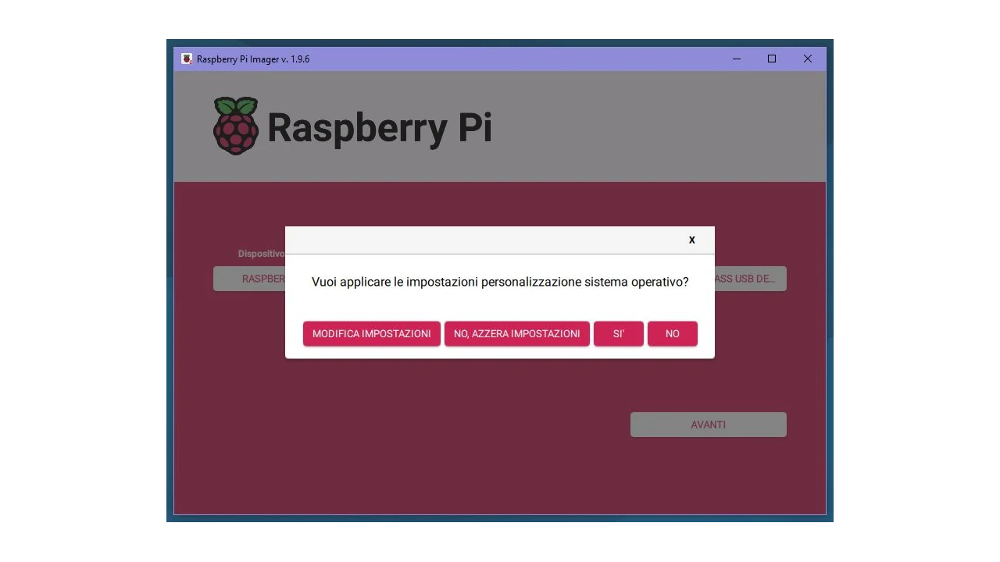

Conferma di voler cancellare il contenuto della micro SD

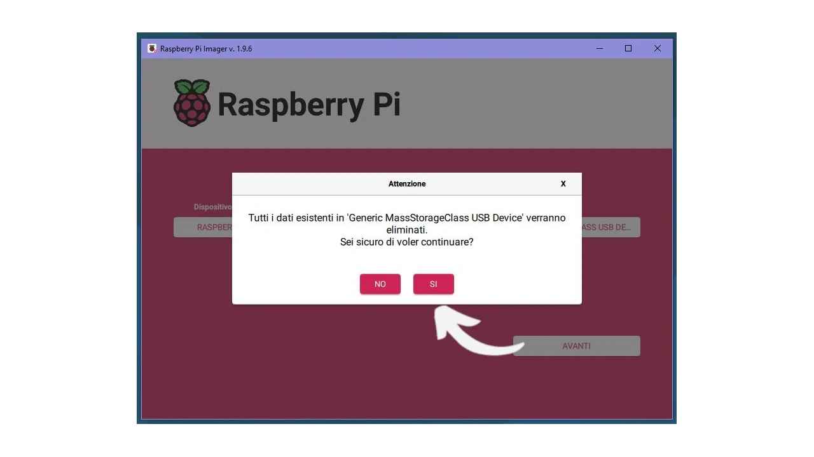

L'Imager inizia a flashare il sistema operativo sulla micro SD, una barra di scorrimento ti avviserà dello stato di avanzamento.


Al termine c'è la verifica automatica, ti consiglio di non interromperla.


Infine compare un messaggio sullo schermo e, se tutto è andato a buon fine, è uguale a quello che leggi in foto.

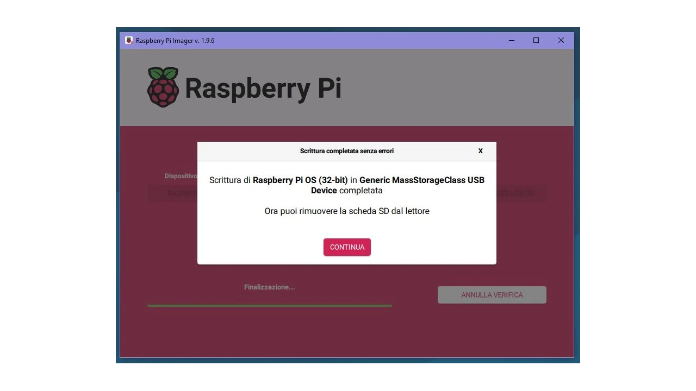

Ora puoi davvero rimuovere la micro SD dal lettore e posizionarla nello slot della PI Zero. Accendi la piccola Raspberry e osserva il led: ci aspettiamo che sia di colore verde e che lampeggi indicando il normale caricamento del sistema operativo, per poi rimanere acceso in maniera continuativa. Se hai altre indicazioni, ad esempio se il led lampeggia a frequenza regolare o è di colore rosso, consulta le FAQ o [le pagine del forum di supporto](https://forums.raspberrypi.com/).

## Prima Configurazione
Il primo avvio di Raspi OS è un po' più lento del solito, perché deve compiere una serie di operazioni di vera e propria installazione. Ma se tutto è andato per il meglio, troverai una schermata di benvenuto.

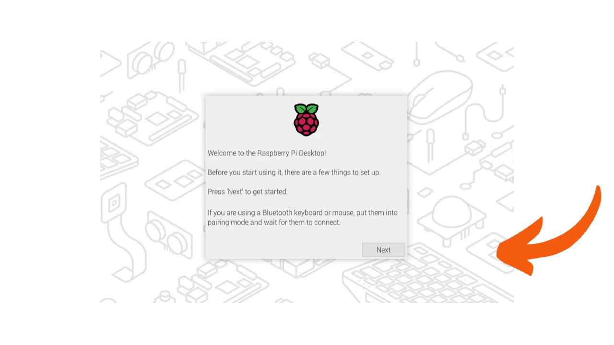

Clicca su _Next_ per impostare la regione geografica, soprattutto per il caricamento della tastiera corretta. Fai attenzione soprattutto a quest'ultima.

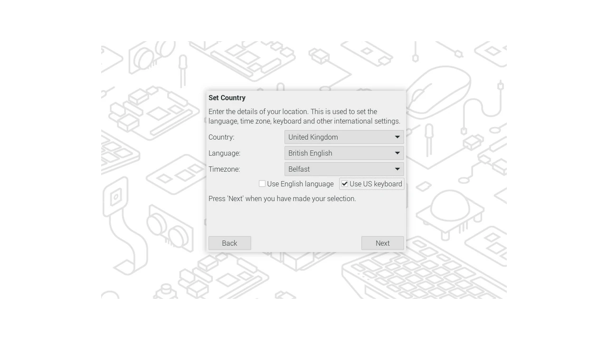

Cliccando su _Next_ ti verrà chiesto di creare il tuo utente, appuntati le credenziali e conservale bene.

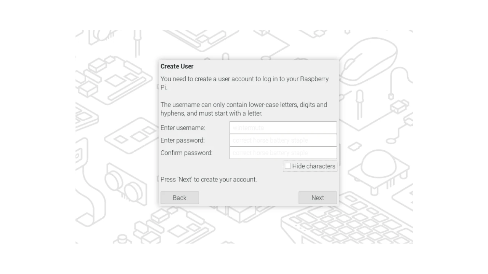

Il wizard ti chiede di scegliere un browser web predefinito, tra Chromium e Firefox; potrebbe anche chiederti delle impostazioni per la rete Wi-Fi, se stai lavorando con una PI Zero W o 2W. Clicca pure _Skip_.

Ad un certo punto ti verrà proposto di aggiornare il software a bordo e il sistema operativo. Scegli _Skip_: per gli scopi di questa esercitazione stiamo infatti realizzando una macchina offline, che deve rimanere fuori rete già da questo momento.

Infine, potrebbe chiederti di attivare `ssh`, ma declina anche questo passaggio, trattandosi di una PI Zero airgap.


Non c'è molto altro da configurare. Al termine, riavvia la Raspberry affinché le modifiche abbiano effetto.

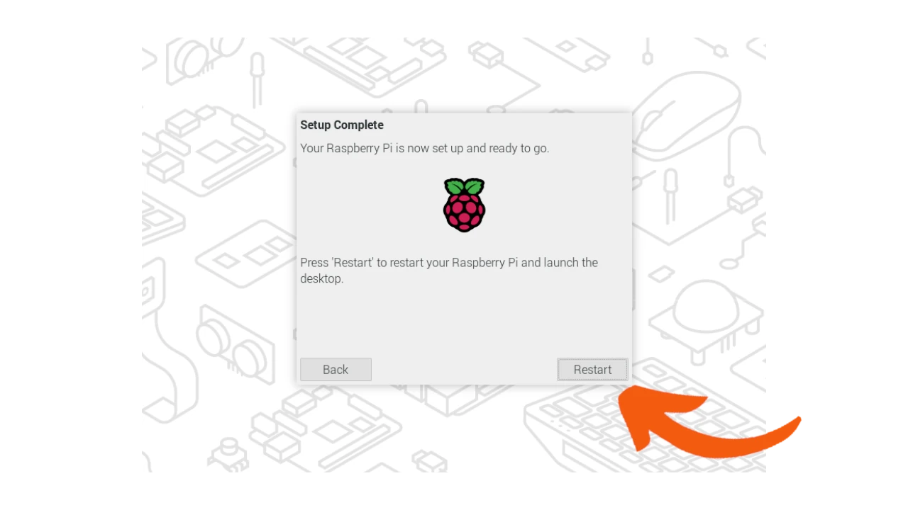

## Un Nuovo Computer Airgap
Dopo il riavvio, il tuo nuovo computer airgap è pronto. La PI Zero ti mostra il nuovo desktop, con cui puoi lavorare sia tramite GUI sia da riga di comando.


### Primi Passi per la PI Zero W o 2W
Se stai lavorando con una Raspberry PI Zero serie W o 2W, la tua scheda ha a bordo i chip per il Wi-Fi e il Bluetooth. Durante la prima configurazione hai saltato la configurazione della connessione, quindi la PI Zero non è connessa ad Internet. Ora puoi disattivare i due chip definitivamente via software.

Raspi OS mette infatti a disposizione un file `config.txt` che puoi editare a tuo piacimento. Il `config` si trova nella partizione `boot`, nella directory `firmware` e si può modificare e salvare con i privilegi di `root`.

Apri il terminale dall'icona che trovi in alto a sinistra e diventa `root`.(1)


(1) Se Raspi OS non ti ha fatto creare la password di `root` durante le fasi precedenti, ti consiglio di farlo adesso, con il comando `passwd`. Avere l'utente `root` che si muove in maniera indipendente dal tuo utente personale, può rivelarsi molto comodo nelle situazioni di recovery.

Con il terminale, controlla la presenza del file `config.txt` e preparati ad editarlo con l'editor `nano`.


L'editing va fatto in calce a tutto il `config`, dopo la dicitura `[All]`. È in questo punto che aggiungerai i comandi `dtoverlay` mostrati all'inizio del tutorial.


Salva, chiudi e riavvia. Nella fase che segue andremo all'esplorazione della piccola Raspberry.

## Cosa Aspettarti da questo Dispositivo?
Guardando le [caratteristiche tecniche](https://www.raspberrypi.com/products/raspberry-pi-zero/) dal sito di Raspberry, la PI Zero ha un processore 1 core BCM2835 e una RAM di 512 MB, pertanto non si preannuncia molto potente.

Essendo il terminale più leggero, useremo la riga di comando per esplorare le configurazioni di sistema.

All'accensione vedrai una breve schermata coi colori dell'arcobaleno, seguita da un messaggio di benvenuto di Raspberry e, nell'angolo in basso a sinistra, i messaggi del kernel relativi al boot. 

Quando compare il desktop di PI OS, apri il terminale e digita:

```bash
uname -a
```
Questo comando ti mostrerà a schermo la versione del kernel attualmente in uso, più altre informazioni.


Puoi anche vedere informazioni su CPU e hardware digitando:

```bash
lscpu
```


E anche vedere `proc/mem/info`.

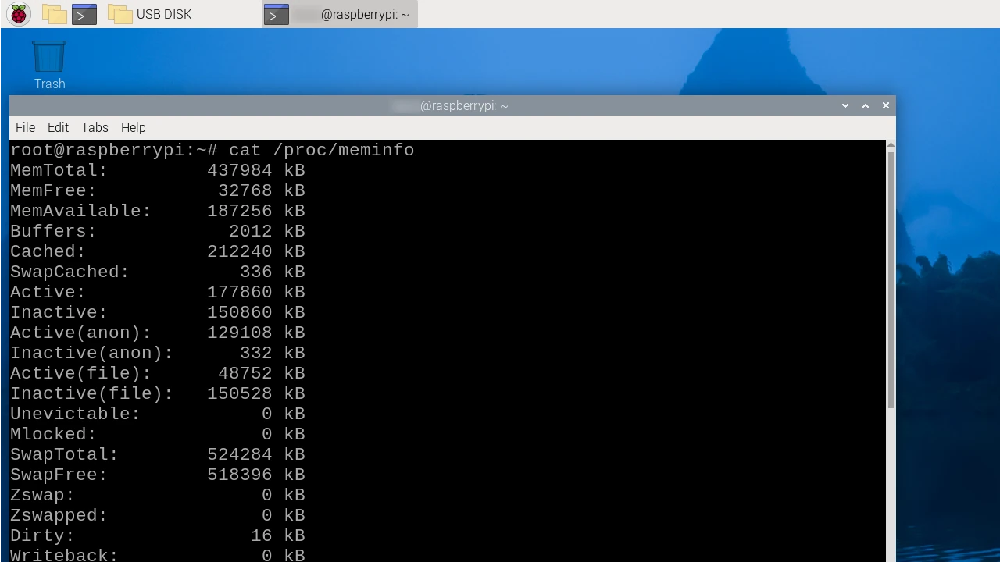

Per conoscere la versione di Debian e il codename della release:

``` bash
lsb_release -a
```

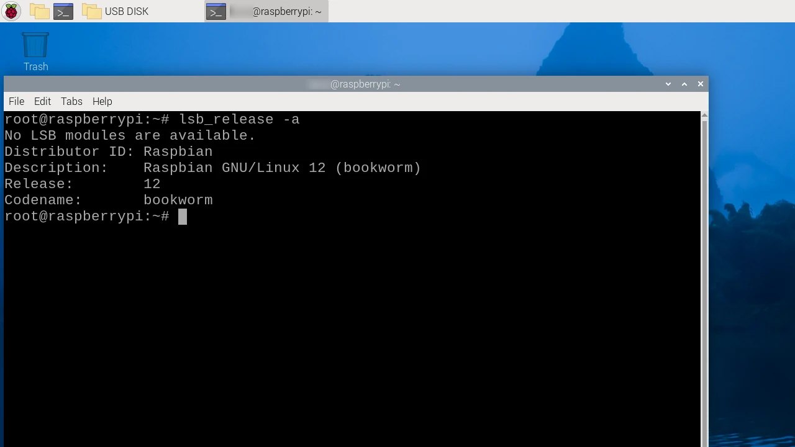

Infine, due comandi per controllare la memoria di massa e i dischi:

``` bash
fdisk -l
```

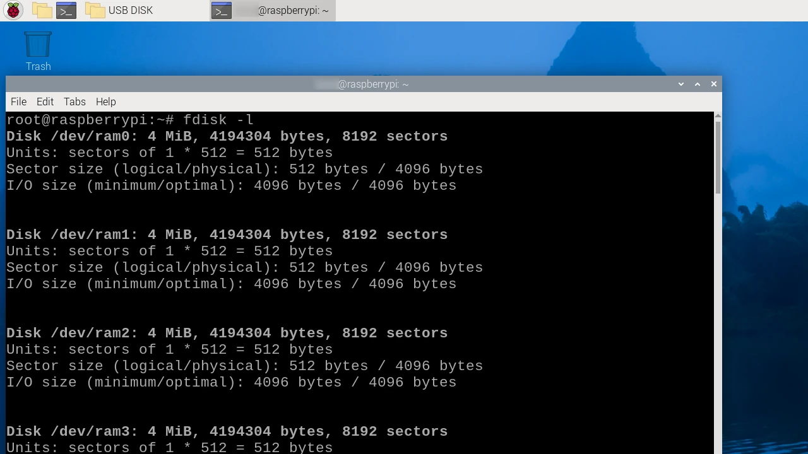

``` bash
df
```


Per controllare come lavora la CPU:

``` bash
top
```

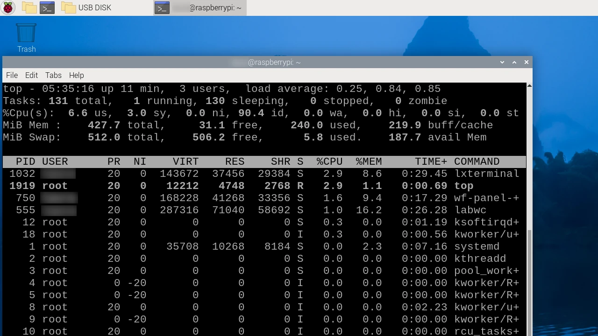

## Utilizzo
Nonostante le prestazioni sembrino limitate (sulla carta e rispetto alla potenza delle macchine odierne) la PI Zero è prestante, soprattutto da terminale.

- Per prima cosa puoi andare nei menu principali e farti ispirare dal pannello _Add/Remove software_, dove troverai una serie di utility per programmare ed esercitarti. Ricorda che puoi farlo anche da terminale, ma sempre con i privilegi di `root`.


- Puoi "adottare" questo dispositivo offline per memorizzare una serie di documenti riservati, che resteranno accessibili all'occorrenza, senza mai essere esposti alla rete Internet.
- Puoi utilizzare questa configurazione per generare le tue chiavi GPG in modo sicuro.
- Potresti, addirittura, sfruttare questo nuovo "giocattolino" come dispositivo di firma airgap, [seguendo i consigli di Arman The Parman](https://armantheparman.medium.com/how-to-set-up-a-raspberry-pi-zero-air-gapped-running-latest-version-of-electrum-desktop-wallet-85e59ecaddc0).

Tra i wallet che conosco bene, l'unico che prevede una release a 32 bit è Electrum. Ebbene: la PI Zero così come l'abbiamo preparata in questo tutorial, ti permetterebbe di tenere le chiavi private offline il set up per wallet airgap che abbiamo trattato in questo tutorial:

https://planb.network/tutorials/wallet/desktop/electrum-airgap-62b5a4c6-a221-4d41-9a62-4618c53d8223

## Conclusioni
La configurazione ha, probabilmente, un grande punto debole: la micro SD è un supporto che potrebbe dare problemi. È vulnerabile all'uso intensivo; magari hai già esperienza di questo, dall'uso con il tuo telefono. Dopo aver installato tutti i software che vorrai usare sulla PI Zero airgap, fai un buon backup della preziosa micro SD, utilizzando il tool di Raspi OS che hai a disposizione.


Man mano che le tue esigenze cresceranno, e con esse anche le possibilità di budget, potrai esplorare altre soluzioni di Raspberry o simili. Parlando di memoria, ad esempio  la PI 5 offre la possibilità di assemblare un'unità M2 NVME, certamente più solida rispetto alla microSD.

Non dimenticare di prendere appunti e documentare ogni fase di installazione software utility che ti appresti ad usare offline. **Presto o tardi uscirà un Raspi OS aggiornato** che vorrai assolutamente sfruttare. A quel punto dovrai cancellare tutto e rifare da capo (magari con una nuova micro SD 😂).

L'esercitazione che abbiamo appena fatto,  ammesso che sia il primo esperimento anche per te, la ricorderai a lungo. Non sempre è possibile dedicare hardware per operazioni `embedded` offline, senza tralasciare l'attenzione ad una macchina airgapped da accendere e verificare di tanto in tanto. 

Però l'hai portata a termine, complimenti! E potrai suggerire questa soluzione a tutti coloro che hanno necessità di contenere il budget.
