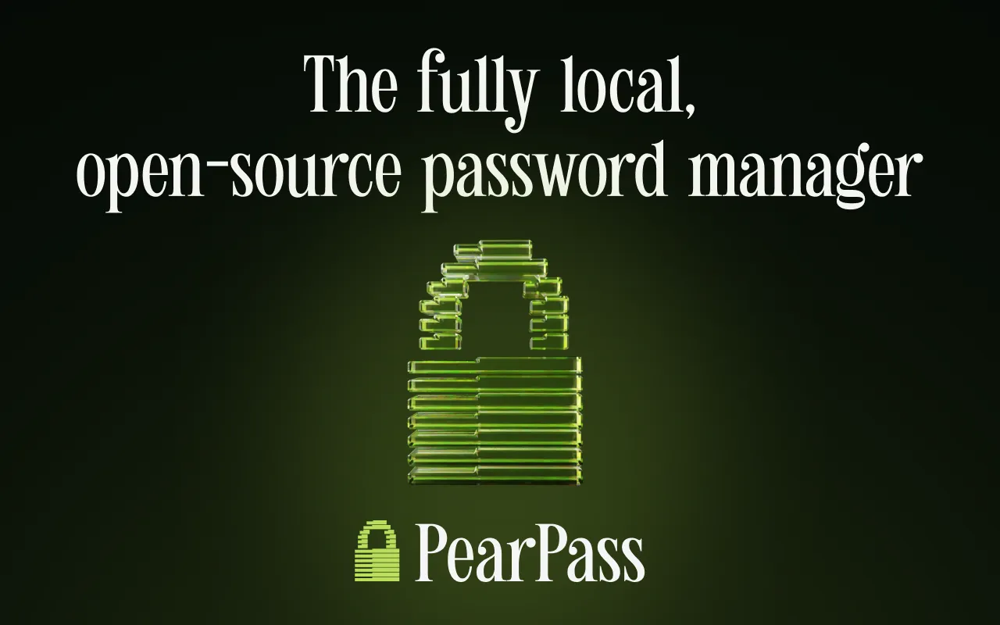

Trong thời đại mà mỗi cá nhân quản lý hàng chục, thậm chí hàng trăm tài khoản trực tuyến, bảo mật thông tin đăng nhập đã trở thành vấn đề trọng tâm trong an ninh mạng. Mạng xã hội, hệ thống nhắn tin, dịch vụ chuyên nghiệp, nền tảng tài chính: mỗi hình thức truy cập này đều dựa trên một mật khẩu bí mật, và việc mật khẩu này bị lộ có thể dẫn đến những hậu quả nghiêm trọng đối với cuộc sống của bạn.

Tuy nhiên, mặc dù các cuộc tấn công ngày càng gia tăng, những thói quen kém vẫn còn phổ biến trong cộng đồng: mật khẩu yếu, mật khẩu được tái sử dụng, được lưu trữ dưới dạng văn bản thuần hoặc chỉ được ghi nhớ một cách ước chừng. Để giải quyết những vấn đề này mà không làm phức tạp cuộc sống hằng ngày, giải pháp là sử dụng trình quản lý mật khẩu.

Hiện đã có hàng tá trình quản lý mật khẩu, và Plan ₿ Academy cung cấp hướng dẫn cho hầu hết chúng. Nhưng trong hướng dẫn này, tôi muốn giới thiệu với bạn một trình quản lý mật khẩu nổi bật hơn hẳn so với những trình quản lý khác về cách hoạt động: **PearPass**.

**PearPass là một trình quản lý mật khẩu ngang hàng, ưu tiên local-first và mã nguồn mở, được thiết kế để trao lại cho người dùng toàn quyền kiểm soát dữ liệu của họ.**

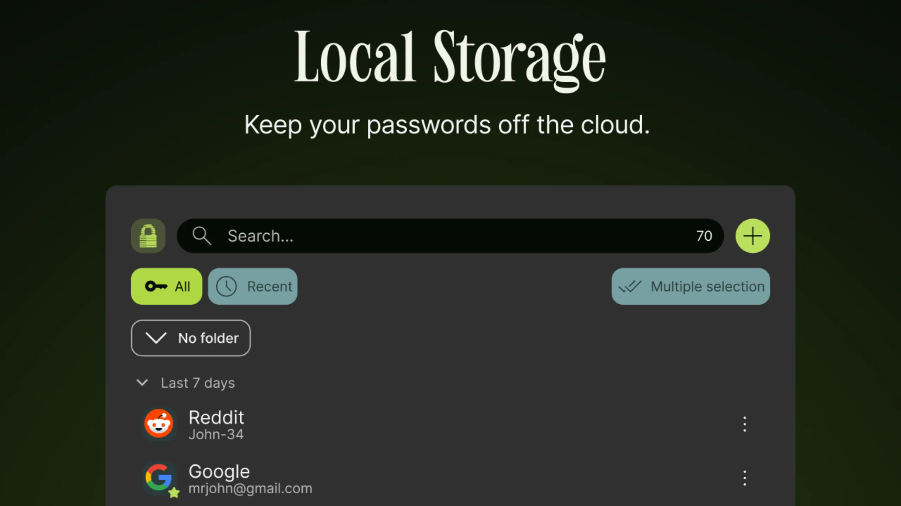

## Tại sao nên chọn PearPass?

Trình quản lý mật khẩu là một chương trình phần mềm tạo, lưu trữ và sắp xếp tất cả mật khẩu của bạn một cách an toàn. Thay vì phải nhớ hoặc sử dụng lại mật khẩu, bạn chỉ cần bảo vệ một bí mật duy nhất: mật khẩu chính, mã hóa toàn bộ kho lưu trữ của bạn. Cách tiếp cận này cho phép sử dụng các mật khẩu dài, ngẫu nhiên và độc đáo cho mỗi dịch vụ, giảm cả nguy cơ quên mật khẩu và bị xâm phạm, đồng thời hạn chế tác động của bất kỳ sự rò rỉ nào có thể xảy ra. Ngày nay, đây là một công cụ CNTT cơ bản mà mọi người nên sử dụng.

Có hai loại phần mềm quản lý mật khẩu chính. Một mặt, có phần mềm chỉ lưu trữ cục bộ, rất an toàn vì dữ liệu không bao giờ được lưu trữ trên máy chủ trung tâm, nhưng không thực tế lắm, vì nó không cho phép bạn dễ dàng đồng bộ hóa thông tin đăng nhập giữa nhiều thiết bị (máy tính, điện thoại thông minh, máy tính bảng...). Mặt khác, phần mềm quản lý mật khẩu dựa trên đám mây lưu trữ thông tin đăng nhập của bạn trên máy chủ của họ và đồng bộ hóa chúng trên tất cả các thiết bị của bạn. Ưu điểm chính của chúng là sự tiện lợi, nhưng chúng lại đánh đổi bằng sự an toàn, vì mật khẩu của bạn được lưu trữ trên các cơ sở hạ tầng mà bạn không có quyền kiểm soát.

PearPass cố tình phá vỡ cả hai mô hình trên. Nó định vị mình ở giữa các trình quản lý cục bộ và các giải pháp đám mây: nó cho phép đồng bộ hóa mật khẩu của bạn, đồng thời đảm bảo rằng chúng không bao giờ được lưu trữ trên máy chủ từ xa. Kết quả là, tất cả thông tin đăng nhập của bạn được lưu trữ cục bộ trên thiết bị của bạn và việc đồng bộ hóa giữa nhiều máy chỉ diễn ra ngang hàng (peer-to-peer). Kiến trúc này loại bỏ các điểm yếu dễ bị tấn công liên quan đến cơ sở dữ liệu tập trung: không có máy chủ nào để bị xâm phạm và không có cơ sở hạ tầng của bên thứ ba nào để truy cập thông tin đăng nhập của bạn. Việc liên lạc giữa các thiết bị của bạn được mã hóa đầu cuối, đảm bảo rằng chỉ những khóa bạn nắm giữ mới cho phép truy cập dữ liệu.

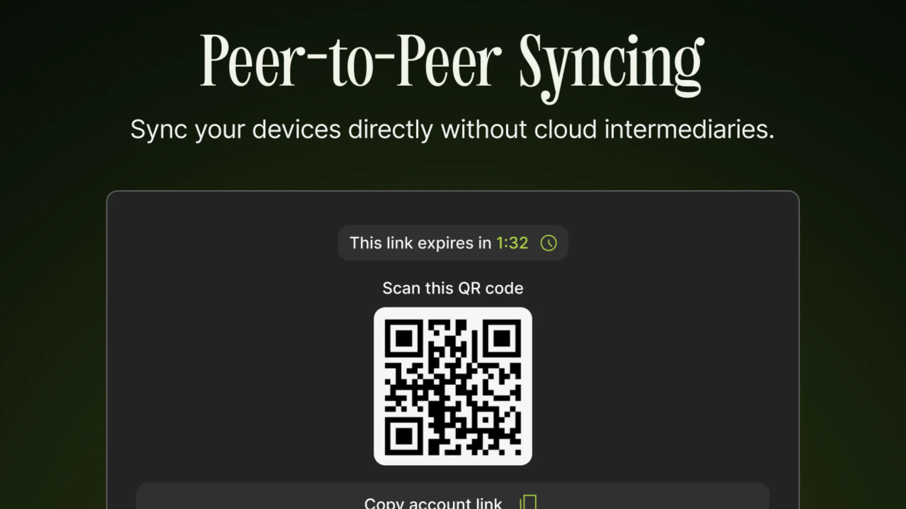

Để hiện thực hóa điều này, như tên gọi của nó, PearPass dựa vào **Pears**, một hệ sinh thái công nghệ ngang hàng (peer-to-peer) chuyên dụng cho việc tạo và thực thi các ứng dụng không máy chủ (serverless). Pears cung cấp môi trường thực thi, cơ chế phân phối và các lớp mạng cần thiết để chạy các ứng dụng phi tập trung hoàn toàn, có khả năng đồng bộ hóa trực tiếp giữa các máy ngang hàng mà không cần bất kỳ cơ sở hạ tầng tập trung nào. Trong trường hợp của PearPass, Pears cung cấp khả năng phát hiện thiết bị, thiết lập kết nối mã hóa và đồng bộ hóa kho mật khẩu giữa các máy của bạn. Cách tiếp cận này đảm bảo rằng PearPass luôn hoạt động hiệu quả, mạnh mẽ và độc lập với bất kỳ cơ quan bên ngoài nào.

https://planb.academy/tutorials/computer-security/communication/pears-6d42b312-c69f-4504-8f71-b03b56c42fdd

Ngoài kiến trúc tiên tiến này, PearPass hoàn toàn là phần mềm mã nguồn mở và tất cả các chức năng đều miễn phí. Phần mềm cũng đã được kiểm toán độc lập bởi Secfault Security. Bên cạnh kiến trúc đặc biệt, PearPass tất nhiên cung cấp đầy đủ các tính năng kinh điển của một trình quản lý mật khẩu tốt, mà chúng ta sẽ khám phá trong suốt hướng dẫn này.

Tóm lại, trong khi các trình quản lý mật khẩu truyền thống yêu cầu bạn tin tưởng vào một công ty và máy chủ của họ, PearPass áp dụng logic về tính độc quyền: không có đám mây, không có tài khoản tập trung, không có trung gian. Bạn giữ quyền kiểm soát độc quyền đối với thông tin đăng nhập của mình, đồng thời được hưởng lợi từ việc đồng bộ hóa giữa các thiết bị của bạn.

## Tôi cài đặt PearPass như thế nào?

PearPass có sẵn trên tất cả các nền tảng: Windows, Linux, macOS, Android, iOS và tiện ích mở rộng trình duyệt. Không cần cài đặt Pears trên máy tính của bạn: PearPass hoạt động độc lập.

### Cài đặt trên Windows

Trên Windows, PearPass được cung cấp dưới dạng trình cài đặt truyền thống. Truy cập [trang tải xuống chính thức](https://pass.pears.com/download), sau đó nhấp vào nút `Tải xuống trình cài đặt Windows`.

Sau khi tải xuống tệp, hãy mở trình cài đặt và làm theo các bước được hướng dẫn. Sau đó, bạn có thể truy cập ứng dụng từ menu Bắt đầu hoặc thông qua phím tắt trên màn hình.

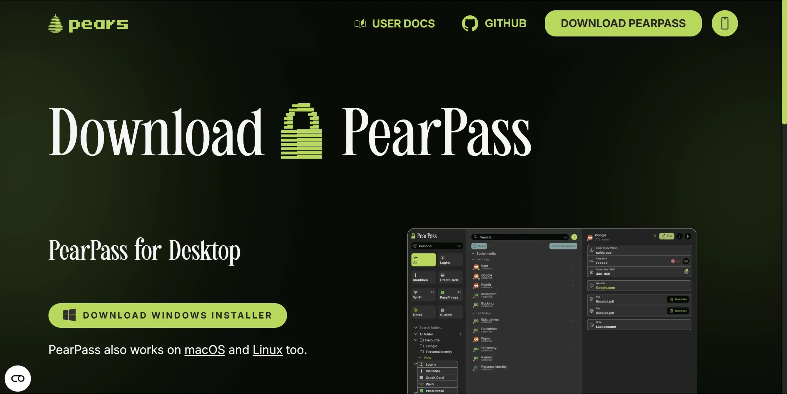

### Cài đặt trên macOS

Trên macOS, PearPass được phân phối dưới dạng ảnh đĩa (`.dmg`). Truy cập [trang tải xuống chính thức](https://pass.pears.com/download) và chọn phiên bản tương ứng với kiến trúc máy Mac của bạn (Intel hoặc Apple Silicon). Sau khi tải xuống, mở tệp `.dmg` và khởi chạy ứng dụng từ thư mục `Ứng dụng`.

Khi khởi động lần đầu, macOS sẽ hiển thị thông báo bảo mật cho biết ứng dụng được tải xuống từ Internet: chỉ cần xác nhận để tiếp tục.

### Cài đặt trên Linux

Trên Linux, PearPass có sẵn ở định dạng `.AppImage`, đảm bảo khả năng tương thích rộng rãi với hầu hết các bản phân phối mà không cần bất kỳ phụ thuộc cụ thể nào. Tải xuống tệp `.AppImage` từ [trang tải xuống chính thức](https://pass.pears.com/download), sau đó khởi chạy trực tiếp bằng cách nhấp đúp chuột.

Tùy thuộc vào môi trường của bạn, bạn có thể cần cấp quyền thực thi cho tệp thông qua thuộc tính tệp (nhấp chuột phải) hoặc bằng lệnh `chmod +x`. Sau khi được cấp quyền, PearPass sẽ khởi chạy như một ứng dụng độc lập.

### Cài đặt tiện ích mở rộng trình duyệt

PearPass cung cấp tiện ích mở rộng trình duyệt cho phép đăng nhập tự động và truy cập nhanh vào két sắt của bạn khi duyệt web. Tiện ích mở rộng hiện có sẵn cho Google Chrome và các trình duyệt tương thích. Để cài đặt, hãy truy cập [trang tải xuống chính thức](https://chromewebstore.google.com/detail/pearpass/pdeffakfmcdnjjafophphgmddmigpejh).

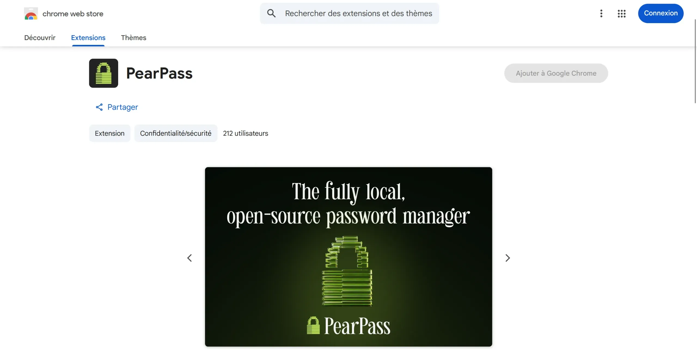

Sau khi thêm vào, bạn có thể ghim nó vào thanh công cụ để truy cập nhanh. Việc kích hoạt tiện ích mở rộng sau đó yêu cầu liên kết với ứng dụng PearPass được cài đặt cục bộ trên máy tính của bạn (chúng ta sẽ quay lại vấn đề này sau trong hướng dẫn).

### Cài đặt trên iOS và Android

Trên iPhone và Android, chỉ cần tải ứng dụng từ cửa hàng ứng dụng của bạn:

- [Cửa hàng Google Play](https://play.google.com/store/apps/details?id=com.pears.pass);
- [App Store](https://apps.apple.com/us/app/pearpass/id6752954830).

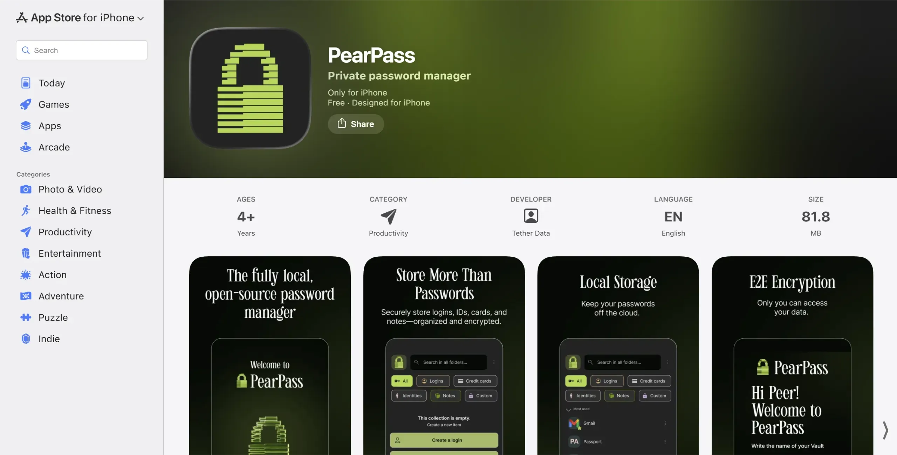

Ngoài các phương pháp cài đặt truyền thống này, bạn cũng có thể tải phần mềm trực tiếp từ kho lưu trữ GitHub, đối với mỗi kho lưu trữ như sau:

- [Máy tính để bàn](https://github.com/tetherto/pearpass-app-desktop);
- [Ứng dụng di động](https://github.com/tetherto/pearpass-app-mobile);
- [Tiện ích mở rộng trình duyệt](https://github.com/tetherto/pearpass-app-browser-extension).

Sau khi cài đặt PearPass trên một hoặc nhiều nền tảng, bạn có thể tiến hành cấu hình ban đầu. Trong hướng dẫn này, chúng ta sẽ bắt đầu bằng cách cấu hình phần mềm trên máy tính để bàn, sau đó đồng bộ hóa nó với tiện ích mở rộng trình duyệt và ứng dụng di động.

## Tôi tạo một kho lưu trữ an toàn trên PearPass như thế nào?

Khi bạn khởi chạy PearPass lần đầu tiên trên máy tính, ứng dụng sẽ hướng dẫn bạn qua hai bước: thiết lập mật khẩu chính và sau đó tạo két sắt đầu tiên của mình.

### Đặt mật khẩu chính

Khi ứng dụng được khởi chạy lần đầu trên máy tính, hãy nhấp vào nút "Bỏ qua" rồi nhấp vào "Tiếp tục" để bỏ qua màn hình giới thiệu và đến bước cấu hình mật khẩu chính.

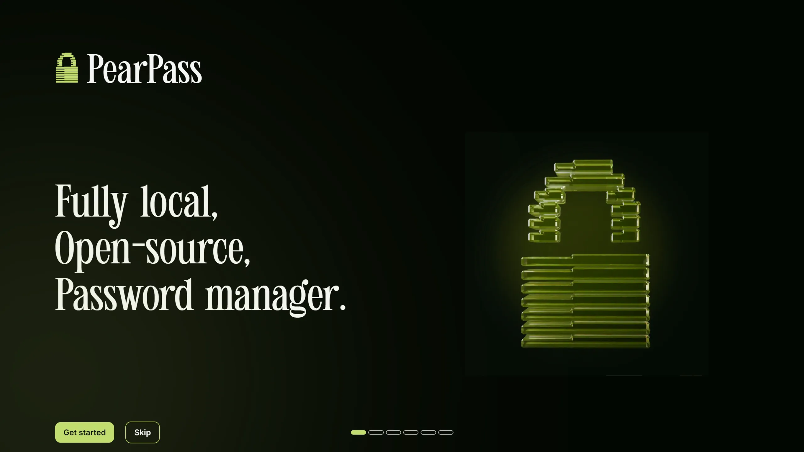

Bước tiếp theo rất quan trọng: chọn mật khẩu chính. Như đã thấy trong phần giới thiệu, mật khẩu này rất quan trọng vì nó cho phép bạn truy cập vào tất cả các mật khẩu khác đã lưu trên trình quản lý. Về mặt kỹ thuật, nó được sử dụng để tạo ra các khóa mã hóa dùng để mã hóa dữ liệu của bạn.

Mật khẩu chính tiềm ẩn hai rủi ro chính: mất mát và bị xâm phạm. Nếu bạn mất quyền truy cập vào mật khẩu này, bạn sẽ không còn có thể truy cập vào thông tin đăng nhập của mình. Thực tế, PearPass không bao giờ lưu trữ mật khẩu chính của bạn: **nếu bị mất, thông tin đăng nhập của bạn sẽ mất vĩnh viễn**. Không tồn tại cơ chế khôi phục nào. Ngược lại, nếu mật khẩu này bị xâm phạm và kẻ tấn công có được quyền truy cập vào một trong các thiết bị của bạn, họ sẽ có thể truy cập vào toàn bộ tài khoản của bạn.

Để hạn chế rủi ro mất mát, bạn có thể sao lưu mật khẩu chính của mình bằng bản cứng, ví dụ như trên giấy, và cất giữ ở nơi an toàn. Tốt nhất là nên niêm phong bản sao lưu này trong một phong bì để bạn có thể kiểm tra định kỳ xem có ai truy cập vào nó hay không. Mặt khác, tuyệt đối không bao giờ sao lưu mật khẩu này dưới dạng kỹ thuật số.

Để giảm thiểu rủi ro bị xâm phạm, mật khẩu chính của bạn phải mạnh. Mật khẩu nên càng dài càng tốt, bao gồm nhiều loại ký tự khác nhau và được chọn một cách hoàn toàn ngẫu nhiên. Năm 2025, các khuyến nghị tối thiểu là mật khẩu phải có ít nhất 13 ký tự, bao gồm chữ cái viết hoa và viết thường, số và ký hiệu, với điều kiện mật khẩu được chọn ngẫu nhiên. Tuy nhiên, tôi khuyên bạn nên sử dụng mật khẩu có ít nhất 20 ký tự, hoặc thậm chí nhiều hơn, với tất cả các loại ký tự, để đảm bảo mức độ bảo mật lâu dài hơn.

Nhập mật khẩu chính của bạn vào ô được cung cấp, xác nhận lại lần nữa, sau đó nhấp vào nút "Tiếp tục".

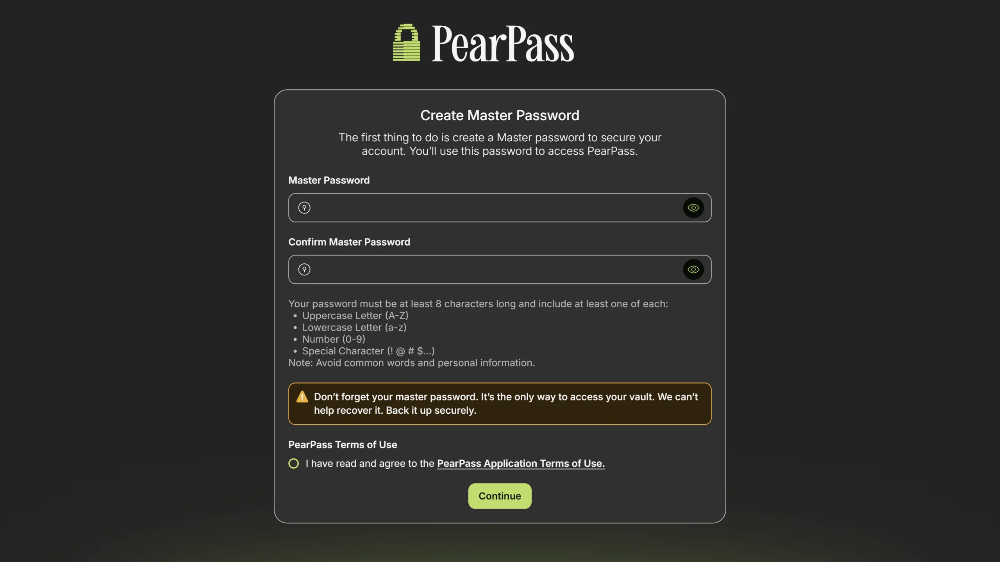

Sau đó, bạn sẽ được chuyển hướng đến màn hình đăng nhập: hãy nhập mật khẩu chính của bạn để kiểm tra xem mọi thứ có hoạt động chính xác hay không.

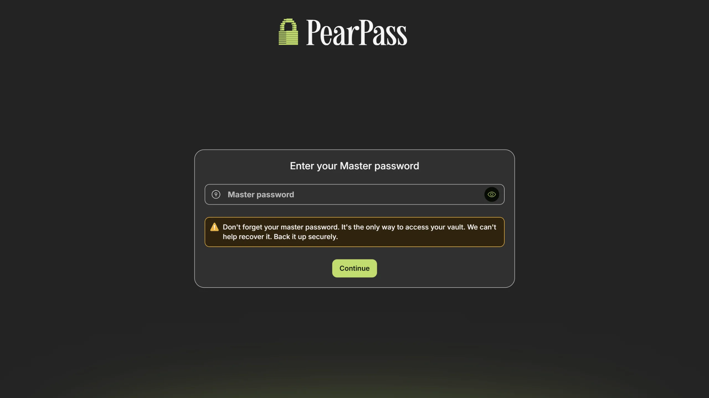

### Tạo két sắt đầu tiên của bạn

Sau khi đăng nhập, PearPass sẽ yêu cầu bạn tạo kho lưu trữ an toàn đầu tiên. Kho lưu trữ an toàn là một vùng chứa được mã hóa, nơi lưu trữ mật khẩu, ID, ghi chú bảo mật và các thông tin khác của bạn. Mỗi kho lưu trữ an toàn được cách ly và có thể được xác định bằng một tên riêng biệt, cho phép bạn sắp xếp dữ liệu theo mục đích sử dụng (cá nhân, chuyên nghiệp, dự án cụ thể...).

Nhấp vào nút "Tạo kho lưu trữ mới".

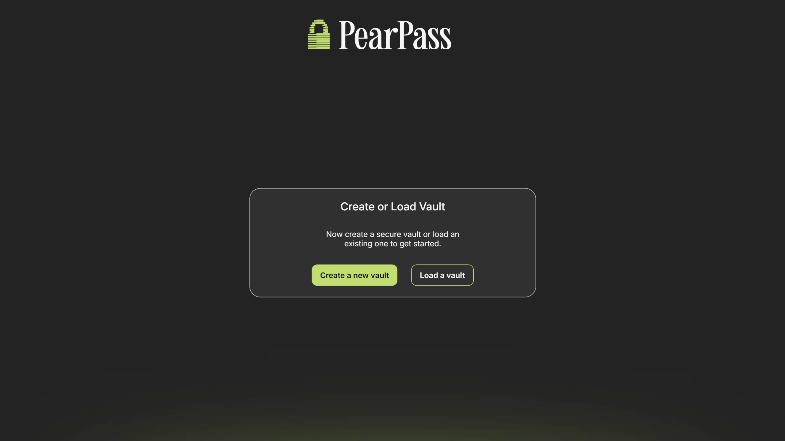

Hãy chọn tên cho kho lưu trữ này, sau đó nhấp vào "Tạo kho lưu trữ mới" một lần nữa để hoàn tất quá trình tạo.

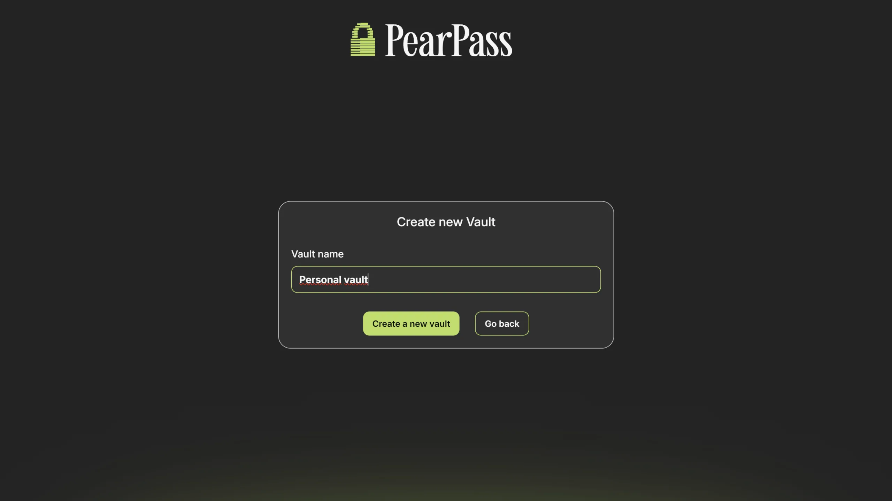

Két sắt của bạn đã sẵn sàng để sử dụng ngay lập tức. Bạn có thể bắt đầu thêm mật khẩu, tên đăng nhập hoặc ghi chú bảo mật ngay lập tức.

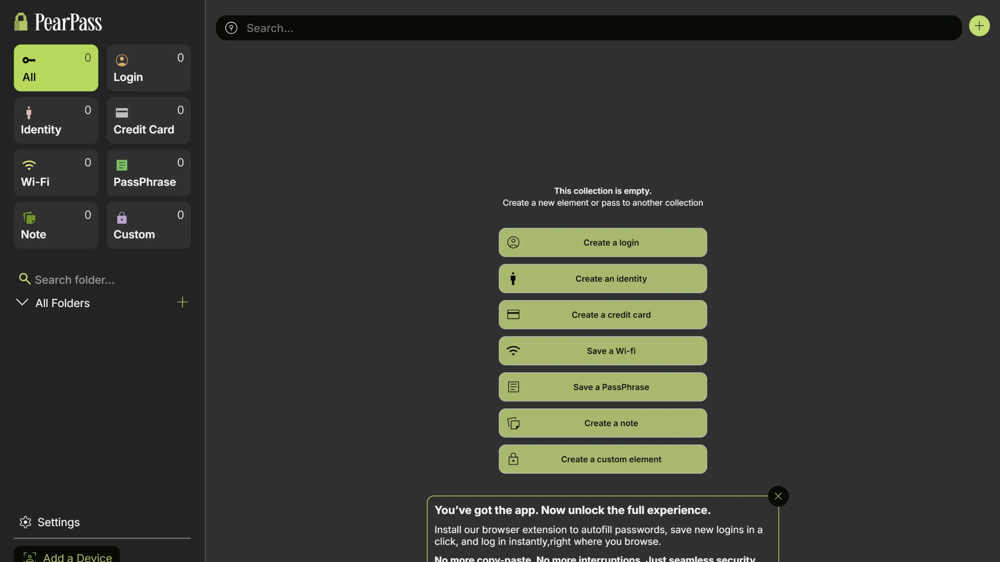

## Tôi có thể thêm tài khoản đăng nhập vào PearPass như thế nào?

Sau khi tạo xong két an toàn, bạn có thể bắt đầu lưu trữ các mục của mình trong đó. PearPass hỗ trợ đăng ký nhiều loại mục khác nhau:

- Đăng nhập vào một trang web hoặc dịch vụ;
- Thông tin nhận dạng: thông tin cá nhân của bạn để điền nhanh vào các biểu mẫu, cũng như để lưu trữ trực tiếp các tài liệu nhận dạng trong PearPass;
- Thẻ tín dụng: số thẻ tín dụng của bạn để thanh toán nhanh hơn khi mua sắm trực tuyến;
- Wi-Fi: mật khẩu cho các mạng Wi-Fi của bạn;
- Mật khẩu: cụm từ bí mật gồm nhiều từ (cảnh báo: Tôi đặc biệt khuyên bạn không nên sử dụng nó cho các cụm từ ghi nhớ wallet Bitcoin);
- Lưu ý: tạo ghi chú bảo mật;
- Tùy chỉnh: Tính năng này cho phép bạn tạo một loại phần tử tùy chỉnh, phù hợp với nhu cầu cụ thể của bạn.

Hãy bắt đầu bằng cách mở PearPass và đăng nhập bằng mật khẩu chính của bạn.

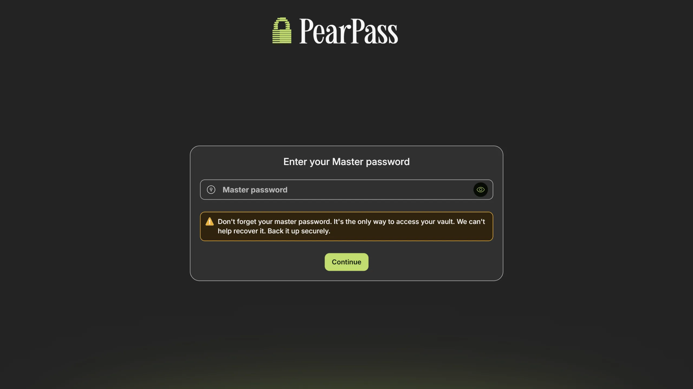

Hãy chọn két sắt mà bạn muốn lưu mã định danh này.

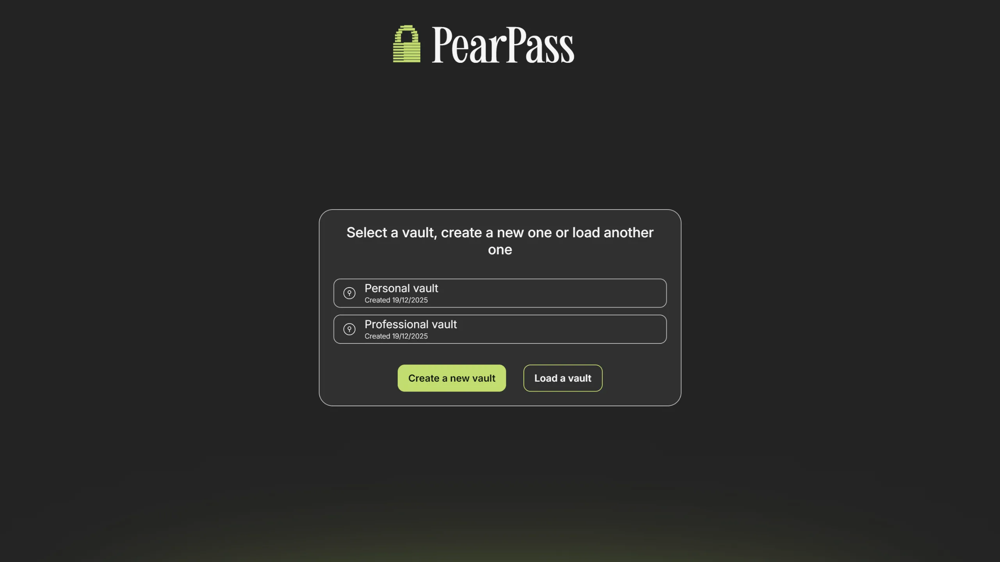

Trên trang chủ, hãy nhấp vào nút để thêm mục mới, tùy thuộc vào loại thông tin bạn muốn ghi lại. Trong trường hợp của tôi, tôi muốn thêm thông tin đăng nhập cho tài khoản của mình trên trang web Plan ₿ Academy: vì vậy tôi nhấp vào nút "Tạo thông tin đăng nhập".

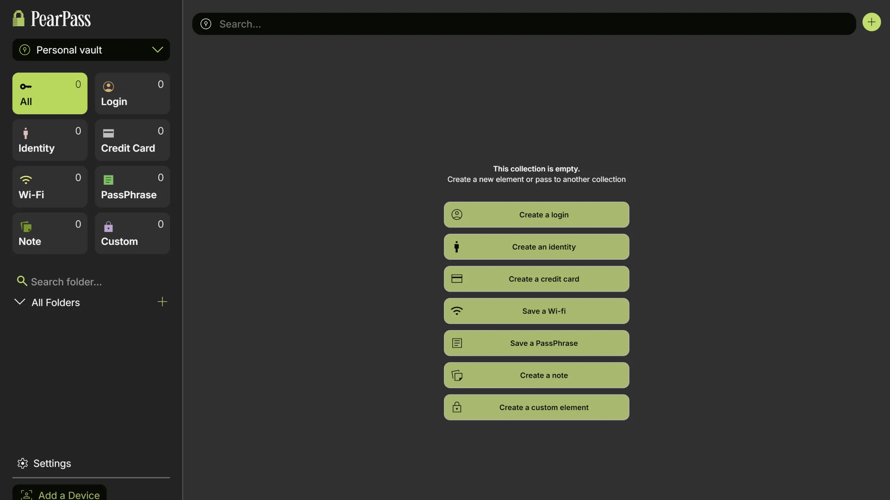

Sau khi bạn chọn loại mục muốn thêm, một biểu mẫu sẽ hiện ra cho phép bạn nhập thông tin liên quan đến dịch vụ đó. Tùy thuộc vào nhu cầu của bạn, bạn có thể nhập tên dịch vụ, tên đăng nhập, mật khẩu và, nếu cần, địa chỉ trang web và các ghi chú bổ sung.

PearPass cũng có tính năng tạo mật khẩu, cho phép bạn tạo mật khẩu mạnh trực tiếp từ biểu mẫu. Để sử dụng, hãy nhấp vào biểu tượng ba dấu chấm nhỏ trong trường "Mật khẩu", chọn độ dài mong muốn, sau đó nhấp vào "Nhập mật khẩu".

Sau khi điền đầy đủ thông tin vào tất cả các trường, hãy nhấp vào nút "Lưu" để lưu mã định danh vào kho lưu trữ.

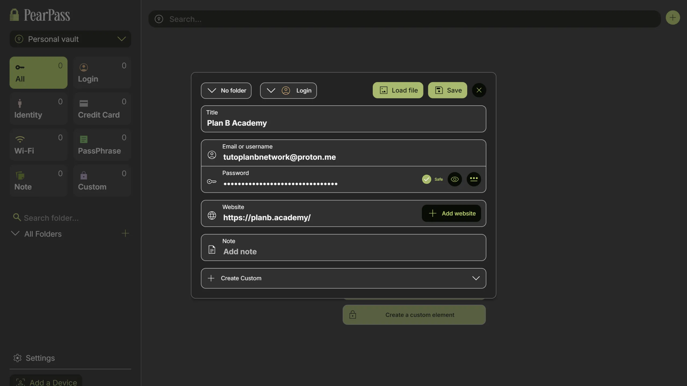

Mã định danh đã được lưu. Mã này xuất hiện trong danh sách các mục trong két sắt đã chọn và có thể được xem bằng cách nhấp vào đó.

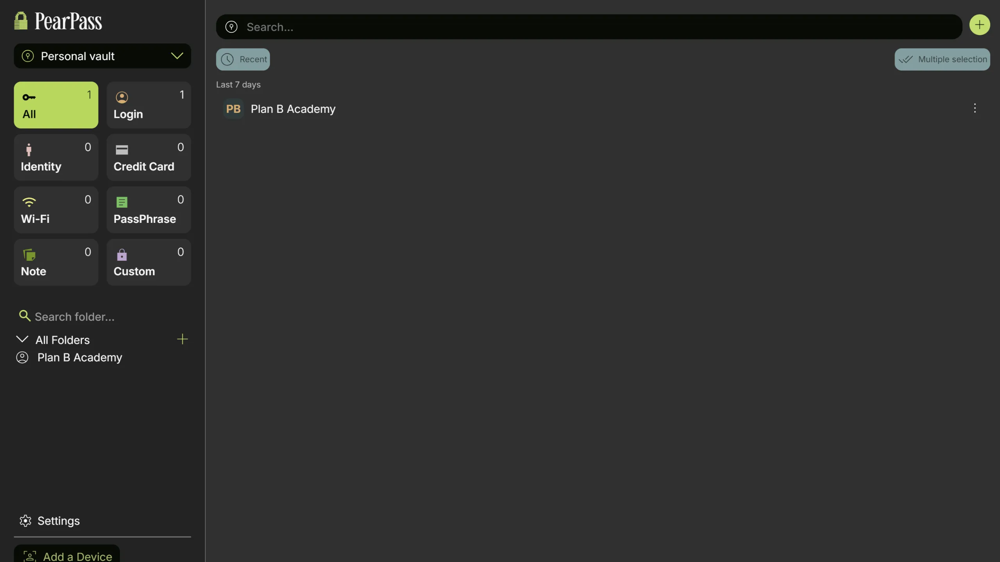

Bạn có thể dễ dàng chỉnh sửa một phần tử bằng cách nhấp vào phần tử đó, sau đó nhấp vào nút `Chỉnh sửa`. Bạn cũng có thể xóa phần tử đó bằng cách nhấp vào ba dấu chấm nhỏ ở góc trên bên phải giao diện, sau đó nhấp vào `Xóa phần tử`.

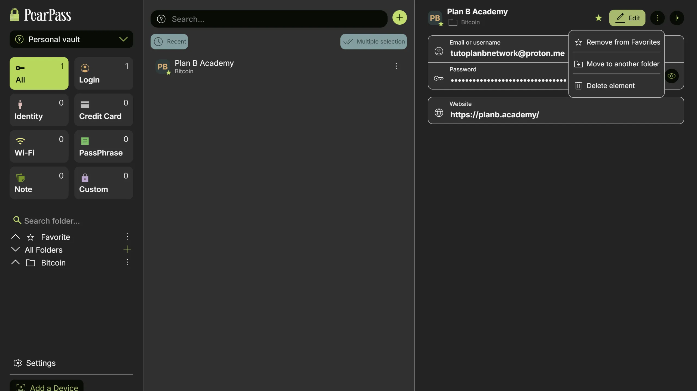

Trên thiết bị di động, nguyên tắc vẫn giữ nguyên, mặc dù giao diện đã được điều chỉnh. Sau khi đăng nhập, chọn két sắt mong muốn, nhấn vào nút `+`, chọn loại vật phẩm cần tạo, sau đó điền các thông tin cần thiết.

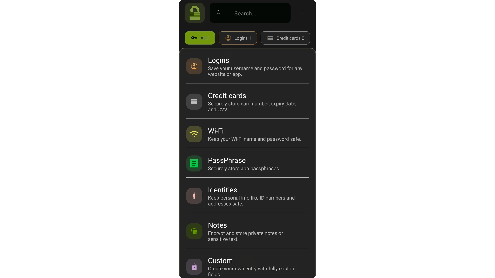

## Làm thế nào để sắp xếp PearPass?

Như chúng ta đã thấy trong các phần trước, PearPass cho phép bạn tạo nhiều kho lưu trữ riêng biệt. Điều này giúp phân tách các mục đích sử dụng khác nhau và tạo nên cấp độ tổ chức đầu tiên cho trình quản lý mật khẩu của bạn. Từ trang chủ, bạn có thể dễ dàng chuyển đổi giữa các kho lưu trữ bằng cách nhấp vào mũi tên ở góc trên bên trái giao diện.

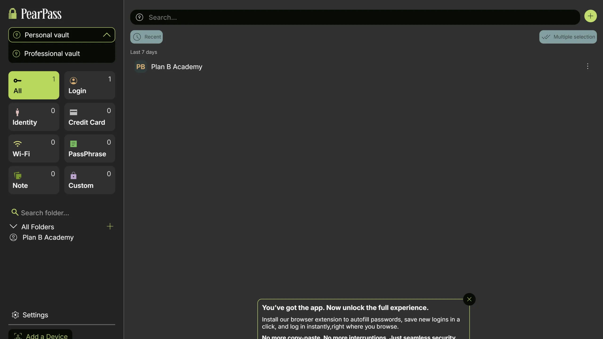

Một cách khác để sắp xếp mật khẩu của bạn, ngay cả trong một kho lưu trữ an toàn, là tạo thư mục. Để làm điều này, trong cột bên trái của giao diện, hãy nhấp vào biểu tượng `+` bên cạnh `Tất cả thư mục`, sau đó nhập tên thư mục bạn muốn tạo.

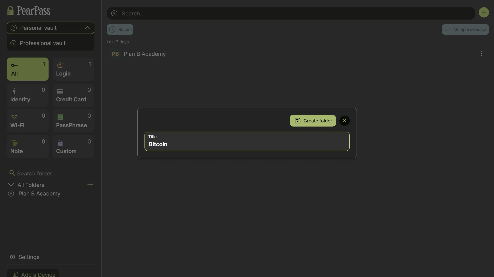

Sau đó, bạn có thể lưu trữ các mã định danh mà mình lựa chọn, trực tiếp khi tạo mục hoặc sau này bằng cách nhấp vào `Chỉnh sửa`. Tất cả những gì bạn cần làm là chọn thư mục mong muốn ở góc trên bên trái của biểu mẫu.

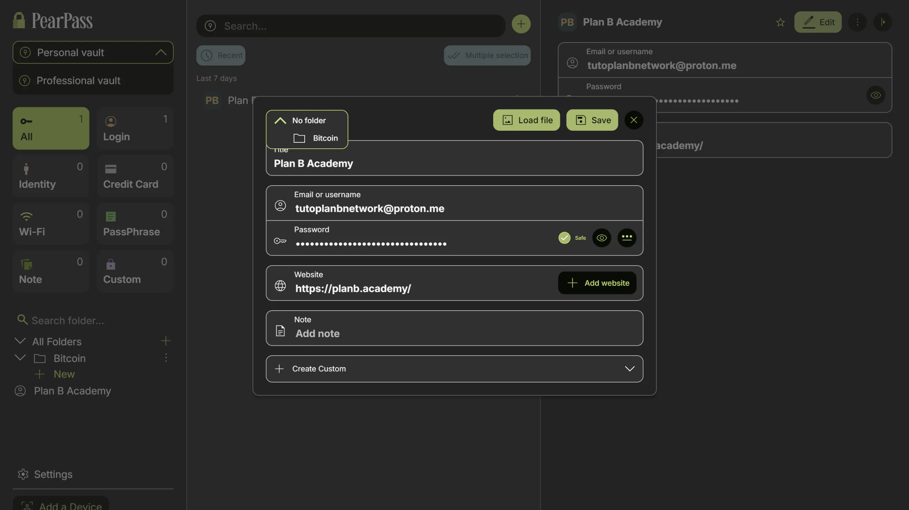

Sau khi mở một mục, chẳng hạn như trang đăng nhập, bạn có thể nhấp vào biểu tượng ngôi sao ở góc trên bên phải giao diện để thêm mục đó vào mục yêu thích. Các mục yêu thích sẽ được lưu trữ nhanh chóng trong một thư mục riêng, bên cạnh thư mục gốc của chúng.

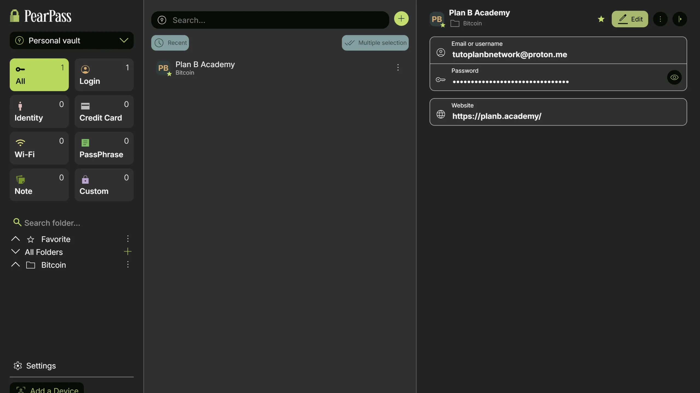

Cuối cùng, có một thanh tìm kiếm ở phía trên giao diện, giúp bạn nhanh chóng tìm thấy mục mình đang tìm kiếm, ngay cả khi kho lưu trữ của bạn chứa nhiều mã định danh.

## Làm thế nào để đồng bộ hóa PearPass trên điện thoại di động của tôi?

Giờ đây, khi bạn đã có một kho lưu trữ hoạt động với các mục được lưu trữ trên máy tính, có lẽ bạn sẽ muốn truy cập mật khẩu của mình từ điện thoại thông minh hoặc thiết bị khác. PearPass cho phép bạn đồng bộ hóa trình quản lý của mình trên nhiều máy một cách an toàn bằng Pears. Hãy cùng tìm hiểu cách thực hiện.

Đầu tiên, trên máy nguồn (ví dụ: máy tính của bạn), hãy đăng nhập vào kho dữ liệu bằng mật khẩu chính. Sau khi vào trang chủ, hãy nhấp vào nút "Thêm thiết bị" nằm ở góc dưới bên phải giao diện.

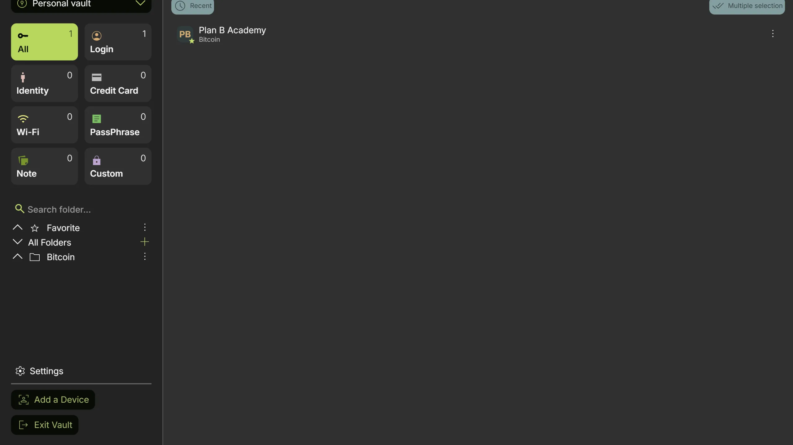

Sau đó, PearPass sẽ tạo một liên kết mời, cũng có sẵn dưới dạng mã QR, để đồng bộ hóa kho dữ liệu đã chọn trên thiết bị mà bạn lựa chọn.

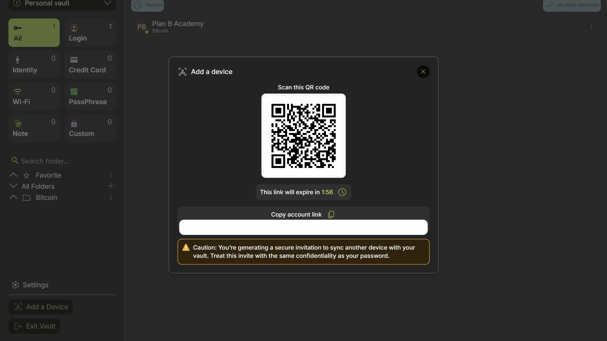

Nếu bạn muốn đồng bộ hóa trên thiết bị di động, trước tiên hãy cài đặt ứng dụng, sau đó khởi chạy ứng dụng. Bạn sẽ được yêu cầu tạo mật khẩu chính cho trình quản lý di động của mình. Bạn có thể chọn sử dụng cùng mật khẩu với máy tính hoặc một mật khẩu khác. Trong mọi trường hợp, hãy làm theo các khuyến nghị sau: sử dụng mật khẩu mạnh, ngẫu nhiên và được lưu trữ trên phương tiện vật lý.

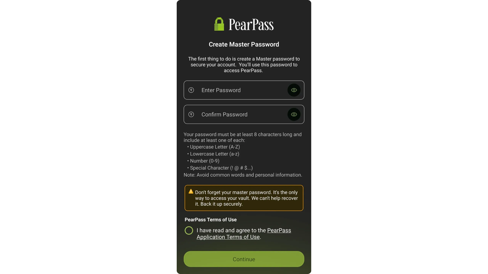

Sau đó, nếu muốn, bạn có thể kích hoạt xác thực sinh trắc học để tránh phải nhập mật khẩu chính thủ công mỗi khi mở khóa điện thoại.

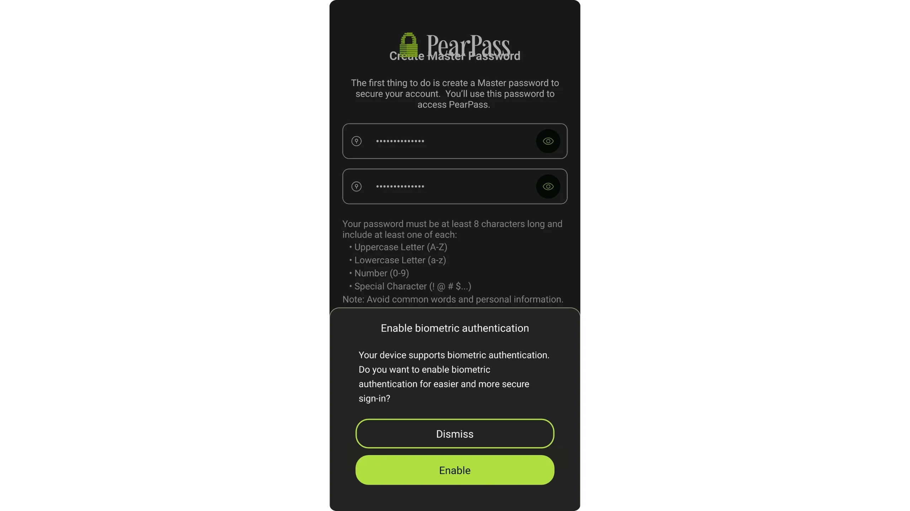

Nhập lại mật khẩu chính của bạn, sau đó nhấp vào nút "Tiếp tục".

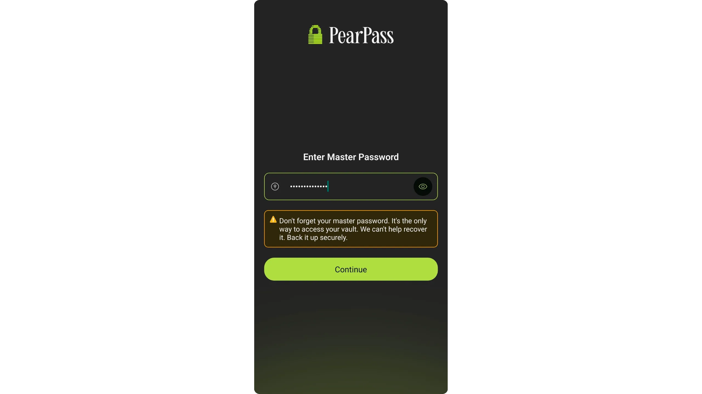

Chọn tùy chọn `Tải kho lưu trữ`, sau đó nhấp vào `Quét mã QR` và quét mã QR lời mời được PearPass hiển thị trên máy tính của bạn.

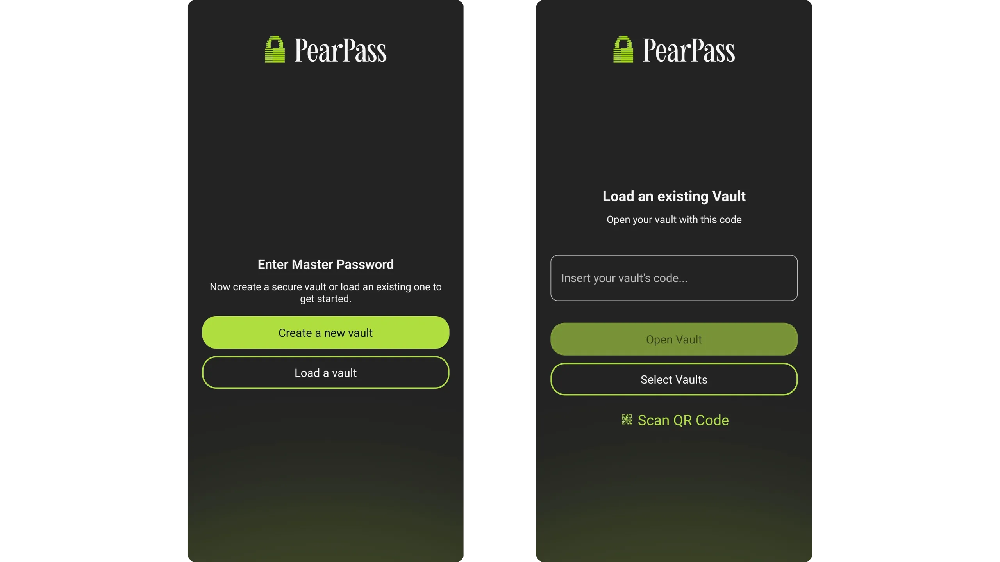

Kho dữ liệu của bạn trên máy tính và điện thoại di động hiện đã được đồng bộ hóa. Mọi ID được thêm vào trên một thiết bị sẽ được lưu trữ an toàn và sao chép sang thiết bị kia.

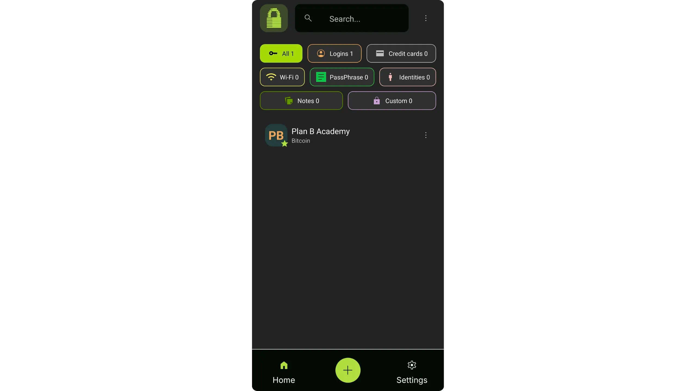

Trên thiết bị di động, bạn cũng có thể, nếu muốn, kích hoạt tính năng tự động điền các trường. Để thực hiện việc này, hãy vào `Settings > Advanced`, sau đó nhấp vào nút `Set as Default` trong mục `Autofill`.

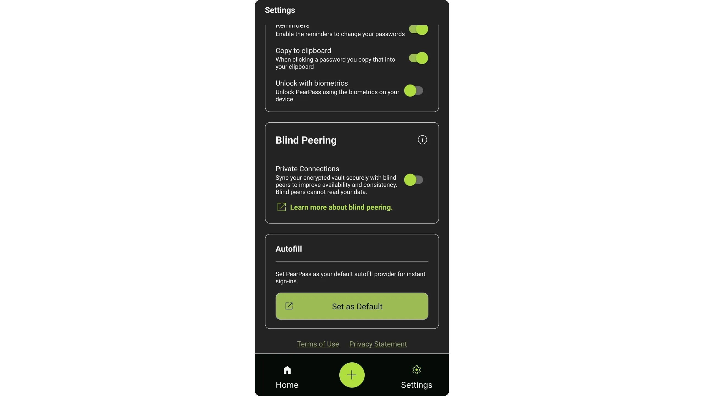

## Làm thế nào để đồng bộ hóa PearPass với tiện ích mở rộng trình duyệt?

Việc có trình quản lý mật khẩu được đồng bộ hóa giữa máy tính và điện thoại thông minh của bạn đã rất tiện lợi, nhưng tích hợp trực tiếp vào trình duyệt của bạn thậm chí còn tiện lợi hơn. Để làm được điều đó, hãy bắt đầu bằng cách [thêm tiện ích mở rộng PearPass chính thức vào trình duyệt của bạn](https://chromewebstore.google.com/detail/pearpass/pdeffakfmcdnjjafophphgmddmigpejh).

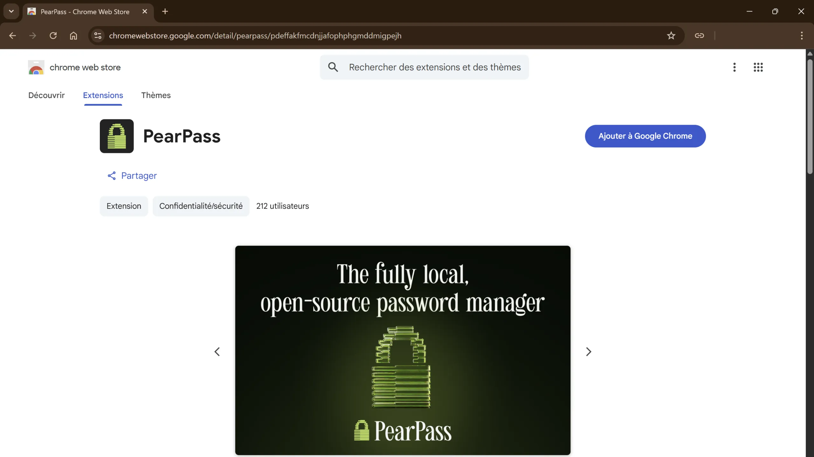

Từ phần mềm PearPass đã được cài đặt trên máy tính của bạn, hãy vào `Cài đặt > Nâng cao`, sau đó kích hoạt tùy chọn `Kích hoạt tiện ích mở rộng trình duyệt`.

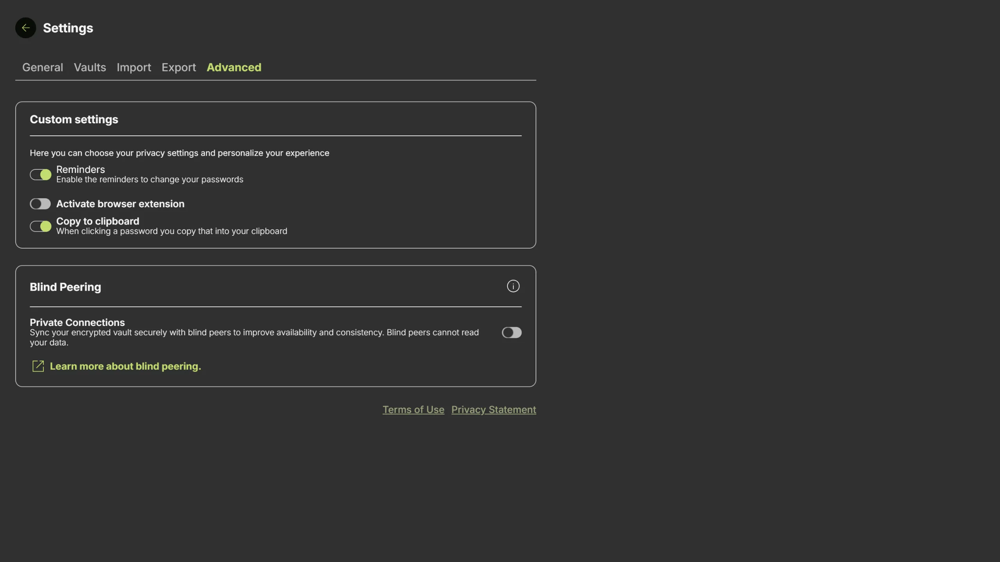

PearPass tạo ra một tệp ghép nối token. Hãy sao chép tệp đó.

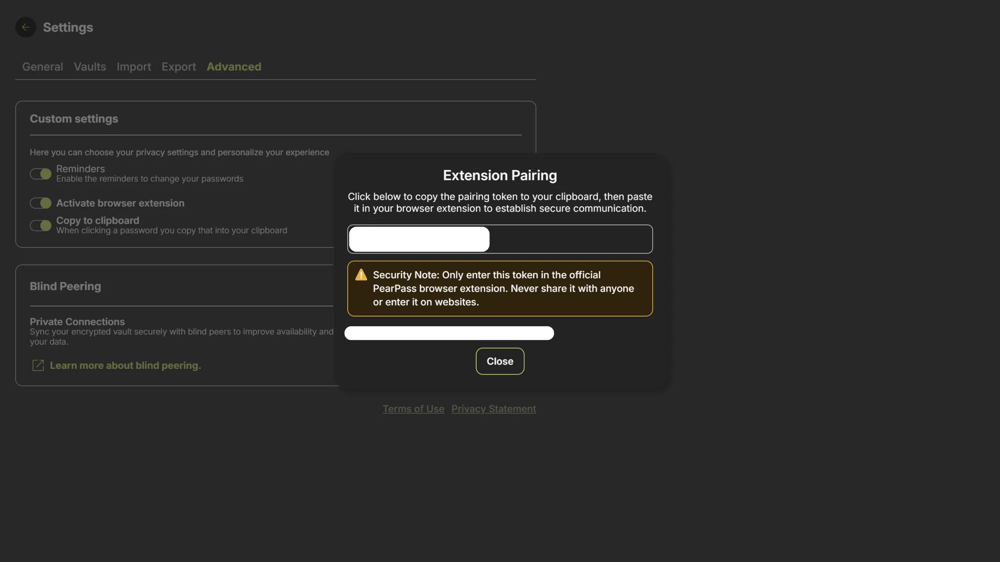

Sau đó, mở tiện ích mở rộng PearPass trong trình duyệt của bạn, dán thông tin ghép nối token và nhấp vào nút "Xác minh", rồi nhấp vào "Hoàn tất".

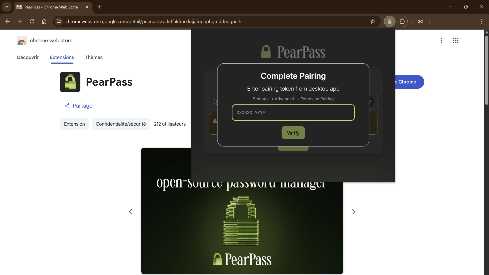

Trình quản lý mật khẩu của bạn hiện đã được đồng bộ hóa với tiện ích mở rộng trình duyệt.

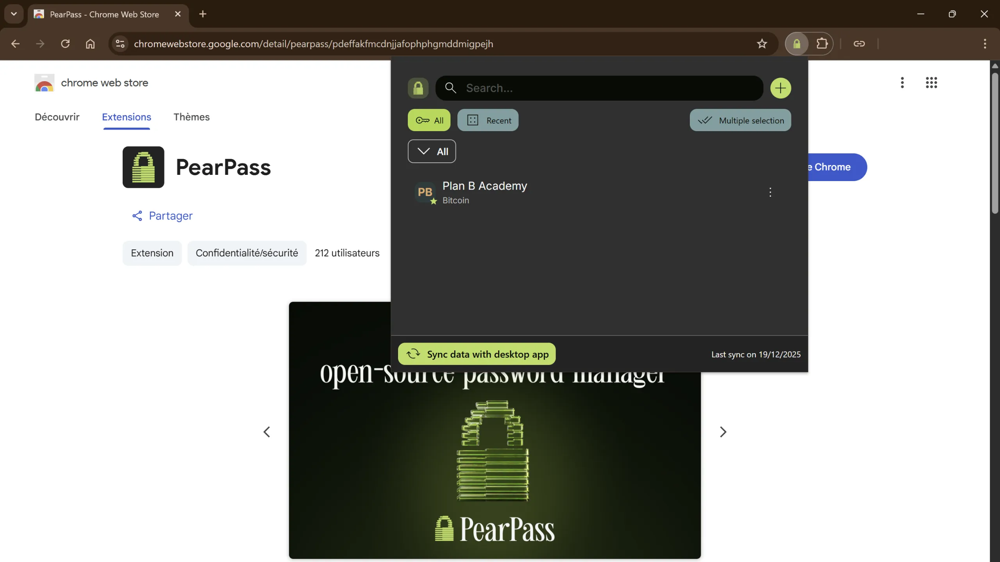

Giờ đây, bạn có thể sử dụng nó để dễ dàng kết nối với nhiều tài khoản trực tuyến khác nhau của mình.

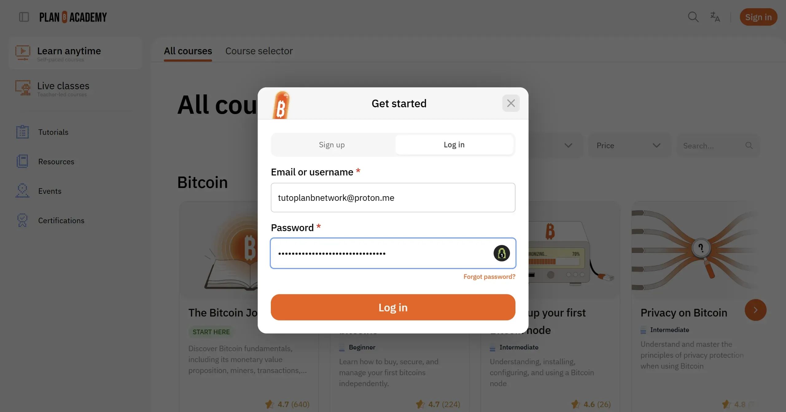

Giờ bạn đã biết cách sử dụng trình quản lý mật khẩu PearPass. Ngoài công cụ này, bảo mật kỹ thuật số hàng ngày phụ thuộc vào việc sử dụng đúng các giải pháp phù hợp. Nếu bạn muốn tìm hiểu cách thiết lập một môi trường kỹ thuật số cá nhân an toàn, ổn định và hiệu quả, tôi mời bạn khám phá khóa đào tạo của chúng tôi dành riêng cho chủ đề này:

https://planb.academy/courses/4ba0e3de-e67f-4ea1-a514-f111206810d1