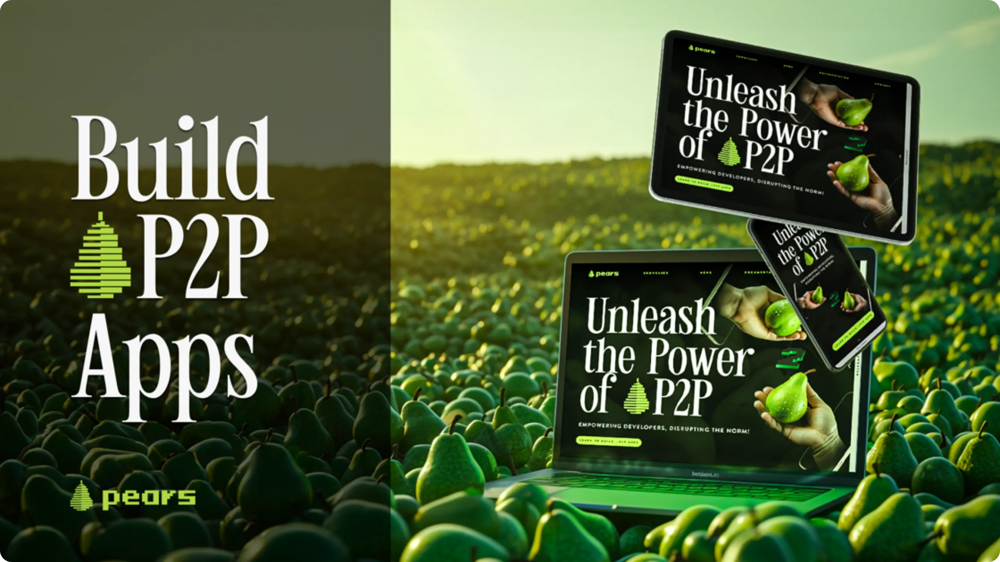
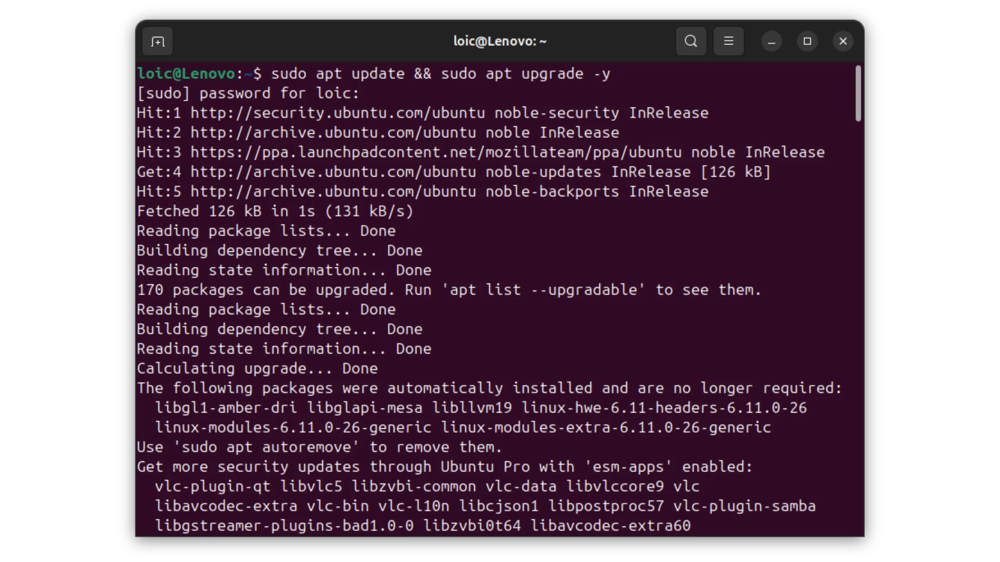
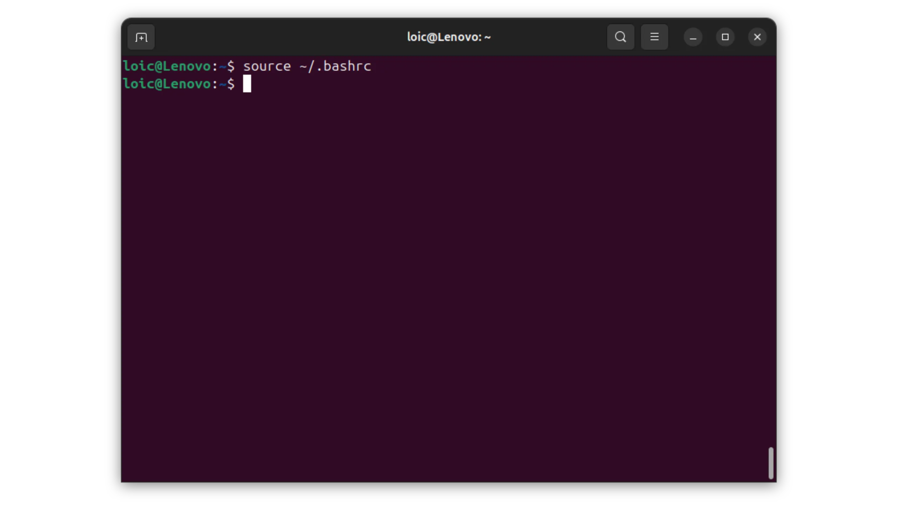
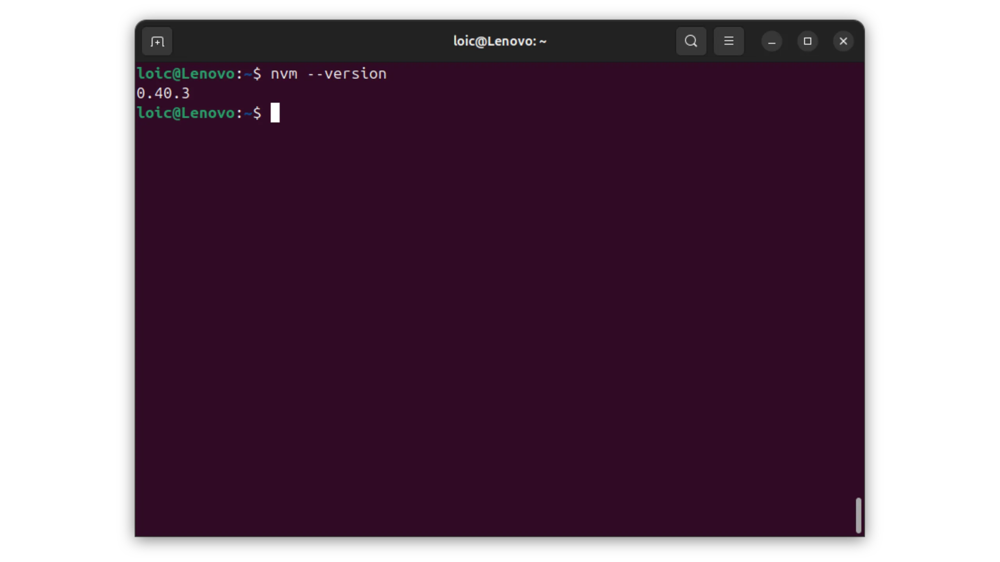
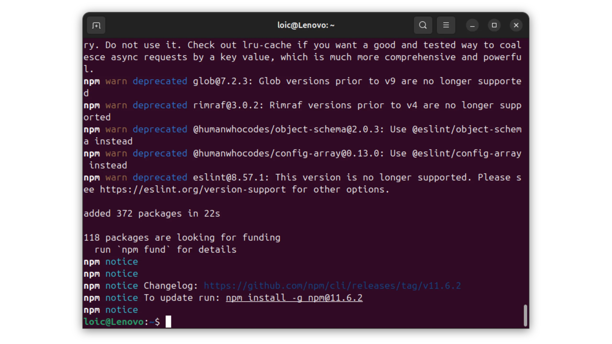
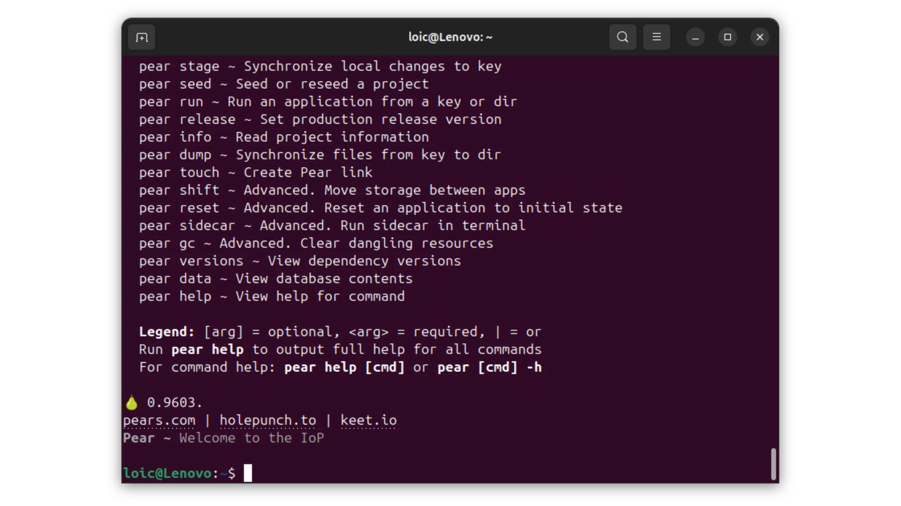
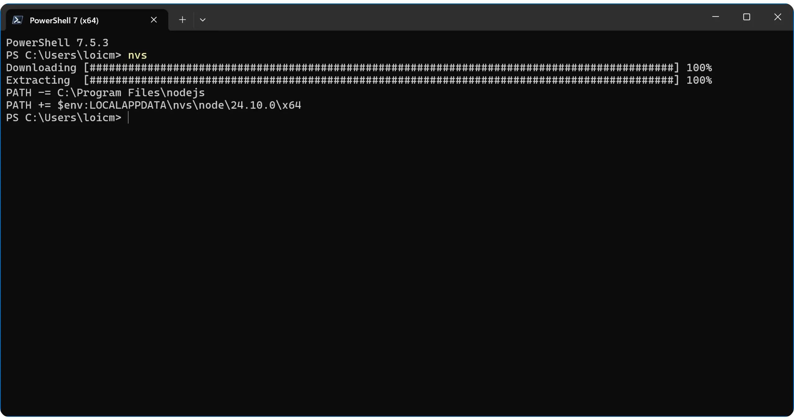
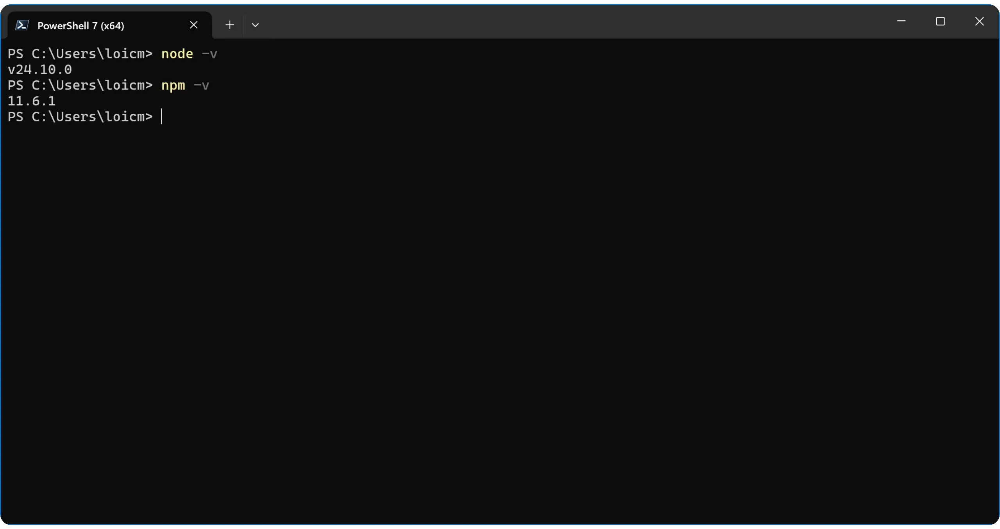
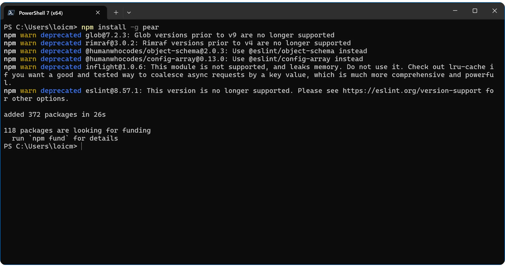

Neste tutorial, vamos aprender a executar aplicações no **Pears**, uma tecnologia peer-to-peer (P2P) desenvolvida pela **Holepunch** e suportada pela **Tether**. O objetivo é simples: tornar possível a distribuição e utilização de aplicações web sem depender de qualquer infraestrutura centralizada (sem servidores, sem hosts, sem intermediários). Por outras palavras, mesmo que um fornecedor de serviços em nuvem feche ou que um país bloqueie um domínio, a aplicação mantém-se entre os pares da rede.


## 1. O que é a pera?


Pears é um ambiente de execução, uma ferramenta de desenvolvimento e uma plataforma de implementação para aplicações peer-to-peer. Esta ferramenta de código aberto permite construir, partilhar e executar software sem um servidor ou infraestrutura, diretamente entre utilizadores. Em termos concretos, isto significa que, em vez de alojar uma aplicação num servidor central, cada utilizador torna-se um nó da rede, partilhando parte da aplicação e dados com outros pares. Todo o sistema forma uma rede distribuída, com cada instância a cooperar para manter o serviço acessível.


Esta abordagem baseia-se num conjunto de módulos de software desenvolvidos pela Holepunch:


- Hypercore**: um registo distribuído que garante a consistência e a segurança dos dados sem uma base de dados central.
- Hyperbee**: um indexador no topo do Hypercore, para organização e navegação eficientes dos dados.
- Hyperdrive**: um sistema de ficheiros distribuído utilizado para armazenar e sincronizar ficheiros de aplicações entre pares.
- Hyperswarm** e **HyperDHT**: camadas de rede que permitem a descoberta e a ligação entre pares de todo o mundo, sem um servidor central.
- Secretstream**: um protocolo de cifragem E2E para proteger as trocas entre dois pares.


Ao combinar estes componentes, o Pears permite criar aplicações autónomas, encriptadas e distribuídas, em que cada utilizador participa ativamente na rede. Esta arquitetura descentralizada elimina custos de infraestrutura, riscos de censura e SPOFs (*Single Point of Failure*).


## 2. Origem e filosofia do projeto


A Pears está a ser desenvolvida pela Holepunch, uma empresa fundada por Mathias Buus e Paolo Ardoino (CEO da Tether e CTO da Bitfinex), com a missão de estender a lógica peer-to-peer para além do Bitcoin. A sua ambição é construir a "Internet Peer-to-Peer", onde cada aplicação pode ser executada sem autorização, sem servidores e sem intermediários. A Holepunch já está por trás do **Keet**, uma aplicação de videoconferência e mensagens totalmente P2P.


*Este tutorial de instalação do Pears está dividido em várias secções, dependendo do seu sistema operativo. Vá diretamente para a secção correspondente ao seu ambiente para seguir as instruções apropriadas :*


- Linux (Debian)** → Parte **3**
- Windows** → Parte **4**
- macOS** → Parte **5**


## 3. Como instalar o Pears no Linux (Debian)


Instalar o Pears num sistema Debian é relativamente simples, mas requer alguns pré-requisitos, que iremos detalhar nesta secção.


### 3.1. atualizar o sistema


Antes de mais, é importante certificar-se de que o seu sistema está atualizado.


```bash
sudo apt update && sudo apt upgrade -y
```





### 3.2. instalar dependências


O Pears depende de certas bibliotecas de sistema, nomeadamente a `libatomic1`, utilizada pelo tempo de execução do Bare JavaScript. Instale-a com o seguinte comando:


```bash
sudo apt install -y libatomic1 curl git
```


### 3.3. instalar o Node.js e o npm via NVM


Pears é distribuído via *npm*, o gerenciador de pacotes *Node.js*. Embora o Pears não dependa diretamente do *Node.js* para funcionar, ele é necessário para a instalação. O método recomendado para instalar o *Node.js* no Linux é o *NVM* (*Node Version Manager*), que permite gerenciar várias versões do Node em paralelo.


```bash
curl -o- https://raw.githubusercontent.com/nvm-sh/nvm/master/install.sh | bash
```


Em seguida, recarregue o seu terminal para ativar a *NVM* :


```bash
source ~/.bashrc
```





Verificar se o *NVM* está instalado:


```bash
nvm --version
```





Em seguida, instale uma versão estável do *Node.js* (por exemplo, o LTS atual):


```bash
nvm install --lts
```


Verifique as instalações do *Node.js* e do *npm*:


```bash
node -v
npm -v
```


### 3.4 Instalar o Pears com o npm


Uma vez que o *npm* esteja disponível, você pode instalar o Pears CLI globalmente no seu sistema. Isso permitirá executar o comando `pear` a partir de qualquer diretório.


```bash
npm install -g pear
```





### 3.5. Inicializar as peras


Após a instalação, basta executar o seguinte comando no seu terminal:


```bash
pear
```


No primeiro arranque, o Pears liga-se à rede peer-to-peer para descarregar os componentes necessários. Este processo não requer um servidor central: os ficheiros são obtidos diretamente de outros pares.


Quando a transferência estiver concluída, execute o comando novamente para verificar se tudo está a funcionar:


```bash
pear
```





Se tudo estiver corretamente instalado, a Ajuda do Pears será apresentada com uma lista de comandos disponíveis.


### 3.6. Teste das peras com Keet


Para verificar se o Pears está totalmente operacional, pode lançar uma aplicação P2P já disponível na rede, como o Keet, o software de mensagens e videoconferência de código aberto da Holepunch.


```bash
pear run pear://keet
```


Este comando carrega a aplicação Keet diretamente da rede Pears, sem passar por um servidor central. Se o Keet for iniciado corretamente, a sua instalação Pears está totalmente funcional.


O seu sistema Linux está agora pronto para executar e alojar aplicações peer-to-peer com Pears.


## 4. Como instalar o Pears no Windows


A instalação do Pears no Windows é tão fácil quanto no Linux, mas requer algumas ferramentas especiais.


*Se estiver a utilizar Linux, pode saltar para o passo 6.*


### 4.1. abrir o PowerShell no modo de administrador


Em primeiro lugar, execute o PowerShell com direitos de administrador:


- Clique no menu Iniciar;
- Digite PowerShell ;
- Clique com o botão direito do rato em "*Windows PowerShell*" ;
- Selecionar "*Executar como administrador*".


### 4.2. descarregar o NVS


O Pears é instalado através do *npm*, o gestor de pacotes *Node.js*. No Windows, o método recomendado pela Holepunch é usar o *NVS* (*Node Version Switcher*), que é mais estável que o *NVM* neste sistema.


No PowerShell, execute o seguinte comando para instalar a versão mais recente do *NVS* :


```PowerShell
winget install jasongin.nvs
```


### 4.3. instalar o Node.js


Após a instalação, reinicie o PowerShell e introduza o seguinte comando:


```powershell
nvs
```


Deverá ver uma lista de versões *Node.js* disponíveis. Selecione a primeira pressionando a tecla `a` no seu teclado.


*O Node.js* está instalado.





### 4.4. Verificar as instalações


Certifique-se de que *Node.js* e *npm* estão acessíveis:


```powershell
node -v
npm -v
```


Ambos os comandos devem devolver um número de versão.





### 4.5. Instalando o Pears com o npm


Quando *Node.js* e *npm* estiverem disponíveis, instale **Pears CLI** globalmente no seu sistema:


```powershell
npm install -g pear
```


Isto irá instalar o binário `pear` no seu diretório global *npm*.





### 4.6. Verificar e inicializar as peras


Quando a instalação estiver concluída, execute :


```powershell
pear
```


No primeiro lançamento, o Pears descarrega automaticamente os componentes necessários da rede peer-to-peer. Este processo pode demorar alguns momentos.


Se tudo tiver corrido bem, deve ver o ecrã de ajuda do CLI Pears com uma lista de subcomandos disponíveis (run, seed, info...).


### 4.7. Teste das peras com Keet


Para verificar se o Pears está totalmente operacional, pode lançar uma aplicação P2P já disponível na rede, como o Keet, o software de mensagens e videoconferência de código aberto da Holepunch.


```bash
pear run pear://keet
```


Este comando carrega a aplicação Keet diretamente da rede Pears, sem passar por um servidor central. Se o Keet for iniciado corretamente, a sua instalação Pears está totalmente funcional.


O seu sistema Windows está agora pronto para executar e alojar aplicações peer-to-peer com Pears.


## 5. Como é que instalo o Pears no macOS?


A instalação do Pears no macOS é semelhante à instalação no Linux, mas requer alguns ajustes específicos para o ambiente Apple. Vamos descobrir esses passos juntos.


*Se estiver a utilizar Linux ou Windows e já tiver instalado o Pears, pode avançar diretamente para o **passo 6**.*


### 5.1. Verificar os requisitos do sistema


Antes de instalar, certifique-se de que o *Xcode Command Line Tools* está presente no seu sistema. Este pacote fornece as ferramentas de compilação necessárias para _Node.js_ e suas dependências.


Para fazer isso, abra um terminal com o atalho de teclado `Cmd + Barra de espaço`, digite `Terminal` e pressione a tecla `Enter`. Pode então introduzir este comando no terminal para iniciar a instalação:


```bash
xcode-select --install
```


Se as ferramentas já estiverem instaladas no seu sistema, o macOS informá-lo-á.


### 5.2. instalar o NVM


Pears é distribuído via *npm*, o gerenciador de pacotes *Node.js*. Embora o Pears não dependa diretamente do *Node.js* para funcionar, ele é necessário para a instalação. O método recomendado para instalar o *Node.js* no macOS é o *NVM* (*Node Version Manager*), que permite gerenciar várias versões do Node em paralelo.


```bash
curl -o- https://raw.githubusercontent.com/nvm-sh/nvm/master/install.sh | bash
```


Em seguida, recarregue o seu terminal para ativar a *NVM* :


```bash
source ~/.zshrc
```


Se utilizar *bash* em vez de *zsh*, execute :


```bash
source ~/.bashrc
```


Em seguida, verifique se o *NVM* está instalado:


```bash
nvm --version
```


O terminal deve mostrar a versão do *NVM* instalada no seu sistema.


### 5.3. instalar o Node.js e o npm


Em seguida, instale uma versão estável do *Node.js* (por exemplo, o LTS atual):


```bash
nvm install --lts
```


Quando a instalação estiver concluída, verifique as versões instaladas:


```bash
node -v
npm -v
```


Ambos os comandos devem devolver um número de versão.


### 5.4 Instalar o Pears com o npm


Uma vez que o *npm* esteja disponível, você pode instalar o Pears CLI globalmente no seu sistema. Isso permitirá executar o comando `pear` a partir de qualquer diretório.


```bash
npm install -g pear
```


### 5.5. Inicializar as peras


Após a instalação, basta executar o seguinte comando no seu terminal:


```bash
pear
```


No primeiro arranque, o Pears liga-se à rede peer-to-peer para descarregar os componentes necessários. Este processo não requer um servidor central: os ficheiros são obtidos diretamente de outros pares.


Quando a transferência estiver concluída, execute o comando novamente para verificar se tudo está a funcionar:


```bash
pear
```


Se tudo estiver corretamente instalado, a Ajuda do Pears será apresentada com uma lista de comandos disponíveis.


### 5.6. Teste das peras com Keet


Para verificar se o Pears está totalmente operacional, pode lançar uma aplicação P2P já disponível na rede, como o Keet, o software de mensagens e videoconferência de código aberto da Holepunch.


```bash
pear run pear://keet
```


Este comando carrega a aplicação Keet diretamente da rede Pears, sem passar por um servidor central. Se o Keet for iniciado corretamente, a sua instalação Pears está totalmente funcional.


O seu sistema macOS está agora pronto para executar e alojar aplicações ponto-a-ponto com o Pears.


## 6. Como utilizar uma aplicação em peras?


Assim que o Pears estiver instalado e a funcionar, pode executar a aplicação da sua escolha diretamente com o seguinte comando:


```bash
pear run pear://[KEY]
```


Basta substituir `[KEY]` pela chave da aplicação que pretende utilizar.


Para saber como executar a nossa plataforma Plan ₿ Academy no Pears, consulte este tutorial completo :


https://planb.academy/tutorials/contribution/others/pears-plan-b-academy-77f0ae28-28fc-4465-a9f1-1c6654711770

E para saber como utilizar a aplicação de mensagens Keet que acaba de lançar no Pears, consulte este tutorial :


https://planb.academy/tutorials/computer-security/communication/keet-efdb759d-5e94-4bbf-b28c-5fa8669c809b