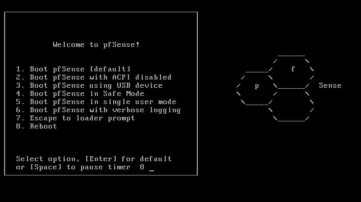
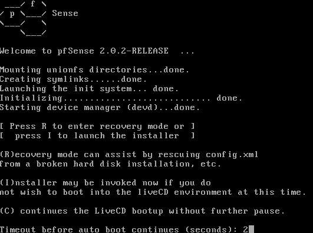
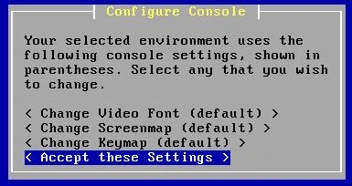
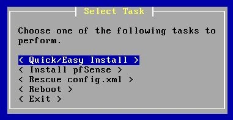
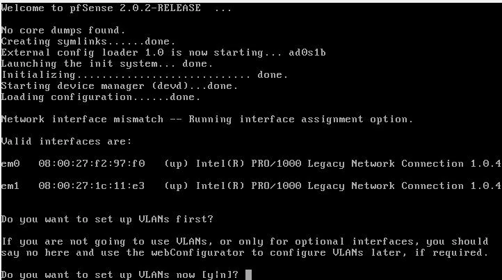
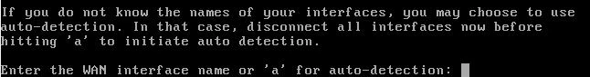
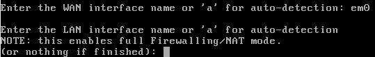
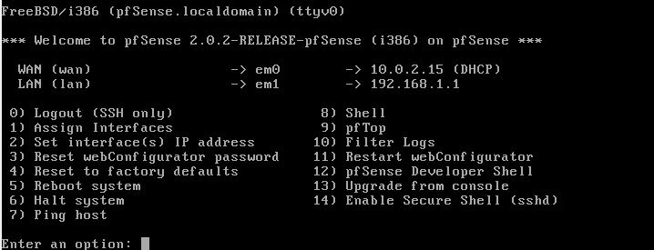

___

*Tento návod vychází z původního obsahu Floriana BURNELA zveřejněného na stránkách [IT-Connect](https://www.it-connect.fr/). Licence [CC BY-NC 4.0](https://creativecommons.org/licenses/by-nc/4.0/). V původním textu autora byly provedeny zásadní změny, aby byl výukový program aktuální*

___

## I. Prezentace

pfSense je bezplatný operační systém s otevřeným zdrojovým kódem, který promění jakýkoli počítač, dedikovaný server nebo hardwarové zařízení ve vysoce výkonný a vysoce konfigurovatelný směrovač a bránu firewall. Systém pfSense, založený na FreeBSD a proslulý svou stabilní a robustní síťovou architekturou, již více než patnáct let určuje standardy open source firewallů pro firmy, místní úřady i náročné domácí uživatele.

Jeho hlavní funkce se v průběhu let značně vyvíjely a s každou novou verzí byly vylepšovány. K dnešnímu dni nabízí pfSense :

- Kompletní centralizovaná správa prostřednictvím moderního, intuitivního a bezpečného webového rozhraní Interface Interface.
- Vysoce výkonný stavový firewall s pokročilou podporou NAT (včetně NAT-T) a granulární správou pravidel.
- Nativní podpora více sítí WAN, která umožňuje agregaci nebo redundanci připojení k internetu.
- Integrovaný server DHCP a relé.
- Vysoká dostupnost díky protokolu CARP pro failover a možnost konfigurace clusterů pfSense.
- Vyrovnávání zátěže mezi několika připojeními nebo servery.
- Plná podpora VPN: IPsec, OpenVPN a WireGuard (nahrazuje L2TP, které je nyní zastaralé).
- Konfigurovatelný kaptivní portál pro řízení přístupu hostů, zejména ve veřejném nebo hotelovém prostředí.

pfSense také nabízí rozšiřitelný systém balíčků, který umožňuje snadno přidávat pokročilé funkce, jako je transparentní proxy server (Squid), filtrování URL nebo IDS/IPS (Snort nebo Suricata) přímo z webu Interface.

v souladu s aktuálními doporučeními FreeBSD je pfSense distribuován pouze pro 64bitové platformy. Lze jej nainstalovat na standardní hardware (PC, rackové servery) nebo na vestavěné platformy s nízkou spotřebou, jako jsou zařízení Netgate nebo některé nízkoprofilové krabice x86, které jsou mnohem výkonnější než starší krabice Alix.

Nakonec je třeba připomenout, že aplikace pfSense vyžaduje alespoň dvě fyzická síťová rozhraní: jedno vyhrazené pro vnější zónu (WAN) a jedno vyhrazené pro vnitřní síť (LAN). V závislosti na složitosti vaší infrastruktury (DMZ, VLAN, více sítí WAN) může být k plnému využití jeho možností zapotřebí několik dalších rozhraní.

## II. Stáhnout obrázek

Poslední stabilní verze aplikace pfSense v době psaní tohoto návodu je 2.8 (vydaná v červnu 2025). Obraz ISO nebo instalační soubor přizpůsobený vašemu hardwarovému prostředí si můžete stáhnout přímo z oficiálních webových stránek :

- [Stáhnout pfSense](https://www.pfsense.org/download/)

Portál pro stahování umožňuje vybrat :

- Architektura (obecně **AMD64** pro veškerý moderní hardware).
- Typ bitové kopie (**Installer USB Memstick** pro instalaci přes USB flash disk, **ISO Installer** pro vypalování nebo virtuální editaci).
- Nejbližší zrcadlo pro stahování, aby se optimalizovala rychlost přenosu.

Pro ty, kteří chtějí nasadit pfSense ve virtualizovaném prostředí (Proxmox, VMware ESXi, VirtualBox...), je k dispozici také obraz **OVA**. Tento virtuální počítač připravený k použití výrazně zjednodušuje instalaci a počáteční konfiguraci. Jen se ujistěte, že jste přizpůsobili přidělené zdroje (CPU, RAM, síťová rozhraní) podle očekávaného zatížení a topologie sítě.

Před instalací doporučujeme zkontrolovat integritu staženého souboru ověřením kódu **SHA256** uvedeného na oficiální stránce pro stahování. Tím zajistíte, že obraz nebyl změněn nebo poškozen.

## III. Instalace

V tomto příkladu je instalace provedena na virtuálním počítači se systémem VirtualBox. Postup zůstává zcela totožný na fyzickém počítači nebo jiném hypervizoru, s výjimkou správy virtuálních zařízení.

### 1. Minimální požadavky na hardware

Pro standardní nasazení doporučujeme :

- minimálně 1 GB RAM** (doporučuje se 2 GB nebo více, aby bylo možné používat další balíčky nebo podporu ZFS).
- 8 GB místa na disku** (pro pokročilejší konfigurace je vhodnější 20 GB nebo více, zejména pokud instalujete proxy cache, IDS/IPS nebo podrobné protokoly).
- Alespoň dvě virtuální síťová rozhraní** (jedno pro WAN, jedno pro LAN). Ve VirtualBoxu je před spuštěním přidejte do nastavení virtuálního počítače.

### 2. Spuštění instalačního programu

Připojte stažený obraz ISO jako virtuální optickou jednotku ve VirtualBoxu nebo vložte klíč USB, pokud instalujete na fyzický počítač. Při spuštění se zobrazí spouštěcí nabídka:

Pokud nezvolíte žádné možnosti, aplikace pfSense se po několika sekundách automaticky spustí s výchozími možnostmi. Stisknutím klávesy "**Enter**" zahájíte normální spuštění.

Po zobrazení hlavní nabídky rychle stiskněte tlačítko "**I**", čímž zahájíte instalaci.

### 3. Počáteční nastavení instalačního programu

Na první obrazovce můžete nastavit několik regionálních parametrů, například písmo zobrazení a kódování znaků. Tato nastavení jsou užitečná ve specifických případech (nestandardní klávesnice, sériové obrazovky, orientální jazyky). U většiny instalací ponechte výchozí hodnoty a vyberte možnost "**Přijmout tato nastavení**".

### 4. Volba režimu instalace

Výběrem možnosti "**Rychlá/Snadná instalace**" spustíte automatickou instalaci s doporučenými možnostmi. Tato metoda odstraní vybraný disk a nakonfiguruje pfSense s výchozím rozdělením.

Zobrazí se varování, že všechna data na disku budou odstraněna. Potvrďte tlačítkem "**OK**".

Instalační program poté zkopíruje potřebné soubory na disk. V závislosti na hardwaru to může trvat několik sekund až několik minut.

### 5. Výběr jádra

Když vás instalační program vyzve k výběru typu jádra, ponechte vybranou možnost "**Standardní jádro**". Toto obecné jádro se dokonale hodí pro standardní nasazení, ať už na počítači, serveru nebo virtuálním počítači.

### 6. Ukončení instalace a restart

Po dokončení instalace vyberte možnost "**Reboot**" a restartujte počítač v nové instanci aplikace pfSense.

**Důležitá poznámka**: před restartem odstraňte obraz ISO nebo odpojte instalační USB klíč, abyste se při dalším spuštění vyhnuli restartování instalačního programu.

## IV. První spuštění aplikace pfSense

Při prvním spuštění musí být aplikace pfSense nakonfigurována tak, aby rozpoznala a správně přiřadila svá síťová rozhraní (WAN, LAN, DMZ, VLAN atd.). Pečlivá identifikace síťových karet je nezbytná, aby nedošlo k chybám v konfiguraci, které by vás mohly připravit o přístup k webu Interface nebo vyřadit firewall z provozu.

Při spuštění aplikace pfSense automaticky zjistí a vypíše všechna dostupná síťová rozhraní a pro každé z nich uvede MAC Address. To usnadňuje jejich rozlišení.

### 1. VLAN

První otázka se týká konfigurace sítí VLAN. V této fázi, pro základní konfiguraci, nebudeme aktivovat žádné sítě VLAN. Stisknutím klávesy "**N**" tedy tento krok přeskočíte.

### 2. WAN a LAN Interface Assignment

aplikace pfSense vás poté vyzve, abyste definovali, který z Interface bude použit pro WAN (přístup k Internetu). Můžete si vybrat mezi :

- Název Interface zadejte ručně (doporučeno pro virtuální prostředí).
- Stisknutím tlačítka "**A**" použijte automatickou detekci. Tato možnost je užitečná na fyzickém hostiteli za předpokladu, že jsou síťové kabely připojeny a spojení jsou aktivní.

V tomto příkladu provedeme ruční konfiguraci sítě WAN. Zadejte přesný název Interface. Pro desku Intel bude tento název pod FreeBSD často "**em0**", ale může se lišit v závislosti na hardwaru. Například karta Realtek se často zobrazuje jako "**re0**".

Stejnou operaci zopakujte pro definování sítě Interface LAN. Zde použijeme "**em1**".

pfSense potvrzuje, že síť Interface LAN aktivuje bránu firewall i NAT k ochraně vnitřní sítě a správě překladu Address.

Pokud máte další fyzická rozhraní, můžete v této fázi nakonfigurovat další rozhraní (DMZ, Wi-Fi, specifické VLAN). Každý logický Interface vyžaduje odpovídající síťovou kartu nebo virtuální Interface. Pro počáteční konfiguraci se omezíme na sítě WAN a LAN.

Po dokončení přiřazení zobrazí aplikace pfSense přehledný souhrn souvztažností mezi fyzickými rozhraními a přiřazenými rolemi. Potvrďte tlačítkem "**Y**".

### 3. Konzola PfSense

Po dokončení tohoto kroku se zobrazí hlavní nabídka konzoly pfSense. Nabízí několik užitečných možností pro přímou správu, jako je resetování webového hesla, restartování, znovunačtení konfigurace nebo nové přiřazení rozhraní.

Zobrazí se také souhrn aktuálních síťových nastavení včetně výchozí IP adresy Interface LAN Address, obvykle **192.168.1.1**. Tuto adresu Address budete muset zadat do prohlížeče, abyste mohli přistupovat na webovou administraci Interface.

**Poznámka**: Pokud vaše interní síť používá jiný rozsah Address, zvolte v nabídce "**2)** Nastavit Interface(s) IP Address" a přiřaďte IP Address vhodnou pro vaše prostředí.

Pokud je síť WAN Interface ve výchozím nastavení připojena ke skříni nebo modemu s konfigurací DHCP, aplikace pfSense automaticky získá veřejnou IP adresu Address. Měli byste tedy využívat okamžitý přístup k internetu připojením klienta k síti pfSense Interface LAN.

## V. První přístup k webu Interface

Po dokončení úvodního spuštění a konfiguraci síťových rozhraní můžete přistoupit k webu Interface aplikace pfSense a dokončit a doladit konfiguraci.

### 1. Počáteční připojení

Připojte počítač k portu LAN (nebo k virtuální síti LAN Interface v hypervizoru) a v případě potřeby mu přiřaďte IP adresu Address ve stejném rozsahu (ve výchozím nastavení pfSense automaticky distribuuje adresu Address prostřednictvím DHCP v síti LAN).

V prohlížeči přejděte na adresu Address uvedenou v konzole (ve výchozím nastavení `https://192.168.1.1`). Všimněte si, že aplikace pfSense vyžaduje HTTPS i pro první připojení - očekávejte proto varování o certifikátu podepsaném vlastním jménem, které můžete ignorovat přidáním výjimky.

Zobrazí se přihlašovací obrazovka. Výchozí přihlašovací údaje jsou :

- Uživatelské jméno:** `admin`
- Heslo:** `pfsense`

Tyto identifikátory budou upraveny během úvodního průvodce konfigurací.

## VI. Průvodce nastavením

Při prvním připojení vás aplikace pfSense vyzve, abyste postupovali podle **Průvodce nastavením**. Důrazně doporučujeme jej použít, abyste se ujistili, že jsou správně definovány všechny podstatné parametry.

### 1. Obecné parametry

Můžete :

- Zadejte název hostitele a místní doménu (příklad: `pfsense` a `lan.local`).
- Definujte servery DNS a vyberte, zda má aplikace pfSense používat DNS vašeho poskytovatele internetových služeb nebo externí službu (Cloudflare, OpenDNS, Quad9...).

### 2. Časové pásmo

Uveďte časové pásmo webu, aby byly protokoly a plány konzistentní (např. `Evropa/Paříž`).

### 3. Konfigurace sítě WAN

Konfigurace připojení WAN :

- Výchozí hodnota je **DHCP** (stačí, pokud jste za boxem).
- Pokud máte pevnou IP, zadejte parametry (statická IP, maska, brána, DNS) ručně.
- V případě potřeby definujte síť VLAN nebo ověření PPPoE (běžné u některých poskytovatelů internetových služeb).

### 4. Konfigurace sítě LAN

Průvodce navrhne změnu výchozí podsítě sítě LAN. Pokud máte konkrétní plán adresování, je nyní čas jej přizpůsobit.

### 5. Změna hesla správce

Zabezpečte svůj server pfSense okamžitým nastavením silného hesla pro uživatele `admin`.

## VII. Ověřování a aktualizace

Před nasazením brány firewall se ujistěte, že máte nejnovější verzi :

- Přejděte na **Systém > Aktualizace**.
- Vyberte aktualizační kanál (obvykle **Stabilní**).
- Zkontrolujte aktualizace a použijte je.

Je dobré povolit upozornění na aktualizace, abyste byli informováni o bezpečnostních záplatách.

## VIII. Uložení konfigurace

Před provedením jakýchkoli zásadních změn zaveďte zásady zálohování:

- Přejděte na **Diagnostika > Zálohování a obnovení**.
- Stáhněte kopii aktuální konfigurace (`config.xml`).
- Uchovávejte je na bezpečném místě (na zašifrovaném externím médiu).

U kritických prostředí zvažte automatické zálohování konfigurace na externím serveru nebo pomocí naprogramovaného skriptu.

## IX. Osvědčené postupy po instalaci

Chcete-li ukončit své nasazení s klidnou myslí :

- Úprava pravidel brány firewall**: ve výchozím nastavení povoluje aplikace pfSense veškerý odchozí provoz v síti LAN a blokuje příchozí provoz v síti WAN. Upravte tato pravidla podle potřeby.
- Konfigurace zabezpečeného vzdáleného přístupu**: v případě potřeby povolte přístup k webu Interface z WAN pouze prostřednictvím VPN nebo s omezením IP.
- Povolit oznámení**: nakonfigurujte server SMTP pro příjem upozornění (selhání, aktualizace, chyby).
- Nainstalujte užitečná rozšíření**: například IDS/IPS (Snort, Suricata), proxy (Squid), filtrování DNS (pfBlockerNG).

Váš firewall pfSense je nyní spuštěn a připraven chránit vaši síť. Díky jeho flexibilitě a aktivní komunitě máte k dispozici výkonný, škálovatelný nástroj, který se může přizpůsobit vašim budoucím potřebám (multi-WAN, VLAN, site-to-site VPN, captive portal atd.).

Pravidelně nahlížejte do oficiální dokumentace ([docs.netgate.com](https://docs.netgate.com/pfsense/en/latest/)), abyste zjistili nové funkce a ujistili se, že je vaše konfigurace aktuální a bezpečná.