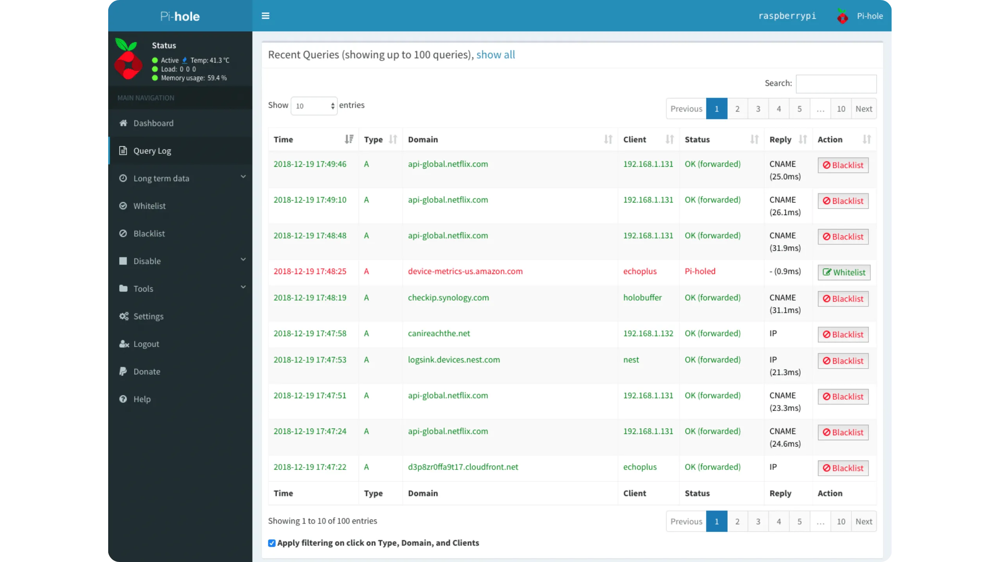


___


*Hướng dẫn này dựa trên nội dung gốc của Florian Duchemin được đăng trên [IT-Connect](https://www.it-connect.fr/). Giấy phép [CC BY-NC 4.0](https://creativecommons.org/licenses/by-nc/4.0/). Văn bản gốc có thể đã có một số thay đổi.*


___


## I. Trình bày


Tất cả chúng ta đều đã làm điều này ngay khi khởi động trình duyệt yêu thích: cài đặt **adblocker** (trình chặn quảng cáo). Tuy nhiên, khi sử dụng trình duyệt trên TV hoặc thiết bị Android, v.v... thì việc tìm ra thứ gì đó phù hợp lại hơi khó khăn hơn một chút. Và nếu có nhiều hơn một thiết bị trong nhà, bạn phải lặp lại thao tác này cho từng trình duyệt!


Trong hướng dẫn này, chúng ta sẽ giải quyết một vấn đề đơn giản**: cung cấp trình chặn quảng cáo cho tất cả các máy trong mạng của chúng ta và quản lý tập trung.**


Để thực hiện điều này, chúng ta sẽ sử dụng một công cụ được phát triển cho mục đích này: **Pi-Hole**


Pi-Hole là một DNS sinkhole. Nó sẽ sử dụng các yêu cầu DNS do thiết bị của bạn tạo ra để xác thực hoặc từ chối lưu lượng truy cập, do đó bảo vệ bạn khỏi các địa chỉ và tên miền được biết là đang phân phối quảng cáo, phần mềm độc hại, v.v.


DNS là viết tắt của Hệ thống Tên Miền. Vậy tên miền là gì? "it-connect.fr" chỉ là một ví dụ. Tên miền là một mã định danh duy nhất cho một hoặc nhiều tài nguyên, thường được quản lý bởi một thực thể duy nhất.


Tên máy cộng với tên miền được gọi là FQDN, viết tắt của *Tên miền đủ điều kiện*. Nó cho phép bạn truy cập một máy cụ thể chỉ bằng cách "gọi" máy đó. Ví dụ: khi bạn nhập "www.trucmachin.com", thực ra bạn đang gọi máy đó là "www", thuộc về tên miền "trucmachin.com".


Ngoại trừ việc máy tính của chúng ta không hiểu ngôn ngữ con người, chúng chỉ hiểu hệ nhị phân, do đó chúng cần có IP Address, tương đương với số điện thoại, để truy cập vào trang web.


Vì vậy, mỗi khi bạn nhập tên trang web vào trình duyệt hoặc nhấp vào liên kết, máy tính của bạn sẽ yêu cầu máy chủ DNS cung cấp IP Address tương ứng với tên đó.


**Pi-Hole sau đó sẽ kiểm tra các yêu cầu này (có hàng trăm yêu cầu mỗi ngày!) và tự động chặn những yêu cầu được biết là lưu trữ quảng cáo hoặc thậm chí là các tệp độc hại**


## II. Cài đặt Pi-Hole


Với cái tên Pi-Hole, bạn có thể cho rằng mình cần một chiếc Raspberry-Pi... Nhưng điều đó không hoàn toàn đúng. **Pi-Hole có thể được cài đặt trên bất kỳ máy tính Linux nào (Debian, Fedora, Rocky, Ubuntu, v.v.)**


Mặt khác, bạn cần lưu ý rằng **thiết bị này sẽ phải chạy 24 giờ một ngày vì một lý do đơn giản: không có DNS, không có Internet!** Do đó, Raspberry là một ý tưởng hay vì nó hầu như không tiêu thụ năng lượng.


Để cài đặt, chỉ cần kết nối với máy Linux của bạn qua SSH và nhập lệnh sau với tư cách là "*root*":


```
curl -sSL https://install.pi-hole.net | bash
```


> **Lưu ý**: Trong trường hợp bình thường, không nên "hack" một tập lệnh nếu chưa biết nó hoạt động như thế nào. Nếu bạn không chắc chắn, hãy truy cập trang web bằng trình duyệt hoặc tải xuống nội dung dưới dạng tệp.
>


> **Lưu ý: trên các phiên bản tối thiểu của Debian 11, Curl không được cài đặt, do đó bạn cần cài đặt thủ công bằng lệnh** `apt-get install curl` **trước khi nhập lệnh trên.**

Sau khi tập lệnh chạy, một loạt các bài kiểm tra sẽ được thực hiện và quá trình cài đặt sẽ tự động diễn ra:


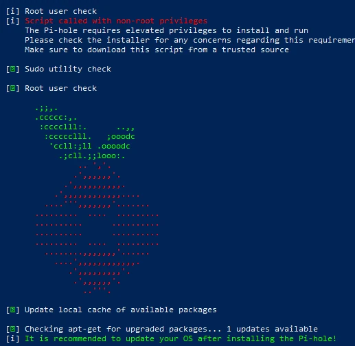


Cài đặt Pi-Hole


Sau khi cài đặt hoàn tất, bạn sẽ được chuyển đến màn hình này:


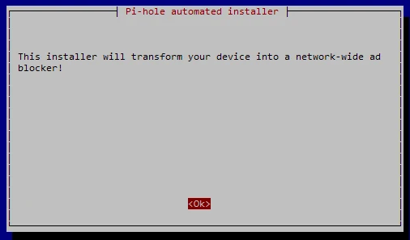


Màn hình khởi động Pi-Hole


> **Lưu ý**: Nếu bạn đang sử dụng DHCP trên máy, bạn sẽ nhận được thông báo cảnh báo về vấn đề này. Tất nhiên, để sử dụng đúng cách, chúng tôi đặc biệt khuyến nghị bạn nên gán IP cố định cho máy.

Sau màn hình này, bạn sẽ nhận được một vài thông báo, rồi được chuyển đến trình hướng dẫn cấu hình. Trình hướng dẫn này sẽ hỏi bạn xem Pi-Hole sẽ chuyển tiếp yêu cầu đến máy chủ DNS nào. Về phần mình, tôi đã chọn Quad9, vì nó có điều khoản về quyền riêng tư của người dùng.


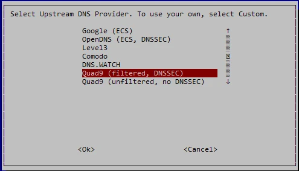


Lựa chọn DNS - Pi-Hole


> **Lưu ý: Nếu bạn làm việc trong một công ty, rất có thể máy chủ DNS hiện tại của bạn là bộ điều khiển miền Active Directory. Tuy nhiên, đừng lo lắng, sau này bạn có thể chỉ định một trình chuyển hướng có điều kiện cho miền bạn chọn. Thông thường, bạn sẽ có thể chuyển hướng bất kỳ yêu cầu nào liên quan đến miền cục bộ của mình đến máy chủ DNS.**

Bạn sẽ thấy một số tùy chọn bao gồm tùy chọn DNSSEC. Về cơ bản, giao thức DNS không an toàn (vào thời điểm đó, nó không được thiết kế với mục đích này). DNSSEC giải quyết vấn đề này bằng cách thêm Layer bảo mật thông qua mã hóa và ký kết trao đổi, như được giải thích trong bài viết tương ứng: [Bảo mật DNS](https://www.it-connect.fr/securite-dns-doh-quest-ce-le-dns-over-https/)


Bất kỳ trình chặn quảng cáo nào cũng dựa vào một hoặc nhiều danh sách để hoạt động. Pi-Hole mặc định chỉ có một danh sách, vì vậy hãy chọn danh sách đó và thêm danh sách khác sau.


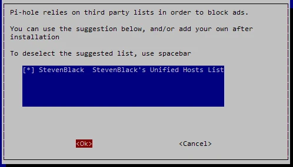


Về vấn đề Interface web, việc cài đặt là tùy chọn, vì công cụ này có dòng lệnh riêng để quản lý và hiển thị. Tuy nhiên, Interface này khá dễ sử dụng và được thiết kế tốt, vì vậy tôi khuyên bạn nên cài đặt cùng lúc:


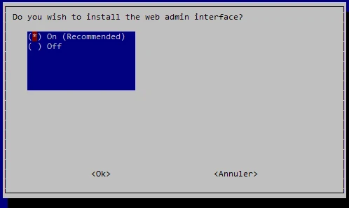


Nếu bạn đang cài đặt Pi-Hole trên máy tính đã có máy chủ Web, bạn có thể trả lời "không" cho câu hỏi sau. Tuy nhiên, xin lưu ý rằng cần phải có PHP và một số mô-đun để hoạt động. Nếu không, **lightpd sẽ được cài đặt với tất cả các mô-đun cần thiết**.


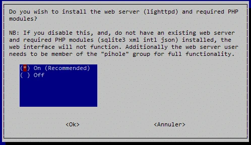


Sau đó, bạn sẽ được hỏi có muốn ghi lại các yêu cầu DNS hay không. **Nếu bạn muốn giữ lại lịch sử, hãy đặt thành có; nếu không, hãy đặt thành không, nhưng bạn sẽ mất một số chức năng** (xem màn hình tiếp theo).


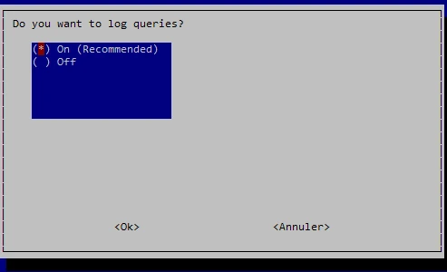


Đối với web Interface, Pi-Hole sử dụng một chức năng riêng gọi là FTLDNS, cung cấp API và tạo số liệu thống kê từ các yêu cầu DNS. Chức năng này có thể bao gồm chế độ "riêng tư" để che giấu tên miền được yêu cầu, khách hàng đứng sau yêu cầu, hoặc cả hai. Tiện lợi nếu bạn muốn giám sát mà không xâm phạm quyền riêng tư của người khác, hoặc đơn giản là nếu bạn muốn tuân thủ các quy định liên quan khi sử dụng trên mạng công cộng.


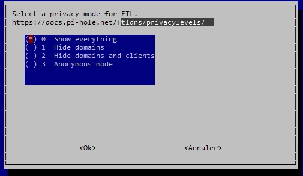


Lựa chọn lối sống riêng tư


Sau khi câu hỏi cuối cùng này được trả lời, tập lệnh sẽ thực hiện nhiệm vụ của nó: tải xuống kho lưu trữ GitHub và cấu hình Pi-Hole. Khi quá trình cài đặt kết thúc, một màn hình tóm tắt sẽ hiển thị với các thông tin quan trọng:


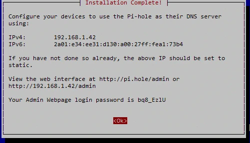


Màn hình tóm tắt cài đặt


Ghi lại mật khẩu web Interface và thông tin mạng. Bây giờ là lúc cấu hình dịch vụ DHCP tại vị trí hiện tại của chúng ta.


## III. Cấu hình DHCP


Để hoạt động, Pi-Hole cần "giải quyết" các yêu cầu DNS từ máy khách, vì vậy chúng phải biết đó là máy khách cần gửi yêu cầu đến. Có một số cách để thực hiện việc này:


- Sửa đổi cài đặt DNS trong máy chủ DHCP của bạn (ví dụ: Box của bạn)
- Vô hiệu hóa máy chủ này và sử dụng máy chủ do Pi-Hole cung cấp
- Sửa đổi thủ công từng thiết bị để sử dụng Pi-Hole làm DNS


Cá nhân tôi chọn giải pháp đầu tiên. Khả năng cao là **bạn đã có máy chủ DHCP ở nơi bạn ở** (thường là hộp của bạn). Vì vậy, không cần phải bận tâm.


Vì có rất nhiều khả năng, giữa các hộp điều khiển khác nhau (mà tôi không biết hết) và những hộp có bộ định tuyến riêng, tôi sẽ không cung cấp ảnh chụp màn hình cho những thay đổi này. Trong mọi trường hợp, bạn cần vào cài đặt DHCP và sửa đổi tham số "DNS" để bao gồm IP Address của Pi-Hole.


Sau khi thực hiện xong, nếu bất kỳ thiết bị nào đã được bật trước đó, chúng sẽ giữ nguyên cài đặt cũ, do đó bạn cần phải khởi động lại yêu cầu cấu hình.


Trên máy trạm Windows, với dấu nhắc lệnh:


```
ipconfig /renew
```


Trên máy trạm Linux:


```
dhclient
```


Đối với tất cả các thiết bị khác, bạn phải tắt và bật lại.


Vì vậy, họ nên lấy các thông số phù hợp để kiểm tra:


```
ipconfig /all
```


Trong trường DNS, bạn phải có Address của Pi-Hole, trong trường hợp của tôi là 192.168.1.42:


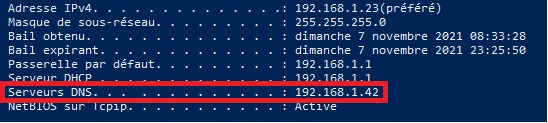


## IV. Sử dụng Pi-Hole web Interface


Để thuận tiện cho việc quản lý, **Pi-Hole** được hưởng lợi từ nền tảng web Interface được thiết kế tốt. Thân thiện với người dùng và dễ sử dụng, Pi-Hole cho phép bạn:


- Xem số lượng yêu cầu, yêu cầu bị chặn, v.v. theo thời gian thực.
- Quản lý danh sách trắng và danh sách đen của bạn
- Thêm mục nhập tĩnh, bí danh, v.v.
- Thêm danh sách
- Và nhiều chức năng khác nữa!


Về phần mình, tôi sẽ thêm một danh sách chặn. Như đã đề cập ở trên, chỉ có một danh sách được cài đặt cùng lúc với Soft. Có rất nhiều danh sách dành cho các trang web quảng cáo, nhưng tốt nhất nên chọn ít nhất một danh sách cụ thể cho quốc gia bạn đang sống. Một trong những danh sách phổ biến nhất là **EasyList**, và một trong số đó dành riêng cho Pháp: [EasyList-ListFR](https://raw.githubusercontent.com/deathbybandaid/piholeparser/master/Subscribable-Lists/ParsedBlacklists/EasyList-Liste-FR.txt)


Để thêm nó, trước tiên hãy kết nối với quản trị viên Interface: **http://<ip_du_PiHole>/admin**


Mật khẩu quản trị viên đã được tạo (xem ảnh chụp màn hình khi kết thúc cài đặt), do đó, tất cả những gì bạn cần làm là nhập mật khẩu đó để truy cập Interface:


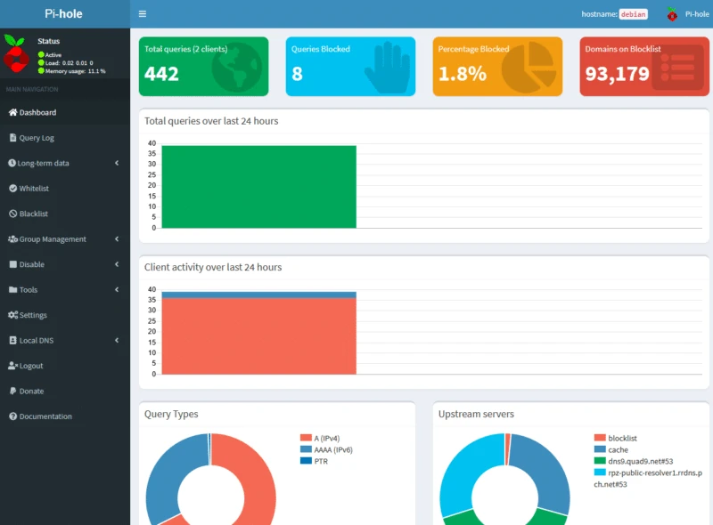


Interface từ Pi-Hole


Ví dụ, chúng ta có thể thấy có hai khách hàng được kết nối với Pi-Hole, Pi-Hole đã xử lý 442 yêu cầu và 8 trong số đó đã bị chặn. Những biểu đồ này có thể là một nguồn thông tin hữu ích, đặc biệt là trong bối cảnh chuyên nghiệp.


Để thêm danh sách của chúng tôi, hãy vào menu "**Quản lý nhóm**" và "**Danh sách quảng cáo**":


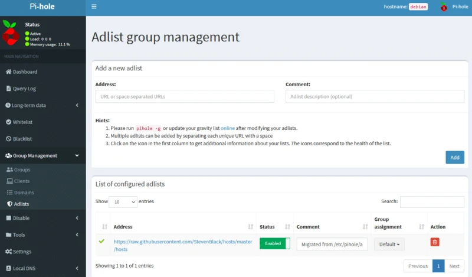


Chúng ta có thể thấy danh sách đầu tiên "**StevenBlack**", để thêm danh sách của mình, hãy sao chép liên kết tôi đã cung cấp ở trên và chèn vào trường "**Address**", đối với phần mô tả, tôi chọn đặt tên cho danh sách:


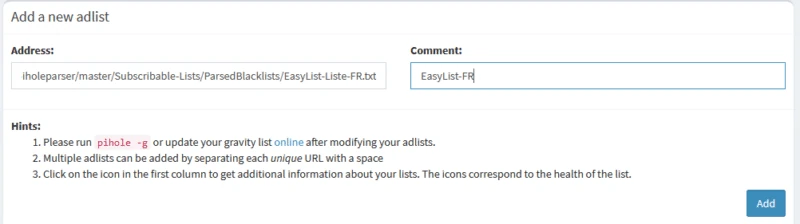


Thêm danh sách vào Pi-Hole


Việc còn lại là nhấp vào "**Thêm**" để thêm nó. Để kích hoạt nó, chúng ta cần thực hiện thêm một bước để "cảnh báo" Pi-Hole chiếm quyền kiểm soát danh sách này. Để thực hiện việc này:


- Hoặc sử dụng dòng lệnh tích hợp
- Hoặc là web Interface


Cá nhân tôi chọn cách thứ hai, vì nếu bạn xem kỹ, liên kết đến tập lệnh PHP thực hiện cập nhật nằm ngay trên trang chúng ta đang xem (chữ "trực tuyến"). Vì vậy, tất cả những gì bạn phải làm là nhấp vào nó, bạn sẽ được chuyển đến một trang chỉ có một tùy chọn:


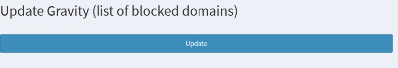


Trang này sẽ hiển thị kết quả của tập lệnh sau khi hoàn tất, nghĩa là danh sách đã được tính đến (trừ khi hiển thị thông báo lỗi).


Như đã thông báo ở đầu hướng dẫn này, Pi-Hole cũng cho phép bạn **chặn các tên miền được biết là phân phối phần mềm độc hại. Để củng cố tính năng này, tôi khuyên bạn nên thêm danh sách tên miền được cập nhật thường xuyên do Abuse.ch phân phối**, điều này sẽ tăng cường đáng kể tính bảo mật cho mạng của bạn, có sẵn tại [Address này](https://urlhaus.abuse.ch/downloads/hostfile/).


Tất nhiên, bạn có thể thêm bất kỳ danh sách nào bạn cho là có liên quan hoặc quản lý danh sách đen theo cách thủ công thông qua menu danh sách đen.


## V. Kiểm tra Pi-Hole


Bây giờ mọi thứ đã sẵn sàng, tất cả những gì bạn phải làm là kiểm tra giải pháp để đảm bảo nó hoạt động bình thường.


Ví dụ, tôi sẽ thử truy cập vào miền *http://admin.gentbcn.org/* nằm trong danh sách Abuse.ch vì miền này được biết là nơi lưu trữ phần mềm độc hại:


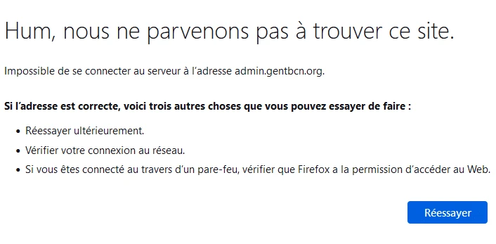


Rõ ràng là tôi đã bị chặn ở đâu đó. Để chắc chắn Pi-Hole đã thực hiện việc này, chúng ta có thể kiểm tra nhật ký truy vấn trong "Nhật ký truy vấn" của Interface để xem nó có bị chặn khỏi mục nhập danh sách hay không:


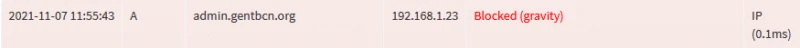


## VI. Kết luận


Trong hướng dẫn này, chúng tôi sẽ chỉ cho bạn cách thiết lập máy chủ DNS không chỉ loại bỏ hầu hết quảng cáo để bạn duyệt web thoải mái hơn mà còn tăng cường **Layer về bảo mật bằng cách chặn các tên miền lừa đảo và phát tán phần mềm độc hại**.


Tất cả đều miễn phí và tiết kiệm nếu cài đặt trên Raspberry-Pi (về mặt tiêu thụ điện năng).