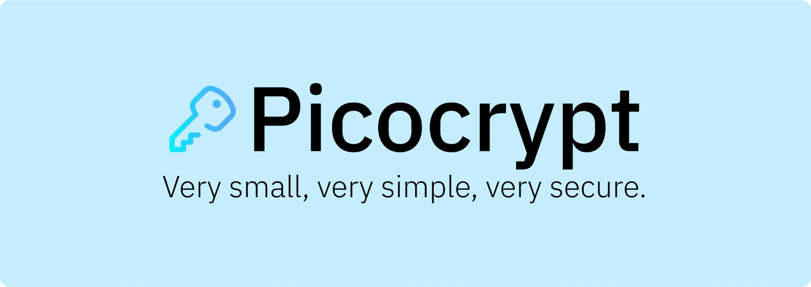
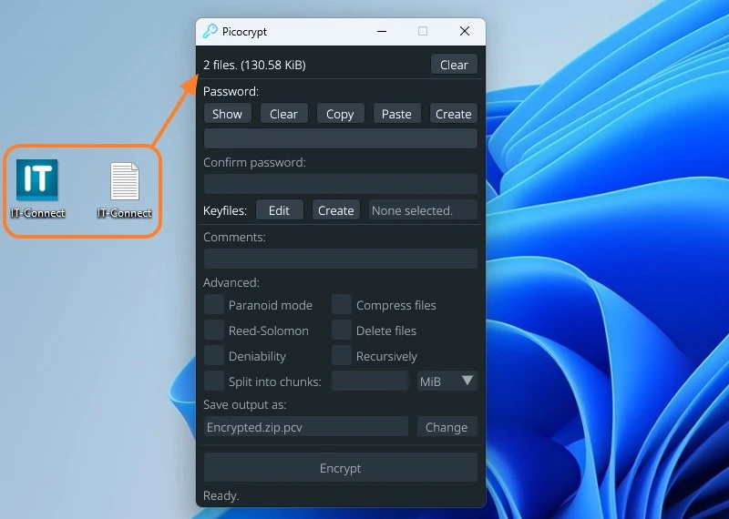
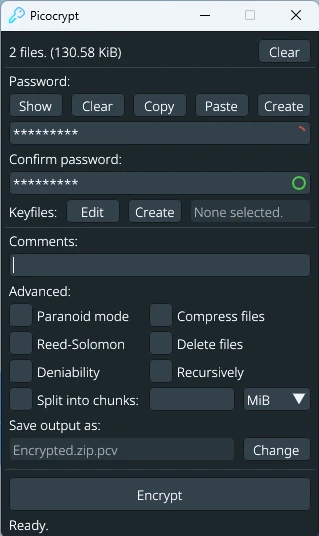
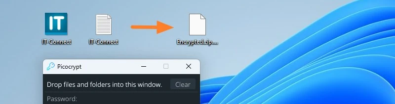
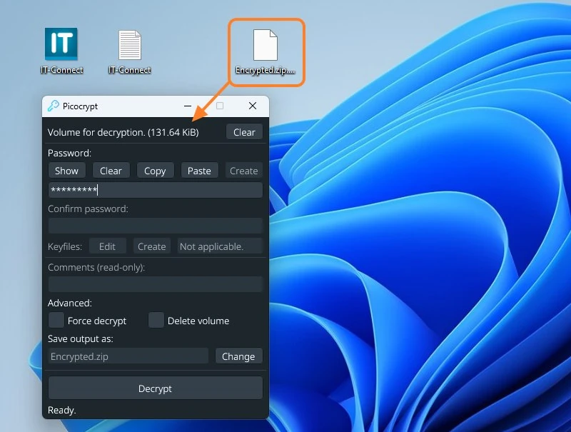
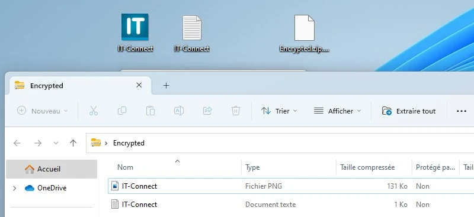

___

*本教程基于 Florian BURNEL 在 [IT-Connect](https://www.it-connect.fr/) 上发表的原创内容。授权许可 [CC BY-NC 4.0](https://creativecommons.org/licenses/by-nc/4.0/)。对原始内容进行了修改。

___

## I.介绍

在本教程中，我们将介绍 Picocrypt，这是一款简单、轻便、有效的加密软件，可用于对数据进行高度安全的加密。

适用于**加密文件**，你可以用它来保护电脑、U盘中的**数据，也可以保护存储在云中的数据。例如，你可以加密数据并将其存储在**微软OneDrive、谷歌硬盘、iCloud或Dropbox**上。

当你需要与第三方**共享数据时，也可以使用它：有了 Picocrypt 和解密密钥，他们就能解密他们机器上的数据。因此，如果您的账户或电脑受到威胁，您的数据也会受到保护。

要跟踪 Picocrypt 项目，只有一个 Address：

- [GitHub上的Picocrypt](https://github.com/Picocrypt/Picocrypt)

PicoCrypt 完全**免费、开源**，适用于**Windows、**Linux**和**macOS**。在 Windows 上，您可以在自己的机器上安装，也可以使用便携版。

## II.开源加密软件 Picocrypt

Picocrypt** 加密软件是其他知名解决方案的***替代方案，如**VeraCrypt**和**Cryptomator**（*设计用于云环境*的数据加密）或**AxCrypt**。顺便说一句，在 Picocrypt 的官方 GitHub 上，你可以找到与一些竞争对手的比较：

|                | Picocrypt                                                                          | VeraCrypt   | 7-Zip GUI | BitLocker  | Cryptomator |
| -------------- | ---------------------------------------------------------------------------------- | ----------- | --------- | ---------- | ----------- |
| Free           | ✅ Yes                                                                              | ✅ Yes       | ✅ Yes     | ✅ Bundled  | ✅ Yes       |
| Open Source    | ✅ GPLv3                                                                            | ✅ Multi     | ✅ LGPL    | ❌ No       | ✅ GPLv3     |
| Cross-Platform | ✅ Yes                                                                              | ✅ Yes       | ❌ No      | ❌ No       | ✅ Yes       |
| Size           | ✅ 3 MiB                                                                            | ❌ 20 MiB    | ✅ 2 MiB   | ✅ N/A      | ❌ 50 MiB    |
| Portable       | ✅ Yes                                                                              | ✅ Yes       | ❌ No      | ✅ Yes      | ❌ No        |
| Permissions    | ✅ None                                                                             | ❌ Admin     | ❌ Admin   | ❌ Admin    | ❌ Admin     |
| Ease-Of-Use    | ✅ Easy                                                                             | ❌ Hard      | ✅ Easy    | ✅ Easy     | 🟧 Medium   |
| Cipher         | ✅ XChaCha20                                                                        | ✅ AES-256   | ✅ AES-256 | 🟧 AES-128 | ✅ AES-256   |
| Key Derivation | ✅ Argon2                                                                           | 🟧 PBKDF2   | ❌ SHA-256 | ❓ Unknown  | ✅ Scrypt    |
| Data Integrity | ✅ Always                                                                           | ❌ No        | ❌ No      | ❓ Unknown  | ✅ Always    |
| Deniability    | ✅ Supported                                                                        | ✅ Supported | ❌ No      | ❌ No       | ❌ No        |
| Reed-Solomon   | ✅ Yes                                                                              | ❌ No        | ❌ No      | ❌ No       | ❌ No        |
| Compression    | ✅ Yes                                                                              | ❌ No        | ✅ Yes     | ✅ Yes      | ❌ No        |
| Telemetry      | ✅ None                                                                             | ✅ None      | ✅ None    | ❓ Unknown  | ✅ None      |
| Audited        | ✅ [Yes](https://github.com/Picocrypt/storage/blob/main/Picocrypt.Audit.Report.pdf) | ✅ Yes       | ❌ No      | ❓ Unknown  | ✅ Yes       |

来源: [Github.com](https://github.com/Picocrypt/Picocrypt)

Picocrypt 是一款**轻量级**软件，只有**3 MB**大小，而且无需安装：它是一款**便携的应用程序**，具有无需管理员权限的优势！然而，它并没有忽视安全性，因为它依赖于**强大而可靠的算法**：

- XChaCha20** 加密算法
- 按键旁路功能 **Argon2**

除了上述优点外，真正吸引人的是**它的易用性！

它只需要一样东西： **代码审计**，但这是计划中的，从上面的比较表（最后一行）可以看出。不过，既然它是开源的，就没有什么能阻止你查看它的源代码。

尽管在上表中将其与 BitLocker 相提并论，但**我认为 BitLocker 和 Picocrypt 的用途是不同的**：BitLocker 用于加密整个卷（例如 Windows 卷），而 Picocrypt 用于加密树状结构或 "驱动器 "类型的存储空间。

## III.使用 Picocrypt

本演示将使用 Windows 11 机器。

### A.用 Picocrypt 加密数据

首先，你需要从官方 GitHub 下载 Picocrypt.exe（[参见本页](https://github.com/Picocrypt/Picocrypt/releases)）。

打开应用程序，屏幕上就会显示简约的 Interface。要加密数据，无论是**个文件、多个文件还是文件夹**，只需**拖放到 Picocrypt 的 Interface 中**。这将选择要加密的数据。

然后，在数据加密方面，您可以使用多个选项，包括加密密钥。它可以是**强密码**或**密钥文件形式的加密密钥**，也可以是**两者**。以密码为例，你可以选择创建自己的密码，或者使用 Picocrypt 生成密码。

该密码必须牢固，因为它可用于解密数据。在 "**密码**"和 "**确认密码**"下输入密码，然后点击 "**加密**"对数据进行加密！在此之前，您可以点击 "**输出保存为**"旁边的 "**更改**"按钮来指定输出目录。

**注**：要使用文件格式的密钥，请单击 "**密钥文件**"右侧的 "**创建**"来创建密钥。然后单击 "**编辑**"并将密钥文件拖放到相应区域即可选择密钥。

由于 **PCV** 是 Picocrypt 使用的扩展名，因此所选的两个文件将被**加密并**到文件 "**Encrypted.zip.pcv**"中。由于加密，该 ZIP 文件无法读取。为防止所选文件被集中到一个加密 ZIP 文件中，你需要选中 "**递归**"选项，这样加密文件的数量就和要加密的文件数量一样多了。

要访问数据，我们需要使用 Picocrypt 解密。

在讨论数据解密之前，我们先来了解一些可用选项的信息：

- 偏执模式**：使用 Picocrypt 提供的最高安全级别。该工具将使用多种级联加密算法（XChaCha20 和 Serpent）和 HMAC-SHA3 代替 BLAKE2b 进行数据验证。
- Reed-Solomon**：执行 *Reed-Solomon* 纠错码，以便对损坏的数据进行纠错。这样就可以支持约 3% 的文件损坏级别。
- 分割成块**或**分割成几个部分**：如果要加密一个大文件，可以要求 Picocrypt 将其分割成几个部分。这可能会使文件更容易传输。
- 压缩文件**或**压缩文件**：压缩文件以减小加密文件的大小。
- 删除的文件**或 **Fichiers supprimés**：删除源文件，只保留加密版本

### B.用 Picocrypt 解密数据

如果需要解密数据，并不比加密复杂。只需打开 Picocrypt 并**拖放要解密的 PCV 文件**。然后输入密码和/或选择密钥文件，最后点击 "**解密**"。

现在，"Encrypted.zip "ZIP 压缩包的未加密版本允许我以明文恢复两个文件！

## IV.结论

**我已经警告过你了Picocrypt 非常容易使用，而且非常有效！虽然 Interface 非常简约，但它集成了一些非常有用的自定义加密选项！而且，由于它有便携版，你可以随身携带，这样就可以放心地解密数据**。

请务必使用强密码保护数据，如果使用密钥文件，一定要记得备份，否则就无法解密 Picocrypt 生成的 PCV 容器了。最后，你应该知道还有一个[CLI 版本](https://github.com/Picocrypt/CLI)（功能较少）可以让你从命令行运行 Picocrypt：在这里，Picocrypt 再次为你打开了新的可能性之门。

https://planb.network/tutorials/computer-security/data/veracrypt-d5ed4c83-7c1c-4181-95ea-963fdf2d83c5