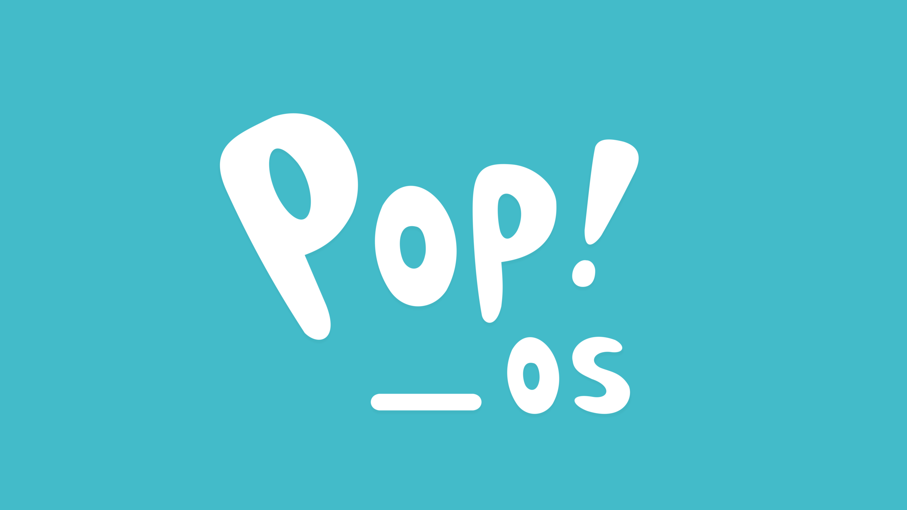


## Pendahuluan


Pop!OS adalah sistem operasi berbasis Linux yang dikembangkan oleh **System76**, produsen Amerika yang mengkhususkan diri pada mesin untuk pengembang, perancang, dan pengguna tingkat lanjut.


Dirancang untuk menawarkan lingkungan yang modern, stabil, dan berkinerja tinggi, Pop!OS memiliki pengalaman yang sederhana, alat yang kuat, dan fokus yang kuat pada produktivitas.


### Siapakah System76?


System76 adalah perusahaan Amerika yang didirikan pada tahun 2005 dan berbasis di Denver, yang mengkhususkan diri dalam pembuatan notebook, desktop, dan server yang dirancang khusus untuk Linux.


Tidak seperti produsen tradisional, System76 mengembangkan mesin yang dirancang untuk terbuka, dapat diperbaiki, dan berorientasi pada kebebasan perangkat lunak.


System76 tidak hanya membuat komputer.


Perusahaan ini juga mengembangkan :


- Pop!OS**, sistem operasi berbasis Linux miliknya sendiri;
- COSMIC**, lingkungan desktop modern berkinerja tinggi yang digunakan oleh Pop!OS;
- Open Firmware**, sebuah firmware sumber terbuka yang berbasis Coreboot;
- alat bantu untuk pengembang dan desainer.


Tujuannya adalah untuk menawarkan integrasi perangkat keras dan perangkat lunak berkualitas tinggi, yang sebanding dengan ekosistem Apple, tetapi sepenuhnya terbuka dan berpusat pada Linux.


## Sistem yang modern, stabil dan mudah diakses


Pop!OS dibangun di atas fondasi Ubuntu, memberikan stabilitas yang sangat baik, kompatibilitas perangkat keras yang luas, dan akses ke ekosistem perangkat lunak yang besar.


Ini menyediakan antarmuka yang elegan, desktop COSMIC, yang didesain agar lancar, intuitif dan dapat disesuaikan, bahkan untuk pengguna baru.


## Pilihan ideal untuk pengembang, desainer, dan pengguna yang menuntut


Pop!OS sangat dihargai oleh :


- pengembang (alat yang sudah diinstal sebelumnya, manajemen ubin tingkat lanjut),
- dengan kartu grafis Nvidia atau AMD,
- mahasiswa dan profesional yang mencari sistem yang andal,
- pengguna Windows yang ingin melakukan transisi sederhana.


Ini termasuk ubin otomatis, pusat perangkat lunak yang jelas dan alat produktivitas terintegrasi untuk mempermudah penggunaan sehari-hari.


## Sorotan Pop!OS


- Performa yang dioptimalkan** berkat pembaruan rutin.
- Tersedia dua versi ISO**: standar dan yang dioptimalkan untuk Nvidia.
- Keamanan yang ditingkatkan** (enkripsi LUKS tersedia pada saat instalasi).
- Interface COSMIC** ergonomis dan modern.
- Sangat kompatibel** dengan perangkat lunak Ubuntu dan Flatpak.


## Unduh POP!OS dengan aman


### 1. Prasyarat


Sebelum mengunduh dan menginstal POP!OS, ada beberapa hal yang perlu Anda lakukan untuk mempersiapkan lingkungan instalasi dengan benar.


### Peralatan yang dibutuhkan


- Komputer yang kompatibel**: Prosesor Intel atau AMD, GPU Intel / AMD / Nvidia.
- RAM minimal 4 GB** (disarankan 8 GB untuk penggunaan yang nyaman).
- minimal ruang kosong 20 GB** (disarankan 40 GB atau lebih).
- Kunci USB minimal 4 GB** untuk membuat media instalasi.


### Koneksi internet


Koneksi yang stabil berguna untuk :


- unduh gambar ISO,
- instal pembaruan setelah penginstalan.


Pop!OS dapat berjalan tanpa koneksi, tetapi pemasangannya jauh lebih lancar melalui Internet.


### Pencadangan data


Jika Pop!OS akan menggantikan atau hidup berdampingan dengan sistem lain (Windows, Ubuntu, dll.), disarankan untuk mencadangkan file-file penting sebelum melanjutkan.


### Periksa keberadaan GPU Nvidia (jika ada)


Untuk komputer yang dilengkapi dengan kartu grafis Nvidia, Anda harus mengunduh citra ISO khusus yang menyertakan driver Nvidia.


Pemeriksaan ini sangat sederhana:


- dengan membaca spesifikasi PC,
- atau dengan mencari model kartu grafis di pengaturan sistem.


### Unduh dari situs web resmi


Image ISO Pop!OS harus diunduh langsung dari halaman resmi System76: [system76.com/pop](https://system76.com/pop/).


Halaman ini selalu menawarkan versi terbaru, yang disesuaikan dengan perangkat keras Anda.


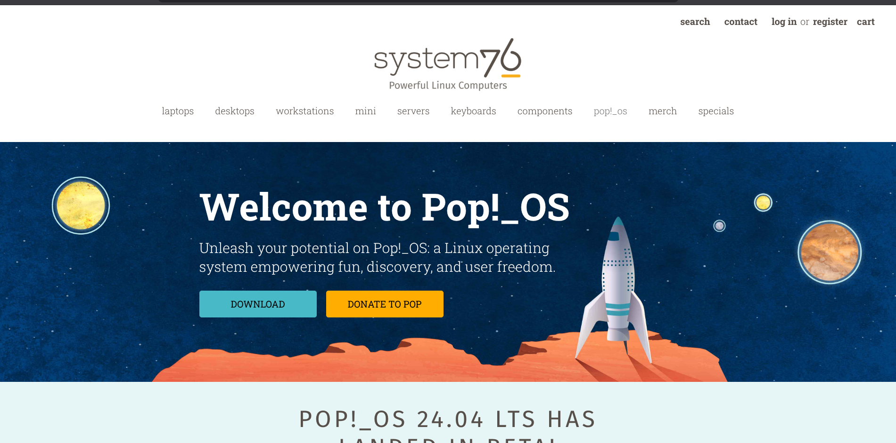


### Pilih versi: Standar atau Nvidia, atau Raspberry Pi (ARM64)


Pop!OS tersedia dalam tiga varian:


### Versi standar


Direkomendasikan untuk komputer yang menggunakan file :


- prosesor intel atau AMD;
- gPU Intel atau AMD yang terintegrasi;
- kartu grafis AMD Radeon.


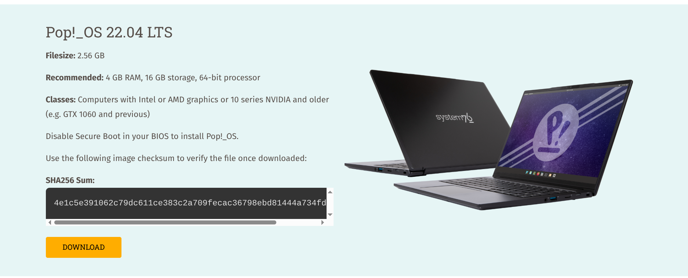


### Versi Nvidia


Direkomendasikan untuk komputer yang dilengkapi dengan kartu grafis Nvidia.


Gambar ini sudah menyertakan driver Nvidia, membuat instalasi lebih mudah dan mengurangi masalah grafis.


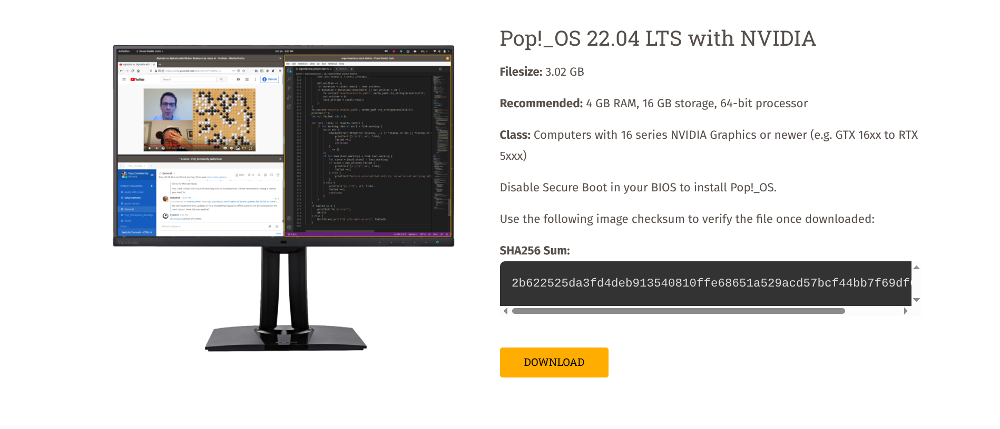


### Versi Raspberry Pi (ARM64)


Untuk Raspberry Pi 4 dan 400 (prosesor ARM).


Disesuaikan dengan arsitektur ARM, ini adalah versi khusus untuk komputer mini ini.


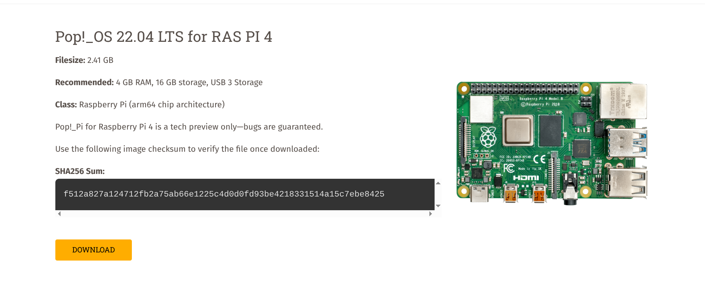


## Membuat kunci USB yang dapat di-boot


Anda dapat menggunakan beberapa alat bantu, seperti Balena Etcher :


- Unduh dan instal [Balena Etcher](https://etcher.balena.io/).


- Buka Balena Etcher, lalu pilih gambar ISO Pop!OS.
- Pilih kunci USB sebagai media tujuan.
- Klik Flash dan tunggu hingga proses selesai.


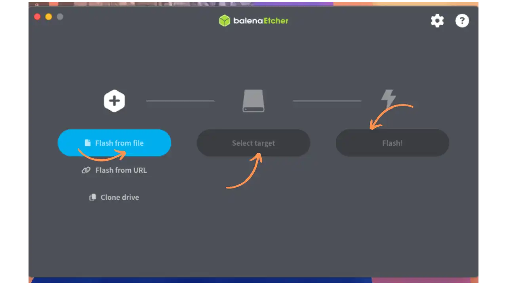


## Menginstal dan mengamankan Pop!OS


### Mem-boot dari kunci USB


- Matikan komputer.
- Colokkan kunci USB (yang berisi Pop!OS).
- Hidupkan komputer Anda. Pada PC terbaru, sistem akan secara otomatis mengenali kunci boot USB. Jika tidak demikian, lakukan boot ulang dengan menahan tombol akses BIOS/UEFI (biasanya F2, F12 atau Delete, tergantung pada merek).
  - Dalam menu BIOS/UEFI, pilih kunci USB Anda sebagai perangkat boot.
  - Simpan dan mulai ulang.


### Meluncurkan penginstalan


Setelah Anda memilih kunci USB yang dapat di-boot sebagai perangkat start-up, komputer Anda akan boot ke dalam lingkungan Pop!OS Live.


Pilih bahasa Anda.


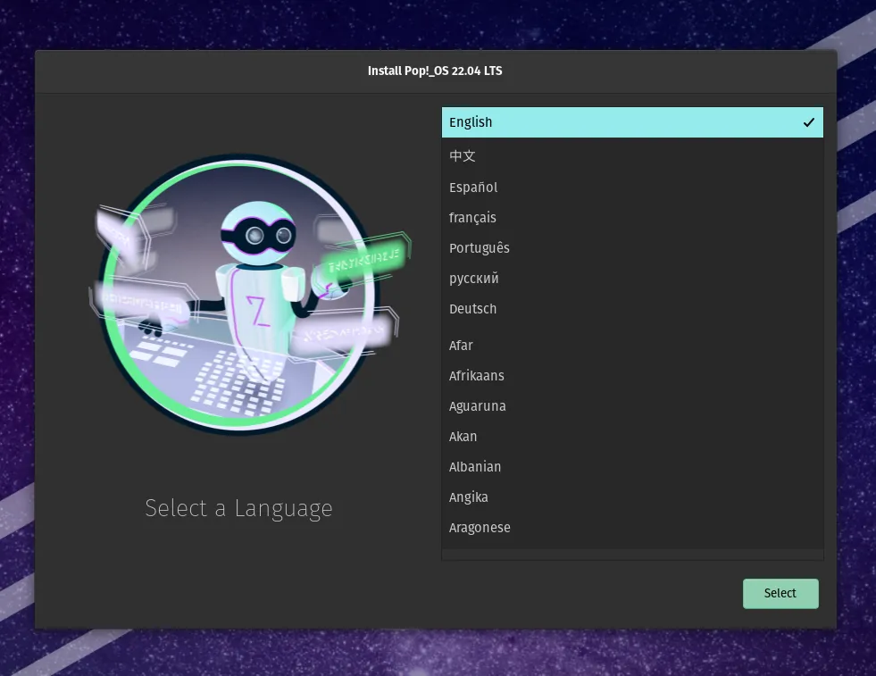


Pilih lokasi.


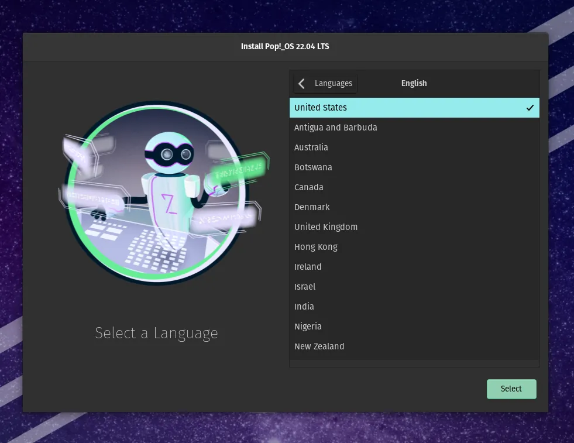


Pilih bahasa untuk input keyboard.


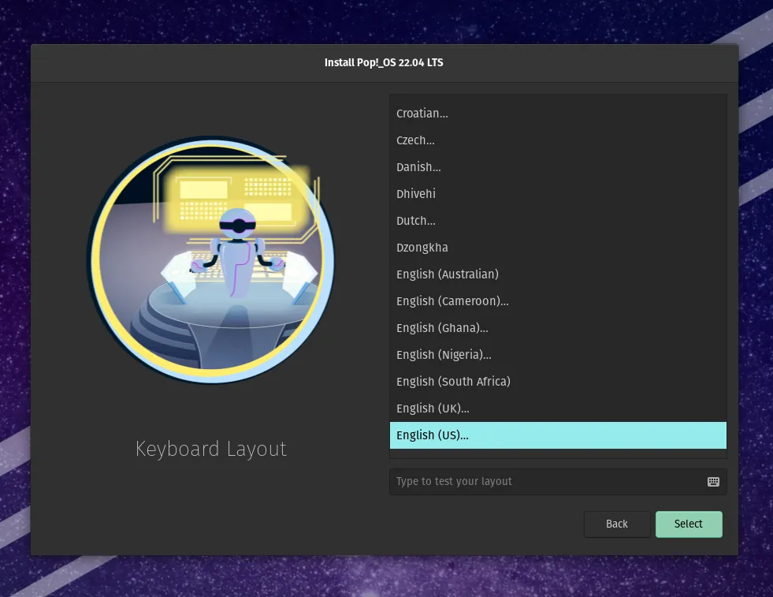


Pilih tata letak keyboard.


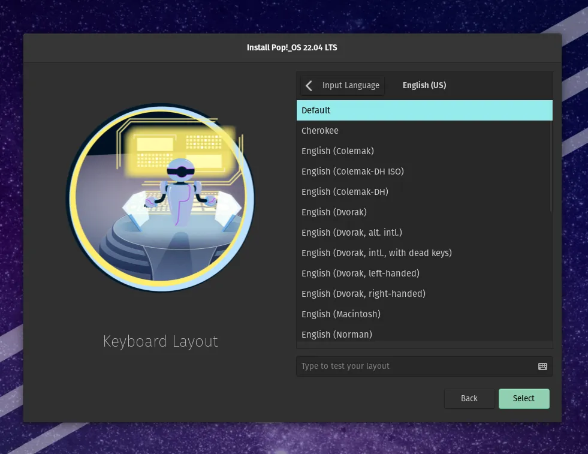


Pilih opsi `Clean Install` untuk instalasi standar. Ini adalah pilihan terbaik untuk pengguna Linux baru, tetapi perlu diketahui bahwa opsi ini akan menghapus semua isi drive target. Sebagai alternatif, Anda dapat memilih `Try Demo Mode` untuk melanjutkan pengujian Pop!OS di lingkungan langsung.


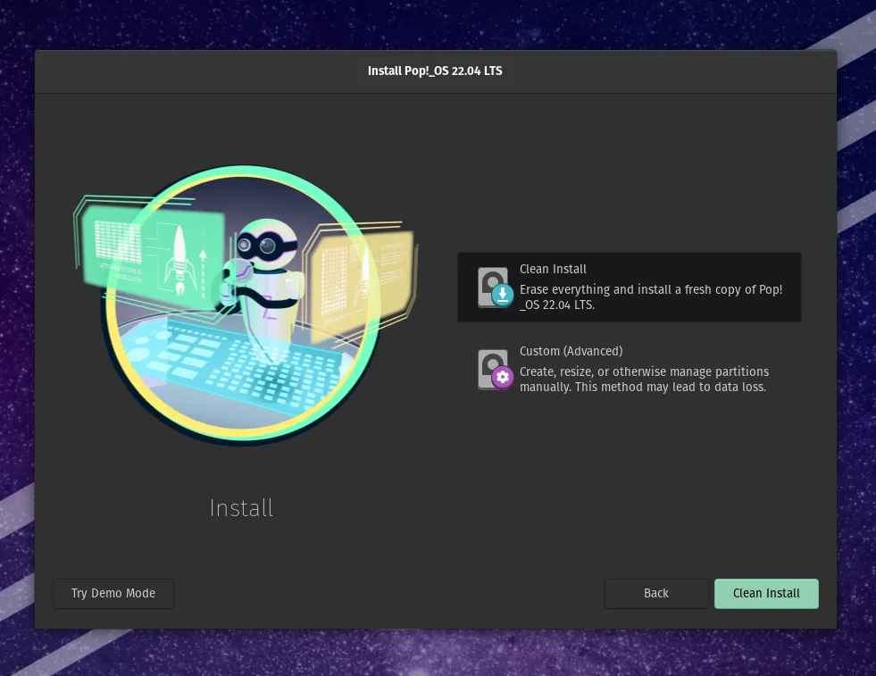


Pilih `Custom (Lanjutan)` untuk mengakses GParted. Alat ini memungkinkan Anda mengonfigurasi fitur-fitur canggih seperti dual booting, membuat partisi `/home` yang terpisah, atau menempatkan partisi `/tmp` pada drive yang berbeda.


Klik `Hapus dan Instal` untuk menginstal Pop!OS pada drive yang dipilih.


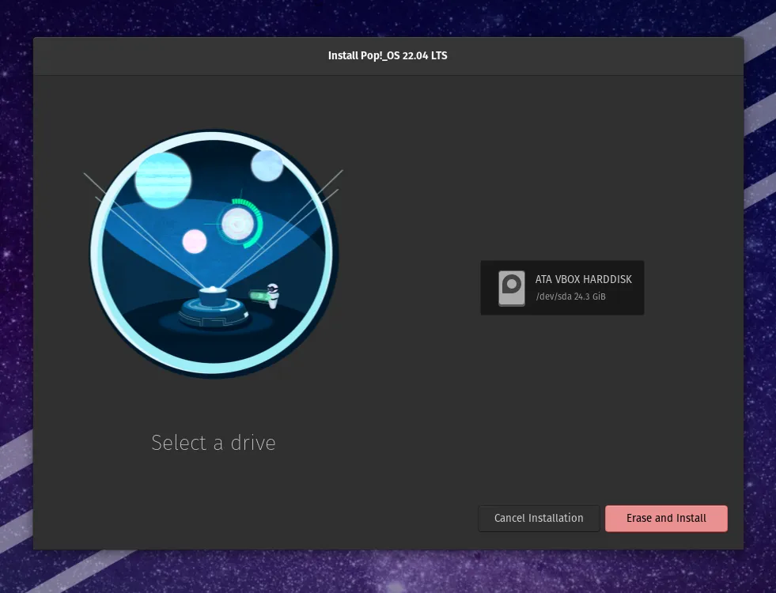


### Konfigurasi akun pengguna


Bagian selanjutnya dari program instalasi akan memandu Anda membuat akun pengguna sehingga Anda dapat masuk ke sistem operasi baru Anda.


Cantumkan nama lengkap (bisa berupa teks apa pun yang Anda inginkan, huruf besar atau kecil), serta nama pengguna (yang harus menggunakan huruf kecil):


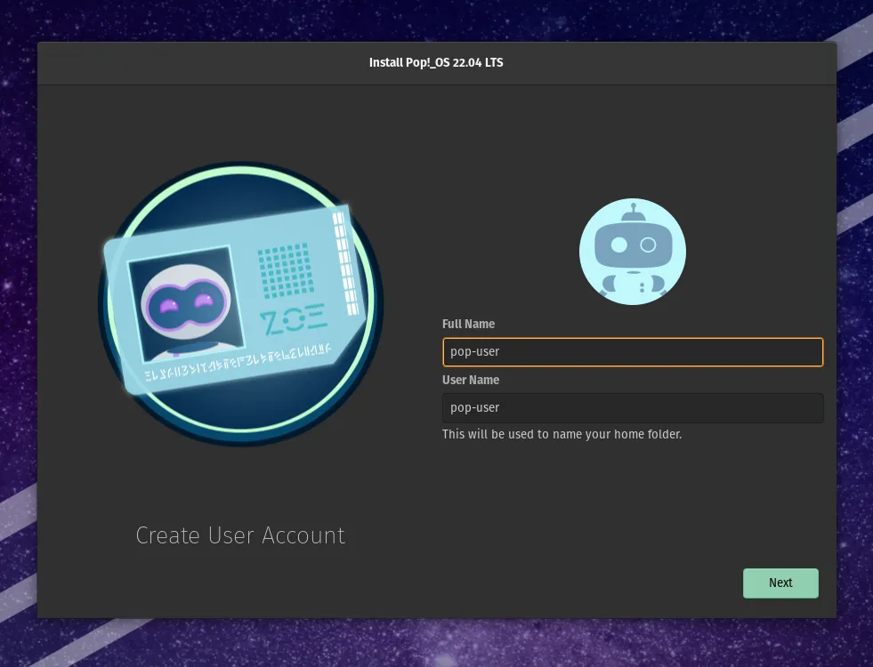


Setelah akun dibuat, Anda akan diminta untuk menetapkan kata sandi baru.


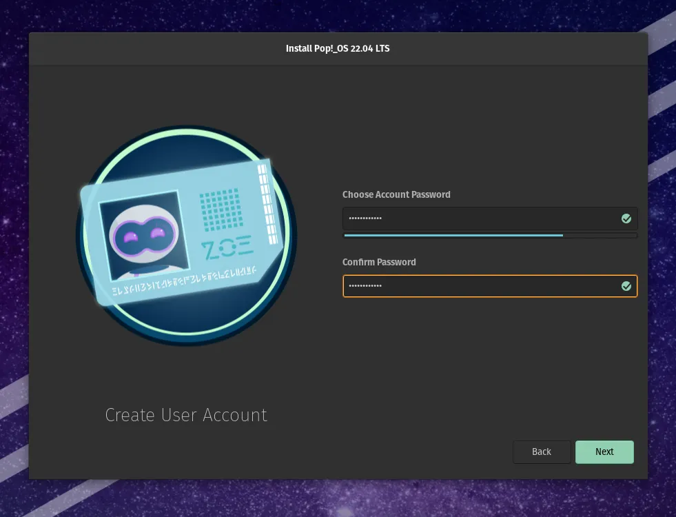


### Enkripsi disk penuh


Enkripsi disk sistem tidak diperlukan, tetapi enkripsi ini menjamin keamanan data pengguna jika ada orang yang mendapatkan akses fisik yang tidak sah ke perangkat.


Drive dapat dienkripsi menggunakan kata sandi login Anda dengan mencentang `Kata sandi enkripsi sama dengan kata sandi akun pengguna`. Anda juga dapat menghapus centang pada kotak ini dan memilih `Set Password` di bagian bawah. Pilih `Jangan Enkripsi` untuk mengabaikan proses enkripsi disk.


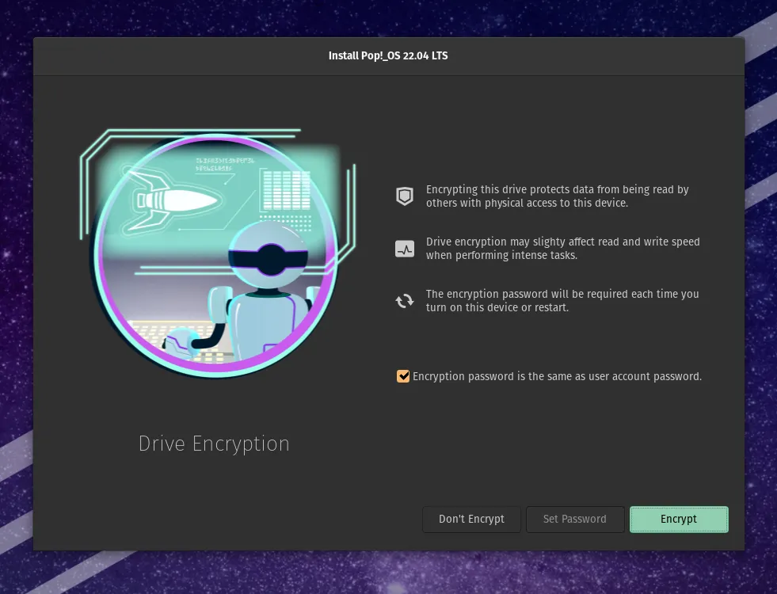


Jika Anda memilih tombol `Set Password`, Anda akan melihat prompt tambahan untuk mengatur kata sandi enkripsi.


Lanjutkan ke langkah berikutnya dalam program instalasi. Pop!OS sekarang akan memulai penginstalan pada disk.


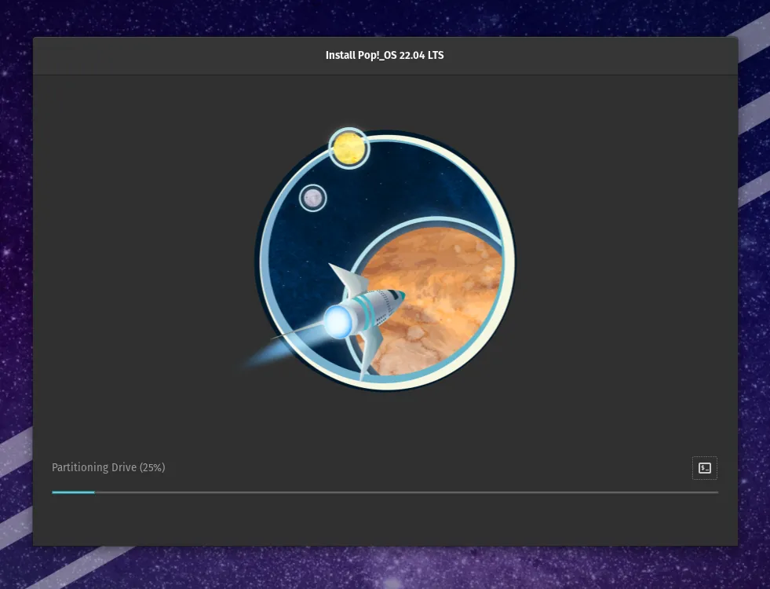


Setelah instalasi selesai, hidupkan ulang komputer Anda dan masuk untuk menyelesaikan proses konfigurasi akun pengguna.


Jika Anda telah mengubah urutan boot untuk memprioritaskan Live USB key saat pengaktifan, matikan komputer sepenuhnya dan lepaskan USB key penginstalan. Jika Anda berada dalam mode dual-boot, tekan tombol yang sesuai untuk mengakses konfigurasi dan pilih drive yang berisi penginstalan Pop!


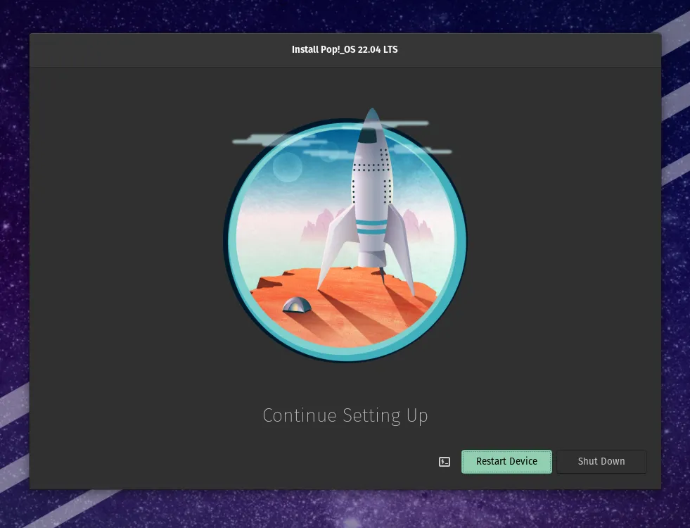


### Grafik NVIDIA


Jika Anda telah menginstal dari Intel/AMD ISO dan sistem Anda memiliki kartu grafis NVIDIA diskrit, atau jika Anda menambahkannya di kemudian hari, Anda perlu menginstal driver secara manual untuk kartu Anda agar dapat mencapai kinerja optimal. Jalankan perintah berikut ini di terminal perintah untuk menginstal driver:


```bash
sudo apt install system76-driver-nvidia
```


Anda juga dapat menginstal driver grafis NVIDIA dari Pop!_Shop.


## Memasang alat bantu penting


Pop!OS menawarkan berbagai macam perangkat lunak melalui Pop!Shop, tetapi banyak alat penting juga dapat diinstal melalui terminal dengan `apt` atau `flatpak`. Berikut ini cara menginstal alat utama untuk lingkungan kerja yang lengkap.


### Instalasi terminal


| Alat | Deskripsi | Perintah Instalasi |
| ---------------------------- | ------------------------------------------ | ----------------------------------------------- |
| Firefox | Peramban web gratis dan populer | `sudo apt install firefox` |
| Brave | Peramban web yang fokus pada privasi | Instalasi via Pop!_Shop atau situs resmi |
| Visual Studio Code (VS Code) | Editor kode yang kuat untuk pengembang | `flatpak install flathub com.visualstudio.code` |
| Git | Pengelola versi | `sudo apt install git` |
| Flatpak | Pengelola paket alternatif | `sudo apt install flatpak` |
| VLC | Pemutar multimedia serbaguna | `sudo apt install vlc` |
| GNOME Terminal | Terminal default | Sudah terinstal di Pop!OS |
| Curl | Alat transfer data online | `sudo apt install curl` |
| Wget | Pengunduhan file via HTTP/FTP | `sudo apt install wget` |
| Docker | Kontainerisasi aplikasi | Instalasi via skrip resmi atau `apt` |
| Node.js | Lingkungan JavaScript sisi server | Instalasi via `apt` atau NodeSource |
| Python3 | Bahasa pemrograman | `sudo apt install python3 python3-pip` |
| GIMP | Editor gambar tingkat lanjut | `sudo apt install gimp` |
| Thunderbird | Klien email | `sudo apt install thunderbird` |
| Transmission | Klien BitTorrent ringan | `sudo apt install transmission-gtk` |
| Htop | Monitor sistem interaktif | `sudo apt install htop` |

### Instalasi melalui Pop! Shop (antarmuka grafis)


- Buka **Pop!_Shop** dari menu utama.
- Gunakan bilah pencarian untuk menemukan aplikasi yang Anda inginkan (misalnya, "Brave").
- Klik **Instal** untuk setiap aplikasi.
- Pop!_Shop secara otomatis mengelola ketergantungan dan pembaruan.


## Pembaruan sistem


### Opsi 1: Melalui antarmuka pengguna grafis (GUI)


Pop!OS memiliki manajer pembaruan grafis yang sederhana dan intuitif.


1. Klik **menu utama** (ikon di kiri bawah).


2. Buka **"Pop!_Shop "**.


3. Di Pop!_Shop, klik tab **"Pembaruan "**.


4. Sistem akan secara otomatis memeriksa pembaruan yang tersedia.


5. Klik **"Perbarui semua "** untuk mulai menginstal pembaruan.


6. Masukkan kata sandi Anda jika diminta.


7. Biarkan prosesnya selesai, kemudian mulai ulang jika perlu.


### Opsi 2: Melalui terminal


Buka terminal dan ketik :


```bash
# Mettre à jour la liste des paquets et le système
sudo apt update && sudo apt full-upgrade -y

# Nettoyer les paquets inutiles
sudo apt autoremove -y && sudo apt autoclean
```


### Manajemen pengguna


Kami menyarankan untuk menggunakan akun pengguna standar dengan hak sudo untuk operasi sehari-hari.


Untuk membuat pengguna baru :


```bash
sudo adduser votrenom && sudo usermod -aG sudo votrenom
```


Keluar, lalu masuk kembali dengan pengguna baru ini.


### Manajemen driver grafis


- Untuk kartu Nvidia, periksa apakah driver eksklusif telah diinstal:


```bash
sudo apt install system76-driver-nvidia
```


- Untuk AMD/Intel, driver umumnya disertakan secara default.


### Mengaktifkan firewall (UFW)


Pop!OS tidak memblokir lalu lintas jaringan secara default. Aktifkan UFW untuk meningkatkan keamanan:


```bash
sudo ufw enable && sudo ufw status verbose
```


### Mengonfigurasi pembaruan otomatis


Untuk menjaga agar sistem tetap mutakhir tanpa intervensi manual:


```bash
sudo apt install unattended-upgrades && sudo dpkg-reconfigure --priority=low unattended-upgrades
```


### Menyesuaikan penampilan dan perilaku


- Buka **Pengaturan sistem** → **Tampilan** untuk memilih tema terang atau gelap.
- Konfigurasikan sudut aktif, animasi dan ekstensi melalui manajer COSMIC.
- Sesuaikan tata letak desktop untuk mengoptimalkan alur kerja Anda.


### Mengonfigurasi pencadangan otomatis


Pop!OS mengintegrasikan alat seperti Deja Dup untuk pencadangan:


- Luncurkan **Cadangan** dari menu.
- Pilih drive eksternal atau lokasi jaringan.
- Jadwalkan pencadangan secara teratur.


### Memasang ekstensi GNOME/COSMIC yang berguna


Berikut ini beberapa ekstensi yang direkomendasikan untuk meningkatkan pengalaman pengguna:


- Dash to Dock**: bilah aplikasi selalu terlihat.
- GSConnect**: sinkronisasi dengan Android.
- Indikator Papan Klip**: manajemen papan klip tingkat lanjut.


Instal melalui file :


```bash
sudo apt install gnome-shell-extensions
```


Kemudian, aktifkan dalam pengaturan.


### Mengoptimalkan manajemen memori dan swap


Periksa status swap Anda:


```bash
swapon --show
```


Jika perlu, tingkatkan ukuran swap atau konfigurasikan file swap :


```bash
sudo fallocate -l 4G /swapfile
sudo chmod 600 /swapfile
sudo mkswap /swapfile
sudo swapon /swapfile
echo '/swapfile none swap sw 0 0' | sudo tee -a /etc/fstab
```


Tambahkan ke file `/etc/fstab` untuk pemasangan otomatis.


## Manajemen paket dan repositori


### Memahami sumber paket


Pop!OS, berdasarkan Ubuntu, terutama menggunakan file :


- Repositori Ubuntu** resmi: untuk perangkat lunak yang paling stabil.
- Repositori System76**: untuk driver, firmware, dan alat bantu tertentu.
- Flatpak**: mengakses berbagai macam aplikasi kotak pasir.
- Snap** (opsional): format paket universal lainnya.


---

### Menambah dan mengelola repositori PPA


Untuk menginstal perangkat lunak yang sering diperbarui, PPA (Personal Package Archives) tertentu dapat ditambahkan:


```bash
sudo add-apt-repository ppa:nom/ppa
sudo apt update
```


## Kesimpulan


Pop!OS adalah distribusi Linux modern dan stabil yang cocok untuk pemula dan pengguna tingkat lanjut.


Berkat antarmuka COSMIC yang intuitif dan alat yang terintegrasi, aplikasi ini menawarkan pengalaman yang lancar dan produktif, baik untuk pengembangan, kreasi, atau penggunaan sehari-hari.


Tutorial ini mencakup tahapan-tahapan utama: persiapan, pengunduhan, instalasi, pengaturan awal, dan alat bantu penting.


Jangan ragu untuk menjelajahi Pop!OS lebih jauh dan menyesuaikan lingkungan Anda untuk mendapatkan hasil maksimal.