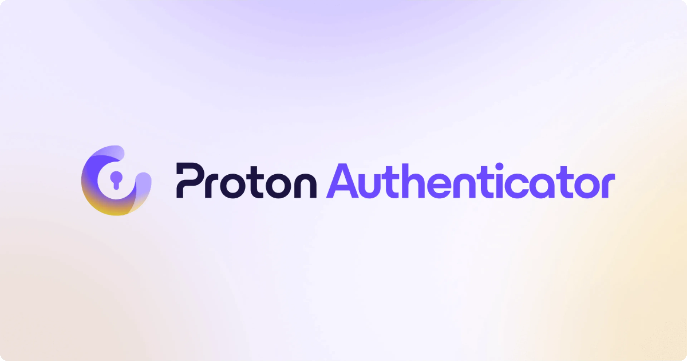

Ivyemezo bibiri (2FA) vyongera inzitizi y’umutekano ku makonti yawe mu gusaba, uretse ijambobanga ryawe, ikimenyamenya c’inyongera c’uko ari wewe wenyene ufise. Gukoresha 2FA bigabanya cane ingorane zo gufatwa n’abantu, naho ijambobanga ryawe ryoshobora gufatwa biciye mu guhenda abantu canke mu gusohoka kw’amakuru. Iyo ata 2FA, uwugutera yokenera gusa ijambo banga ryawe kugira ngo yinjire kuri konti zawe; na 2FA, yoba akeneye kandi ikintu cawe ca kabiri, akabuza ubusuma bwinshi bwa konti.

Hariho ubwoko butandukanye bwa 2FA. Ama code ya SMS ni meza kuruta ataco amaze, ariko aguma ashobora guterwa n’ibitero vyo guhindura SIM n’ugufatwa. Ntidusaba ko SMS ari 2FA y’intango. Ivyo bikoresho vy’ukwemeza (TOTP) generate bikora amakode y’igihe gito mu karere ku gikoresho cawe, bikaba bituma bigorana cane kubifata. Imfunguruzo z’umutekano w’umubiri zitanga umutekano mwiza, ariko zisaba ibikoresho vy’ubuhinga vyihariye.

Igikoresho co kwemeza Proton ni igikoresho co kwemeza TOTP. Ni inyishu ya Proton ku mipaka y’ibikoresho biriho: vyinshi ni ivy’abanyagihugu, birimwo abakurikirana amatangazo kandi ntibitanga ububiko bufise amakuru. Proton Authenticator yitandukanya n’izindi mu gutanga porogarama yuguruye, idafise amatangazo n’abakurikirana, ifise ububiko bufise amakuru y’iherezo.

## Gutangaza umugenzuzi wa porotoni

Proton Authenticator ni porogaramu yo kwemeza TOTP yo kuri telefone ngendanwa no ku biro yakozwe na Proton, izwi cane kubera ibikorwa vyayo vyerekeye ubuzima bwite. Cokimwe n’ibikoresho vyose vya Proton, iyo porogarama ni open source kandi yarakoze igenzura ry’umutekano ry’abantu bigenga. Iboneka ku buntu ku bikoresho vyose (Android, iOS, Windows, macOS, Linux).

Igikoresho co kwemeza ko Proton itanga ibintu nyamukuru bikurikira:

- Guhingura amakode ya **TOTP** kuri konti yawe ya 2FA, ihuye n'imbuga nyinshi zikoresha Google Authenticator, Authy, n'ibindi.

- Ububiko bw’igicu bufise amakuru y’ubuhinga**: ushobora guhuza porogaramu na konti yawe ya Proton kugira ngo ukore ububiko bw’amakuru no guhuza amakode yawe n’ububiko bw’amakuru buva ku mpera kugeza ku mpera. Niwatakaza igikoresho cawe, nusubire gusa gufatanya ikindi gishasha kugira ngo ugarure amakode yawe yose.

- Guhuza ibikoresho vyinshi**: mu kwinjira muri Proton muri app, amakode yawe ya 2FA aca ahita akoranya hagati y’ibikoresho vyinshi biciye ku gupfuka amakuru kuva ku mpera kugeza ku mpera. Ku iOS, ubundi buryo ni uguhuza biciye kuri iCloud.

- Gufunga mu karere hakoreshejwe ijambobanga canke biometrics**: porogarama itanga PIN na/canke gufunga urutoke/Face ID. Rero naho umuntu yokwinjira ku mubiri kuri telefone yawe ifunguwe, ntazoshobora gufungura Proton Authenticator.

- Nta gukusanya amakuru canke abakurikirana**: Proton yiyemeje gukusanya amakuru y’umuntu ku giti ciwe biciye ku rubuga. Nta kwamamaza canke gusuzuma inyifato bihishijwe.

- Gushiramwo/gusohora vyoroshe**: kimwe mu bintu bikomeye vya Proton Authenticator ni umuhinga wayo wo kwinjiza ibintu mu ma konti asanzweho, bihuye n’ibindi bikoresho (Google Authenticator, Authy, Aegis, n’ibindi). Ushobora kandi kwohereza amakode yawe muri dosiye iyo bisabwe.

Muri make, Proton Authenticator ifise intumbero yo kuba umuti wa 2FA udashobora gusenyuka: utekanye, wigenga, ushobora guhinduka.

## Gushiramwo

Igikoresho co kwemeza ko umuntu ari uwundi kiraboneka ku buntu ku mbuga zose. Kugira ngo ubone iyo porogarama, genda kuri paji yemewe: [https://proton.me/fr/ugukuraho](https://proton.me/fr/ugukuraho)

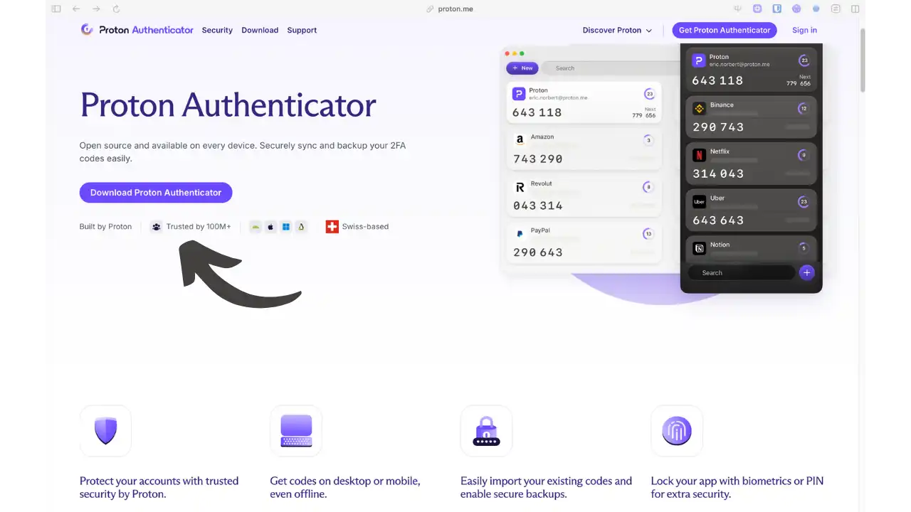

*Urupapuro rwemewe rw'Ivyemezo vya Proton rwerekana ibiranga cane porogarama na Interface*

Kuri iyi paji, uzosanga amahuzu yo gukuraho amakuru yose: Android, iOS, Windows, macOS na Linux. Fyonda gusa kuri sisitemu y’ibikorwa uhisemwo hanyuma ukurikize intambwe zisanzwe zo gushiramwo.

Muri iyi nyigisho, tuzokwereka ingene woyishiramwo no kuyitunganya kuri macOS, hanyuma turabe ingene woyishiramwo kuri iOS no guhuza ama code yawe hagati y’ivyo bikoresho bibiri.

### Gushiramwo kuri macOS

Umaze gukuraho no gushiramwo iyo porogarama, fungura Proton Authenticator. Ku gutangura kwa mbere, porogaramu irakuyobora mu bimenyetso bikeyi vy'intango:

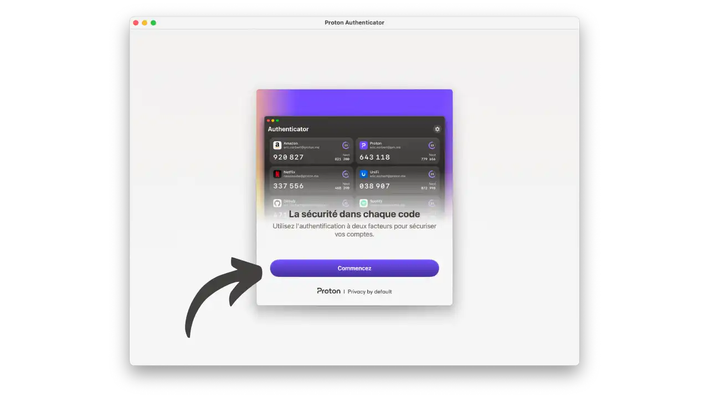

*Proton Authenticator ikaze n'ubutumwa "Umutekano muri kode yose" n'ubuto "Tangira"*

### Ukwinjiza hanze kwa mbere

Iyo Proton Authenticator ibonye ko mbere wari ukoresha iyindi porogarama ya 2FA, umuhinga wo kwinjiza ibintu mu gihugu ashobora kuboneka. Ishigikira kwinjiza ibintu mu buryo butaziguye bivuye mu bikorwa bimwebimwe (Ivyemezo vya Google, 2FAS, Authy, Aegis, n’ibindi). Canke, ushobora gusimbuka iyi ntambwe maze ukongerako amakonti yawe n’amaboko mu nyuma.

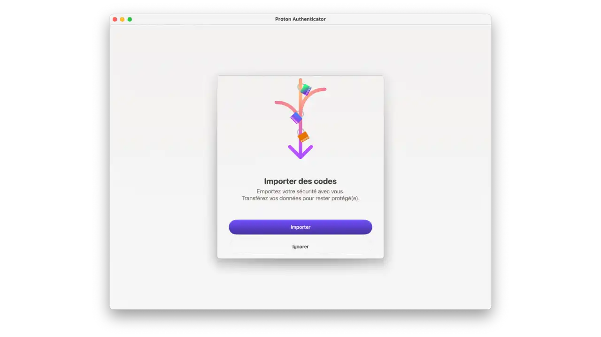

*Import wizard yo kwimurira amakode avuye mu zindi porogaramu zo kwemeza*

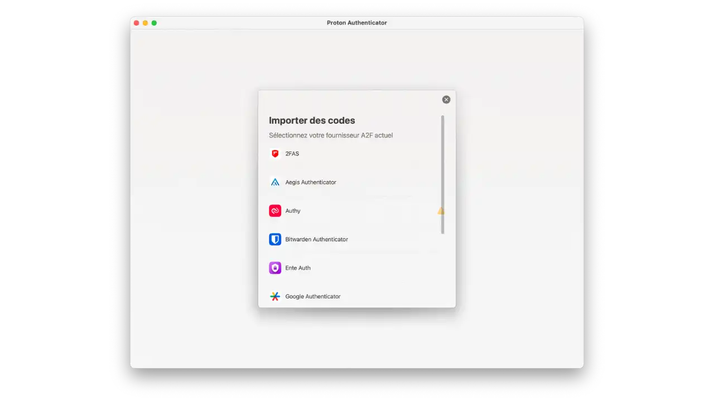

*Ibikoresho bihuye n'ivyo kwinjiza: 2FAS, Ivyemezo vya Aegis, Ivyemezo, Ivyemezo vya Bitwarden, Ivyemezo vya Ente n'Ivyemezo vya Google*

### Uburinzi bw'ibisabwa vyo mu karere

Gushinga PIN yo gufungura, canke gufungura biometric (Touch ID) nimba biriho. Iyi ntambwe ni ngirakamaro kugira ngo umuntu wese akoresha Mac yawe ntaronke uburenganzira bwo gukoresha amakode yawe ya 2FA ku buntu.

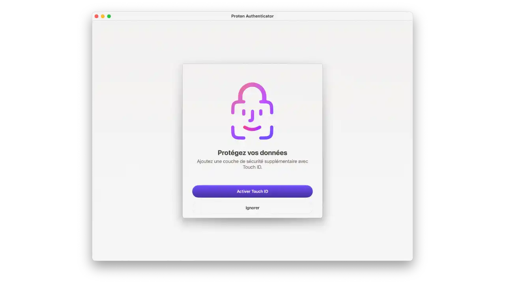

*Igishushanyo c'imiterere ya Touch ID gifise ubutumwa "Kinga amakuru yawe" n'ubuto "Gukoresha Touch ID"*

### Amahitamwo yo guhuza

Iyi porogaramu kandi iragufasha gukoresha iCloud synchronization kugira ngo ukore backup y’amakuru yawe ata nkomanzi hagati y’ibikoresho vyawe vya Apple.

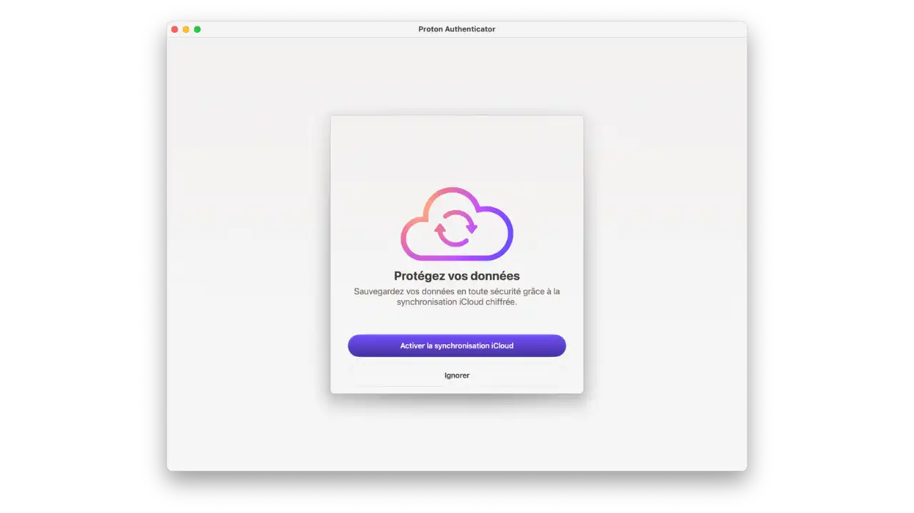

*ICloud guhuza amahitamwo n'ubutumwa "Backup amakuru yawe mu mutekano ukoresheje guhuza iCloud "*

Izo ntambwe zimaze kurangira, Proton Authenticator irateguwe gukoreshwa.

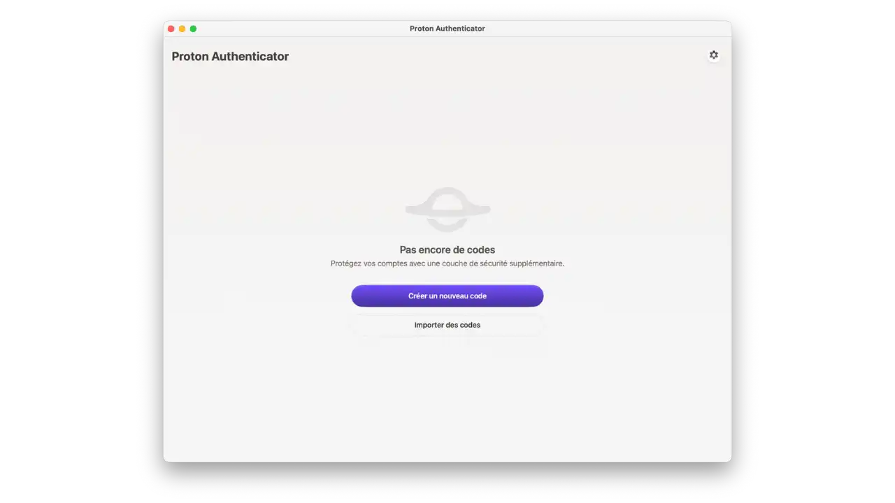

*Interface ubusa buhambaye bwa Proton Authenticator n'amahitamwo ya "Rema kode nshasha" na "Injiza kode"* amahitamwo

## Yongerako konti ya 2FA na ProtonMail

Ubu turaza kuraba ingene wokwongerako kode yawe ya mbere ya 2FA, ukoresheje ProtonMail nk’akarorero. Ubu buryo burakora kimwe ku bikorwa vyose bifasha kwemeza ibintu bibiri.

### Gushoboza 2FA kuri porotoni

Mbere na mbere, urashobora kuraba uburongozi bwacu bwa ProtonMail kugira uronke ibindi bisobanuro:

https://planb.network/tutorials/computer-security/communication/proton-mail-c3b010ce-254d-4546-b382-19ab9261c6a2

Injira muri konti yawe ya ProtonMail maze uje ku mirongo y’umutekano. Rondera "Ivyemezo vy'ibintu bibiri" maze ubikoreshe.

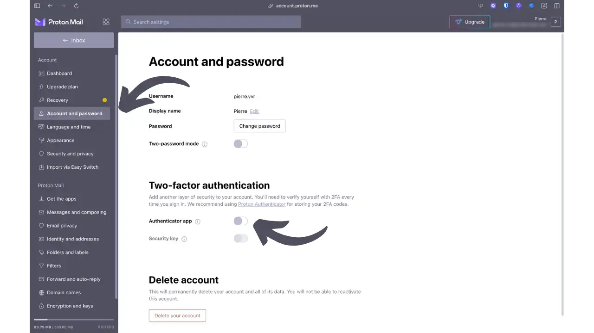

*Paje y'imiterere ya ProtonMail ifise "Iporogarama y'ukwemeza" mu gice ca "Ivyemezo vy'ibintu bibiri"*

Fyonda kuri buto kugira ngo ukoreshe umugenzuzi maze ProtonMail izogusaba guhitamwo porogarama yo kwemeza.

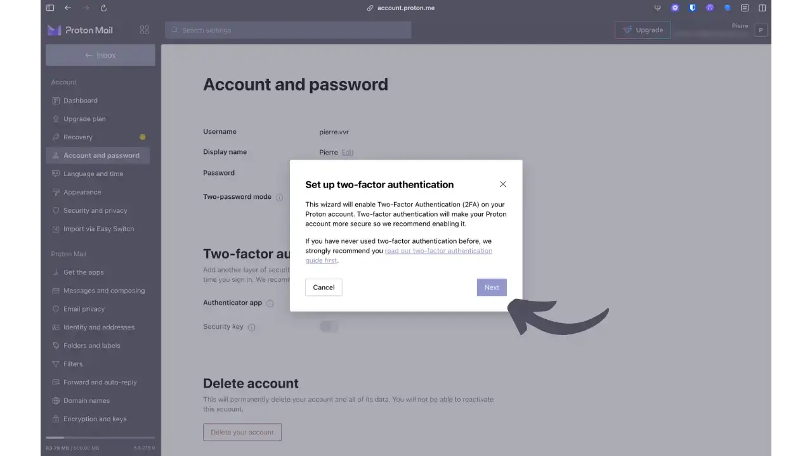

*Idirisha ry'imiterere ya ProtonMail 2FA rifise "Gusubiramwo" na "Ibikurikira"* ubuto

ProtonMail izoca yerekana kode ya QR kugira ngo ushobore gucapura ukoresheje porogarama yawe yo kwemeza ko uri uwundi.

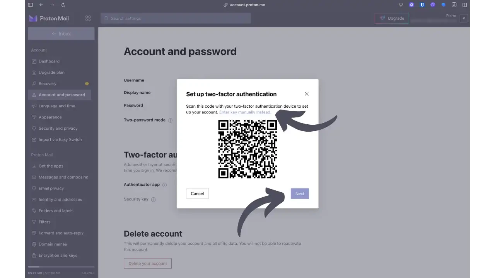

*ProtonMail QR code yo gucapura ukoresheje porogaramu yawe yo kwemeza, n'uburyo bwo "Injira urufunguzo n'amaboko aho" buraboneka*

Niba ushaka kwinjiza urufunguzo n'amaboko, fyonda ku "Injira urufunguzo n'amaboko aho" kugira ngo ubone urufunguzo rw'ibanga.

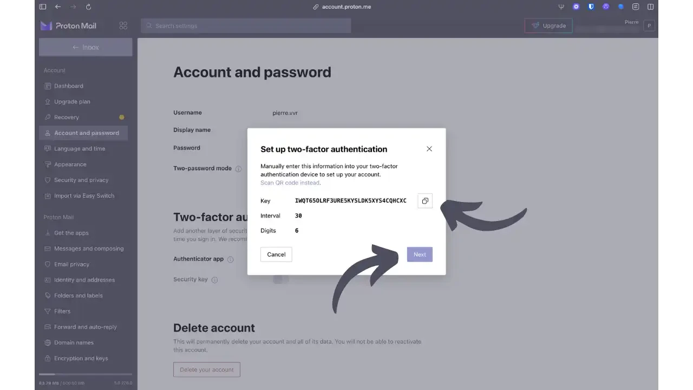

*Kwinjiza amakuru ya 2FA n'amaboko: Urufunguzo, Igihe (30) n'Imibare (6)*

### Scan kode ya QR ukoresheje ikimenyamenya ca Proton

Mu kwemeza kwa Proton kuri macOS, kanda kuri "Rema kode nshasha". Iryo koraniro riguha uburyo bwinshi: **Scan code ya QR** canke **Injira urufunguzo n'amaboko**.

Koresha kamera ya Mac yawe kugira ngo ukoreshe kode ya QR yerekanwa ku rubuga rwa ProtonMail. Uhejeje gucapura kode ya QR, uzoja ku rubuga rushasha rwo gutunganya kode.

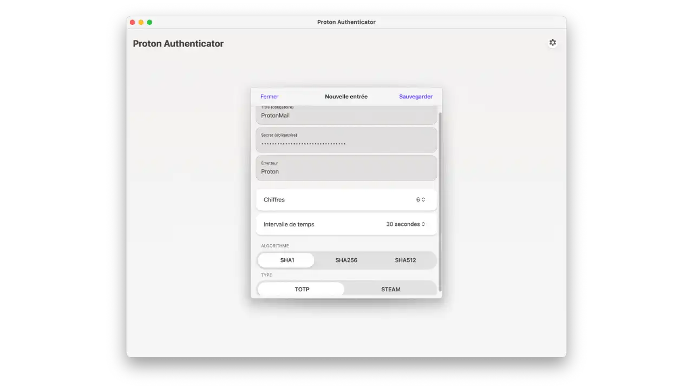

*Idirisha rishasha ry'inyandiko rifise umutwe (ProtonMail), Ibanga, Uwohereje (Proton), imirongo y'imibare n'ibibanza vy'igihe*

Igikoresho co kwemeza amakuru ca Proton kizoca kizuza amakuru. Ushobora guhindura izina niwabishaka, hanyuma ukande "Bika".

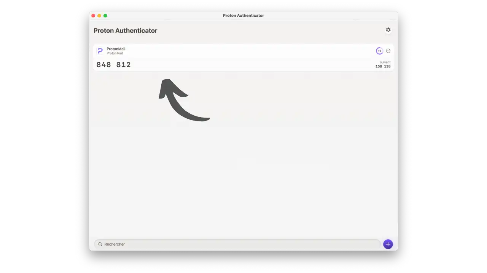

*Kode ya TOTP yakozwe kuri ProtonMail (848 812) n'igihe gisigaye kigaragazwa*

### Kwemeza imiterere

ProtonMail izogusaba kwinjiza kode y’imirongo 6 yakozwe na Proton Authenticator kugira ngo wemeze ko 2FA ikora neza.

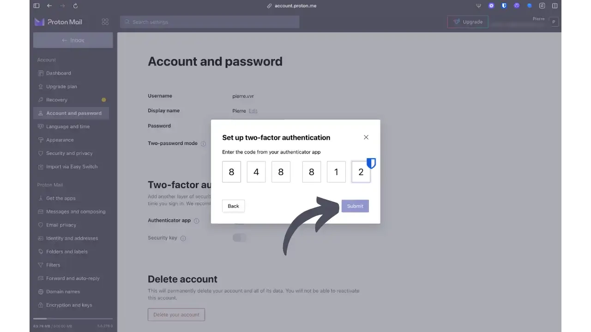

*Igishushanyo co kwemeza ubutumwa bwa ProtonMail kigusaba kwinjiza kode y'imirongo 6 (848812)*

Kopa kode iri muri porogarama (uyikandako) hanyuma uyishire muri ProtonMail kugira ngo urangize gukora.

Iyo imaze kwemezwa, ProtonMail izogusaba gukuraho amakode yawe yo gusubirana. Ni ngombwa cane kubikiza witonze.

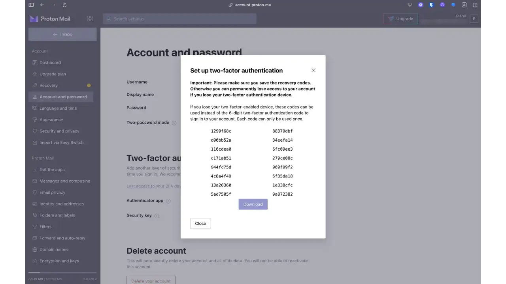

*Igishushanyo c'amakode yo gusubizaho ProtonMail n'urutonde rw'amakode yo gutabara n'ubuto "Gukuraho"*

### Amakode y'ivyihutirwa

Igihe wongeyeko konti, uzigame amakode yo gusubirana atangwa na serivisi. Imbuga nyinshi zitanga amakode y’ugusubirana akoreshwa rimwe gusa kugira ngo ubike ahantu hatagira umutekano. Izo kode z’ububiko zibike hanze ya Proton Authenticator kugira ngo ushobore gushika kuri konti yawe iyo utakaje uburenganzira bwo gukoresha porogarama ya 2FA.

## Gushiramwo IOS no kwinjiza kode

Ubu ko washizeho Proton Authenticator kuri macOS, ushobora no kuyikoresha kuri iPhone canke iPad yawe. Ehe ingene woronka ama code yawe ya 2FA ku bikoresho vyinshi.

### Gukuraho porogarama kuri iOS .

Genda kuri App Store urondere "Ivyemezo vya Proton". Gukuraho iyo porogarama maze uyishire ku gikoresho cawe ca iOS.

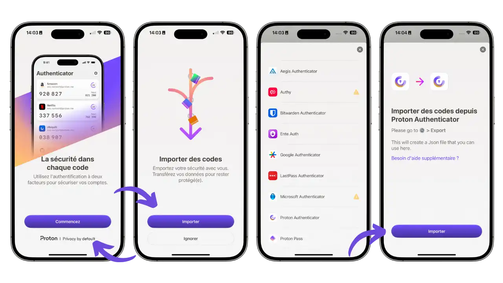

*Uburyo bwo gushiramwo kuri iOS: igicapo c'akabazo, umupfumu wo kwinjiza, guhitamwo porogaramu zihuye, n'igicapo ca nyuma "Injiza amakode avuye kuri Proton Authenticator"*

### Uburyo bwa 1: Gusohora/Kuzana biciye muri dosiye ya JSON

Niba udakoresha ubuhinga bwo gukorana (iCloud canke konti ya Proton), uzokenera guhindura amakode yawe kuri Mac yawe ukayashira kuri iPhone yawe:

**Intambwe ya 1 - Gusohora hanze kuva kuri macOS** :

Kuri Mac yawe, fungura Proton Authenticator maze uje kuri Settings (ikimenyetso c’ivyuma). Mu bimenyetso, kanda kuri "Sohora".

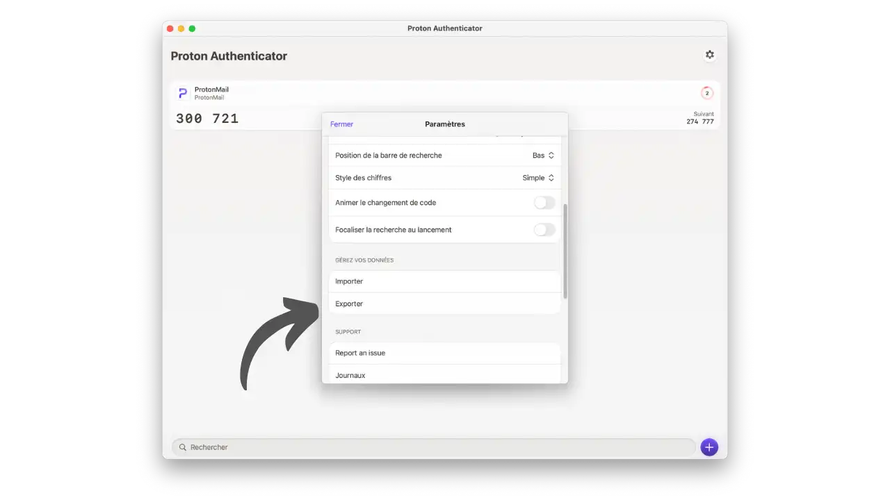

*Imirongo y'imiterere y'Ivyemezo vya Proton kuri macOS n'uburyo bwo "Gusohora" buboneka*

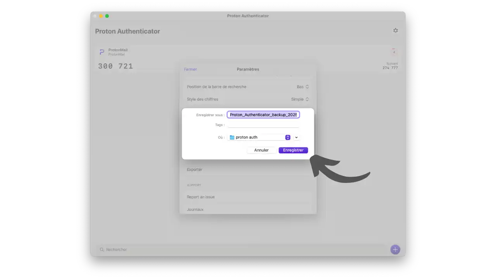

*Idirisha ryo gusohora hanze n'izina rya dosiye "Proton_Ivyemeza_Ibikomokako_2025" na "Bika"* buto

Bika dosiye ya JSON kuri Mac yawe. Ushobora kuyirungika kuri email itekanye canke ukayibika muri iCloud Drive kugira ngo uyironke ukoresheje iPhone yawe.

**Intambwe ya 2 - Gushiramwo kuri iOS** :

Kuri iPhone yawe, shiramwo Proton Authenticator kandi mu gihe co gutunganya, uhitemwo kwinjiza amakode. Hitamwo "Ivyemezo vya Proton" muri list maze ushiremwo dosiye ya JSON.

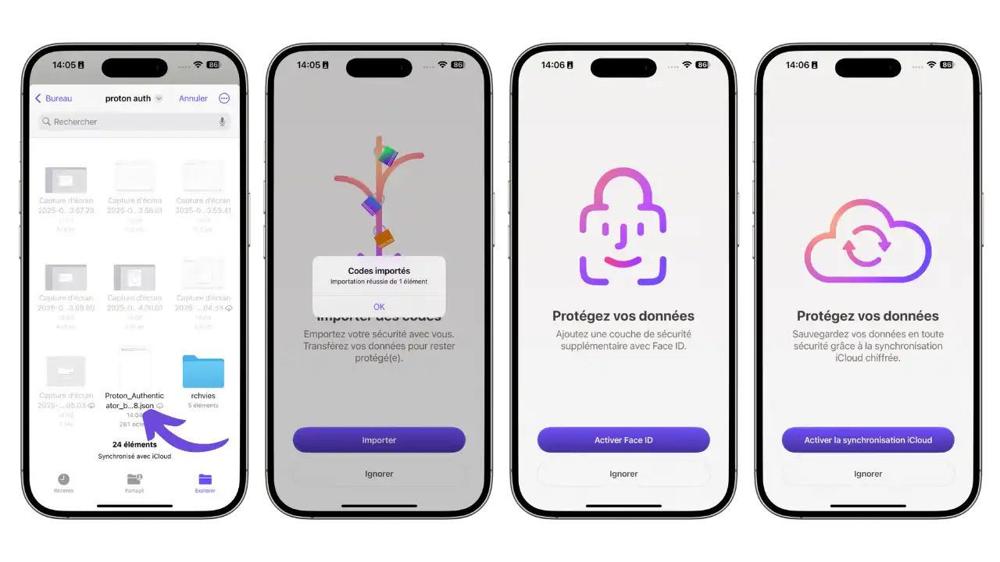

*Uburyo bwo kwinjiza kuri iOS: Guhindura dosiye ya JSON, kwemeza kwinjiza, n'ibimenyetso vy'imiterere n'amahitamwo ya Face ID na iCloud*

### Uburyo bwa 2: Guhuza ubwavyo

**Biciye kuri konti ya Proton (ku bijanye n'uguhuza ibintu vyinshi)** :

Niba utarashiraho konti ya Proton kandi wipfuza gukorana hagati y’imirongo itandukanye, iyo porogarama izogusaba gukora canke gufatanya konti ya Proton.

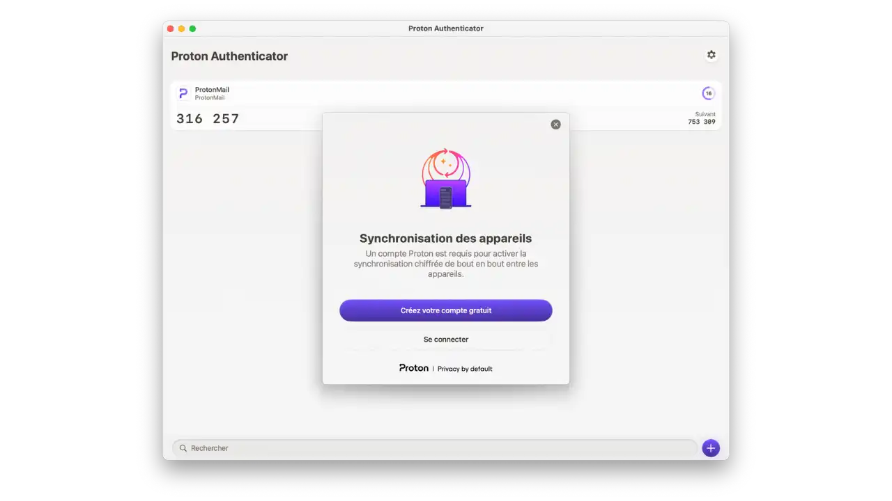

*Igishushanyo co guhuza ibikoresho kigusaba gukora konti ya Proton ku buntu canke kwifatanya na konti isanzweho*

**Biciye kuri iCloud (ku bidukikije vya Apple gusa)** :

Niba ukoresha ibikoresho vya Apple gusa, urashobora guhitamwo gukorana n’iCloud mu mirongo y’ikoreshwa. Ubu buryo buzotuma amakode yawe akora neza kandi ataco akora hagati y’ibikoresho vyawe vyose vya Apple, ataco ukeneye kugira ngo ukoreshe konti ya Proton.

## Gusubiza inyuma no kugarura

Kimwe mu bintu nyamukuru biranga Proton Authenticator ni ugucungera amakode ya 2FA kuva ku mpera kugeza ku mpera, kugira ngo iyo utakaje canke uhinduye igikoresho ntibisigura ko utegerezwa gusubira gutangura vyose.

### Ububiko kuva ku mpera kugeza ku mpera

Ku bijanye n’ugucungera amakuru y’igicu hakoreshejwe Proton Authenticator, amabanga yawe ya TOTP arashirwa ahantu ku gikoresho cawe imbere y’uko yoherezwa kuri server ya Proton. Gukuraho amakuru bishoboka kuri wewe gusa, ku bikoresho vyawe bihuye na konti yawe ya Proton. Proton AG nta rufunguzo ifise rwo gusoma ama code yawe yanditswe.

Kuri iOS, iyo uhisemwo iCloud aho guhitamwo konti ya Proton, amakuru yawe arashirwa mu buryo bujanye n’ingingo za Apple. Local backup kuri Android ishobora kugufasha gupfuka dosiye y’ububiko ukoresheje ijambobanga uhisemwo.

### Gusubizaho iyo umuntu atakaje

Iyo telefone yawe yazimiye, yibwe canke uhinduye telefone :

**Igihe Proton ikora**: Shiraho Proton Authenticator ku gikoresho gishasha. Mu gihe co gutegura ubwa mbere, winjire muri iyo konti ya Proton nyene. Ubwo nyene, iyo porogarama izokorana n’ibindi kandi ikureho amakode yawe yose ya 2FA mu vyo ukoresha mu gucungera amakuru.

**Ufise ububiko bwa iCloud (iOS)**: Huza iPhone/iPad nshasha n’iyo ID ya Apple maze urabe ko ukoresha urufunguzo rwa iCloud. Amaze gushiramwo igikoresho co kwemeza ko Proton, ushire kuri iCloud. Ama code yawe akwiye gukorana biciye kuri iCloud maze akaboneka.

**Nta n'ububiko bw'igicu**: Uzokenera kwinjiza amakonti yawe n'amaboko. Niba wararungitse hanze dosiye y'ububiko, koresha igikorwa co kwinjiza muri Proton Authenticator. Mu gihe kibi kuruta ibindi vyose, iyo utagira ububiko, uzokenera gukoresha amakode y’ububiko kuri buri serivisi, canke uhamagare abafasha.

Proton Authenticator iragufasha kwohereza hanze amakonti yawe igihe cose, haba nk’idosiye ipfutse canke nk’ikode ya QR y’amakonti menshi. Ivyo bihitamwo biraguha icizigiro congereweko.

## Ibikorwa vyiza

Gukoresha umugenzuzi wa 2FA birongereza cane umutekano wawe, ariko hariho ingendo nziza zitegerezwa gukurikizwa:

### Bika amakode yawe y'ivyihutirwa

Iyo ukoresheje 2FA kuri servisi, kenshi uhabwa urutonde rw’amakode yo gusubirana. Bigumye kure ya telefone yawe (ku mpapuro, mu gikoresho co gucungera ijambobanga ry’ibanga, n’ibindi). Mu gihe woba utakaje burundu umugenzuzi wawe, izo kode zidahinduka zizogukiza.

### Ntuvange amajambo y'ibanga yawe n'amakode ya 2FA

Biragerageza gukoresha umucungerezi w'ijambobanga nawe abika TOTPs. Ariko rero, kugumiza ijambobanga na kode ya 2FA ahantu hamwe bituma habaho ikintu kimwe co kunanirwa kandi bikagoyagoya ukwemeza kabiri. Kugira ngo umuntu agire umutekano mwinshi, abahinga benshi barasaba ko umuntu yotandukanya ivyo bintu bibiri: amajambo y’ibanga ari mu mucungerezi afise umutekano, n’amakode ya 2FA mu gikoresho gitandukanye nka Proton Authenticator. Ariko rero, gukoresha umuyobozi yunze ubumwe biracari vyiza kuruta kutagira 2FA na gato.

### Gukoresha uburyo bwinshi bwa 2FA

Ivyiza ni uko wokoresha ibintu birenze isegonda rimwe ku nkuru zawe zihambaye. Ntukekeranye kwongerako urufunguzo rw’umutekano w’umubiri nimba iyo serivisi ibivyemera. Raba inyigisho yacu ku mfunguruzo z'umubiri za Yubikey kugira uronke ibindi bisobanuro:

https://planb.network/tutorials/computer-security/authentication/security-key-61438267-74db-4f1a-87e4-97c8e673533e

Na wewe nyene, nugumye ufise amakode y’ivyihutirwa acapwe.

### Gumana ubwenge kandi ukinge igikoresho cawe

Ntureke ngo umuntu arondere telefone yawe ifunguye. Na Proton Authenticator, amakode yawe akinzwe na PIN/biometrics - ntumenyeshe iyo PIN. Na wewe nyene, urabe maso ku bijanye n’ubuhendanyi: mbere n’aho woba ufise 2FA, iyo uhaye kode urubuga rw’ubuhendanyi mu gihe nyaco, rwoshobora gukoreshwa n’umuntu atera.

### Ivyagezwe n'igenzura

Gumana Proton Authenticator iri ku gihe (ihindura ikosore amakosa ashoboka). Uko iyo kode ifunguye, umuryango urakora igenzura ridasanzwe, Proton na yo igatangaza ivyavuye mu igenzura risanzwe.

## Kugereranya n'ibindi bikoresho

Ni gute Proton Authenticator iteranya ibindi bikoresho vyo kwemeza? Akira incamake y'ukugereranya:

**Proton Authenticator**: Inkomoko yuguruye, ububiko bw’igicu bushizwemwo E2EE bushobora guhitamwo, gukorana n’ibikoresho vyinshi, gufunga mu karere, nta gukurikirana, biboneka kuri telefone ngendanwa no kuri mudasobwa.

**Google Authenticator**: Ni umunyagihugu, ikoreshwa kuri konti ya Google kuva muri 2023 ariko ata n’imwe ishobora gukingira (imfunguruzo zishobora kubonwa na Google), ihuriro ry’ibikoresho vyinshi ryongeweko muri 2023, nta n’imwe ifungura porogarama, irimwo abakurikirana Google.

**Aegis Authenticator**: Inkomoko yuguruye, ububiko bwo mu karere gusa, nta guhuza igicu, kode/ugufunga biometric, nta gukurikirana, Android gusa.

**Uburenganzira**: Ububiko bw'igicu bufise ijambobanga ariko kode ifunze, guhuza ibikoresho vyinshi, gufunga PIN/ikimenyetso c'urutoke, gukusanya inomero ya telefone, porogaramu yo kuri mudasobwa yahagaritswe muri Ntwarante 2024.

Uzosanga uburongozi bwacu bwa Authy aha hepfo:

https://planb.network/tutorials/computer-security/authentication/authy-a76ab26b-71b0-473c-aa7c-c49153705eb7

Proton Authenticator ni kimwe mu bisubizo vy’ukuri kandi bitekanye biriho: inkomoko yuguruye, uguhuza ibikoresho vyinshi bifise amakuru, nta gukurikirana kw’ubudandaji.

## Ibikoresho n'infashanyo

### Inyandiko zemewe

- Urubuga rwemewe**: [proton.me/umugenzuzi](https://proton.me/umugenzuzi) - Ukwerekana ibicuruzwa n'ugukuraho
- Gukuraho urupapuro**: [proton.me/ru/umugenzuzi/gukuraho](https://proton.me/fr/umugenzuzi/gukuraho) - Amahuza y'ama OS yose
- Infashanyo ya porotoni**: [proton.me/infashanyo/ivyemezo-vy'inzira-2fa](https://proton.me/infashanyo/ivyemezo-vy'inzira-2fa) - Inyobora yemewe yo gukoresha 2FA
- Urubuga rwa Proton**: [porotoni.me/urubuga/iporogaramu-yemeza](https://porotoni.me/urubuga/iporogarama-yemeza) - Itangazo n'ibiranga ido n'ido

### Kode y'inkomoko n'uguseruka

- Igikoresho co kwemeza ivy'ukuri ca GitHub**: [github.com/Igikoresho co kwemeza ivy'ukuri](https://github.com/Igikoresho co kwemeza ivy'ukuri) - Kode y'inkomoko yuguruye
- Igenzura ry'umutekano**: [proton.me/umuryango/igenzura ry'umutekano](https://proton.me/umuryango/igenzura ry'umutekano) - Raporo z'igenzura ryigenga

### Ibipimo vy'umutekano vyemewe

Inyuma yo gutunganya, gerageza gutunganya kwawe:

- [Narafashwe](https://haveibeenpwned.com/) - Suzuma nimba amakonti yawe yashizwe mu kaga
- [Ububiko bwa 2FA](https://2fa.ububiko/) - Urutonde rw'ibikorwa bifasha 2FA

### Imiryango n'ibiganiro

- - Umuryango wemewe wa Proton
- Ihuriro ry'Inyigisho z'Ibanga**: [kuganira.Inyigisho z'Ibanga.net](https://kuganira.Inyigisho z'Ibanga.net) - Ibiganiro vy'ubuhinga ku bibazo vy'ubuzima bwite
- Reddit r/ubuzima bwite**: [reddit.com/r/ubuzima bwite] (https://reddit.com/r/ubuzima bwite) - Impanuro rusangi ku vyerekeye ubuzima bwite

### Ibindi

- [Mbega narafashwe](https://haveibeenpwned.com/) - Suzuma nimba amakonti yawe yashizwe mu kaga
- [Ububiko bwa 2FA](https://2fa.ububiko/) - Urutonde rw'ibikorwa bifasha 2FA