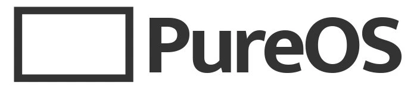


Ochrana osobních údajů v digitálním věku je pro každého uživatele internetu nejvyšší prioritou. Společnosti, organizace a dokonce i operační systémy jsou užitečnými zdroji informací pro definování vašeho profilu a životního stylu. Výběr správného operačního systému je prvním krokem k posílení vašeho soukromí na internetu. V tomto návodu se podíváme na PureOS, linuxovou distribuci zaměřenou na ochranu soukromí.


https://planb.network/tutorials/computer-security/operating-system/debian-d09a57ec-8372-40ca-bcff-499415209e1f

## Začínáme se systémem PureOS


PureOS je operační systém založený na Debianu, který vyvinula společnost Purism. PureOS je vhodný jak pro IT profesionály, tak pro uživatele, kteří hledají jednoduchou a snadno použitelnou distribuci. Je jedinečný tím, že je *svobodným softwarem* a zaměřuje se na ochranu osobních údajů svých uživatelů tím, že vytváří rámec založený na ochraně soukromí, svobodě, bezpečnosti a stabilitě, které nabízí Debian.


### Proč si vybrat PureOS?


- Jednoduché a intuitivní ovládání Interface**: GNOME nabízí přehledné prostředí Interface, které je navrženo tak, aby se snadno používalo i lidem, kteří nemají zkušenosti s příkazovým řádkem.


- Zdarma**: stejně jako většina linuxových distribucí je i PureOS zcela zdarma. Na podporu vývojářů je však k dispozici měsíční předplatné.


- Bezpečnost a stabilita**: Díky architektuře a provoznímu režimu je PureOS vysoce bezpečnou distribucí, která zaručuje ochranu dat a stabilitu systému.


- Dokumentace a aktivní komunita**: PureOS má přehlednou a přístupnou dokumentaci a aktivní komunitu, která usnadňuje řešení problémů a postupné učení se systému.


## Instalace a konfigurace


Instalace a konfigurace systému PureOS v počítači vyžaduje následující minimalistické funkce:


- Klíč USB o velikosti alespoň 8 GB pro flashování systému.
- 4 GB RAM.
- 30 GB volného místa na disku Hard.


Přejděte na [oficiální webové stránky PureOS](https://pureos.net/) a stáhněte si obraz ISO operačního systému podle architektury vašeho počítače.


Chcete-li spustit instalaci PureOS, musíte vytvořit bootovací USB klíč pomocí softwaru flash, například [Balena Etcher](https://www.balena.io/etcher).


Ve třech snadných krocích získáte USB disk s operačním systémem PureOS.


- Připojte klíč USB a spusťte stažený software Balena.
- Pak vyberte obraz ISO systému PureOS
- Jako výstupní zařízení vyberte klíč USB, klikněte na tlačítko **Flash** a počkejte na dokončení procesu.


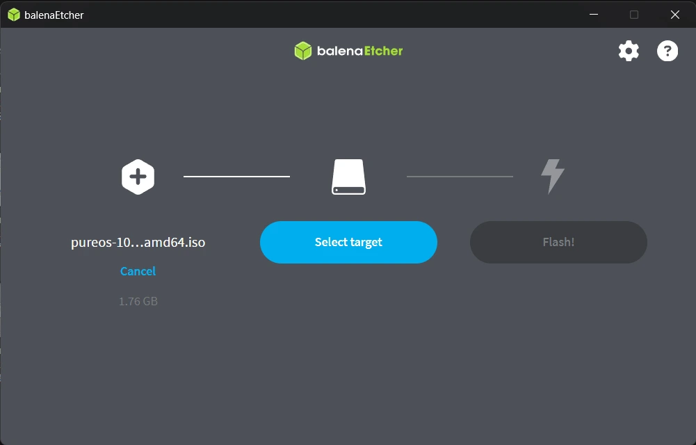


Po zavedení klíče USB restartujte počítač, do kterého chcete nainstalovat systém PureOS.


Při spouštění počítače přistupte k systému BIOS stisknutím klávesy `ESC`, `F9` nebo `F11`, v závislosti na typu počítače. Jako spouštěcí zařízení vyberte klíč USB a potvrďte stisknutím tlačítka `ENTER`.


### Spouštěcí obrazovka


PureOS nabízí několik možností spuštění operačního systému. Pro spuštění instalace operačního systému zvolte možnost **Test nebo Install PureOS**.


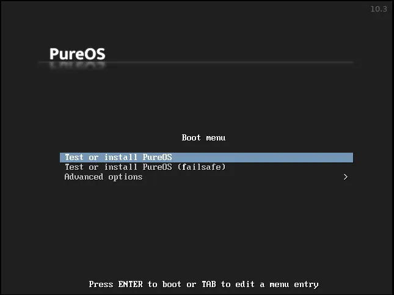


Nastavte jazyk a rozložení klávesnice, které chcete v počítači používat.


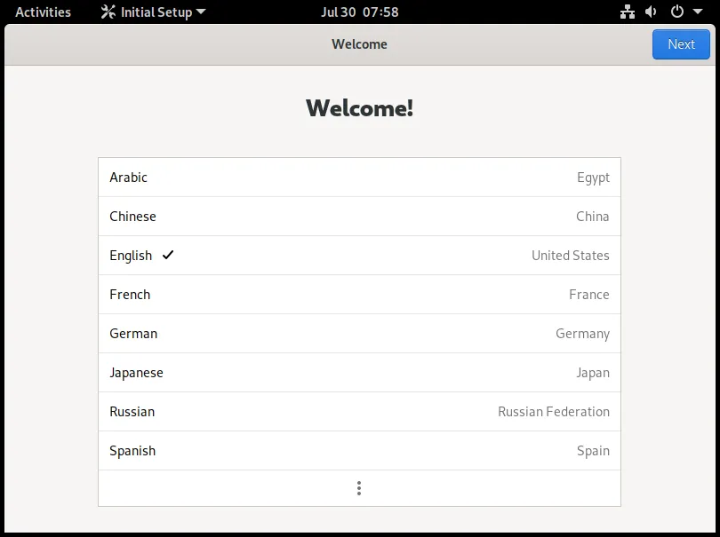


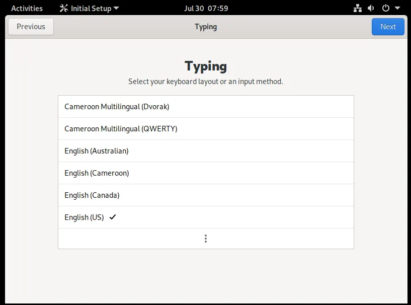


Povolte nebo zakažte přístup k vaší **geografické poloze** aplikacím pro personalizovaná doporučení na základě vaší oblasti.


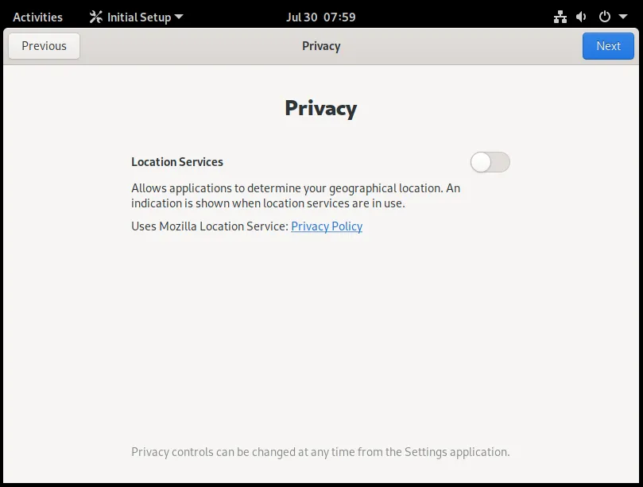


Můžete se připojit ke svému stávajícímu účtu **NextCloud** a získat data spojená s kancelářskou sadou, kterou používáte v jiném systému.


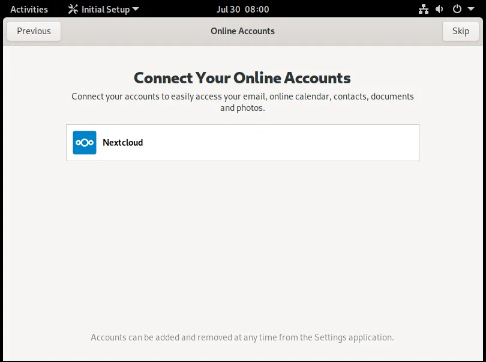


K dispozici je výukový program, ale pokud chcete tento krok přeskočit, můžete okno zavřít.


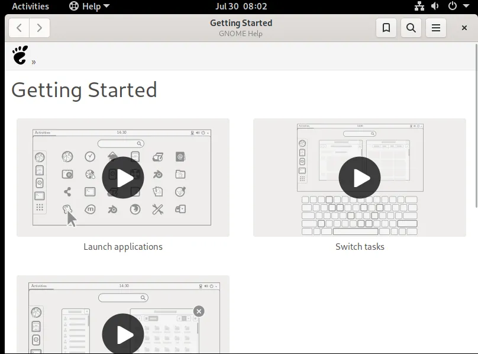


### Spuštění instalace


Klikněte na nabídku **Aktivity** a prozkoumejte aplikace a nástroje předinstalované v systému. Klepnutím na **Install PureOS** zahájíte instalaci


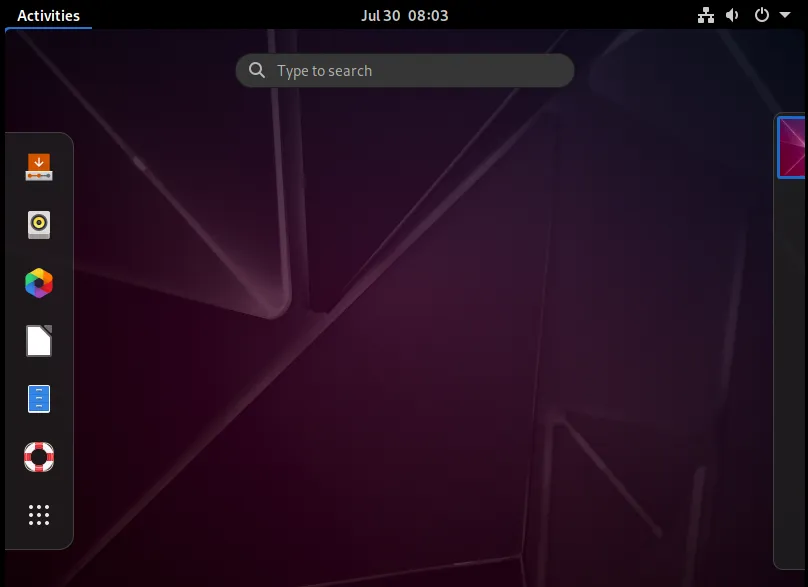


Podle potřeby nastavte jazyk systému a rozložení klávesnice a poté nakonfigurujte režim rozdělení disku Hard.


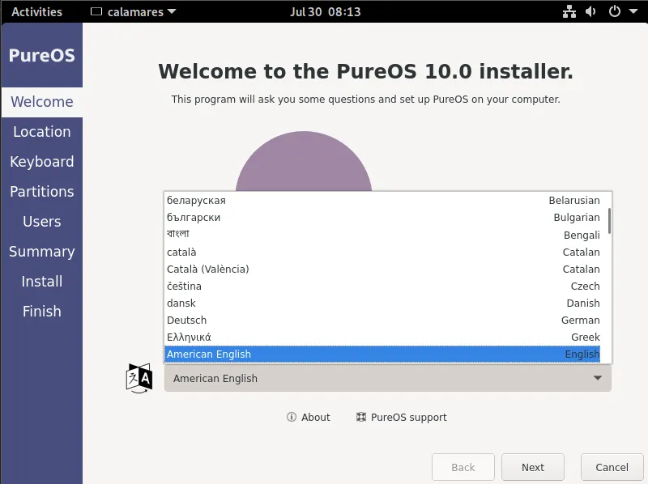


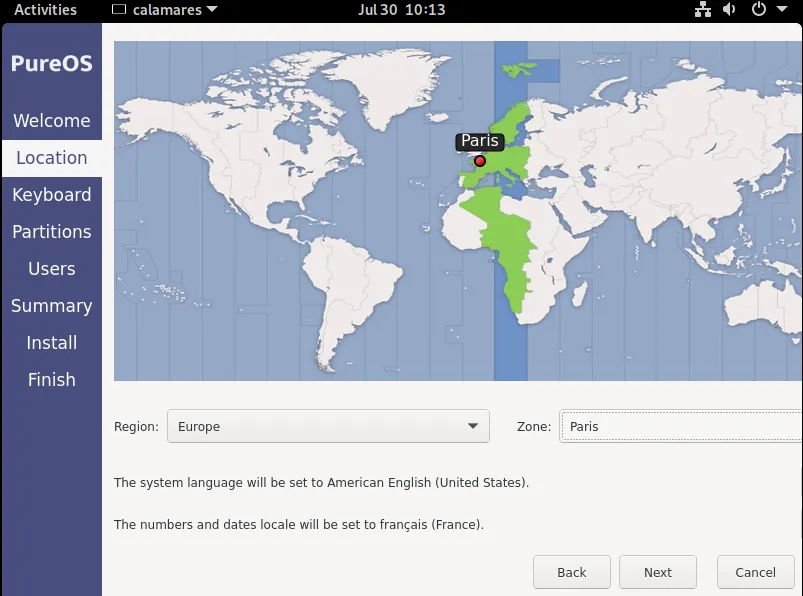


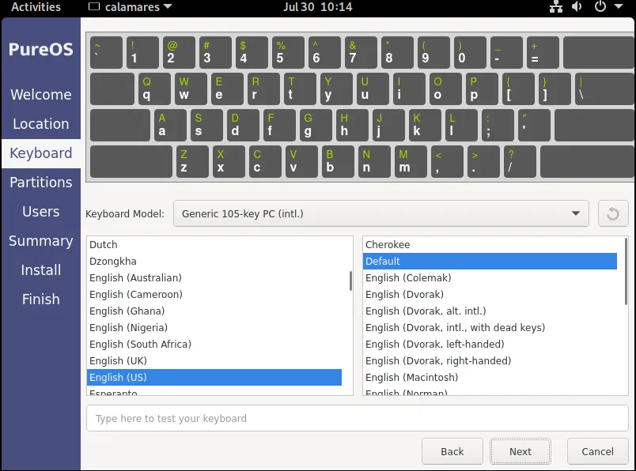


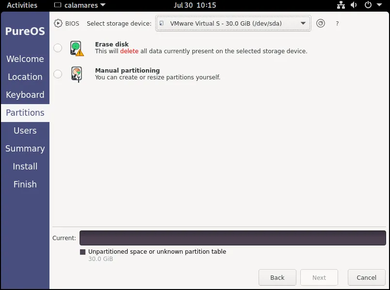


Pro rozdělení disku Hard máte dvě možnosti:


- Vymazat disk**: Pro kompletní instalaci PureOS smažte všechna již existující data na disku Hard.


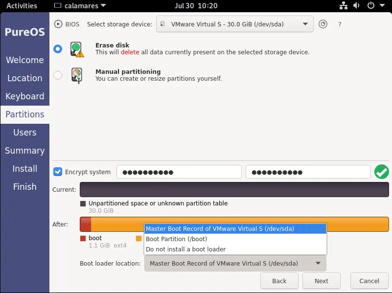


- Ruční rozdělení** pro vytvoření vlastních skóre


⚠️ Při ručním vytváření oddílů pro operační systém se ujistěte, že jste vyčlenili minimálně 2 GB oddíl pro provoz PureOS a poté další oddíl pro data.


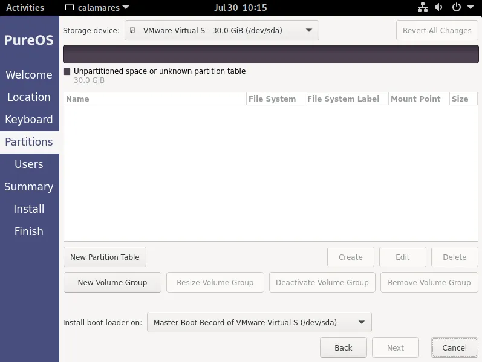


Chcete-li zabezpečit svá data, aktivujte **šifrování disku**. Zadejte silné a složité heslo.


K operačnímu systému přiřaďte uživatele definováním uživatelského jména a alfanumerického hesla o délce nejméně 20 znaků, abyste posílili zabezpečení svých dat.


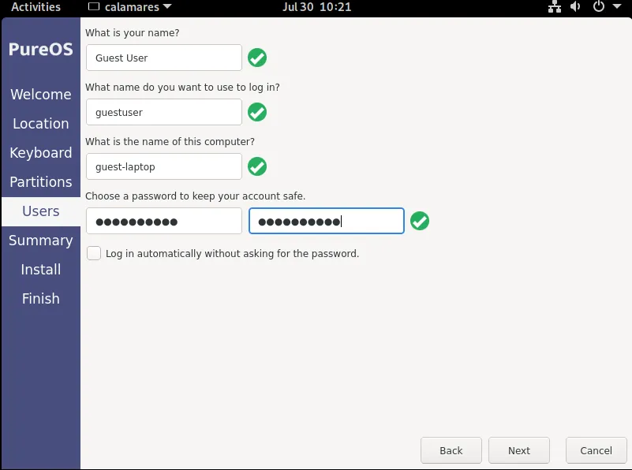


Zkontrolujte provedená nastavení a v případě potřeby je upravte.


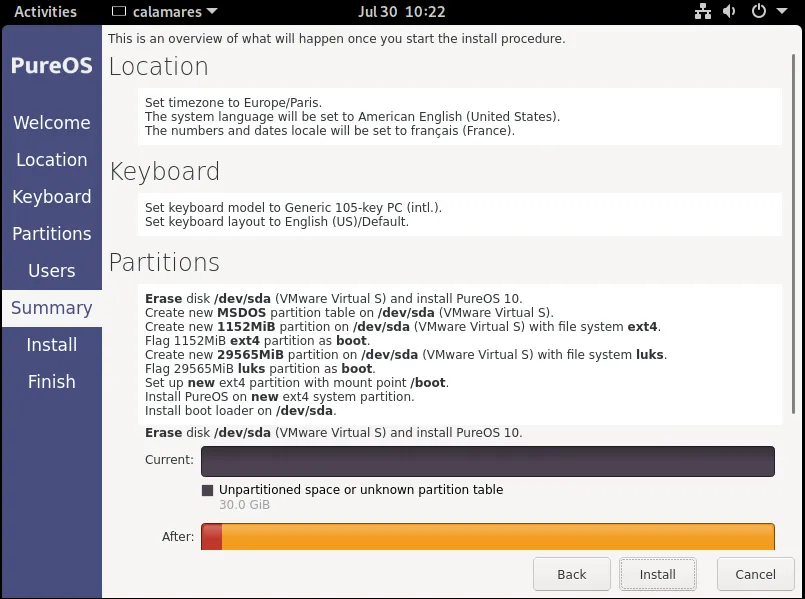


Kliknutím na **Install** a poté na **Install Now** potvrďte, že byl systém PureOS nainstalován do počítače.


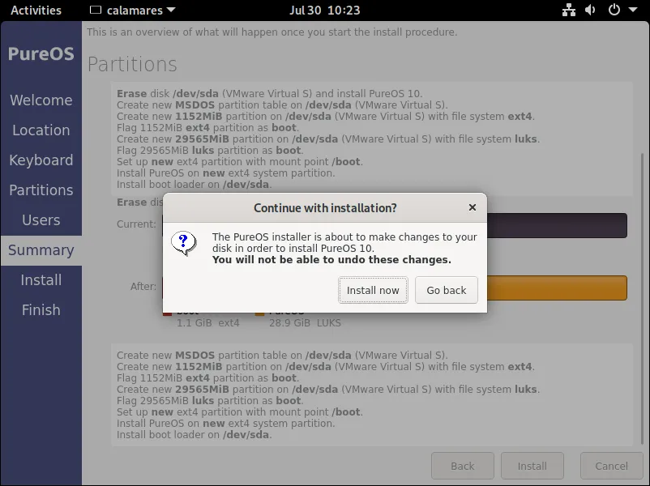


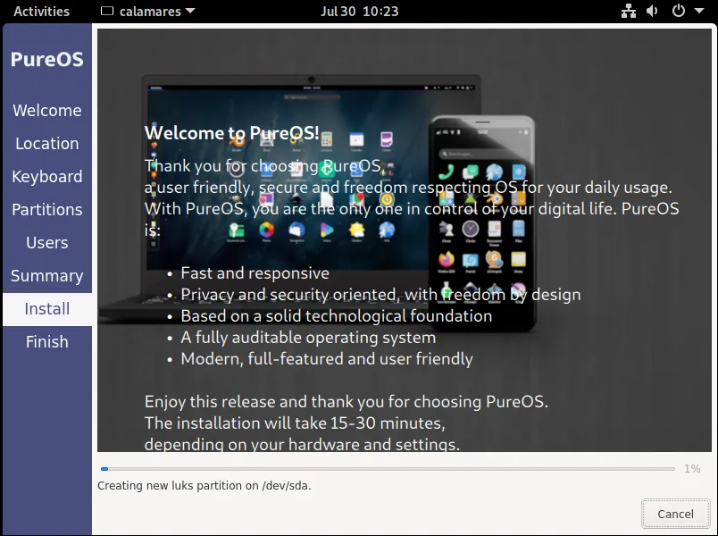


Po dokončení instalace zaškrtněte políčko **Restartovat nyní**, čímž restartujete počítač, a potvrďte:


- Jazyk.
- Rozložení klávesnice.
- Váš účet NextCloud (volitelné).


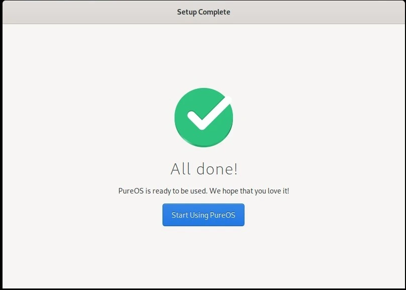


## Aktualizace


Před zahájením používání systému PureOS je nutné systém aktualizovat. To vám umožní využívat nejnovější funkce a bezpečnostní záplaty a zajistí vyšší stabilitu.


- Aktualizace prostřednictvím grafiky Interface**:


Otevřete aplikaci **Software** a přejděte na kartu **Aktualizace**. Automaticky se zobrazí dostupné aktualizace. Klikněte na tlačítko **Stáhnout** a po dokončení stahování na tlačítko **Instalace**.


- Aktualizace přes terminál**:


Otevřete terminál a zadejte následující příkaz pro aktualizaci seznamu dostupných balíčků:


```shell
sudo apt update
```


Zadejte heslo a potvrďte je. Poté nainstalujte aktualizace pomocí:


```shell
sudo apt full-upgrade
```


## PureOS pro vývoj


Ve výchozím nastavení neobsahuje PureOS všechny nástroje potřebné pro vývoj.


Můžete je rychle nainstalovat pomocí následujícího příkazu:


```shell
sudo apt install build-essential git curl
```


Tím nainstalujete kompilační nástroje **Git** a **Curl**, které jsou užitečné ve většině vývojových prostředí.


## Prostředí PureOS


PureOS vyniká inovativním přístupem ke skutečné konvergenci: jediný operační systém zajišťuje hladký a bezproblémový provoz na různých zařízeních, včetně notebooků, tabletů, mini PC a chytrých telefonů.


Aplikace PureOS jsou navrženy jako adaptivní: automaticky se přizpůsobují velikosti obrazovky a režimu vstupu (dotyk nebo klávesnice/myš). Například webový prohlížeč GNOME dynamicky přizpůsobuje svůj Interface tak, aby poskytoval optimální prostředí na mobilních i stolních zařízeních.


PureOS obsahuje také kancelářský balík **LibreOffice**, který zahrnuje:


- Writer**: kompletní textový procesor pro vytváření a úpravy dokumentů.
- Calc**: výkonný tabulkový procesor pro správu dat a výpočtů.
- Impress**: nástroj pro vytváření profesionálních prezentací.


Tato bezplatná sada umožňuje efektivní práci bez závislosti na proprietárním softwaru.


PureOS nabízí jednotné, bezpečné a flexibilní prostředí založené na 100% open source distribuci, která zaručuje naprostou kontrolu a přísné dodržování soukromí. Jeho skutečná konvergence usnadňuje vytváření aplikací kompatibilních s různými typy zařízení, jako jsou počítače, tablety a chytré telefony, bez nutnosti složitých úprav.


Díky nativnímu přístupu k základním nástrojům, robustním správcům balíčků a bohatému ekosystému open-source zjednodušuje PureOS vývoj, testování a nasazení aplikací v bezpečném prostředí. Díky stabilní architektuře a důvěrnosti Commitment je spolehlivou platformou pro různá použití, včetně vývoje Blockchain, rychlého prototypování nebo produkčních prostředí.


Objevte náš kurz o posílení zabezpečení a ochraně digitálního soukromí.


https://planb.network/courses/4ba0e3de-e67f-4ea1-a514-f111206810d1