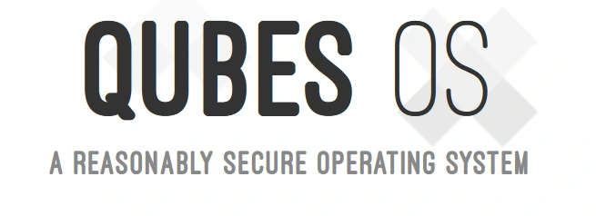

Qubes OS ni ubuhinga bwo gukoresha ku buntu, bufunguye, bwagenewe abakoresha bashira umutekano imbere y’ibindi vyose. Ubudasa bwayo bushingiye ku ciyumviro coroshe ariko gikomeye: aho kubona mudasobwa yose uko ingana, igabanya ikoreshwa ryayo mu bice vyigenga vyitwa **_qubes_**.

Buri qube ikora nk'**ibidukikije vy'ukuri**, bifise urugero rw'ukwizigira n'igikorwa vyihariye. Rero naho porogarama yoba yahungabanijwe, igitero kiguma ku qube yaco ataco gikoze ku bindi bice vyose vyo muri sisitemu.

> Niba ukunda cane umutekano, Qubes OS ni yo nzira nziza cane yo gukoresha iriho uno musi. - **Umukuru w’Igihugu**.

Ariko rero, gushiramwo Qubes OS bisaba kwitegura cane kuruta gushiramwo ubuhinga busanzwe bwo gukoresha. Birimwo gusuzuma ibisabwa bimwebimwe vy’ibikoresho, gutahura ivy’ishimikiro vy’uguhindura ibintu mu buryo bw’impwemu no kwemera ubumenyi butandukanye, aho igikorwa cose ca misi yose ciyumvirirwa mu buryo bwo gutandukanya. Ariko iyo imaze gushirwaho, Qubes OS itanga urutonde rukomeye rusubira gusobanura uburyo ukoresha mudasobwa yawe ku musi ku musi. Muri iyi nyigisho, tuzobasigurira ingene Qubes OS ikora n’ingene woyishira mu buryo bworoshe kuri system yawe.

## None Qubes OS ikora gute?

Qubes OS ishingiye ku ngingo ngenderwako y’ugucapura. Aho gukoresha uburyo bumwe, yizigira **Xen** hypervisor kugira ngo ireme imashini zitandukanye, zitwa qubes. Buri qube yihariye igikorwa canke urugero rw’ukwizigira (akazi, gusura amakuru ku giti cawe, gukora amabanki, n’ibindi). Ukwo gutandukanya gutuma ugusenyera ku mugozi umwe kwose kuri qube imwe kudashobora gukwiragira ku zindi, gukora nk’amaordinateri menshi yigenga ari mu mashini imwe.

Ukoresha Interface arongowe n'itongo ry'imbere, ry'umutekano ryitwa **dom0**. Ico kibanza kiri ukwaco rwose kuri Internet, kikaba ari co gituma ari co kintu nyamukuru. Naho amadirisho n'ibikubiyemo vyerekanwa na dom0, ugushirwa mu ngiro kw'ibikorwa bibera mu bice vyavyo.

## Ubwoko butandukanye bw'ama qubes

Ikikuje dom0 hazunguruka ubwoko butandukanye bw’ama qubes, imwe yose ifise uruhara rwihariye cane.

- Ivyo **AppVM** bikoreshwa mu gukoresha ibikorwa vya misi yose: uwubikoresha arashobora rero gutandukanya ubutumwa bwiwe bw’umwuga n’ibikorwa vyiwe vyo gusura urubuga canke vyo mu mabanki, aho ikibanza cose kiguma kidashingiye ku bindi.

- Izo AppVMs ubwazo zishingiye kuri **TemplateVMs**, zikora nk’ibigereranyo vy’ugushiramwo no guhindura porogarama, bikaba bikuraho ivy’ugucungera qube imwe imwe ukwayo.

Qubes OS kandi ishiramwo amashini y’ivy’impwemu yihariye mu **ibikorwa vya sisitemu**.

- **NetVM** ni yo icungera ataco ihinduye **ibikoresho vy'urubuga** kandi igatuma umuntu ashobora gukorana na Internet. Akenshi zifatanywa na **FirewallVMs**, zifasha mu **gucungera uruja n'uruza** no kugabanya ukugaragara kw'izindi qubes.

- ServiceVMs zifise uruhara nk’urwo, nk’akarorero mu gucunga ibikoresho vya USB, zama zifise ivyiyumviro bimwe: gutandukanya ibice bishobora gutera ingorane kugira ngo zigabanye igitero.

Ubwa nyuma, ku bikorwa bimwe bimwe canke bifise akaga, Qubes OS itanga **DisposableVM**. Izo qubes z’igihe gito ziremwa ku nzira kugira ngo **zifungure inyandiko iteye amakenga** canke **zigendere ku rubuga ruteye amakenga**, hanyuma zikazimangana burundu iyo zifunze, zigakuraho ibimenyetso vyose kandi zibuze igitero cose gikomeza.

### Uburyo bwo gukopa butekanye (qrexec)

Uguhanahana hagati ya qubes bishingiye kuri **qrexec**, uburyo bwo guhanahana amakuru hagati ya VM bwagenewe umutekano. Aho kureka qubes zivugana mu mwidegemvyo, qrexec ishiraho **amategeko yihariye**: dosiye ikopiwe kuva kuri AppVM imwe ikaja ku yindi, canke umwandiko woherezwa biciye ku rubuga rwo gufata amakuru, yama ica mu muhora ugenzurwa kandi wemezwa na sisitemu. Muri ubwo buryo, mbere n’igikorwa coroshe co gukopa no gushiramwo ibintu biragenzurwa kugira ngo ntihagire porogarama mbi ikwiragizwa.

### Ubuyobozi bwa disiki

Qubes OS ikoresha ubuhinga bw’ubuhinga bwo gucunga ububiko. TemplateVMs zirimwo urufatiro rwa porogarama rusangi, mu gihe AppVMs zongerako gusa amakuru yabo bwite n’amadosiye yihariye. Ivyo bigabanya umwanya ukoreshwa kuri disiki kandi bikaba vyorosha guhindura ibintu kw’isi yose. DisposableVMs, ku rundi ruhande, zikoresha ibitabo vy’igihe gito bizimangana burundu iyo bifunze. Ico kigereranyo ntikitanga gusa umutekano mwinshi, ariko kandi n’ugucungera neza umutungo.

## Ni kuki uhisemwo Qubes OS?

Inyungu za Qubes OS ziri hejuru ya vyose mu buryo bwihariye bw’umutekano wayo. Mu mutima w’ubwo buryo harimwo ugucapura, ivyo bikaba bikingira uwubikoresha mu gutandukanya igikorwa cose mu mashini zitandukanye. Mu majambo y’ingirakamaro, e-mail canke urubuga rw’ububisha rwanduye rushobora gusa guhungabanya qube imwe, rugasiga igice gisigaye c’urubuga n’amakuru yawe bwite birinzwe bimwe bishitse. Ubu buhinga buragabanya cane ibitero bikomeye, ku buryo busanzwe, bishobora gukwiragira mu mwidegemvyo.

Qubes OS kandi itanga uguserukira abantu bose no kugenzura ibidukikije vyawe vy’ubuhinga bwa none. Urazi neza porogarama ishobora gushika ku kintu ikihe, yaba ari urubuga, igikoresho ca USB canke ibindi bihimba bihambaye. Ubuhinga bushiramwo ibintu vy’umutekano biteye imbere ku buryo busanzwe, nk’ugushiramwo amakuru yuzuye kuri disiki, kandi bugafasha gukoresha ibikorwa vyo gutuma umuntu adamenyekana nk’uburyo bwo gukoresha Whonix.

https://planb.network/tutorials/computer-security/operating-system/whonix-06f9172c-2962-412e-9487-b665d8ca9f59

Aho kurondera kurema uburyo butashobora guca, Qubes OS yibanda ku kwihangana: ipfuka ivyonona iyo habaye ugusenyuka, igabanura ingorane ku buryo busigaye. Ubu buryo bushingiye ku vy’ukuri butuma Qubes OS iba ihitamwo ryiza ku bakoresha bafise ivyipfuzo vyinshi vy’umutekano, canke bipfuza kuguma bafise ububasha bwinshi ku buzima bwabo bwa digitale.

## Gushiramwo Qubes OS

Imbere yo gushiramwo Qubes OS, ni ngombwa ko ubona neza ko ibikoresho vyawe bihuye n’ibisabwa bikeyi, kuko iyo sisiteme yizigira virtualization kugira ngo itandukanye qubes. Ibintu nyamukuru vyo gusuzuma ni :

- **Igikoresho**: Igikoresho c’ibice 64 gihuye n’uguhindura ibikoresho (Intel VT-x canke AMD-V).
- RAM: n’imiburiburi 8 GB irakenewe, ariko turahimiriza RAM ya 16 GB canke irenga kugira ngo ukoreshe qubes nyinshi icarimwe.
- Ububiko**: nibura 36 GB, vyiza ni 128 GB kuri SSD kugira ngo ukore neza.

Kugira ngo ushiremwo Qubes OS, fungura ishusho ya ISO yemewe kuri Qubes OS [urubuga rwemewe](https://www.qubes-os.org/downloads/). Ni ngombwa kugenzura ubutungane bwa ISO hakoreshejwe imikono ya GPG yatanzwe, kugira ngo umenye neza ko dosiye itagira ico ihinduye kandi ko ivyo uyikuyeko bitekanye.

https://planb.network/tutorials/computer-security/data/integrity-authenticity-21d0420a-be02-4663-94a3-8d487f23becc

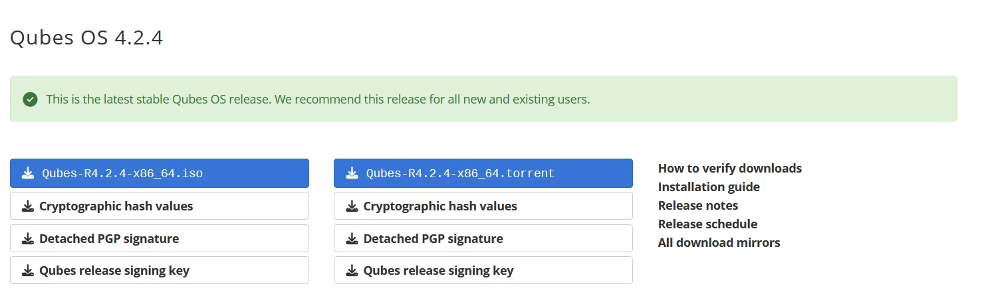

ISO imaze kugenzurwa, ukeneye gukora uburyo bwo gushiramwo bushobora gutangura, akenshi ni inkoni ya USB. Kugira ngo ubikore, ushobora gukuraho no gushiramwo porogarama nka **Rufus** kuri Windows canke **Etcher** kuri Windows, Linux canke macOS. Ivyo bikoresho bigufasha gukopa ISO kuri USB kugira ngo ishobore gufunguka.

Imbere yo gutangura gushiramwo, birakenewe ko utunganya **BIOS canke UEFI** ya mudasobwa yawe kugira ngo **ishobore gukora virtualization** kandi yemere gufungura kuri USB. Bivanye n'umuderi w'imashini yawe, bishobora kuba ngombwa ko **uhagarika Secure Boot**, kuko Qubes OS ishobora kutatangura iyo nzira ifunguwe.

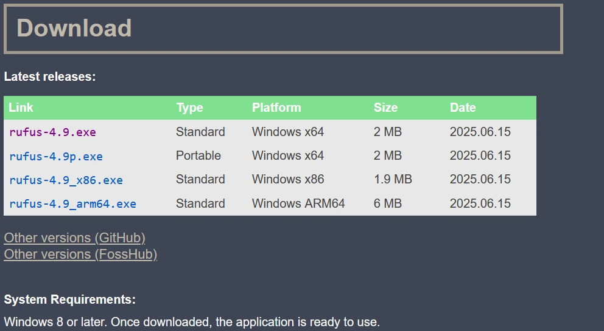

Ivyo bimaze gushitswa, subiramwo mudasobwa yawe maze winjire muri BIOS/UEFI uhite ukanda **Esc**, **Del**, **F9**, **F10**, **F11** canke **F12** (bivanye n’uwabikoze). Mu nzira y’ugutangura, hitamwo urufunguzo rwa USB nk’igikoresho co gutangura kugira ngo utangure gushiramwo Qubes OS.

**Igishushanyo co gutangura**

Iyo ufunguye ukoresheje USB stick, uzoja ku rutonde rwa **GRUB**, aho ushobora guhitamwo igikorwa uzokora. Ukoresheje imfunguruzo z'umwampi kuri klavye yawe, hitamwo "Shiraho Qubes OS" hanyuma ukande "Injira".

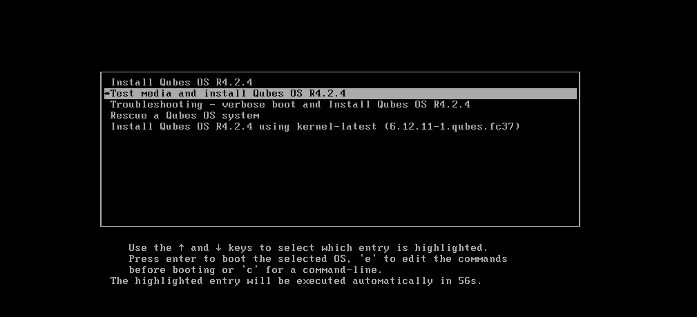

**Guhitamwo ururimi** :

Iyo installation itanguye, intambwe ya mbere ni **uguhitamwo ururimi** n'**ururimi rw'akarere** rubereye configuration yawe. Ivyo bituma ubuhinga n’uburyo bwo gushiramwo bigaragara neza mu rurimi ukunda.

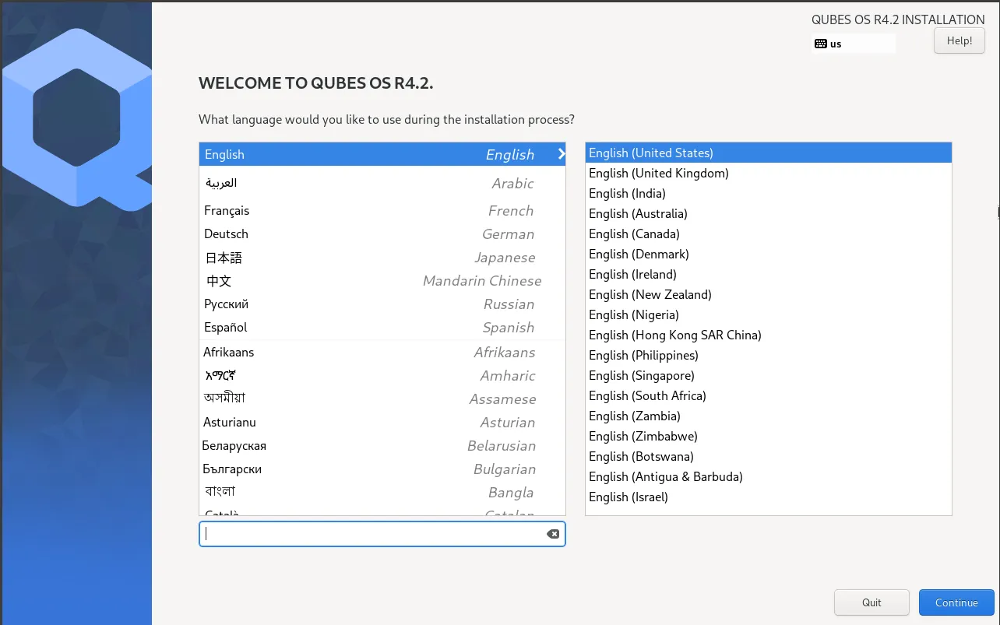

**Imiterere y'imirongo** :

Kuri iyi ntambwe, uzokenera gutunganya umubare wa Elements imbere yo gutangura gushiramwo ku mashine yawe.

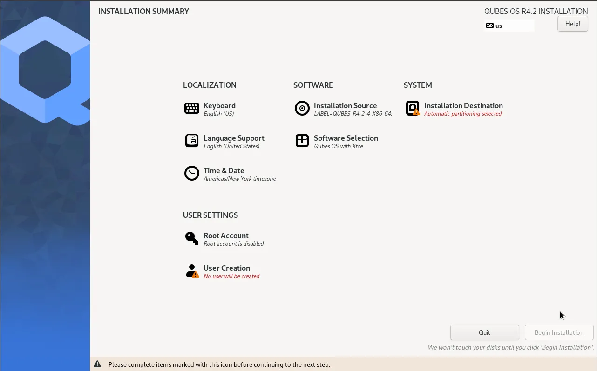

**Imiterere ya klavye** :

Fyonda kuri **Keyboard**, hanyuma uhitemwo **imiterere ibereye** kuri mudasobwa yawe. Umaze guhitamwo, ukande kuri **Terminated** kugira ngo ugende ku ntambwe ikurikira.

**Guhitamwo aho uzoja** :

Hitamwo "Ikibanza co gushiramwo" kugira uhitemwo disiki wipfuza gushiramwo Qubes OS. Kubera ko ari vyo, ugucapura biraba ubwavyo, bikagufasha gukuraho amakuru yose kuri disiki maze ukayishiramwo sisitemu. Ushobora, ariko, guhitamwo **Ivyahinduwe** canke **Ivyahinduwe biteye imbere** kugira ngo ukore ugucapura guhinduwe. Hanyuma ukande kuri "Birangiye". Sisitemu izogusaba gushinga **ijambobanga**, rikora nk’umutekano Layer kugira ngo ushiremwo amakuru yawe. Raba neza ko uhisemwo ijambobanga rigoye kandi ridasanzwe.

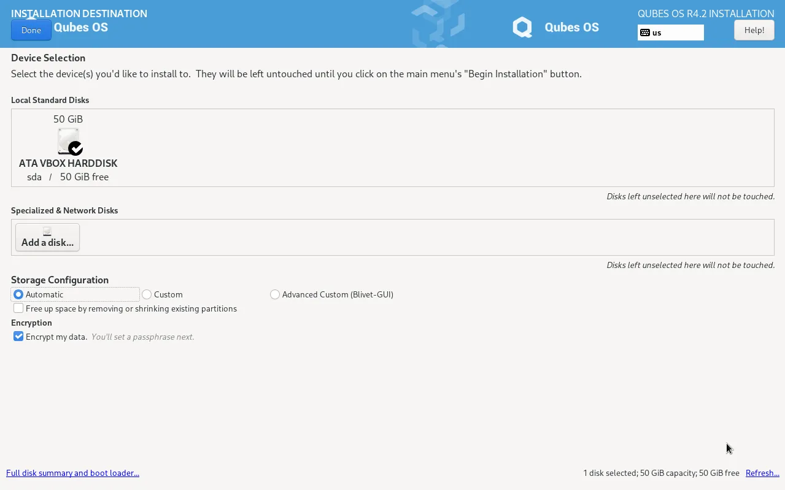

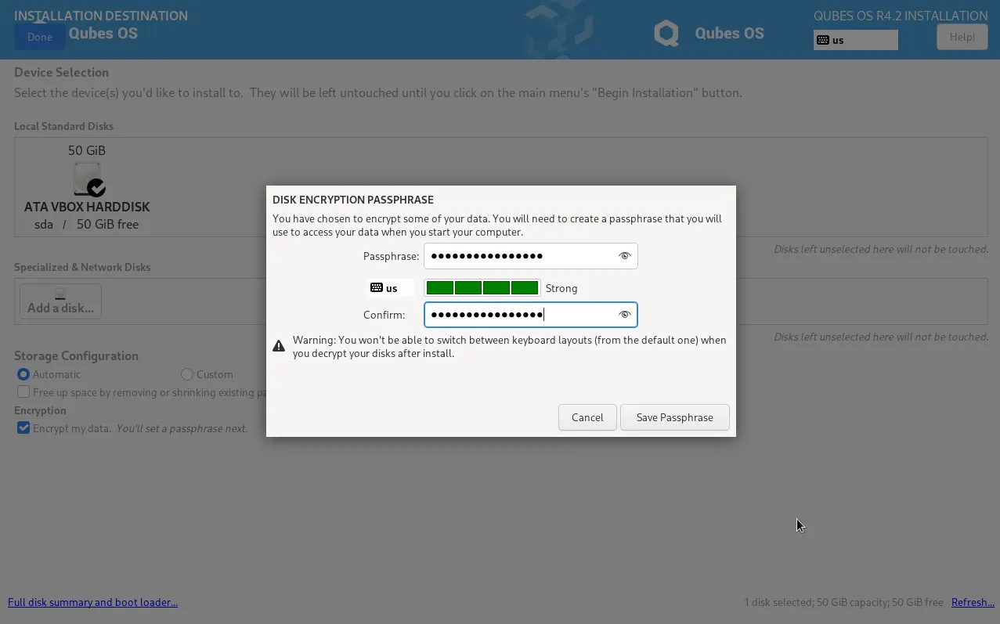

**Hitamwo itariki n'isaha** :

Fyonda ku nzira y’Isaha n’itariki, hanyuma uhitemwo aho uba. Ushobora kandi guhitamwo igihe ukunda: 24h canke 12h.

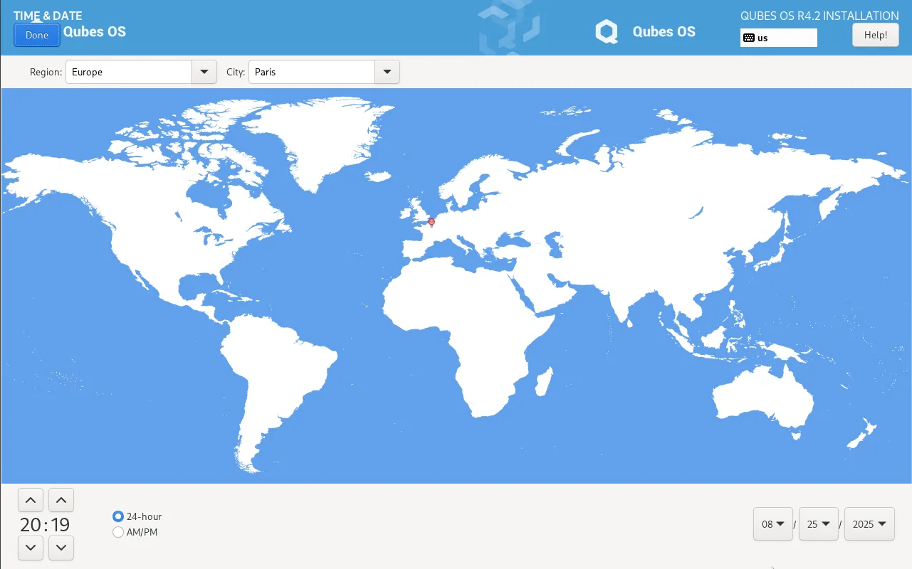

**Gukora konti y'ukoresha** :

Fyonda kuri **Rema umukoresha** kugira ngo ureme **konti yawe ya mbere**, ivyo bizotuma ushobore kwinjira muri Qubes OS.

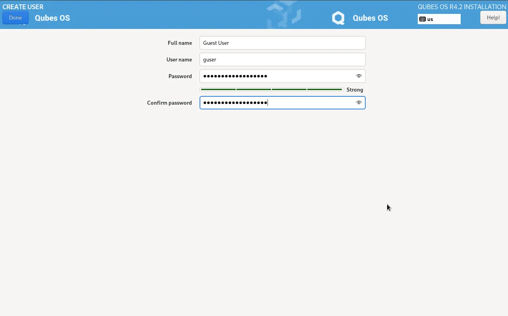

**Gukoresha konti y'umuzi** :

Ushobora kandi **gukoresha konti y'umuzi** mu gushinga ijambobanga ritandukanye ry'ubuyobozi.

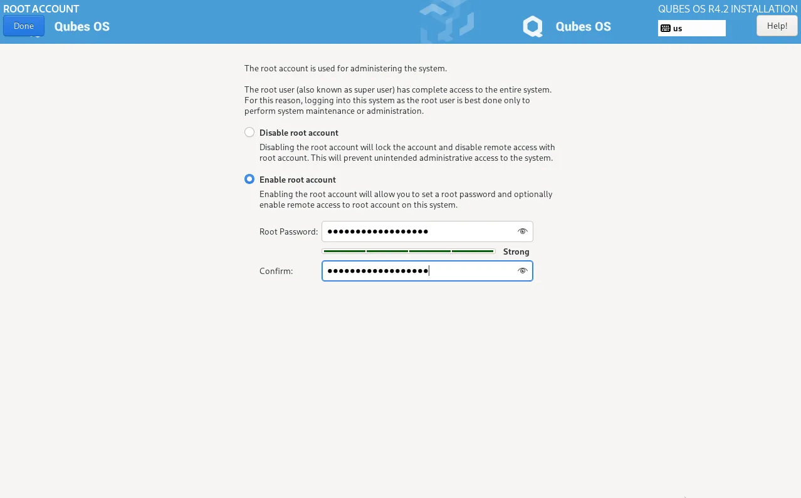

Ivyo bimaze gukorwa, ukande kuri **Start installation** kugira ngo utangure igikorwa.

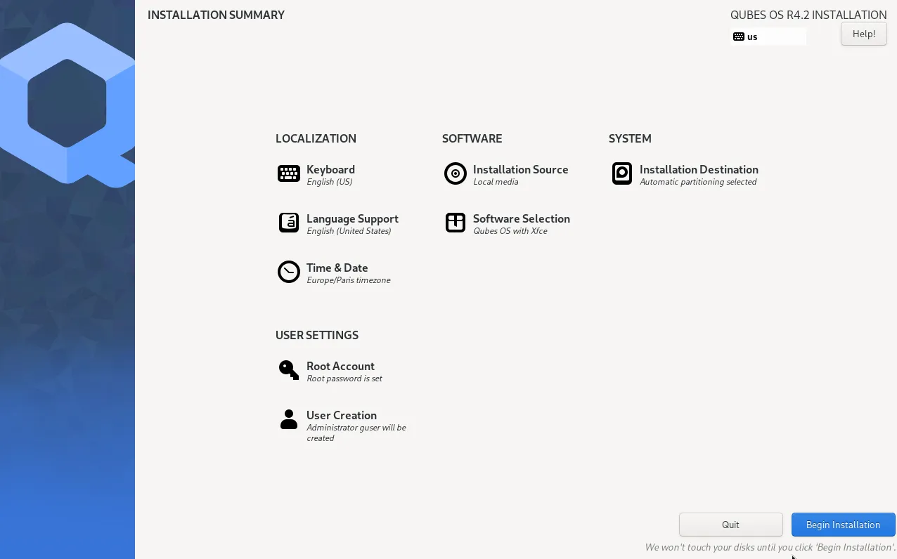

Rindira **iherezo ry'ugushiraho**, hanyuma ukande kuri **restart system** kugira ngo uheze gushiramwo maze utangure Qubes OS.

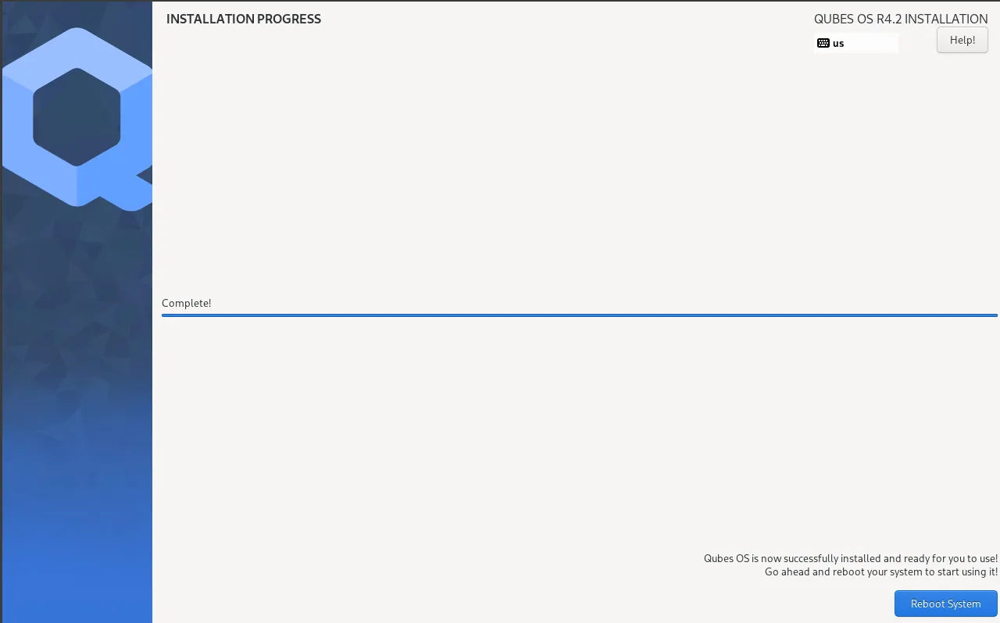

**Ibindi bikoresho** :

Inyuma yo gusubira gufungura, Qubes OS iragusaba guheza **ibigereranyo vy’imbere n’imiterere ya qubes**. Injira ijambobanga ryasobanuwe kugira ngo ushiremwo amakuru kuri disiki.

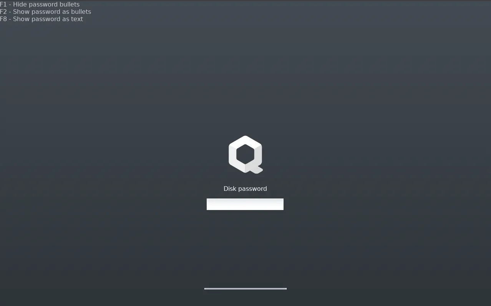

Inyuma, tangura uhitemwo **TemplateVM** wipfuza gushiramwo. Amahitamwo asanzwe ni **Debian 12 Xfce**, **Fedora 41 Xfce** na **Whonix 17**, aya nyuma ni yo akoreshwa mu gukoresha bisaba **ukutamenyekana n'umutekano w'urubuga**. Ushobora kandi gusobanura **Igishushanyo mburabuzi**, kizokora nk'ishimikiro ryo kurema **AppVMs** nshasha.

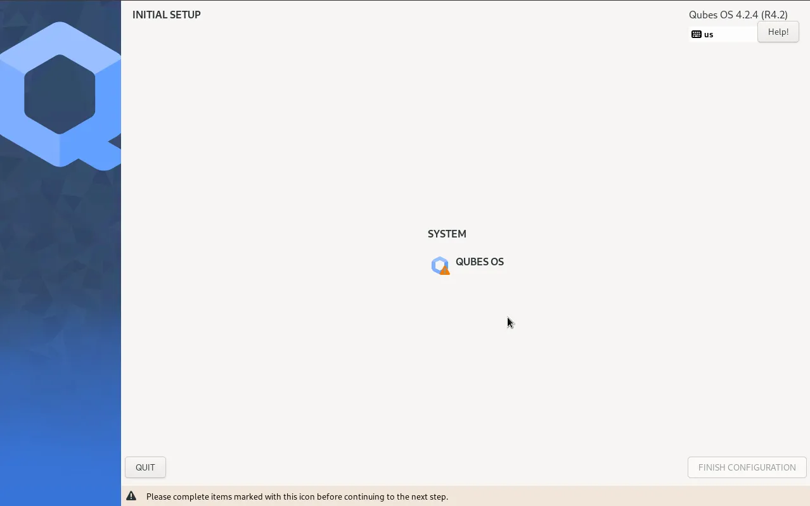

Mu gice ca **Imitunganyirize nyamukuru**, ushobora guhitamwo gukora ubwawe ibikoresho vy'ingenzi nka **sys-net**, **sys-firewall** na **DisposableVM**. Ni vyiza gukoresha uburyo bwo guhindura **sys-firewall na sys-usb disposable**, kugira ngo ugabanye ukugaragara kw'ibikoresho n'urubuga iyo habaye uguhungabana. Ushobora kandi gukora **AppVMs**, nka **iz'umuntu ku giti ciwe**, **iz'akazi**, **izitizigirwa** na **ivy'ububiko**, kugira ngo utunganye ibikorwa vyawe bivanye n'urugero rw'ukwizigira kwavyo.

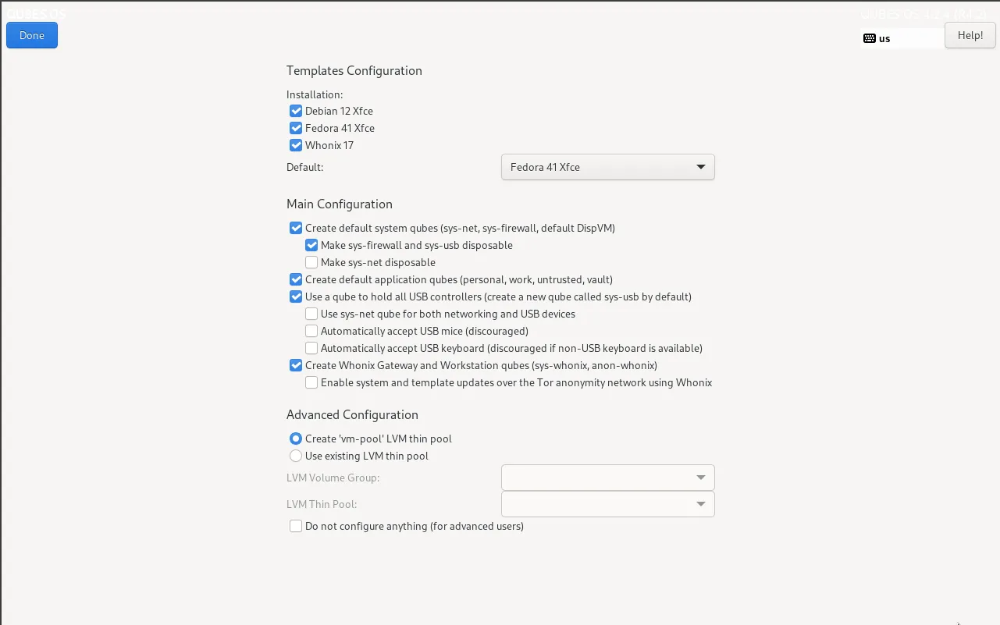

Qubes OS kandi iragufasha gukora **qube yihariye ku bikoresho vya USB** (sys-usb) no gutunganya **qubes z’Irembo rya Whonix n’Ikibanza co Gukoreramwo** kugira ngo ukingire ivy’itumanaho ryawe biciye ku rubuga rwa Tor. Ku bakoresha bateye imbere, igice ca **Imiterere iteye imbere** kigufasha gukora **LVM thin pool** kugira ngo ushobore gucunga neza umwanya wa disiki hagati ya qubes.

Ivyo vyose bimaze gutunganirizwa, ukande kuri **Uzuze**, hanyuma ukande kuri **Urangize gutunganirizwa**. Rindira igihe sisitemu ikoresha ivyo bintu. Uzoca usabwa **kwinjira muri konti yawe y’ukoresha**, kandi ibidukikije vyawe vya Qubes OS bizoba biteguye gukoreshwa, bitekanye kandi vyitandukanijwe neza n’ibikorwa vyawe bitandukanye.

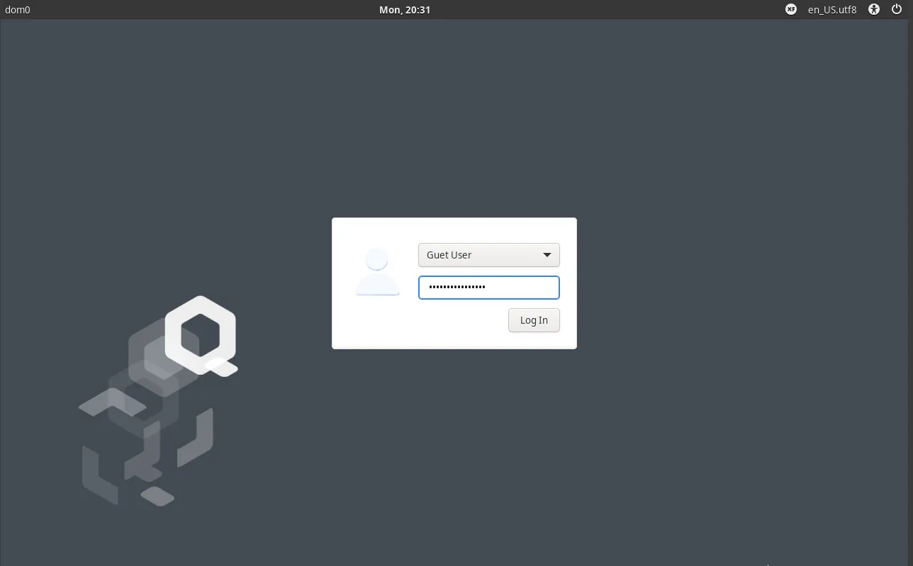

Ubu ubuhinga bwawe bwo gukoresha burashizwemwo kandi burateguwe gukoreshwa.

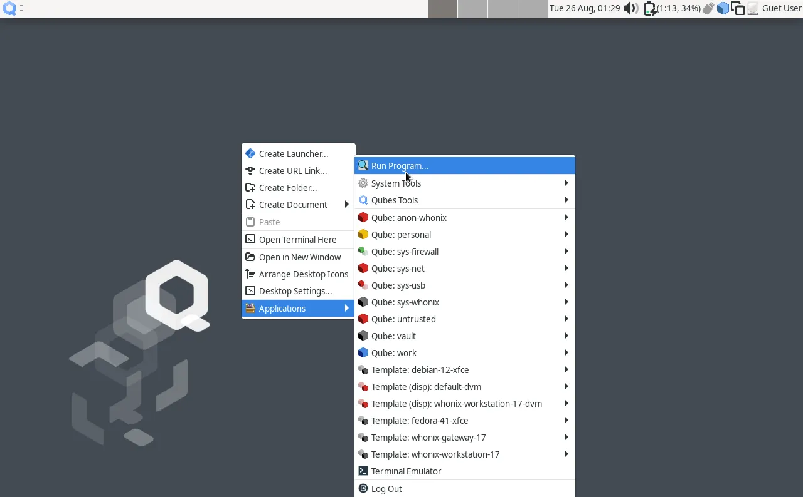

## Rema qube kuri sisitemu yawe

Kugira ngo ureme qube, igikorwa gicungiwe n'igikoresho **Qube Manager**, gishobora gushikwako uhereye ku rutonde rw'intango. Mu idirisha ry'ibikoresho, gusa ukande ku **Rema qube** kugira ngo ufungure idirisha rishasha ry'imiterere. Mbere, shiramwo izina rya qube yawe, nka "perso-web" canke "work", kugira ngo umenye uko ikoreshwa.

Inyuma, uzohitamwo **Ubwoko** bwayo, kenshi **AppVM** ku bikorwa vya misi yose, canke **DisposableVM** ku gukoresha mu gihe gito. Ni ngombwa cane guhitamwo **Icitegererezo** qube yawe izoshingirako, nka "fedora-39" canke "debian-12", kuko ivyo bizotanga uburyo bwo gukoresha n'ubuhinga. Uzotora kandi **NetVM**, ariyo qube ishinzwe gukoresha Internet, ku buryo busanzwe **sys-firewall**.

Ubwa nyuma, umaze guhindura ubunini bw’ububiko na RAM nimba bikenewe, gukanda gusa kuri **OK** bizotangura igikorwa co kurema. Ivyo biheze, qube yawe nshasha izoboneka muri list kandi yiteguriye gukoreshwa.

Mu gusozera, Qubes OS si ubuhinga busanzwe bwo gukoresha, ahubwo ni umuti w’umutekano w’ubuhinga bwa none usubira kwiyumvira ubuhinga bwa mudasobwa y’umuntu ku giti ciwe. Uburyo bwayo, bushingiye ku gucapura no kwitandukanya n’abandi biciye mu gukoresha ubuhinga bwa none, buratanga uburinzi butagira uko bungana ku bitero bikomeye cane. Mu gucapura ahantu h’akazi mu bice vy’ubuhinga bwihariye ku gikorwa cose, bituma porogarama mbi zidashobora gukwiragira no gutera ingorane ubuhinga bwose.

Waba ukeneye guca ku rubuga mu mutekano, kurinda amakuru y’agaciro canke gukorana n’ingero zitandukanye z’ukwizigira, Qubes OS itanga uburyo bukomeye kandi buboneye. Mu kwemera ingeso nziza no gukoresha neza ibiranga, uzogira **igihome ca digitale** gihuye n’iterabwoba ryo muri iki gihe. Menya vyinshi ku bijanye no kurinda amakuru yawe n’ubuzima bwite bwawe.

https://planb.network/courses/4ba0e3de-e67f-4ea1-a514-f111206810d1