如果您已經在 Plan ₿ Network 的網頁上看了一段時間，您已經了解到其中一個最被提倡的安全設定，幾乎是必須的，**是透過離線儲存您的私人金鑰來管理資金**。


如果您還沒有發現它，您可以在本教程中找到開放原始碼資源的連結，以瞭解更多有關它的資訊。


要離線管理私鑰，需要一台始終與網路斷開的裝置，無論是[硬體錢包](https://planb.network/resources/glossary/hardware-wallet)還是專門用於此特定功能的隔離電腦。


舉例來說，如果您沒有能力購買只執行這項任務的硬體，但又不想放棄這個安全步驟，該怎麼做？


## 解決方案


如果我告訴您，您可以製作一個氣隙式電腦的離線裝置，其大小和重量與 USB 隨身碟無異，而且只需 35 歐元，您會怎麼想？您會不相信嗎？


繼續閱讀。


我再告訴您：一路讀下去。建議的解決方案很便宜，但也不完全是最簡單的。首先您要了解大概的想法，然後決定投入一些時間進行一些個人研究，並在盡可能安心的情況下選擇是否繼續以及如何繼續。


## 要求


**1** 一台 [Raspberry PI Zero](https://www.raspberrypi.com/products/raspberry-pi-zero/)：PI Zero（沒有任何後綴）是建立最低性能電腦的基礎，但最重要的是它缺少 Wi-Fi 和 Bluetooth 卡，這是本次練習所必需的要求。


- 成本：撰寫本教程時（2025 年 8 月）約為 15.00。
- 持續生產：Raspberry 保證生產至 2030 年 1 月。


不含 Wi-Fi 和藍牙的 PI Zero 很不幸地已幾乎無法使用。您或許可以更容易找到 PI Zero W 和 PI Zero 2W 的替代品。在這種情況下，您可以透過變更設定檔來停用連線功能。安裝作業系統後，您需要將這些項目新增至 config：


```
dtoverlay=disable-wifi
dtoverlay=disable-bt
```


本指南的一部分將告訴您如何以及在何處進行拆卸。不過，如果您真的想要確定，您可以在網路上找到幾個教學，教您如何使用小型切割器（適合在電子板上使用的那種）移除 Wi-Fi 晶片。


**2** Raspberry PI Zero 的_starter kit_：如同 Raspberry 世界的慣例，是裸板，沒有外接盒。此外，如此小板的有限資源也限制了與外界連線的可能性。


當我決定要繼續進行時，我發現 [這個套件](https://www.amazon.it/-/en/GeeekPi-Raspberry-Aluminum-Passive-Heatsink/dp/B0BJ1WWHGF?crid=1NAFFVHG3IFBU&sprefix=raspberry+pi+zero+kit+geeek+pi%2Caps%2C88&sr=8-65) 滿滿的配件，可以充分利用 PI Zero 的全部潛力。事實上，套件包含一個 USB A -> micro USB 電源 Supply、一個小型 USB 集線器、一個 mini-HDMI -> HDMI 轉接器、一個銅製散熱器和一個鋁製外殼。套件中還提供將 PI Zero 放入新外殼所需的螺絲和萬能扳手。


- 成本：19.99 歐元。


**3** 本教學不需要您在氣隙電腦上花費大量預算。但您應該知道，您需要一個 USB 鍵盤和滑鼠 (嚴格來說是有線的，避免使用藍牙) 以及一台顯示器。視顯示器的輸入而定，您可能需要迷你 HDMI 的轉接器，這是 PI Zero 上唯一可用的輸出。最後，請注意 Hard 的事實，我們每個人的家中都有一個非無線的鍵盤和滑鼠，是時候把它們關掉了。


## 額外預算


**4** 您可以從 Raspberry 購買原廠電源 Supply，價格約為 15.00 歐元。


**5** 我個人選擇使用_starter kit_ 中提供的電源 Supply，但結合了 USBA → miniUSB 所謂的「無資料」纜線，價格為 3.70 歐元。


**6** 一張 micro SD 卡，至少要有 32 GB 的大容量儲存空間；如果是工業級品質/等級則更好。


**7** 您將需要一個系統、一個 USB 至 micro SD 轉接器，就像您在圖中看到的那個。事實上，您的 PI Zero 作業系統及其記憶體可以在該媒體上運作。


## 安裝作業系統


在將 PI Zero 合上機殼之前，我建議您先安裝作業系統。這樣您就可以馬上檢查指示操作的 LED 指示燈。


要選擇和燒錄作業系統，我選擇了最簡單的方法：使用 Raspberry `PI Imager` 工具。


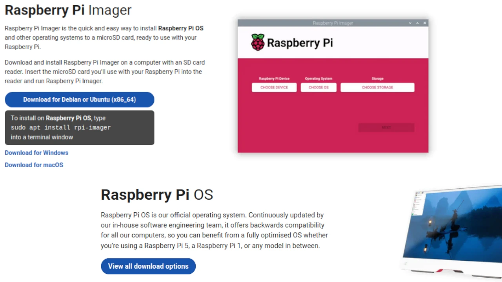


前往 [Raspberry 的 Github](https://github.com/raspberrypi/rpi-imager/releases) 下載 Imager 的最新版本，選擇最適合您作業系統的版本（撰寫時為 v. 1.9.6）。您會注意到，在每個檔案旁邊還有對應檔案的雜湊值。這對驗證將非常有幫助。


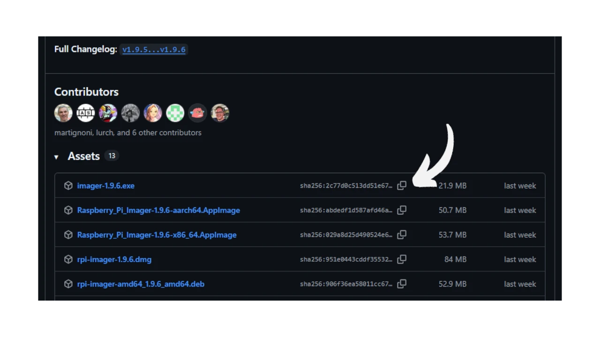


我建議您驗證您將在 airgap 電腦上使用的作業系統，以確保您的個人安全。這會讓您有信心，您使用的是合法 (非惡意) 版本的 Imager 以及 Raspi OS。


下載後立即進行驗證，並將您通常使用的機器連線至網際網路


然後開啟 Linux 終端並準備下載，建立有助於使用的 `raspios` 目錄。


使用 `wget` 為您的 Linux 發行版本下載 Imager。


最後，執行檔案 `sha256sum` 指令，並將 Hash 與 Raspberry 在其 Github 中提供的 Hash 進行比較。


或者，如果您使用的是 Windows，請開啟 Power Shell 並輸入以下指令：


```
Get-FileHash -Path <yourpath>\imager-1.9.6.exe
```


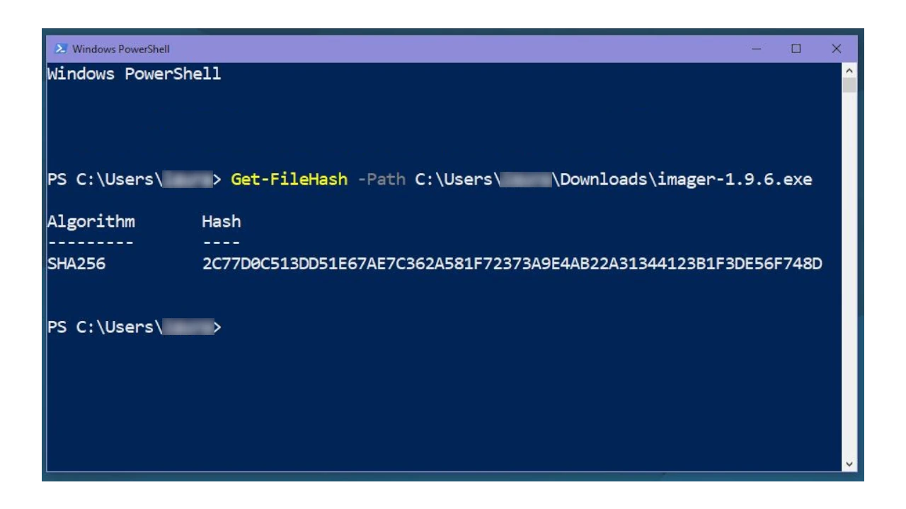


您將獲得 Hash，它必須與 Raspberry Github 上發佈的相符。


驗證下載後，您就可以在日常使用的電腦上安裝 Imager 並開啟它。Imager 是您將作業系統燒錄至 micro SD 所需的工具，而 micro SD 將成為 PI Zero 的「系統磁碟」。


過程非常簡單：首先選擇您要使用的 Raspberry 裝置（因此請注意您的 **Raspi Zero 型號**），然後選擇作業系統版本，最後選擇要將作業系統快閃到的 micro SD 卡掛載點。


### 第一步


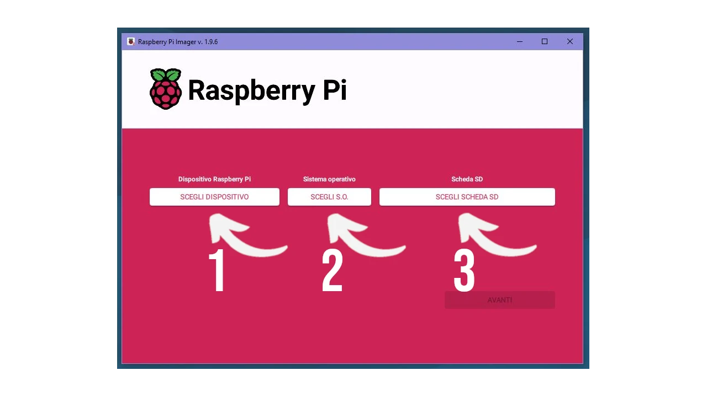


### 第二步


**Note well**：選擇 `PI OS 32-bit`，這是唯一能與 PI Zero 搭配使用的 OS。


### 第三步


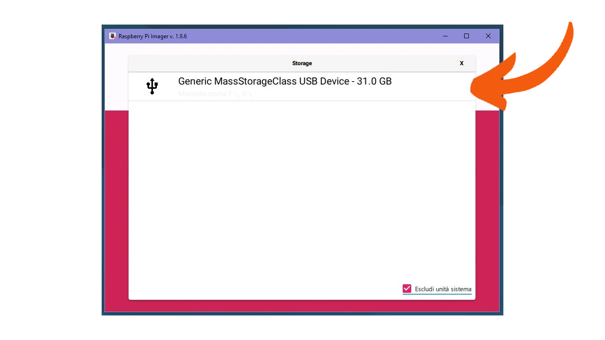


(請務必小心選擇 _Exclude System Drive_，以避免被提示在您的電腦上安裝 Raspi 作業系統)。


一切設定完成後，相機會詢問您是否要使用自訂設定。選擇您想要的設定，或按一下 _No_ 繼續使用預設選項。


確認您要刪除 micro SD 的內容


Imager 開始將作業系統閃存至 micro SD，捲動條會通知您進度。


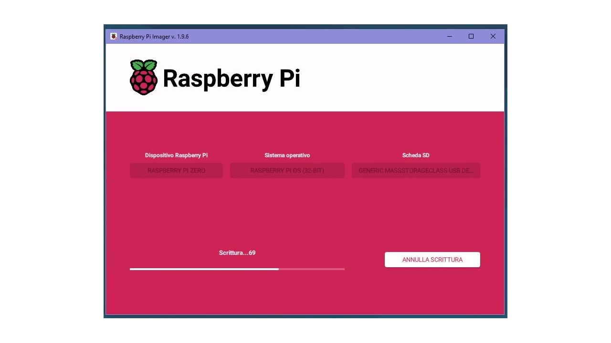


最後會有自動驗證，我建議您不要停止。


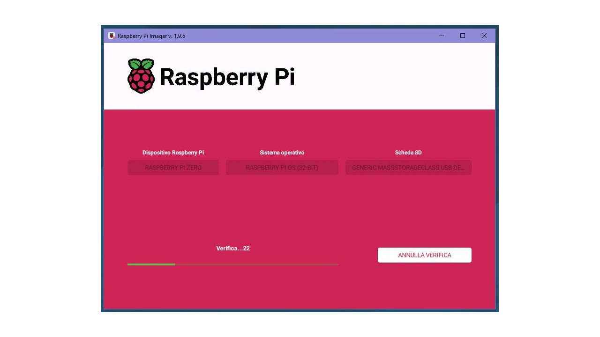


最後，螢幕上會出現一則訊息，如果一切都很成功，它就會像您在圖片中讀到的一樣。


現在您可以真正地將micro SD從讀卡器取出，並將其放入PI Zero的插槽中。打開小型Raspberry並觀察LED：我們預期它應該是綠色並閃爍，表示作業系統正在正常加載，之後會持續亮起。如果您有其他指示，例如LED以固定頻率閃爍或為紅色，請查閱FAQ或[支援論壇頁面](https://forums.raspberrypi.com/)。


## 第一組態


Raspi OS 的第一次啟動會比平常慢一點，因為它必須執行一些實際的安裝任務。但如果一切順利，您會發現一個歡迎畫面。


按一下 _Next_ 設定地理區域，特別是載入正確的鍵盤。請特別注意後者。


按一下 _Next_ (下一步)，您會被要求建立您的使用者，請記下您的憑證，並妥善保存。


精靈會要求您在 Chromium 和 Firefox 之間選擇預設 Web 瀏覽器；如果您使用的是 Zero W 或 2W PI，精靈也可能會詢問您有關 Wi-Fi 網路的設定。繼續按一下 _Skip_。


在某個時候，系統會提示您升級板載軟體和作業系統。選擇 _Skip_：就本練習而言，我們實際上是在建立一台離線機器，此時必須保持離線狀態。


最後，它可能會要求您啟用 `ssh`，但也請拒絕此步驟，因為這是一個零空隙 IP。


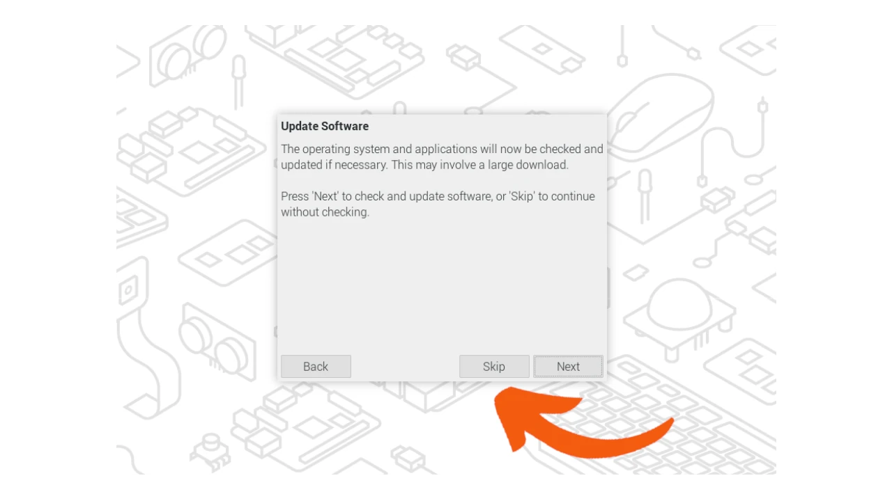


沒有其他設定了。完成後，重新啟動 Raspberry，使變更生效。


## 新的電腦空隙


重新開機後，您的新 airgap 電腦就準備好了。PI Zero 會顯示新的桌面，您可以透過圖形使用者介面或指令列使用。


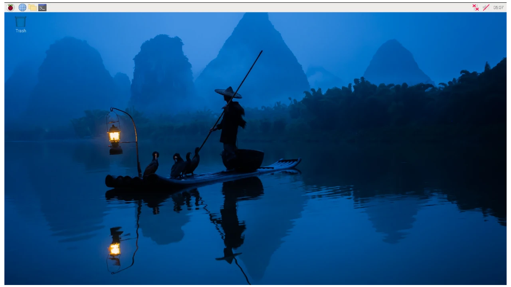


### PI 零 W 或 2W 的第一步


如果您使用的是 Raspberry PI Zero W 或 2W 系列，您的板子上有 Wi-Fi 和藍牙的晶片。在第一次設定時，您跳過了連線設定，因此 PI Zero 沒有連上網際網路。現在您可以透過軟體永久停用這兩顆晶片。


事實上，Raspi OS提供了一個`config.txt`檔，您可以按自己的喜好編輯。該`config`檔位於`boot`分割區的`firmware`目錄下，您可以用`root`權限編輯和儲存它。


從左上方的圖示開啟終端機，就會變成 `root`.(1)


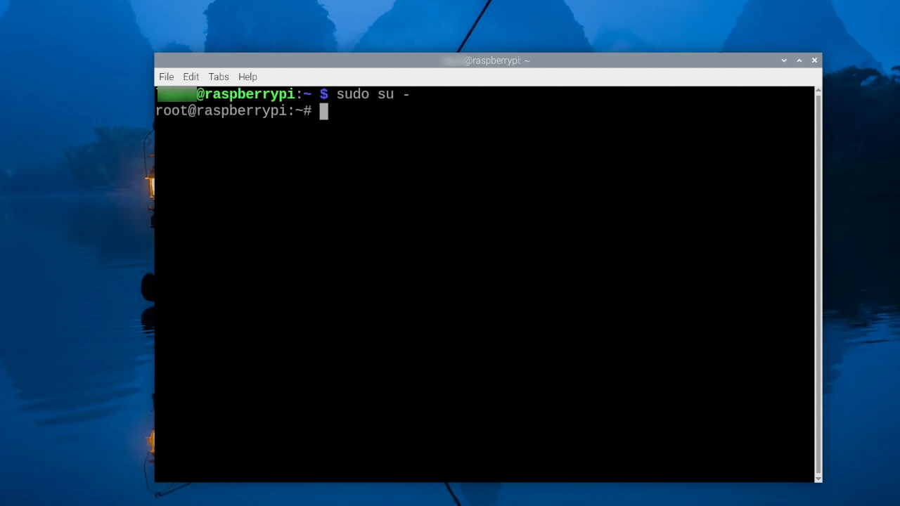


(1) 如果Raspi OS在前面的步驟中沒有讓您建立`root`密碼，我建議您現在使用`passwd`命令來建立。讓 `root` 使用者獨立於您的個人使用者移動，在復原時會非常方便。


使用終端機，檢查 `config.txt` 檔案，並準備使用 `nano` 編輯器編輯它。


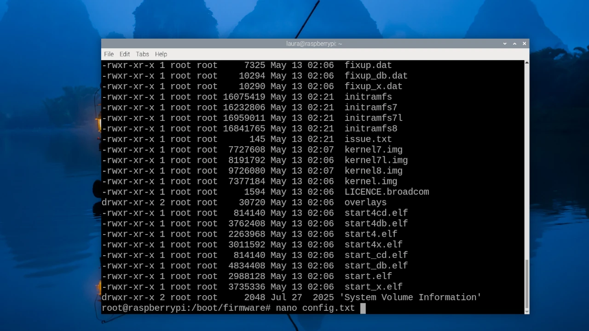


編輯工作應該在整個 `config` 的底部進行，也就是在 `[All]`之後。此時您將加入本教學開始時所顯示的 `dtoverlay` 指令。


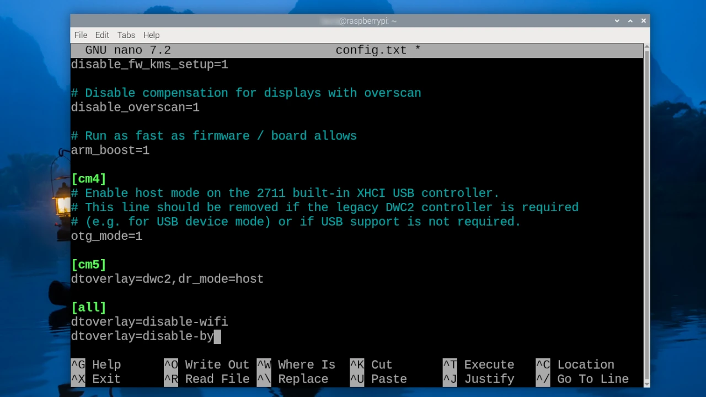


儲存、關閉並重新啟動。在下面的步驟中，我們將去探索小 Raspberry。


## 此裝置的預期效果為何？


查看 Raspberry 網站上的[技術規格](https://www.raspberrypi.com/products/raspberry-pi-zero/)，PI Zero 配備單核心 BCM2835 處理器與 512 MB 記憶體，因此性能並不算強大。


由於終端機較輕，我們會使用命令列來探索系統組態。


開機時，您會看到一個簡短的彩虹色螢幕，接著是 Raspberry 的歡迎訊息，左下角則是與開機相關的核心訊息。


當 PI OS 桌面出現時，開啟終端機並輸入：


```bash
uname -a
```


此指令會在螢幕上顯示目前使用的核心版本，以及其他資訊。


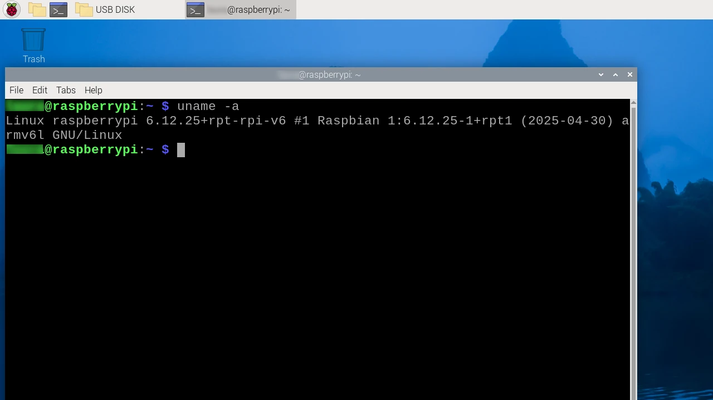


您也可以透過輸入來查看 CPU 和硬體的資訊：


```bash
lscpu
```


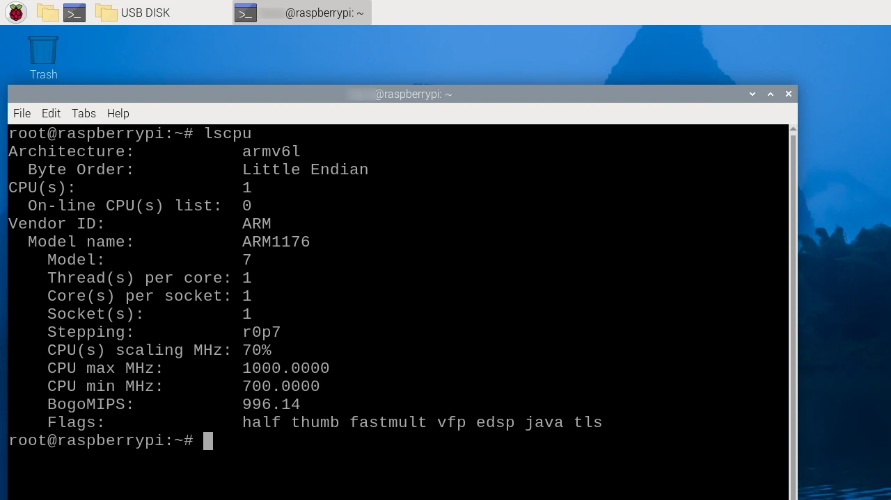


另請參閱 `proc/mem/info`。


找出 Debian 的版本和發行版代號：


``` bash


lsb_release -a


```


Infine, due comandi per controllare la memoria di massa e i dischi:

``` bash
fdisk -l
```


``` bash


df


```
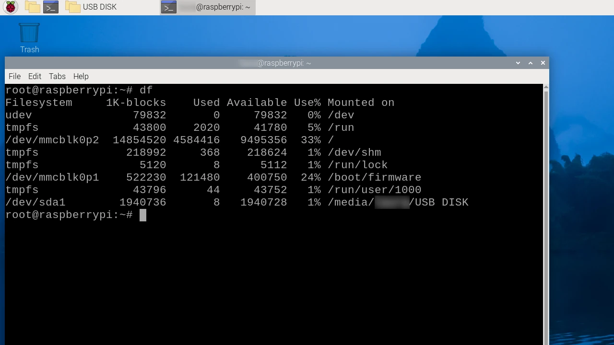

Per controllare come lavora la CPU:

``` bash
top
```


## 使用


雖然 PI Zero 的效能看起來有限 (在紙面上以及與現今的機器功率相比)，但它的效能很高，尤其是作為終端機。


- 首先您可以進入主選單，並從 _Add/Remove software_ 面板中得到啟發，在這裡您可以找到許多公用程式來編程和練習。請記住，您也可以從終端機執行，但一定要有 `root` 權限。


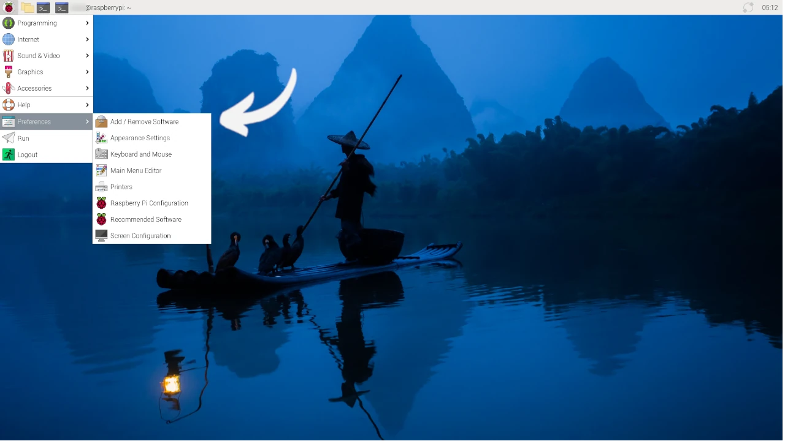


- 您可以「領養」這個離線裝置來儲存各種機密文件，在需要時仍可存取，而不會接觸網際網路。
- 您可以使用此設定來安全地 generate 您的 GPG 金鑰。
- 你甚至可以將這個新的「小玩具」用作隔離簽名裝置，[按照 Arman The Parman 的建議操作](https://armantheparman.medium.com/how-to-set-up-a-raspberry-pi-zero-air-gapped-running-latest-version-of-electrum-desktop-wallet-85e59ecaddc0)。


在我熟悉的錢包中，唯一提供 32 位元版本的是 Electrum。那麼：我們在本教學中所準備的 Zero IP 將允許您保留離線的私密金鑰，我們在本教程中所涵蓋的 Wallet airgap 的設定：


https://planb.network/tutorials/wallet/desktop/electrum-airgap-62b5a4c6-a221-4d41-9a62-4618c53d8223

## 結論


這個設定可能有一個很大的缺點：micro SD 是一種可能會產生問題的媒體。它很容易受到大量使用的影響；也許您已經在手機上使用過這種媒體。在零 airgap IP 上安裝所有您要使用的軟體之後，請使用您現有的 Raspi OS 工具為珍貴的 micro SD 做好備份。


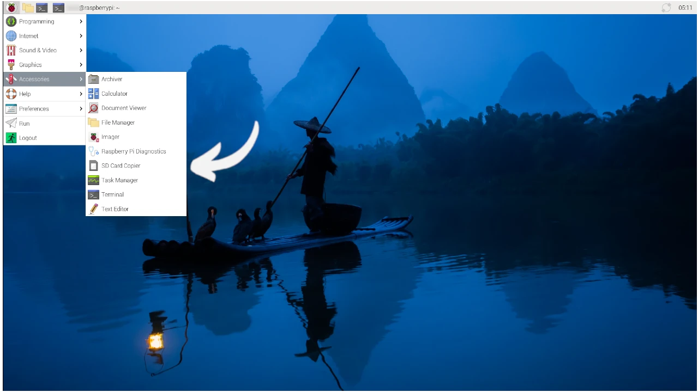


隨著您的需求與預算的增加，您可以探索其他 Raspberry 或類似的解決方案。以記憶體為例，PI 5 提供組裝 M2 NVME 硬碟機的可能性，這肯定比 microSD 更堅固。


不要忘記做筆記，並記錄您即將離線使用的公用軟體安裝的每個步驟。 **sooner or later an updated Raspi OS will come out** that you will definitely want to take advantage of.到那時候，您就必須刪除所有的東西，然後重新來過（也許要用新的 micro SD 😂）。


我們剛剛做的練習，假設也是您的第一次實驗，您會記得很久。要在離線時將硬體專注於「嵌入式」作業，而不忽略不時開啟並檢查一台 airgapped 機器的注意力，並不總是可能的事。


不過您還是成功了，恭喜您！您將能夠向所有需要降低預算的人建議這個解決方案。