O Seedkeeper é um smartcard desenvolvido pela Satochip, uma empresa belga especializada em soluções de hardware para gestão e proteção de segredos digitais. Reconhecida pela sua gama de smartcards para o ecossistema Bitcoin, a Satochip concebeu o Seedkeeper como uma alternativa aos métodos tradicionais de armazenamento de frases mnemónicas e outros segredos digitais.

Em termos concretos, o Seedkeeper assume a forma de um cartão inteligente multifuncional, certificado EAL6, com um processador seguro e uma memória inviolável (o chamado "Elemento Seguro"). Como o nome sugere, a sua função é armazenar mnemónicas e palavras-passe da carteira Bitcoin de forma encriptada e protegida. Com o Seedkeeper, pode generate, importar, organizar e guardar os seus segredos diretamente no componente seguro do cartão.

Na minha opinião, o Seedkeeper tem duas utilizações principais, que iremos explorar em dois tutoriais separados:

- Armazenamento de frases mnemónicas Bitcoin**: em vez de escrever as suas 12 ou 24 palavras em papel, pode importá-las para o smartcard e protegê-las com um código PIN.
- Gestão de palavras-passe**: pode criar generate palavras-passe fortes através da aplicação Seedkeeper e armazená-las diretamente no smartcard, proporcionando-lhe um gestor de palavras-passe offline prático e fácil de utilizar.

Tecnicamente, o Seedkeeper tem uma capacidade de 8192 bytes, o que lhe permite armazenar um mínimo de 50 segredos distintos (o número exato dependerá do seu tamanho e dos metadados associados a cada um). O Seedkeeper pode ser acedido quer [através de um leitor de cartões inteligentes ligado](https://satochip.io/accessories/) a um computador, quer através da aplicação móvel com ligação NFC. Todo o sistema funciona em modo offline, sem ligação à Internet, garantindo uma superfície de ataque limitada.

Uma funcionalidade particularmente interessante é a capacidade de duplicar o conteúdo de um Seedkeeper para outro, de modo a criar uma cópia de segurança. Neste tutorial, mostraremos como fazer isso.

Neste tutorial, abordaremos apenas o uso do SeedKeeper para senhas tradicionais, à maneira de um gerenciador de senhas. Se pretender utilizar o SeedKeeper para guardar frases mnemónicas Bitcoin wallet, consulte este outro tutorial:

https://planb.academy/tutorials/wallet/backup/seedkeeper-906dfff8-1826-4837-92d1-8669e216d356

## 1. Como posso obter um guardião de sementes?

Existem duas formas principais de obter o seu Seedkeeper. Pode [comprá-lo diretamente na loja oficial da Satochip](https://satochip.io/product/seedkeeper/) ou num revendedor autorizado. Mas como [o applet do Seedkeeper é open-source](https://github.com/Toporin/Seedkeeper-Applet), também tem a opção de o instalar você mesmo em [um smart card em branco](https://satochip.io/product/blank-javacard-for-diy-project/).

Se pretender utilizar a funcionalidade de cópia de segurança do Seedkeeper, terá obviamente de adquirir dois cartões inteligentes.

## 2. Instalar o cliente Seedkeeper

O primeiro passo é instalar o software no seu computador ou smartphone. Num PC, é necessário [descarregar a versão mais recente do Satochip-Utils](https://github.com/Toporin/Satochip-Utils/releases). Nos telemóveis, a aplicação Seedkeeper está disponível na [Google Play Store](https://play.google.com/store/apps/details?id=org.satochip.seedkeeper) e na [Apple App Store](https://apps.apple.com/be/app/seedkeeper/id6502836060).

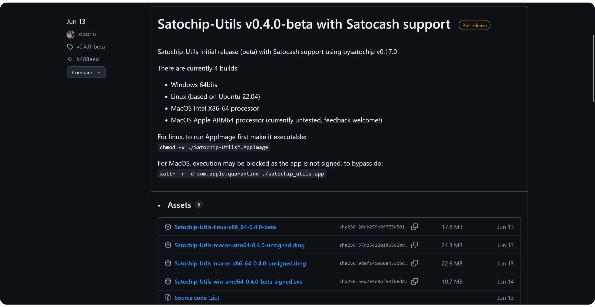

## 3. Inicialização do guardião da semente

Inicie a aplicação e clique no botão "*Click & Scan*".

Ser-lhe-á pedido um código PIN para o seu Seedkeeper. Como se trata de um cartão novo, ainda não foi definido um PIN. Introduza um código qualquer para saltar esta etapa e clique em "*Próximo*".

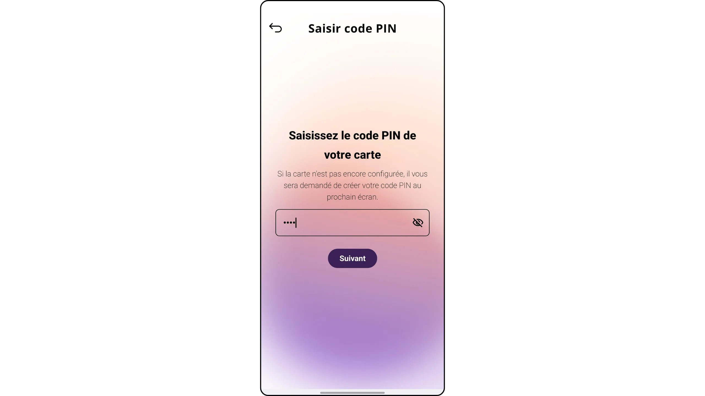

Em seguida, coloque o cartão na parte de trás do seu smartphone. A aplicação detectará que o Seedkeeper ainda não foi inicializado e pedir-lhe-á que defina o código PIN do seu cartão inteligente, com um comprimento entre 4 e 16 caracteres. Para uma segurança óptima, escolha um código PIN robusto, o mais longo possível, aleatório e composto por uma grande variedade de caracteres. Este PIN é a única barreira contra o acesso físico às suas palavras-passe.

**Lembre-se também de guardar este PIN agora**, por exemplo, num gestor de senhas ou num suporte físico separado. Neste último caso, nunca guarde o suporte que contém o PIN no mesmo local que o seu Seedkeeper, caso contrário esta segurança tornar-se-á inútil. É importante ter uma cópia de segurança fiável: sem o PIN, não será possível recuperar os segredos armazenados no Seedkeeper.

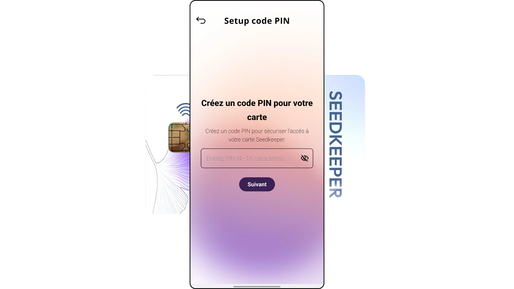

Confirme o seu código PIN uma segunda vez.

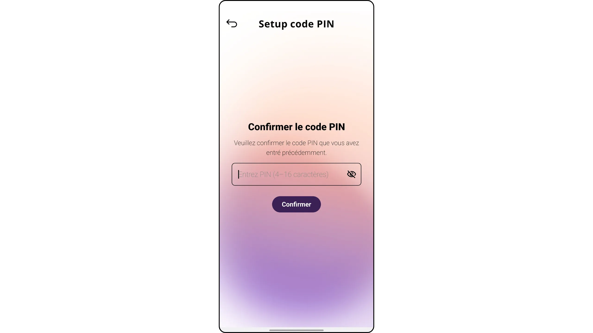

O Seedkeeper está agora inicializado. Pode desbloqueá-lo introduzindo o código PIN que acabou de definir.

Será agora encaminhado para a página de gestão do seu cartão inteligente.

## 4. Guardar palavras-passe no Seedkeeper

Quando o Guardião das Sementes estiver desbloqueado, clica no botão "*+*".

Selecione "Gerar segredo*". A opção "*Importar um segredo*" permite-lhe guardar um segredo existente (por exemplo, uma palavra-passe que tenha criado no passado).

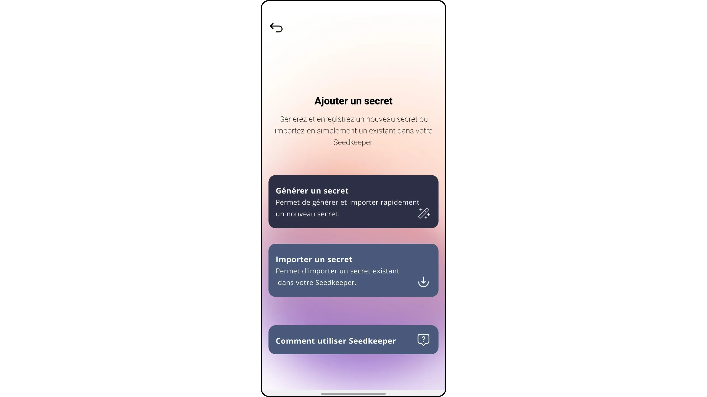

No nosso caso, queremos guardar uma palavra-passe. Clique em "*Password*".

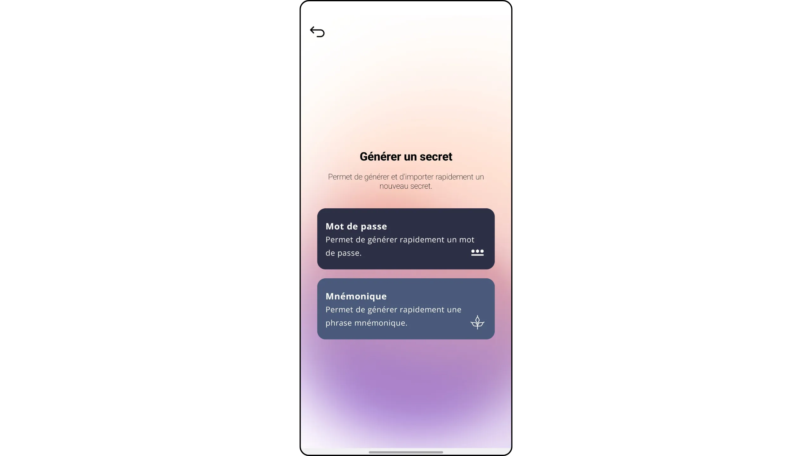

Atribua um "*Rótulo*" a este segredo para que possa ser facilmente identificado se armazenar várias informações no seu Seedkeeper. Também pode adicionar um identificador associado à palavra-passe e ao URL do sítio.

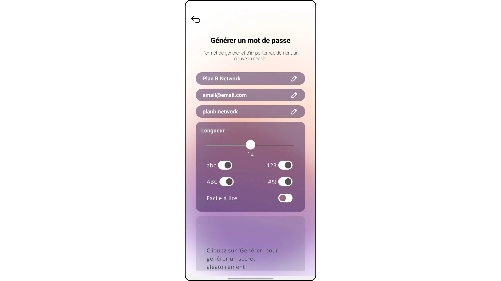

Escolha o comprimento e os parâmetros da sua palavra-passe e, em seguida, clique em "*Gerar*" e depois em "*Importar*".

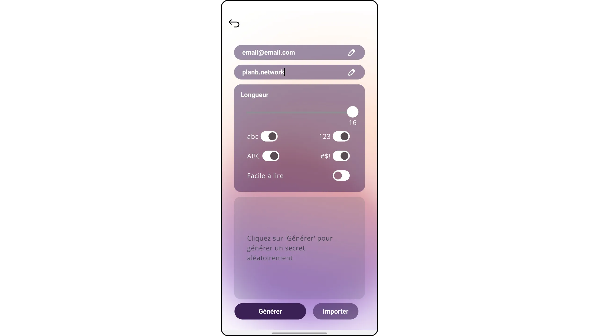

Coloque o Seedkeeper na parte de trás do seu smartphone.

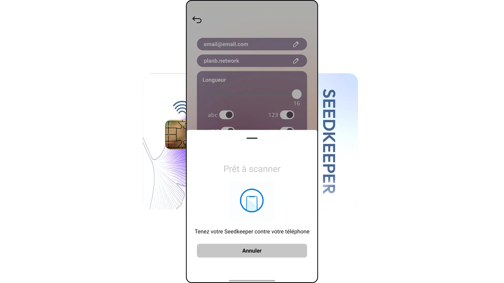

A sua palavra-passe foi registada.

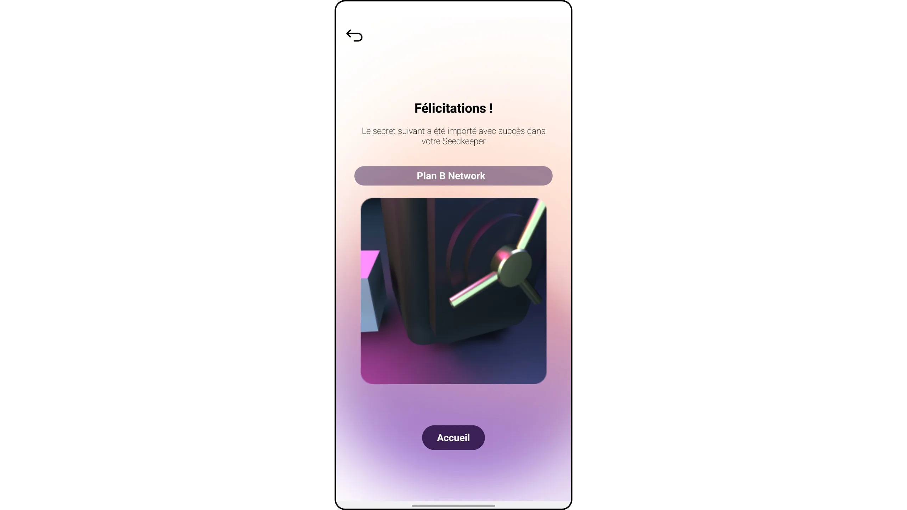

## 5. Aceder à sua palavra-passe do Seedkeeper

Se quiser verificar a sua palavra-passe, pegue no Seedkeeper e clique no botão "*Click & Scan*".

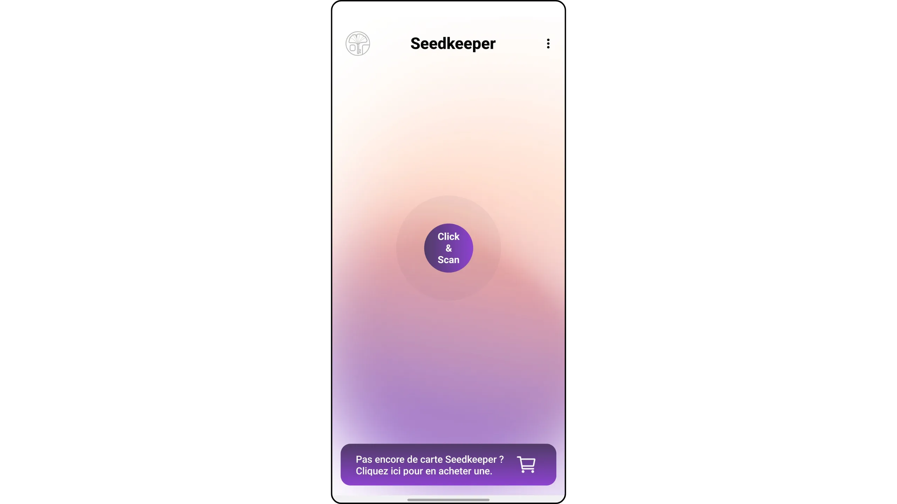

Introduza o seu código PIN e prima "*Próximo*".

Coloque o Seedkeeper na parte de trás do seu smartphone.

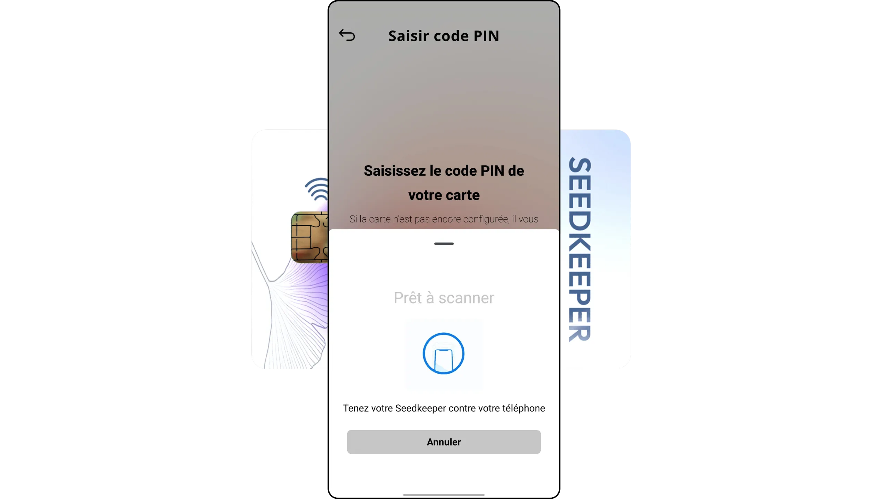

Isto leva-o a uma lista de todos os seus segredos registados. Neste exemplo, quero mostrar a palavra-passe da minha conta da Plan ₿ Academy, por isso clico nela.

Prima o botão "*Revelar*".

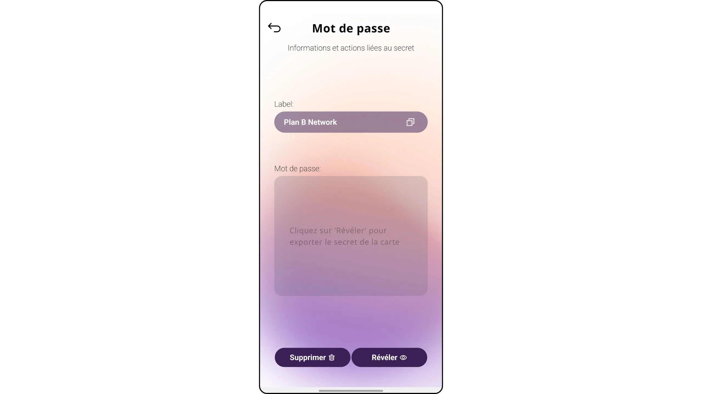

Faça novamente a leitura do seu Seedkeeper.

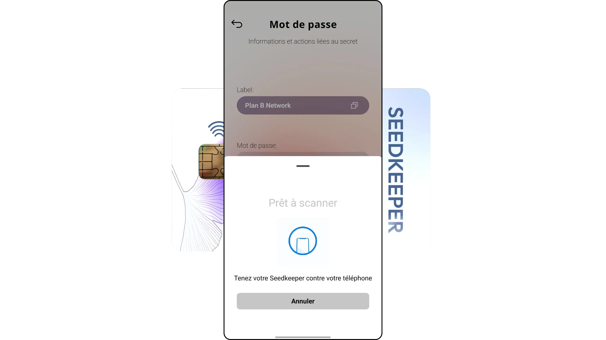

A palavra-passe anteriormente guardada aparece agora no ecrã. Pode copiá-la e utilizá-la no sítio Web em questão.

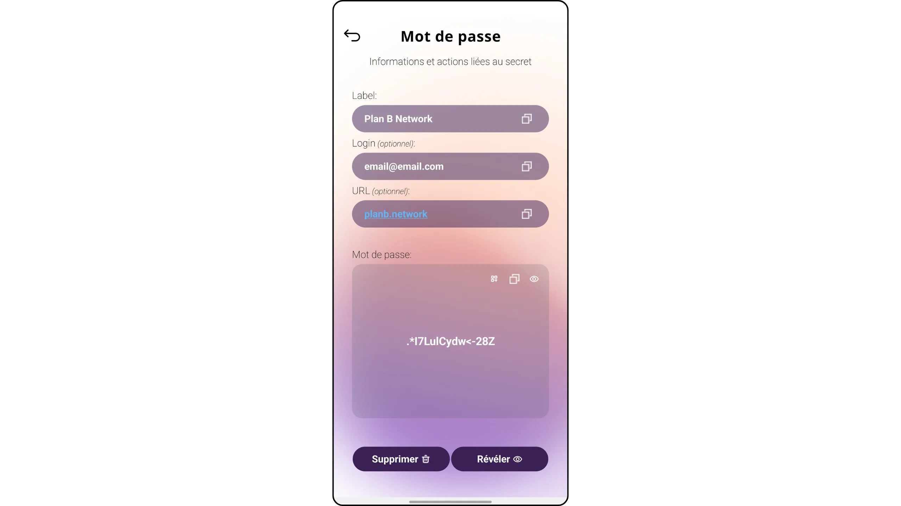

## 6. Cópia de segurança do Seedkeeper

Vamos agora fazer um backup do meu Seedkeeper num segundo Seedkeeper para que tenhamos duas cópias. Esta redundância pode fazer parte de uma estratégia para proteger as suas palavras-passe mais importantes: por exemplo, armazenar os seus Seedkeepers em 2 locais separados para limitar os riscos físicos, ou confiar uma cópia a um familiar de confiança.

Para isso, leve consigo o seu segundo guardião de sementes (lembre-se de identificar um dos dois com uma marca para evitar qualquer confusão). Comece por inicializá-lo, como descrito na etapa 3 deste tutorial. Mais uma vez, escolha um código PIN forte. Dependendo da sua estratégia, pode optar por um PIN diferente ou manter o mesmo.

Abra a aplicação, clique em "*Click & Scan*", introduza o PIN do seu Seedkeeper n.º 1 (fonte) e digitalize-o.

Isto leva-o para a página inicial, com uma lista dos seus segredos. Clique nos três pequenos pontos no canto superior direito da interface.

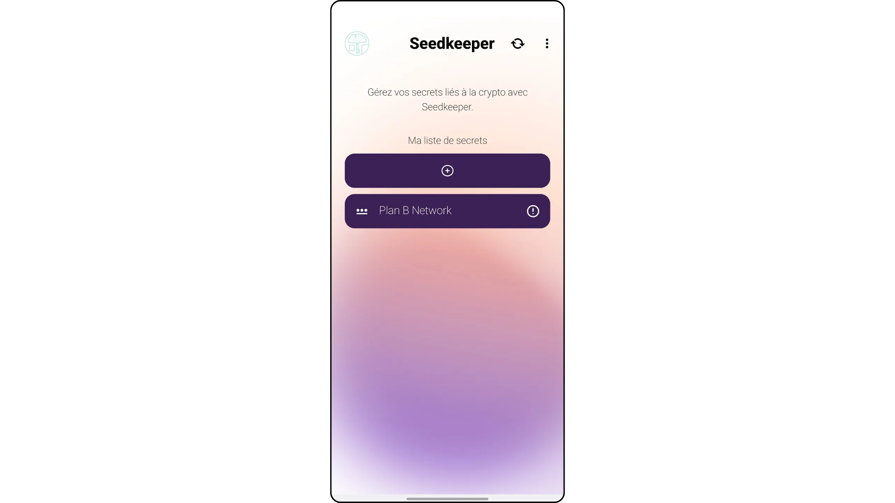

Selecione "*Fazer uma cópia de segurança*" e, em seguida, prima "*Iniciar*".

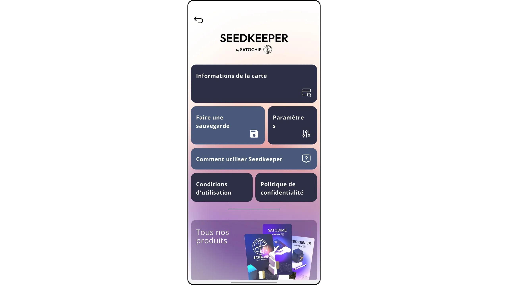

Introduza o código PIN do seu cartão de segurança (Seedkeeper n.º 2).

Em seguida, digitalizar o cartão.

Faça o mesmo com o cartão principal (Seedkeeper n.º 1) e, em seguida, clique em "*Fazer uma cópia de segurança*".

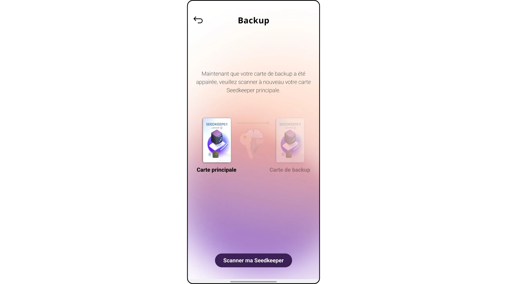

O Seedkeeper n.º 2 contém agora todos os segredos guardados no Seedkeeper n.º 1.

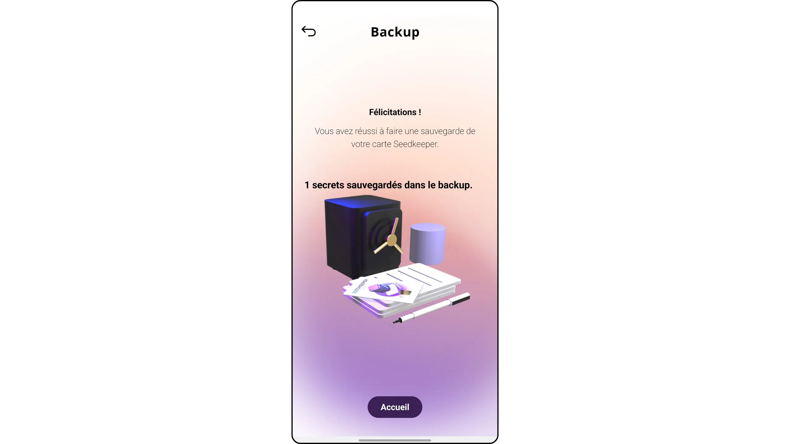

Pode digitalizar o seu Seedkeeper n.º 2 para verificar se os segredos foram copiados.

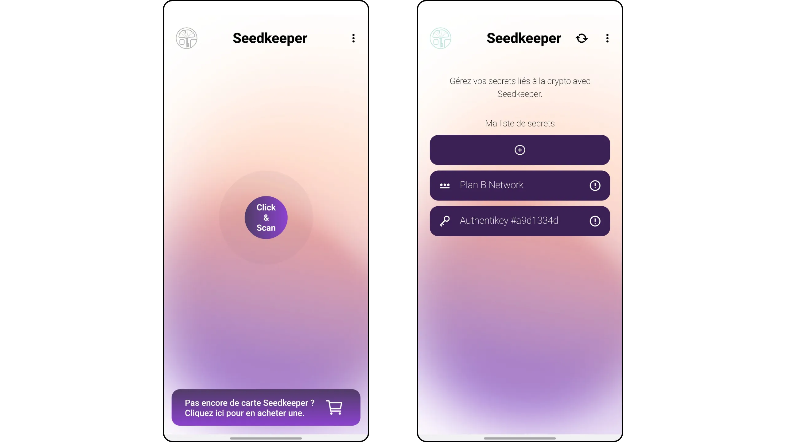

É tudo o que há para fazer! Agora você sabe como usar o Seedkeeper para armazenar suas senhas. Num futuro tutorial, veremos como usar o Seedkeeper para fazer backup de um Bitcoin wallet. Convido-o também a descobrir a sua utilização combinada com o SeedSigner :

https://planb.academy/tutorials/wallet/hardware/seedkeeper-seedsigner-45cca4c4-1f22-46bb-87ae-9cddb68aa579

https://planb.academy/tutorials/wallet/backup/seedkeeper-906dfff8-1826-4837-92d1-8669e216d356