Signal là một ứng dụng nhắn tin được mã hóa đầu cuối, được thiết kế để cung cấp tính bảo mật tốt theo mặc định. Mọi tin nhắn, cuộc gọi và tệp đều được bảo vệ bằng giao thức Signal, được công nhận là một trong những giao thức nhắn tin mạnh mẽ nhất. Nó được nhiều ứng dụng khác sử dụng lại, bao gồm WathsApp, Facebook Messenger, Skype và Google Messages để liên lạc RCS.

Signal được Moxie Marlinspike (bút danh) ra mắt vào năm 2014 và được Signal Foundation, một tổ chức phi lợi nhuận thành lập với sự hỗ trợ của Brian Acton (đồng sáng lập WhatsApp) phát triển từ năm 2018.

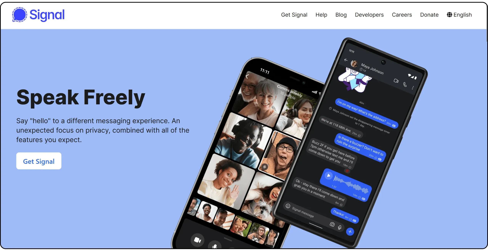

So với WhatsApp, Signal nổi bật hơn về tính minh bạch: mã của ứng dụng, cả phía máy khách và máy chủ, đều hoàn toàn là mã nguồn mở. Điều này cho phép bất kỳ ai kiểm tra và đặc biệt là kiểm tra xem mã hóa có được áp dụng như quảng cáo hay không.

Tuy nhiên, Signal dựa vào việc sử dụng số điện thoại, đây là điểm yếu chính của nó khi nói đến tính ẩn danh so với các giải pháp khác. Mặc dù vậy, theo tôi, ứng dụng này là một trong những ứng dụng đáng tin cậy nhất về mặt bảo mật và tính bí mật, nhờ vào kiến trúc hoàn toàn mở và giao thức mã hóa được áp dụng rộng rãi, do đó đã được thử nghiệm và kiểm tra, không giống như các ứng dụng khác ít quan trọng hơn.

| Ứng dụng             | E2EE 1:1       | E2EE nhóm      | Đăng ký ẩn danh     | Giấy phép client mã nguồn mở | Giấy phép server mã nguồn mở | Máy chủ phi tập trung    | Năm tạo           |
| -------------------- | -------------- | -------------- | ------------------- | ---------------------------- | ---------------------------- | ------------------------ | ----------------- |
| WhatsApp             | ✅              | ✅              | ❌                   | ❌                            | ❌                            | ❌                        | 2009              |
| WeChat               | ❌              | ❌              | ❌                   | ❌                            | ❌                            | ❌                        | 2011              |
| Facebook Messenger   | ✅              | 🟡 (tùy chọn)  | ❌                   | ❌                            | ❌                            | ❌                        | 2011              |
| Telegram             | 🟡 (tùy chọn)  | ❌              | 🟡                  | ✅                            | ❌                            | ❌                        | 2013              |
| LINE                 | ✅              | ✅              | ❌                   | ❌                            | ❌                            | ❌                        | 2011              |
| Signal               | ✅              | ✅              | ❌                   | ✅                            | ✅                            | ❌                        | 2014              |
| Threema              | ✅              | ✅              | ✅                   | ✅                            | ❌                            | ❌                        | 2012              |
| Element (Matrix)     | ✅              | ✅              | ✅                   | ✅                            | ✅                            | 🟡 (liên bang)          | 2016              |
| Delta Chat           | ✅              | ✅              | ✅                   | ✅                            | N/A                          | 🟡 (qua email)          | 2017              |
| Conversations (XMPP) | ✅              | ✅              | ✅                   | ✅                            | ✅                            | 🟡 (liên bang)          | 2014              |
| Session              | ✅              | ✅              | ✅                   | ✅                            | ✅                            | ✅                        | 2020              |
| SimpleX              | ✅              | ✅              | ✅                   | ✅                            | ✅                            | ✅                        | 2021              |
| Olvid                | ✅              | ✅              | ✅                   | ✅                            | ❌                            | 🟡(không có thư mục)    | 2019              |
| Keet                 | ✅              | ✅              | ✅                   | ❌                            | N/A                          | ✅                        | 2022              |
| Jami                 | ✅              | ✅              | ✅                   | ✅                            | N/A                          | ✅                        | 2005              |
| Briar                | ✅              | ✅              | ✅                   | ✅                            | N/A                          | ✅                        | 2018              |
| Tox                  | ✅              | ✅              | ✅                   | ✅                            | N/A                          | ✅                        | 2013              |

*E2EE = Mã hóa đầu cuối*

## Cài đặt ứng dụng Signal

Signal có sẵn trên mọi nền tảng. Bạn có thể tải ứng dụng trực tiếp từ cửa hàng ứng dụng trên điện thoại của mình:

- [Google Play](https://play.google.com/store/apps/details?id=org.thoughtcrime.securesms);
- [Cửa hàng ứng dụng](https://apps.apple.com/us/app/signal-private-messenger/id874139669);

Trên Android, bạn cũng có thể [cài đặt qua APK](https://github.com/signalapp/Signal-Android/releases).

Trong hướng dẫn này, chúng tôi sẽ tập trung vào phiên bản di động, nhưng xin lưu ý rằng [phiên bản dành cho máy tính để bàn cũng khả dụng](https://signal.org/fr/download/) (MacOS, Linux và Windows). Tuy nhiên, trước tiên bạn cần thiết lập ứng dụng dành cho thiết bị di động trước khi có thể đồng bộ hóa tài khoản của mình với phiên bản dành cho máy tính để bàn.

## Tạo một tài khoản trên Signal

Khi bạn khởi chạy ứng dụng lần đầu tiên, hãy nhấp vào nút "*Tiếp tục*".

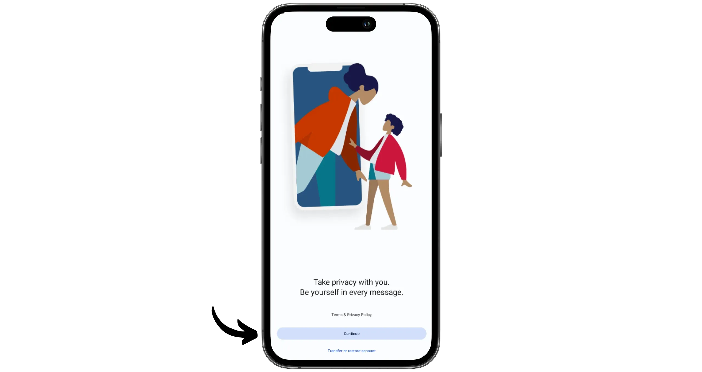

Nhập số điện thoại của bạn, sau đó nhấp vào "*Tiếp theo*".

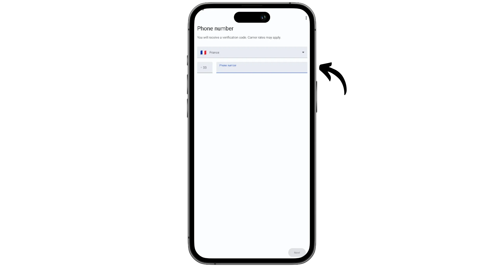

Mã xác minh sẽ được gửi đến bạn qua SMS. Nhập mã này vào ứng dụng Signal.

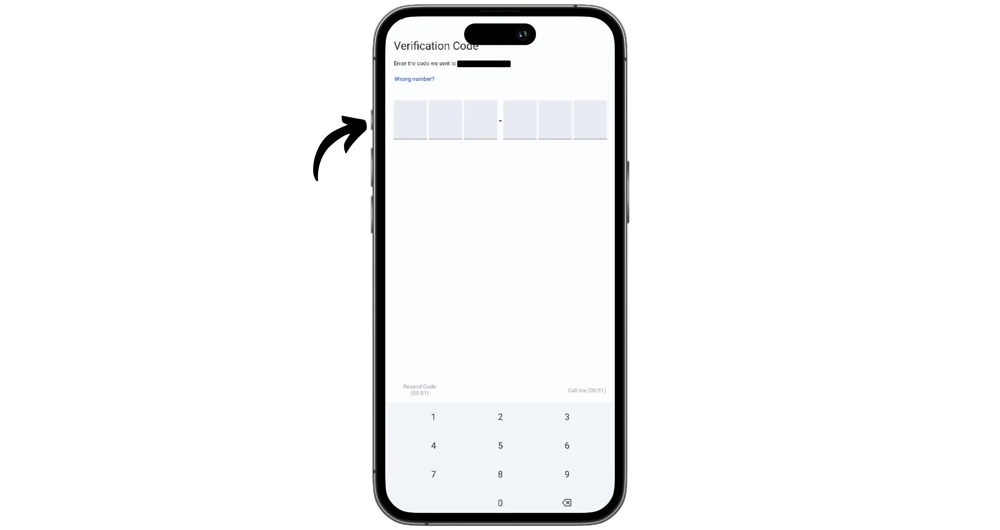

Chọn mã PIN để bảo mật tài khoản Signal của bạn. Mã này mã hóa dữ liệu của bạn và có thể được sử dụng để khôi phục quyền truy cập vào tài khoản của bạn nếu thiết bị của bạn bị mất. Vì vậy, điều quan trọng là phải chọn mã PIN mạnh, càng dài và ngẫu nhiên càng tốt, và lưu giữ hồ sơ đáng tin cậy về mã PIN đó.

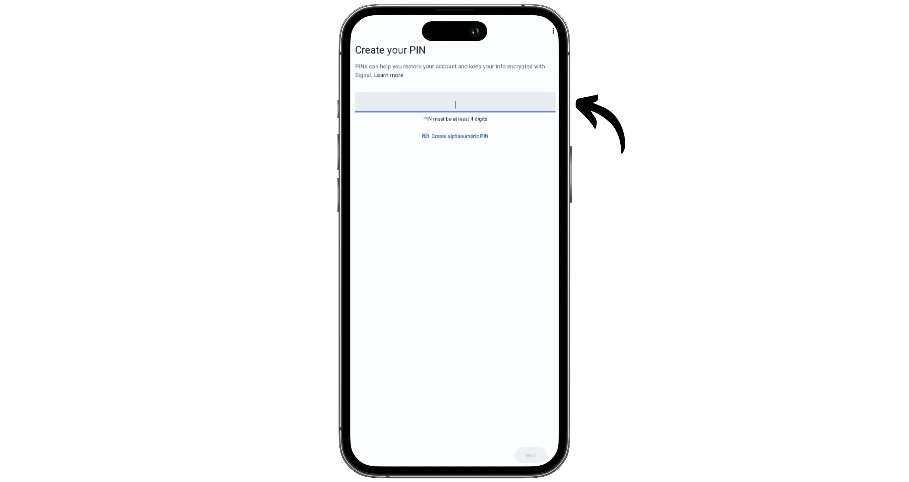

Xác nhận mã PIN này lần thứ hai.

Bây giờ bạn có thể cá nhân hóa hồ sơ người dùng của mình. Chọn một bức ảnh, nhập tên hoặc biệt danh của bạn. Ở giai đoạn này, bạn cũng có thể xác định ai có thể tìm thấy bạn trên Signal thông qua số điện thoại của bạn. Chọn "*Everyone*" nếu bạn muốn hiển thị hoặc "*Nobody*" để không thể theo dõi qua số điện thoại (sau đó bạn chỉ có thể được thêm bằng "*Username*" của mình). Sau khi đã thực hiện các lựa chọn của mình, hãy nhấp vào "*Next*".

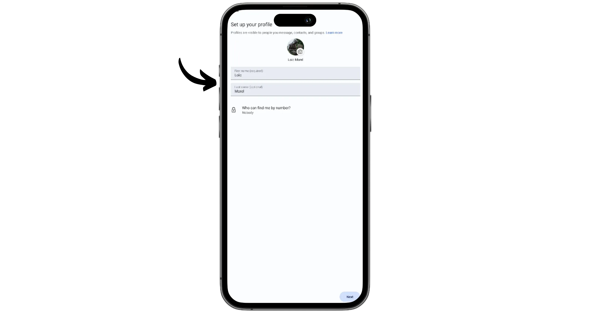

Bây giờ bạn đã kết nối với Signal và sẵn sàng nhận tin nhắn Exchange.

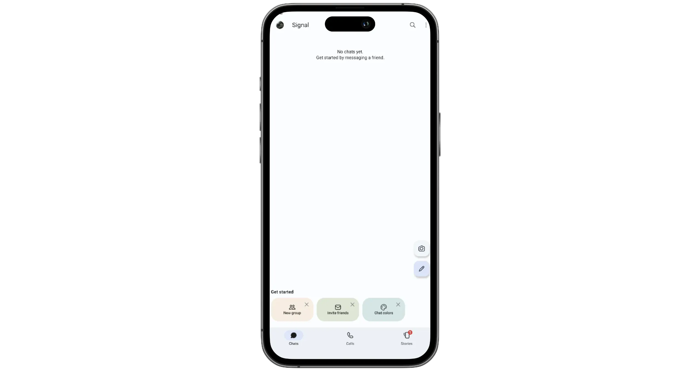

## Thiết lập tài khoản Signal của bạn

Nhấp vào ảnh hồ sơ của bạn ở góc trên bên trái để truy cập cài đặt ứng dụng.

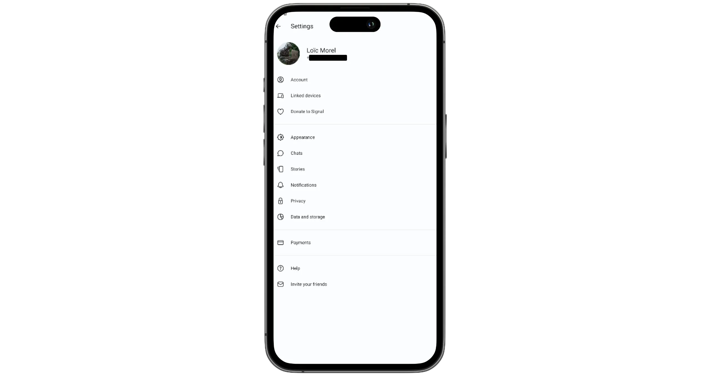

Menu "*Tài khoản*" cho phép bạn quản lý cài đặt hồ sơ của mình. Tôi khuyên bạn nên giữ nguyên cài đặt mặc định. Bạn cũng có thể kích hoạt tùy chọn "*Khóa đăng ký*", tùy chọn này bảo vệ tài khoản của bạn khỏi một số loại tấn công nhất định. Menu này cũng chứa các tùy chọn bạn cần để chuyển tài khoản của mình sang thiết bị mới.

Nhấp lại vào ảnh đại diện của bạn trong phần cài đặt sẽ đưa bạn đến các tùy chọn để cá nhân hóa đại diện của bạn. Tôi khuyên bạn nên đặt "*Tên người dùng*": điều này sẽ cho phép bạn liên lạc với những người khác mà không tiết lộ số điện thoại của bạn.

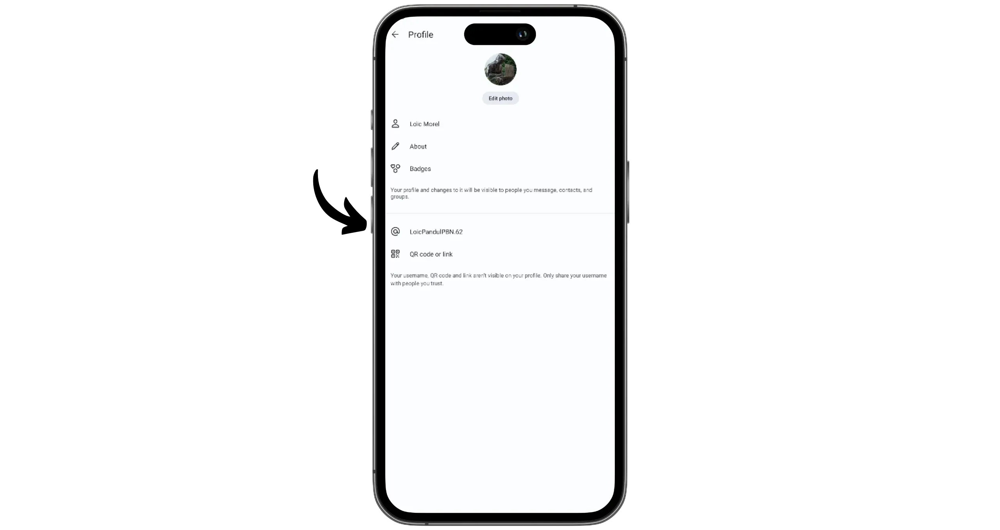

Bằng cách chọn "*Mã QR hoặc liên kết*", bạn sẽ nhận được thông tin cần thiết để chia sẻ với người muốn thêm bạn vào Signal.

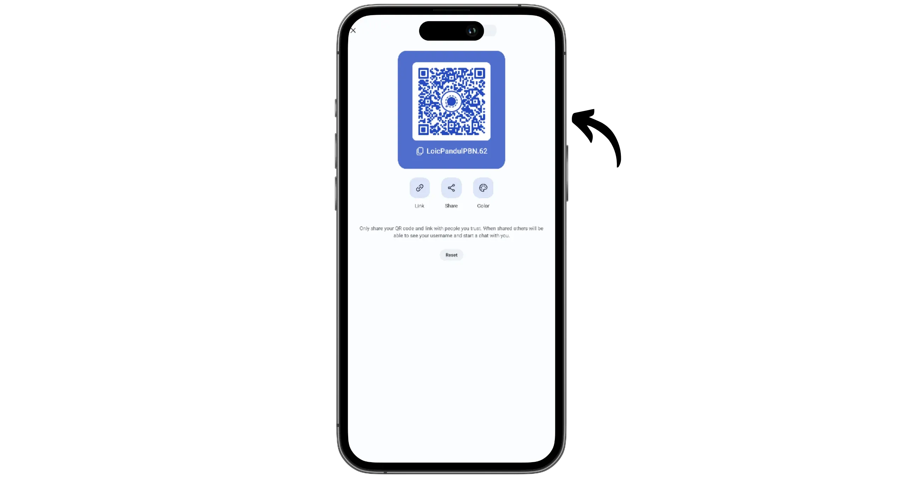

Menu "*Quyền riêng tư*" đặc biệt quan trọng. Tại đây, bạn sẽ tìm thấy các tùy chọn để kiểm soát khả năng hiển thị số điện thoại của mình, quản lý tin nhắn với danh bạ của bạn cũng như nhiều quyền khác nhau được cấp trên ứng dụng.

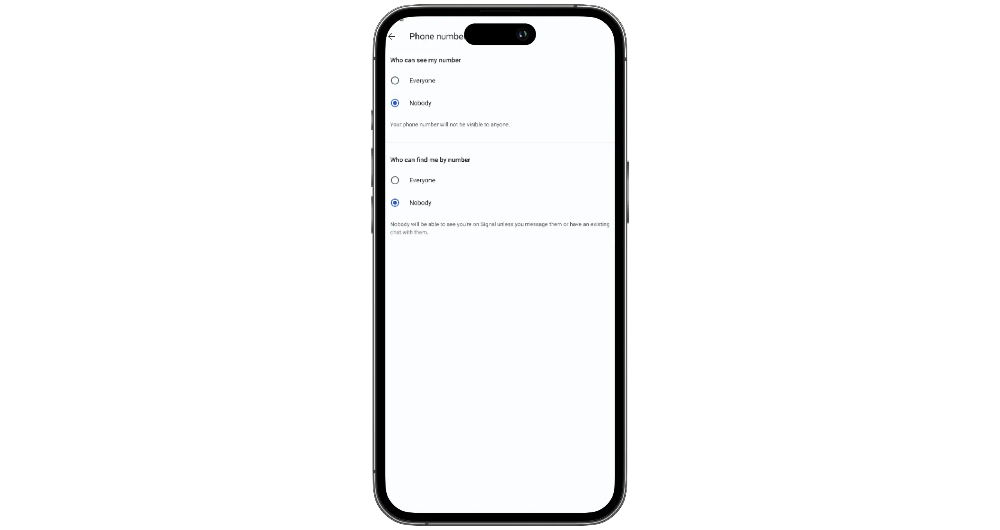

Và bạn có thể thoải mái khám phá các menu "*Giao diện*", "*Trò chuyện*" và "*Thông báo*" để tùy chỉnh Interface và hoạt động của ứng dụng theo nhu cầu cá nhân của bạn.

## Kết nối ứng dụng máy tính để bàn

Để kết nối ứng dụng máy tính để bàn, hãy bắt đầu bằng cách cài đặt phần mềm trên máy tính của bạn (xem phần đầu tiên của hướng dẫn này). Sau đó, trên điện thoại của bạn, hãy vào Cài đặt và mở phần "*Thiết bị được liên kết*".

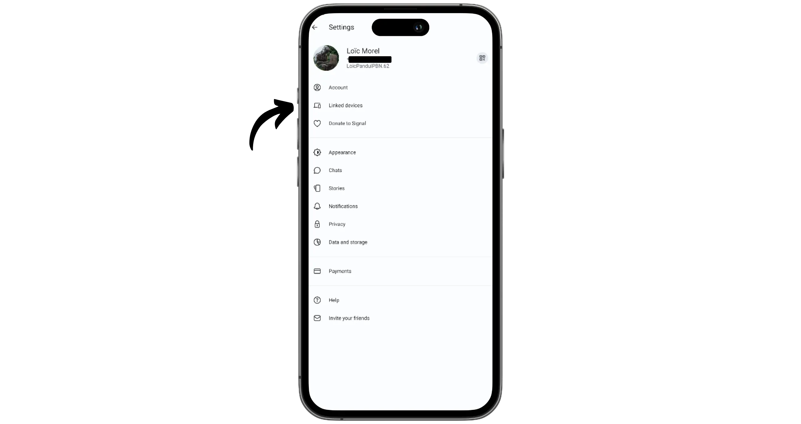

Nhấp vào nút "*Liên kết thiết bị mới*".

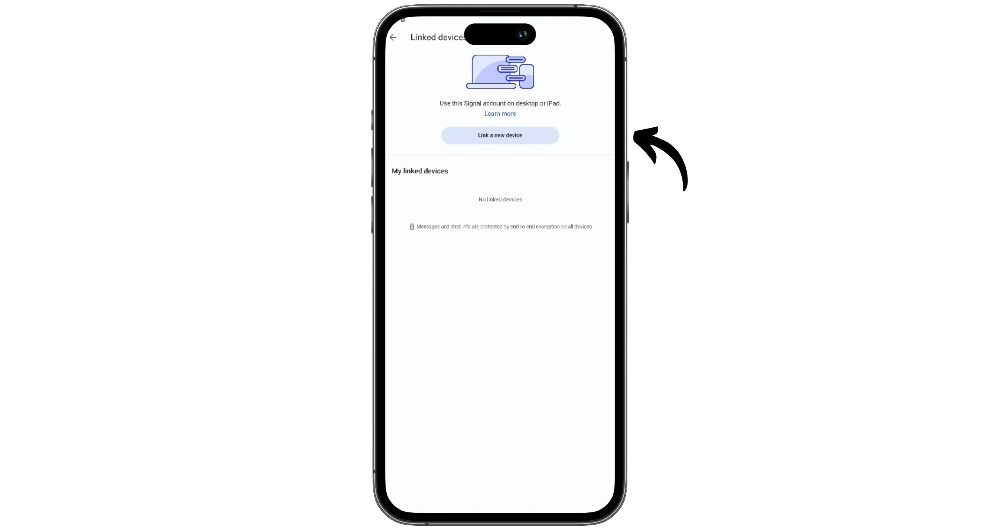

Trên máy tính, hãy khởi chạy phần mềm, sau đó quét mã QR hiển thị trên màn hình bằng điện thoại. Nếu bạn muốn nhập cuộc trò chuyện của mình, hãy chọn tùy chọn "*Chuyển lịch sử tin nhắn*".

Thiết bị của bạn hiện đã được đồng bộ hóa hoàn toàn.

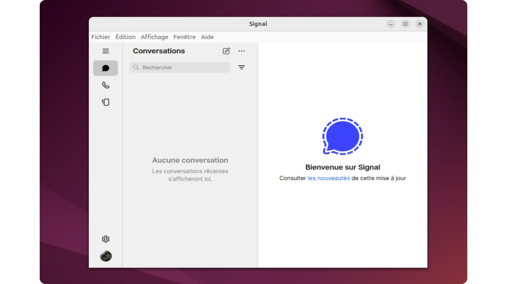

## Gửi tin nhắn bằng Signal

Để giao tiếp với ai đó trên Signal, trước tiên bạn cần thêm họ làm liên hệ. Có một số tùy chọn: bạn có thể thêm họ thông qua số điện thoại của họ (nếu người đó đã kích hoạt tùy chọn được tìm thấy bằng phương tiện này) hoặc sử dụng ID Signal của họ.

Nhấp vào biểu tượng bút chì ở góc dưới bên phải của Interface.

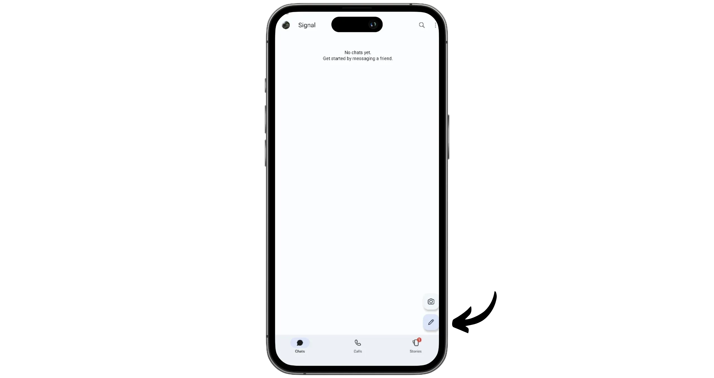

Trong trường hợp của tôi, tôi muốn thêm người theo tên người dùng. Vì vậy, tôi nhấp vào "*Tìm theo tên người dùng*".

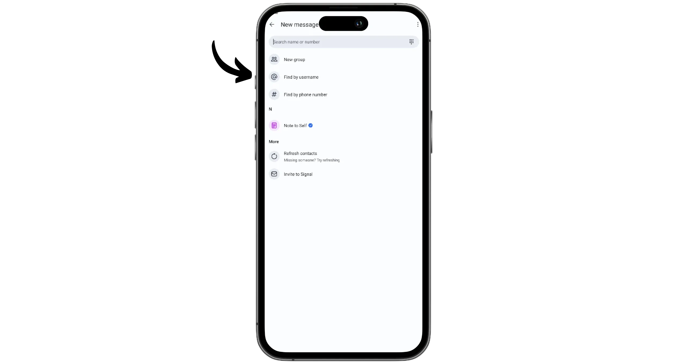

Sau đó, bạn có thể dán thông tin đăng nhập hoặc quét mã QR.

Gửi cho anh ấy một tin nhắn để thiết lập liên lạc.

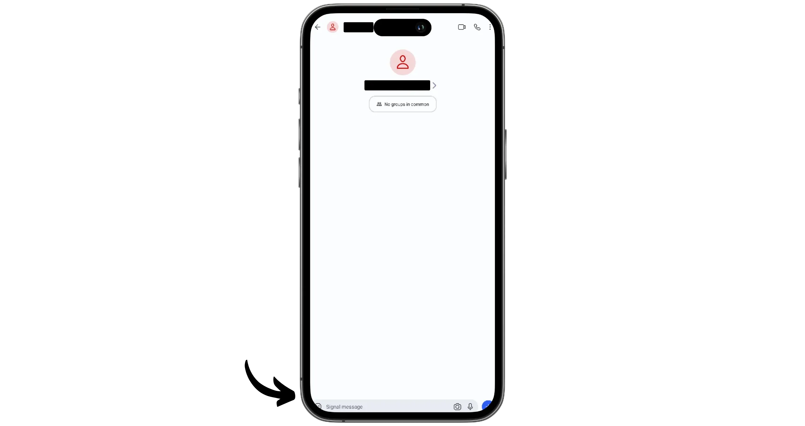

Cuộc trò chuyện sau đó sẽ xuất hiện trên trang chủ. Nếu người đó chấp nhận yêu cầu liên hệ của bạn, bạn sẽ thấy tên và ảnh hồ sơ của họ.

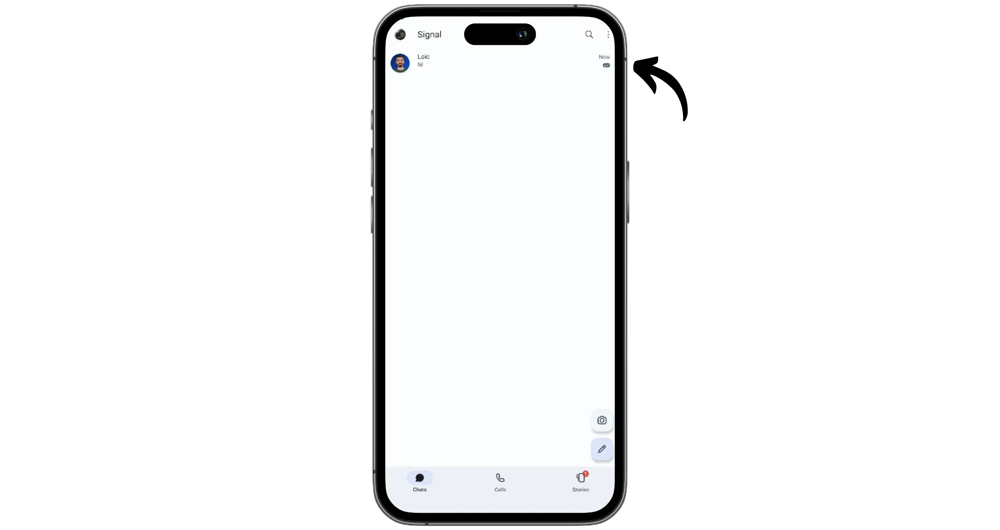

Xin chúc mừng, giờ bạn đã nắm được cách sử dụng Signal messaging, một giải pháp thay thế tuyệt vời cho WathsApp! Nếu bạn thấy hướng dẫn này hữu ích, tôi sẽ rất biết ơn nếu bạn để lại một ngón tay cái Green bên dưới. Hãy thoải mái chia sẻ hướng dẫn này trên các mạng xã hội của bạn. Cảm ơn bạn rất nhiều!

Tôi cũng giới thiệu cho bạn hướng dẫn khác này, trong đó tôi giới thiệu cho bạn Proton Mail, một giải pháp thay thế thân thiện hơn nhiều với quyền riêng tư cho Gmail:

https://planb.network/tutorials/computer-security/communication/proton-mail-c3b010ce-254d-4546-b382-19ab9261c6a2