## Giriş = e-posta = gizlilik kaybı

Dijital dünyada, erişmek istenilen her platform için bir hesap sahibi olmak standart bir uygulama haline gelmiştir.

Bu hizmetlerin her biri, genellikle _kullanıcı_adı_ ve _parola_ çifti ile ilişkilendirilen bir oturum açma gerektirir. Kullanıcı adı genellikle kullanıcının kişisel e-postasıdır.

Her oturum açma için kişinin kişisel e-posta Address'ı kullanıldığında, ilk sonucu hayal etmek kolaydır: gizlilik kaybı, Address _name.surname@serviceemail.com_ adresinden oluşuyorsa bu büyük bir sorun haline gelir.

Açık kaynak araçları geliştiricileri, tam da kullanıcıların gizliliklerini bir nebze olsun geri kazanmalarını sağlamak amacıyla bir dizi uygulama paketi oluşturdu: Kullanıcılar yine de oturum açacak, ancak özel kimliklerini ortaya çıkaran araç yerine bir takma ad kullanacaklar.

Şahsen denediklerim ve hala test ettiklerim arasında en basit olanı [Simple Login] (https://simplelogin.io/).

## Takma ad

Bir e-posta takma adı, e-posta Address'inizin _ad.surname_ kısmını hayali bir adla değiştirir. Kullanıcı için hiçbir şey değişmez; takma ad hizmeti e-postaları normal Address'e ve normal Address'den iletir. Herkes her zaman yaptığı gibi gelen kutusunu kullanmaya devam edebilir, ancak gerçek adlarını görüntülemek yerine tanınmayan bir kullanıcı gösterecektir. Bu hizmetin verimli olması gerekiyor ve şimdiye kadar Simple Login tam da bunu kanıtladı.

Simple Login sitesini ilk kez ziyaret ettiğinizde, "resmi" e-posta Address'yi kullanarak bir hesap oluşturmalısınız (burada da!). Burada, e-postayı, bir şifre girmeli ve bir captcha çözmelisiniz.

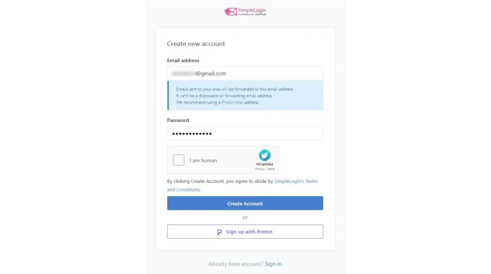

Simple Login, belirtilen Address e-postasına bir doğrulama mesajı gönderir. Doğrulama düğmesine tıklamak yerine, bağlantının kopyalanması ve Address çubuğuna yapıştırılması tavsiye edilir.

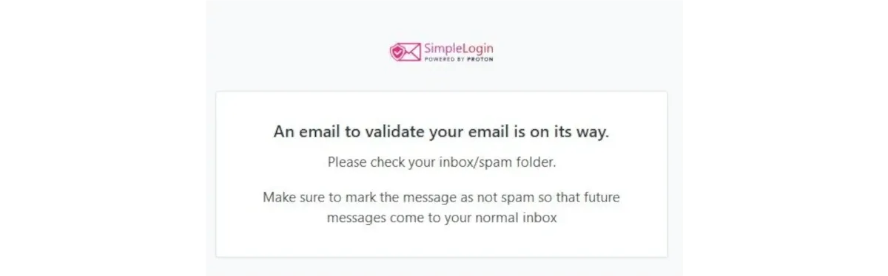

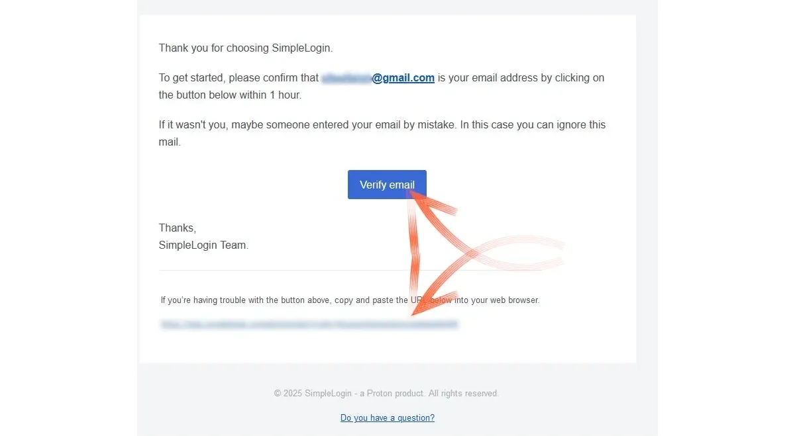

Basit Oturum Açma panosu, gezinme için kısa bir öğretici ile hemen açılır.

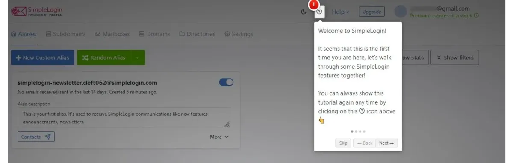

Simple Login'in haber bülteni aboneliğini otomatik olarak etkinleştirdiği ve bunun ilgili komuttan devre dışı bırakılabileceği unutulmamalıdır.

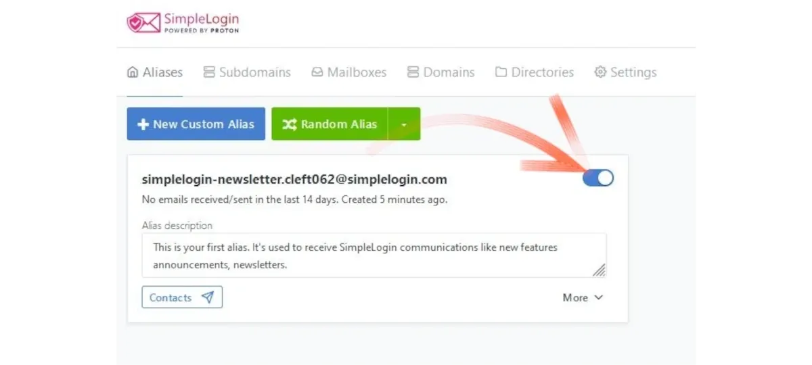

## Ayarlar

Hizmetin özelliklerini keşfetmek için hemen _Ayarlar_ bölümüne göz atabilirsiniz. Basit Giriş, 10 gün boyunca kullanılabilir kalan _Premium_ olanlar da dahil olmak üzere tüm seçenekler aktif olarak başlar. Deneme süresi sona erdiğinde, bu profille 10 takma ad oluşturma olanağına sahip olacaksınız ve Simple Login İsviçre e-posta sağlayıcısı tarafından satın alındığı için Proton e-postanızı doğrudan bağlayabilirsiniz.

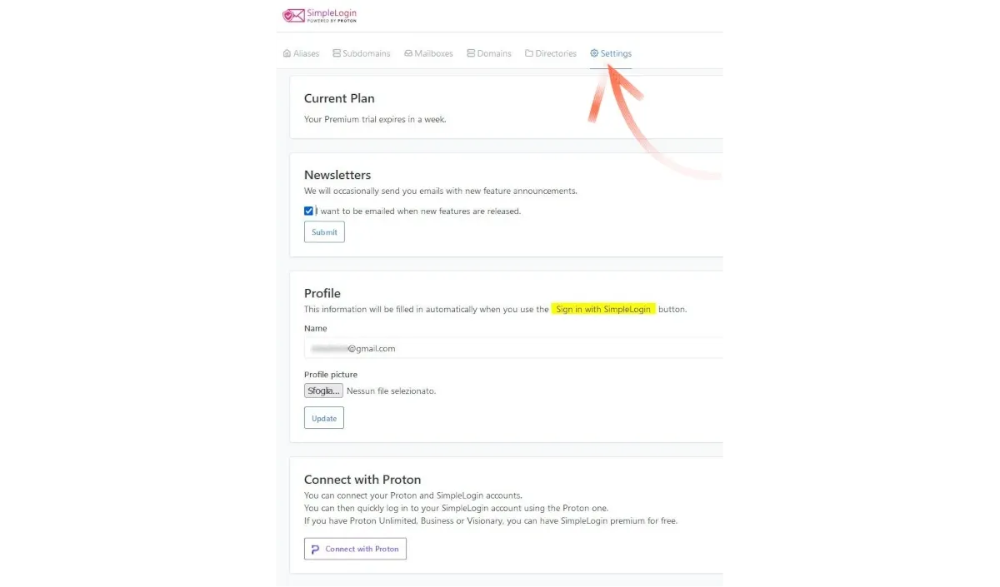

Bir dizi parametre ayarlayabilir veya e-postanızın gizlilik açısından zaten tehlikeye atılıp atılmadığını kontrol edebilirsiniz.

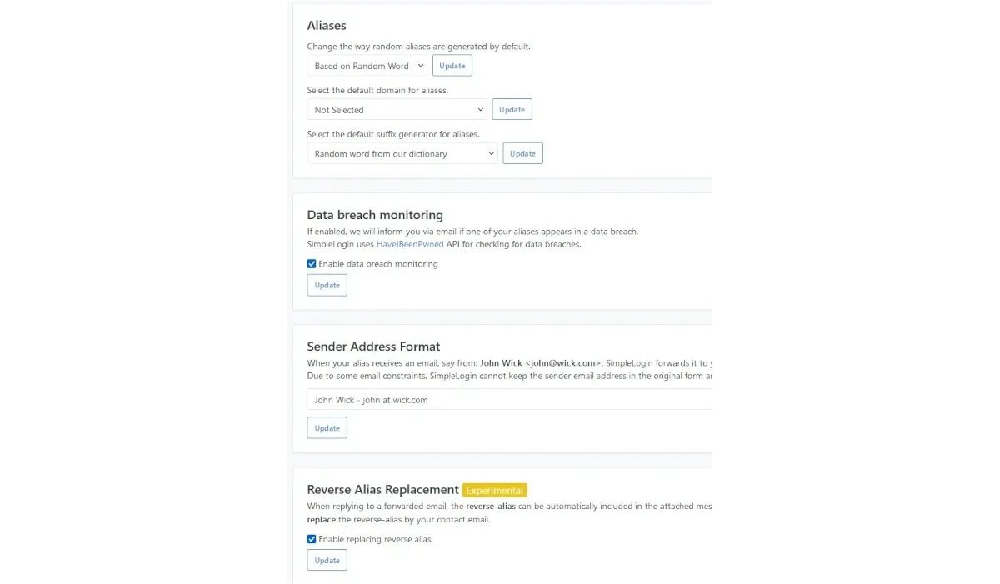

Son olarak, profilinizin bir yedeğini dışa aktarabilir veya başka bir sağlayıcıdan içe aktarabilirsiniz.

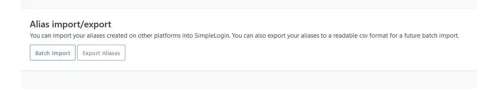

### İş E-postası

İş e-postası olarak kişisel bir alan adı ile e-posta kullananlar özel alan adlarını ayarlayabilirler.

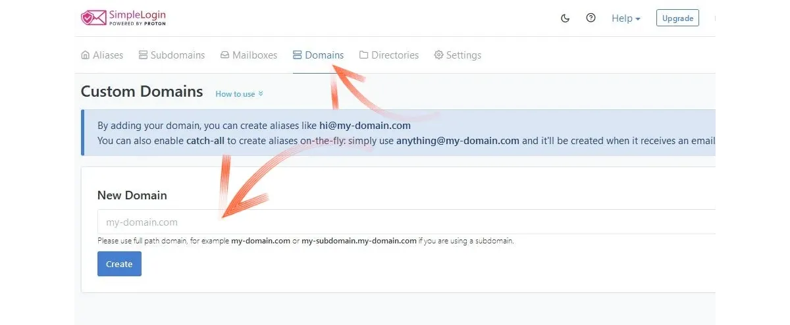

Ana panelden _Mailboxes_ seçerek, başka e-posta adresleri eklemek ve buna göre oluşturulacak takma adları kullanmak da mümkündür. Örneğin bu eğitimde, profili bir _gmail.com_ posta kutusu ile oluşturmaya ve ardından bir _proton.me_ Address ile ilişkilendirmeye karar verdim.

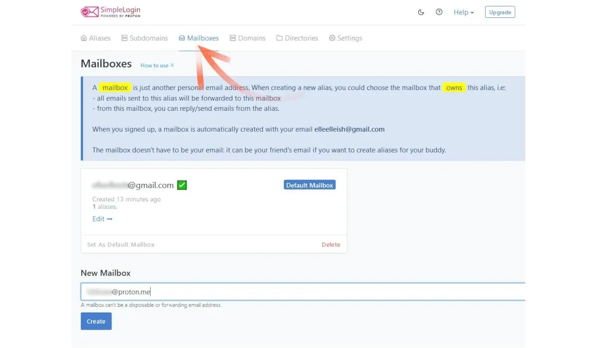

Yeni bir Address eklerken, özellikle Proton sağlayıcısına aitse, kılavuzlu prosedür _sudo_ moduna, süper kullanıcıya girme olasılığını gösterir. Basit Giriş, meşru Ownership'i kanıtlamak için bu posta kutusunun şifresini girmenizi isteyecektir.

⚠️ **Ben şahsen bunu yapmamanızı tavsiye ederim**. ⚠️

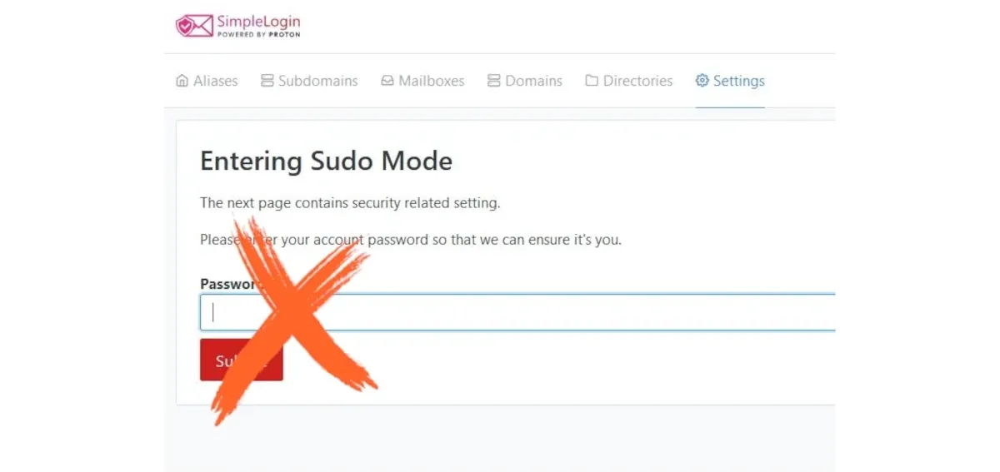

**E-posta kutusuna erişmek -> doğrulama bağlantısını kopyalayıp URL çubuğuna yapıştırmak -> ve şifreyi açıklamadan doğrulamayı almak daha iyidir.**

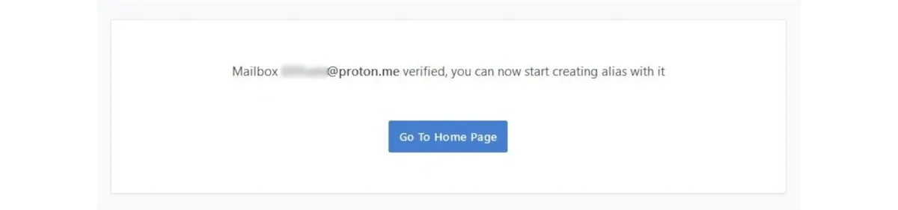

Girilen iki adresten biri varsayılan, diğeri ikincil adres olur, ancak bunlar kolayca değiştirilebilir ve ayar gösterge tablosunda kolayca tanımlanabilir.

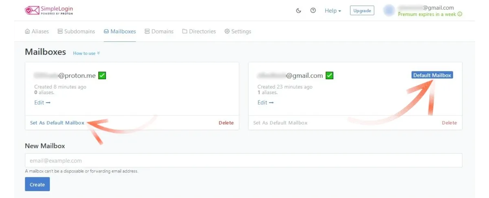

İkinci bir e-posta Address (isteğe bağlı) ekledikten sonra, Simple Login ile neler yapabileceğimizi görelim.

## Takma adların oluşturulması

Panelde, ilk menü seçeneği _Alias_ olarak etiketlenmiştir, bu da onları oluşturabileceğiniz yerdir. Bir sonraki fotoğrafta gösterilen Green düğmesi olan Rastgele Takma Ad düğmesine tıklayarak generate takma adlarını rastgele oluşturma seçeneğiniz vardır. Bu özellik benzersiz ve ilgi çekici bir e-posta Address oluşturur.

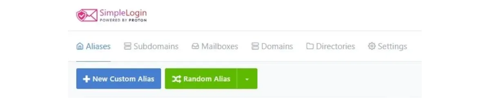

Bununla birlikte, hizmetleri farklı isimler vererek farklılaştırmak istiyorsanız, _Yeni Özel Takma Ad_ seçeneğini seçmelisiniz. Bunu yaparak, takma ada erişmek istediğiniz hizmetin adını verebilirsiniz (sosyal medya, hizmet sağlayıcılar, çevrimiçi etkinlikler, tesadüfen tanışılan yabancılar vb.) Gerisi Simple Login tarafından halledilir.

Eğlenmek için (ama doğruyu söylemek gerekirse pek değil) banka için bir takma ad oluşturmaya karar verdim ve adını `BANK` koydum. Bankamın benim hakkımda her şeyi bildiği doğru olsa da, onlarla anlaşılmaz bir e-posta Address kullanarak iletişim kurmayı eğlenceli buluyorum. Simple Login gerçekten de rastgele bir isim üretiyor ve bu isim bizim seçtiğimiz isimden `.` ile ayrılıyor

Burada, yeni e-posta Address olabilir:

- bank.breeding123@aleeas.com
- bank.platter456@slmails.com
- bank.preoccupy789@8shield.net
- ve bunun gibi

Birden fazla alan adı seçilebilir: herkese açık olanlar ücretsiz planla kullanılabilirken, özel olarak belirtilen diğerleri (_@simplelogin.com_ dahil), ücretli bir plana abone olmaya karar veren kullanıcılar için seçenekleri genişletir.

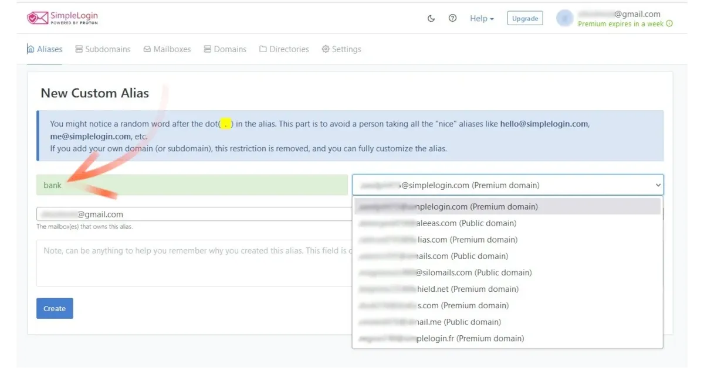

Rastgele sonek ve alan adı seçildikten sonra, bu yeni (ve tuhaf) Address'ün kişisel e-posta kutularından sadece biri için mi yoksa hepsi için mi takma ad olarak kullanılacağını ayarlayabilirsiniz. Oluştur_'a tıkladıktan sonra takma ad hazır ve etkin hale gelir

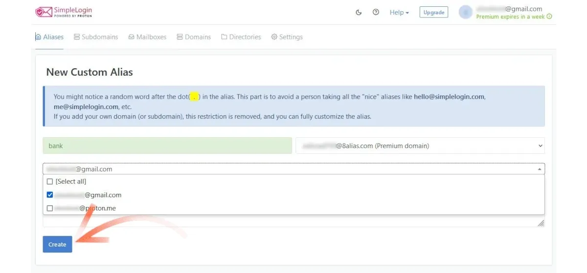

Yeni e-posta Address oluşturuldu ve artık görünür durumda, sadece kopyalanarak gönderilmeye (bankaya!) hazır.

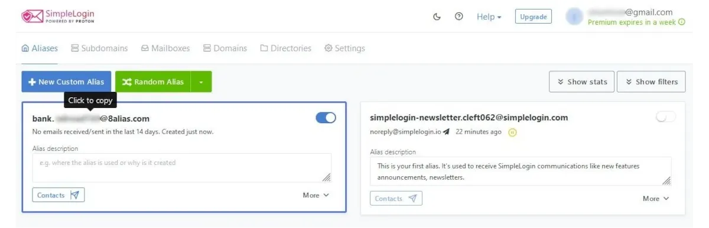

Bu noktada, erişmek istediğiniz ve hesap oluşturmak için temel bir parametre olarak e-postanın gerekli olduğu her hizmet veya platform için bir takma ad oluşturmaya odaklanabilirsiniz.

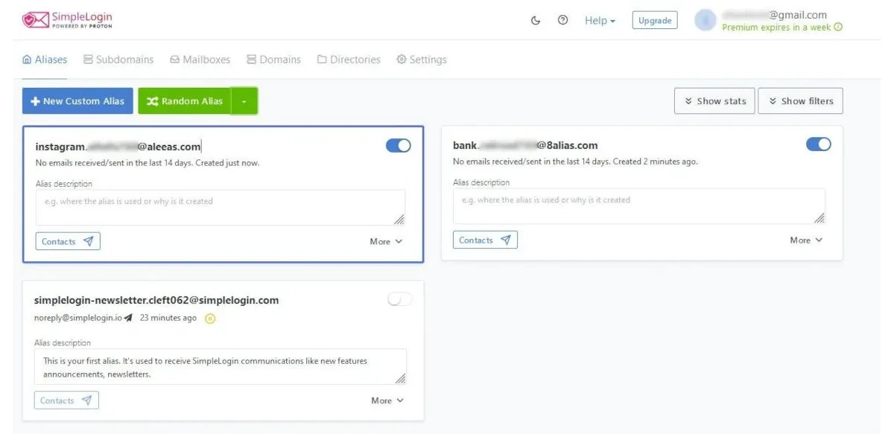

Gizlilik meraklıları için, merkezi taraflarca kontrol edilmeyen benzersiz bir 128 bit tanımlayıcı oluşturan UUID protokolüne (tanımlanabilir adlara değil) dayalı bir e-posta generate Address seçeneği de vardır. Hassas hesaplar için kullanışlı olan bu özellik _Random Alias_ menüsünde bulunabilir.

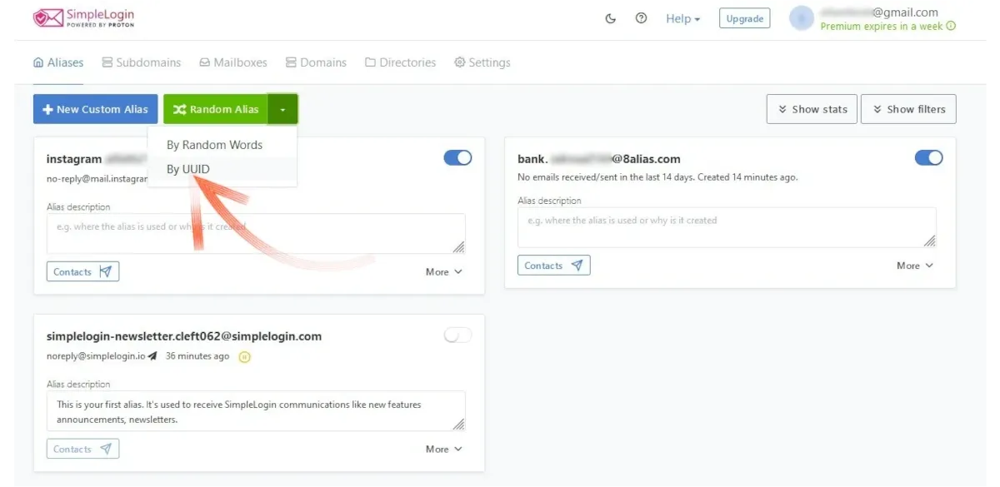

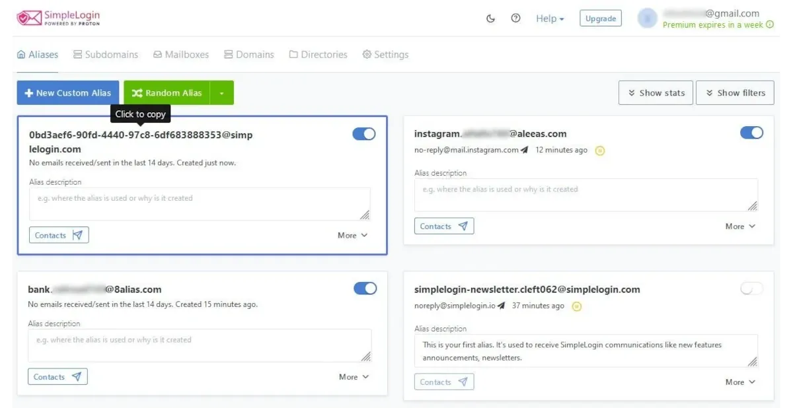

Gördüğünüz gibi bu, doğru yönetim gerektiren bir e-posta Address'dir.

Fikrinizi değiştirir ve artık bir takma ad kullanmak istemezseniz, her bir takma adın _Diğer_ komutuna tıklamanız ve _Sil_ seçeneğini seçmeniz yeterlidir.

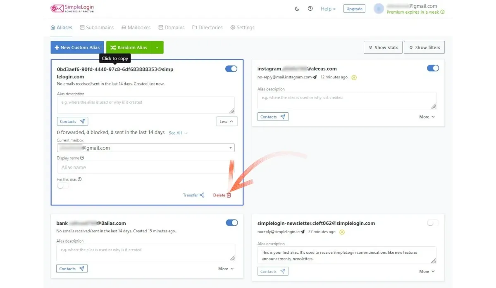

## Takma Ad Yönetimi

Takma adların oluşturulması da yönetimi gibi basittir ve sadece biraz dikkat ve disiplin gerektirir. Aslında tüm trafik, başlangıçta resmi olarak tanımladığımız e-posta gelen kutusundan geçmeye devam edecektir. Platformlardan gelen bildirimler ve önemli iletişimler Gmail, Proton veya e-posta sağlayıcınız her ne ise ona ulaşmaya devam edecektir.

Ancak sonuç, takma adların oluşturulduğu andan itibaren kime ifşa edip etmeyeceğimize karar vermekte özgür olduğumuz ana Address'i korumuş olmamızdır.

Bir takma ad hem alma hem de gönderme için çalışır: başka bir kullanıcı, söz konusu alıcı için seçilen takma ad buysa, alias.preoccupy789@8shield.net adresinden gelen yanıtı gerçekten alacaktır.

## Artıları

Genel olarak, takma ad kullanmak kimliğinizi ve gizliliğinizi korumanın etkili bir yoludur. E-posta adresleri genellikle veri aracıları ve web siteleri tarafından kullanıcı alışkanlıklarını ve davranışlarını izlemek için toplanır. Bir takma ad sizi tamamen izlenemez yapmasa da, sürekli olarak bir takma ad kullanmak bilgilerinizi korumaya yönelik olumlu bir adımdır. Ayrıca, bilgisayar korsanlığı, veri satışı ve güvenlik ihlallerinin çok yaygın olduğu "küresel dijital köyümüzde", çeşitli web sitelerine kaydolmak için kullandığınız e-postanın zaten tehlikeye atılmış veya hedef alınmış olması muhtemeldir.

Her giriş için kullanılan benzersiz bir takma ad, **posta kutumuza hangi platformun spam (veya daha kötüsü) gönderdiğini hemen anlamamızı sağlar, çünkü e-posta kendisiyle ilişkili takma adla tanımlanır**. Bankalar için bir takma ad, posta hizmetleri için bir takma ad veya bazı zorunlu devlet hizmetleri için özel bir takma ad kullanmaya başlayana kadar, kurumsal oldukları için sözde güvenilir kanallardan ne kadar spam ve kimlik avı geldiği hakkında hiçbir fikriniz yoktur. Spam'i (ya da daha kötüsünü) gönderenin kimliği tespit edildiğinde, o sitenin ele geçirildiğini anlayacak ve söz konusu web sitesine sağlanan tüm verileri (kredi kartlarını düşünün!) korumak için her türlü önlemi alacaksınız, bu da ihlali haftalar sonra fark edebilir.

Basit Giriş ile ilgili olarak, bu araç aşağıdaki özelliklere sahiptir:

- mobil uygulaması (ayrıca F-Droid'den) ve tarayıcı uzantısı, her durumda takma adları yönetmek için;
- her yeni takma ad için iki faktörlü kimlik doğrulama, bu da hizmetin kendisinden bağımsızlık derecesini artırır;
- PGP desteği (_Premium kullanıcıları için);
- her tür takma adın (özel, rastgele ve UUID) basit bir şekilde oluşturulması;
- sektördeki ücretsiz planlar arasında, daha fazla "resmi" e-posta kutusu ile takma ad kullanma yeteneği. Diğer rakipler sadece bir taneyle sınırlıdır.

## Eksiler

- simple Login'i yoğun bir şekilde kullanmayı planlıyorsanız 10 takma ad yeterli olmayabilir. Bu durumda, oldukça uygun fiyatlı olan ücretli plan, mevcut olası takma adların sayısını artırmak için kullanışlıdır.
- Belirli bir isim ve alan adı ile takma ad oluşturmak mümkün değildir. Tarafımızdan seçilen bir adın ardından eklenen rastgele son ek, en iyi ihtimalle tuhaf olarak tanımlanabilecek bir Address oluşturur. Geleneksel sosyal medya genellikle bu tür e-posta adresleriyle oluşturulan hesaplara izin vermeyi reddeder. Nostr bunu düzeltiyor!
- Birine mesaj göndermek için bir takma ad kullanırsanız, alıcının spam klasörüne düşmesi kolaydır. İlk adım olarak, tıpkı bir hesap oluştururken, bir posta listesine abone olurken vb. olduğu gibi, almak için takma ad kullanmanız önerilir.